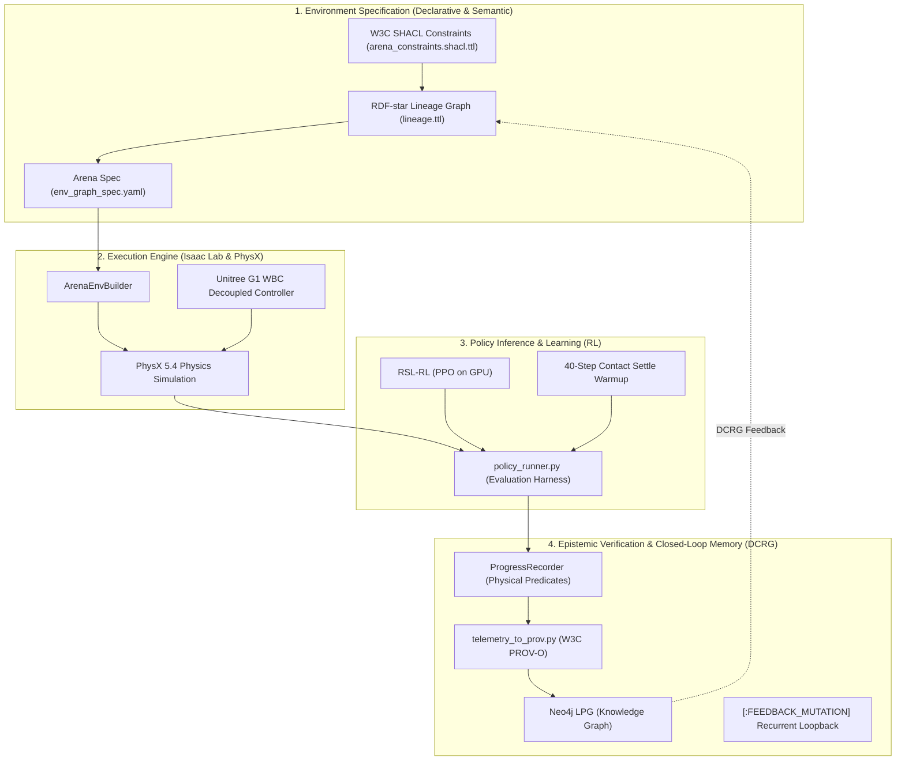

# Agent references — start here

- **Updated**: 2026-09-18
- **Current focus**: SBOM planning. Workflow implementation is on hold for this work; its progress and remaining verification limits belong to the existing implementation handoff. No complete deployed workflow or dashboard reliability acceptance is implied.
- **Purpose**: navigation and document ownership, not proof of runtime success or authorization to execute an old plan.

## Current reading order

1. **[SBOM creation plan 01](SBOM/sbom_creation_plan_01.md)** — current documentation-only task: source/profile/image coverage, tooling, collection boundaries, phases and acceptance gates. No scanner installation or SBOM generation is claimed.
2. **[Dashboard checkpoint](plans/dashboard_cli_workflow_parity/research-stack-implementation-handoff.md)** — the existing workflow implementation handoff: implemented changes, last-known queue/runtime state, evidence limits and commit boundary.
3. **[Session memory](quick_notes/session_memory.md)** — event-modeling/DDD study, actual CLI boundaries, proposed application-owned Neo4j orchestration and code consolidation, narrow trajectory-tool fix with evidence, and unresolved terminal interruption. Earlier research notes remain below its historical boundary.
4. **[Historical implementation log](plans/dashboard_cli_workflow_parity/implementation-progress.md)** — detailed chronology only. Do not combine its contradictory “current” checkpoints into a new acceptance claim.

The current request authorizes an SBOM plan, not scanner installation, scans, service startup or publication. Do not restart workflow implementation, services or queued work from older authorization language; no staging/commit is part of this task.

## Document roles

| Material | Role | How to use it |
| --- | --- | --- |
| Workflow implementation handoff above | Workflow status owner | Update rather than create another competing implementation handoff |
| [SBOM creation plan 01](SBOM/sbom_creation_plan_01.md) | SBOM scope and phased execution plan | Source inventories, installed images and deployment/research provenance are separate subjects; execution gates remain explicit |
| Session memory | Session decision record | Preserve the pause and recovery context, not another full progress log |
| [Dashboard design](plans/dashboard_cli_workflow_parity.md) | Retained design / scope history | Not an instruction to continue implementation |
| [Endpoint contracts](plans/dashboard_cli_workflow_parity/endpoint-contract-plan.md) | Retained API/action design | Source inventory and live acceptance are different |
| [Research-stack design](plans/dashboard_cli_workflow_parity/research-stack-readiness.md) | Retained lifecycle/readiness design | Distinguish helper pairing, API sessions, credentials and queue dispatch |
| [Model-profile contract](plans/dashboard_cli_workflow_parity/model-profile-contract.md) | Implemented interface contract | Does not certify provider compatibility |
| [Event Mapping Refactoring Plan 03](plans/event-mapping-refactoring_plan_03.md) | Bottom-up DDD/Neo4j-only application and full GraphQL contracts; not execution authorization | Event/ownership mapping → shared commands/read models → GraphQL/default CLI → joined live generation/native/policy gates; dashboard deferred |
| [Plan 03 review ledger](plans/event-mapping-refactoring_plan_03-review.md) | Source-grounded review and correction record | Baseline, findings, requirement coverage and documentation checks; not live acceptance |
| [Event Mapping Refactoring Plan 02](plans/event-mapping-refactoring_plan_02.md) | Successor design proposal; not implementation authorization | Application-owned CLI-first verification, evidence/repair contracts, Neo4j authority, staged migration and file-level action plan |
| [Plan 02 review ledger](plans/event-mapping-refactoring_plan_02-review.md) | Bounded exploration/critique coverage and finding dispositions | Source-bound review evidence and unresolved verification obligations; not implementation status |
| [Event Mapping Refactoring Plan 01](plans/event-mapping-refactoring_plan_01.md) | Historical proposal, superseded for design by plan 02 | Preserve discussion history; its implementation sketches are not a complete migration contract |
| Evidence JSON and `*-owner-status.md` in the dashboard folder | Scope-specific historical records | Use the checkpoint's evidence map; do not sum overlapping totals or infer current deployment |
| `agentic_env_generation/`, `docs/`, other `plans/` and `quick_notes/` | Research history and domain references | Check original dates, source and experiments; unrelated claims were not re-audited here |

The operational baseline is the repository's [agentic generation README](../../isaaclab_arena_examples/agentic_environment_generation/README.md). A commit does not reproduce private host installation/state or ignored runtime/test artifacts. Preserve history, but keep current status in one place.

<details>
<summary>Older reference-library overview (2026-09-09; historical, not revalidated)</summary>

The index, architecture labels, example commands and milestone claims below are preserved as historical context. Their “active,” “canonical,” “completed” and “proved” wording is not a current verification result or instruction to run workloads. Absolute file links refer to the original environment.

---

## 1. System Architecture Map



---

## 2. Directory Structure & Status Matrix

| Subdirectory | Role / Description | Status |
| :--- | :--- | :--- |
| [`agentic_env_generation/`](file:///workspaces/IsaacLab-Arena/.agents/references/agentic_env_generation) | Core Semantic Web, RDF-star, LPG, and DCRG mathematical specifications | **ACTIVE / CANONICAL** |
| [`plans/`](file:///workspaces/IsaacLab-Arena/.agents/references/plans) | Technical execution plans, historical experiments, and remediation designs | **CURATED (See Index Below)** |
| [`docs/`](file:///workspaces/IsaacLab-Arena/.agents/references/docs) | Developer onboarding, environment setup, and foundational guides | **ACTIVE / CANONICAL** |
| [`quick_notes/`](file:///workspaces/IsaacLab-Arena/.agents/references/quick_notes) | Session checkpoints, empirical notes, and environment gotchas | **REFERENCE / AUDIT** |
| [`templates/`](file:///workspaces/IsaacLab-Arena/.agents/references/templates) | Standard template schemas for specs and tasks | **ACTIVE / TEMPLATES** |

---

## 3. Curated Document Index

### A. Core Architecture (`agentic_env_generation/`)
These documents form the theoretical and operational foundation of the agentic generation pipeline:
1. **[dcrg_active_inference_paradigm_shift.md](file:///workspaces/IsaacLab-Arena/.agents/references/agentic_env_generation/dcrg_active_inference_paradigm_shift.md)**: **[CRITICAL]** The mathematical foundation of Directed Cyclic Relational Graphs (DCRG) vs deterministic acyclic graphs.
2. **[graph_topology_and_rdf_star_proof.md](file:///workspaces/IsaacLab-Arena/.agents/references/agentic_env_generation/graph_topology_and_rdf_star_proof.md)**: Mathematical proof of topological stability and RDF-star reification.
3. **[rdf_star_lpg_provo_plan.md](file:///workspaces/IsaacLab-Arena/.agents/references/agentic_env_generation/rdf_star_lpg_provo_plan.md)**: Complete implementation guide for the 4-layer Semantic Web / Neo4j pipeline.
4. **[agentic_env_generation.md](file:///workspaces/IsaacLab-Arena/.agents/references/agentic_env_generation/agentic_env_generation.md)**: The 6-tier verification pipeline from text prompt to closed-loop execution.
5. **[env_gen_cheatsheet.md](file:///workspaces/IsaacLab-Arena/.agents/references/agentic_env_generation/env_gen_cheatsheet.md)**: Quick-reference CLI commands for generating, inspecting, and lowering scenes.
6. **[causality_notes.md](file:///workspaces/IsaacLab-Arena/.agents/references/agentic_env_generation/causality_notes.md)**: Causal factor analysis of robot manipulability and object affordances.
7. **[active_inference_test.md](file:///workspaces/IsaacLab-Arena/.agents/references/agentic_env_generation/active_inference_test.md)**: Test suite documentation for SHACL and Neo4j validation.

---

### B. Execution Plans (`plans/`)
Execution plans record technical interventions. Use this status guide to distinguish active vs historical plans:

#### Active / Current Plans:
- **[g1_manipulation_trajectory_and_meta_learning_plan.md](file:///workspaces/IsaacLab-Arena/.agents/references/plans/g1_manipulation_trajectory_and_meta_learning_plan.md)**: **[ACTIVE TRAJECTORY & META-LEARNING PLAN]** Resolving the trajectory generation, contact exploration, and action space dimensionality bottlenecks using Task-Space Diff-IK ($\mathbb{R}^7$), Multi-Keypoint Guidance, and RAPTOR-style Privileged Teacher $\to$ Recurrent In-Context Student Distillation. *Milestones M1 (7-D Diff-IK), M2 (Multi-Keypoint Guidance), M3 (Arm Velocity Smoothing & Viewport Recording), M4 (Reverse Curriculum & Standing Stance Calibration, reward surged to 16.63), M5 (RAPTOR Meta-Learning Distillation Architecture), and M6 (Neo4j LPG DCRG Knowledge Graph Sync) are fully COMPLETED and empirically validated on NVIDIA RTX PRO 6000 Blackwell.*
- **[dcrg_rl_fidelity_and_epistemic_telemetry_repair_plan.md](file:///workspaces/IsaacLab-Arena/.agents/references/plans/dcrg_rl_fidelity_and_epistemic_telemetry_repair_plan.md)**: **[COMPLETED TELEMETRY PLAN]** Autopsy and complete implementation of grounded RL rewards, anti-swatting regularization, JSONL predicate ingestion to Neo4j, and SHACL evaluation integrity invariants. Merged and active in Neo4j DCRG graph.
- **[autonomous_evaluation_self_healing_flywheel_plan.md](file:///workspaces/IsaacLab-Arena/.agents/references/plans/autonomous_evaluation_self_healing_flywheel_plan.md)**: Self-healing evaluation flywheel architecture.
- **[codex_devcontainer_integration_plan.md](file:///workspaces/IsaacLab-Arena/.agents/references/plans/codex_devcontainer_integration_plan.md)**: Docker devcontainer execution protocols.
- **[g1_pick_success_phases.md](file:///workspaces/IsaacLab-Arena/.agents/references/plans/g1_pick_success_phases.md)**: Humanoid tabletop pick-and-place roadmap (P0–P7).

#### Historical / Superseded Plans (Context Only):
> [!NOTE]
> The following documents describe earlier explorations with imitation learning, pre-trained VLA models (NVIDIA GR00T, OpenPI), and monocular camera calibration before transitioning to full Reinforcement Learning (RSL-RL):
- `c1_calibrated_grasp_and_graph_guided_transfer_experiment.md` & `c1_calibrated_grasp_test_protocol.json`: Earlier C1 grasp tests on GR00T.
- `da3_spatial_forcing_pipeline_plan.md` & `spatial_forcing_da3_metric_alignment_plan.md`: Exploration of depth foundation models (Depth-Anything-3) for spatial priors.
- `g1_policy_transfer_implementation_plan.md` & `g1_policy_transfer_and_height_invariance_plan.md`: Zero-shot policy transfer attempts (superseded by RL training).
- `Evaluating VLA Spatial Reasoning Methods.md`: Initial survey of VLA capabilities.
- `g1_monocular_depth_and_camera_pitch_debug.md`: Camera pitch investigations for VLA perception.
- `geometry_supervision_evidence_repair_plan.md`: Geometric oracle calibration.

---

### C. Developer Documentation (`docs/`)
- **[setup_workflow.md](file:///workspaces/IsaacLab-Arena/.agents/references/docs/setup_workflow.md)**: Complete host and container environment setup guide.
- **[end_to_end_gr00t_policy_evaluation.md](file:///workspaces/IsaacLab-Arena/.agents/references/docs/end_to_end_gr00t_policy_evaluation.md)**: Guide for running GR00T policy server evaluations.
- **[debugging_arena_gr00t.md](file:///workspaces/IsaacLab-Arena/.agents/references/docs/debugging_arena_gr00t.md)**: Blackwell `sm_120`, PyTorch `cu128`, SDPA fallbacks, and ZeroMQ port 5556 contracts runbook.
- **[env_generation_notes.md](file:///workspaces/IsaacLab-Arena/.agents/references/docs/env_generation_notes.md)**: Mathematical scene graphs ($G=(V, E, \alpha, \beta, \Phi)$) and grounded Markdown generation specification.

---

### D. Quick Notes & Checkpoints (`quick_notes/`)
- **[session_memory.md](file:///workspaces/IsaacLab-Arena/.agents/references/quick_notes/session_memory.md)**: Ongoing log of architectural milestones.
- **[c1_reference_control_and_transfer_strategy.md](file:///workspaces/IsaacLab-Arena/.agents/references/quick_notes/c1_reference_control_and_transfer_strategy.md)**: Retrospective explaining why zero-shot imitation transfer failed and motivated RL training.
- **[g1_humanoid_vlm_agentic_debugging_and_remediation.md](file:///workspaces/IsaacLab-Arena/.agents/references/quick_notes/g1_humanoid_vlm_agentic_debugging_and_remediation.md)**: VLM visual debugging notes.
- **[submodule_shenanigans.md](file:///workspaces/IsaacLab-Arena/.agents/references/quick_notes/submodule_shenanigans.md)**: IsaacLab and Isaac-GR00T submodule integration notes.

---

## 4. Standard Operational Workflows

### 1. Evaluating a Policy Checkpoint
```bash
docker exec -it -w /workspaces/isaaclab_arena -e DISPLAY=:1 -e OMNICLIENT_HUB_MODE=disabled isaaclab_arena-latest \
  /isaac-sim/python.sh isaaclab_arena/evaluation/policy_runner.py \
  --policy_type rsl_rl \
  --checkpoint_path logs/rsl_rl/g1_diff_ik_7d_validation/2026-09-08_21-20-25/model_149.pt \
  --num_episodes 5 \
  --viz kit \
  g1_apple_to_plate_rl
```

### 2. Live WebRTC Livestreaming (In-Browser)
```bash
docker exec -it -w /workspaces/isaaclab_arena -e OMNICLIENT_HUB_MODE=disabled isaaclab_arena-latest \
  /isaac-sim/python.sh isaaclab_arena/evaluation/policy_runner.py \
  --livestream 1 \
  --policy_type rsl_rl \
  --checkpoint_path logs/rsl_rl/g1_diff_ik_7d_validation/2026-09-08_21-20-25/model_149.pt \
  --num_episodes 5 \
  g1_apple_to_plate_rl
```

Open `http://localhost:8211/streaming/client/` in any browser.

### 3. Training an RSL-RL Policy
```bash
docker exec -it -w /workspaces/isaaclab_arena -e OMNICLIENT_HUB_MODE=disabled isaaclab_arena-latest \
  /isaac-sim/python.sh submodules/IsaacLab/scripts/reinforcement_learning/rsl_rl/train.py \
  --external_callback isaaclab_arena.environments.isaaclab_interop.environment_registration_callback \
  --task g1_apple_to_plate_rl \
  --num_envs 64 \
  --max_iterations 250 \
  --headless
```

</details>
