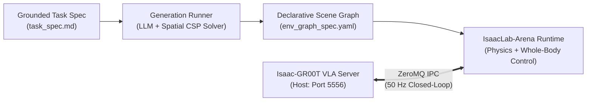
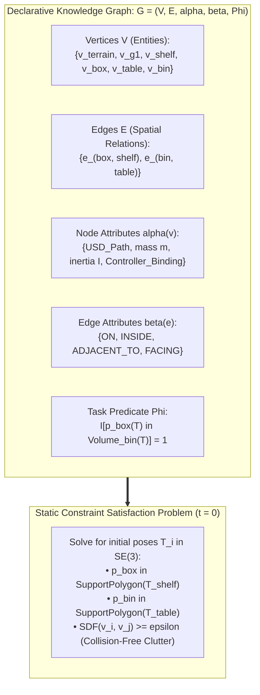
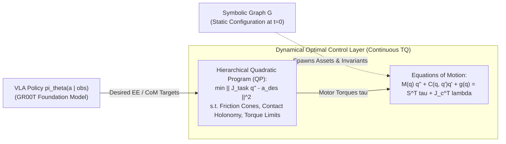
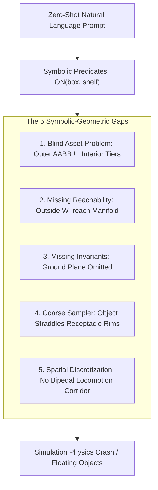
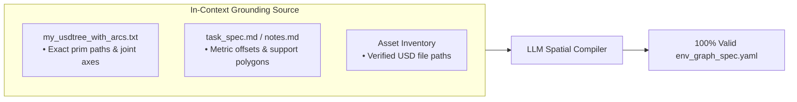
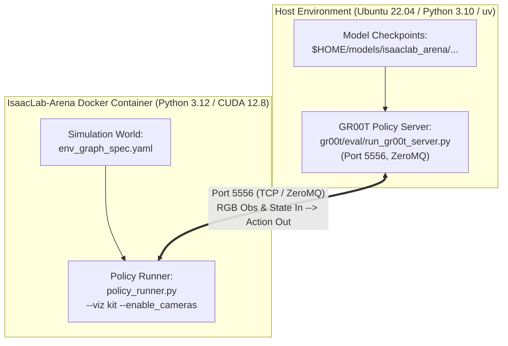
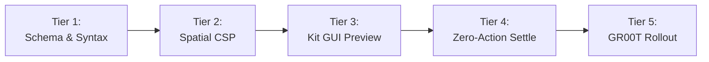

# Agentic Environment Generation & Policy Evaluation Master Guide

Architectural foundations, mathematical formalism, failure mode mitigations, grounded Markdown specifications, and runtime CLI workflows for LLM-driven environment synthesis and closed-loop policy evaluation in **IsaacLab-Arena 0.3.0** with **NVIDIA Isaac-GR00T**.

---

## 1. Executive Summary & Agent Operational Directives

Agentic Environment Generation translates natural language or structured task descriptions (*"Unitree G1 humanoid robot picks up the brown box from the shelf and places it in the blue bin"*) into executable simulation scenes in IsaacLab-Arena.



### Core Invariants for Autonomous Agents
1. **Decoupling of Statics ($t=0$) from Dynamics ($T\mathcal{Q}$)**: Declarative scene generation operates strictly over discrete spatial configurations at $t=0$. It **cannot** invent continuous Whole-Body Control (WBC) or dynamic balance solvers.
2. **Never Rely on Zero-Shot Prompts for Metric Layouts**: Prompts must be anchored by grounded Markdown task specifications (`task_spec.md`) specifying explicit metric heights, surface anchors, and bounding intervals.
3. **Mandatory Ground Plane Invariant**: Every generated environment must explicitly define the terrain surface (`default_ground_plane`) to prevent rigid bodies from spawning into an infinite physics void.
4. **Single-Threaded Pinocchio WBC Invariant**: When using Pink Whole-Body Control (`g1_wbc_pink` / `g1_decoupled_wbc_pink_action`), always set `--num_envs 1`. For parallel rollouts ($N > 1$), use `g1_wbc_joint`.
5. **Runtime Architecture Decoupling**: Run IsaacLab-Arena inside the Docker container (`./docker/run_docker.sh`) with CUDA 12.8 / Python 3.12, while running the Isaac-GR00T foundation model server on the Host (Python 3.10 via `uv`) communicating over ZeroMQ port `5556`.

---

## 2. Mathematical Formalism: Attributed Relational Scene Graphs

In `IsaacLab-Arena`, declarative YAML environment specifications represent an **Attributed Relational Scene Graph (ARG)**:

$$\mathcal{G} = (\mathcal{V}, \mathcal{E}, \alpha, \beta, \Phi)$$



### Mathematical Definitions

1. **Vertices $\mathcal{V} = \mathcal{V}_{\text{terrain}} \cup \mathcal{V}_{\text{embodiment}} \cup \mathcal{V}_{\text{fixture}} \cup \mathcal{V}_{\text{object}}$**:
   * $\mathcal{V}_{\text{terrain}}$: Physics ground surface ($z=0$, static friction $\mu_s$, dynamic friction $\mu_d$).
   * $\mathcal{V}_{\text{embodiment}}$: Robot kinematic tree (`unitree_g1`, `oxe_droid`, `franka_emika`).
   * $\mathcal{V}_{\text{fixture}}$: Static environment structures (`industrial_shelf`, `maple_table`).
   * $\mathcal{V}_{\text{object}}$: Manipulable rigid bodies (`brown_box`, `mustard_bottle`, `avocado`, `blue_bin`).

2. **Node Attributes $\alpha(v) = (\text{URI}_{\text{USD}}, m_v, \mathbf{I}_v, \mathcal{K}_v, \mathcal{A}_v)$**:
   * Maps entities to valid USD mesh assets, physical mass $m$, inertia tensor $\mathbf{I}$, kinematic configuration $\mathcal{K}$, and action controller bindings $\mathcal{A}_v$ (e.g. `G1DecoupledWBCPinkAction`).

3. **Directed Edges $\mathcal{E} \subseteq \mathcal{V} \times \mathcal{V}$ and Semantic Relations $\beta(e_{ij})$**:
   * Relations $\beta(e_{ij}) \in \{\text{ON}, \text{INSIDE}, \text{ADJACENT\_TO}, \text{FACING}\}$ induce the **Spatial Constraint Satisfaction Problem (Spatial CSP)** over continuous poses $\mathbf{T}_i \in SE(3)$ at $t=0$:
     $$\mathbf{p}_{\text{object}} \in \text{SupportPolygon}(\mathbf{T}_{\text{fixture}}) \quad \text{and} \quad \text{SDF}(v_i(\mathbf{T}_i), v_j(\mathbf{T}_j)) \ge \epsilon \quad \forall i \neq j$$

4. **Task Success Predicate $\Phi(\mathcal{S}_T)$**:
   * Goal evaluation functional at terminal timestep $T$:
     $$\Phi(\mathcal{S}_T) = \mathbb{I}\left[\mathbf{p}_{\text{target}}(T) \in \text{Volume}(\mathbf{T}_{\text{receptacle}}(T))\right] \in \{0, 1\}$$

---

## 3. Statics vs. Dynamics: The Decoupling Boundary

The symbolic knowledge graph defines initial scene state distributions at $t=0$ ($\mathbf{s}_0 \sim p(\mathbf{s} \mid \mathcal{G})$). It is decoupled from the continuous optimal control layer executing at $50\text{ Hz}$ to $1000\text{ Hz}$:



| Dimension | Declarative Knowledge Graph (`Agentic Env Gen`) | Whole-Body Controller (`Pink` / `pinocchio` / `WBC`) |
| :--- | :--- | :--- |
| **Mathematical Domain** | Discrete Set Theory & Static Geometric CSP in $SE(3)$ | Continuous Lie Group Dynamics on $T\mathcal{Q}$ & Convex QP |
| **Temporal Scope** | Time $t = 0$ (Initial scene construction & terminal predicates) | Real-time continuous closed-loop control ($50\text{ Hz} - 1000\text{ Hz}$) |
| **Physics Grounding** | Selects asset bounds, spawn coordinates, and relations | Solves momentum conservation, friction cones, and torques $\boldsymbol{\tau}$ |
| **LLM Extensibility** | **High**: Can add 50 objects, tables, distractor props | **Fixed**: Cannot invent new kinematics or QP solvers from text |

---

## 4. The 5 Symbolic-Geometric Failure Modes & Mitigations

Naive zero-shot language prompts produce simulation failures due to 5 fundamental gaps:



### 1. The Blind Asset Problem
* **Failure**: Outer Axis-Aligned Bounding Box (AABB) ignores internal mesh concavities. An instruction to place a box on the *"middle tier of shelf"* places the object on the shelf's top roof ($z_{\max}$) or intersecting internal struts.
* **Mitigation**: Supply explicit **Surface Anchors** and metric height offsets ($z=0.75\text{ m}$) in the task specification.

### 2. Absence of Kinematic Reachability Manifolds ($\mathcal{W}_{\text{reach}}$)
* **Failure**: Placing objects outside the robot inverse kinematics reach envelope:
  $$\mathcal{W}_{\text{reach}} = \left\{ \mathbf{p} \in \mathbb{R}^3 \;\middle|\; \exists \mathbf{q} \in \mathcal{Q}_{\text{valid}} \text{ s.t. } \mathbf{f}_{\text{FK}}(\mathbf{q}) = \mathbf{p} \right\}$$
* **Mitigation**: Center object sampling bounds relative to robot base spawn coordinates (e.g. within $0.4\text{ m} \le d_{xy} \le 0.8\text{ m}$ for bipedal manipulation).

### 3. Missing Schema Invariants (The Missing Floor Problem)
* **Failure**: Natural language assumes gravity and ground implicitly. If omitted from the declarative schema, objects drop into an infinite physics void.
* **Mitigation**: Enforce mandatory schema validation ensuring `terrain.class_type` is always populated with `isaaclab_arena.terrains.default_ground_plane`.

### 4. Coarse Bounding Box Samplers vs. Physics Concavity
* **Failure**: Standard spatial solvers treat receptacles (bins, bowls, boxes) as solid convex hulls. Objects placed `INSIDE` spawn colliding with or straddling thin plastic rims.
* **Mitigation**: Specify tight interior sampling intervals ($[x_{\min} + \delta, x_{\max} - \delta]$) with an initial height offset ($z_{\text{bottom}} + \epsilon$) allowing passive gravity settling.

### 5. Spatial Discretization vs. Continuous Motion Corridors ($\mathcal{C}_{\text{free}}$)
* **Failure**: Placing fixtures too close together prevents humanoid footstep planning and turning.
* **Mitigation**: Maintain an unobstructed clearance radius ($r_{\text{clearance}} \ge 0.6\text{ m}$) in the free-space corridor between fixtures.

---

## 5. Lessons from `g1_brainco_extension`: Grounded Context Injection

In `g1_brainco_extension`, hallucinations and coordinate mismatches were eliminated by supplying structured Markdown specifications directly in context:



### Key Principles
1. **USD Hierarchy Ground Truth**: Extract exact prim hierarchies (`/pelvis`, `/left_hip_pitch_link`, `/hands`) via USD tree inspection scripts before constructing schemas.
2. **Explicit Action Space Coupling**: Define how action vectors map to hardware (e.g., mapping GR00T 3-finger action outputs to 5-finger dexterous Brainco hands).
3. **Metric Coordinate Anchors**: Replace qualitative adjectives with metric bounds (e.g., $x \in [0.95, 1.05], y \in [-0.1, 0.1], z = 0.75$).

---

## 6. Grounded Task Specification Templates & Examples

### Template: `task_spec.md`

```markdown
# [Task Title] Grounded Specification

## 1. Environment Invariants
- Terrain: default_ground_plane (Rigid plane at z=0.0, static friction=1.0, dynamic friction=0.8)
- Gravity: [0.0, 0.0, -9.81]

## 2. Embodiment Specification
- Robot: unitree_g1 | oxe_droid | franka_emika
- Spawn Pose: position=[x, y, z], orientation_yaw=yaw_rad
- Controller: g1_decoupled_wbc_pink_action | g1_wbc_joint | droid_abs_joint_pos
- Sensors: ego_view (camera attached to torso/wrist)

## 3. Spatial Topology & Fixtures
- Fixture 1: [fixture_name] (asset_path="path/to/fixture.usd")
  - Pose: position=[x, y, z], yaw=yaw_rad
  - Surface Anchor: [tier_name] (height z=anchor_z)
- Fixture 2: [fixture_name] (asset_path="path/to/fixture.usd")
  - Pose: position=[x, y, z], yaw=yaw_rad
  - Surface Anchor: [surface_name] (height z=anchor_z)

## 4. Object Placement & Sampling Bounds
- Target: [object_name] (asset_path="path/to/object.usd")
  - Relation: ON fixture_1.surface_anchor
  - Bounds: x=[xmin, xmax], y=[ymin, ymax], z=anchor_z
- Receptacle: [receptacle_name] (asset_path="path/to/receptacle.usd")
  - Relation: ON fixture_2.surface_anchor
  - Bounds: x=[xmin, xmax], y=[ymin, ymax], z=anchor_z

## 5. Locomotion / Free Space Corridor
- Bounding box: x=[xmin, xmax], y=[ymin, ymax], z=[0.0, 2.0]
- Clearance radius: r >= 0.6m
```

---

### Example A: Unitree G1 Loco-Manipulation Box Transfer

```yaml
# env_graph_spec.yaml (Unitree G1 Loco-Manipulation)
terrain:
  class_type: "isaaclab_arena.terrains.default_ground_plane"
  friction: 1.0

embodiment:
  class_type: "unitree_g1"
  init_pose: [0.0, 0.0, 0.79, 1.0, 0.0, 0.0, 0.0]
  controller: "g1_decoupled_wbc_pink_action"
  sensors:
    - name: "ego_view"

fixtures:
  shelf:
    asset_path: "isaaclab_arena/assets/shelf.usd"
    pose: [1.0, 0.0, 0.0, 1.0, 0.0, 0.0, 0.0]
  table:
    asset_path: "isaaclab_arena/assets/maple_table.usd"
    pose: [0.8, -1.4, 0.0, 1.0, 0.0, 0.0, 0.0]

objects:
  brown_box:
    asset_path: "isaaclab_arena/assets/brown_box.usd"
    relation:
      type: "ON"
      parent: "shelf"
      bounds: [[0.95, 1.05], [-0.1, 0.1], [0.75, 0.75]]
  blue_bin:
    asset_path: "isaaclab_arena/assets/blue_bin.usd"
    relation:
      type: "ON"
      parent: "table"
      bounds: [[0.75, 0.85], [-1.45, -1.35], [0.70, 0.70]]
```

---

### Example B: Droid Tabletop Mustard Bottle Pick and Place

```yaml
# env_graph_spec.yaml (OXE Droid Tabletop)
terrain:
  class_type: "isaaclab_arena.terrains.default_ground_plane"
  friction: 1.0

embodiment:
  class_type: "oxe_droid"
  init_pose: [0.0, 0.0, 0.0, 1.0, 0.0, 0.0, 0.0]
  controller: "droid_abs_joint_pos"
  sensors:
    - name: "wrist_camera"
    - name: "exterior_camera"

fixtures:
  table:
    asset_path: "isaaclab_arena/assets/maple_table.usd"
    pose: [0.5, 0.0, 0.0, 1.0, 0.0, 0.0, 0.0]

objects:
  mustard_bottle:
    asset_path: "isaaclab_arena/assets/mustard_bottle.usd"
    relation:
      type: "ON"
      parent: "table"
      bounds: [[0.45, 0.55], [-0.15, -0.05], [0.72, 0.72]]
  grey_bin:
    asset_path: "isaaclab_arena/assets/grey_bin.usd"
    relation:
      type: "ON"
      parent: "table"
      bounds: [[0.45, 0.55], [0.10, 0.20], [0.72, 0.72]]
```

---

### Example C: Franka Emika Avocado Pick & Place with Distractors

```yaml
# env_graph_spec.yaml (Franka Avocado with Distractors)
terrain:
  class_type: "isaaclab_arena.terrains.default_ground_plane"
  friction: 1.0

embodiment:
  class_type: "franka_emika"
  init_pose: [0.0, 0.0, 0.0, 1.0, 0.0, 0.0, 0.0]
  controller: "franka_ik_delta_pos"

fixtures:
  table:
    asset_path: "isaaclab_arena/assets/maple_table.usd"
    pose: [0.5, 0.0, 0.0, 1.0, 0.0, 0.0, 0.0]

objects:
  target_avocado:
    asset_path: "isaaclab_arena/assets/avocado.usd"
    relation:
      type: "ON"
      parent: "table"
      bounds: [[0.40, 0.50], [-0.10, 0.0], [0.72, 0.72]]
  receptacle_bowl:
    asset_path: "isaaclab_arena/assets/bowl.usd"
    relation:
      type: "ON"
      parent: "table"
      bounds: [[0.55, 0.65], [0.15, 0.25], [0.72, 0.72]]
  distractor_apple:
    asset_path: "isaaclab_arena/assets/apple.usd"
    relation:
      type: "ON"
      parent: "table"
      bounds: [[0.40, 0.50], [0.10, 0.20], [0.72, 0.72]]
  distractor_banana:
    asset_path: "isaaclab_arena/assets/banana.usd"
    relation:
      type: "ON"
      parent: "table"
      bounds: [[0.55, 0.65], [-0.20, -0.10], [0.72, 0.72]]
```

---

## 7. Dual-Track Runtime: Container & Host ZeroMQ IPC



### Required Host Environment Variables & Flags
For GPU inference (especially on NVIDIA Blackwell `sm_120` or Ada/Hopper):

```bash
# Export API Keys for Agentic Generator
export GEMINI_API_KEY="AIzaSyYourGeminiKeyHere"
export NV_API_KEY="$GEMINI_API_KEY"
export OPENAI_API_KEY="$GEMINI_API_KEY"
export OPENAI_BASE_URL="https://generativelanguage.googleapis.com/v1beta/openai/"
export NV_BASE_URL="https://generativelanguage.googleapis.com/v1beta/openai/"
export BASE_URL="https://generativelanguage.googleapis.com/v1beta/openai/"
export MPLCONFIGDIR=/tmp/matplotlib

# SDPA Fallback Flags for Torch 2.7 / Blackwell GPU Kernels
export GR00T_DIT_SDPA_MODE=math
export TORCH_SDPA_USE_FLASH=0
export USE_FLASH_ATTENTION=0
```

---

## 8. Complete CLI & Tooling Reference Runbook

### 1. Launching the IsaacLab-Arena Docker Container
From the root of `IsaacLab-Arena`:

```bash
# Step 1: Create local mount directories on Host
mkdir -p $HOME/datasets/isaaclab_arena/locomanipulation_tutorial
mkdir -p $HOME/models/isaaclab_arena/locomanipulation_tutorial
mkdir -p $HOME/eval/isaaclab_arena

# Step 2: Run container (auto-mounts $HOME/datasets, $HOME/models, $HOME/eval)
./docker/run_docker.sh
```

---

### 2. Compiling Task Prompts to Scene Graphs

```bash
# Resolve mode (Resolves spatial constraints and tests asset bindings)
python isaaclab_arena_examples/agentic_environment_generation/environment_generation_runner.py \
   --mode resolve \
   --model "gemini-2.0-flash" \
   --prompt "Droid picks up the mustard bottle from the maple table and places it in the grey bin." \
   --out_dir /workspaces/isaaclab_arena/generated_envs/mustard_pick_and_place

# Full compilation mode using Grounded Markdown Spec
python isaaclab_arena_examples/agentic_environment_generation/environment_generation_runner.py \
   --mode full \
   --model "gemini-2.0-flash" \
   --prompt "$(cat /path/to/task_spec.md)" \
   --out_dir /workspaces/isaaclab_arena/generated_envs/g1_box_transfer

# Headless build verification mode
python isaaclab_arena_examples/agentic_environment_generation/environment_generation_runner.py \
   --mode build \
   --env_graph_spec_yaml /workspaces/isaaclab_arena/generated_envs/g1_box_transfer/env_graph_spec.yaml \
   --headless
```

---

### 3. Interactive 3D Kit GUI Preview

Launch the Omniverse Kit interactive preview to inspect meshes, textures, lighting, and camera frustums:

```bash
# Launch GUI browser for generated YAML specs
python isaaclab_arena_examples/agentic_environment_generation/gui_runner.py \
   --env_graph_spec_yaml /workspaces/isaaclab_arena/generated_envs/mustard_pick_and_place/droid_pick_and_place_mustard_bottle.yaml
```

---

### 4. Starting the NVIDIA Isaac-GR00T Server (On Host)

Open a terminal outside Docker, navigate to `submodules/Isaac-GR00T`:

```bash
cd submodules/Isaac-GR00T

# Option A: OXE Droid Tabletop Foundation Model
GR00T_DIT_SDPA_MODE=math TORCH_SDPA_USE_FLASH=0 USE_FLASH_ATTENTION=0 \
uv run python gr00t/eval/run_gr00t_server.py \
   --model-path nvidia/GR00T-N1.6-DROID \
   --embodiment-tag OXE_DROID \
   --device cuda --host 127.0.0.1 --port 5556

# Option B: G1 Loco-Manipulation Tuned Checkpoint
GR00T_DIT_SDPA_MODE=math TORCH_SDPA_USE_FLASH=0 USE_FLASH_ATTENTION=0 \
uv run python gr00t/eval/run_gr00t_server.py \
   --modality-config-path ../../isaaclab_arena_gr00t/embodiments/g1/g1_sim_wbc_data_config.py \
   --model-path $HOME/models/isaaclab_arena/locomanipulation_tutorial/checkpoint-20000 \
   --embodiment-tag NEW_EMBODIMENT \
   --device cuda --host 127.0.0.1 --port 5556
```

---

### 5. Running Simulation & Closed-Loop Policy Evaluation (In Container)

```bash
# Tier 4: Passive Zero-Action Gravity Settle Test (150 steps)
python isaaclab_arena/evaluation/policy_runner.py \
   --viz kit \
   --policy_type zero_action \
   --enable_cameras \
   --num_steps 150 \
   --env_graph_spec_yaml /workspaces/isaaclab_arena/generated_envs/mustard_pick_and_place/droid_pick_and_place_mustard_bottle.yaml

# Tier 5: Closed-Loop Evaluation with GR00T Remote Policy Server
python isaaclab_arena/evaluation/policy_runner.py \
   --viz kit \
   --policy_type isaaclab_arena_gr00t.policy.gr00t_remote_closedloop_policy.Gr00tRemoteClosedloopPolicy \
   --policy_config_yaml_path isaaclab_arena_gr00t/policy/config/droid_manip_gr00t_closedloop_config.yaml \
   --remote_host 127.0.0.1 \
   --remote_port 5556 \
   --enable_cameras \
   --num_steps 1000 \
   --language_instruction "Pick up the mustard bottle and place it in the grey bin." \
   --env_graph_spec_yaml /workspaces/isaaclab_arena/generated_envs/mustard_pick_and_place/droid_pick_and_place_mustard_bottle.yaml

# Dynamic Variations (Override lighting and camera parameters)
python isaaclab_arena/evaluation/policy_runner.py \
   --viz kit \
   --policy_type isaaclab_arena_gr00t.policy.gr00t_remote_closedloop_policy.Gr00tRemoteClosedloopPolicy \
   --policy_config_yaml_path isaaclab_arena_gr00t/policy/config/droid_manip_gr00t_closedloop_config.yaml \
   --remote_host 127.0.0.1 \
   --remote_port 5556 \
   --enable_cameras \
   --num_steps 1000 \
   --env_graph_spec_yaml /workspaces/isaaclab_arena/generated_envs/mustard_pick_and_place/droid_pick_and_place_mustard_bottle.yaml \
   light.hdr_image.enabled=true \
   droid_abs_joint_pos.camera_extrinsics_wrist_camera.enabled=true
```

---

## 9. 5-Tier Verification & Diagnostics Matrix



| Tier | Validation Stage | Command / Trigger | Success Criteria |
| :--- | :--- | :--- | :--- |
| **Tier 1** | **Schema & Syntax** | `environment_generation_runner.py --mode resolve` | Valid YAML structure; USD paths resolve to real files; mandatory `terrain` present. |
| **Tier 2** | **Spatial CSP Feasibility** | `environment_generation_runner.py --mode build --headless` | Non-collision pose sampling converges in $< 5.0\text{ s}$ without rejection timeout. |
| **Tier 3** | **Interactive Kit 3D GUI** | `gui_runner.py --env_graph_spec_yaml <spec.yaml>` | Visual verification of textures, support surfaces, light intensity, and camera positions. |
| **Tier 4** | **Passive Physics Settle** | `policy_runner.py --policy_type zero_action --num_steps 150` | Objects remain at rest on surfaces under gravity; zero kinetic energy divergence. |
| **Tier 5** | **Closed-Loop GR00T Rollout** | `policy_runner.py --policy_type ...Gr00tRemoteClosedloopPolicy` | End-to-end task completion; $\Phi(\mathcal{S}_T) = 1$; ZeroMQ latency $< 25\text{ ms}$ per step. |

---

## 10. Troubleshooting & Common Failure Signatures

| Error Signature | Root Cause | Resolution |
| :--- | :--- | :--- |
| `Spatial CSP solver timed out (1000 iterations)` | Bounding intervals too tight or overlapping with fixture collision primitives. | Expand spatial bounding intervals in `task_spec.md` or reduce object clearance margin $\epsilon$. |
| `Segmentation fault in Pinocchio / Pink WBC` | Multithreading violation in QP solver. | Set `--num_envs 1` when using Pink WBC, or switch to `g1_wbc_joint` for parallel simulation. |
| `ConnectionRefusedError: [Errno 111] Connection refused: 127.0.0.1:5556` | GR00T policy server is not running on Host or bound to wrong interface. | Start server on Host via `uv run python gr00t/eval/run_gr00t_server.py --host 127.0.0.1 --port 5556`. |
| `CUDA error: no kernel image is available for execution on the device` | FlashAttention SM120 incompatibility on Blackwell GPUs. | Launch server with `GR00T_DIT_SDPA_MODE=math TORCH_SDPA_USE_FLASH=0 USE_FLASH_ATTENTION=0`. |
| `Robot or objects falling through floor` | Missing `terrain` block in `env_graph_spec.yaml`. | Add `terrain: {class_type: "isaaclab_arena.terrains.default_ground_plane", friction: 1.0}`. |
| `AttributeError: camera sensor not found` | Camera rendering flags omitted. | Always pass `--enable_cameras` flag to `policy_runner.py`. |
