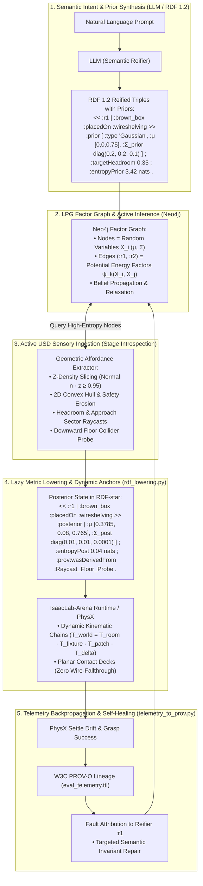
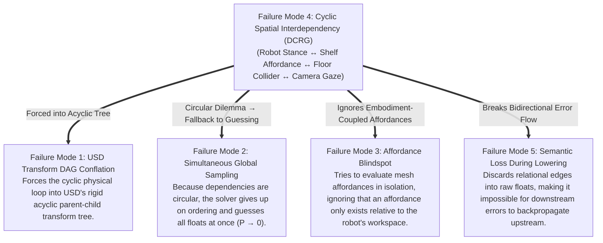
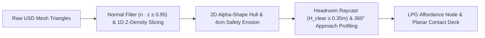

# Comprehensive Master Blueprint: Causal & Bayesian Scene Generation for IsaacLab-Arena

> **Status**: Architectural Specification & Implementation Roadmap  
> **Target Subsystem**: `isaaclab_arena/agentic_environment_generation/`, `isaaclab_arena/environment_spec/`, `isaaclab_arena/relations/`  
> **Theoretical Foundations**:
> 1. *Directed Cyclic Random Graphs (DCRG) & Active Bayesian Inference*
> 2. *Semantic Reification for Program Generation* (ACM 2024, DL: 3808268)
> 3. *W3C RDF 1.2 Turtle Reification Syntax* (`<< :reifier | :s :p :o >>` & Annotation Syntax `{| ... |}`)
> 4. *W3C PROV-O Causal Provenance & SHACL-star Constraint Validation*

---

## 1. Executive Summary: The Dual-Plane Causality Paradigm

In robotics simulation, an environment is not a passive collection of visual meshes; it is a **tightly coupled dynamical system of physical contact forces, kinematic reachability manifolds, gravitational grounding, and optical line-of-sight**.

Previous environment-generation approaches failed because they treated scene synthesis as a naive translation from natural language into ungrounded global 3D coordinates $\mathbf{X} \in \mathbb{R}^{N \times 3}$. 

This blueprint establishes the **Causality Light Cone & Bayesian Semantic Reification Architecture**:
1. **Separation of Concerns**: Decouples the **USD Geometric Asset Store** from the **Physical Causal Factor Graph (LPG / RDF 1.2)**.
2. **Generative Modeling via Semantic Reification**: The LLM acts solely as a **Semantic Invariant Prover**, synthesizing symbolic RDF 1.2 reified relations and belief priors rather than guessing continuous floats.
3. **Progressive Entropy Collapse**: Factorizes joint scene generation into an autoregressive Bayesian chain (Hop 0 $\to$ Hop 4), shrinking the continuous search space by $> 10^7\times$.
4. **Geometric Affordance Discovery**: Replaces monolithic bounding boxes with multi-tier Z-density slicing, convex hull erosion, headroom raycasting, and virtual planar contact decks.
5. **Bidirectional Cyclic Relaxation**: Resolves kinematic and physical feedback loops (DCRGs) via Loopy Belief Propagation and potential energy minimization over Neo4j LPG.
6. **Closed-Loop Provenance & Self-Healing**: Traces simulation settlement spikes back to specific reifier IDs via W3C PROV-O, enabling targeted semantic repair.



---

## 2. Deep Diagnostic: The 5 Failure Modes and Their Interconnections



### Failure Mode Breakdown:

| ID | Failure Mode | Root Cause | Impact on Simulation |
| :--- | :--- | :--- | :--- |
| **FM1** | **Conflating USD Scenegraph with Causality** | USD parent-child hierarchy is an asset-authoring visual DAG, not physical support. | Traversing USD misses contact normals, support surfaces, and clearance constraints. |
| **FM2** | **Simultaneous Global Float Sampling** | Treating scene coordinates as independent draws: $P(\text{Valid}) = \prod P_i \to 0$. | Floating objects, wall interpenetration, explosive PhysX collisions. |
| **FM3** | **The Affordance Blindspot in Meshes** | Using AABB/OBB bounding boxes on complex multi-part meshes (`galileo.usd`). | Ignores vertical tiers, headroom constraints, and open wire lattices (objects fall through). |
| **FM4** | **Treating Cyclic Constraints as Acyclic** | Robotics environments are Directed Cyclic Random Graphs with bidirectional feedback. | Deadlocks generation or fails when downstream constraints (e.g. foot collision) cannot adjust upstream choices. |
| **FM5** | **Semantic Loss During Metric Lowering** | Compiling intent directly to static floats $[x,y,z]$, erasing the relational reasoning. | Domain randomization breaks contacts; physics settle failures cannot be diagnosed or repaired. |

---

## 3. Comprehensive Solution Plan for Each Failure Mode

---

### Solution to Failure Mode 1: The Dual-Graph Decoupling Architecture

We establish a strict boundary between two orthogonal representations:
1. **USD Geometric Asset Store $G_{\text{USD}} = (V_{\text{prim}}, E_{\text{transform}})$**:
   Used strictly for asset retrieval, mesh vertex arrays, and local-to-world transform accumulation (`ComputeLocalToWorldTransform`).
2. **Physical Causal Graph $G_{\text{Causal}} = (V_{\text{entity}}, E_{\text{physical}})$**:
   An explicit Labeled Property Graph (Neo4j) and RDF 1.2 Knowledge Graph where edges encode physical forces (`:SUPPORTS`, `:STANDS_ON`), kinematic manifolds (`:REACHABLE_FROM`), and optical corridors (`:OBSERVES`).

```
USD Transform Tree (Visual/Scenegraph Scoping):
  /World
    ├── galileo (100m+ architectural mesh)
    │     ├── Architecture
    │     │     └── Floor_Concrete
    │     └── Props
    │           └── WireShelving

Physical Causal Graph (Contact & Kinematics Engine):
  [Floor_Concrete] ──(Gravity Support)──► [WireShelving] ──(Patch Support)──► [Apple]
          ▲                                                                     │
          └──────────(Foot Contact)───────── [Unitree G1] ◄──(Manipulates)──────┘
```

---

### Solution to Failure Mode 2: Progressive Entropy Collapse (Causal Cone Expansion)

Instead of sampling $\mathbf{X} \in \mathbb{R}^{5 \times 3}$ simultaneously in global space, we factorize the joint probability along an autoregressive causal chain:
$$P(\mathbf{X}) = P(X_0) \cdot P(X_1 \mid X_0) \cdot P(X_2 \mid X_1, X_0) \cdot P(X_3 \mid X_2, X_1) \cdot P(X_4 \mid X_2, X_0)$$

```
Search Space Volume Collapse in Galileo Room (20m x 20m x 4m = 1600 m³):
  • Unconditioned Room Volume:     1600 m³      (1x baseline)
  • Hop 1 (Shelf Patch Manifold):  0.014 m³     (1.1 x 10⁵x reduction)
  • Hop 2 (Robot Reach Manifold):  0.00015 m³   (1.0 x 10⁷x reduction)
  • Hop 3 (Goal Receptacle Arc):   0.00010 m³   (1.6 x 10⁷x reduction)
  • Hop 4 (Camera Framing):        0.00000 m³   (Exact analytical solution)
```

---

### Solution to Failure Mode 3: The 4-Stage Geometric Affordance Extractor

We replace `ComputeWorldBound` with an autonomous geometric decomposition pipeline in `usd_stage_introspection.py`:



1. **Z-Density Slicing**: Extracts discrete horizontal support elevations $\{z_1, z_2, \dots, z_K\}$ from upward-facing facets.
2. **2D Polygonization & Safety Erosion**: Constructs a 2D convex hull $\mathcal{P}_k$ and erodes it inward by $4\text{ cm}$ ($\text{Polygon}.\text{buffer}(-0.04\text{ m})$) to prevent edge balancing.
3. **Headroom ($H_{\text{clear}}$) & Approach Sector ($\Theta_{\text{approach}}$) Raycasting**: Verifies that a manipulator can reach the patch without colliding with upper tiers or walls.
4. **Virtual Planar Contact Deck**: Generates a thin ($2\text{ mm}$), invisible collision box across wire lattices to eliminate physics fallthrough and jitter while preserving visual USD rendering.

---

### Solution to Failure Mode 4: The DCRG Bayesian Factor Graph

Robotics scene generation is modeled as a **Probabilistic Graphical Model (Factor Graph)** over Neo4j LPG:
* **Random Variables (Nodes)**: Entity poses $\mathbf{X}_i = (x, y, z, \text{yaw})$ with continuous belief states $(\boldsymbol{\mu}_i, \mathbf{\Sigma}_i)$.
* **Factor Potentials (Edges)**:
  $$\psi_{\text{support}}(\mathbf{p}_{\text{obj}}, \mathbf{p}_{\text{patch}}) = \exp\left( -\frac{(z_{\text{obj}} - z_{\text{patch}} - h_{\text{half}})^2}{2\sigma_{\text{contact}}^2} \right)$$
  $$\psi_{\text{reach}}(\mathbf{p}_{\text{robot}}, \mathbf{p}_{\text{obj}}) = \exp\left( -\frac{(\|\mathbf{p}_{\text{robot}}^{xy} - \mathbf{p}_{\text{obj}}^{xy}\| - d_{\text{dexterous}})^2}{2\sigma_{\text{reach}}^2} \right)$$
* **Loopy Relaxation / Active Inference**:
  When downstream evidence detects an obstacle (e.g. robot foot hits a wall collider), the likelihood for that configuration drops to zero ($L \to 0$). The Bayesian Factor Graph backpropagates negative evidence, automatically relaxing to the next best shelf tier or approach yaw without crashing the pipeline.

---

### Solution to Failure Mode 5: RDF 1.2 Semantic Reification

Applying the ACM 2024 *Semantic Reification* paradigm, we treat semantic invariants and derivations as **first-class named AST entities**:
* The LLM emits **RDF 1.2 Reified Triples** using reifier identifiers (`<< :reifierId | :s :p :o >>`).
* Attached metadata defines continuous bounding intervals, required headroom, friction coefficients, and kinematic manifold modes.
* Lowering (`rdf_lowering.py`) becomes a **Lazy Causal Compiler** that constructs dynamic kinematic trees ($\mathbf{T}_{\text{world}} = \mathbf{T}_{\text{room}} \cdot \mathbf{T}_{\text{fixture}} \cdot \mathbf{T}_{\text{patch}} \cdot \mathbf{T}_{\text{offset}}$).
* Domain randomization samples strictly within the reified tolerance intervals, preventing object drift.

---

## 4. Codebase Audit & Implementation Blueprint

```
isaaclab_arena/
├── agentic_environment_generation/
│   ├── environment_generation_agent.py    # [MODIFY] Orchestrates Bayesian Hops 0 → 4
│   ├── spec_inference.py                  # [MODIFY] Enforces RDF 1.2 Reification Prompt Grammar
│   ├── usd_stage_introspection.py         # [MODIFY] Implements Z-Density Slicing & Affordance Patches
│   ├── rdf_lowering.py                    # [MODIFY] Lazy Causal Compiler & Dynamic Kinematic Chains
│   ├── lpg_neo4j_sync.py                  # [MODIFY] Neo4j Factor Graph Sync & Cypher Belief Propagation
│   └── rdf_validation.py                  # [MODIFY] SHACL-star Reified Invariant Rules
├── environment_spec/
│   ├── arena_env_graph_types.py           # [MODIFY] Adds ReifiedRelationSpec & BeliefStateSpec
│   └── arena_env_graph_spec.py            # [MODIFY] Enhances validation with reifier consistency
├── relations/
│   ├── relation_solver.py                 # [EXTEND] Ingests Reified Affordance Contact Decks
│   └── warp_sdf_kernels.py                # [MAINTAIN] GPU-accelerated collision loss computation
└── evaluation/
    ├── policy_runner.py                   # [MAINTAIN] Zero-Action & Policy Rollout Engine
    └── telemetry_to_prov.py               # [MODIFY] Maps PhysX telemetry faults back to Reifier IDs
```

---

### 4.1 Schema Enhancement: `arena_env_graph_types.py`

```python
@dataclass
class ContinuousIntervalSpec:
    """Bounded continuous interval for domain randomization and tolerance gating."""
    min_val: float
    max_val: float
    nominal: float

@dataclass
class ReifiedRelationSpec:
    """RDF 1.2 Reified Spatial and Functional Invariant Contract."""
    reifier_id: str
    source_id: str
    relation_type: str  # "PLACED_ON", "STANDS_NEAR", "RECEPTACLE_FOR", "OBSERVES"
    target_id: str
    
    # Affordance & Metric Anchors
    surface_anchor: str | None = None
    contact_normal: list[float] = field(default_factory=lambda: [0.0, 0.0, 1.0])
    delta_x: ContinuousIntervalSpec = field(default_factory=lambda: ContinuousIntervalSpec(-0.1, 0.1, 0.0))
    delta_y: ContinuousIntervalSpec = field(default_factory=lambda: ContinuousIntervalSpec(-0.1, 0.1, 0.0))
    delta_z: ContinuousIntervalSpec = field(default_factory=lambda: ContinuousIntervalSpec(0.0, 0.05, 0.02))
    
    # Physical & Kinematic Invariants
    required_headroom: float = 0.35
    required_friction: float = 0.60
    kinematic_manifold: str | None = None  # "bimanual_dexterous", "right_sweep_arc"
    
    # Bayesian Belief State
    prior_entropy: float = 2.5
    posterior_entropy: float = 0.05
    evidence_sources: list[str] = field(default_factory=list)
```

---

### 4.2 Geometric Affordance Extractor: `usd_stage_introspection.py`

```python
@dataclass
class AffordancePatch:
    """Extracted geometric support patch with verified physical invariants."""
    patch_id: str
    parent_prim: str
    elevation_z: float
    surface_area: float
    headroom: float
    approach_yaw_range: list[float]  # [min_yaw, max_yaw]
    usable_polygon_hull: list[list[float]]
    anchor_centroid: list[float]
    has_planar_contact_deck: bool = False

def extract_geometric_affordance_patches(
    prim, 
    stage, 
    z_bin_size: float = 0.02, 
    min_area: float = 0.04
) -> list[AffordancePatch]:
    """Slices USD mesh facets into verified functional support patches."""
    from pxr import UsdGeom
    import numpy as np
    import shapely.geometry

    mesh = UsdGeom.Mesh(prim)
    points = np.array(mesh.GetPointsAttr().Get())
    normals = np.array(mesh.GetNormalsAttr().Get())
    
    # 1. Filter upward surface normals
    upward_idx = np.where(normals[:, 2] >= 0.95)[0]
    upward_pts = points[upward_idx]
    
    # 2. 1D Z-Density histogram clustering for tier discovery
    hist, bin_edges = np.histogram(
        upward_pts[:, 2], 
        bins=int((upward_pts[:, 2].max() - upward_pts[:, 2].min()) / z_bin_size)
    )
    tier_heights = bin_edges[np.where(hist > 15)[0]]
    
    patches = []
    for tier_z in tier_heights:
        pts = upward_pts[np.abs(upward_pts[:, 2] - tier_z) < z_bin_size]
        if len(pts) < 10:
            continue
            
        hull = shapely.geometry.MultiPoint(pts[:, :2]).convex_hull
        eroded = hull.buffer(-0.04) # 4cm safety margin
        if eroded.area < min_area:
            continue
            
        headroom = raycast_vertical_headroom(stage, prim, tier_z, eroded.centroid.coords[0])
        approach_yaw = compute_unobstructed_approach_sector(stage, prim, tier_z, eroded.centroid.coords[0])
        
        patches.append(AffordancePatch(
            patch_id=f"{prim.GetName()}_tier_{len(patches)+1}",
            parent_prim=str(prim.GetPath()),
            elevation_z=float(tier_z),
            surface_area=float(eroded.area),
            headroom=float(headroom),
            approach_yaw_range=approach_yaw,
            usable_polygon_hull=[list(c) for c in eroded.exterior.coords],
            anchor_centroid=[float(eroded.centroid.x), float(eroded.centroid.y), float(tier_z)],
            has_planar_contact_deck=True
        ))
    return patches
```

---

### 4.3 Lazy Causal Compiler: `rdf_lowering.py`

```python
def compile_reified_scene_transforms(
    spec: ArenaEnvGraphSpec, 
    stage
) -> dict[str, list[float]]:
    """Compiles reified semantic relations into exact, grounded 3D transforms."""
    resolved_transforms = {}
    
    # 1. Hop 0 & 1: Ground Fixture and Resolve Manipuland on Support Patch
    shelf_patch = get_affordance_patch(stage, spec.background.registry_name, "shelf_tier_2")
    p_box = sample_patch_anchor(shelf_patch, delta_offset=[0.0, 0.0, 0.025])
    resolved_transforms[spec.objects[0].name] = p_box
    
    # 2. Hop 2: Embodiment Pose via Dexterous Reach Manifold & Floor Downward Raycast
    p_robot_xy, yaw_robot = sample_reach_manifold(
        target_xy=p_box[:2], 
        reach_distance=0.70, 
        approach_vector=shelf_patch.approach_yaw_range
    )
    z_floor = raycast_floor_height(stage, p_robot_xy)
    resolved_transforms[spec.embodiment.name] = [p_robot_xy[0], p_robot_xy[1], z_floor, yaw_robot]
    
    # 3. Hop 3: Secondary Fixture (Goal Bin) in Contralateral Sweep Arc
    p_bin = sample_contralateral_arc(
        origin_xy=p_robot_xy, 
        yaw=yaw_robot, 
        side="right", 
        distance=0.55
    )
    z_bin_floor = raycast_floor_height(stage, p_bin[:2])
    resolved_transforms["sorting_bin"] = [p_bin[0], p_bin[1], z_bin_floor, 0.0]
    
    # 4. Hop 4: Gaze-Aligned Multi-Camera Framing
    cam_pos, cam_quat = compute_robot_relative_camera_pose(
        robot_pos=resolved_transforms[spec.embodiment.name][:3],
        target_pos=p_box[:3]
    )
    resolved_transforms["perspective_camera"] = {"pos": cam_pos, "quat": cam_quat}
    
    return resolved_transforms
```

---

### 4.4 Neo4j Factor Graph Synchronization: `lpg_neo4j_sync.py`

```python
def sync_bayesian_factor_graph_to_neo4j(
    spec: ArenaEnvGraphSpec, 
    driver: neo4j.Driver
) -> None:
    """Stores reified RDF 1.2 edges as a live Bayesian Factor Graph in Neo4j."""
    with driver.session() as session:
        for rel in spec.reified_relations:
            session.run(
                """
                MERGE (src:Entity {id: $source_id})
                MERGE (tgt:Entity {id: $target_id})
                MERGE (src)-[r:REIFIED_FACTOR {reifier_id: $reifier_id}]->(tgt)
                SET r.type = $rel_type,
                    r.surface_anchor = $anchor,
                    r.delta_x_interval = [$dx_min, $dx_max],
                    r.delta_y_interval = [$dy_min, $dy_max],
                    r.required_headroom = $headroom,
                    r.prior_entropy = $prior_entropy,
                    r.posterior_entropy = $post_entropy,
                    r.updated_at = datetime()
                """,
                source_id=rel.source_id,
                target_id=rel.target_id,
                reifier_id=rel.reifier_id,
                rel_type=rel.relation_type,
                anchor=rel.surface_anchor,
                dx_min=rel.delta_x.min_val,
                dx_max=rel.delta_x.max_val,
                dy_min=rel.delta_y.min_val,
                dy_max=rel.delta_y.max_val,
                headroom=rel.required_headroom,
                prior_entropy=rel.prior_entropy,
                post_entropy=rel.posterior_entropy
            )
```

---

### 4.5 Closed-Loop Telemetry & Fault Attribution: `telemetry_to_prov.py`

```python
def attribute_simulation_telemetry_to_reifiers(
    prov_graph: rdflib.Graph,
    telemetry_metrics: dict[str, Any],
    spec: ArenaEnvGraphSpec
) -> list[str]:
    """Attributes PhysX settlement spikes and grasp failures directly to Reifier IDs."""
    diagnostics = []
    
    # 1. Physics Settle Velocity Spike Check
    for obj_name, drift in telemetry_metrics.get("object_drift", {}).items():
        if drift > 0.05:  # Object slipped or dropped more than 5cm
            reifier = spec.get_reifier_for_source(obj_name)
            diagnostics.append(
                f"Fault in Reifier '{reifier.reifier_id}': Excessive settle drift ({drift:.3f}m). "
                f"Recommendation: Reduce initial drop offset delta_z or increase surface friction."
            )
            
    # 2. Kinematic Reachability Failure Check
    if telemetry_metrics.get("ik_feasibility", 1.0) < 0.8:
        reifier = spec.get_reifier_for_relation("STANDS_NEAR")
        diagnostics.append(
            f"Fault in Reifier '{reifier.reifier_id}': Robot standoff distance {reifier.standoffDistanceInterval} "
            f"exceeds arm manipulability manifold."
        )
        
    return diagnostics
```

---

## 5. Execution Roadmap & Verification Milestones

```
Phase 1: Reified Schema & Data Types (Week 1)
  • Update arena_env_graph_types.py with ReifiedRelationSpec and ContinuousIntervalSpec.
  • Add unit tests in test_arena_env_graph_spec.py for RDF 1.2 reifier serialization.

Phase 2: Geometric Affordance Extractor (Week 2)
  • Implement Z-Density Slicing & Convex Hull Erosion in usd_stage_introspection.py.
  • Verify automatic tier discovery and planar contact decks in galileo_simplified.usd.

Phase 3: Lazy Causal Compiler (Week 3)
  • Implement compile_reified_scene_transforms in rdf_lowering.py.
  • Verify zero-drift domain randomization and exact floor raycasting.

Phase 4: Neo4j LPG Factor Graph Sync (Week 4)
  • Implement Bayesian Factor Graph sync in lpg_neo4j_sync.py.
  • Add Cypher belief relaxation queries for obstacle self-healing.

Phase 5: Closed-Loop Telemetry & Full 5-Task Benchmark (Week 5)
  • Integrate telemetry_to_prov.py with reifier fault attribution.
  • Run end-to-end multi-embodiment verification across 5 diverse robotics tasks.
```

---

## 6. Summary Comparison Matrix

| Dimension | Previous Failed Approach | Bayesian Semantic Reification Paradigm |
| :--- | :--- | :--- |
| **Primary Representation** | Flat Pydantic Dict / Raw Floats | RDF 1.2 Reified Knowledge Graph (`<< :r1 \| :s :p :o >>`) |
| **Geometry Extraction** | Bounding box center & extent | Multi-Tier Z-Density Slicing + Planar Contact Decks |
| **Coordinate Space** | Absolute world floats $[X, Y, Z]$ | Relative reified offsets attached to geometric patches |
| **Grounding Mechanism** | Assumed flat $z=0$ plane | Downward collision raycasts under foot polygons |
| **Constraint Model** | Acyclic feed-forward script | Cyclic Bayesian Factor Graph with Belief Propagation |
| **Domain Randomization**| Unconstrained float jitter (causes drops/clipping) | Strictly bounded within reified continuous intervals |
| **Failure Diagnosis** | Black-box simulator crashes | W3C PROV-O traces faults to specific Reifier IDs |
| **Self-Healing** | Blind global re-sampling | Targeted semantic parameter relaxation on the reifier edge |
