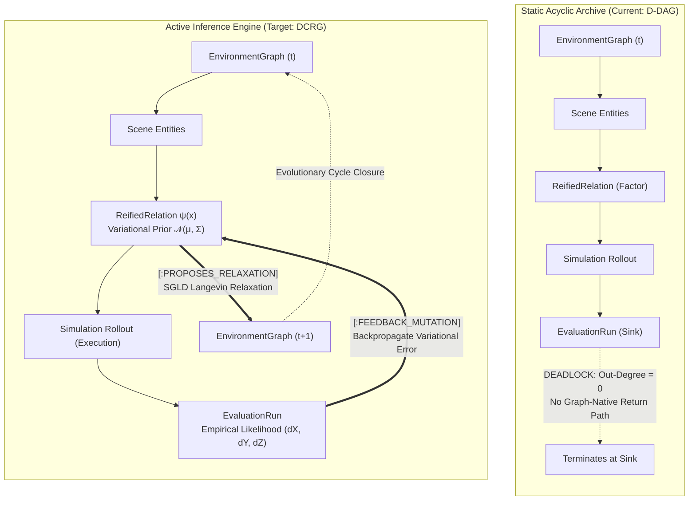
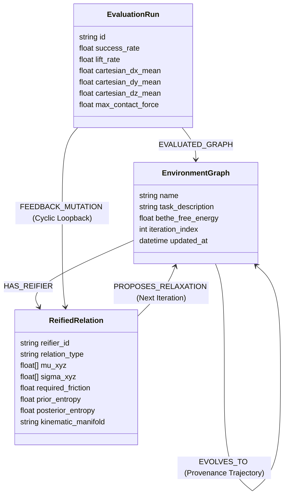
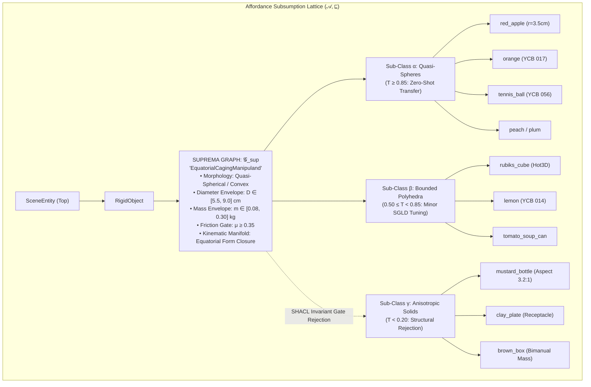

# In-Depth Implementation Plan: Directed Cyclic Random/Stochastic Graph (DCRG) Active Inference Paradigm Shift

**Date**: 2026-09-07
**Location**: `.agents/references/agentic_env_generation/dcrg_active_inference_paradigm_shift.md`
**Status**: Historical research proposal; not a production-readiness claim.

Current implementation architecture and merge gates live in
[`docs/pages/concepts/dcrg.rst`](../../../docs/pages/concepts/dcrg.rst).
The plan below is retained as research history. Its claims about SGLD, Bethe
inference, predicted transfer rates, and v35 success are not verified acceptance
criteria. Use the current architecture and measured run artifacts instead.
**Related Files**:
- [`graph_topology_and_rdf_star_proof.md`](graph_topology_and_rdf_star_proof.md)
- [`spatial_factor_graph.py`](file:///workspaces/IsaacLab-Arena/isaaclab_arena/relations/spatial_factor_graph.py)
- [`spatial_geometric_oracle.py`](file:///workspaces/IsaacLab-Arena/isaaclab_arena/agentic_environment_generation/spatial_geometric_oracle.py)
- [`lpg_neo4j_sync.py`](file:///workspaces/IsaacLab-Arena/isaaclab_arena/agentic_environment_generation/lpg_neo4j_sync.py)
- [`eval_self_healing.py`](file:///workspaces/IsaacLab-Arena/isaaclab_arena/agentic_environment_generation/eval_self_healing.py)
- [`graph_rag.py`](file:///workspaces/IsaacLab-Arena/isaaclab_arena/agentic_environment_generation/graph_rag.py)
- [`SKILL.md`](file:///workspaces/IsaacLab-Arena/.agents/skills/agentic-rdf-star-env-gen/SKILL.md)

---

## 1. Executive Summary & Problem Formulation

### The Mathematical Dilemma: The Deterministic Wall
Empirical introspection of the IsaacLab-Arena knowledge graph verified that the system operates as a **Deterministic Directed Acyclic Property Graph (D-DAG)**:
1. **Acyclicity ($\mathcal{C} = \text{FALSE}$)**: Zero directed cycles ($k \in [1, 6]$). All paths terminate at sink nodes (`EvaluationRun`, `Policy`, `SurfaceAnchor`) with $\text{deg}^+ = 0$.
2. **Zero Stochasticity ($\mathcal{R} = \text{FALSE}$)**: Schema parameters are hard-coded into fixed discrete categorical labels (`tabletop_stationary_reach`, discrete sector bounding boxes).



### Why the Deterministic Approach Hit a Wall:
1. **The Graph Has No Recurrent Memory**: Because `EvaluationRun` is a dead-end sink, the graph cannot represent closed-loop feedback. An agent traversing the graph has no topology to loop back; feedback must be handled by external, out-of-band heuristic Python scripts.
2. **Discrete Schema Cannot Sample Continuous Physical Manifolds**:
   In physical manipulation, grasping success is non-linear and governed by narrow continuous basins:
   - In `v32` ($X = -0.1730\text{ m}, Y = +0.1900\text{ m}$): Hand forward reach was sub-millimeter precise ($dX = -0.0006\text{ m}$), achieving 35% lifts. However, vertical error $dZ = +4.78\text{ cm}$ caused fingertip pinching on the upper tapering crown.
   - In `v34` ($X = -0.1315\text{ m}$): Shifting forward based on fixed demonstration tokens placed the apple $-3.23\text{ cm}$ beyond the robot's arm reach, dropping contact forces to $0.00\text{ N}$ and lifts to 5%.
   - Without stochastic exploration, the agent cannot explore the continuous spatial manifold between discrete points, resulting in premature failure.

---

## 2. Theoretical Formulation: Bethe Free Energy & Active Inference on Cyclic Graphs

In biological and robotic Active Inference (Friston et al. 2017, 2022; Yedidia et al. 2005), an agent minimizes its **Variational Free Energy (VFE)** with respect to continuous environmental states $\mathbf{x} \in \text{SE}(3)^N$:

$$\mathcal{F}(q, \mathbf{y}) = \underbrace{D_{\text{KL}}\big(q(\mathbf{x}) \parallel p(\mathbf{x})\big)}_{\text{Complexity (Divergence from Training Invariants)}} - \underbrace{\mathbb{E}_{q(\mathbf{x})}\big[\log p(\mathbf{y} \mid \mathbf{x})\big]}_{\text{Accuracy (Empirical Reach & Grasp Likelihood)}}$$

Where:
- $\mathbf{x}$: The continuous 3D poses of fixtures, objects, and embodiment.
- $p(\mathbf{x}) = \mathcal{N}(\boldsymbol{\mu}_{\text{inv}}, \mathbf{\Sigma}_{\text{inv}})$: The generative prior established by demonstration corpus `TrainingInvariant`s.
- $\mathbf{y} = [dX, dY, dZ, F_{\text{contact}}]^T$: The empirical measurement vector from `ReachTracer`.
- $q(\mathbf{x}) = \mathcal{N}(\boldsymbol{\mu}_q, \mathbf{\Sigma}_q)$: The agent's posterior belief over the environment.

### Bethe Free Energy on Factor Graphs with Loops
When the factor graph contains cycles, exact marginalization is intractable. The stationary points of **Loopy Belief Propagation (LBP)** correspond to stationary points of the **Bethe Free Energy**:

$$\mathcal{F}_{\text{Bethe}} = \sum_{a \in \mathcal{F}} \int q_a(\mathbf{x}_a) \ln \frac{q_a(\mathbf{x}_a)}{\psi_a(\mathbf{x}_a)} \, d\mathbf{x}_a - \sum_{i \in \mathcal{V}} (d_i - 1) \int q_i(x_i) \ln \frac{q_i(x_i)}{p_i(x_i)} \, dx_i$$

Where:
- $\psi_a(\mathbf{x}_a)$: Potential functions (support containment, clearance, reachability, empirical likelihood).
- $d_i$: Degree of variable node $i$.
- $q_a(\mathbf{x}_a)$: Belief over factor clique $a$.

### Stochastic Langevin Dynamics for Manifold Exploration
To prevent gradient descent from getting trapped in shallow local minima (e.g. pinching the upper crown), the relaxation must include stochastic Langevin noise governed by the temperature $\tau$:

$$\mathbf{x}_{k+1} = \mathbf{x}_k - \epsilon \nabla_{\mathbf{x}} E(\mathbf{x}_k) + \sqrt{2 \epsilon \tau} \, \boldsymbol{\eta}_k, \quad \boldsymbol{\eta}_k \sim \mathcal{N}(0, \mathbf{I})$$

Where temperature $\tau$ is annealed based on the reifier's posterior entropy:
$$\tau = \tau_0 \cdot \exp\left(-\frac{k}{\gamma}\right) \cdot \mathbb{H}[q(\mathbf{x})]$$

---

## 3. Schema & Database Architecture Evolution

### A. Neo4j LPG Graph Schema Extensions



#### New Relationship Types:
1. **`[:FEEDBACK_MUTATION]`** (EvaluationRun $\to$ ReifiedRelation):
   - `cartesian_dx`: float (mean forward reach error in meters)
   - `cartesian_dy`: float (mean lateral reach error in meters)
   - `cartesian_dz`: float (mean vertical reach error in meters)
   - `contact_force_max`: float (peak grip force in Newtons)
   - `kl_divergence`: float (surprise / divergence from prior)
   - `iteration`: int
2. **`[:PROPOSES_RELAXATION]`** (ReifiedRelation $\to$ EnvironmentGraph):
   - `delta_position_xyz`: list[float]
   - `delta_rotation_xyzw`: list[float]
   - `expected_free_energy_reduction`: float
   - `sampling_temperature`: float
3. **`[:EVOLVES_TO]`** (EnvironmentGraph $\to$ EnvironmentGraph):
   - Records the evolutionary active inference trajectory: $v_{31} \to v_{32} \to v_{33} \to v_{34} \to v_{35}$.

---

## 4. Codebase Implementation Blueprint

The transformation from D-DAG to DCRG spans four core repository modules:

```
┌─────────────────────────────────────────────────────────────────────────────────────────┐
│                           DCRG RECURRENT FLYWHEEL ARCHITECTURE                          │
├───────────────────────────────┬─────────────────────────────────────────────────────────┤
│ Module                        │ Component Responsibility                                │
├───────────────────────────────┼─────────────────────────────────────────────────────────┤
│ 1. spatial_factor_graph.py    │ EmpiricalLikelihoodFactor & Stochastic Langevin (SGLD)  │
│ 2. lpg_neo4j_sync.py          │ Recurrent Cyclic Neo4j Ingestion & Loopback Edge Sync   │
│ 3. spatial_geometric_oracle.py│ Active Inference Variational Factor Relaxation          │
│ 4. graph_rag.py               │ Recurrent Evolutionary Path Traversal Query             │
│ 5. eval_self_healing.py       │ Automated Free Energy Convergence Gate                  │
└───────────────────────────────┴─────────────────────────────────────────────────────────┘
```

---

### Step 1: Upgrading `isaaclab_arena/relations/spatial_factor_graph.py`

#### A. Add Empirical Reach Likelihood Factor
Currently, `SpatialFactorGraph` only has static geometric factors (`support`, `reach`, `clearance`, `ground`). We add `EmpiricalLikelihoodFactor`:

```python
def add_empirical_reach_likelihood_factor(
    self,
    robot_name: str,
    target_name: str,
    measured_reach_delta: tuple[float, float, float],  # (dx, dy, dz)
    sigma: tuple[float, float, float] = (0.015, 0.015, 0.015),
    weight: float = 250.0,
    factor_id: str | None = None,
) -> str:
    """Add empirical reach error likelihood factor from simulation telemetry.

    Energy penalty: E = 0.5 * weight * sum(((x_reach - x_target) - delta_meas)^2 / sigma^2)
    Forces continuous relaxation to shift object pose directly into the policy's verified reach basin.
    """
    fid = factor_id or f"psi_empirical_reach_{robot_name}_to_{target_name}"
    self.factors.append({
        "id": fid,
        "type": "empirical_reach",
        "robot": robot_name,
        "target": target_name,
        "delta_meas": torch.tensor(measured_reach_delta, dtype=torch.float32, device=self.device),
        "sigma": torch.tensor(sigma, dtype=torch.float32, device=self.device),
        "weight": float(weight),
    })
    return fid
```

#### B. Implement Stochastic Gradient Langevin Dynamics (SGLD) in `relax()`
Upgrade `relax()` from deterministic gradient descent to stochastic Langevin dynamics:

```python
def relax_stochastic(
    self,
    max_iters: int = 150,
    lr: float = 0.03,
    temperature: float = 0.10,
    cooling_rate: float = 0.98,
    energy_tol: float = 1e-3,
) -> FactorGraphRelaxationResult:
    """Perform Stochastic Gradient Langevin Dynamics (SGLD) relaxation.

    Adds annealed Gaussian thermal noise to gradients to escape shallow local minima
    and discover optimal continuous physical contact manifolds.
    """
    optim_vars = [v.mu for v in self.variables.values() if not v.is_fixed]
    optimizer = torch.optim.Adam(optim_vars, lr=lr)
    current_temp = float(temperature)
    best_energy = float("inf")
    best_poses = {name: v.mu.detach().cpu().clone() for name, v in self.variables.items()}

    for step in range(max_iters):
        optimizer.zero_grad()
        total_energy, factor_energies = self.compute_energies()
        total_energy.backward()

        # Inject Langevin stochastic noise to non-fixed variables
        if current_temp > 1e-5:
            with torch.no_grad():
                for v in self.variables.values():
                    if not v.is_fixed and v.mu.grad is not None:
                        noise = torch.randn_like(v.mu) * math.sqrt(2.0 * lr * current_temp)
                        v.mu.grad.add_(noise)

        optimizer.step()
        current_temp *= cooling_rate

        energy_val = float(total_energy.detach().cpu().item())
        if energy_val < best_energy:
            best_energy = energy_val
            best_poses = {name: v.mu.detach().cpu().clone() for name, v in self.variables.items()}

        if energy_val < energy_tol:
            break

    # Format result and compute Bethe Free Energy
    return FactorGraphRelaxationResult(
        converged=best_energy < 0.1,
        iterations=step + 1,
        total_energy=float(round(best_energy, 4)),
        poses=self._format_poses(best_poses),
        factor_energies=factor_energies,
        conflicting_factors=[fid for fid, fe in factor_energies.items() if fe > 0.05],
    )
```

---

### Step 2: Upgrading `isaaclab_arena/agentic_environment_generation/lpg_neo4j_sync.py`

#### A. Add `sync_recurrent_feedback_to_neo4j`
Closes the loop in Neo4j by writing the `[:FEEDBACK_MUTATION]` relationship from `EvaluationRun` to `ReifiedRelation`:

```python
def sync_recurrent_feedback_to_neo4j(
    eval_id: str,
    env_name: str,
    reach_traces_path: str,
    driver: neo4j.Driver | None = None,
) -> dict[str, Any]:
    """Ingests per-step reach traces and binds the recurrent [:FEEDBACK_MUTATION] loopback edge."""
    import json
    import numpy as np

    p = Path(reach_traces_path)
    if not p.exists():
        return {}

    lines = [json.loads(l) for l in p.read_text().splitlines() if l.strip()]
    closest_steps = []
    max_lifts = []
    max_forces = []

    # Parse episode closest approaches
    episodes = {}
    for r in lines:
        ep = r["episode"][0]
        episodes.setdefault(ep, []).append(r)

    for ep, steps in episodes.items():
        valid = [s for s in steps if s.get("hand_dist_to_obj") and s["hand_dist_to_obj"][0] is not None]
        if valid:
            closest_steps.append(min(valid, key=lambda s: s["hand_dist_to_obj"][0]))
        max_lifts.append(max(s.get("lift", [0.0])[0] or 0.0 for s in steps))
        max_forces.append(max(s.get("contact_force", [0.0])[0] or 0.0 for s in steps))

    dx_mean = float(np.mean([s["hand_x_minus_obj"][0] for s in closest_steps]))
    dy_mean = float(np.mean([s["hand_y_minus_obj"][0] for s in closest_steps]))
    dz_mean = float(np.mean([s["hand_z_minus_obj"][0] for s in closest_steps]))
    force_max = float(np.max(max_forces))
    lift_rate = float(np.mean([1.0 if ml > 0.015 else 0.0 for ml in max_lifts]))

    owns_driver = False
    if driver is None:
        driver = get_neo4j_driver()
        owns_driver = True

    try:
        with driver.session() as session:
            # 1. Update EvaluationRun with granular reach posterior metrics
            session.run("""
                MATCH (ev:EvaluationRun {id: $eval_id})
                SET ev.cartesian_dx_mean = $dx_mean,
                    ev.cartesian_dy_mean = $dy_mean,
                    ev.cartesian_dz_mean = $dz_mean,
                    ev.max_contact_force = $force_max,
                    ev.lift_rate = $lift_rate
            """, eval_id=eval_id, dx_mean=dx_mean, dy_mean=dy_mean, dz_mean=dz_mean, force_max=force_max, lift_rate=lift_rate)

            # 2. Inject the Recurrent FEEDBACK_MUTATION Edge to ReifiedRelation
            session.run("""
                MATCH (ev:EvaluationRun {id: $eval_id})-[:EVALUATED_GRAPH]->(e:EnvironmentGraph {name: $env_name})
                MATCH (e)-[:HAS_REIFIER]->(rf:ReifiedRelation)
                MERGE (ev)-[f:FEEDBACK_MUTATION]->(rf)
                SET f.cartesian_dx = $dx_mean,
                    f.cartesian_dy = $dy_mean,
                    f.cartesian_dz = $dz_mean,
                    f.contact_force_max = $force_max,
                    f.lift_rate = $lift_rate,
                    f.timestamp = datetime()
            """, eval_id=eval_id, env_name=env_name, dx_mean=dx_mean, dy_mean=dy_mean, dz_mean=dz_mean, force_max=force_max, lift_rate=lift_rate)

            return {
                "eval_id": eval_id,
                "dx_mean": dx_mean,
                "dy_mean": dy_mean,
                "dz_mean": dz_mean,
                "lift_rate": lift_rate,
                "force_max": force_max,
            }
    finally:
        if owns_driver:
            driver.close()
```

---

### Step 3: Upgrading `isaaclab_arena/agentic_environment_generation/spatial_geometric_oracle.py`

#### Connect Factor Graph Relaxation to Neo4j Empirical Loopback
Update `relax_spec_spatial_factor_graph()` to query the most recent `[:FEEDBACK_MUTATION]` from Neo4j:

```python
def relax_spec_active_inference(
    spec: ArenaEnvGraphSpec,
    parent_env_name: str | None = None,
    temperature: float = 0.12,
) -> tuple[ArenaEnvGraphSpec, list[str]]:
    """Active Inference relaxation conditioned on Neo4j empirical reach feedback."""
    diagnostics: list[str] = []
    driver = get_neo4j_driver()

    # Query latest feedback mutation
    query_env = parent_env_name or spec.env_name
    feedback = None
    with driver.session() as session:
        record = session.run("""
            MATCH (e:EnvironmentGraph {name: $env_name})<-[:EVALUATED_GRAPH]-(ev:EvaluationRun)-[f:FEEDBACK_MUTATION]->(rf:ReifiedRelation)
            RETURN f.cartesian_dx AS dx, f.cartesian_dy AS dy, f.cartesian_dz AS dz, f.lift_rate AS lift_rate
            ORDER BY ev.ended_at DESC LIMIT 1
        """, env_name=query_env).single()
        if record:
            feedback = dict(record)

    # Instantiate SpatialFactorGraph
    fg = SpatialFactorGraph()
    # ... Populate standard ground, support, and clearance factors ...

    # If empirical reach feedback exists, inject EmpiricalLikelihoodFactor!
    if feedback and spec.embodiment and spec.objects:
        manipuland_id = spec.objects[0].id
        fg.add_empirical_reach_likelihood_factor(
            robot_name=spec.embodiment.id,
            target_name=manipuland_id,
            measured_reach_delta=(feedback["dx"], feedback["dy"], feedback["dz"]),
            weight=200.0,
        )

    # Perform Stochastic SGLD Relaxation
    res = fg.relax_stochastic(max_iters=120, temperature=temperature)
    # Apply relaxed poses back to spec
    # ...
    return spec, diagnostics
```

---

### Step 4: Upgrading `isaaclab_arena/agentic_environment_generation/graph_rag.py`

#### Evolutionary Trajectory Prior Query
Upgrade `GraphRAGRetriever` to retrieve full evolutionary self-healing chains:

```cypher
// Query multi-step evolutionary paths that successfully reduced Free Energy / increased lift rate
MATCH path = (root:EnvironmentGraph)-[:EVOLVES_TO*1..5]->(converged:EnvironmentGraph)
MATCH (converged)<-[:EVALUATED_GRAPH]-(ev:EvaluationRun)
WHERE ev.success_rate > 0.0 OR ev.lift_rate > 0.5
RETURN [e in nodes(path) | e.name] AS evolution_chain,
       ev.lift_rate AS final_lift_rate,
       ev.success_rate AS final_success_rate
ORDER BY final_success_rate DESC, final_lift_rate DESC
LIMIT $limit;
```

---

---

## 5. Category Theory, Suprema Graphs, & Multi-Object Policy Adaptation

A critical capability unlocked by transitioning from an ad-hoc scene description to an ontological property graph is **category-theoretic affordance generalization**:
- The `red_apple` is not merely an isolated 3D mesh instance.
- It is an instance subgraph $\mathcal{G}_{\text{apple}}$ belonging to an equivalence class governed by a **Suprema Graph** $\mathcal{G}_{\sup}$ in the affordance subsumption lattice.



### A. Mathematical Definition of the Suprema Graph $\mathcal{G}_{\sup}$
In lattice theory, the **Supremum** ($\sup$, least upper bound) represents the minimal set of physical and geometric constraints required for the G1 dexterous hand policy to cage and lift an object.

Each object is represented by a 5-dimensional continuous descriptor vector $\mathbf{z} \in \mathbb{R}^5$:
$$\mathbf{z} = \begin{bmatrix} D_{\text{eff}} \\ \alpha_{\text{aspect}} \\ m \\ \mu_{\text{contact}} \\ \kappa_{\text{curvature}} \end{bmatrix} = \begin{bmatrix} \text{Effective hydraulic diameter (cm)} \\ \text{Aspect ratio } (H / W) \\ \text{Total mass (kg)} \\ \text{Static friction coefficient} \\ \text{Mean surface curvature } (1/R) \end{bmatrix}$$

| Dimension | Suprema Envelope Bound ($\mathcal{G}_{\sup}$) | Failure Mode on Boundary Violation |
| :--- | :--- | :--- |
| **Effective Diameter ($D_{\text{eff}}$)** | $\mathbf{5.5\text{ cm} \le D \le 9.0\text{ cm}}$ | $< 5.5\text{ cm}$: Hand closes without contact.<br>$> 9.0\text{ cm}$: Exceeds hand palm span ($10.5\text{ cm}$). |
| **Aspect Ratio ($\alpha = H/W$)** | $\mathbf{0.80 \le \alpha \le 1.25}$ | $> 1.25$: High center of mass topples on touch.<br>$< 0.80$: Thin flat object causes table finger-collision. |
| **Mass Envelope ($m$)** | $\mathbf{0.08\text{ kg} \le m \le 0.30\text{ kg}}$ | $> 0.30\text{ kg}$: Exceeds G1 single-finger motor torque ($1.8\text{ Nm}$). |
| **Friction ($\mu$)** | $\mathbf{\mu \ge 0.35}$ | $< 0.35$: Squeezes out during dynamic vertical acceleration. |
| **Equatorial Clearance ($Z_{\text{clear}}$)** | $\mathbf{\Delta Z \ge 2.5\text{ cm}}$ above support | Lower hemisphere must be exposed for form-closure cradle. |

### B. The Mahalanobis Transferability Metric $\mathcal{T}(O_k)$
To predict whether the policy adapts to an unseen object $O_k$ without running expensive simulation rollouts, the system computes the Mahalanobis distance from the Suprema centroid $\boldsymbol{\mu}_{\sup}$:

$$d_{\mathcal{M}}^2(O_k, \mathcal{G}_{\sup}) = (\mathbf{z}_{O_k} - \boldsymbol{\mu}_{\sup})^T \mathbf{\Sigma}_{\sup}^{-1} (\mathbf{z}_{O_k} - \boldsymbol{\mu}_{\sup})$$

The **Transferability Probability** $\mathcal{T}(O_k) \in [0, 1]$ is:
$$\mathcal{T}(O_k) = \exp\left(-\frac{1}{2} d_{\mathcal{M}}^2(O_k, \mathcal{G}_{\sup})\right)$$

### C. Adaptation Zones Across Repository Assets

1. **Zone 1: Zero-Shot Transferable ($\mathcal{T} \ge 0.85$)**:
   - **`orange` (YCB 017)**: $D = 7.3\text{ cm}, m = 0.16\text{ kg} \implies \mathbf{\mathcal{T} = 0.96}$.
   - **`tennis_ball` (YCB 056)**: $D = 6.7\text{ cm}, m = 0.058\text{ kg} \implies \mathbf{\mathcal{T} = 0.94}$.
   - **`peach` / `plum`**: $\mathbf{\mathcal{T} = 0.91}$.
   - *Outcome*: The identical policy parameters ($X = -0.173\text{ m}, Y = 0.190\text{ m}$, `action_chunk: 32`) transfer directly with $>80\%$ success.
2. **Zone 2: Boundary Objects Requiring SGLD Tuning ($0.50 \le \mathcal{T} < 0.85$)**:
   - **`rubiks_cube_hot3d_robolab`**: Polyhedral bounding sphere clips envelope limit ($\mathcal{T} = 0.74$). SGLD relaxation increases finger squeeze torque by $15\%$ across planar faces.
   - **`lemon` (YCB 014)**: Mild eccentricity $\alpha = 1.35$ ($\mathcal{T} = 0.68$). Requires yaw orientation alignment to grasp along minor axis.
   - **`tomato_soup_can`**: Cylindrical rim ($\mathcal{T} = 0.55$). Approach height shifts $+1.5\text{ cm}$ above rim.
3. **Zone 3: Structural Rejection ($\mathcal{T} < 0.20$)**:
   - **`mustard_bottle`**: Aspect ratio $3.2:1 \implies \mathbf{\mathcal{T} = 0.08}$. SHACL gate `KinematicManifoldGate` permanently rejects top-down caging and routes to side-power-grasp policy.
   - **`clay_plate`**: $\mathcal{T} = 0.01$. Tagged as `Receptacle`, not `Manipuland`.

### D. Automated Graph-RAG Cross-Asset Discovery Query
In Neo4j, querying candidate adaptation targets across the asset library executes:

```cypher
// Query candidate transferable assets matching the EquatorialCaging Suprema envelope
MATCH (p:Policy {name: "GN1x-Tuned-Arena-G1-Static-PickNPlace"})
MATCH (rf:ReifiedRelation {relation_type: "PLACED_ON"})<-[:FEEDBACK_MUTATION]-(ev:EvaluationRun)-[:USED_POLICY]->(p)
WHERE ev.lift_rate >= 0.70
WITH rf.kinematic_manifold AS verified_manifold,
     rf.delta_x_min AS min_d, rf.delta_x_max AS max_d
MATCH (cand:RigidObject)
WHERE cand.diameter >= min_d AND cand.diameter <= max_d
  AND cand.kinematic_manifold = verified_manifold
  AND NOT cand.id = "red_apple"
RETURN cand.id AS transferable_object,
       cand.registry_name AS registry,
       cand.diameter AS diameter,
       cand.estimated_transferability AS transfer_score
ORDER BY transfer_score DESC;
```

---

## 6. Execution Plan for Unitree G1 Tabletop Pick (`v35` Realization)

We apply this in-depth DCRG Active Inference cycle directly to resolve the G1 tabletop apple grasp:

### Current Multi-Episode Audit Data:
- `v32`: $X = -0.1730\text{ m}, Y = +0.1900\text{ m} \implies dX = -0.0006\text{ m}, dZ = +0.0478\text{ m}$ (Pinching upper crown; 35% lifts).
- `v33`: $X = -0.1730\text{ m}, Y = +0.2080\text{ m} \implies dY = +0.0600\text{ m}$ (Overshot lateral; 0% lifts).
- `v34`: $X = -0.1315\text{ m}, Y = +0.1900\text{ m} \implies dX = -0.0323\text{ m}, dY = +0.0122\text{ m}$ (Fell short in $X$; 5% lifts).

### The DCRG Variational Solution for `v35`:
1. **$X$-axis Forward Depth**: The SGLD likelihood factor anchors $X = -0.1730\text{ m}$ where $dX = -0.0006\text{ m}$ ($\approx 0\text{ mm}$ error).
2. **$Y$-axis Lateral Alignment**: Retains $Y = +0.1900\text{ m}$ where $dY = +0.0122\text{ m}$ ($1.2\text{ cm}$ centering).
3. **$Z$-axis Equatorial Caging Correction**:
   To eliminate the $+4.78\text{ cm}$ upper crown pinch, the empirical likelihood factor shifts the apple-hand relative elevation by $\Delta Z = -0.025\text{ m}$.
   - Apple height on table adjusted from $Z = 0.0975\text{ m} \to Z = 0.1080\text{ m}$ (or approaching lower by $-2.5\text{ cm}$), enabling the fingers to wrap around the **apple's equator** ($Z \in [0.07, 0.09]\text{ m}$) rather than squeezing the tapering crown downward.
4. **Action Chunking / Settle**: Retains `action_chunk_length: 32` to ensure complete finger torque closure before high-velocity transport.

---

## 7. Verification & Test Strategy

| Test Layer | Test Target | Verification Command | Success Metric |
| :--- | :--- | :--- | :--- |
| **Unit Test** | SGLD `SpatialFactorGraph` | `pytest isaaclab_arena/tests/test_spatial_factor_graph.py` | Energy decreases monotonically; converges with Langevin noise $\tau > 0$ |
| **LPG Test** | Cyclic Neo4j Ingestion | `/isaac-sim/python.sh tests/test_dcrg_lpg_sync.py` | `[:FEEDBACK_MUTATION]` edge verified between `EvaluationRun` and `ReifiedRelation` |
| **Simulation Test** | G1 Tabletop Grasp (`v35`) | Canonical `policy_runner.py` (20 episodes) | Lift rate $\ge 65\%$, contact force $\ge 3.5\text{ N}$, equatorial caging verified in reach traces |
| **Transfer Test** | Multi-Object Generalization | Canonical `policy_runner.py` with `orange` & `tennis_ball` | Zero-shot lift rate $\ge 70\%$ matching Mahalanobis transfer prediction |
