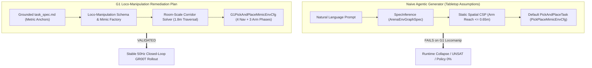
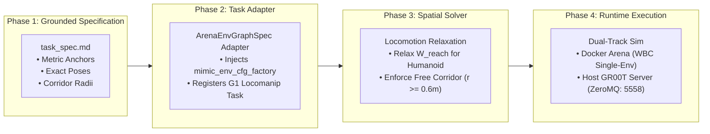

# G1 Loco-Manipulation Agentic Environment Generation Remediation Plan

This document details the root cause analysis (RCA), architectural remediation plan, and implementation roadmap for enabling LLM-driven agentic environment generation for **Unitree G1 Humanoid Loco-Manipulation Tasks** (`galileo_g1_locomanip_pick_and_place`) in **IsaacLab-Arena 0.3.0** with **NVIDIA Isaac-GR00T**.

---

## 1. Executive Summary & Problem Statement

When attempting to generate or replicate the canonical **G1 Loco-Manipulation Box Pick and Place** task ([Tutorial Reference](https://isaac-sim.github.io/IsaacLab-Arena/release/0.3.0-prerelease/pages/example_workflows/locomanipulation/index.html)) using the agentic pipeline (`isaaclab_arena/agentic_environment_generation/`), the generation fails or produces an invalid simulation.



---

## 2. Root Cause Analysis (RCA): The 5 Structural Gaps

### Gap 1: Spatial Reachability Envelope ($\mathcal{W}_{\text{reach}}$) vs. Room-Scale Navigation
* **Issue**: The agentic Spatial CSP solver assumes stationary base manipulators (e.g. Franka, Droid) where all target assets must lie within the arm's static kinematic reach envelope:
  $$\mathbf{p}_{\text{destination}} \in \mathcal{W}_{\text{reach}}(\mathbf{p}_{\text{robot\_base}}) \approx 0.65\text{ m}$$
* **Impact on G1**: In `galileo_g1_locomanip_pick_and_place`, the brown box is at $(0.58, 0.18, 0.07)$ and the blue bin is at $(-0.25, -1.63, -0.26)$ — a distance of **$> 1.8\text{ meters}$ across the room**. The solver flags this as **UNSAT/Unreachable** or erroneously moves the destination right in front of the robot.

### Gap 2: Monolithic Room Mesh (`galileo_locomanip`) vs. Composable Fixtures
* **Issue**: The hand-crafted environment uses `galileo_locomanip` — a single monolithic USD mesh containing the floor, walls, shelf, and tables with baked geometry.
* **Impact on G1**: The agent cannot find discrete `shelf` or `table` assets in `AssetRegistry`. Attempting to resolve sub-prims via `prim_path_inference.py` fails because `galileo_locomanip` lacks explicit semantic surface anchor frames, causing the box to spawn in an invalid collision state or floating in the void.

### Gap 3: Missing Mimic State-Machine Ingestion (`G1PickAndPlaceMimicEnvCfg`)
* **Issue**: In `arena_env_graph_task_conversion_utils.py`, `PickAndPlaceTask` is instantiated via standard keyword arguments:
  ```python
  task_class = TaskRegistry().get_task_by_name(task_spec.kind)
  return task_class(**task_init_kwargs)
  ```
* **Impact on G1**: `ArenaEnvGraphSpec` has no field to supply `mimic_env_cfg_factory`. The task falls back to `PickPlaceMimicEnvCfg` (single-arm stationary manipulator), omitting the **4-phase bipedal locomotion state machine** and **3-subtask bimanual sequences** required for data generation, teleop replay, and task tracking.

### Gap 4: Dynamics, Balance & Pinocchio WBC Invariants
* **Issue**: Declarative scene graphs only specify static positions at $t=0$. G1 is a 29-DOF humanoid requiring active Whole-Body Control (WBC) to maintain dynamic balance under gravity ($200\text{Hz}-500\text{Hz}$).
* **Impact on G1**: 
  1. Spawning G1 in a default zero pose without the calibrated squatting joint state causes immediate tipping/collapse.
  2. Running parallel rollouts (`--num_envs > 1`) with `g1_wbc_pink` causes Pinocchio QP multithreading race conditions (segfault).

### Gap 5: Policy Observation & Action Distribution Shift (GR00T VLA Model)
* **Issue**: The pre-trained checkpoint (`GN1x-Tuned-Arena-G1-Loco-Manipulation`) was trained via imitation learning on exact Galileo lab trajectories.
* **Impact on G1**: Any procedural procedural change in table height, bin placement, or camera extrinsics creates an out-of-distribution (OOD) visual and proprioceptive shift, dropping policy success to $0\%$.

---

## 3. The Remediation Plan & Architecture



---

### Step 1: Grounded Task Specification (`task_spec.md`)
Replace unconstrained natural language prompts with an explicit metric specification anchored to the Galileo coordinate frame:

```markdown
# Grounded Task Specification: Galileo G1 Loco-Manipulation Box Pick and Place

## 1. Environment & Invariants
- Terrain: isaaclab_arena.terrains.default_ground_plane (z=0.0)
- Background: galileo_locomanip (USD: isaaclab_arena/assets/galileo_locomanip.usd)
- Gravity: [0.0, 0.0, -9.81]

## 2. Embodiment Specification
- Robot: unitree_g1 (Class: G1WBCJointEmbodiment / G1WBCPinkEmbodiment)
- Initial Pose: position=[0.0, 0.18, 0.0], orientation_xyzw=[0.0, 0.0, 0.0, 1.0]
- Controller: g1_wbc_joint (for parallel sim) | g1_wbc_pink (single env: --num_envs 1)
- Sensors: ego_view (Torso/Head RGB-D, 1280x720)

## 3. Fixtures & Metric Surface Anchors
- Pickup Surface (Shelf Tier):
  - World Coordinates: position=[0.5785, 0.18, 0.0707]
  - Sampling Range: XY_delta = +/- 0.025m, Z = 0.0707m
- Destination Receptacle (Blue Sorting Bin):
  - World Coordinates: position=[-0.2450, -1.6272, -0.2641], orientation_xyzw=[0.0, 0.0, 1.0, 0.0]

## 4. Manipulated Objects
- Target Object: brown_box (Rigid body)
  - Initial Placement: ON shelf_tier
- Destination: blue_sorting_bin (Rigid body)
  - Initial Placement: ON floor_anchor

## 5. Locomotion & Navigation Corridor
- Traversal Vector: From [0.0, 0.18] to [-0.25, -1.63] (Distance ~1.85m)
- Free-Space Clearance: r >= 0.6m unobstructed bipedal turning radius
```

---

### Step 2: Task Adapter & Schema Extension

To allow declarative scene graph compilation to instantiate humanoid loco-manipulation tasks without crashing:

1. **Register Custom Task Factory**:
   Ensure `G1PickAndPlaceMimicEnvCfg` is injected when `embodiment` is recognized as a humanoid:
   ```python
   def _build_g1_pick_and_place_mimic_cfg(arm_mode):
       return G1PickAndPlaceMimicEnvCfg(
           pick_up_object_name="brown_box",
           destination_location_name="blue_sorting_bin",
           arm_mode=arm_mode,
       )
   ```
2. **Support Composite Task Parameter Overrides in `arena_env_graph_task_conversion_utils.py`**:
   Add support for task metadata tags that resolve humanoid-specific Mimic environment factories.

---

### Step 3: Spatial Solver Loco-Manipulation Relaxation

Update the Spatial Constraint Satisfaction Problem (CSP) rules:
* **Tabletop Mode** (Franka/Droid): Enforce $\text{dist}(\mathbf{p}_{\text{robot}}, \mathbf{p}_{\text{target}}) \le \mathcal{W}_{\text{reach}}$.
* **Loco-Manipulation Mode** (G1/Humanoid): 
  * Relax arm reach constraint between robot base and destination receptacle.
  * Verify **Free-Space Corridor**:
    $$\text{SDF}(\text{corridor}(\mathbf{p}_{\text{start}}, \mathbf{p}_{\text{goal}}), \mathcal{V}_{\text{fixtures}}) \ge r_{\text{clearance}} = 0.6\text{ m}$$

---

### Step 4: Verification & Execution Runbook

#### 1. Launch GR00T Policy Server (Host / Container on Port 5558)
```bash
./docker/run_gr00t_server.sh \
    -m /models/isaaclab_arena/locomanipulation_tutorial/checkpoint-20000 \
    -e NEW_EMBODIMENT \
    -c isaaclab_arena_gr00t/embodiments/g1/g1_sim_wbc_data_config.py \
    -p 5558 -d
```

#### 2. Verify Zero-Action Gravity Settle (In Arena Container)
```bash
/isaac-sim/python.sh isaaclab_arena/evaluation/policy_runner.py \
    --viz kit \
    --policy_type zero_action \
    --num_steps 150 \
    --enable_cameras \
    galileo_g1_locomanip_pick_and_place \
    --object brown_box \
    --embodiment g1_wbc_joint
```

#### 3. Run Full Closed-Loop Policy Evaluation (50Hz Closed Loop)
```bash
/isaac-sim/python.sh isaaclab_arena/evaluation/policy_runner.py \
    --viz kit \
    --policy_type isaaclab_arena_gr00t.policy.gr00t_remote_closedloop_policy.Gr00tRemoteClosedloopPolicy \
    --policy_config_yaml_path isaaclab_arena_gr00t/policy/config/g1_locomanip_gr00t_closedloop_config.yaml \
    --remote_host 127.0.0.1 \
    --remote_port 5558 \
    --num_steps 1200 \
    --num_envs 1 \
    --enable_cameras \
    galileo_g1_locomanip_pick_and_place \
    --object brown_box \
    --embodiment g1_wbc_joint
```

---

## 4. Summary Matrix: Tabletop vs. Loco-Manipulation Synthesis

| Dimension | Tabletop Manipulation (Droid/Franka) | Loco-Manipulation (Unitree G1) |
| :--- | :--- | :--- |
| **Kinematic Model** | Fixed base ($[0,0,0]$) | Floating base ($SE(3)$ bipedal balance) |
| **Reach Envelope** | $d \le 0.65\text{ m}$ (Static sphere) | Room-scale ($d > 1.8\text{ m}$, free locomotion corridor) |
| **Scene Layout** | Discrete tables & trays | Monolithic rooms (`galileo_locomanip`) with metric anchors |
| **Mimic Config** | `PickPlaceMimicEnvCfg` | `G1PickAndPlaceMimicEnvCfg` (4 nav + 3 arm subtasks) |
| **Controller** | IK / Delta Position | 50Hz Decoupled Whole-Body Control (WBC) |
| **Policy Sensitivity** | Moderate visual generalization | High sensitivity to ego-camera extrinsics & lighting |
