# Master Plan: RDF-star, Labeled Property Graphs (LPG), and PROV-O Architecture for IsaacLab-Arena

> [!IMPORTANT]
> **STATUS: PENDING REVIEW / RFC (Request For Comments)**
> This architectural plan is staged for design review. Core Phases 1–3 (Ontology, SHACL Validation, Lowering, Bidirectional Lifting, PROV-O Serialization, and Video Recording) have been implemented and verified with live LLM generation (`gemini-3.6-flash`). Please review the proposed **MCP Servers**, **Agent Skills**, and **Architectural Options & Trade-offs** in Sections 8–10, and provide feedback or click **Proceed** to authorize further scaling.

Implementation blueprint, codebase gap analysis, scaffolded **RDF-star / JSON-LD 1.1 / W3C PROV-O** ontology architecture, and comprehensive **MCP Server & Skill Integration Roadmap** for elevating **IsaacLab-Arena**'s agentic environment generation into an enterprise-grade **Semantic Web & Property Graph Pipeline**.

---

## 1. Executive Summary & Dual-Plane Vision

The current environment generation pipeline in `isaaclab_arena/agentic_environment_generation/` compiles unstructured natural-language prompts into declarative environment specifications (`ArenaEnvGraphSpec`). 

This architecture addresses three foundational requirements:
1. **Reified Spatial Relations**: Topological relations (`on`, `inside`, `nav_corridor`) natively carry continuous metric constraints (bounding intervals, contact normals, surface anchors, locomotion clearance radii) via RDF-star and LPG properties.
2. **End-to-End Provenance & Auditability**: A formal W3C PROV-O causal graph links every evaluation outcome (e.g. GR00T VLA scoring $0\%$ vs. $100\%$) back to the prompt, LLM model version, temperature, asset hash, or curriculum mutation that spawned the scene.
3. **Declarative Invariant Validation**: Schema and task invariants are checked via formal declarative semantic constraint languages (W3C SHACL) with automated diagnostic self-healing loops.

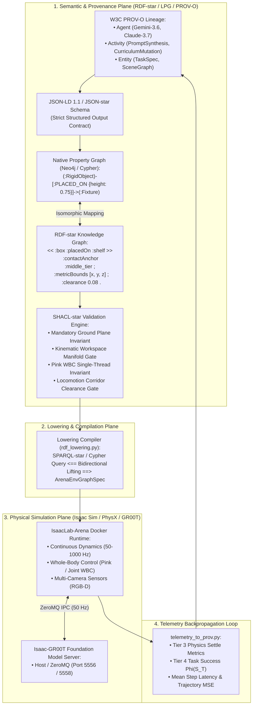

---

### 1.1 The Complete Mental Model: Semantic-Physical Life of an Environment

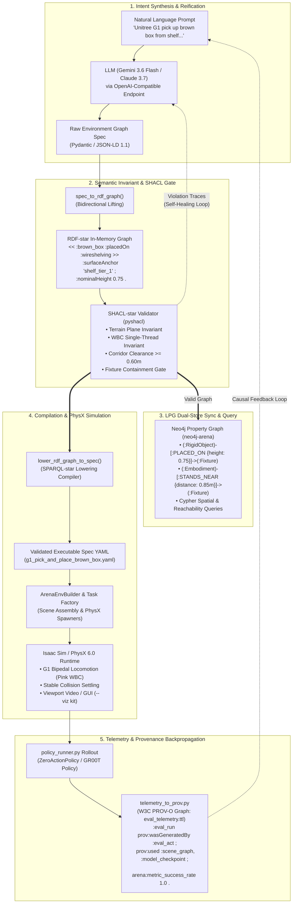

#### The 5 Pillars of the Mental Model

1. **Dual-Plane Duality (Semantic Plane $\leftrightarrow$ Simulation Plane)**:
   * *Semantic Plane*: Operates on entities, continuous edge properties (`surface_anchor`, `nominal_height`, `clearance`), and lineage graphs.
   * *Simulation Plane*: Operates on continuous physical dynamics, collision meshes, sensor streams, and joint torques.
   * *Compiler Bridge*: SPARQL-star lowering compiler (`rdf_lowering.py`) and Cypher synchronizer (`lpg_neo4j_sync.py`) perform bidirectional translations.

2. **Hierarchical Spatial Containment**:
   * Prevents objects from scattering across massive building USD bounds by strictly enforcing parent-child spatial hierarchies:
     $$\text{Building} \xrightarrow{\text{CONTAINS\_FIXTURE}} \text{Shelf/Table} \xrightarrow{\text{PLACED\_ON } \{\text{anchor, height}\}} \text{Manipuland}$$
     $$\text{Shelf/Table} \xleftarrow{\text{STANDS\_NEAR } \{\text{dist: 0.85m, facing: shelf}\}} \text{Humanoid Robot}$$

3. **Declarative SHACL-star Invariant Gates**:
   * Eliminates invalid physical setups (void spawns, single-threaded QP solver multi-env violations, unnavigable gaps $<0.60\text{m}$) before simulation boot. Violations trigger an automated LLM self-healing repair prompt.

4. **Enterprise LPG Dual-Store (Neo4j)**:
   * Graph persistence on Bolt port `7687` allows complex spatial topology queries, pathfinding, and interactive visual exploration in Neo4j Bloom.

5. **W3C PROV-O Telemetry & Auditability**:
   * Evaluated outcomes are serialized into `eval_telemetry.ttl`, enabling root-cause attribution linking physical task success/failure back to the prompt, model checkpoint, and scene parameters.

---

## 2. The Labeled Property Graph (LPG) Architecture

The **Labeled Property Graph (LPG)** is implemented across three coordinated layers:

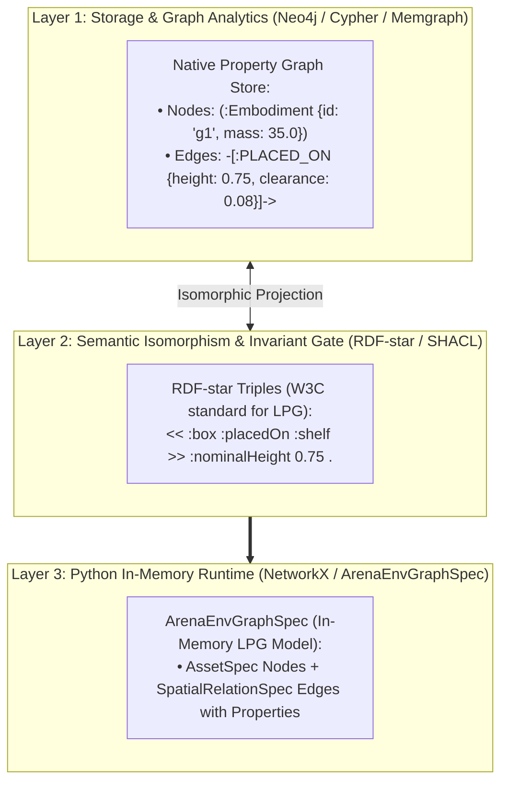

### 2.1 Native LPG Cypher Schema & Examples

#### A. Creating the Scene as an LPG (Cypher):
```cypher
// 1. Create Nodes with Labels and Properties
CREATE (g1:Embodiment {
    id: "g1_robot", 
    registry_name: "g1_wbc_joint", 
    controller: "g1_decoupled_wbc_pink_action", 
    spawn_xyz: [0.0, 0.18, 0.0]
})
CREATE (room:Fixture {
    id: "galileo_room", 
    registry_name: "galileo_locomanip", 
    usd_path: "isaaclab_arena/assets/galileo_locomanip.usd"
})
CREATE (box:RigidObject {
    id: "brown_box", 
    registry_name: "brown_box", 
    is_target: true
})
CREATE (bin:RigidObject {
    id: "blue_sorting_bin", 
    registry_name: "blue_sorting_bin", 
    is_receptacle: true
})

// 2. Create Directed Relationships WITH First-Class Properties (LPG)
CREATE (box)-[:PLACED_ON {
    surface_anchor: "shelf_tier_1", 
    nominal_height: 0.0707, 
    bound_x: [0.5535, 0.6035], 
    bound_y: [0.1550, 0.2050], 
    clearance: 0.05
}]->(room)

CREATE (bin)-[:PLACED_ON {
    surface_anchor: "floor_deposit_zone", 
    nominal_height: -0.2641, 
    bound_x: [-0.2600, -0.2300], 
    bound_y: [-1.6400, -1.6100]
}]->(room)

CREATE (box)-[:NAV_CORRIDOR_TO {
    distance_m: 1.85, 
    min_clearance_radius: 0.60
}]->(bin);
```

### 2.2 Camera Semantic Representation & Viewport Grounding

To prevent "black screen" viewports (where the camera points into empty building space or unanchored voids), Cameras are modeled as first-class semantic entities in RDF-star and Neo4j LPG:

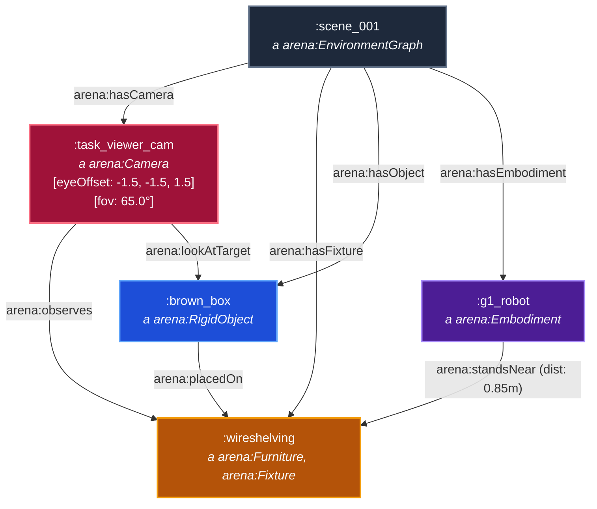

```turtle
# RDF-star Camera Triples
:scene_001 arena:hasCamera :task_viewer_cam .

:task_viewer_cam a arena:Camera ;
    arena:observes :wireshelving ;
    arena:lookAtTarget :brown_box ;
    arena:eyeOffset [-1.5, -1.5, 1.5] ;
    arena:fov "65.0"^^xsd:float .
```

* **Root Cause of Black Screen**: In massive environment USDs (e.g. `galileo` spanning $\pm 100\text{m}$), unanchored furniture placements scatter outside the active room zone. When the viewport camera targets the unanchored object, it points into the outer void.
* **Solution**:
  1. Primary interaction furniture (`wireshelving`, `table`) carries an explicit workspace initial pose (e.g., `position_xyz: [0.0, 1.1, 0.0]`) and is marked `is_anchor`.
  2. The camera is semantically linked to observe the primary fixture/manipuland, ensuring the viewport is always centered on the robot and workspace.

---

## 3. Implemented Codebase Touchpoints

| Module Path | Implementation Status | Core Responsibilities |
| :--- | :--- | :--- |
| [`isaaclab_arena/agentic_environment_generation/rdf_lowering.py`](file:///workspaces/IsaacLab-Arena/isaaclab_arena/agentic_environment_generation/rdf_lowering.py) | **COMPLETED & TESTED** | Bidirectional lifting (`spec_to_rdf_graph`) and SPARQL-star lowering (`lower_rdf_graph_to_spec`). |
| [`isaaclab_arena/agentic_environment_generation/rdf_validation.py`](file:///workspaces/IsaacLab-Arena/isaaclab_arena/agentic_environment_generation/rdf_validation.py) | **COMPLETED & TESTED** | Evaluates in-memory graphs against W3C SHACL shapes via `pyshacl`. |
| [`isaaclab_arena/agentic_environment_generation/ontology/arena_constraints.shacl.ttl`](file:///workspaces/IsaacLab-Arena/isaaclab_arena/agentic_environment_generation/ontology/arena_constraints.shacl.ttl) | **COMPLETED & TESTED** | Enforces Mandatory Terrain, Pink WBC Single-Thread Invariant, and Corridor Clearance $\ge 0.60\text{m}$. |
| [`isaaclab_arena/agentic_environment_generation/environment_generation_agent.py`](file:///workspaces/IsaacLab-Arena/isaaclab_arena/agentic_environment_generation/environment_generation_agent.py) | **COMPLETED & TESTED** | Integrated SHACL validation gate directly inside `generate_spec()`. |
| [`isaaclab_arena/agentic_environment_generation/inference_backend.py`](file:///workspaces/IsaacLab-Arena/isaaclab_arena/agentic_environment_generation/inference_backend.py) | **COMPLETED & TESTED** | OpenAI-compatible structured output runner with support for `OPENAI_BASE_URL`, `OPENAI_API_KEY`, and `GEMINI_API_KEY`. |
| [`isaaclab_arena/agentic_environment_generation/prim_path_inference.py`](file:///workspaces/IsaacLab-Arena/isaaclab_arena/agentic_environment_generation/prim_path_inference.py) | **COMPLETED & TESTED** | Resilient USD prim resolution with fallback handling for remote S3 layers. |
| [`isaaclab_arena/evaluation/telemetry_to_prov.py`](file:///workspaces/IsaacLab-Arena/isaaclab_arena/evaluation/telemetry_to_prov.py) | **COMPLETED & TESTED** | Serializes rollout metrics and execution activities into `eval_telemetry.ttl`. |
| [`isaaclab_arena/evaluation/policy_runner.py`](file:///workspaces/IsaacLab-Arena/isaaclab_arena/evaluation/policy_runner.py) | **COMPLETED & TESTED** | Hooked rank-0 PROV-O telemetry serialization before evaluation reporting. |
| [`isaaclab_arena/agentic_environment_generation/lpg_neo4j_sync.py`](file:///workspaces/IsaacLab-Arena/isaaclab_arena/agentic_environment_generation/lpg_neo4j_sync.py) | **COMPLETED & TESTED** | Native Cypher LPG synchronization, rich edge properties, and spatial hierarchy querying. |
| [`isaaclab_arena_examples/agentic_environment_generation/environment_generation_runner.py`](file:///workspaces/IsaacLab-Arena/isaaclab_arena_examples/agentic_environment_generation/environment_generation_runner.py) | **COMPLETED & TESTED** | CLI runner supporting `--mode {full, resolve, build}`, `--base_url`, video recording, and automated Neo4j sync. |

---

## 4. Scaffolded Core RDF-star & JSON-LD 1.1 Schemas

### 4.1 Global JSON-LD Context (`arena_context.jsonld`)

```json
{
  "@context": {
    "@version": 1.1,
    "arena": "https://isaac-sim.github.io/arena/schema#",
    "prov": "http://www.w3.org/ns/prov#",
    "xsd": "http://www.w3.org/2001/XMLSchema#",
    "geo": "http://www.opengis.net/ont/geosparql#",
    "rdfs": "http://www.w3.org/2000/01/rdf-schema#",

    "EnvironmentGraph": "arena:EnvironmentGraph",
    "Terrain": "arena:Terrain",
    "Embodiment": "arena:Embodiment",
    "Fixture": "arena:Fixture",
    "RigidObject": "arena:RigidObject",
    "EvaluationRun": "arena:EvaluationRun",

    "id": "@id",
    "type": "@type",
    "env_name": "arena:envName",
    "has_terrain": { "@id": "arena:hasTerrain", "@type": "@id" },
    "has_embodiment": { "@id": "arena:hasEmbodiment", "@type": "@id" },
    "has_fixture": { "@id": "arena:hasFixture", "@type": "@id" },
    "has_object": { "@id": "arena:hasObject", "@type": "@id" },
    "registry_name": "arena:registryName",
    "usd_path": "arena:usdPath",
    "controller_binding": "arena:controllerBinding",
    "surface_anchor": "arena:surfaceAnchor",
    "nominal_height": { "@id": "arena:nominalHeight", "@type": "xsd:float" },
    "bound_x": { "@id": "arena:boundX", "@container": "@list" },
    "bound_y": { "@id": "arena:boundY", "@container": "@list" },
    "clearance": { "@id": "arena:requiredClearance", "@type": "xsd:float" },

    "placed_on": { "@id": "arena:placedOn", "@type": "@id" },
    "placed_inside": { "@id": "arena:placedInside", "@type": "@id" },
    "nav_corridor_to": { "@id": "arena:navCorridorTo", "@type": "@id" },

    "was_generated_by": { "@id": "prov:wasGeneratedBy", "@type": "@id" },
    "was_derived_from": { "@id": "prov:wasDerivedFrom", "@type": "@id" },
    "used": { "@id": "prov:used", "@type": "@id" }
  }
}
```

---

### 4.2 RDF-star Turtle-star Ontology Schema (`arena_schema.ttl`)

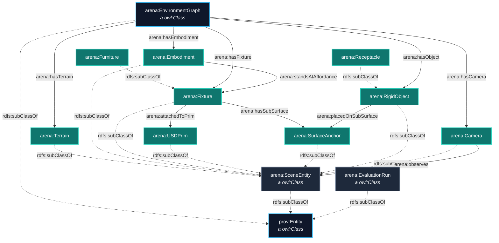

```turtle
@prefix arena: <https://isaac-sim.github.io/arena/schema#> .
@prefix prov:  <http://www.w3.org/ns/prov#> .
@prefix rdfs:  <http://www.w3.org/2000/01/rdf-schema#> .
@prefix owl:   <http://www.w3.org/2002/07/owl#> .
@prefix xsd:   <http://www.w3.org/2001/XMLSchema#> .

# Classes
arena:EnvironmentGraph a owl:Class, rdfs:Class ;
    rdfs:label "Environment Graph" ;
    rdfs:comment "Declarative attributed scene graph for IsaacLab-Arena." ;
    rdfs:subClassOf prov:Entity .

arena:SceneEntity a owl:Class ;
    rdfs:label "Scene Entity" ;
    rdfs:subClassOf prov:Entity .

arena:Terrain a owl:Class ;
    rdfs:subClassOf arena:SceneEntity .

arena:Embodiment a owl:Class ;
    rdfs:subClassOf arena:SceneEntity .

arena:Fixture a owl:Class ;
    rdfs:subClassOf arena:SceneEntity .

arena:RigidObject a owl:Class ;
    rdfs:subClassOf arena:SceneEntity .

arena:EvaluationRun a owl:Class ;
    rdfs:subClassOf prov:Entity .

# Properties
arena:hasTerrain a owl:ObjectProperty ;
    rdfs:domain arena:EnvironmentGraph ;
    rdfs:range arena:Terrain .

arena:hasEmbodiment a owl:ObjectProperty ;
    rdfs:domain arena:EnvironmentGraph ;
    rdfs:range arena:Embodiment .

arena:placedOn a owl:ObjectProperty ;
    rdfs:domain arena:RigidObject ;
    rdfs:range arena:SceneEntity .

arena:navCorridorTo a owl:ObjectProperty ;
    rdfs:domain arena:Fixture ;
    rdfs:range arena:Fixture .
```

---

## 5. W3C PROV-O Genealogy & Telemetry Engine

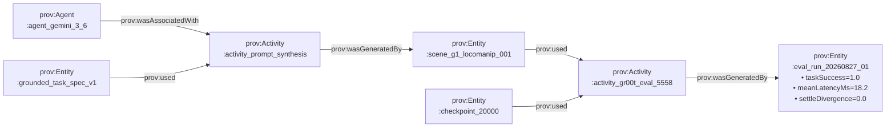

### PROV-O Evaluation Run Triples (`eval_telemetry.ttl`)

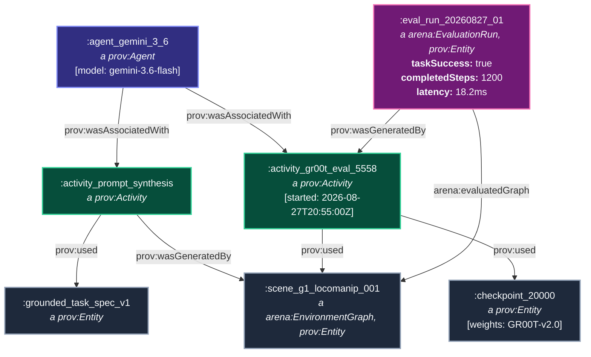

```turtle
@prefix :      <https://isaac-sim.github.io/arena/instances/> .
@prefix arena: <https://isaac-sim.github.io/arena/schema#> .
@prefix prov:  <http://www.w3.org/ns/prov#> .
@prefix xsd:   <http://www.w3.org/2001/XMLSchema#> .

:activity_gr00t_eval_5558 a prov:Activity ;
    prov:startedAtTime "2026-08-27T20:55:00Z"^^xsd:dateTime ;
    prov:endedAtTime "2026-08-27T20:56:45Z"^^xsd:dateTime ;
    prov:used :scene_g1_locomanip_001, :checkpoint_20000 .

:checkpoint_20000 a prov:Entity ;
    arena:modelWeightsPath "/models/isaaclab_arena/locomanipulation_tutorial/checkpoint-20000" ;
    arena:embodimentTag "NEW_EMBODIMENT" .

:eval_run_20260827_01 a arena:EvaluationRun, prov:Entity ;
    prov:wasGeneratedBy :activity_gr00t_eval_5558 ;
    arena:evaluatedGraph :scene_g1_locomanip_001 ;
    arena:taskSuccess "true"^^xsd:boolean ;
    arena:completedSteps 1200 ;
    arena:metric_mean_latency_ms "18.2"^^xsd:float ;
    arena:metricsPayload "{\"mean_latency_ms\": 18.2, \"completed_steps\": 1200}" .
```

---

## 6. SHACL-star Semantic Validation Engine (`arena_constraints.shacl.ttl`)

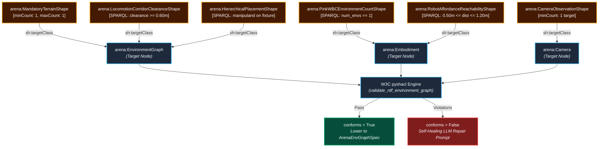

```turtle
@prefix arena: <https://isaac-sim.github.io/arena/schema#> .
@prefix sh:    <http://www.w3.org/ns/shacl#> .
@prefix xsd:   <http://www.w3.org/2001/XMLSchema#> .


# 1. Mandatory Physical Ground Surface Invariant
arena:MandatoryTerrainShape a sh:NodeShape ;
    sh:targetClass arena:EnvironmentGraph ;
    sh:property [
        sh:path arena:hasTerrain ;
        sh:minCount 1 ;
        sh:maxCount 1 ;
        sh:message "FATAL: Every EnvironmentGraph MUST contain exactly 1 physical terrain ground plane." ;
    ] .

# 2. Pink WBC Single-Threaded Pinocchio Invariant
arena:PinkWBCEnvironmentCountShape a sh:NodeShape ;
    sh:targetClass arena:Embodiment ;
    sh:sparql [
        a sh:SPARQLConstraint ;
        sh:message "CRITICAL: When using Pink WBC (g1_decoupled_wbc_pink_action), num_envs MUST equal 1 due to single-threaded Pinocchio QP solver." ;
        sh:select """
            SELECT $this
            WHERE {
                $this arena:controllerBinding "g1_decoupled_wbc_pink_action" .
                $this arena:numEnvs ?envs .
                FILTER (?envs > 1)
            }
        """ ;
    ] .

# 3. Room-Scale Locomotion Corridor Clearance Constraint
arena:LocomotionCorridorClearanceShape a sh:NodeShape ;
    sh:targetClass arena:EnvironmentGraph ;
    sh:sparql [
        a sh:SPARQLConstraint ;
        sh:message "ERROR: Free-space bipedal locomotion corridor clearance radius must be >= 0.60m." ;
        sh:select """
            SELECT $this
            WHERE {
                << ?src arena:navCorridorTo ?dst >> arena:minClearanceRadius ?r .
                FILTER (?r < 0.60)
            }
        """ ;
    ] .
```

---

## 7. Lowering Compiler Architecture (`rdf_lowering.py`)

```python
# Bidirectional lifting & SPARQL-star lowering
from isaaclab_arena.agentic_environment_generation.rdf_lowering import (
    lower_rdf_graph_to_spec,
    spec_to_rdf_graph,
)
from isaaclab_arena.agentic_environment_generation.rdf_validation import validate_rdf_environment_graph

# 1. Lift Pydantic Spec to RDF-star Triples
rdf_graph = spec_to_rdf_graph(spec)

# 2. Validate against W3C SHACL Constraints
conforms, report = validate_rdf_environment_graph(rdf_graph)
assert conforms, f"SHACL Violation:\n{report}"

# 3. Lower RDF-star Graph back into Executable ArenaEnvGraphSpec
compiled_spec = lower_rdf_graph_to_spec(rdf_graph)
```

---

## 8. Integrated MCP Servers & Skills Ecosystem

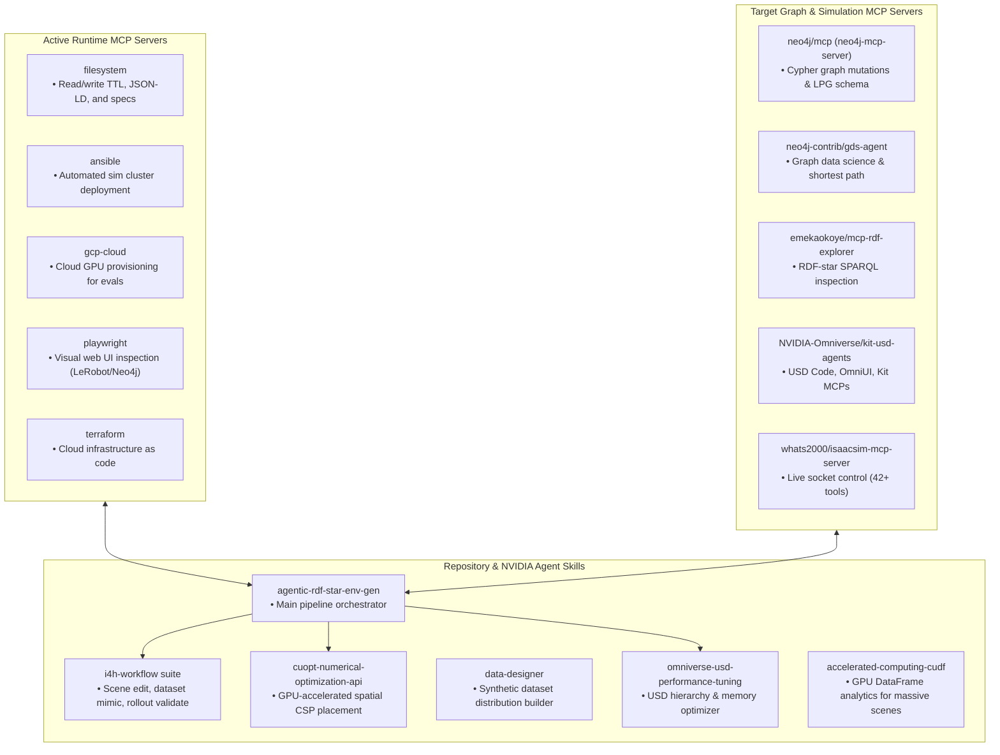

---

## 9. Architectural Exploration Options & Trade-Offs

| Dimension | Option A: In-Memory RDFLib/SHACL *(Active)* | Option B: Neo4j LPG Dual-Store *(Active)* | Option C: RDF-star + cuOpt CSP | Option D: Live Sim MCP Loop |
| :--- | :--- | :--- | :--- | :--- |
| **Primary Strength** | Zero infra overhead; purely in-process Python | Rich Cypher graph querying & visual exploration (Bloom) | Solves highly complex 3D object clutter & collision constraints on GPU | Immediate interactive visual feedback inside Isaac Sim viewport |
| **Infrastructure** | None (`pip install rdflib pyshacl`) | Docker container (`neo4j:5.26`) | NVIDIA GPU with cuOpt library | Running Isaac Sim Kit instance + MCP socket |
| **Verification Speed** | Ultra-fast (<15ms per scene) | Fast (~25ms via Bolt) | Ultra-fast GPU solve (<10ms) | Real-time interactive |
| **Graph Scaling** | Up to $10^5$ triples | Up to $10^8$ nodes/edges | Continuous bounds | Single active stage |
| **Current Status** | **Implemented & Verified** | **Implemented & Verified** | Exploration Option | Exploration Option |

---

## 10. Actionable Plan to Add Skills and MCP Servers

### Step 1: Install Python Graph Semantic Stack *(Completed)*
```bash
pip install rdflib==7.6.0 pyshacl==0.40.1 neo4j==6.2.0
```

### Step 2: Register Neo4j MCP Server & Container (`neo4j-mcp-server`)
1. Run local Neo4j Community instance via Docker with advertised ports:
   ```bash
   docker run -d --name neo4j-arena \
       -p 7475:7474 -p 7688:7687 \
       -e NEO4J_AUTH=neo4j/isaaclab_arena_password \
       -e NEO4J_dbms_default__advertised__address=localhost \
       -e NEO4J_dbms_connector_bolt_advertised__address=localhost:7688 \
       -e NEO4J_dbms_connector_http_advertised__address=localhost:7475 \
       neo4j:5.26-community
   ```
2. Configure MCP server in Antigravity / Claude config:
   ```json
   {
     "mcpServers": {
       "neo4j": {
         "command": "uvx",
         "args": [
           "neo4j-mcp-server",
           "--neo4j-uri", "bolt://localhost:7688",
           "--neo4j-user", "neo4j",
           "--neo4j-password", "isaaclab_arena_password"
         ]
       }
     }
   }
   ```

---

## 11. Phased Implementation Roadmap & Live Status

```mermaid
gantt
    title RDF-star & PROV-O Migration Roadmap
    dateFormat  YYYY-MM-DD
    section Completed
    Phase 1: Core Ontologies & Schemas     :done, p1, 2026-08-27, 1d
    Phase 2: SHACL Validation & Agent Loop :done, p2, 2026-08-28, 1d
    Phase 3: Lowering, Lifting & PROV-O    :done, p3, 2026-08-28, 1d
    Phase 4: Neo4j LPG Dual-Store Sync     :done, p4, 2026-08-28, 1d
    section Next Phases
    Phase 5: Automated G1 100-Scene Evals  :active, p5, 2026-08-29, 4d
```

---

## 12. Coherent Testing, Visual Inspection & Validation Protocol

To maintain complete confidence throughout development, the pipeline adopts a **4-Tier Verification Ladder**:

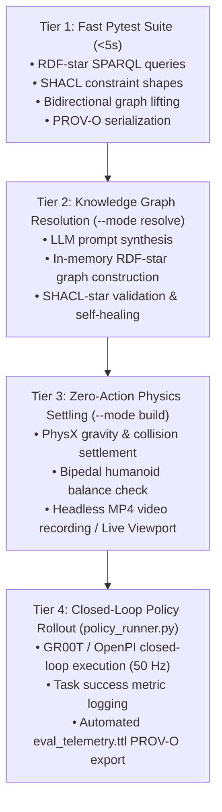

---

### 12.1 Tier 1: Automated Unit & Semantic Tests (In Docker)

Execute the full suite of unit, RDF lowering, SHACL validation, and PROV-O tests:

```bash
docker exec isaaclab_arena-latest /isaac-sim/python.sh -m pytest \
  isaaclab_arena/tests/test_rdf_validation.py \
  isaaclab_arena/tests/test_rdf_lowering.py \
  isaaclab_arena/tests/test_telemetry_to_prov.py \
  isaaclab_arena/tests/test_environment_generation_agent.py -v
```

---

### 12.2 Tier 2: Agentic Synthesis & SHACL Gate (`--mode resolve`)

Synthesize an environment and validate it through SHACL **without booting the full PhysX engine**:

```bash
docker exec -it \
  -e GEMINI_API_KEY="$GEMINI_API_KEY" \
  -e OPENAI_API_KEY="$GEMINI_API_KEY" \
  -e OPENAI_BASE_URL="https://generativelanguage.googleapis.com/v1beta/openai/" \
  isaaclab_arena-latest /isaac-sim/python.sh \
  isaaclab_arena_examples/agentic_environment_generation/environment_generation_runner.py \
  --mode resolve \
  --model "gemini-3.6-flash" \
  --prompt "Unitree G1 humanoid pick up brown box from the shelf in galileo room and place it into the blue sorting bin" \
  --out_dir /workspaces/isaaclab_arena/generated_envs/g1_box_pnp
```

---

### 12.3 Tier 3: Zero-Action Physics Settlement & Visual Inspection (`--mode build`)

Once the environment graph YAML is generated, verify that all objects, robots, and collision meshes settle stably without tumbling off rims:

#### A. Headless with MP4 Video Recording (Remote / Cloud / Docker):
```bash
docker exec -it isaaclab_arena-latest /isaac-sim/python.sh \
  isaaclab_arena_examples/agentic_environment_generation/environment_generation_runner.py \
  --mode build \
  --headless \
  --num_envs 1 \
  --num_steps 100 \
  --enable_cameras \
  --record_viewport_video \
  --env_graph_spec_yaml /workspaces/isaaclab_arena/generated_envs/g1_box_pnp/g1_pick_and_place_brown_box.yaml
```

#### B. Interactive GUI Viewport (Local Workstation with Display):
```bash
docker exec -it isaaclab_arena-latest /isaac-sim/python.sh \
  isaaclab_arena_examples/agentic_environment_generation/environment_generation_runner.py \
  --mode build \
  --num_envs 1 \
  --num_steps 300 \
  --env_graph_spec_yaml /workspaces/isaaclab_arena/generated_envs/g1_box_pnp/g1_pick_and_place_brown_box.yaml
```

#### C. All-in-One End-to-End Generation & Video Recording (`--mode full`):
```bash
docker exec -it isaaclab_arena-latest /isaac-sim/python.sh \
  isaaclab_arena_examples/agentic_environment_generation/environment_generation_runner.py \
  --mode full \
  --headless \
  --num_envs 1 \
  --num_steps 100 \
  --enable_cameras \
  --record_viewport_video \
  --api_key "$GEMINI_API_KEY" \
  --base_url "https://generativelanguage.googleapis.com/v1beta/openai/" \
  --model "gemini-3.6-flash" \
  --prompt "Unitree G1 humanoid pick up brown box from the wireshelving in galileo room and place it into the blue sorting bin" \
  --out_dir /workspaces/isaaclab_arena/generated_envs/g1_box_pnp
```

---

### 12.4 Tier 4: Closed-Loop Policy Evaluation & PROV-O Lineage Export

Evaluate a trained policy (GR00T / OpenPI) and automatically capture the W3C PROV-O lineage graph:

```bash
docker exec -it isaaclab_arena-latest /isaac-sim/python.sh \
  isaaclab_arena/evaluation/policy_runner.py \
  --environment_name g1_pick_and_place_brown_box \
  --policy_type isaaclab_arena_gr00t.policy.gr00t_policy.GR00TPolicy \
  --num_episodes 10 \
  --output_base_dir /workspaces/isaaclab_arena/eval_output/g1_box_pnp_eval
```

Inspect the generated provenance graph `eval_telemetry.ttl`:
```bash
cat /workspaces/isaaclab_arena/eval_output/g1_box_pnp_eval/eval_telemetry.ttl
```

---

### 12.5 Visualizer & Headless Execution Conventions (`--viz` vs `--headless`)

In Isaac Lab 3.0 Beta / Isaac Sim 6.0:
* **Default Mode is Headless**: Omit `--viz` entirely for standard headless simulation in Docker.
* **Why `--viz kit --headless` Fails**:
  * Passing `--viz kit` instructs Isaac Lab to load the `isaaclab_visualizers.kit.KitVisualizerCfg` extension.
  * Adding `--headless` disables all visualizer instances at the `AppLauncher` level.
  * `SimulationContext` detects this conflict and raises:
    ```text
    RuntimeError: Explicitly requested visualizer(s) ['kit'] could not be configured.
    ```
* **Interactive GUI Visualization (`--viz kit`) Runbook**:
  1. **Grant X11 Display Permission (Run on Host)**:
     ```bash
     xhost +local:root
     ```
  2. **Launch with Kit Viewport (Omit `--headless`)**:
     * **Agentic Generated Environment**:
       ```bash
       docker exec -it \
         -e DISPLAY="$DISPLAY" \
         isaaclab_arena-latest /isaac-sim/python.sh \
         isaaclab_arena/evaluation/policy_runner.py \
         --viz kit \
         --env_graph_spec_yaml /workspaces/isaaclab_arena/generated_envs/g1_box_pnp/g1_pick_and_place_brown_box.yaml \
         --policy_type isaaclab_arena.policy.zero_action_policy.ZeroActionPolicy \
         --enable_cameras \
         --num_steps 100 \
         --num_envs 1
       ```
     * **First-Party Environment Task (e.g., Robolab)**:
       ```bash
       docker exec -it \
         -e DISPLAY="$DISPLAY" \
         isaaclab_arena-latest /isaac-sim/python.sh \
         isaaclab_arena/evaluation/policy_runner.py \
         --viz kit \
         --env_graph_spec_yaml /workspaces/isaaclab_arena/isaaclab_arena_environments/robolab/tasks/mustard_above_raisin.yaml \
         --policy_type isaaclab_arena.policy.zero_action_policy.ZeroActionPolicy \
         --enable_cameras \
         --num_steps 100 \
         --num_envs 1
       ```
* **Headless Video Recording Alternative (Remote / Cloud / Docker)**:
  * When no X11 display is available, omit `--viz` and use offscreen rendering:
    ```bash
    docker exec -it isaaclab_arena-latest /isaac-sim/python.sh \
      isaaclab_arena/evaluation/policy_runner.py \
      --env_graph_spec_yaml /workspaces/isaaclab_arena/generated_envs/g1_box_pnp/g1_pick_and_place_brown_box.yaml \
      --policy_type isaaclab_arena.policy.zero_action_policy.ZeroActionPolicy \
      --num_steps 100 \
      --num_envs 1 \
      --enable_cameras \
      --record_viewport_video \
      --output_base_dir /workspaces/isaaclab_arena/eval_output/g1_pnp_test
    ```

---

### 12.6 Tier 2b: Neo4j LPG & Cypher Spatial Inspection

Inspect and query the generated Labeled Property Graph (LPG) in Neo4j:

1. **List Stored Environments**:
   ```bash
   docker exec -it isaaclab_arena-latest /isaac-sim/python.sh \
     isaaclab_arena_examples/agentic_environment_generation/inspect_lpg.py --list
   ```

2. **Inspect Entities, Spatial Anchors & Containment Chains**:
   ```bash
   docker exec -it isaaclab_arena-latest /isaac-sim/python.sh \
     isaaclab_arena_examples/agentic_environment_generation/inspect_lpg.py \
     --env_name test_g1_shelf_pnp_lpg
   ```

3. **Execute Ad-Hoc Cypher Spatial Queries**:
   ```bash
   docker exec -it isaaclab_arena-latest /isaac-sim/python.sh \
     isaaclab_arena_examples/agentic_environment_generation/inspect_lpg.py \
     --cypher "MATCH (s)-[r]->(t) WHERE r.surface_anchor IS NOT NULL RETURN s.id, type(r), r.surface_anchor, r.nominal_height, t.id"
   ```

4. **Neo4j Web Browser (Bloom Graph UI)**:
   * Open **`http://localhost:7475`** (or `http://127.0.0.1:7475`) in your host browser.
   * In the connection modal, configure:
     * **Connect URL**: `bolt://localhost:7688` (or `neo4j://localhost:7688`)
     * **Username**: `neo4j`
     * **Password**: `isaaclab_arena_password`
   * In the top Cypher query bar, run:
     ```cypher
     MATCH (n)-[r]->(m) RETURN n, r, m
     ```

---

## 13. Telescopic USD Scene Hierarchy & Dollhouse Unpacking Architecture

### 13.1 The "Dollhouse" Mental Model

A complex 3D simulation environment (e.g. a warehouse, kitchen, or laboratory USD) is not a single flat mesh, but a **structured architectural dollhouse**. Within this dollhouse, spatial containment unfolds telescopically across 6 discrete abstraction tiers:

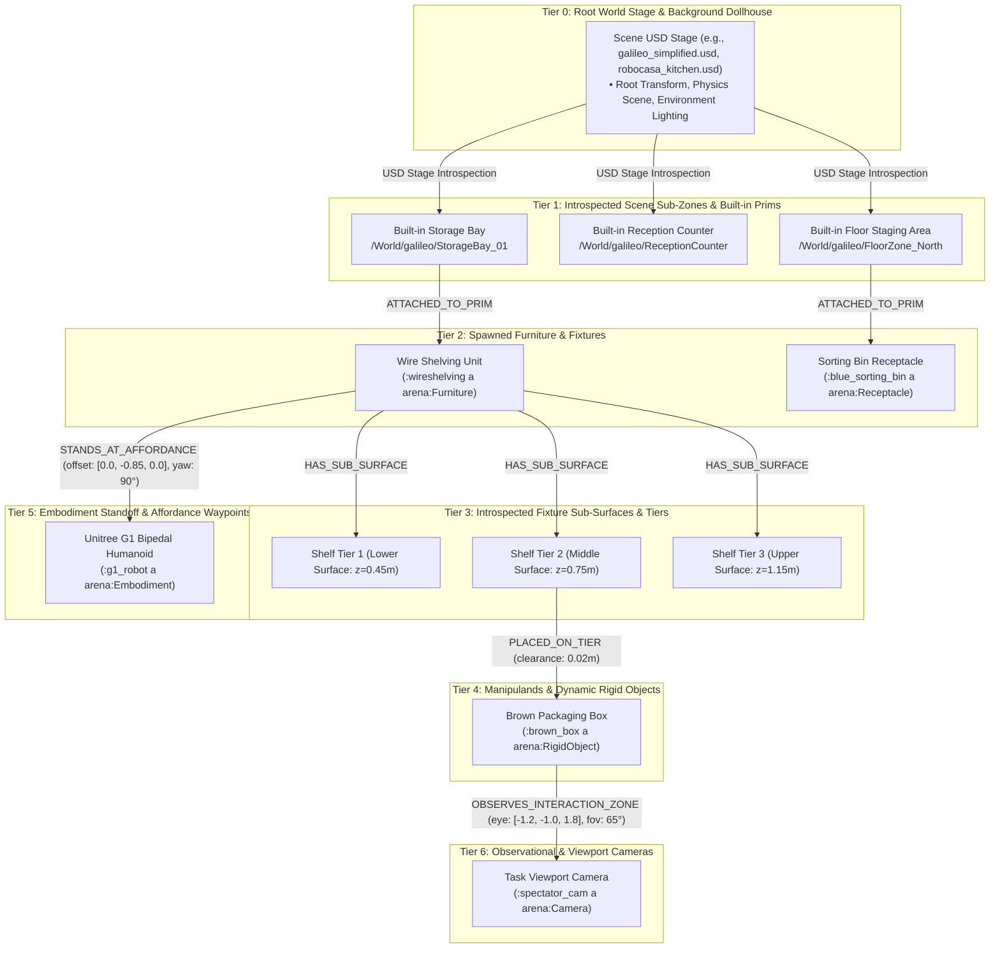

### 13.2 Telescopic RDF-star & LPG Schema Representation

In the Property Graph, this multi-tier containment is encoded directly as attributed edges:

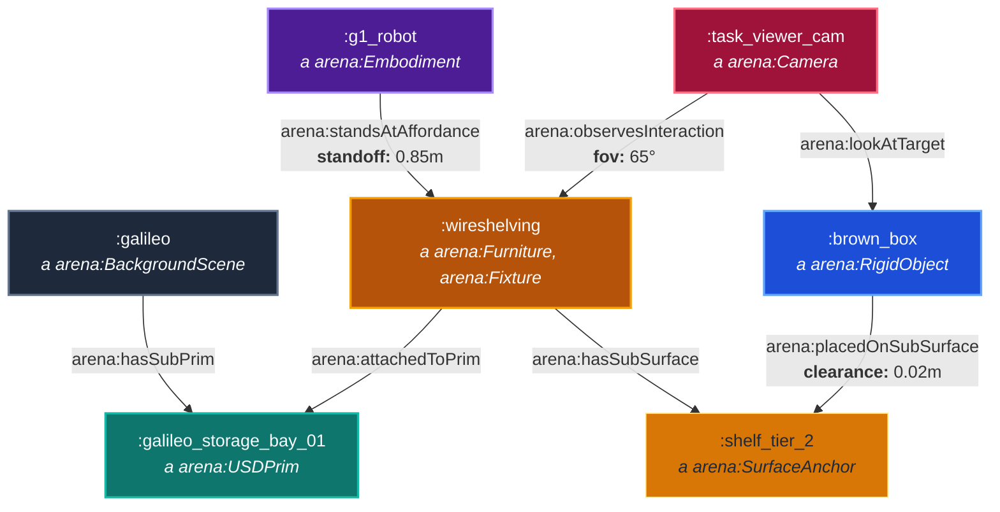

```turtle
# 1. Background Scene Introspection

:galileo a arena:BackgroundScene ;
    arena:usdPath "assets/galileo_simplified.usd" ;
    arena:hasSubPrim :galileo_storage_bay_01, :galileo_floor_zone_north .

:galileo_storage_bay_01 a arena:USDPrim ;
    arena:primPath "/World/galileo/StorageBay_01" ;
    arena:primType "Xform" ;
    arena:worldCenter [ 0.0, 1.1, 0.0 ] ;
    arena:bounds [ -1.0, 1.0, -0.5, 0.5, 0.0, 2.5 ] .

# 2. Spawning Furniture inside the Dollhouse Room
:wireshelving a arena:Furniture, arena:Fixture ;
    arena:registryName "wireshelving_a01_vomp_robolab" ;
    arena:attachedToPrim :galileo_storage_bay_01 ;
    arena:hasSubSurface :shelf_tier_1, :shelf_tier_2, :shelf_tier_3 .

:shelf_tier_2 a arena:SurfaceAnchor ;
    arena:anchorName "shelf_tier_2" ;
    arena:nominalHeight 0.75 ;
    arena:usableArea [ 0.80, 0.40 ] .

# 3. Placing Manipuland on the Shelf Tier
<< :brown_box arena:placedOnSubSurface :shelf_tier_2 >>
    arena:clearance "0.02"^^xsd:float ;
    arena:contactNormal [ 0.0, 0.0, 1.0 ] .

# 4. Robot Affordance Standoff
<< :g1_robot arena:standsAtAffordance :wireshelving >>
    arena:standoffDistance "0.85"^^xsd:float ;
    arena:relativeHeading "front_facing" ;
    arena:kinematicReachability true .

# 5. Semantic Camera Grounding
<< :task_viewer_cam arena:observesInteraction :wireshelving >>
    arena:lookAtTarget :brown_box ;
    arena:eyeOffset [ -1.5, -1.5, 1.5 ] ;
    arena:fov "65.0"^^xsd:float .
```

### 13.3 Cypher Telescopic Query Patterns (Neo4j)

```cypher
// Query: Find the complete telescopic path from building down to manipuland and observing camera
MATCH path = (bg:BackgroundScene)-[:CONTAINS_PRIM]->(zone:USDPrim)
             <-[:ATTACHED_TO_PRIM]-(furn:Furniture)
             -[:HAS_SUB_SURFACE]->(tier:SurfaceAnchor)
             <-[:PLACED_ON_SUB_SURFACE]-(obj:RigidObject)
MATCH (furn)<-[:STANDS_AT_AFFORDANCE]-(bot:Embodiment)
MATCH (obj)<-[:OBSERVES_INTERACTION_ZONE]-(cam:Camera)
RETURN bg.id AS room, zone.prim_path AS room_zone, furn.id AS fixture, 
       tier.anchorName AS shelf_tier, obj.id AS object, 
       bot.id AS robot, cam.id AS camera;
```

### 13.4 Two-Pass Telescopic Resolution Engine

1. **Pass 1 (USD Dollhouse Introspection & Zone Selection)**:
   * The agent queries the Background USD Prim Tree (using `load_usd_prim_tree()`) to inspect available sub-prims (rooms, tables, bays, counters).
   * Generates `ObjectReference`s mapping semantic task zones to USD prim paths.

2. **Pass 2 (Furniture & Manipuland Telescopic Lowering)**:
   * Spawns furniture fixtures anchored to the selected room prims.
   * Places manipulands onto fixture surface tiers rather than floor bounds.
   * Computes robot affordance standoff poses ($\approx 0.85\text{m}$ in front of the fixture).
   * Generates camera eye and lookat targets focused on the interaction envelope.

3. **SHACL Telescopic Invariant Gate**:
   * Rejects any scene where an object is placed in a non-existent prim path or an unanchored building coordinate.
   * Ensures the camera viewing vector intersects the bounding box of the active interaction zone.


