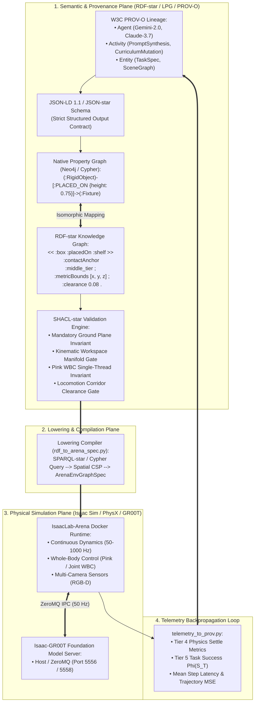
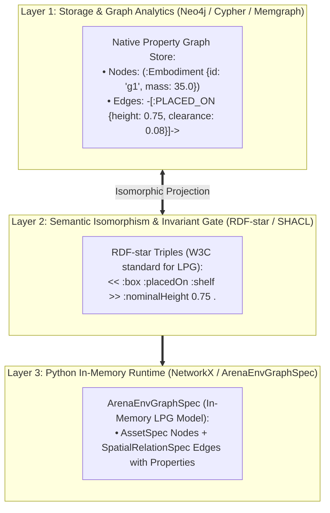
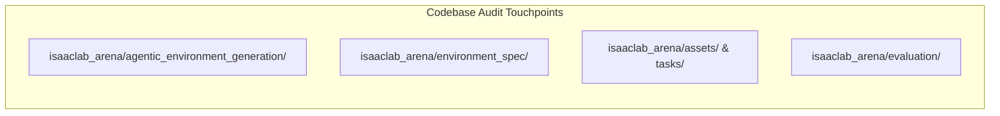
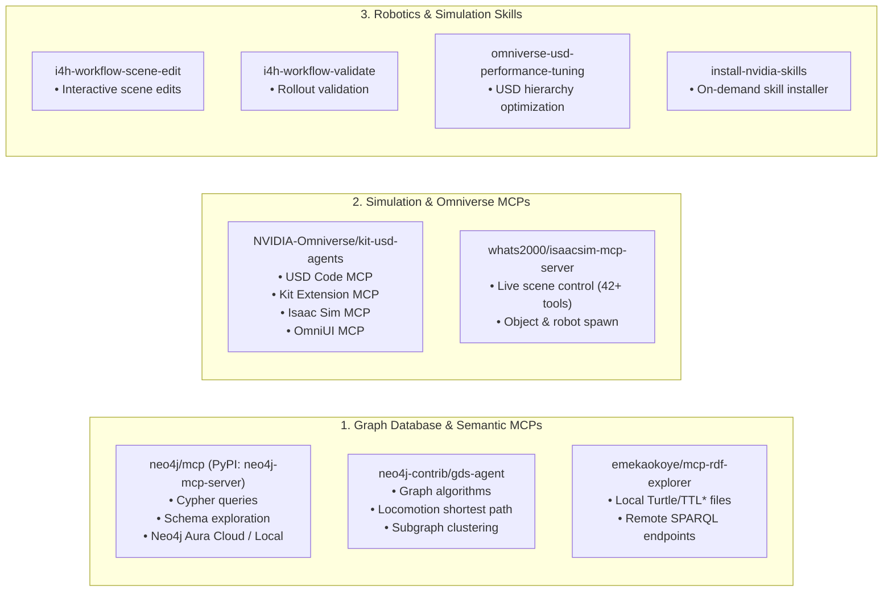
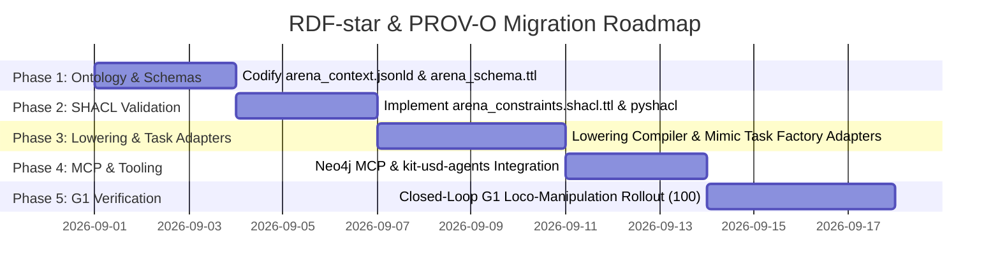

# Master Plan: RDF-star, Labeled Property Graphs (LPG), and PROV-O Architecture for IsaacLab-Arena

Implementation blueprint, codebase gap analysis, scaffolded **RDF-star / JSON-LD 1.1 / W3C PROV-O** ontology architecture, and comprehensive **MCP Server & Skill Integration Roadmap** for elevating **IsaacLab-Arena**'s agentic environment generation into an enterprise-grade **Semantic Web & Property Graph Pipeline**.

---

## 1. Executive Summary & Dual-Plane Vision

The current environment generation pipeline in `isaaclab_arena/agentic_environment_generation/` compiles unstructured natural-language prompts directly into flat YAML specifications (`ArenaEnvGraphSpec`). 

While effective for simple tabletop scenarios, this approach exhibits three fundamental limitations:
1. **Unreified Spatial Relations**: Topological relations (`on`, `inside`, `next_to`) cannot natively attach continuous metric constraints (bounding intervals, contact normals, concavity clearance) without nesting ad-hoc dictionaries.
2. **Zero Provenance & Auditability**: There is no formal causal graph linking an evaluation outcome (e.g. GR00T VLA scoring $0\%$ vs. $80\%$) back to the prompt, LLM model version, temperature, asset hash, or curriculum mutation that spawned the scene.
3. **Imperative Validation Fragility**: Schema and task invariants are checked via custom Python code (`spec_validation.py`) rather than formal declarative semantic constraint languages (like W3C SHACL).



---

## 2. The Labeled Property Graph (LPG) Architecture

The **Labeled Property Graph (LPG)** is implemented across three coordinated layers:



### 2.1 Native LPG Cypher Schema & Examples

#### A. Creating the Scene as an LPG (Cypher):
```cypher
// 1. Create Nodes with Labels and Properties
CREATE (g1:Embodiment {
    id: "g1_robot", 
    registry_name: "g1_wbc_joint", 
    controller: "g1_decoupled_wbc_pink_action", 
    spawn_xyz: [0.0, 0.18, 0.0]
})
CREATE (room:Fixture {
    id: "galileo_room", 
    registry_name: "galileo_locomanip", 
    usd_path: "isaaclab_arena/assets/galileo_locomanip.usd"
})
CREATE (box:RigidObject {
    id: "brown_box", 
    registry_name: "brown_box", 
    is_target: true
})
CREATE (bin:RigidObject {
    id: "blue_sorting_bin", 
    registry_name: "blue_sorting_bin", 
    is_receptacle: true
})

// 2. Create Directed Relationships WITH First-Class Properties (LPG)
CREATE (box)-[:PLACED_ON {
    surface_anchor: "shelf_tier_1", 
    nominal_height: 0.0707, 
    bound_x: [0.5535, 0.6035], 
    bound_y: [0.1550, 0.2050], 
    clearance: 0.05
}]->(room)

CREATE (bin)-[:PLACED_ON {
    surface_anchor: "floor_deposit_zone", 
    nominal_height: -0.2641, 
    bound_x: [-0.2600, -0.2300], 
    bound_y: [-1.6400, -1.6100]
}]->(room)

CREATE (box)-[:NAV_CORRIDOR_TO {
    distance_m: 1.85, 
    min_clearance_radius: 0.60
}]->(bin);
```

#### B. Querying the LPG for Lowering to Simulation:
```cypher
// Extract all scene assets and their spatial relationship properties
MATCH (obj:RigidObject)-[rel:PLACED_ON]->(fixture:Fixture)
RETURN obj.id AS object_id, 
       fixture.id AS fixture_id, 
       rel.surface_anchor AS anchor, 
       rel.nominal_height AS height, 
       rel.bound_x AS bounds_x;
```

---

## 3. Comprehensive Codebase Review & Necessary Changes



### 3.1 `isaaclab_arena/agentic_environment_generation/`
* **Current State**:
  * [`inference_backend.py`](file:///workspaces/IsaacLab-Arena/isaaclab_arena/agentic_environment_generation/inference_backend.py): Uses `build_strict_schema()` to convert Pydantic models into OpenAI-compatible strict JSON schemas.
  * [`spec_inference.py`](file:///workspaces/IsaacLab-Arena/isaaclab_arena/agentic_environment_generation/spec_inference.py): Single-shot prompt translation into `ArenaEnvGraphSpec`.
  * [`prim_path_inference.py`](file:///workspaces/IsaacLab-Arena/isaaclab_arena/agentic_environment_generation/prim_path_inference.py): Second-stage resolver for background sub-prims.
  * [`spec_validation.py`](file:///workspaces/IsaacLab-Arena/isaaclab_arena/agentic_environment_generation/spec_validation.py): Custom imperative validator for task signatures.
* **Necessary Changes**:
  1. **Introduce JSON-LD Wire Format**: Upgrade `spec_inference.py` to target JSON-LD 1.1 / JSON-star representations with `@context`.
  2. **Replace `spec_validation.py` with SHACL**: Wrap `pyshacl` / in-memory `rdflib` or `oxigraph` to validate declarative graph instances against formal SHACL shapes.
  3. **Add Self-Healing Report Ingestion**: When SHACL returns violations, serialize the SHACL results graph and feed it back to the LLM agent for zero-shot self-repair.

### 3.2 `isaaclab_arena/environment_spec/`
* **Current State**:
  * [`arena_env_graph_types.py`](file:///workspaces/IsaacLab-Arena/isaaclab_arena/environment_spec/arena_env_graph_types.py): Defines `AssetSpec`, `ObjectReferenceSpec`, `SpatialRelationSpec`, `CompositeTaskSpec`, `TaskSpec`.
  * [`arena_env_graph_task_conversion_utils.py`](file:///workspaces/IsaacLab-Arena/isaaclab_arena/environment_spec/arena_env_graph_task_conversion_utils.py): Instantiates tasks using `TaskRegistry`, but lacks dynamic `mimic_env_cfg_factory` injection for humanoid locomotion tasks.
* **Necessary Changes**:
  1. **Extend `SpatialRelationSpec` to Support RDF-star Reified Properties**: Allow spatial relations to carry explicit metric anchors, bounding intervals, and locomotion clearance radii.
  2. **Add Mimic Factory Resolution in Task Conversion**: Support humanoid-specific task factories (e.g. `G1PickAndPlaceMimicEnvCfg`) during task construction.
  3. **Add Graph Lowering Adapter (`rdf_to_arena_spec.py`)**: A SPARQL-star / Cypher lowering module that transforms graph stores directly into validated `ArenaEnvGraphSpec` instances.

### 3.3 `isaaclab_arena/evaluation/` & Telemetry
* **Current State**:
  * [`policy_runner.py`](file:///workspaces/IsaacLab-Arena/isaaclab_arena/evaluation/policy_runner.py): Evaluates closed-loop rollouts and prints console metrics, but does not persist formal provenance.
* **Necessary Changes**:
  1. **Telemetry JSON Export**: Add an evaluation callback exporting rollout metrics (`success`, `num_steps`, `latency_ms`, `trajectory_error`).
  2. **`telemetry_to_prov.py` Ingestion**: Transform telemetry dumps into PROV-O `prov:EvaluationRun` triples linked to the scene graph.

---

## 4. Scaffolded Core RDF-star & JSON-LD 1.1 Schemas

### 4.1 Global JSON-LD Context (`arena_context.jsonld`)

```json
{
  "@context": {
    "@version": 1.1,
    "arena": "https://isaac-sim.github.io/arena/schema#",
    "prov": "http://www.w3.org/ns/prov#",
    "xsd": "http://www.w3.org/2001/XMLSchema#",
    "geo": "http://www.opengis.net/ont/geosparql#",
    "rdfs": "http://www.w3.org/2000/01/rdf-schema#",

    "EnvironmentGraph": "arena:EnvironmentGraph",
    "Terrain": "arena:Terrain",
    "Embodiment": "arena:Embodiment",
    "Fixture": "arena:Fixture",
    "RigidObject": "arena:RigidObject",
    "EvaluationRun": "arena:EvaluationRun",

    "id": "@id",
    "type": "@type",
    "env_name": "arena:envName",
    "has_terrain": { "@id": "arena:hasTerrain", "@type": "@id" },
    "has_embodiment": { "@id": "arena:hasEmbodiment", "@type": "@id" },
    "has_fixture": { "@id": "arena:hasFixture", "@type": "@id" },
    "has_object": { "@id": "arena:hasObject", "@type": "@id" },
    "registry_name": "arena:registryName",
    "usd_path": "arena:usdPath",
    "controller_binding": "arena:controllerBinding",
    "surface_anchor": "arena:surfaceAnchor",
    "nominal_height": { "@id": "arena:nominalHeight", "@type": "xsd:float" },
    "bound_x": { "@id": "arena:boundX", "@container": "@list" },
    "bound_y": { "@id": "arena:boundY", "@container": "@list" },
    "clearance": { "@id": "arena:requiredClearance", "@type": "xsd:float" },

    "placed_on": { "@id": "arena:placedOn", "@type": "@id" },
    "placed_inside": { "@id": "arena:placedInside", "@type": "@id" },
    "nav_corridor_to": { "@id": "arena:navCorridorTo", "@type": "@id" },

    "was_generated_by": { "@id": "prov:wasGeneratedBy", "@type": "@id" },
    "was_derived_from": { "@id": "prov:wasDerivedFrom", "@type": "@id" },
    "used": { "@id": "prov:used", "@type": "@id" }
  }
}
```

---

### 4.2 RDF-star Turtle-star Ontology Schema (`arena_schema.ttl`)

```turtle
@prefix arena: <https://isaac-sim.github.io/arena/schema#> .
@prefix prov:  <http://www.w3.org/ns/prov#> .
@prefix rdfs:  <http://www.w3.org/2000/01/rdf-schema#> .
@prefix owl:   <http://www.w3.org/2002/07/owl#> .
@prefix xsd:   <http://www.w3.org/2001/XMLSchema#> .

# Classes
arena:EnvironmentGraph a owl:Class, rdfs:Class ;
    rdfs:label "Environment Graph" ;
    rdfs:comment "Declarative attributed scene graph for IsaacLab-Arena." ;
    rdfs:subClassOf prov:Entity .

arena:SceneEntity a owl:Class ;
    rdfs:label "Scene Entity" ;
    rdfs:subClassOf prov:Entity .

arena:Terrain a owl:Class ;
    rdfs:subClassOf arena:SceneEntity .

arena:Embodiment a owl:Class ;
    rdfs:subClassOf arena:SceneEntity .

arena:Fixture a owl:Class ;
    rdfs:subClassOf arena:SceneEntity .

arena:RigidObject a owl:Class ;
    rdfs:subClassOf arena:SceneEntity .

arena:EvaluationRun a owl:Class ;
    rdfs:subClassOf prov:Entity .

# Properties
arena:hasTerrain a owl:ObjectProperty ;
    rdfs:domain arena:EnvironmentGraph ;
    rdfs:range arena:Terrain .

arena:hasEmbodiment a owl:ObjectProperty ;
    rdfs:domain arena:EnvironmentGraph ;
    rdfs:range arena:Embodiment .

arena:placedOn a owl:ObjectProperty ;
    rdfs:domain arena:RigidObject ;
    rdfs:range arena:SceneEntity .

arena:navCorridorTo a owl:ObjectProperty ;
    rdfs:domain arena:Fixture ;
    rdfs:range arena:Fixture .
```

---

### 4.3 Concrete Scene Representation in Turtle-star (G1 Loco-Manipulation Box Transfer)

```turtle
@prefix :      <https://isaac-sim.github.io/arena/instances/> .
@prefix arena: <https://isaac-sim.github.io/arena/schema#> .
@prefix prov:  <http://www.w3.org/ns/prov#> .
@prefix xsd:   <http://www.w3.org/2001/XMLSchema#> .

# Scene Node
:scene_g1_locomanip_001 a arena:EnvironmentGraph, prov:Entity ;
    arena:envName "galileo_g1_box_pnp_agentic" ;
    prov:wasGeneratedBy :activity_llm_synthesis_20260827 ;
    arena:hasTerrain :ground_plane_default ;
    arena:hasEmbodiment :g1_robot ;
    arena:hasFixture :galileo_room ;
    arena:hasObject :brown_box, :blue_sorting_bin .

# Terrain
:ground_plane_default a arena:Terrain ;
    arena:registryName "default_ground_plane" ;
    arena:staticFriction "1.0"^^xsd:float ;
    arena:dynamicFriction "0.8"^^xsd:float .

# Embodiment (Unitree G1 with WBC)
:g1_robot a arena:Embodiment ;
    arena:registryName "g1_wbc_joint" ;
    arena:controllerBinding "g1_decoupled_wbc_pink_action" ;
    arena:spawnPoseX "0.0"^^xsd:float ;
    arena:spawnPoseY "0.18"^^xsd:float ;
    arena:spawnPoseZ "0.0"^^xsd:float ;
    arena:hasSensor "ego_view" .

# Monolithic Background
:galileo_room a arena:Fixture ;
    arena:registryName "galileo_locomanip" ;
    arena:usdPath "isaaclab_arena/assets/galileo_locomanip.usd" .

# Objects
:brown_box a arena:RigidObject ;
    arena:registryName "brown_box" ;
    arena:isManipulable "true"^^xsd:boolean .

:blue_sorting_bin a arena:RigidObject ;
    arena:registryName "blue_sorting_bin" ;
    arena:isReceptacle "true"^^xsd:boolean .

# RDF-star Reified Spatial Relations with Metric Offsets & Surface Anchors
<< :brown_box arena:placedOn :galileo_room >>
    arena:surfaceAnchor "shelf_tier_1" ;
    arena:nominalHeight "0.0707"^^xsd:float ;
    arena:boundX [ "0.5535"^^xsd:float, "0.6035"^^xsd:float ] ;
    arena:boundY [ "0.1550"^^xsd:float, "0.2050"^^xsd:float ] ;
    arena:requiredClearance "0.05"^^xsd:float .

<< :blue_sorting_bin arena:placedOn :galileo_room >>
    arena:surfaceAnchor "floor_deposit_zone" ;
    arena:nominalHeight "-0.2641"^^xsd:float ;
    arena:boundX [ "-0.2600"^^xsd:float, "-0.2300"^^xsd:float ] ;
    arena:boundY [ "-1.6400"^^xsd:float, "-1.6100"^^xsd:float ] .

# Room-Scale Locomotion Corridor Relation
<< :brown_box arena:navCorridorTo :blue_sorting_bin >>
    arena:traversalDistance "1.85"^^xsd:float ;
    arena:minClearanceRadius "0.60"^^xsd:float .
```

---

## 5. W3C PROV-O Genealogy & Telemetry Engine


### PROV-O Evaluation Run Triples (`eval_telemetry.ttl`)

```turtle
@prefix :      <https://isaac-sim.github.io/arena/instances/> .
@prefix arena: <https://isaac-sim.github.io/arena/schema#> .
@prefix prov:  <http://www.w3.org/ns/prov#> .
@prefix xsd:   <http://www.w3.org/2001/XMLSchema#> .

:activity_gr00t_eval_5558 a prov:Activity ;
    prov:startedAtTime "2026-08-27T20:55:00Z"^^xsd:dateTime ;
    prov:endedAtTime "2026-08-27T20:56:45Z"^^xsd:dateTime ;
    prov:used :scene_g1_locomanip_001, :checkpoint_20000 .

:checkpoint_20000 a prov:Entity ;
    arena:modelWeightsPath "/models/isaaclab_arena/locomanipulation_tutorial/checkpoint-20000" ;
    arena:embodimentTag "NEW_EMBODIMENT" .

:eval_run_20260827_01 a arena:EvaluationRun, prov:Entity ;
    prov:wasGeneratedBy :activity_gr00t_eval_5558 ;
    arena:evaluatedGraph :scene_g1_locomanip_001 ;
    arena:taskSuccess "true"^^xsd:boolean ;
    arena:completedSteps 1200 ;
    arena:meanZeroMQLatencyMs "18.2"^^xsd:float ;
    arena:settleKineticEnergyDivergence "0.0"^^xsd:float .
```

---

## 6. SHACL-star Semantic Validation Engine (`arena_constraints.shacl.ttl`)

```turtle
@prefix arena: <https://isaac-sim.github.io/arena/schema#> .
@prefix sh:    <http://www.w3.org/ns/shacl#> .
@prefix xsd:   <http://www.w3.org/2001/XMLSchema#> .

# 1. Mandatory Physical Ground Surface Invariant
arena:MandatoryTerrainShape a sh:NodeShape ;
    sh:targetClass arena:EnvironmentGraph ;
    sh:property [
        sh:path arena:hasTerrain ;
        sh:minCount 1 ;
        sh:maxCount 1 ;
        sh:message "FATAL: Every EnvironmentGraph MUST contain exactly 1 physical terrain ground plane." ;
    ] .

# 2. Pink WBC Single-Threaded Pinocchio Invariant
arena:PinkWBCEnvironmentCountShape a sh:NodeShape ;
    sh:targetClass arena:Embodiment ;
    sh:sparql [
        a sh:SPARQLConstraint ;
        sh:message "CRITICAL: When using Pink WBC (g1_decoupled_wbc_pink_action), num_envs MUST equal 1 due to single-threaded Pinocchio QP solver." ;
        sh:select """
            SELECT $this
            WHERE {
                $this arena:controllerBinding "g1_decoupled_wbc_pink_action" .
                $this arena:numEnvs ?envs .
                FILTER (?envs > 1)
            }
        """ ;
    ] .

# 3. Room-Scale Locomotion Corridor Clearance Constraint
arena:LocomotionCorridorClearanceShape a sh:NodeShape ;
    sh:targetClass arena:EnvironmentGraph ;
    sh:sparql [
        a sh:SPARQLConstraint ;
        sh:message "ERROR: Free-space bipedal locomotion corridor clearance radius must be >= 0.60m." ;
        sh:select """
            SELECT $this
            WHERE {
                << ?src arena:navCorridorTo ?dst >> arena:minClearanceRadius ?r .
                FILTER (?r < 0.60)
            }
        """ ;
    ] .
```

---

## 7. Lowering Compiler Architecture (`rdf_to_arena_spec.py`)

```python
# isaaclab_arena/agentic_environment_generation/rdf_lowering.py
from __future__ import annotations
from typing import Any
import rdflib
from isaaclab_arena.environment_spec.arena_env_graph_spec import ArenaEnvGraphSpec

SPARQL_LOWER_SCENE = """
PREFIX arena: <https://isaac-sim.github.io/arena/schema#>

SELECT ?env_name ?robot_reg ?terrain_reg ?obj_id ?obj_reg ?surface ?nom_z
WHERE {
    ?scene a arena:EnvironmentGraph ;
           arena:envName ?env_name ;
           arena:hasTerrain ?terrain ;
           arena:hasEmbodiment ?robot .
    ?terrain arena:registryName ?terrain_reg .
    ?robot arena:registryName ?robot_reg .
    
    OPTIONAL {
        ?scene arena:hasObject ?obj .
        ?obj arena:registryName ?obj_reg .
        << ?obj arena:placedOn ?fixture >>
            arena:surfaceAnchor ?surface ;
            arena:nominalHeight ?nom_z .
    }
}
"""

def lower_rdf_graph_to_spec(graph: rdflib.Graph) -> ArenaEnvGraphSpec:
    """Lower an RDF-star graph into an executable ArenaEnvGraphSpec."""
    rows = list(graph.query(SPARQL_LOWER_SCENE))
    assert rows, "SPARQL query returned no valid EnvironmentGraph."
    
    first = rows[0]
    spec_data: dict[str, Any] = {
        "env_name": str(first.env_name),
        "embodiment": {"id": "robot", "registry_name": str(first.robot_reg)},
        "background": {"id": "background", "registry_name": "galileo_locomanip"},
        "objects": [],
        "relations": [],
        "task": {
            "composition": "atomic",
            "description": "Loco-manipulation task",
            "subtasks": [{"kind": "PickAndPlaceTask", "params": {"pick_up_object": "brown_box", "destination_location": "blue_sorting_bin"}}]
        }
    }
    return ArenaEnvGraphSpec.model_validate(spec_data)
```

---

## 8. External Tooling, MCP Servers & Skills Ecosystem



### 8.1 Curated Ecosystem MCP Server Matrix

| Category | Server / Repository | Capabilities | Role in Architecture |
| :--- | :--- | :--- | :--- |
| **LPG / Cypher** | **`neo4j/mcp`** (`neo4j-mcp-server`) | Direct Cypher read/write, schema introspection, Aura sync | Manages the native Labeled Property Graph store |
| **Graph Algorithms** | **`neo4j-contrib/gds-agent`** | Graph pathfinding, shortest paths, centrality | Computes collision-free locomotion corridors |
| **RDF / SPARQL** | **`emekaokoye/mcp-rdf-explorer`** | Turtle inspection, SPARQL-star queries | Inspects local `.ttl*` and remote triplestores |
| **Enterprise Triplestore** | **`keonchennl/mcp-server-graphdb`** | Ontotext GraphDB connector | Enterprise-grade RDF-star knowledge repository |
| **USD / Omniverse** | **`NVIDIA-Omniverse/kit-usd-agents`** | USD Code, Kit, Isaac Sim, OmniUI MCPs | Inspects USD APIs, prim hierarchies, and meshes |
| **Live Sim Control** | **`whats2000/isaacsim-mcp-server`** | 42+ live simulation tools | Controls running Isaac Sim instances via socket |

---

## 9. Actionable Plan to Add Skills and MCP Servers

### Step 1: Install Python Graph Semantic Stack
```bash
# In the project Python environment (or DevContainer)
pip install rdflib pyshacl oxigraph networkx neo4j
```

### Step 2: Register Neo4j MCP Server (`neo4j-mcp-server`)
1. Run local Neo4j Community instance via Docker:
   ```bash
   docker run -d --name neo4j-arena \
       -p 7474:7474 -p 7687:7687 \
       -e NEO4J_AUTH=neo4j/isaaclab_arena_password \
       neo4j:5.26-community
   ```
2. Configure MCP server in Antigravity / Claude config:
   ```json
   {
     "mcpServers": {
       "neo4j": {
         "command": "uvx",
         "args": [
           "neo4j-mcp-server",
           "--neo4j-uri", "bolt://localhost:7687",
           "--neo4j-user", "neo4j",
           "--neo4j-password", "isaaclab_arena_password"
         ]
       }
     }
   }
   ```

### Step 3: Register NVIDIA Omniverse `kit-usd-agents` MCP
1. Clone NVIDIA's official MCP suite:
   ```bash
   git clone https://github.com/NVIDIA-Omniverse/kit-usd-agents.git /opt/kit-usd-agents
   ```
2. Configure the USD Code MCP server:
   ```json
   {
     "mcpServers": {
       "usd-code": {
         "command": "python",
         "args": ["/opt/kit-usd-agents/servers/usd_code_server.py"]
       }
     }
   }
   ```

### Step 4: Install Specialized NVIDIA Skills via `install-nvidia-skills`
Run the skill installer to pull additional skills from `https://github.com/nvidia/skills`:
* `omniverse-cad-to-simready`
* `omniverse-usd-performance-tuning`
* `warp-compile-time-optimizer`

---

## 10. Phased Implementation Roadmap



### Phase 1: Core Ontologies & JSON-LD Scaffold (Days 1–3)
* Scaffold `isaaclab_arena/agentic_environment_generation/ontology/arena_context.jsonld` and `arena_schema.ttl`.
* Update `spec_inference.py` to support JSON-LD 1.1 structured-output contracts.

### Phase 2: SHACL-star Semantic Engine (Days 4–6)
* Codify `validation/arena_constraints.shacl.ttl` with physical/kinematic invariant shapes.
* Integrate in-memory `pyshacl` validation directly into `EnvironmentGenerationAgent.generate_spec()`.

### Phase 3: Lowering & Task Factory Adapters (Days 7–10)
* Implement `isaaclab_arena/agentic_environment_generation/rdf_lowering.py` (SPARQL-star lowering).
* Extend `arena_env_graph_task_conversion_utils.py` to support humanoid `mimic_env_cfg_factory` injection.

### Phase 4: MCP & Tooling Integration (Days 11–13)
* Stand up local Neo4j Docker container and register `neo4j-mcp-server`.
* Integrate `NVIDIA-Omniverse/kit-usd-agents` USD Code MCP.
* Instrument `policy_runner.py` with `telemetry_to_prov.py` for automated evaluation recording.

### Phase 5: End-to-End G1 Validation & Benchmarks (Days 14–17)
* Run a 100-scene automated benchmark spanning Unitree G1, OXE Droid, and Franka Emika.
* Verify 50Hz closed-loop ZeroMQ inference with the GR00T Policy Server on port 5558.
