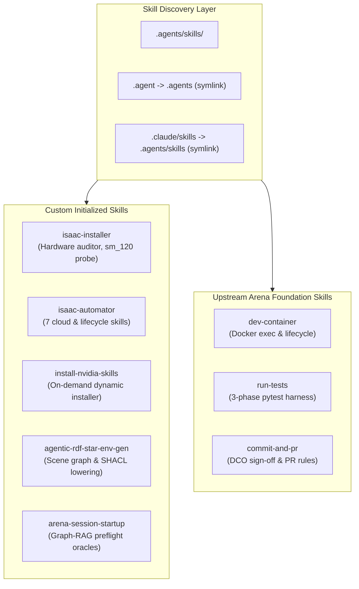

# Getting Started with Agent Skills in IsaacLab-Arena

This document provides a guide to the **Agent Skills library** in IsaacLab-Arena, detailing how skills are structured, how the custom skills were initialized when starting the `.agents` ecosystem, and how to use them to get started with the repository.

---

## 1. Architectural Overview & Skill Discovery

The repository organizes autonomous agent capabilities under [`.agents/skills/`](../../skills):



### Agent Integration Contracts
* **Direct Scanner**: Codex, Antigravity, and other agents scan [`.agents/skills/`](../../skills) directly.
* **Compatibility Symlinks**:
  * `.claude/skills` points to `.agents/skills` for Claude Code compatibility.
  * `.agent` symlinks to `.agents` for cross-tool resolution.
* **Gitignore Whitelist**: External skills fetched dynamically from NVIDIA (340+ skills) are automatically git-ignored by `.gitignore`, while in-tree custom Arena skills are tracked in source control.

---

## 2. Workspace Initialization Script

When setting up a new devcontainer or host clone, the workspace topology is bootstrapped via [`.devcontainer/init_agent_workspace.sh`](../../../.devcontainer/init_agent_workspace.sh):

```bash
# Initialize or verify the .agents directory structure and custom skills
bash .devcontainer/init_agent_workspace.sh
```

This script guarantees:
1. Creation of `.agents/skills/`, `.agents/memory/sessions/`, `.agents/references/docs/`, and `.agents/references/templates/`.
2. Provisioning of custom skill manifests (`SKILL.md`) for `isaac-installer` and the `isaac-automator` suite.
3. Creation of the session tracking master index at [`.agents/memory/INDEX.md`](../../memory/INDEX.md).
4. Installation of specification templates ([`task_spec.md`](../templates/task_spec.md) and [`env_graph_spec.yaml`](../templates/env_graph_spec.yaml)).

---

## 3. Custom Skills Reference

### 3.1. `isaac-installer`
* **Skill Manifest**: [`.agents/skills/isaac-installer/SKILL.md`](../../skills/isaac-installer/SKILL.md)
* **Auditor Script**: [`.agents/skills/isaac-installer/scripts/check_hardware.py`](../../skills/isaac-installer/scripts/check_hardware.py)
* **Purpose**: Bare-metal workstation provisioner and GPU microarchitecture auditor.
* **Usage**:
  ```bash
  python3 .agents/skills/isaac-installer/scripts/check_hardware.py
  ```
  Validates CUDA 12.8 / Driver $\ge$ 570.xx readiness, Vulkan ICD configuration, and detects Blackwell `sm_120` architectures (RTX 50-series, RTX PRO 6000, B100/B200).

---

### 3.2. `isaac-automator` Suite
Located in [`.agents/skills/isaac-automator/`](../../skills/isaac-automator), this suite provides 7 specialized sub-skills for multi-cloud workstation management and session logging:

| Skill | Manifest | Primary Function |
| :--- | :--- | :--- |
| **`deploy-workstation`** | [`deploy-workstation/SKILL.md`](../../skills/isaac-automator/deploy-workstation/SKILL.md) | Non-interactive GPU instance provisioning on AWS, GCP, Azure, or Alibaba with IP security-group locks (`--ingress-cidrs myip`). |
| **`connect-workstation`** | [`connect-workstation/SKILL.md`](../../skills/isaac-automator/connect-workstation/SKILL.md) | Zero-configuration SSH tunneling and remote development attachment. |
| **`manage-lifecycle`** | [`manage-lifecycle/SKILL.md`](../../skills/isaac-automator/manage-lifecycle/SKILL.md) | Multi-cloud instance power management (`status`, `stop`, `start`, `terminate`). |
| **`run-demos`** | [`run-demos/SKILL.md`](../../skills/isaac-automator/run-demos/SKILL.md) | Automated headless and GUI verification runs for Isaac Sim demonstration pipelines. |
| **`transfer-data`** | [`transfer-data/SKILL.md`](../../skills/isaac-automator/transfer-data/SKILL.md) | Bidirectional synchronization for datasets/models (`./upload`, `./download`) and boot autoruns. |
| **`troubleshoot`** | [`troubleshoot/SKILL.md`](../../skills/isaac-automator/troubleshoot/SKILL.md) | Diagnostic engine for Vulkan display issues, driver mismatches, and IP drift. |
| **`session-memory`** | [`session-memory/SKILL.md`](../../skills/isaac-automator/session-memory/SKILL.md) | Checkpointing session milestones with timestamped UUIDs in `.agents/memory/sessions/` and syncing `INDEX.md`. |

---

### 3.3. `install-nvidia-skills`
* **Skill Manifest**: [`.agents/skills/install-nvidia-skills/SKILL.md`](../../skills/install-nvidia-skills/SKILL.md)
* **Installer Script**: [`.agents/skills/install-nvidia-skills/scripts/install_nvidia_skills.sh`](../../skills/install-nvidia-skills/scripts/install_nvidia_skills.sh)
* **Purpose**: Fetches official agent skills on-demand from the NVIDIA skills repository without cluttering Git history.
* **Usage**:
  ```bash
  # Query available NVIDIA skills
  bash .agents/skills/install-nvidia-skills/scripts/install_nvidia_skills.sh --list

  # Install a specific skill (e.g. cuDF or Warp)
  bash .agents/skills/install-nvidia-skills/scripts/install_nvidia_skills.sh --skill accelerated-computing-cudf
  ```

---

### 3.4. Pipeline & Scene Generation Skills
* **`agentic-rdf-star-env-gen`** ([`SKILL.md`](../../skills/agentic-rdf-star-env-gen/SKILL.md)):
  Synthesizes, validates, and lowers environment scene graphs using RDF-star ontology, SHACL shape constraints, Cypher queries, and PROV-O audit trails.
* **`arena-session-startup`** ([`SKILL.md`](../../skills/arena-session-startup/SKILL.md)):
  Queries Arena's policy capability graph, Neo4j Graph-RAG experience memory, and zero-cost preflight reachability oracles prior to executing simulation trials.

---

## 4. Upstream Arena Foundation Skills

These foundational skills were established in PR #691 and handle core developer workflows:

1. **`dev-container`** ([`SKILL.md`](../../skills/dev-container/SKILL.md)):
   Governs container lifecycle management. Inspects running containers (`docker ps --filter "name=isaaclab_arena"`), manages host-user execution (`su $(id -un)`), and wraps `/isaac-sim/python.sh`.
2. **`run-tests`** ([`SKILL.md`](../../skills/run-tests/SKILL.md)):
   Executes the three-phase test suite (`smoke`, `unit`, and `simulation`).
3. **`commit-and-pr`** ([`SKILL.md`](../../skills/commit-and-pr/SKILL.md)):
   Enforces repository commit invariants: DCO sign-off (`git commit -s`), non-AI attribution trailers, topic branch naming (`<username>/<type>/<description>`), and PR template compliance.

---

## 5. End-to-End Getting Started Walkthrough

Follow this operational sequence when starting a new session in this repository:

### Step 1: Probe Host Hardware & Compute Capability
From the host or DevContainer terminal:
```bash
python3 .agents/skills/isaac-installer/scripts/check_hardware.py
```
Confirm GPU detection, driver compatibility ($\ge 570$), and Vulkan readiness.

### Step 2: Ensure Host Mount Directories Exist
```bash
bash .devcontainer/ensure_host_directories.sh
```
Guarantees persistent directories for `~/datasets`, `~/models`, `~/eval`, and Hugging Face caches.

### Step 3: Launch Simulation & Policy Infrastructure
On the host terminal:
```bash
# 1. Start IsaacLab-Arena simulation container
./docker/run_docker.sh

# 2. Launch the Isaac-GR00T policy daemon (ZeroMQ port 5556)
./docker/run_gr00t_server.sh -m nvidia/GR00T-N1.6-DROID -e OXE_DROID -d
```

### Step 4: Execute Containerized Simulation Workloads
From inside the DevContainer (leveraging `/var/run/docker.sock` pass-through):
```bash
ARENA_CONTAINER=$(docker ps --filter "name=isaaclab_arena" --format '{{.Names}}' | head -1)

docker exec -it "$ARENA_CONTAINER" su $(id -un) -c \
  "cd /workspaces/isaaclab_arena && /isaac-sim/python.sh isaaclab_arena/tests/test_object_on_microwave_tray.py"
```

### Step 5: Checkpoint Architectural Decisions in Session Memory
After completing experiments or introducing code changes, log the session milestone using the `session-memory` convention:
1. Create a checkpoint file: `.agents/memory/sessions/YYYYMMDD_HHMMSS_<uuid>.md`
2. Update the master index table in [`.agents/memory/INDEX.md`](../../memory/INDEX.md).

---

## 6. Related References & Runbooks

* [Setup & Dual-Container Workflow Guide](setup_workflow.md)
* [End-to-End Environment Generation & Closed-Loop Policy Evaluation](end_to_end_gr00t_policy_evaluation.md)
* [Mathematical Scene Graphs & Grounded Markdown Generation](env_generation_notes.md)
* [Blackwell SM120 & ZeroMQ Troubleshooting Runbook](debugging_arena_gr00t.md)
* [Active Inference Testing & Repair](active_inference_test.md)
