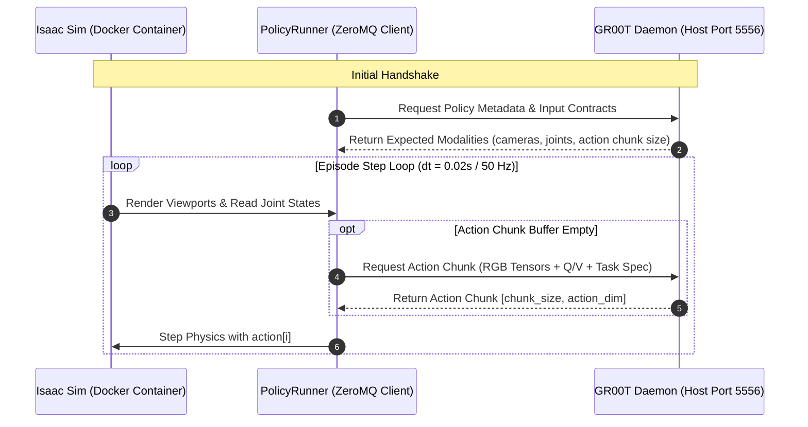

# Blackwell sm_120, PyTorch cu128, and ZeroMQ Contracts Runbook

This runbook documents operational procedures, hardware-level compatibility constraints, and troubleshooting steps for serving and evaluating **NVIDIA Isaac-GR00T** with **IsaacLab-Arena** on modern NVIDIA Blackwell architectures.

---

## 1. Hardware & Platform Baseline

| Component | Target Version / Spec | Notes |
| :--- | :--- | :--- |
| **GPU Architecture** | Blackwell (`sm_120`, compute capability 12.0) | Spark is `sm_121` (compute capability 12.1). |
| **CUDA Toolchain** | CUDA 12.8 (`cu128`) | Standard for IsaacLab-Arena Docker containers. |
| **Host Runtime** | Python 3.10 via `uv` | Hosts the GR00T foundation model server. |
| **Container Runtime** | Python 3.12 (`/isaac-sim/python.sh`) | Runs Isaac Sim 6.0 + Isaac Lab 3.0 Beta + Arena. |
| **Inter-Process Comm** | ZeroMQ RPC (Default port: `5556`) | High-speed request-reply bridge between Sim and VLA. |

---

## 2. Blackwell sm_120 & FlashAttention Incompatibilities

### Symptom & Root Cause
When launching the GR00T policy server or running DiT (Diffusion Transformer) inference on Blackwell hardware, the execution may crash with:
```
RuntimeError: CUDA error: no kernel image is available for execution on the device
CUDA kernel errors might be asynchronously reported at some other API call...
```
Or:
```
cublas/cutlass internal error: architecture mismatch sm_120
```

**Root Cause**:
Many prebuilt wheels for `flash-attn` and certain CUTLASS CuTe DSL kernels are compiled targeting `sm_89` (Ada Lovelace) or `sm_90` (Hopper). On `sm_120` GPUs, the driver cannot locate binary cubins and JIT compilation may fail or be unsupported for those specialized kernels. Furthermore, upstream `dit.py` in some GR00T builds guards only `(12, 1)` (Spark), leaving `(12, 0)` unguarded against standard FlashAttention dispatch.

### Remediation & Environment Flags
Force the execution engine to fall back to PyTorch's native math-mode Scaled Dot-Product Attention (SDPA):

```bash
# Set before starting the GR00T Policy Inference Server:
export GR00T_DIT_SDPA_MODE=math
export TORCH_SDPA_USE_FLASH=0
export USE_FLASH_ATTENTION=0
```

When launching the server via `uv` on the host:
```bash
GR00T_DIT_SDPA_MODE=math TORCH_SDPA_USE_FLASH=0 USE_FLASH_ATTENTION=0 \
  uv run python -m gr00t.eval.server \
  --model-path nvidia/GR00T-N1.6-DROID \
  --port 5556
```

---

## 3. ZeroMQ Architecture & IPC Contract

The IsaacLab-Arena policy evaluation pipeline decouples simulation physics from policy inference over a ZeroMQ socket:



### Action Chunking Contracts
- **Chunk Size ($H$)**: Standard horizons are 16, 32, or 50 steps.
- **Latency Amortization**: The VLA inference takes 80–150 ms; by returning chunks of 32 steps (at 50 Hz = 640 ms), the simulator achieves real-time execution without waiting for single-step inferences.
- **Temporal Parallax & Delays**: If finger curl or compliant mechanics take 20+ steps, ensure the chunk horizon is sufficiently large (e.g. 32 steps) to allow continuous physical interaction without jerky pauses between RPC calls.

---

## 4. Diagnostics & Troubleshooting Checklist

### A. Testing Port 5556 Connectivity
To test whether the server is up and reachable from within the container:
```bash
docker exec -it isaaclab_arena-latest python3 -c '
import socket
s = socket.socket(socket.AF_INET, socket.SOCK_STREAM)
s.settimeout(2.0)
res = s.connect_ex(("127.0.0.1", 5556))
print("Port 5556 open:", res == 0)
s.close()
'
```

### B. Common Error Codes

| Error Pattern | Cause | Fix |
| :--- | :--- | :--- |
| `zmq.error.ZMQError: Connection refused` | Server is not running or bound to `127.0.0.1` inside a separate network namespace. | Ensure host server binds to `0.0.0.0` or container uses `--net=host`. |
| `KeyError: 'camera_head'` | Policy expects different observation keys than emitted by `ArenaEnvBuilder`. | Align camera name in task YAML (`front_camera` vs `camera_head`). |
| `AssertionError: --policy_type is required` | CLI invocation missed `--policy_type gr00t`. | Specify `--policy_type gr00t` before environment ID. |
| `CUDA OOM on Host during Load` | High memory pressure with large VLA weights. | Enable FP16/BF16 precision: `--dtype bfloat16`. |
