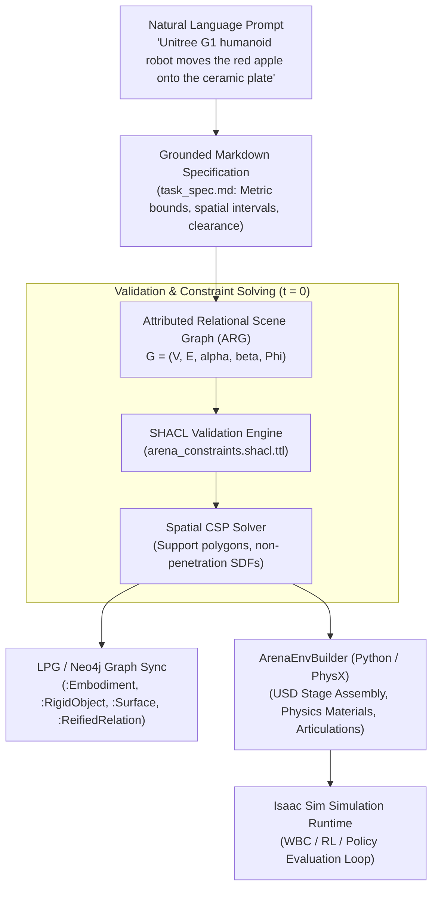

# Mathematical Scene Graphs & Grounded Markdown Generation

This reference outlines the end-to-end mathematical translation pipeline:
$$\text{Natural Language} \longrightarrow \text{Grounded Markdown} \longrightarrow \text{Attributed Relational Graph } \mathcal{G} \longrightarrow \text{PhysX Simulation Scene}$$

---

## 1. Architectural Pipeline Overview



---

## 2. Mathematical Formalism: Attributed Relational Graph (ARG)

A simulation scene specification is formalized as an Attributed Relational Graph:
$$\mathcal{G} = (\mathcal{V}, \mathcal{E}, \alpha, \beta, \Phi)$$

### A. Vertices $\mathcal{V}$
The entity set is partitioned into four disjoint semantic categories:
$$\mathcal{V} = \mathcal{V}_{\text{terrain}} \cup \mathcal{V}_{\text{embodiment}} \cup \mathcal{V}_{\text{fixture}} \cup \mathcal{V}_{\text{object}}$$
- $\mathcal{V}_{\text{terrain}}$: Ground contact surface ($Z=0$, friction coefficients $\mu_s, \mu_d$).
- $\mathcal{V}_{\text{embodiment}}$: Articulated robot kinematic chain (e.g. Unitree G1, Franka Emika, OXE Droid).
- $\mathcal{V}_{\text{fixture}}$: Heavy static support structures (e.g. tables, industrial shelving).
- $\mathcal{V}_{\text{object}}$: Manipulable rigid bodies (e.g. apples, cans, boxes, receptacles).

### B. Node Attribute Mapping $\alpha(v)$
$$\alpha(v) = \left(\text{URI}_{\text{USD}}, m_v, \mathbf{I}_v, \mathcal{K}_v, \mathcal{A}_v\right)$$
- $\text{URI}_{\text{USD}}$: Resolved file path to the USD geometry.
- $m_v, \mathbf{I}_v$: Rigid body mass and $3 \times 3$ inertia tensor.
- $\mathcal{K}_v$: Kinematic tree hierarchy and joint limit bounds.
- $\mathcal{A}_v$: Action controller binding (e.g. `G1DecoupledWBCPinkAction`, `G1JointPositionAction`).

### C. Directed Edges $\mathcal{E}$ and Edge Attributes $\beta(e)$
For directed edges $e_{ij} = (v_i, v_j) \in \mathcal{E}$, semantic predicates $\beta(e_{ij}) \in \{\text{ON}, \text{INSIDE}, \text{ADJACENT\_TO}, \text{FACING}\}$ define geometric constraints at $t=0$:
- $\text{ON}(v_i, v_j)$: $\mathbf{p}_i \in \text{SupportPolygon}(\mathbf{T}_j) \land z_i \ge z_j + \Delta z_{\text{contact}}$
- $\text{Non-Penetration}$: $\text{SDF}(v_i(\mathbf{T}_i), v_j(\mathbf{T}_j)) \ge \epsilon \quad \forall i \neq j$

### D. Terminal Goal Predicate $\Phi(\mathcal{S}_T)$
$$\Phi(\mathcal{S}_T) = \prod_{k} \phi_k(\mathcal{S}_T) \in \{0, 1\}$$
where each $\phi_k$ is an atomic, physically verifiable predicate (e.g. $\text{on\_destination}$, $\text{lifted\_above\_resting\_min}$).

---

## 3. Grounded Markdown Specification Format

To eliminate LLM hallucination and metric ambiguity, natural language must first be lowered into a Grounded Markdown specification (`task_spec.md`) before graph generation:

```markdown
# Task: G1 Humanoid Tabletop Apple-to-Plate Transfer

## 1. Embodiment Specification
- Robot: Unitree G1 Humanoid (29-DOF)
- Base Pose: [0.0, 0.0, 0.78] in SE(3) world frame
- Controller: Decoupled WBC Pink / Joint Position

## 2. Fixture Anchors
- Fixture: Table (`table_maple`)
- Surface Height: Z = 0.078 m (resting plane)
- Bounding Extents: X in [0.20, 0.60], Y in [-0.40, 0.40]

## 3. Manipulable Objects
- Object: Apple (`red_apple`)
  - Mass: 0.15 kg
  - Spawn Interval: X in [0.30, 0.35], Y in [0.15, 0.20], Z = 0.0975 m (Z_resting = 0.078 m + r_apple)
- Receptacle: Plate (`white_plate`)
  - Target Volume: Center = [0.35, -0.15, 0.082], Radius = 0.10 m

## 4. Verification Predicates
- `object_lifted_above_resting_min(threshold=0.04m)`
- `object_on_destination(destination='plate', max_speed=0.2m/s, max_xy_dist=0.075m, max_dz=0.05m)`
```

---

## 4. RDF-star & LPG (Neo4j) Lowering Contracts

The Attributed Relational Graph is lowered into two complementary graph representations:
1. **W3C RDF-star / Turtle (`scene_graph.ttl`)**:
   - Explicit formal logic and OWL ontology grounding.
   - Reified edge metadata via RDF-star statements:
     ```turtle
     << :apple arena:on :table >>
         arena:contactRequired true ;
         arena:frictionCoefficient 0.7 .
     ```
2. **Labeled Property Graph (LPG) in Neo4j**:
   - Fast Cypher querying, pattern matching, and closed-loop mutation propagation.
   - Evaluation telemetry and verification traces:
     ```cypher
     MATCH (r:EvaluationRun {run_id: "eval_run_1788892946"})
     MATCH (rel:ReifiedRelation {name: "apple_on_plate"})
     MERGE (r)-[:FEEDBACK_MUTATION {
         defect_mode: "ProxyMetricDiscrepancy",
         recommendation: "Tighten velocity and lift bounds"
     }]->(rel)
     ```

---

## 5. Invariants for `ArenaEnvBuilder` PhysX Compilation

1. **Mandatory Ground Surface**: Always spawn `default_ground_plane` at $Z=0$ to prevent bodies from falling into infinite void if physics depenetration occurs.
2. **Relative Heights Over Absolute Constants**: Never hardcode world-space $Z$ height checks. Always calculate relative lift above the object's resting surface:
   $$\Delta z = z_{\text{obj}}(t) - \min_{0 \le \tau \le t_{\text{settle}}} z_{\text{obj}}(\tau)$$
3. **Contact Reporting Prims**: Any object participating in a goal predicate must have contact reporting flags enabled in its USD prim configuration (`PhysxSchema.PhysxContactReportAPI`).
