# IsaacLab-Arena Setup & Dual-Container Workflow Guide

This document is the comprehensive setup, configuration, and operational guide for **IsaacLab-Arena**. It covers the complete lifecycle from a fresh clone on bare metal to operating the **DevContainer** (agent & development workspace) in conjunction with the host-managed **Simulation Container** and **Foundation Policy Daemons**.

---

## 1. Architectural Overview

IsaacLab-Arena uses a **Decoupled Dual-Runtime Architecture** to ensure clean separation between heavyweight physics simulation and policy development:

```mermaid
flowchart TB
    subgraph Host ["Host Workstation (NVIDIA Driver >= 570 / Blackwell SM120)"]
        HostDocker["Docker Engine (/var/run/docker.sock)"]
        HostStorage["Shared Mounts: Repo, ~/datasets, ~/models, ~/eval"]
        
        subgraph DevContainer ["1. DevContainer (Agent & Development Stack)"]
            Agent["Antigravity / AI Coding Assistants"]
            MCP["MCP Servers (Playwright, Terraform, GCloud, Ansible, Filesystem)"]
            DevTools["Python / uv / Quarto / R / Cloud CLIs / Linters"]
            Skills[".agents/skills/ (340+ NVIDIA & Arena Skills)"]
        end

        subgraph ArenaContainer ["2. IsaacLab-Arena Container (Simulation Engine)"]
            IsaacSim["NVIDIA Isaac Sim 6.0.1 (Omniverse Kit)"]
            IsaacLab["Isaac Lab 3.0 Beta"]
            PhysX["GPU PhysX 5 & RTX Rendering Engine"]
            PolicyClient["gr00t / openpi Lightweight PolicyClient"]
        end

        subgraph HostDaemon ["3. Host Foundation Daemon (uv Python 3.10)"]
            GR00TServer["Isaac-GR00T Policy Server (tcp://127.0.0.1:5556)"]
        end
    end

    DevContainer -- "Docker Socket Pass-Through (docker exec)" --> HostDocker
    HostDocker --> ArenaContainer
    HostStorage --- DevContainer
    HostStorage --- ArenaContainer
    ArenaContainer -- "ZeroMQ IPC (--net=host / --ipc=host)" <---> GR00TServer
```



### Component Roles
1. **DevContainer (Primary IDE & Agent Workspace)**:
   * Runs Antigravity, Claude Code, Cursor/VS Code extensions, MCP servers, Terraform IaC, Quarto publishing, and Agent Skills.
   * Manages Git, pre-commit hooks, linting, formatting, and file editing.
2. **IsaacLab-Arena Container (Host-Managed Simulation)**:
   * Built from [`docker/Dockerfile.isaaclab_arena`](file:///workspaces/IsaacLab-Arena/docker/Dockerfile.isaaclab_arena) on top of `nvcr.io/nvidia/isaac-sim:6.0.1`.
   * Executes GPU PhysX simulations, headless rollouts, and interactive Kit rendering.
3. **Host Policy Foundation Daemon (`Isaac-GR00T` / `openpi`)**:
   * Runs directly on the host in Python 3.10 via `uv` with PyTorch `cu128` (SM120 Blackwell support).
   * Communicates with the simulation container over ZeroMQ IPC (`port 5556`).

---

## 2. Prerequisites & Hardware Requirements

* **Operating System**: Linux (Ubuntu 22.04 LTS or 24.04 LTS recommended).
* **NVIDIA GPU**: NVIDIA RTX Ada, Hopper, or Blackwell (`sm_120`, RTX 50-series, RTX PRO 6000, B100/B200).
* **NVIDIA Driver**: $\ge$ **570.xx** (required for CUDA 12.8 / Blackwell SM120 compute capability).
* **Host Software**:
  * Docker Engine $\ge$ 24.0 with NVIDIA Container Toolkit (`nvidia-container-toolkit`).
  * `git` and `git-lfs`.
  * `uv` $\ge$ 0.8.4 (for host Python package management).
  * `node` / `npx` (for agent skills installer).

---

## 3. Step-by-Step Repository Setup

### Step 3.1: Clone the Repository & Submodules
Clone the repository recursively to ensure all submodules (`IsaacLab`, `Isaac-GR00T`) are populated:

```bash
git clone --recurse-submodules https://github.com/boredengineering/IsaacLab-Arena.git
cd IsaacLab-Arena
```

*If cloned without `--recurse-submodules`:*
```bash
git submodule update --init --recursive
```

### Step 3.2: Pull Git LFS Media & Install Pre-Commit Hooks
Pull tracked media datasets and register Git pre-commit hooks on the host:

```bash
# Pull LFS test datasets and demonstration media
git lfs pull

# Install pre-commit hooks on the host
pre-commit install
```

### Step 3.3: Verify Hardware & GPU Microarchitecture
Run the hardware auditor script:

```bash
python3 .agents/skills/isaac-installer/scripts/check_hardware.py
```
*Expected output for Blackwell:*
```json
{
  "gpu_detected": true,
  "blackwell_sm120": true,
  "vulkan_ready": true,
  "gpu_info": [
    "NVIDIA RTX PRO 6000 Blackwell Workstation Edition, 595.84, 97887 MiB"
  ]
}
```

---

## 4. DevContainer Setup (Agent & Development Workspace)

### Step 4.1: Open in DevContainer
1. Open the repository folder in VS Code or Cursor.
2. When prompted, select **"Reopen in Container"** (or run `Dev Containers: Reopen in Container` from the Command Palette `Ctrl+Shift+P` / `Cmd+Shift+P`).
3. The DevContainer will build and initialize using [`.devcontainer/devcontainer.json`](file:///workspaces/IsaacLab-Arena/.devcontainer/devcontainer.json).

### Step 4.2: Host Directory Persistence & Mount Assurance
Before container mounting, the DevContainer `initializeCommand` automatically runs [`.devcontainer/ensure_host_directories.sh`](file:///workspaces/IsaacLab-Arena/.devcontainer/ensure_host_directories.sh) on the host machine to guarantee all persistent folders exist with your host user permissions:

```bash
# Can also be executed manually on the host at any time:
bash .devcontainer/ensure_host_directories.sh
```

#### Shared Directory Mapping Contract:
| Purpose | Host Workstation Path | Container Mount Point | In-Container Env Variable |
| :--- | :--- | :--- | :--- |
| **Datasets** | `$HOME/datasets/isaaclab_arena/locomanipulation_tutorial` | `/datasets/isaaclab_arena/locomanipulation_tutorial` | `$DATASET_DIR` |
| **Models / Checkpoints** | `$HOME/models/isaaclab_arena/locomanipulation_tutorial` | `/models/isaaclab_arena/locomanipulation_tutorial` | `$MODELS_DIR` |
| **Evaluation Data** | `$HOME/eval/isaaclab_arena/locomanipulation_tutorial` | `/eval/isaaclab_arena/locomanipulation_tutorial` | `$EVAL_DIR` |
| **Hugging Face Cache** | `$HOME/.cache/huggingface` | `/root/.cache/huggingface` | `$HF_HOME` |
| **Cloud & Git Configs** | `$HOME/{.aws, .config/gcloud, .azure, .config/gh}` | `/root/{.aws, .config/gcloud, .azure, .config/gh}` | Default tool locations |

### Step 4.3: Managing NVIDIA Agent Skills
Agent skills are managed on-demand via [`.agents/skills/install-nvidia-skills`](file:///workspaces/IsaacLab-Arena/.agents/skills/install-nvidia-skills/SKILL.md):

```bash
# List available skills from the official NVIDIA catalog (340+ skills)
bash .agents/skills/install-nvidia-skills/scripts/install_nvidia_skills.sh --list

# Install a specific skill (e.g. cuDF or Warp)
bash .agents/skills/install-nvidia-skills/scripts/install_nvidia_skills.sh --skill accelerated-computing-cudf

# Install the full catalog
bash .agents/skills/install-nvidia-skills/scripts/install_nvidia_skills.sh --all
```
*Note: All downloaded skills are automatically gitignored by the whitelist policy in `.gitignore`.*

---

## 5. Simulation Container Workflow (`./docker/run_docker.sh`)

### Step 5.1: Launch on Host Workstation
On your **host machine terminal** (outside the DevContainer), start the Arena container:

```bash
./docker/run_docker.sh
```

#### Common Flag Combinations:
| Flag | Description |
| :--- | :--- |
| `-c` | Install cuRobo motion-planning library (compiles CUDA extensions for `sm_120`). |
| `-r` | Force Docker image rebuild. |
| `-R` | Force Docker image rebuild **without cache**. |
| `-d <path>` | Custom datasets host mount directory (defaults to `~/datasets`). |
| `-m <path>` | Custom models host mount directory (defaults to `~/models`). |
| `-e <path>` | Custom evaluation host mount directory (defaults to `~/eval`). |
| `-s <suffix>`| Custom container name suffix (e.g. `-foo` for parallel clones). |

---

### Step 5.2: Execute Simulation Commands from DevContainer
Because `/var/run/docker.sock` is passed through to the DevContainer, you can execute commands directly in the host-running container from your DevContainer terminal or through Antigravity:

```bash
# 1. Discover the active Arena container
ARENA_CONTAINER=$(docker ps --filter "name=isaaclab_arena" --format '{{.Names}}' | head -1)

# 2. Run simulation tests
docker exec -it "$ARENA_CONTAINER" su $(id -un) -c \
  "cd /workspaces/isaaclab_arena && /isaac-sim/python.sh isaaclab_arena/tests/test_object_on_microwave_tray.py"
```

---

## 6. Policy Foundation Server Execution (`Isaac-GR00T`)

Foundation policy daemons execute either via **Containerized Microservices** (NVIDIA official image) or natively on the host in Python 3.10 via `uv`.

### Option A: Containerized Policy Server CLI (`run_gr00t_server.sh`) ⭐ *(Recommended)*
Launch the official NVIDIA `gr00t-dev` container with pre-compiled FlashAttention, PyTorch3D, and Blackwell SM120 optimizations directly from your DevContainer or host terminal:

```bash
# 1. Start GR00T server (e.g. for DROID or G1 embodiment)
./docker/run_gr00t_server.sh -m nvidia/GR00T-N1.6-DROID -e OXE_DROID

# 2. Start with custom modality config (e.g. Unitree G1 WBC Pick & Place)
./docker/run_gr00t_server.sh \
  -m /models/isaaclab_arena/locomanipulation_tutorial/checkpoint-20000 \
  -e NEW_EMBODIMENT \
  -c isaaclab_arena_gr00t/embodiments/g1/g1_sim_wbc_data_config.py \
  -p 5556 -d

# 3. View logs or stop the background server
docker logs -f gr00t-server
./docker/run_gr00t_server.sh -k
```

---

### Option B: Declarative Docker Compose Stack (`docker-compose.sim.yml`)
Run both the **GR00T Policy Server** and the **IsaacLab-Arena Simulation** as a unified multi-container stack with a single command:

```bash
# 1. Start both services in background
docker compose -f docker/docker-compose.sim.yml up -d

# 2. Inspect policy streaming logs
docker compose -f docker/docker-compose.sim.yml logs -f gr00t-policy-server

# 3. Execute simulation benchmarks in the running Arena container
docker exec -it isaaclab_arena-latest su $(id -un) -c \
  "/isaac-sim/python.sh isaaclab_arena/tests/test_droid_eval.py"

# 4. Tear down entire stack
docker compose -f docker/docker-compose.sim.yml down
```

---

### Option C: Bare-Metal Host Environment (`uv`)
To run directly on bare metal without Docker containerization for the policy daemon:

```bash
cd submodules/Isaac-GR00T
uv sync --python 3.10
uv pip install -e .

# Launch policy daemon on ZeroMQ port 5556
uv run python gr00t/eval/run_gr00t_server.py \
  --model-path nvidia/GR00T-N1.6-DROID \
  --embodiment-tag OXE_DROID \
  --device cuda --host 127.0.0.1 --port 5556
```
*Note: Always use port `5556` to avoid collisions with VS Code internal debugger services on `5555`.*

---

## 7. Interactive Remote Debugging (`debugpy`)

To debug simulation code interactively with breakpoints from VS Code in the DevContainer:

1. In the Arena container, start your simulation script with the `debugpy` alias:
   ```bash
   debugpy isaaclab_arena_examples/tutorial.py
   ```
   *The process will pause and wait for the debugger on port 5678.*
2. In VS Code inside the DevContainer, switch to the **Run & Debug** panel and select **"Attach to debugpy session"** (or press **F5**).

---

## 8. Verification & Smoke Tests

Verify end-to-end integration:

```bash
# 1. Verify Arena import path
docker exec "$ARENA_CONTAINER" su $(id -un) -c \
  "/isaac-sim/python.sh -c 'import isaaclab_arena; print(isaaclab_arena.__file__)'"

# 2. Run microwave tray simulation smoke test
docker exec "$ARENA_CONTAINER" su $(id -un) -c \
  "cd /workspaces/isaaclab_arena && /isaac-sim/python.sh isaaclab_arena/tests/test_object_on_microwave_tray.py"
```

---

## 9. End-to-End Evaluation: Unitree G1 Loco-Manipulation Box Pick & Place

The canonical benchmark for validating the entire IsaacLab-Arena closed-loop policy execution pipeline is the **Unitree G1 Humanoid Box Pick and Place Task** (`galileo_g1_locomanip_pick_and_place`).

### 9.1 Environment & Model Prerequisites
Ensure directory persistence and pre-trained weights are present:

* **Host Model Directory**: `$HOME/models/isaaclab_arena/locomanipulation_tutorial`
* **Container Model Directory**: `/models/isaaclab_arena/locomanipulation_tutorial`
* **Pre-Trained Checkpoint**: `checkpoint-20000` (`GN1x-Tuned-Arena-G1-Loco-Manipulation` revision `gn1_6`)

*(If downloading fresh):*
```bash
hf download \
  --revision gn1_6 \
  nvidia/GN1x-Tuned-Arena-G1-Loco-Manipulation \
  --local-dir $MODELS_DIR/checkpoint-20000
```

---

### 9.2 Step 1: Launch the GR00T Policy Server

Choose one of the following methods to launch the inference server (ZeroMQ port `5556`):

#### Method A: Containerized Server CLI (Recommended)
```bash
./docker/run_gr00t_server.sh \
  -m /models/isaaclab_arena/locomanipulation_tutorial/checkpoint-20000 \
  -e NEW_EMBODIMENT \
  -c isaaclab_arena_gr00t/embodiments/g1/g1_sim_wbc_data_config.py \
  -p 5556 -d
```

#### Method B: Native Host Environment (`uv`)
```bash
cd submodules/Isaac-GR00T
uv run python gr00t/eval/run_gr00t_server.py \
  --modality-config-path ../../isaaclab_arena_gr00t/embodiments/g1/g1_sim_wbc_data_config.py \
  --model-path $HOME/models/isaaclab_arena/locomanipulation_tutorial/checkpoint-20000 \
  --embodiment-tag NEW_EMBODIMENT \
  --device cuda --host 127.0.0.1 --port 5556
```

---

### 9.3 Step 2: Run Single-Environment Interactive Evaluation
Inside the **IsaacLab-Arena Container** (or executed via `docker exec "$ARENA_CONTAINER"`):

```bash
python isaaclab_arena/evaluation/policy_runner.py \
  --viz kit \
  --policy_type isaaclab_arena_gr00t.policy.gr00t_remote_closedloop_policy.Gr00tRemoteClosedloopPolicy \
  --policy_config_yaml_path isaaclab_arena_gr00t/policy/config/g1_locomanip_gr00t_closedloop_config.yaml \
  --remote_host 127.0.0.1 \
  --remote_port 5556 \
  --num_steps 5000 \
  --enable_cameras \
  galileo_g1_locomanip_pick_and_place \
  --object brown_box \
  --embodiment g1_wbc_joint
```

* **Expected Output Metric**:
  ```text
  Metrics: {'success_rate': 1.0, 'num_episodes': 1}
  ```

---

### 9.4 Step 3: Run Parallel Multi-Environment Evaluation
For throughput and robustness testing across multiple simultaneous randomized environments:

#### Single GPU (5 Parallel Envs):
```bash
python isaaclab_arena/evaluation/policy_runner.py \
  --viz kit \
  --policy_type isaaclab_arena_gr00t.policy.gr00t_remote_closedloop_policy.Gr00tRemoteClosedloopPolicy \
  --policy_config_yaml_path isaaclab_arena_gr00t/policy/config/g1_locomanip_gr00t_closedloop_config.yaml \
  --remote_host 127.0.0.1 \
  --remote_port 5556 \
  --num_steps 1200 \
  --num_envs 5 \
  --enable_cameras \
  --device cuda \
  --policy_device cuda \
  galileo_g1_locomanip_pick_and_place \
  --object brown_box \
  --embodiment g1_wbc_joint
```

#### Multi-GPU Distributed Evaluation (Headless):
```bash
python -m torch.distributed.run --nnode=1 --nproc_per_node=2 \
  isaaclab_arena/evaluation/policy_runner.py \
  --policy_type isaaclab_arena_gr00t.policy.gr00t_remote_closedloop_policy.Gr00tRemoteClosedloopPolicy \
  --policy_config_yaml_path isaaclab_arena_gr00t/policy/config/g1_locomanip_gr00t_closedloop_config.yaml \
  --remote_host 127.0.0.1 \
  --remote_port 5556 \
  --num_steps 1200 \
  --num_envs 5 \
  --enable_cameras \
  --device cuda \
  --policy_device cuda \
  --distributed \
  --headless \
  galileo_g1_locomanip_pick_and_place \
  --object brown_box \
  --embodiment g1_wbc_joint
```

---

### 9.5 Key Operational Notes & Invariants
1. **Embodiment Tag**: Must be `NEW_EMBODIMENT` for Unitree G1 WBC models.
2. **Controller Selection (`g1_wbc_joint` vs `g1_wbc_pink`)**:
   - `g1_wbc_pink` uses single-threaded Pinocchio QP (used during human teleoperation and demo collection with `--num_envs 1`).
   - `g1_wbc_joint` directly tracks upper-body joint targets predicted by GR00T while delegating lower-body locomotion to the WBC policy, supporting parallel multi-env rollouts ($N > 1$).
3. **Port Safety**: Always use port `5556` for GR00T ZeroMQ communication to avoid collision with VS Code's internal debug services on `5555`.

