# IsaacLab-Arena Setup & Dual-Container Workflow Guide

This document is the comprehensive setup, configuration, and operational guide for **IsaacLab-Arena**. It covers the complete lifecycle from a fresh clone on bare metal to operating the **DevContainer** (agent & development workspace) in conjunction with the host-managed **Simulation Container** and **Foundation Policy Daemons**.

---

## 1. Architectural Overview

IsaacLab-Arena uses a **Decoupled Dual-Runtime Architecture** to ensure clean separation between heavyweight physics simulation and policy development:

```mermaid
flowchart TB
    subgraph Host ["Host Workstation (NVIDIA Driver >= 570 / Blackwell SM120)"]
        HostDocker["Docker Engine (/var/run/docker.sock)"]
        HostStorage["Shared Mounts: Repo, ~/datasets, ~/models, ~/eval"]
        
        subgraph DevContainer ["1. DevContainer (Agent & Development Stack)"]
            Agent["Antigravity / AI Coding Assistants"]
            MCP["MCP Servers (Playwright, Terraform, GCloud, Ansible, Filesystem)"]
            DevTools["Python / uv / Quarto / R / Cloud CLIs / Linters"]
            Skills[".agents/skills/ (340+ NVIDIA & Arena Skills)"]
        end

        subgraph ArenaContainer ["2. IsaacLab-Arena Container (Simulation Engine)"]
            IsaacSim["NVIDIA Isaac Sim 6.0.1 (Omniverse Kit)"]
            IsaacLab["Isaac Lab 3.0 Beta"]
            PhysX["GPU PhysX 5 & RTX Rendering Engine"]
            PolicyClient["gr00t / openpi Lightweight PolicyClient"]
        end

        subgraph HostDaemon ["3. Host Foundation Daemon (uv Python 3.10)"]
            GR00TServer["Isaac-GR00T Policy Server (tcp://127.0.0.1:5556)"]
        end
    end

    DevContainer -- "Docker Socket Pass-Through (docker exec)" --> HostDocker
    HostDocker --> ArenaContainer
    HostStorage --- DevContainer
    HostStorage --- ArenaContainer
    ArenaContainer -- "ZeroMQ IPC (--net=host / --ipc=host)" <---> GR00TServer
```



### Component Roles
1. **DevContainer (Primary IDE & Agent Workspace)**:
   * Runs Antigravity, Claude Code, Cursor/VS Code extensions, MCP servers, Terraform IaC, Quarto publishing, and Agent Skills.
   * Manages Git, pre-commit hooks, linting, formatting, and file editing.
2. **IsaacLab-Arena Container (Host-Managed Simulation)**:
   * Built from [`docker/Dockerfile.isaaclab_arena`](file:///workspaces/IsaacLab-Arena/docker/Dockerfile.isaaclab_arena) on top of `nvcr.io/nvidia/isaac-sim:6.0.1`.
   * Executes GPU PhysX simulations, headless rollouts, and interactive Kit rendering.
3. **Host Policy Foundation Daemon (`Isaac-GR00T` / `openpi`)**:
   * Runs directly on the host in Python 3.10 via `uv` with PyTorch `cu128` (SM120 Blackwell support).
   * Communicates with the simulation container over ZeroMQ IPC (`port 5556`).

---

## 2. Prerequisites & Hardware Requirements

* **Operating System**: Linux (Ubuntu 22.04 LTS or 24.04 LTS recommended).
* **NVIDIA GPU**: NVIDIA RTX Ada, Hopper, or Blackwell (`sm_120`, RTX 50-series, RTX PRO 6000, B100/B200).
* **NVIDIA Driver**: $\ge$ **570.xx** (required for CUDA 12.8 / Blackwell SM120 compute capability).
* **Host Software**:
  * Docker Engine $\ge$ 24.0 with NVIDIA Container Toolkit (`nvidia-container-toolkit`).
  * `git` and `git-lfs`.
  * `uv` $\ge$ 0.8.4 (for host Python package management).
  * `node` / `npx` (for agent skills installer).

---

## 3. Step-by-Step Repository Setup

### Step 3.1: Clone the Repository & Submodules
Clone the repository recursively to ensure all submodules (`IsaacLab`, `Isaac-GR00T`) are populated:

```bash
git clone --recurse-submodules https://github.com/boredengineering/IsaacLab-Arena.git
cd IsaacLab-Arena
```

*If cloned without `--recurse-submodules`:*
```bash
git submodule update --init --recursive
```

### Step 3.2: Pull Git LFS Media & Install Pre-Commit Hooks
Pull tracked media datasets and register Git pre-commit hooks on the host:

```bash
# Pull LFS test datasets and demonstration media
git lfs pull

# Install pre-commit hooks on the host
pre-commit install
```

### Step 3.3: Verify Hardware & GPU Microarchitecture
Run the hardware auditor script:

```bash
python3 .agents/skills/isaac-installer/scripts/check_hardware.py
```
*Expected output for Blackwell:*
```json
{
  "gpu_detected": true,
  "blackwell_sm120": true,
  "vulkan_ready": true,
  "gpu_info": [
    "NVIDIA RTX PRO 6000 Blackwell Workstation Edition, 595.84, 97887 MiB"
  ]
}
```

---

## 4. DevContainer Setup (Agent & Development Workspace)

### Step 4.1: Open in DevContainer
1. Open the repository folder in VS Code or Cursor.
2. When prompted, select **"Reopen in Container"** (or run `Dev Containers: Reopen in Container` from the Command Palette `Ctrl+Shift+P` / `Cmd+Shift+P`).
3. The DevContainer will build and initialize using [`.devcontainer/devcontainer.json`](file:///workspaces/IsaacLab-Arena/.devcontainer/devcontainer.json).

### Step 4.2: Managing NVIDIA Agent Skills
Agent skills are managed on-demand via [`.agents/skills/install-nvidia-skills`](file:///workspaces/IsaacLab-Arena/.agents/skills/install-nvidia-skills/SKILL.md):

```bash
# List available skills from the official NVIDIA catalog (340+ skills)
bash .agents/skills/install-nvidia-skills/scripts/install_nvidia_skills.sh --list

# Install a specific skill (e.g. cuDF or Warp)
bash .agents/skills/install-nvidia-skills/scripts/install_nvidia_skills.sh --skill accelerated-computing-cudf

# Install the full catalog
bash .agents/skills/install-nvidia-skills/scripts/install_nvidia_skills.sh --all
```
*Note: All downloaded skills are automatically gitignored by the whitelist policy in `.gitignore`.*

---

## 5. Simulation Container Workflow (`./docker/run_docker.sh`)

### Step 5.1: Launch on Host Workstation
On your **host machine terminal** (outside the DevContainer), start the Arena container:

```bash
./docker/run_docker.sh
```

#### Common Flag Combinations:
| Flag | Description |
| :--- | :--- |
| `-c` | Install cuRobo motion-planning library (compiles CUDA extensions for `sm_120`). |
| `-r` | Force Docker image rebuild. |
| `-R` | Force Docker image rebuild **without cache**. |
| `-d <path>` | Custom datasets host mount directory (defaults to `~/datasets`). |
| `-m <path>` | Custom models host mount directory (defaults to `~/models`). |
| `-e <path>` | Custom evaluation host mount directory (defaults to `~/eval`). |
| `-s <suffix>`| Custom container name suffix (e.g. `-foo` for parallel clones). |

---

### Step 5.2: Execute Simulation Commands from DevContainer
Because `/var/run/docker.sock` is passed through to the DevContainer, you can execute commands directly in the host-running container from your DevContainer terminal or through Antigravity:

```bash
# 1. Discover the active Arena container
ARENA_CONTAINER=$(docker ps --filter "name=isaaclab_arena" --format '{{.Names}}' | head -1)

# 2. Run simulation tests
docker exec -it "$ARENA_CONTAINER" su $(id -un) -c \
  "cd /workspaces/isaaclab_arena && /isaac-sim/python.sh isaaclab_arena/tests/test_object_on_microwave_tray.py"
```

---

## 6. Host Policy Server Setup (`Isaac-GR00T` / `openpi`)

Foundation policy daemons execute on the host in Python 3.10 with `uv` to maintain clean separation from Isaac Sim:

### Step 6.1: Sync Host Python 3.10 Environment
```bash
cd submodules/Isaac-GR00T
uv sync --python 3.10
uv pip install -e .
```

### Step 6.2: Launch Policy Daemon (ZeroMQ Port 5556)
```bash
# For SM120 Blackwell attention fallback (if needed)
export GR00T_DIT_SDPA_MODE=math

# Start policy daemon
uv run python gr00t/eval/run_gr00t_server.py \
  --model_path <checkpoint_path> \
  --embodiment_tag NEW_EMBODIMENT \
  --host 0.0.0.0 \
  --port 5556
```
*Note: Always use port `5556` to avoid collisions with VS Code internal debugger services on `5555`.*

---

## 7. Interactive Remote Debugging (`debugpy`)

To debug simulation code interactively with breakpoints from VS Code in the DevContainer:

1. In the Arena container, start your simulation script with the `debugpy` alias:
   ```bash
   debugpy isaaclab_arena_examples/tutorial.py
   ```
   *The process will pause and wait for the debugger on port 5678.*
2. In VS Code inside the DevContainer, switch to the **Run & Debug** panel and select **"Attach to debugpy session"** (or press **F5**).

---

## 8. Verification & Smoke Tests

Verify end-to-end integration:

```bash
# 1. Verify Arena import path
docker exec "$ARENA_CONTAINER" su $(id -un) -c \
  "/isaac-sim/python.sh -c 'import isaaclab_arena; print(isaaclab_arena.__file__)'"

# 2. Run microwave tray simulation smoke test
docker exec "$ARENA_CONTAINER" su $(id -un) -c \
  "cd /workspaces/isaaclab_arena && /isaac-sim/python.sh isaaclab_arena/tests/test_object_on_microwave_tray.py"
```
