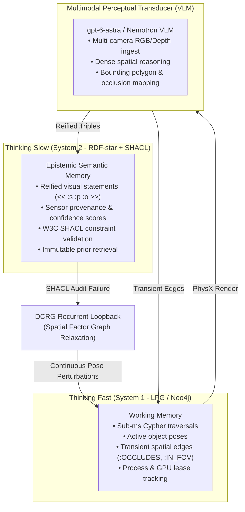

# VLM Evolution Roadmap: From Discrete Gatekeeper to Dual-Graph Active Perceptual Transducer

- **Document ID**: `VLM-PLAN-01`
- **Created**: 2026-09-25
- **Status**: Conceptual Architectural Roadmap & Design Reference (Draft / Ideas)
- **Parent**: [Plan 04](../event_mapping/event-mapping-refactoring_plan_04.md)
- **Related Work Package**: [P04-I02 (Installed Visual Assessment)](../plan04_implementation/02-installed-visual-assessment.md)
- **Related Agent Skills**: [agentic-rdf-star-env-gen](../../../.agent/skills/agentic-rdf-star-env-gen/SKILL.md), [arena-session-startup](../../../.agent/skills/arena-session-startup/SKILL.md)

---

## 1. Executive Vision

In the initial implementation of the IsaacLab-Arena pipeline ([`P04-I02`](../plan04_implementation/02-installed-visual-assessment.md)), the Vision-Language Model (`gpt-6-astra`) operates primarily as a **discrete, post-hoc binary evaluator**. It inspects static simulation camera renders after PhysX settling and returns a boolean pass/fail determination (`is_visible: true/false`).

This document outlines the strategic evolution of the VLM into an **active perceptual transducer** integrated directly into Arena's **Dual-Graph Cognitive Architecture**:
- **Thinking Fast (System 1 - Labeled Property Graph / Neo4j)**: Low-latency working memory, reactive spatial queries, and live simulation coordination.
- **Thinking Slow (System 2 - RDF-star + W3C SHACL + PROV-O)**: Deliberative epistemic memory, reified semantic assertions, and kinematic/physical constraint compilation.

By embedding the VLM into this dual-graph substrate, perception ceases to be a passive end-of-pipe checkpoint and becomes the **active inference sensor** that drives closed-loop continuous scene relaxation and policy synthesis.



---

## 2. The Dual-Graph Framework: System 1 vs. System 2

| Dimension | System 1: Thinking Fast (LPG / Neo4j) | System 2: Thinking Slow (RDF-star + SHACL) |
| :--- | :--- | :--- |
| **Primary Technology** | Neo4j Labeled Property Graph (LPG) with Cypher queries. | W3C RDF-star ($\text{RDF}^*$), W3C SHACL, W3C PROV-O, Turtle-star (`.ttl`). |
| **Role in Arena** | **Operational Working Memory**: High-throughput, sub-millisecond graph hops. Tracks live worker PIDs, GPU leases, active Cartesian coordinates, and collision candidates during simulation. | **Deliberative Epistemic Memory**: Semantic reasoning engine. Validates scenes against strict domain rules (reachability cones, support stability, whole-body control invariants). |
| **VLM Integration Point** | Receives transient perceptual edges (`:OCCLUDES`, `:WITHIN_FOV_OF`, `:AFFORDANCE_ALIGNED`) for rapid reactive vector calculations. | Ingests reified metadata statements tethering visual observations to specific camera views, timestamps, and confidence ratings. |
| **Mutability** | Highly dynamic; updated every simulation step or repair attempt. | Immutable once verified; only SHACL-conformant, settled scenes are indexed as canonical priors (`converged = true`). |

---

## 3. Four-Tier Evolutionary Roadmap for the VLM

### Tier 1: Discrete Binary Gatekeeper (Current — P04-I02)
- **Role**: Software integration and visibility smoke verification.
- **Input**: 3 static camera PNGs (`external_camera_rgb`, `external_camera_2_rgb`, `wrist_camera_rgb`) at control step 180.
- **Output**: Typed Pydantic schema (`is_visible: bool`, brief descriptions, occlusion tags).
- **Graph Interaction**: Stored as a flat JSON result attached to the `AssessmentAttempt` node in Neo4j.
- **Limitation**: The VLM cannot provide continuous gradient or vector guidance; a failure requires external heuristic repair.

### Tier 2: Perceptual Reification Engine (RDF-star Producer)
- **Role**: Transforming raw image pixels into semantically reified epistemic facts with explicit provenance.
- **Mechanism**:
  Instead of returning unstructured text, the VLM outputs Turtle-star ($\text{RDF}^*$) triples where statements are asserted *about other statements*:
  ```turtle
  @prefix arena: <https://isaaclab-arena.nvidia.com/ontology#> .
  @prefix prov:  <http://www.w3.org/ns/prov#> .
  @prefix xsd:   <http://www.w3.org/2001/XMLSchema#> .

  # Reified visual occlusion assertion
  << :red_block arena:occludedBy :blue_bin >>
      arena:observedBy :wrist_camera ;
      arena:vlmModel "gpt-6-astra" ;
      arena:visualConfidence "0.93"^^xsd:float ;
      arena:pixelBoundingPolygon "[124, 342, 218, 448]" ;
      arena:pixelOcclusionPercentage "0.68"^^xsd:float ;
      prov:wasDerivedFrom :frame_step180_wrist_png ;
      prov:generatedAtTime "2026-09-25T14:20:00Z"^^xsd:dateTime .
  ```
- **Value**: Establishes undeniable provenance. An observation is explicitly tied to an observer (`:wrist_camera`), a specific frame, and a calibrated confidence interval.

### Tier 3: Active Working-Memory Injection (LPG Traversal)
- **Role**: Providing instantaneous spatial topology for reactive scene repair.
- **Mechanism**:
  The reified assertions from Tier 2 are projected into the Neo4j working memory graph as active spatial edges:
  ```cypher
  MATCH (cam:Camera {name: "wrist_camera"}), 
        (target:RigidObject {name: "red_block"}), 
        (obstacle:RigidObject {name: "blue_bin"})
  MERGE (obstacle)-[r:OCCLUDES {
      camera: cam.name,
      confidence: 0.93,
      occlusion_ratio: 0.68,
      timestamp: datetime()
  }]->(target)
  ```
- **Fast Spatial Vector Calculation**:
  When a repair is needed, the system does not re-query the VLM or perform heavy 3D mesh raycasting. A Cypher query traverses the `OCCLUDES` path:
  ```cypher
  MATCH (o:RigidObject)-[r:OCCLUDES]->(t:RigidObject)
  RETURN o.name AS occluder, t.name AS target, 
         o.nominal_pos_x - t.nominal_pos_x AS dx,
         o.nominal_pos_y - t.nominal_pos_y AS dy;
  ```
  The repair engine uses $(dx, dy)$ to immediately compute the minimal shift required to clear the line of sight.

### Tier 4: Directed Cyclic Recurrent Graph (DCRG) & Continuous Factor Relaxation
- **Role**: Closing the active inference feedback loop.
- **Concept**:
  Traditional scene generation is a Directed Acyclic Graph (DAG) that terminates at an evaluation node. If visual assessment fails, the process aborts.
  Under the **DCRG model** ([`agentic-rdf-star-env-gen/SKILL.md` Section 5](../../../.agent/skills/agentic-rdf-star-env-gen/SKILL.md#L72-L95)), evaluation nodes inject recurrent loopback edges into the factor graph.
- **Mechanism**:
  1. The VLM detects visual anomalies or grasp corridor blockages.
  2. The failure is audited against **W3C SHACL visual constraint shapes**:
     - `:UnobstructedGraspCorridorShape` (checks approach ray clearance).
     - `:VisualSaliencyShape` (checks target contrast and resolution).
  3. Violations trigger **Stochastic Spatial Factor Graph Relaxation** (`relax_spec_spatial_factor_graph`):
     ```python
     relaxed_spec = relax_spec_spatial_factor_graph(
         spec=current_spec,
         measured_reach_delta={"dx": -0.015, "dy": 0.042, "dz": 0.0},
         temperature=0.12,
     )
     ```
  4. The continuous factor graph perturbs object poses along continuous gradients rather than discrete grid slots, converging on a stable physical contact basin where both PhysX settling and visual SHACL shapes pass.

---

## 4. Synergy with Robot Policy Execution (Isaac-GR00T)

Beyond scene generation, the evolved VLM will bridge environment design with robot manipulation policies:

1. **Affordance & Semantic Grasp Grounding**:
   - The VLM annotates target assets with functional affordance tags in the RDF-star graph (`:GraspableRegion`, `:PourHandle`, `:PushSurface`).
   - The policy runner passes these grounded regions directly to Isaac-GR00T's multimodal encoder.
2. **Visual Saliency Shaping**:
   - Before launching an expensive multi-seed policy evaluation (Goal E / P04-I04), the VLM performs preflight saliency audits:
     *"Does the yellow banana have sufficient visual contrast against the white ceramic plate from the robot's head-mounted stereo camera?"*
   - Catches perceptual failure modes *before* policy rollout begins.
3. **Automated Rollout Diagnostic Oracle**:
   - If a policy rollout drops an object, the VLM reviews key video frames to classify the failure mode:
     - `KinematicSlip` (fingers slipped off smooth surface).
     - `PerceptualOcclusion` (arm blocked camera view during reach).
     - `EarlyRelease` (gripper opened before plate contact).
   - This diagnostic is written into the Neo4j PROV-O execution tree to inform curriculum updates.

---

## 5. Architectural Checklist for Future Work

- [ ] **RDF-star Schema Extension**: Add visual perception vocabulary to `isaaclab_arena/agentic_environment_generation/ontology/arena_schema.ttl` (`arena:occludedBy`, `arena:visualConfidence`, `arena:observedBy`).
- [ ] **SHACL Visual Constraints**: Formulate `arena_visual_constraints.shacl.ttl` to validate bounding box areas, saliency thresholds, and grasp corridor clearance.
- [ ] **VLM Reification Adapter**: Extend `BoundedSceneModels.assess()` to optionally emit validated JSON-LD / Turtle-star payloads alongside standard Pydantic responses.
- [ ] **Neo4j Cypher Spatial Queries**: Implement Cypher procedures for computing Cartesian avoidance vectors directly from `:OCCLUDES` relationships.
- [ ] **DCRG Loopback Wiring**: Connect VLM evaluation outputs to the continuous factor graph relaxation oracle (`spatial_geometric_oracle.py`).
