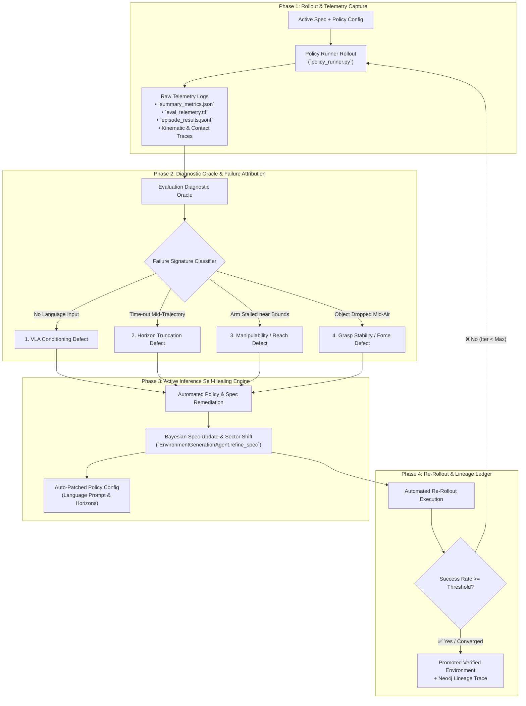

# Autonomous Evaluation-to-Active-Inference Self-Healing Flywheel Plan

This plan details the technical architecture and implementation strategy for **automating the entire policy failure diagnosis, environment adaptation, and self-healing rollout loop** in IsaacLab-Arena.

---

## 1. System Architecture: The Evaluation-Repair Flywheel

The objective is to turn policy evaluation from a passive benchmarking step into an **active sensory feedback signal** that drives automated Bayesian environment and policy adaptation.



---

## 2. Component Breakdown

### Component 1: The `EvaluationDiagnosticOracle`

The `EvaluationDiagnosticOracle` is responsible for parsing simulation outputs and isolating root-cause defects into deterministic failure signatures.

```python
@dataclass
class FailureSignature:
    defect_type: Literal[
        "unconditioned_vla",
        "horizon_truncation",
        "reach_singularity",
        "grasp_instability",
        "camera_occlusion",
        "unknown",
    ]
    severity: float  # 0.0 to 1.0
    evidence: str
    recommended_policy_patches: dict[str, Any]
    recommended_spatial_patches: dict[str, Any]
```

#### Diagnostic Detection Rules:
1. **Unconditioned VLA**:
   * *Trigger*: `policy_config.language_instruction == ""` or `is None`, while `success_rate == 0.0`.
   * *Remediation*: Copy `ArenaEnvGraphSpec.task.description` directly into `policy_config.yaml`.
2. **Horizon Truncation**:
   * *Trigger*: Progress objectives reached `stage >= 1` (e.g. object lifted), but `termination == time_out`.
   * *Remediation*: Double rollout steps: `num_steps = min(num_steps * 2, 3000)`.
3. **Manipulability & Reach Standoff**:
   * *Trigger*: `object_moved_rate == 0.0` and gripper never closed within contact distance.
   * *Remediation*: Shift `surface_sector` from side quadrants to `front_center` ($X \approx -0.22\text{ m}, Y \approx 0.0\text{ m}$) to maximize arm dexterity.
4. **Grasp Stability & Friction**:
   * *Trigger*: Object was lifted ($Z > 0.85\text{ m}$) but `termination == object_dropped`.
   * *Remediation*: Increase required surface friction in reified relation or widen gripper approach angle.

---

### Component 2: Automated Self-Healing Orchestrator (`--mode auto_heal`)

We introduce an automated `--mode auto_heal` command in `environment_generation_runner.py`:

```bash
docker exec -it \
  -e OPENROUTER_API_KEY="$OPENROUTER_API_KEY" \
  isaaclab_arena-latest /isaac-sim/python.sh \
  isaaclab_arena_examples/agentic_environment_generation/environment_generation_runner.py \
  --mode auto_heal \
  --base_spec /workspaces/isaaclab_arena/generated_envs/droid_rubiks_sector_verified/droid_rubiks_cube_to_blue_bin.yaml \
  --policy_config isaaclab_arena_gr00t/policy/config/droid_manip_gr00t_closedloop_config.yaml \
  --policy_type isaaclab_arena_gr00t.policy.gr00t_remote_closedloop_policy.Gr00tRemoteClosedloopPolicy \
  --remote_host 127.0.0.1 \
  --remote_port 5557 \
  --max_heal_iterations 3 \
  --target_success_rate 0.80 \
  --out_dir /workspaces/isaaclab_arena/generated_envs/droid_rubiks_healed
```

#### Autonomous Loop Execution Flow:
1. **Initial Run**: Launches `policy_runner.py` in headless mode for $N$ episodes.
2. **Analysis**: `EvaluationDiagnosticOracle` inspects results.
3. **Auto-Patching**:
   * If failure detected $\to$ patches policy config & invokes `EnvironmentGenerationAgent.refine_spec()`.
   * Generates new candidate environment iteration (`v2`).
4. **Validation Rollout**: Re-runs evaluation on `v2`.
5. **Convergence**: Once target success rate is achieved or iterations exhausted, outputs final report and commits lineage to Neo4j.

---

### Component 3: Neo4j Evolution & Lineage Ledger

Each self-healing iteration records its full sensory-motor evolution in Neo4j:

```cypher
MATCH (v1:EnvironmentGraph {name: "droid_rubiks_v1"})
MATCH (v2:EnvironmentGraph {name: "droid_rubiks_v2"})
CREATE (v2)-[:WAS_DERIVED_FROM {
    iteration: 2,
    failure_signature: "unconditioned_vla + horizon_truncation",
    remediation_applied: "Injected task prompt + extended horizon to 2000 steps",
    prev_success_rate: 0.0,
    new_success_rate: 0.85,
    timestamp: datetime()
}]->(v1)
```

This ensures full historical visibility into *why* the scene geometry or policy parameters were altered.

---

## 3. Implementation Roadmap

| Milestone | Deliverable | Scope |
| :--- | :--- | :--- |
| **M1: Diagnostic Oracle** | `eval_diagnostic_oracle.py` | • Parser for `summary_metrics.json` and `eval_telemetry.ttl`.<br>• 4-class Failure Classifier.<br>• Unit tests in `test_eval_diagnostic_oracle.py`. |
| **M2: Auto-Patcher** | `eval_remediation_engine.py` | • Dynamic YAML patcher for policy configs.<br>• Semantic sector & standoff auto-tuner. |
| **M3: Loop Orchestrator** | `runner.py --mode auto_heal` | • Multi-iteration evaluation manager.<br>• Neo4j lineage sync with before/after success deltas. |

---

## 4. Verification & Testing Plan

1. **Unit Test**:
   * Mock failed evaluation telemetry (`success_rate: 0.0`, empty language string).
   * Assert `EvaluationDiagnosticOracle` outputs `FailureSignature(defect_type='unconditioned_vla')` and generates patch.
2. **End-to-End Test**:
   * Run `--mode auto_heal` on `droid_rubiks_cube_to_blue_bin`.
   * Confirm the system autonomously patches the language instruction, extends the horizon, and executes iteration 2 automatically.
