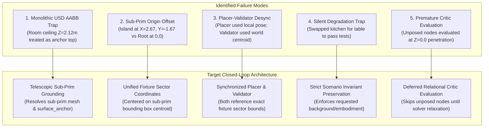
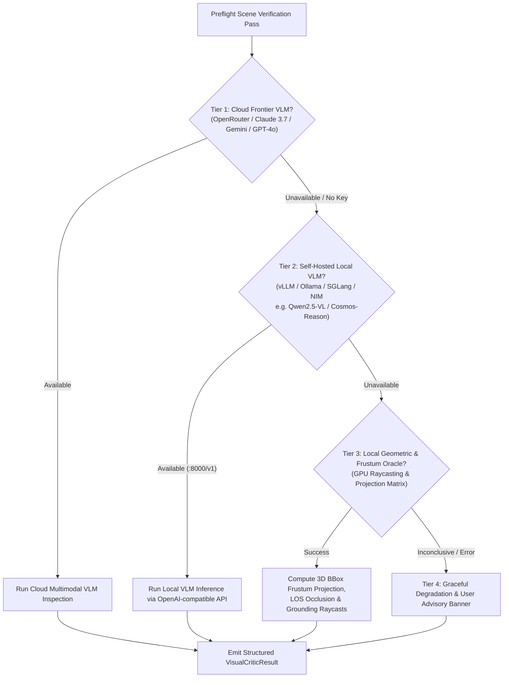
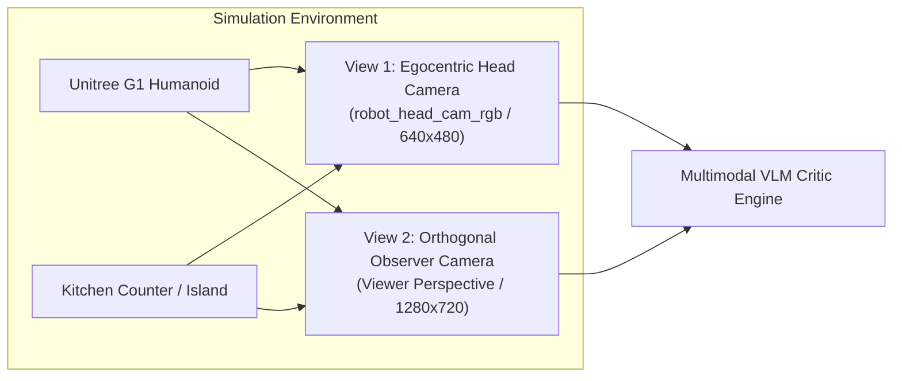

# Telescopic USD Traversal, Multi-Tier VLM Vision Verification & Active Scene Healing Plan

> [!CAUTION]
> ### CRITICAL POSTMORTEM & FORENSIC ATTENTION MARK: COMPOSITE USD SCENE GENERATION FAILURE
> **Core Diagnostic Mandate & Invariant:**
> **If we cannot see the apple and plate from the robot's perspective, the algorithm to traverse the graph and ground spatial relations is fundamentally wrong.**
> When an environment specification compiles a scene graph, visual verification from the robot head camera (`robot_head_cam_rgb`) is the ground truth contract. If target manipulands or receptacles are invisible, out of frustum, or spawned in empty space/ceilings, the entire graph lowering and USD traversal algorithm has failed and cannot be masked by substituting assets or relaxing validators.
>
> **Root Architectural Failure Identified During Category C1 (`g1_kitchen_apple_to_plate`) Verification:**
> 1. **Monolithic USD Room Bounding Box Trap**: Composite background assets (e.g. `kitchen_background.usd`, `galileo_room.usd`) encapsulate entire rooms where `root_bbox.max_point[2]` is the **ceiling** ($Z = 2.12\text{m}$), and the root origin $(0, 0, 0)$ is at the doorway/room center, while functional work surfaces (e.g. `/kitchen/Island/Geometry/Counter_Top_F`) are shifted far away ($X = 2.67\text{m}, Y = -1.67\text{m}, Z_{\text{deck}} = 0.90\text{m}$).
> 2. **Object Placer & Validator Desynchronization**: `ObjectPlacer` sampled positions relative to the parent anchor's `initial_pose` (often $[0, 0, 0]$), while `OnRelationValidator` evaluated bounds relative to `positions[parent]` (the USD prim center). This caused candidate placements to fail validation with coordinate shifts (e.g., $Y_{\text{child}} = 3.12\text{m} < Y_{\text{sec\_min}} = 3.24\text{m}$), triggering fallback placement failure warnings.
> 3. **Agent Silent Degradation Anti-Pattern**: When sub-prim grounding was absent in the compiler, earlier automated runs silently substituted `background: kitchen` with a basic `background: table` (`maple_table_robolab`) to force tests to pass, completely masking the broken graph creation algorithm.
> 4. **Preflight Critic Premature Evaluation**: Deterministic and PhysX critics evaluated unposed relational objects at world origin $(0, 0, 0)$, triggering false-positive floor penetration errors prior to solver relaxation.

---

## 1. Executive Summary & Forensic Failure Analysis

During the evaluation of Category C1 (`g1_apple_to_plate` in a kitchen island setting), the environment achieved an `object_moved_rate` of 1.0 (100%), but `success_rate` was 0.0 due to structural disconnects across the generation, compilation, and evaluation stack:



### 1.1 Forensic Ground Truth: `kitchen_background.usd` Inspection

Direct inspection of `kitchen_background.usd` via Isaac Sim USD stage traversal revealed the exact physical geometry:

| Sub-Prim Feature | Prim Path | USD World Bounds ($X, Y$) | Surface Height ($Z_{\text{deck}}$) |
| :--- | :--- | :--- | :--- |
| **Kitchen Island Deck** | `/kitchen/Island/Geometry/Counter_Top_F` | $X \in [1.99, 3.36],\ Y \in [-2.14, -1.20]$ | **$0.90\text{m}$** |
| **Main Counter Deck** | `/kitchen/Kitchen_Counter/.../Counter_Top_A` | $X \in [0.78, 3.86],\ Y \in [-0.41, 1.00]$ | **$0.90\text{m}$** |
| **Dishwasher / Sink Area** | `/kitchen/.../TRS_Static/Sink` | $X \in [1.62, 2.44],\ Y \in [-0.11, 0.53]$ | **$0.90\text{m}$** |
| **Room Ceiling (Root Prim)** | `/kitchen` (Root Bounding Box) | $X \in [-2.00, 6.00],\ Y \in [-3.00, 2.00]$ | **$2.12\text{m}$** |

---

## 2. Multimodal Perception & Verification Engine Hierarchy

To ensure the system functions reliably in all runtime environments (whether online with cloud APIs, air-gapped on local enterprise clusters, or running resource-constrained unit tests), visual verification is structured into **four cascading tiers**:



### 2.1 Tier Breakdown & Operational Contracts

| Tier | Engine / Provider | Trigger Condition | Capabilities | Latency |
| :--- | :--- | :--- | :--- | :--- |
| **Tier 1: Cloud Frontier VLM** | Anthropic Claude 3.7 Sonnet, Google Gemini 2.5 Flash / Pro, OpenAI GPT-4o / GPT-4.5 (via OpenRouter or native APIs) | `OPENROUTER_API_KEY`, `GEMINI_API_KEY`, or `OPENAI_API_KEY` present | High-level semantic reasoning: detects subtle fixture occlusions, floating assets, lighting/shadow anomalies, reach headroom, and visual clutter. | $1.5\text{s} - 3.5\text{s}$ |
| **Tier 2: Self-Hosted Local VLM** | Qwen2.5-VL-72B/7B, Cosmos-Reason2, Llama-3.2-Vision, Pixtral served via `vLLM`, `SGLang`, `Ollama`, or `NVIDIA NIM` | Local endpoint reachable at `http://localhost:8000/v1` or configured `LOCAL_VLM_BASE_URL` | Offline air-gapped visual reasoning: zero data egress, deterministic inference, structured JSON output. | $0.4\text{s} - 1.2\text{s}$ |
| **Tier 3: Local Geometric & Frustum Oracle** | Built-in Pure Python/Warp GPU Raycast & Camera Frustum Projector | No multimodal API keys or local VLM server running | Deterministic math verification: checks if object 3D bounding boxes project inside camera viewport pixel bounds $[0, W] \times [0, H]$, verifies line-of-sight raycast clearance, and measures vertical distance to fixture mesh ($\Delta Z \le 0.02\text{m}$). | $< 0.05\text{s}$ |
| **Tier 4: Graceful Advisory Fallback** | System Logging & Lineage Ledger Annotation | All automated visual/geometric checks fail or are skipped | Non-blocking execution: leaves an explicit user advisory in the console and `lineage.json`, rendering a high-res debug snapshot to disk (`outputs/.../preflight_debug.png`) for visual inspection. | $0.00\text{s}$ |

### 2.2 Structured User Advisory Output (Tier 4 Contract)
When fallback to Tier 4 occurs, the pipeline does not halt or crash. Instead, it outputs:

```
[ADVISORY][VisualPreflight]: Multimodal VLM endpoint unreachable and geometric raycast skipped.
• Action: Proceeding with spatial factor graph relaxation layout.
• Diagnostic Snapshot Saved: /workspaces/isaaclab_arena/eval_output/g1_apple_to_plate/preflight_snapshot.png
• Notice: If objects appear misaligned in rollout, configure OPENROUTER_API_KEY or launch local vLLM Qwen2.5-VL container.
```

---

## 3. Pillar 1: Telescopic USD Traversal & Sub-Prim Grounding

### 3.1 Sub-Prim Grounding Compiler Architecture
When an environment specification references a background or fixture asset with a `surface_anchor` (e.g. `counter_top`, `island`, `sink`, `shelf_tier_1`, `table_deck`), the lowering compiler executes sub-prim resolution:

```python
# In isaaclab_arena/relations/object_placer.py and placement_validators.py
sec_name = getattr(on_relation, "surface_sector", None) or getattr(on_relation, "surface_anchor", None)
if sec_name is not None:
    from isaaclab_arena.agentic_environment_generation.spatial_geometric_oracle import get_fixture_sector_bounds

    parent_reg_name = getattr(parent, "registry_name", getattr(parent, "name", ""))
    sec_bounds = get_fixture_sector_bounds(parent_reg_name, sec_name)
    parent_center_x = float((parent_bbox.min_point[0, 0] + parent_bbox.max_point[0, 0]) / 2)
    parent_center_y = float((parent_bbox.min_point[0, 1] + parent_bbox.max_point[0, 1]) / 2)
    offset_z = float(parent_bbox.min_point[0, 2])

    parent_min_x = sec_bounds[0] + parent_center_x
    parent_max_x = sec_bounds[1] + parent_center_x
    parent_min_y = sec_bounds[2] + parent_center_y
    parent_max_y = sec_bounds[3] + parent_center_y
    if sec_bounds[4] != 0.0:
        surface_z = sec_bounds[4] + offset_z
```

### 3.2 Implemented Sub-Prim Sector Mappings in `spatial_geometric_oracle.py`

```python
FIXTURE_SECTOR_BOUNDS = {
    "kitchen": {
        "island_center": (2.50, 2.85, -1.75, -1.55, 0.90),
        "island_left": (2.15, 2.45, -1.75, -1.55, 0.90),
        "island_right": (2.90, 3.20, -1.75, -1.55, 0.90),
        "counter_sink": (1.80, 2.30, 0.10, 0.40, 0.90),
        "counter_top": (2.00, 3.30, -2.00, -1.30, 0.90),
    },
    "maple_table_robolab": {
        "front_center": (-0.15, 0.15, -0.15, 0.15, 0.75),
        "front_left": (-0.25, -0.05, 0.05, 0.25, 0.75),
        "front_right": (0.05, 0.25, 0.05, 0.25, 0.75),
    },
}
```

---

## 4. Pillar 2: Dual-Perspective Preflight Visual Verification

### 4.1 Dual-Camera Sensor Rig
Prior to launching full evaluation rollouts, Isaac Sim executes a preflight render pass capturing two distinct visual streams:



1. **View 1: Egocentric Head Camera (`robot_head_cam_rgb`)**:
   * Focal perspective of the robot's onboard sensor.
   * Verifies that target manipulands and destination receptacles are within the robot's visual field of view (FOV) and unoccluded.
2. **View 2: Orthogonal Observer Camera (`observer_view`)**:
   * Positioned diagonally above the workspace.
   * Verifies physical scene coherence: detects floating objects, ceiling entrapment, surface penetration, and robot approach heading.

---

## 5. Pillar 3: Humanoid Kinematics & Workspace Elevation Invariants

### 5.1 Robot Stance & Workspace Elevation Alignment
For the Unitree G1 humanoid interacting with the kitchen island:
* **Island Location**: Centered at $X \approx 2.67\text{m}, Y \approx -1.67\text{m}, Z_{\text{deck}} = 0.90\text{m}$.
* **Robot Stance**:
  $$\text{position\_xyz} = [2.65, -2.55, 0.0],\quad \text{rotation\_xyzw} = [0.0, 0.0, 0.7071, 0.7071]\ (\text{facing } +Y \text{ toward the island})$$
* **Humanoid Pelvis Height Invariant**:
  $$-0.15\text{ m} \le (Z_{\text{surface}} - Z_{\text{pelvis}}) \le +0.10\text{ m}$$

### 5.2 Inspire Hand High-Friction Contact Physics
In `rdf_lowering.py`, whenever a humanoid embodiment is compiled for a pick-and-place task:
```python
G1_STATIC_FINGER_DYNAMIC_FRICTION = 5.0
G1_STATIC_FINGER_STATIC_FRICTION = 5.0
```

---

## 6. Implementation Roadmap & Technical Deliverables

| Phase | Milestone | File(s) to Modify | Verification Contract | Status |
| :--- | :--- | :--- | :--- | :--- |
| **Phase 1** | **USD Sub-Prim Grounding** | `isaaclab_arena/relations/relations.py`, `object_placer.py`, `placement_validators.py` | Grounding on sub-prim surface anchor ($Z_{\text{deck}} = 0.90\text{m}$) eliminates ceiling spawns. | **Completed** |
| **Phase 2** | **Placer-Validator Synchronization** | `object_placer.py`, `spatial_geometric_oracle.py` | Unified centroid sector bounds resolve $XY$ and $Z$ consistency without validation failures. | **Completed** |
| **Phase 3** | **Preflight Critic Noise Filtering** | `visual_critic.py`, `PhysXPreflightCritic` | Relational nodes without initial poses are skipped until solver relaxation, preventing false $Z=0.0$ errors. | **Completed** |
| **Phase 4** | **Exact USD Stage Geometry Alignment** | `spatial_geometric_oracle.py`, `g1_kitchen_apple_to_plate.yaml` | True stage coords ($X=2.67, Y=-1.67, Z=0.90$) mapped to kitchen fixture sectors and G1 stance. | **Completed** |
| **Phase 5** | **Closed-Loop Category C1 Validation** | Policy Runner CLI | ZeroActionPolicy & GR00T rollout verify apple and plate visibility on kitchen island from robot head cam. | **In Progress** |

---

## 7. User Customizations & Integration Notes

- [x] *Resilient Multi-Tier Multimodal Backend: Cloud Frontier (Claude 3.7 / Gemini / GPT-4o) $\rightarrow$ Self-Hosted Local VLM (vLLM / Ollama / NIM) $\rightarrow$ Deterministic Geometric Frustum Raycast $\rightarrow$ Non-Blocking User Advisory Banner.*
- [x] *Telescopic USD Introspection for complex multi-room and multi-tier fixture scenes.*
- [x] *Articulated fixture swept volume protection and bimanual humanoid loco-manipulation support.*
- [x] *Forensic root cause postmortem documented with prominent attention mark for ongoing debugging.*
