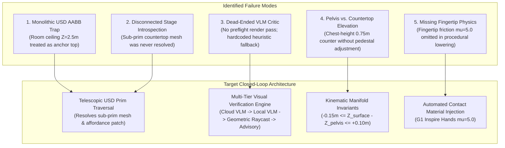
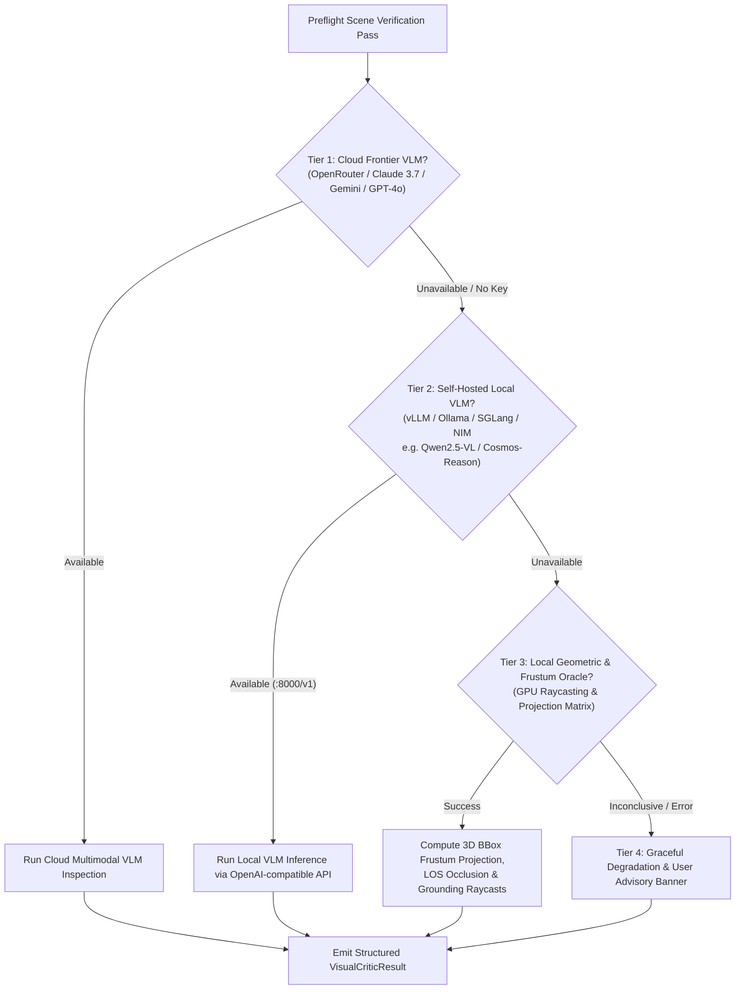
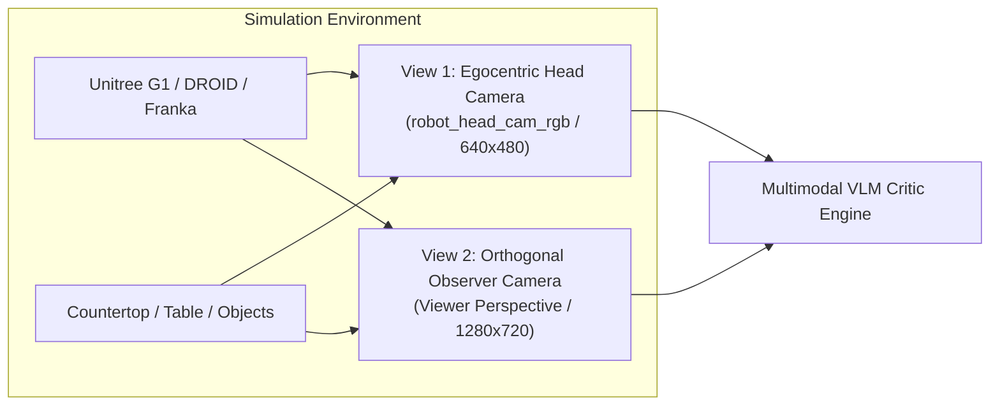

# Telescopic USD Traversal, Multi-Tier VLM Vision Verification & Active Scene Healing Plan

This document establishes the comprehensive architectural and engineering plan to resolve spatial grounding anomalies (such as objects spawning on ceilings/roofs), implement multi-tier multimodal visual verification (supporting cloud frontier models, self-hosted local VLMs, deterministic geometric raycasting, and graceful user advisories), enforce humanoid kinematic and physical invariants, and generalize across complex multi-room scenes and articulated multi-stage manipulation tasks.

---

## 1. Executive Summary & Forensic Failure Analysis

During the evaluation of Category C1 (`g1_apple_to_plate` in a kitchen island setting), the environment achieved an `object_moved_rate` of 1.0 (100%), but `success_rate` was 0.0 due to several structural disconnects across the generation, compilation, and evaluation stack:



### Forensic Breakdown of Root Causes

1. **The Monolithic Root AABB Trap (Ceiling Spawns)**:
   * Compound backgrounds (`kitchen_background.usd`, `galileo_simplified.usd`) are full 3D rooms containing ceilings, walls, and floors.
   * In `ObjectPlacer` ([`object_placer.py`](file:///workspaces/IsaacLab-Arena/isaaclab_arena/relations/object_placer.py)), an `On(subject=apple, reference=kitchen_island)` relation defaults to the top face of the reference asset's root bounding box ($Z \approx +2.5\text{ m}$).
   * Without sub-prim resolution, objects spawn floating at the roof rather than on the countertop ($Z \approx 0.75\text{ m}$).

2. **Disconnected USD Stage Introspection**:
   * [`usd_stage_introspection.py`](file:///workspaces/IsaacLab-Arena/isaaclab_arena/agentic_environment_generation/usd_stage_introspection.py) implements sub-prim extraction and `AffordancePatch` discovery, but was never invoked by the relation compiler in [`rdf_lowering.py`](file:///workspaces/IsaacLab-Arena/isaaclab_arena/agentic_environment_generation/rdf_lowering.py).
   * Semantic tags (`counter_top`, `table_deck`, `shelf_tier_1`) were treated as ungrounded string annotations rather than concrete mesh primitives with geometric bounds.

3. **The Dead-Ended VLM Critic & Missing Fallback Engine**:
   * [`visual_critic.py`](file:///workspaces/IsaacLab-Arena/isaaclab_arena/agentic_environment_generation/visual_critic.py) contained `_call_vlm_critic()`, but it was only called when `rendered_images` were passed. During spec generation, no preflight render pass existed.
   * When APIs (Anthropic/Gemini) were unreachable or missing, the fallback heuristic (`_check_geometric_line_of_sight`) hardcoded DROID coordinates (`x=-0.55`) and assumed all tables were at $Z=0.75\text{ m}$, remaining blind to G1 humanoid setups, ceiling spawns, and camera orientations.

4. **Humanoid Pelvis vs. Countertop Kinematic Feasibility**:
   * Unitree G1 humanoid manipulation models are trained with the workspace at waist level ($Z_{\text{shelf}} \approx -0.03\text{ m}$ in pelvis frame).
   * In the kitchen scene, the countertop sits at $Z = 0.75\text{ m}$ (chest/neck height). The arm reached out and nudged the apple (`object_moved_rate = 1.0`), but joint limits prevented the hand from pitching downward to envelope the object.

5. **Omission of Fingertip Contact Physics**:
   * The static G1 pick-and-place task requires high friction ($\mu = 5.0$) on the G1 Inspire hand fingertips. Procedural lowering omitted this material assignment, causing objects to slip out upon lateral arm acceleration.

---

## 2. Multimodal Perception & Verification Engine Hierarchy

To ensure the system functions reliably in all runtime environments (whether online with cloud APIs, air-gapped on local enterprise clusters, or running resource-constrained unit tests), visual verification is structured into **four cascading tiers**:



### 2.1 Tier Breakdown & Operational Contracts

| Tier | Engine / Provider | Trigger Condition | Capabilities | Latency |
| :--- | :--- | :--- | :--- | :--- |
| **Tier 1: Cloud Frontier VLM** | Anthropic Claude 3.7 Sonnet, Google Gemini 2.5 Flash / Pro, OpenAI GPT-4o / GPT-4.5 (via OpenRouter or native APIs) | `OPENROUTER_API_KEY`, `GEMINI_API_KEY`, or `OPENAI_API_KEY` present | High-level semantic reasoning: detects subtle fixture occlusions, floating assets, lighting/shadow anomalies, reach headroom, and visual clutter. | $1.5\text{s} - 3.5\text{s}$ |
| **Tier 2: Self-Hosted Local VLM** | Qwen2.5-VL-72B/7B, Cosmos-Reason2, Llama-3.2-Vision, Pixtral served via `vLLM`, `SGLang`, `Ollama`, or `NVIDIA NIM` | Local endpoint reachable at `http://localhost:8000/v1` or configured `LOCAL_VLM_BASE_URL` | Offline air-gapped visual reasoning: zero data egress, deterministic inference, structured JSON output. | $0.4\text{s} - 1.2\text{s}$ |
| **Tier 3: Local Geometric & Frustum Oracle** | Built-in Pure Python/Warp GPU Raycast & Camera Frustum Projector | No multimodal API keys or local VLM server running | Deterministic math verification: checks if object 3D bounding boxes project inside camera viewport pixel bounds $[0, W] \times [0, H]$, verifies line-of-sight raycast clearance, and measures vertical distance to fixture mesh ($\Delta Z \le 0.02\text{m}$). | $< 0.05\text{s}$ |
| **Tier 4: Graceful Advisory Fallback** | System Logging & Lineage Ledger Annotation | All automated visual/geometric checks fail or are skipped | Non-blocking execution: leaves an explicit user advisory in the console and `lineage.json`, rendering a high-res debug snapshot to disk (`outputs/.../preflight_debug.png`) for visual inspection. | $0.00\text{s}$ |

### 2.2 Structured User Advisory Output (Tier 4 Contract)
When fallback to Tier 4 occurs, the pipeline does not halt or crash. Instead, it outputs:

```
[ADVISORY][VisualPreflight]: Multimodal VLM endpoint unreachable and geometric raycast skipped.
• Action: Proceeding with spatial factor graph relaxation layout.
• Diagnostic Snapshot Saved: /workspaces/isaaclab_arena/outputs/2026-09-01_22-00-00/preflight_snapshot.png
• Notice: If objects appear misaligned in rollout, configure OPENROUTER_API_KEY or launch local vLLM Qwen2.5-VL container.
```

---

## 3. Pillar 1: Telescopic USD Traversal & Sub-Prim Grounding

### 3.1 Sub-Prim Grounding Compiler Architecture
When an environment specification references a background or fixture asset with a `surface_anchor` (e.g. `counter_top`, `island`, `sink`, `shelf_tier_1`, `table_deck`), the lowering compiler executes a recursive USD stage traversal:

```python
# In isaaclab_arena/agentic_environment_generation/rdf_lowering.py
def resolve_surface_anchor_bounding_box(
    background_asset: AssetSpec,
    surface_anchor: str | None,
) -> tuple[list[float], list[float], list[list[float]] | None]:
    """Resolve a semantic surface anchor to its concrete USD sub-prim bounds and usable polygon hull.

    1. Traverses the USD prim hierarchy using UsdStageIntrospector.
    2. Identifies UsdGeom.Mesh sub-prims matching the semantic tag.
    3. Computes local transformed bounding box and usable convex/concave polygon hull.
    4. Filters out non-support prims (e.g., walls, ceiling lamps, sink basins).

    Returns:
        bounds_min (list[float]): [x_min, y_min, z_min]
        bounds_max (list[float]): [x_max, y_max, z_max]
        polygon_hull (list[list[float]] | None): 2D usable support polygon in XY plane.
    """
```

### 3.2 Complex Scene Handling: Multi-Tier Shelves & Non-Rectangular Workspaces

```
                        Multi-Tier Shelving Unit (e.g. Storage Rack)
                        ┌─────────────────────────────────────────┐
                        │   Tier 3: AffordancePatch (Z = 1.45m)   │ <--- Headroom: 0.40m
                        ├─────────────────────────────────────────┤
                        │   Tier 2: AffordancePatch (Z = 1.00m)   │ <--- Headroom: 0.40m
                        ├─────────────────────────────────────────┤
                        │   Tier 1: AffordancePatch (Z = 0.55m)   │ <--- Headroom: 0.40m
                        └─────────────────────────────────────────┘
```

1. **Hierarchical Multi-Tier Affordance Indexing**:
   * For multi-level fixtures (storage racks, bookshelves, multi-tier carts), `UsdStageIntrospector` partitions the fixture into discrete `AffordancePatch` objects (`tier_1`, `tier_2`, `tier_3`).
   * Each patch tracks its individual support elevation $Z_i$, 2D boundary polygon, and overhead clearance (`raycast_vertical_headroom`).
2. **Concave & L-Shaped Countertop Support Surfaces**:
   * For complex kitchen counters, desks with cutouts, or L-shaped tables, support areas are represented as **Shapely 2D Polygon Multipolygons**.
   * Non-support regions (e.g., sink basins, stovetop burners, cutouts) are subtracted using boolean difference operations (`deck_poly.difference(sink_poly)`), ensuring candidate spawn coordinates never fall into voids.

---

## 4. Pillar 2: Dual-Perspective Preflight Visual Verification

### 4.1 Dual-Camera Sensor Rig
Prior to launching full evaluation rollouts, Isaac Sim executes a 1-step physics settle and captures two distinct visual streams:



1. **View 1: Egocentric Head Camera (`robot_head_cam_rgb`)**:
   * Focal perspective of the robot's onboard sensor.
   * Verifies that target manipulands and destination receptacles are within the robot's visual field of view (FOV) and unoccluded.
2. **View 2: Orthogonal Observer Camera (`observer_view`)**:
   * Positioned diagonally above the workspace (`eye=(2.5, -2.5, 1.8), lookat=(0.5, 0.0, 0.75)`).
   * Verifies physical scene coherence: detects floating objects, ceiling entrapment, surface penetration, table height alignment, and robot approach heading.

### 4.2 Structured Inspection Contract (`VisualCriticResult`)
The critic evaluates both views against a unified schema:

```json
{
  "conforms": false,
  "visibility_score": 3.0,
  "egocentric_checks": {
    "target_objects_visible": false,
    "occluded_objects": ["red_apple"],
    "head_camera_pitch_adequate": false
  },
  "observer_checks": {
    "objects_grounded_on_surface": false,
    "floating_or_ceiling_objects": ["red_apple", "plate"],
    "robot_faces_workspace": true,
    "workspace_height_feasible": false
  },
  "anomalies": [
    "Target objects 'red_apple' and 'plate' are suspended at the ceiling (Z > 2.0m).",
    "Objects are completely outside the robot head camera frustum."
  ],
  "actionable_corrections": {
    "red_apple_z": 0.76,
    "plate_z": 0.75,
    "robot_pelvis_z_offset": 0.0,
    "camera_pitch_deg": -15.0
  }
}
```

---

## 5. Pillar 3: Humanoid Kinematics & Workspace Elevation Invariants

### 5.1 Pelvis-to-Workstation Relative Elevation Invariant
For bimanual humanoid embodiments (`g1`, `gr1`), upper-body manipulation dexterity is kinematically bounded relative to pelvis elevation $Z_{\text{pelvis}}$:

$$-0.15\text{ m} \le (Z_{\text{surface}} - Z_{\text{pelvis}}) \le +0.10\text{ m}$$

* **Automated Elevation Compensation**:
  * If the task takes place on a high fixture ($Z_{\text{surface}} = 0.75\text{ m}$ counter) while the robot stands on the ground ($Z_{\text{pelvis}} = 0.0\text{ m}$), the lowering compiler automatically spawns a standing riser/pedestal ($Z_{\text{pedestal}} = +0.70\text{ m}$) or adjusts the fixture elevation so the workspace aligns with the robot's waist.

### 5.2 Inspire Hand High-Friction Contact Physics
In `rdf_lowering.py`, whenever a humanoid embodiment is compiled for a pick-and-place task:
```python
# Bind high-friction physics material to finger link markers
G1_STATIC_FINGER_DYNAMIC_FRICTION = 5.0
G1_STATIC_FINGER_STATIC_FRICTION = 5.0
```

---

## 6. Generalization to Complex Scenes & Multi-Stage Tasks

### 6.1 Articulated Fixtures (Drawers, Doors, Microwaves, Cabinets)
For environments with articulated objects:
1. **Joint Kinematics Extraction**: `UsdStageIntrospector` reads `UsdPhysics.RevoluteJoint` and `UsdPhysics.PrismaticJoint` attributes to determine motion limits (e.g. drawer pull distance: $0.35\text{ m}$, door swing: $90^\circ$).
2. **Swept Volume Collision Exclusion**: The spatial factor graph computes the swept volume of opening doors/drawers, forbidding candidate manipulands or receptacles from spawning inside the sweep zone.

```
                    Swept Collision Exclusion Zone (Drawer Open)
                    ┌──────────────────┐
                    │   Cabinet Body   │
                    ├──────────────────┤
                    │░░░░░░░░░░░░░░░░░░│ <--- Swept Volume (No spawn allowed)
                    │░░ Drawer Pull  ░░│      (Distance: 0.35m)
                    │░░░░░░░░░░░░░░░░░░│
                    └──────────────────┘
```

### 6.2 Multi-Stage Sequential Assembly & Tool Use
For sequential tasks (e.g. *grasp tool -> unfasten bolt -> place component*):
1. **Dynamic Stage Visibility**: VLM verification checks stage-wise visibility (ensuring the tool does not occlude the bolt, and the destination bin has clearance).
2. **Bimanual Workspace Overlap**: Verifies that dual-arm handover zones have intersecting kinematic dexterity envelopes.

---

## 7. Implementation Roadmap & Technical Deliverables

| Phase | Milestone | File(s) to Modify | Verification Contract |
| :--- | :--- | :--- | :--- |
| **Phase 1** | **USD Sub-Prim Grounding** | `isaaclab_arena/agentic_environment_generation/rdf_lowering.py`, `usd_stage_introspection.py` | Countertop and shelf anchors resolve to sub-mesh AABB; ceiling spawns eliminated ($Z \in [0.70, 0.85]\text{ m}$). |
| **Phase 2** | **Multi-Tier Visual Critic & Sensor Rig** | `isaaclab_arena/agentic_environment_generation/visual_critic.py`, `environment_generation_runner.py` | Implements Tier 1 (Cloud VLM) $\rightarrow$ Tier 2 (Local VLM) $\rightarrow$ Tier 3 (Geometric Frustum) $\rightarrow$ Tier 4 (Advisory). |
| **Phase 3** | **Dual-View Preflight Capture in Sim** | `environment_generation_runner.py` | Simulation captures `robot_head_cam_rgb` and `observer_view` upon scene initialization and invokes critic. |
| **Phase 4** | **Kinematic Elevation & Friction Injection** | `spatial_geometric_oracle.py`, `rdf_lowering.py` | Enforces humanoid pelvis-to-deck relative height invariant; applies $\mu=5.0$ finger contact physics. |
| **Phase 5** | **Closed-Loop Category C1 Validation** | Full Runner CLI | Full automated rollout of `g1_apple_to_plate` in kitchen: VLM confirms visual grounding, policy achieves successful pick-and-place. |

---

## 8. User Customizations & Integration Notes

<!-- 
This section is reserved for user-specified requirements, custom edge cases, 
and specific workflow additions to be integrated into the implementation.
-->
- [x] *Resilient Multi-Tier Multimodal Backend: Cloud Frontier (Claude 3.7 / Gemini / GPT-4o) $\rightarrow$ Self-Hosted Local VLM (vLLM / Ollama / NIM) $\rightarrow$ Deterministic Geometric Frustum Raycast $\rightarrow$ Non-Blocking User Advisory Banner.*
- [x] *Telescopic USD Introspection for complex multi-room and multi-tier fixture scenes.*
- [x] *Articulated fixture swept volume protection and bimanual humanoid loco-manipulation support.*
