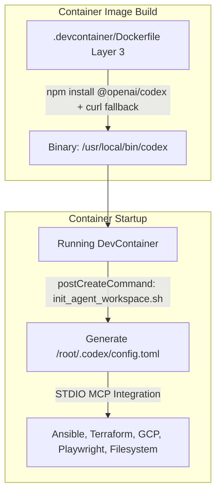

# Integration Plan: OpenAI Codex in IsaacLab-Arena DevContainer (Implemented)

**Status:** Completed

## 1. Overview & Objective
This plan outlines the modifications required to integrate the **OpenAI Codex CLI and agentic harness** into the IsaacLab-Arena development container.

The repository's [`AGENTS.md`](file:///workspaces/IsaacLab-Arena/AGENTS.md) already anticipates multi-agent workflows (*"Claude Code reads the library via the committed `.claude/skills` symlink; Codex scans `.agents/skills/` directly"*). This integration completes the setup by installing the Codex binary, persisting authentication sessions, pre-configuring MCP servers, and ensuring consistent host/container permissions.

---

## 2. DevContainer Architecture & Isolation

The integration is completely self-contained within the container image and internal filesystem, leaving host scripts and mounts untouched:



---

## 3. Applied File Modifications

### 3.1. `.devcontainer/Dockerfile`
* **Target Block**: Layer 3 (*Autonomous Terminal AI Agent CLIs & Model Context Protocol (MCP) Packages*, lines 109–121).
* **Applied Changes**:
  1. Added `@openai/codex` to the global `npm install -g` command alongside `@anthropic-ai/claude-code`.
  2. Added the official standalone install script as a fallback/validation step:
     ```dockerfile
     (curl -fsSL https://chatgpt.com/codex/install.sh | bash || true) && \
     (ln -sf /root/.local/bin/codex /usr/local/bin/codex 2>/dev/null || true)
     ```
  3. Ensured the binary is linked to `/usr/local/bin/codex`.

```diff
--- a/.devcontainer/Dockerfile
+++ b/.devcontainer/Dockerfile
@@ -109,10 +109,13 @@ RUN curl -fsSL -o /tmp/tf-mcp.zip https://releases.hashicorp.com/terraform-mcp-s
 # Layer 3: Autonomous Terminal AI Agent CLIs & Model Context Protocol (MCP) Packages
 RUN npm install -g \
         @anthropic-ai/claude-code \
+        @openai/codex \
         @modelcontextprotocol/server-filesystem \
         @ansible/ansible-mcp-server \
         @google-cloud/gcloud-mcp \
         @executeautomation/playwright-mcp-server && \
+    (curl -fsSL https://chatgpt.com/codex/install.sh | bash || true) && \
+    (ln -sf /root/.local/bin/codex /usr/local/bin/codex 2>/dev/null || true) && \
     (curl -fsSL https://antigravity.google/cli/install.sh | bash || true) && \
     (ln -sf /root/.local/bin/agy /usr/local/bin/agy 2>/dev/null || true) && \
     (curl -fsSL https://hermes-agent.nousresearch.com/install.sh | bash -s -- --skip-setup --skip-browser || true)
```

---

### 3.2. `.devcontainer/init_agent_workspace.sh`
* **Target Block**: Section 15 (*Agent MCP Servers Configuration*, lines 445–514).
* **Applied Changes**:
  * Added generation of `/root/.codex/config.toml` (STDIO format) registering `ansible`, `gcp-cloud`, `playwright`, `terraform`, and `filesystem`.
  * Preserved complete MCP feature parity across Antigravity, Claude Code, Cursor, and Codex inside the container.

```diff
--- a/.devcontainer/init_agent_workspace.sh
+++ b/.devcontainer/init_agent_workspace.sh
@@ -442,8 +442,8 @@ EOF_DOC
   echo "  ✓ Generated .agents/references/docs/debugging_arena_gr00t.md"
 fi

-# 15. Agent MCP Servers Configuration (Antigravity, VS Code, Cursor, Claude Code)
-mkdir -p /root/.gemini/config "${TARGET_DIR}/.vscode" "${TARGET_DIR}/.cursor"
+# 15. Agent MCP Servers Configuration (Antigravity, VS Code, Cursor, Claude Code, OpenAI Codex)
+mkdir -p /root/.gemini/config "${TARGET_DIR}/.vscode" "${TARGET_DIR}/.cursor" /root/.codex

 # Master MCP configuration (ansible, gcp-cloud, playwright, terraform, filesystem)
 cat <<'EOF_MCP' > /root/.gemini/config/mcp_config.json
@@ -486,7 +486,32 @@ cp /root/.gemini/config/mcp_config.json "${TARGET_DIR}/.cursor/mcp.json"
 cp /root/.gemini/config/mcp_config.json /root/.claude.json
 chmod 644 /root/.claude.json

-echo "  ✓ Configured MCP servers for Antigravity, VS Code, Cursor, and Claude Code"
+# OpenAI Codex global MCP configuration (~/.codex/config.toml)
+cat <<'EOF_CODEX' > /root/.codex/config.toml
+# Auto-generated MCP server definitions for OpenAI Codex
+[mcp_servers.ansible]
+command = "ansible-mcp-server"
+args = ["--stdio"]
+
+[mcp_servers.gcp-cloud]
+command = "gcloud-mcp"
+args = []
+
+[mcp_servers.playwright]
+command = "playwright-mcp-server"
+args = []
+
+[mcp_servers.terraform]
+command = "/usr/local/bin/terraform-mcp-server"
+args = []
+
+[mcp_servers.filesystem]
+command = "mcp-server-filesystem"
+args = ["/workspaces"]
+EOF_CODEX
+chmod 644 /root/.codex/config.toml
+
+echo "  ✓ Configured MCP servers for Antigravity, VS Code, Cursor, Claude Code, and OpenAI Codex"
```

---

## 4. Verification

1. **Script Syntax Check**:
   `bash -n .devcontainer/init_agent_workspace.sh` passes without errors.
2. **Post-Rebuild Verification**:
   ```bash
   which codex
   codex --version
   cat /root/.codex/config.toml
   ```
3. **Skills Discovery**:
   OpenAI Codex automatically detects `.agents/skills/` per the repository convention in `AGENTS.md`.
