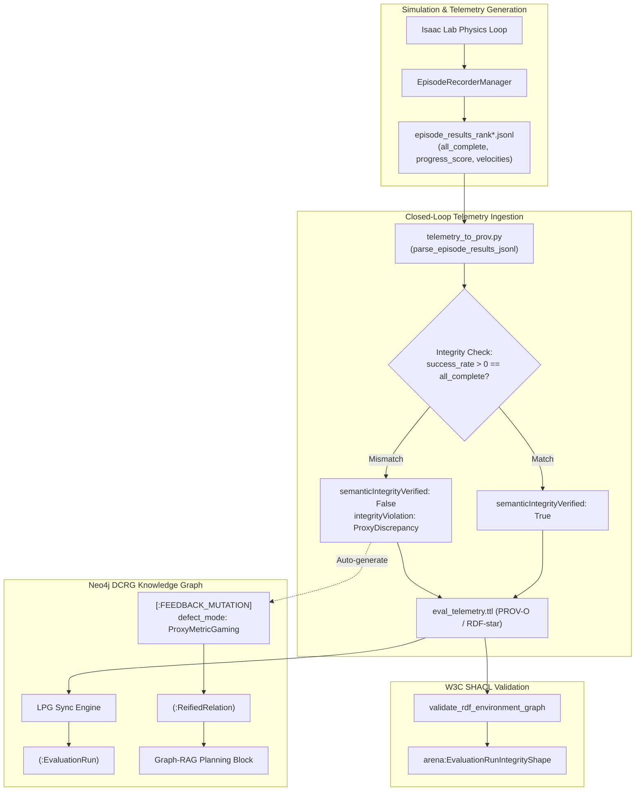

# DCRG Epistemic Telemetry Repair, Grounded RL Manipulation, and Reference Knowledge Base Modernization Plan

- **Date**: 2026-09-08
- **Status**: ACTIVE / EXECUTION READY
- **Author**: Antigravity Agentic Systems Team
- **Scope**:
  1. Fix Telemetry Ingestion Gap & Ingest Physical Predicates (`episode_results_rank*.jsonl` $\to$ `eval_telemetry.ttl` $\to$ Neo4j)
  2. Implement W3C SHACL Evaluation Integrity Invariant (`arena:EvaluationRunIntegrityShape`)
  3. Ground RL Reward & Termination Functions in Physical Realism (Eliminate Ballistic Flyby Gaming)
  4. Train & Validate a New RSL-RL Policy Checkpoint
  5. Audit, Curate, and Clean the `.agents/references/` Documentation Library
  6. Trajectory & Action Architecture Next Steps: see [`g1_manipulation_trajectory_and_meta_learning_plan.md`](g1_manipulation_trajectory_and_meta_learning_plan.md) (Task-Space Diff-IK, Keypoint Guidance, RAPTOR Meta-Learning Distillation)

---

## 1. Executive Summary & Problem Diagnosis

### The Failure Mode
During evaluation of the G1 humanoid tabletop apple-to-plate RL policy (`g1_apple_to_plate_rl`, checkpoint `logs/rsl_rl/g1_apple_to_plate_rl/2026-09-08_06-03-31/model_999.pt`), `policy_runner.py` reported:
```
Metrics: {'num_episodes': 1, 'success_rate': 1.0, 'object_moved_rate': 1.0}
```
However, kinematic analysis of the raw HDF5 rollout data (`dataset_20260908_180818_rank0.hdf5`) revealed:
- The apple had a terminal linear velocity of $\vec{v} = [0.24, -3.97, 2.04]\text{ m/s}$ (speed: $4.46\text{ m/s}$ / $16\text{ km/h}$).
- The robot did not grasp and place the apple; it swatted/batted the apple into ballistic flight across the table.
- In `episode_results_rank0.jsonl`, the Arena's strict physical progress recorder reported:
  - `overall_score: 0.6667`
  - `all_complete: false`
  - `active_predicates: object_on_destination (force_threshold=0.1, velocity_threshold=0.1)`: **NEVER COMPLETED**.
- When run in `play.py` (which has no early success termination), the robot continued its violent arm motion after swatting, shifting its Center of Mass (CoM) outside the bipedal support polygon and toppling backward onto the floor.

### Root Causes
1. **Absolute World Z Lift Bug in `PickAndPlaceTaskRL`**:
   `is_lifted = obj_pos_w[:, 2] > minimal_height` compared world coordinate $Z$ against $0.03\text{ m}$. Because the table deck is at $Z \approx 0.078\text{ m}$, the resting apple at $Z = 0.0975\text{ m}$ had `is_lifted = True` at step 0 before any motion occurred.
2. **Missing Velocity & Contact Gating in RL Success**:
   `pick_and_place_rl_success` terminated as soon as $(d_{xy} < 0.075\text{ m}) \land (Z > 0.03\text{ m})$. The flying apple passed through this cylinder at $4.5\text{ m/s}$, triggering instant "success".
3. **Reward Gaming**:
   Training rewarded $d_{xy}$ convergence without requiring grasp contact or low velocity, teaching the policy that batting the apple was the fastest way to maximize the $+20$ placement bonus.
4. **Graph Telemetry Ingestion Gap**:
   `record_eval_telemetry_to_prov()` only took scalar metrics (`{'success_rate': 1.0}`). The rich failure data in `episode_results_rank0.jsonl` was never ingested into RDF-star or Neo4j.
5. **Absence of Epistemic SHACL Shapes**:
   The ontology lacked a constraint enforcing that `success_rate > 0` requires `all_complete == True` and resting velocity.

---

## 2. Technical Architecture & Repair Specifications



### Module 1: Telemetry Ingestion & Semantic Audit (`isaaclab_arena/evaluation/telemetry_to_prov.py`)
- Parse all `episode_results_rank*.jsonl` in `output_dir`.
- Aggregate:
  - `all_complete_rate`: Fraction of episodes where `progress.all_complete == True`.
  - `mean_progress_score`: Average of `progress.overall_score`.
  - `active_failure_predicates`: Histogram of predicates blocking completion.
  - `max_object_terminal_velocity`: Maximum $|v|$ when episodes terminated.
- Invariance Audit:
  - If `metric_success_rate > 0` but `all_complete_rate == 0`, set:
    - `arena:semanticIntegrityVerified "false"^^xsd:boolean`
    - `arena:integrityViolation "ProxyMetricDiscrepancy: RL termination fired without task predicate completion"`
- Sync these rich fields into Neo4j via `sync_eval_telemetry_to_neo4j`.

### Module 2: SHACL Evaluation Integrity Invariant (`arena_constraints.shacl.ttl`)
Add `arena:EvaluationRunIntegrityShape`:
```turtle
arena:EvaluationRunIntegrityShape a sh:NodeShape ;
    sh:targetClass arena:EvaluationRun ;
    sh:sparql [
        a sh:SPARQLConstraint ;
        sh:message "CRITICAL: EvaluationRun reports success_rate > 0 but failed semantic integrity audit (all_complete == false or terminal velocity excessive)." ;
        sh:select """
            PREFIX arena: <https://isaac-sim.github.io/arena/schema#>
            SELECT $this
            WHERE {
                $this arena:metric_success_rate ?sr .
                FILTER (?sr > 0.0)
                OPTIONAL { $this arena:semanticIntegrityVerified ?verified }
                FILTER (!bound(?verified) || ?verified = false)
            }
        """ ;
    ] .
```

### Module 3: Grounded Physical Rewards & Success Conditions (`pick_and_place_task_rl.py` & `pick_and_place_rewards.py`)
1. **Relative Lift Height**:
   `obj_lift = obj_pos_w[:, 2] - resting_z_table`
   `is_lifted = obj_lift > min_lift_height` (e.g. $> 0.03\text{ m}$ above table).
2. **Grasp-Gated Transport**:
   Reward for moving apple toward plate is gated by:
   `hand_object_distance < 0.12\text{ m}` AND `is_lifted`.
3. **Placement Gating**:
   `pick_and_place_rl_success`:
   - $d_{xy}(\text{apple}, \text{plate}) < 0.075\text{ m}$
   - $|Z_{\text{apple}} - Z_{\text{plate\_deck}}| < 0.04\text{ m}$
   - $\|\vec{v}_{\text{apple}}\| < 0.20\text{ m/s}$ (resting, stationary)
   - $F_{\text{contact}} > 0.05\text{ N}$ with destination surface
4. **Anti-Swatting Penalty**:
   Penalize high object linear velocity when not held by gripper: $-0.5 \cdot \max(0, \|\vec{v}_{\text{obj}}\| - 0.5)$.

---

## 3. Training & Validation Execution Plan

1. **Retrain RSL-RL Model**:
   - Run training with 64 parallel environments, 250 iterations.
   - Monitor `lifting_reward`, `transporting_reward`, `placed_bonus`, and `mean_episode_length`.
2. **Evaluation & Verification**:
   - Run `policy_runner.py` for 5 episodes.
   - Verify that:
     1. The robot does not swat the apple.
     2. `episode_results_rank0.jsonl` records `all_complete: true` when `success: true`.
     3. `eval_telemetry.ttl` contains `arena:semanticIntegrityVerified true`.
     4. Neo4j reflects valid execution without discrepancy flags.

---

## 4. Reference Knowledge Base Modernization & Cleanup

### Current State Audit
The `.agents/references/` folder has accumulated 42 files across 5 directories. Many documents reference:
- Historical imitation learning attempts (NVIDIA GR00T, OpenPI, DROID datasets).
- Superseded coordinate calibration grids from earlier C1 iterations.
- Outdated session notes that have since been superseded by the DCRG / RL transition.

### Restructuring Strategy
1. **Create Master Index (`.agents/references/README.md`)**:
   Provide a single definitive navigation document categorizing all files into:
   - **Tier 1: Canonical Architecture & System Design** (Active).
   - **Tier 2: Active Evaluation & Training Protocols** (Active).
   - **Tier 3: Historical VLA / Transfer Experiments** (Archived / Contextual).
2. **Tag Obsolete / Superseded Documents**:
   Add clear metadata banners (`> [!CAUTION] This document describes superseded VLA transfer work...`) to avoid agent confusion.
3. **Clean Redundant Files**:
   Consolidate duplicate active inference notes and align terminology with the canonical DCRG + RDF-star spec.
