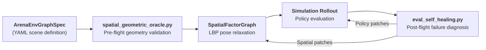
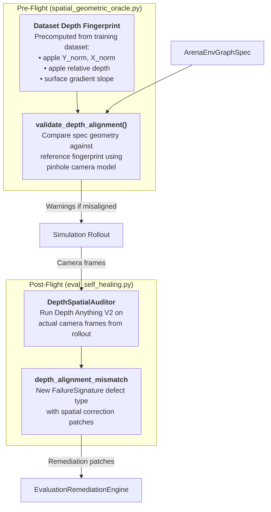

# Depth Alignment Integration Plan

## Is `spatial_geometric_oracle.py` the Right Place?

**Partially yes, but the solution spans two files.** Here's why:

### Current Architecture



The oracle operates at **two distinct stages**:

| Stage | File | When It Runs | What It Knows |
|:---|:---|:---|:---|
| **Pre-flight** | [`spatial_geometric_oracle.py`](file:///workspaces/IsaacLab-Arena/isaaclab_arena/agentic_environment_generation/spatial_geometric_oracle.py) | Before simulation | Only the `ArenaEnvGraphSpec` (3D coordinates, fixture bounds, kinematic reach) |
| **Post-flight** | [`eval_self_healing.py`](file:///workspaces/IsaacLab-Arena/isaaclab_arena/agentic_environment_generation/eval_self_healing.py) | After failed rollout | Telemetry, camera frames, episode metrics |

**Depth Anything needs camera images**, so it can't run purely from the spec YAML at pre-flight time. But the oracle *can* store a **reference dataset depth fingerprint** (precomputed once) and compare it against a simulation render.

---

## Proposed Integration



---

## What Goes Where

### 1. `spatial_geometric_oracle.py` — Add Dataset Reference Fingerprint + Geometric Pre-Check

This is a **pure geometry check** that doesn't need Depth Anything at runtime. It uses the known camera model and the spec's 3D coordinates to predict where the apple *will appear* in the head-cam frame, and compares that against the training dataset's known apple position.

```python
# New constant: reference fingerprints from training datasets
DATASET_DEPTH_FINGERPRINTS: dict[str, dict[str, float]] = {
    "g1_static_pick_and_place": {
        # Measured from episode_000000.mp4 via Depth Anything V2
        "apple_y_norm": 0.717,      # Apple vertical position in frame
        "apple_x_norm": 0.144,      # Apple horizontal position in frame
        "apple_depth_norm": 0.777,  # Normalized depth (closer = higher)
        "surface_slope": 0.0029,    # Camera pitch indicator
        "camera_pitch_deg": -38.0,  # Estimated pitch angle
    },
}

def validate_depth_alignment(
    spec: ArenaEnvGraphSpec,
    dataset_key: str = "g1_static_pick_and_place",
) -> list[str]:
    """Predict apple's image-plane position from spec geometry and compare to dataset fingerprint.

    Uses a pinhole camera projection from the robot's head-cam pose and the object's
    world position to estimate where the object will appear in the frame. Compares
    against the precomputed training dataset fingerprint to flag spatial misalignment
    before running any simulation.
    """
    errors = []
    ref = DATASET_DEPTH_FINGERPRINTS.get(dataset_key)
    if not ref or not spec.embodiment:
        return errors

    # ... pinhole projection math from spec coordinates ...
    # ... compare predicted Y_norm, X_norm against ref fingerprint ...
    # ... flag if delta > threshold ...

    return errors
```

> [!IMPORTANT]
> This pre-flight check is **cheap** (pure math, no GPU, no model). It runs inside `validate_spatial_geometry()` alongside the existing containment and reachability checks.

### 2. `eval_self_healing.py` — Add Depth Anything Post-Flight Diagnostic

This runs **after a failed rollout**, using the actual rendered camera frames. It imports `DepthSpatialAuditor` and creates a new `depth_alignment_mismatch` defect type with quantified spatial correction patches.

```python
# New defect in EvaluationDiagnosticOracle.diagnose_eval_run():

# Check Defect 5: Depth/Spatial Alignment Mismatch (via Depth Anything)
trajectory_frames = sorted(eval_path.glob("**/trajectory*/step_*.png"))
dataset_video = _find_reference_dataset_video(spec)
if trajectory_frames and dataset_video:
    from isaaclab_arena_examples.tools.depth_spatial_auditor import DepthSpatialAuditor
    auditor = DepthSpatialAuditor(device="cuda")
    report = auditor.compare(dataset_frame, sim_frame)

    if report["discrepancies"].get("surface_pitch_slope_ratio", 1.0) < 0.4:
        signatures.append(FailureSignature(
            defect_type="depth_alignment_mismatch",
            severity=0.97,
            evidence=f"Depth Anything audit: slope ratio {ratio:.3f}, "
                     f"apple Y delta {y_delta:+d}px, depth delta {d_delta:+.3f}",
            recommended_spatial_patches={...},  # Computed corrections
        ))
```

### 3. `depth_spatial_auditor.py` — Keep as the Shared Engine

The existing tool in [`isaaclab_arena_examples/tools/`](file:///workspaces/IsaacLab-Arena/isaaclab_arena_examples/tools/depth_spatial_auditor.py) remains the GPU-powered depth estimation engine. Both the post-flight healer and the CLI tool import from it.

---

## Summary: Where Each Piece Lives

| Component | File | GPU Required | When |
|:---|:---|:---:|:---|
| **Dataset fingerprint constants** | `spatial_geometric_oracle.py` | ❌ | Pre-flight |
| **`validate_depth_alignment()`** | `spatial_geometric_oracle.py` | ❌ | Pre-flight |
| **`depth_alignment_mismatch` defect** | `eval_self_healing.py` | ✅ | Post-flight |
| **`DepthSpatialAuditor` class** | `depth_spatial_auditor.py` | ✅ | Post-flight + CLI |

> [!NOTE]
> The fingerprint approach means the oracle can warn about spatial misalignment **before even launching Isaac Sim**, using only the YAML spec coordinates and known camera geometry. The Depth Anything post-flight check then provides ground-truth visual confirmation and exact pixel-level correction values.

---

## Next Steps

1. **Add `DATASET_DEPTH_FINGERPRINTS` and `validate_depth_alignment()` to `spatial_geometric_oracle.py`**
2. **Wire it into `validate_spatial_geometry()`** so it runs alongside existing checks
3. **Add `depth_alignment_mismatch` defect to `eval_self_healing.py`** with Depth Anything integration
4. **Move `depth_spatial_auditor.py` from `examples/tools/` to `isaaclab_arena/agentic_environment_generation/`** so the healer can import it as a first-party module
