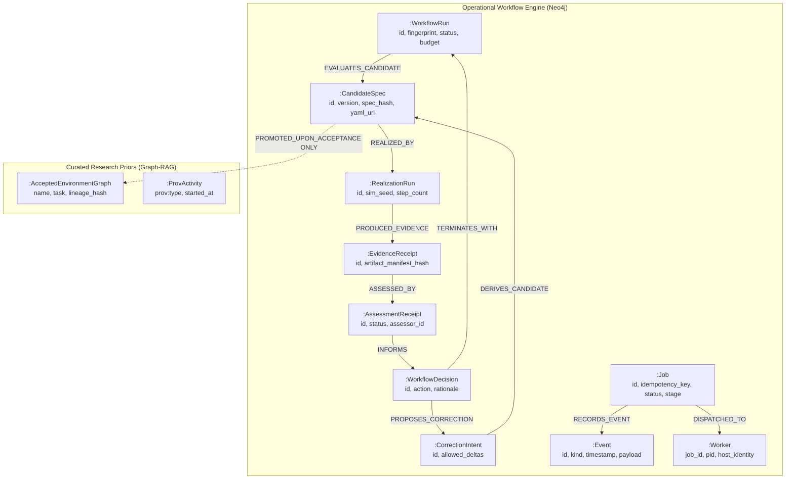
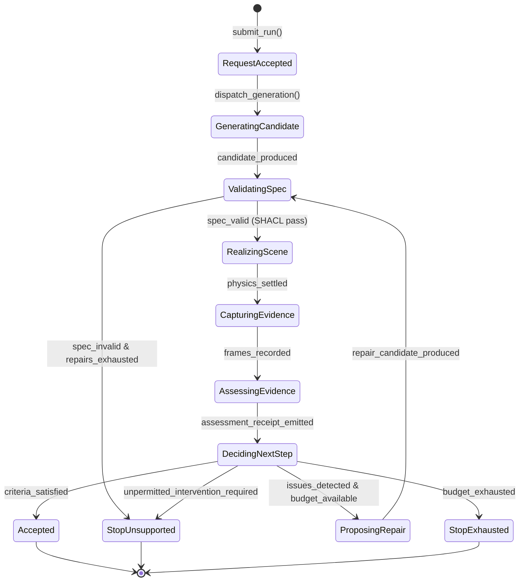

# Event Mapping Refactoring Plan 01: Application-Owned Autonomous Environment Generation & Complete Neo4j Migration

**Document Identity**: `.agents/references/plans/event-mapping-refactoring_plan_01.md`  
**Status**: PROPOSAL & ARCHITECTURAL BLUEPRINT  
**Author**: Antigravity  
**Date**: 2026-09-18  

---

## 1. Executive Summary & Architectural Directive

This plan defines the architectural transformation of the **Agentic Environment Generation** subsystem in IsaacLab-Arena. It establishes an **application-owned, bounded, autonomous workflow** that replaces external-agent improvisation (e.g., human or CLI agents reading stdout and manually selecting subsequent commands).

### The Core Architectural Mandates:
1. **Application-Owned Coordination**: The workflow orchestrator natively owns the full lifecycle:
   $$\text{Request Accepted} \longrightarrow \text{Generate} \longrightarrow \text{Validate} \longrightarrow \text{Realize \& Capture} \longrightarrow \text{Assess} \longrightarrow \text{Decide} \longrightarrow \begin{cases} \text{Accept (Criteria Met)} \\ \text{Permitted Repair \& Loop} \\ \text{Stop (Exhausted / Unsupported)} \end{cases}$$
2. **Complete Transition to Neo4j (Retiring SQLite)**:
   * **Architecturally, everything uses Neo4j.**
   * The SQLite database and file-level locking in [`isaaclab_arena/agentic_environment_generation/workbench/journal.py`](file:///workspaces/IsaacLab-Arena/isaaclab_arena/agentic_environment_generation/workbench/journal.py) must be completely migrated to Neo4j.
   * Neo4j becomes the exclusive, single source of truth for workflow identity, lifecycle states, atomic budget reservations, transition events, candidate receipts, worker registrations, and epistemic provenance.
   * Large binary and text payloads (USD stages, RGB/depth PNG frames, MP4 rollouts, and raw YAML specs) remain in immutable filesystem storage, referenced strictly by cryptographic content hashes (SHA-256).
3. **Consolidation Under Core Package**:
   * Reusable orchestration, domain models, execution workers, and engine adapters are consolidated into [`isaaclab_arena/agentic_environment_generation/`](file:///workspaces/IsaacLab-Arena/isaaclab_arena/agentic_environment_generation/).
   * Existing scripts in `isaaclab_arena_examples/` and `web_api/` are demoted to thin clients that delegate to this core subsystem.
   * Inward-only dependency rules are strictly enforced: core packages never import from `isaaclab_arena_examples` or presentation GUI layers.
4. **Separation of Operational Evidence from Research Priors**:
   * An intermediate candidate $\neq$ an accepted environment $\neq$ an eligible Graph-RAG prior.
   * Operational nodes are namespaced and labeled to prevent unverified candidate graphs or intermediate repair iterations from polluting the reusable research knowledge graph.

---

## 2. Architectural Decisions & Invariant Rules

### 2.1 Domain-Driven Design (DDD) & Event Modeling
* **Commands** express intent: `SubmitWorkflowRun`, `RealizeCandidate`, `AssessEvidence`, `ProposeCorrection`.
* **Events** record immutable domain facts: `WorkflowRunStarted`, `CandidateSpecGenerated`, `SceneRealized`, `EvidenceCaptured`, `AssessmentCompleted`, `CorrectionProposed`, `WorkflowRunAccepted`, `WorkflowRunStopped`.
* **Read Models**: Projections of historical events in Neo4j serve both the CLI query interface and the Web API / GraphQL queries. Client state caches (e.g. TanStack Query) are strictly ephemeral read-mirrors.

### 2.2 Frozen Workflow Contract
Every workflow execution accepts an immutable contract:
* **Intent**: Language prompt, target task, target embodiment.
* **Required Criteria**: Explicit physical/visual proofs (e.g. asset validity, stable support, camera visibility, task progression).
* **Preserved Constraints**: Immutable scene aspects (e.g. robot base pose, table type, relative asset layout, task threshold bounds).
* **Permitted Interventions**: Allowed spatial/geometric relaxations (e.g. bounded target-object XY translation within $\pm 0.05\,\text{m}$, rotation around Z). Physics parameters and success criteria cannot be relaxed to mask a failure.
* **Execution Configuration**: Model profile, camera resolutions, physics step budget.
* **Budget**: Maximum LLM calls, maximum simulation steps, maximum repair iterations.

### 2.3 Non-Blocking Coordinator Execution
* The coordinator executes short, deterministic decision steps.
* It **never** occupies the serial [`Supervisor`](file:///workspaces/IsaacLab-Arena/isaaclab_arena_examples/agentic_environment_generation/web_api/supervisor.py) execution slot while waiting for simulation or VLM calls.
* Long-running work is dispatched to background workers via persistent task receipts in Neo4j.

---

## 3. Domain Contracts Architecture (`workflow/contracts.py`)

The contract module contains zero dependencies on Isaac Sim, PyTorch, or Omniverse. It defines declarative data structures using Pydantic and standard library dataclasses.

```python
# Copyright (c) 2026, The Isaac Lab Arena Project Developers.
# All rights reserved.
# SPDX-License-Identifier: Apache-2.0

"""Immutable domain contracts and evidence schemas for agentic environment generation."""

from __future__ import annotations

import enum
import hashlib
import json
from dataclasses import asdict, dataclass, field
from typing import Any, Dict, List, Optional, Tuple


class CriterionType(str, enum.Enum):
    """Specific physical or visual verification criteria."""
    ASSET_INTEGRITY = "asset_integrity"
    REALIZED_PLACEMENT = "realized_placement"
    SUPPORT_STABILITY = "support_stability"
    CAMERA_VISIBILITY = "camera_visibility"
    REACHABILITY_KINEMATICS = "reachability_kinematics"
    POLICY_TASK_SUCCESS = "policy_task_success"


class AssessmentStatus(str, enum.Enum):
    """Categorical outcome of an evidence assessment."""
    SATISFACTORY = "satisfactory"
    ISSUES_DETECTED = "issues_detected"
    INCONCLUSIVE = "inconclusive"


class DecisionAction(str, enum.Enum):
    """Next authorized lifecycle action determined by the coordinator."""
    ACCEPT = "accept"
    REFINE = "refine"
    COLLECT_MORE_EVIDENCE = "collect_more_evidence"
    STOP_BUDGET_EXHAUSTED = "stop_budget_exhausted"
    STOP_UNSUPPORTED_DEFECT = "stop_unsupported_defect"
    FAIL_EXECUTION_ERROR = "fail_execution_error"


class WorkflowStatus(str, enum.Enum):
    """Lifecycle state of the entire workflow run."""
    PENDING = "pending"
    RUNNING = "running"
    ACCEPTED = "accepted"
    STOPPED = "stopped"
    FAILED = "failed"


@dataclass(frozen=True)
class PreservedConstraints:
    """Immutable scene and environment parameters that repair cannot mutate."""
    robot_embodiment: str
    base_surface_prim: str
    target_task_id: str
    fixed_object_names: Tuple[str, ...] = field(default_factory=tuple)
    forbidden_property_mutations: Tuple[str, ...] = (
        "physics_dt",
        "gravity",
        "success_threshold",
        "robot_base_pose",
        "table_surface_pose",
    )

    def validate_mutation(self, base_spec: Dict[str, Any], candidate_spec: Dict[str, Any]) -> None:
        """Ensure no preserved constraint was violated in candidate_spec."""
        assert candidate_spec.get("robot") == self.robot_embodiment, (
            f"Robot embodiment altered from {self.robot_embodiment} to {candidate_spec.get('robot')}"
        )
        for obj_name in self.fixed_object_names:
            base_pose = base_spec.get("objects", {}).get(obj_name, {}).get("position")
            cand_pose = candidate_spec.get("objects", {}).get(obj_name, {}).get("position")
            assert base_pose == cand_pose, f"Fixed object {obj_name} pose mutated: {base_pose} -> {cand_pose}"


@dataclass(frozen=True)
class PermittedInterventions:
    """Explicit geometric and topological operations the refiner is authorized to perform."""
    allow_target_xy_shift: bool = True
    max_xy_displacement_m: float = 0.08
    allow_yaw_rotation: bool = True
    allow_support_height_settle: bool = True
    allow_clutter_removal: bool = False
    forbidden_actions: Tuple[str, ...] = (
        "modify_robot_joints",
        "disable_physics_collisions",
        "modify_friction",
        "shift_table_anchor",
    )


@dataclass(frozen=True)
class WorkflowBudget:
    """Strict resource ceiling for model inference, simulation runs, and repairs."""
    max_llm_inference_calls: int = 4
    max_simulation_realizations: int = 3
    max_repair_iterations: int = 2
    max_wallclock_seconds: float = 600.0


@dataclass(frozen=True)
class WorkflowContract:
    """Frozen input contract specifying the entire intent, constraints, and budgets."""
    contract_id: str
    intent_prompt: str
    target_task_id: str
    required_criteria: Tuple[CriterionType, ...]
    preserved_constraints: PreservedConstraints
    permitted_interventions: PermittedInterventions
    budget: WorkflowBudget
    model_profile_id: str = "default_cloud_vlm"
    created_at: float = 0.0

    @property
    def fingerprint(self) -> str:
        """Deterministic SHA-256 fingerprint of the immutable input contract."""
        payload = json.dumps(asdict(self), sort_keys=True, separators=(",", ":"))
        return hashlib.sha256(payload.encode("utf-8")).hexdigest()


@dataclass(frozen=True)
class EvidenceReceipt:
    """Cryptographic and semantic receipt of simulation artifacts produced by realization."""
    evidence_id: str
    candidate_id: str
    realization_run_id: str
    settle_steps_executed: int
    camera_frame_hashes: Dict[str, List[str]]  # camera_name -> list of sha256 image hashes
    artifact_paths: Dict[str, str]  # artifact key -> local relative path
    physical_settle_verified: bool
    created_at: float


@dataclass(frozen=True)
class DetectedIssue:
    """Structured defect report produced by an assessment rubric."""
    criterion: CriterionType
    description: str
    affected_prims: Tuple[str, ...]
    severity: str  # "fatal", "warning", "info"
    suggested_remedy: Optional[str] = None


@dataclass(frozen=True)
class AssessmentReceipt:
    """Validated assessment record generated by multi-modal evaluation of evidence."""
    assessment_id: str
    evidence_id: str
    candidate_id: str
    status: AssessmentStatus
    issues: Tuple[DetectedIssue, ...]
    assessor_identity: str
    raw_response_digest: str
    created_at: float


@dataclass(frozen=True)
class DecisionReceipt:
    """Authoritative coordinator decision and rationale."""
    decision_id: str
    workflow_run_id: str
    action: DecisionAction
    candidate_id: str
    assessment_id: Optional[str]
    rationale: str
    remaining_budget: WorkflowBudget
    created_at: float
```

---

## 4. Neo4j Architectural Authority & Schema (`workflow/neo4j_store.py`)

Neo4j is the single authority for state transitions, job execution journals, workflow receipts, and lineage.

### 4.1 Labeled Property Graph (LPG) Schema Architecture



### 4.2 Cypher DDL (Constraints & Indexes)

The following constraints must be initialized on the target Neo4j instance (`neo4j-arena`):

```cypher
// 1. Workflow Runs
CREATE CONSTRAINT workflow_run_id_unique IF NOT EXISTS
FOR (w:WorkflowRun) REQUIRE w.id IS UNIQUE;

CREATE INDEX workflow_run_fingerprint IF NOT EXISTS
FOR (w:WorkflowRun) ON (w.fingerprint);

// 2. Candidate Specifications
CREATE CONSTRAINT candidate_spec_id_unique IF NOT EXISTS
FOR (c:CandidateSpec) REQUIRE c.id IS UNIQUE;

// 3. Evidence & Assessments
CREATE CONSTRAINT evidence_receipt_id_unique IF NOT EXISTS
FOR (e:EvidenceReceipt) REQUIRE e.id IS UNIQUE;

CREATE CONSTRAINT assessment_receipt_id_unique IF NOT EXISTS
FOR (a:AssessmentReceipt) REQUIRE a.id IS UNIQUE;

// 4. Job & Idempotency Key (Replacing SQLite unique constraint)
CREATE CONSTRAINT job_id_unique IF NOT EXISTS
FOR (j:Job) REQUIRE j.id IS UNIQUE;

CREATE CONSTRAINT job_workspace_idempotency_unique IF NOT EXISTS
FOR (j:Job) REQUIRE (j.workspace_id, j.idempotency_key) IS UNIQUE;

// 5. Workers & Events
CREATE CONSTRAINT worker_job_id_unique IF NOT EXISTS
FOR (w:Worker) REQUIRE w.job_id IS UNIQUE;

CREATE INDEX event_job_id IF NOT EXISTS
FOR (e:Event) ON (e.job_id);

CREATE INDEX event_created_at IF NOT EXISTS
FOR (e:Event) ON (e.created_at);
```

### 4.3 Python Store Implementation (`workflow/neo4j_store.py`)

```python
# Copyright (c) 2026, The Isaac Lab Arena Project Developers.
# All rights reserved.
# SPDX-License-Identifier: Apache-2.0

"""Authoritative Neo4j persistence store for workflow orchestration and lineage."""

from __future__ import annotations

import json
import time
from typing import Any, Dict, List, Optional
import neo4j
from isaaclab_arena.agentic_environment_generation.workflow.contracts import (
    AssessmentReceipt,
    AssessmentStatus,
    DecisionAction,
    DecisionReceipt,
    EvidenceReceipt,
    WorkflowContract,
    WorkflowStatus,
)


class Neo4jWorkflowStore:
    """Transactional Neo4j persistence manager for workflow orchestration."""

    def __init__(self, driver: neo4j.Driver):
        self._driver = driver
        self.initialize_constraints()

    def initialize_constraints(self) -> None:
        """Ensure all required LPG constraints and indexes are created."""
        ddl_statements = [
            "CREATE CONSTRAINT workflow_run_id_unique IF NOT EXISTS FOR (w:WorkflowRun) REQUIRE w.id IS UNIQUE",
            "CREATE INDEX workflow_run_fingerprint IF NOT EXISTS FOR (w:WorkflowRun) ON (w.fingerprint)",
            "CREATE CONSTRAINT candidate_spec_id_unique IF NOT EXISTS FOR (c:CandidateSpec) REQUIRE c.id IS UNIQUE",
            "CREATE CONSTRAINT evidence_receipt_id_unique IF NOT EXISTS FOR (e:EvidenceReceipt) REQUIRE e.id IS UNIQUE",
            "CREATE CONSTRAINT assessment_receipt_id_unique IF NOT EXISTS FOR (a:AssessmentReceipt) REQUIRE a.id IS UNIQUE",
            "CREATE CONSTRAINT workflow_decision_id_unique IF NOT EXISTS FOR (d:WorkflowDecision) REQUIRE d.id IS UNIQUE",
            "CREATE CONSTRAINT job_id_unique IF NOT EXISTS FOR (j:Job) REQUIRE j.id IS UNIQUE",
            "CREATE CONSTRAINT job_workspace_idempotency_unique IF NOT EXISTS FOR (j:Job) REQUIRE (j.workspace_id, j.idempotency_key) IS UNIQUE",
            "CREATE CONSTRAINT worker_job_id_unique IF NOT EXISTS FOR (w:Worker) REQUIRE w.job_id IS UNIQUE",
            "CREATE INDEX event_job_id IF NOT EXISTS FOR (e:Event) ON (e.job_id)",
        ]
        with self._driver.session() as session:
            for ddl in ddl_statements:
                session.run(ddl)

    def create_workflow_run(self, contract: WorkflowContract) -> str:
        """Initialize an immutable workflow run node with reserved budget."""
        cypher = """
        MERGE (w:WorkflowRun {id: $id})
        ON CREATE SET
            w.fingerprint = $fingerprint,
            w.intent_prompt = $intent,
            w.task_id = $task_id,
            w.status = $status,
            w.contract_json = $contract_json,
            w.remaining_llm_calls = $llm_calls,
            w.remaining_sim_realizations = $sim_runs,
            w.remaining_repairs = $repairs,
            w.created_at = $now,
            w.updated_at = $now
        RETURN w.id AS workflow_id
        """
        params = {
            "id": contract.contract_id,
            "fingerprint": contract.fingerprint,
            "intent": contract.intent_prompt,
            "task_id": contract.target_task_id,
            "status": WorkflowStatus.PENDING.value,
            "contract_json": json.dumps(contract.__dict__, default=str),
            "llm_calls": contract.budget.max_llm_inference_calls,
            "sim_runs": contract.budget.max_simulation_realizations,
            "repairs": contract.budget.max_repair_iterations,
            "now": time.time(),
        }
        with self._driver.session() as session:
            result = session.run(cypher, params)
            record = result.single()
            assert record is not None, "Failed to create workflow run in Neo4j"
            return record["workflow_id"]

    def record_candidate(
        self,
        workflow_id: str,
        candidate_id: str,
        spec_hash: str,
        spec_yaml_path: str,
        generation_index: int,
        parent_candidate_id: Optional[str] = None,
    ) -> None:
        """Record an immutable candidate specification and attach it to the workflow run."""
        cypher = """
        MATCH (w:WorkflowRun {id: $workflow_id})
        CREATE (c:CandidateSpec {
            id: $candidate_id,
            spec_hash: $spec_hash,
            yaml_path: $yaml_path,
            generation_index: $gen_idx,
            created_at: $now
        })
        CREATE (w)-[:EVALUATES_CANDIDATE {created_at: $now}]->(c)
        WITH c
        WHERE $parent_id IS NOT NULL
        MATCH (p:CandidateSpec {id: $parent_id})
        CREATE (p)-[:DERIVED_INTO]->(c)
        """
        with self._driver.session() as session:
            session.run(
                cypher,
                workflow_id=workflow_id,
                candidate_id=candidate_id,
                spec_hash=spec_hash,
                yaml_path=spec_yaml_path,
                gen_idx=generation_index,
                parent_id=parent_candidate_id,
                now=time.time(),
            )

    def record_evidence(self, evidence: EvidenceReceipt) -> None:
        """Record physical realization evidence and link to candidate."""
        cypher = """
        MATCH (c:CandidateSpec {id: $candidate_id})
        CREATE (e:EvidenceReceipt {
            id: $evidence_id,
            realization_run_id: $realization_id,
            settle_steps: $steps,
            settle_verified: $settle_verified,
            camera_manifest: $camera_manifest,
            artifact_paths: $artifact_paths,
            created_at: $now
        })
        CREATE (c)-[:PRODUCED_EVIDENCE]->(e)
        """
        with self._driver.session() as session:
            session.run(
                cypher,
                candidate_id=evidence.candidate_id,
                evidence_id=evidence.evidence_id,
                realization_id=evidence.realization_run_id,
                steps=evidence.settle_steps_executed,
                settle_verified=evidence.physical_settle_verified,
                camera_manifest=json.dumps(evidence.camera_frame_hashes),
                artifact_paths=json.dumps(evidence.artifact_paths),
                now=evidence.created_at,
            )

    def record_assessment(self, assessment: AssessmentReceipt) -> None:
        """Record multi-modal assessment receipt linked to evidence."""
        cypher = """
        MATCH (e:EvidenceReceipt {id: $evidence_id})
        CREATE (a:AssessmentReceipt {
            id: $assessment_id,
            status: $status,
            issues_json: $issues_json,
            assessor: $assessor,
            digest: $digest,
            created_at: $now
        })
        CREATE (e)-[:ASSESSED_BY]->(a)
        """
        with self._driver.session() as session:
            session.run(
                cypher,
                evidence_id=assessment.evidence_id,
                assessment_id=assessment.assessment_id,
                status=assessment.status.value,
                issues_json=json.dumps([issue.__dict__ for issue in assessment.issues]),
                assessor=assessment.assessor_identity,
                digest=assessment.raw_response_digest,
                now=assessment.created_at,
            )

    def record_atomic_decision(
        self,
        decision: DecisionReceipt,
        budget_decrement_sim: int = 0,
        budget_decrement_llm: int = 0,
        budget_decrement_repair: int = 0,
    ) -> None:
        """Record decision and atomically decrement reserved budgets."""
        cypher = """
        MATCH (w:WorkflowRun {id: $workflow_id})
        MATCH (c:CandidateSpec {id: $candidate_id})
        CREATE (d:WorkflowDecision {
            id: $decision_id,
            action: $action,
            rationale: $rationale,
            created_at: $now
        })
        CREATE (c)-[:PROMPTED_DECISION]->(d)
        SET w.remaining_sim_realizations = w.remaining_sim_realizations - $dec_sim,
            w.remaining_llm_calls = w.remaining_llm_calls - $dec_llm,
            w.remaining_repairs = w.remaining_repairs - $dec_repair,
            w.updated_at = $now
        WITH w, d
        WHERE $action IN ['accept', 'stop_budget_exhausted', 'stop_unsupported_defect', 'fail_execution_error']
        SET w.status = CASE
            WHEN $action = 'accept' THEN 'accepted'
            WHEN $action = 'fail_execution_error' THEN 'failed'
            ELSE 'stopped'
        END
        """
        with self._driver.session() as session:
            session.run(
                cypher,
                workflow_id=decision.workflow_run_id,
                candidate_id=decision.candidate_id,
                decision_id=decision.decision_id,
                action=decision.action.value,
                rationale=decision.rationale,
                dec_sim=budget_decrement_sim,
                dec_llm=budget_decrement_llm,
                dec_repair=budget_decrement_repair,
                now=decision.created_at,
            )
```

---

## 5. SQLite `journal.py` Complete Migration to Neo4j

### 5.1 Analysis of SQLite Dependencies in Existing Code
The current [`isaaclab_arena/agentic_environment_generation/workbench/journal.py`](file:///workspaces/IsaacLab-Arena/isaaclab_arena/agentic_environment_generation/workbench/journal.py) relies on SQLite for:
1. `jobs` table: Idempotency keys (`UNIQUE(workspace_id, idempotency_key)`), job statuses, stage updates.
2. `events` table: Replayable auto-incrementing journal events for streaming UI.
3. `workers` table: PID tracking and worker process cleanup.
4. `candidate_receipts`: Immutable JSON receipts protected by SQLite triggers (`receipt_no_update`, `receipt_no_delete`).
5. `metadata` table: System shutdown flags and queue pause states.

### 5.2 The Migration Strategy
We replace the entire SQLite engine with a **Neo4j-backed Journal implementation** (`Neo4jJournal`), implementing identical signatures for all external callers:
* `submit(session_id, workspace_id, kind, key, inputs, max_pending=32)`
* `step(job_id, generation=1, from_stage=None, to_stage=None)`
* `complete(job_id, result)`
* `fail(job_id, error)`
* `cancel(job_id)`
* `get(job_id)`
* `list(workspace_id=None, status=None, limit=50)`
* `events_after(job_id, cursor=0)`
* `record_worker_identity(job_id, pid, identity)`
* `cleanup_worker(job_id)`

### 5.3 Complete Neo4j Journal Implementation

```python
# Copyright (c) 2026, The Isaac Lab Arena Project Developers.
# All rights reserved.
# SPDX-License-Identifier: Apache-2.0

"""Authoritative Neo4j Journal replacing SQLite for transactional job dispatch and replayable events."""

from __future__ import annotations

import hashlib
import json
import time
import uuid
from typing import Any, Dict, List, Optional
import neo4j

MAX_RECEIPT_BYTES = 2 * 1024 * 1024  # 2 MiB bounded transport


def _json(value: Any) -> str:
    return json.dumps(value, sort_keys=True, separators=(",", ":"), allow_nan=False)


class Journal:
    """Neo4j-backed Journal managing job state machines, workers, and replayable events."""

    def __init__(self, driver: Optional[neo4j.Driver] = None, *, uri: Optional[str] = None):
        if driver is not None:
            self._driver = driver
        else:
            from isaaclab_arena.agentic_environment_generation.lpg_neo4j_sync import get_neo4j_driver
            self._driver = get_neo4j_driver(uri=uri)
        self._ensure_schema()

    def _ensure_schema(self) -> None:
        """Create necessary indexes and unique constraints in Neo4j."""
        constraints = [
            "CREATE CONSTRAINT job_id_unique IF NOT EXISTS FOR (j:Job) REQUIRE j.id IS UNIQUE",
            "CREATE CONSTRAINT job_workspace_key_unique IF NOT EXISTS FOR (j:Job) REQUIRE (j.workspace_id, j.idempotency_key) IS UNIQUE",
            "CREATE CONSTRAINT worker_job_id_unique IF NOT EXISTS FOR (w:Worker) REQUIRE w.job_id IS UNIQUE",
            "CREATE INDEX event_job_id IF NOT EXISTS FOR (e:Event) ON (e.job_id)",
            "CREATE INDEX event_sequence IF NOT EXISTS FOR (e:Event) ON (e.sequence_id)",
        ]
        with self._driver.session() as session:
            for stmt in constraints:
                session.run(stmt)

    def close(self) -> None:
        """Close driver connection."""
        self._driver.close()

    def submit(
        self,
        session_id: str,
        workspace_id: str,
        kind: str,
        key: str,
        inputs: Dict[str, Any],
        *,
        max_pending: int = 32,
    ) -> Dict[str, Any]:
        """Atomically submit job, enforcing idempotency and maximum pending queue capacity."""
        fingerprint = _json({"kind": kind, "inputs": inputs})
        now = time.time()
        job_id = uuid.uuid4().hex

        cypher = """
        // 1. Check existing job by idempotency key
        OPTIONAL MATCH (existing:Job {workspace_id: $workspace_id, idempotency_key: $key})
        WITH existing
        WHERE existing IS NOT NULL
        RETURN existing.fingerprint AS fingerprint, existing.body AS body, true AS exists

        UNION

        // 2. If not exists, check pending capacity and insert
        OPTIONAL MATCH (j:Job)
        WHERE j.status IN ['queued', 'running', 'cancel_requested', 'blocked_authorization']
        WITH count(j) AS pending_count
        WHERE pending_count < $max_pending
        CREATE (new_job:Job {
            id: $job_id,
            workspace_id: $workspace_id,
            idempotency_key: $key,
            fingerprint: $fingerprint,
            status: 'queued',
            stage: 'queued',
            created_at: $now,
            updated_at: $now,
            body: $body
        })
        CREATE (e:Event {
            job_id: $job_id,
            sequence_id: timestamp(),
            kind: 'queued',
            created_at: $now,
            body: $body
        })
        CREATE (new_job)-[:HAS_EVENT]->(e)
        RETURN new_job.fingerprint AS fingerprint, new_job.body AS body, false AS exists
        """
        job_payload = {
            "id": job_id,
            "workspace_id": workspace_id,
            "kind": kind,
            "status": "queued",
            "stage": "queued",
            "created_at": now,
            "updated_at": now,
            "inputs": inputs,
            "result": None,
            "error": None,
            "created_by_session_id": session_id,
        }

        with self._driver.session() as session:
            result = session.run(
                cypher,
                workspace_id=workspace_id,
                key=key,
                fingerprint=fingerprint,
                max_pending=max_pending,
                job_id=job_id,
                now=now,
                body=_json(job_payload),
            )
            record = result.single()
            assert record is not None, "Failed to submit job; queue capacity may be saturated"

            if record["exists"]:
                assert record["fingerprint"] == fingerprint, "Idempotency key bound to differing inputs"
                return json.loads(record["body"])

            return job_payload

    def step(self, job_id: str, *, from_stage: Optional[str] = None, to_stage: str) -> Dict[str, Any]:
        """Atomically transition job stage and emit an event."""
        now = time.time()
        cypher = """
        MATCH (j:Job {id: $job_id})
        WHERE ($from_stage IS NULL OR j.stage = $from_stage)
        SET j.stage = $to_stage,
            j.status = 'running',
            j.updated_at = $now
        WITH j
        CREATE (e:Event {
            job_id: $job_id,
            sequence_id: timestamp(),
            kind: 'stage_transition',
            stage: $to_stage,
            created_at: $now
        })
        CREATE (j)-[:HAS_EVENT]->(e)
        RETURN j.body AS body
        """
        with self._driver.session() as session:
            res = session.run(cypher, job_id=job_id, from_stage=from_stage, to_stage=to_stage, now=now)
            record = res.single()
            assert record is not None, f"Invalid stage transition for job {job_id} from {from_stage} to {to_stage}"
            data = json.loads(record["body"])
            data["stage"] = to_stage
            data["status"] = "running"
            return data

    def complete(self, job_id: str, result: Dict[str, Any]) -> None:
        """Atomically mark job as completed and record its final result."""
        now = time.time()
        cypher = """
        MATCH (j:Job {id: $job_id})
        SET j.status = 'completed',
            j.stage = 'completed',
            j.result = $result_str,
            j.updated_at = $now
        CREATE (e:Event {
            job_id: $job_id,
            sequence_id: timestamp(),
            kind: 'completed',
            created_at: $now,
            result: $result_str
        })
        CREATE (j)-[:HAS_EVENT]->(e)
        """
        with self._driver.session() as session:
            session.run(cypher, job_id=job_id, result_str=_json(result), now=now)

    def fail(self, job_id: str, error: str) -> None:
        """Atomically record failure and error message."""
        now = time.time()
        cypher = """
        MATCH (j:Job {id: $job_id})
        SET j.status = 'failed',
            j.stage = 'failed',
            j.error = $error,
            j.updated_at = $now
        CREATE (e:Event {
            job_id: $job_id,
            sequence_id: timestamp(),
            kind: 'failed',
            created_at: $now,
            error: $error
        })
        CREATE (j)-[:HAS_EVENT]->(e)
        """
        with self._driver.session() as session:
            session.run(cypher, job_id=job_id, error=error, now=now)

    def events_after(self, job_id: str, cursor: int = 0) -> List[Dict[str, Any]]:
        """Stream replayable events for a job since sequence cursor."""
        cypher = """
        MATCH (j:Job {id: $job_id})-[:HAS_EVENT]->(e:Event)
        WHERE e.sequence_id > $cursor
        RETURN e.sequence_id AS cursor, e.kind AS kind, e.created_at AS created_at, e.body AS body
        ORDER BY e.sequence_id ASC
        """
        with self._driver.session() as session:
            result = session.run(cypher, job_id=job_id, cursor=cursor)
            events = []
            for r in result:
                events.append({
                    "cursor": r["cursor"],
                    "kind": r["kind"],
                    "created_at": r["created_at"],
                    "body": json.loads(r["body"]) if r["body"] else {},
                })
            return events

    def record_worker_identity(self, job_id: str, pid: int, identity: str) -> None:
        """Record active worker process."""
        cypher = """
        MATCH (j:Job {id: $job_id})
        MERGE (w:Worker {job_id: $job_id})
        SET w.pid = $pid, w.identity = $identity, w.cleaned = 0, w.updated_at = timestamp()
        CREATE (j)-[:ASSIGNED_WORKER]->(w)
        """
        with self._driver.session() as session:
            session.run(cypher, job_id=job_id, pid=pid, identity=identity)

    def cleanup_worker(self, job_id: str) -> None:
        """Mark worker cleaned up."""
        cypher = """
        MATCH (w:Worker {job_id: $job_id})
        SET w.cleaned = 1, w.cleaned_at = timestamp()
        """
        with self._driver.session() as session:
            session.run(cypher, job_id=job_id)
```

---

## 6. Application Coordinator State Machine (`workflow/coordinator.py`)

The Coordinator governs the deterministic step-by-step evaluation loop. It is completely independent of external LLM-agent wrappers.



### Coordinator Implementation (`workflow/coordinator.py`)

```python
# Copyright (c) 2026, The Isaac Lab Arena Project Developers.
# All rights reserved.
# SPDX-License-Identifier: Apache-2.0

"""Application-owned workflow coordinator driving autonomous generation, verification, and repair."""

from __future__ import annotations

import time
import uuid
from typing import Any, Dict, Optional
from isaaclab_arena.agentic_environment_generation.workflow.contracts import (
    AssessmentReceipt,
    AssessmentStatus,
    CriterionType,
    DecisionAction,
    DecisionReceipt,
    EvidenceReceipt,
    WorkflowContract,
    WorkflowStatus,
)
from isaaclab_arena.agentic_environment_generation.workflow.neo4j_store import Neo4jWorkflowStore


class EnvironmentWorkflowCoordinator:
    """Coordinates the deterministic evaluate-assess-repair lifecycle over Neo4j."""

    def __init__(self, store: Neo4jWorkflowStore):
        self.store = store

    def evaluate_step(
        self,
        contract: WorkflowContract,
        candidate_id: str,
        evidence: EvidenceReceipt,
        assessment: AssessmentReceipt,
    ) -> DecisionReceipt:
        """Evaluate a single evidence-assessment pair against the frozen contract.
        
        Returns an authoritative DecisionReceipt without executing external side-effects.
        """
        decision_id = uuid.uuid4().hex
        now = time.time()

        # 1. Check if all required criteria are SATISFACTORY
        if assessment.status == AssessmentStatus.SATISFACTORY:
            assert len(assessment.issues) == 0, "Satisfactory assessment must contain zero issues"
            return DecisionReceipt(
                decision_id=decision_id,
                workflow_run_id=contract.contract_id,
                action=DecisionAction.ACCEPT,
                candidate_id=candidate_id,
                assessment_id=assessment.assessment_id,
                rationale="All declared criteria successfully established with physical and visual evidence.",
                remaining_budget=contract.budget,
                created_at=now,
            )

        # 2. Check if assessment was inconclusive
        if assessment.status == AssessmentStatus.INCONCLUSIVE:
            return DecisionReceipt(
                decision_id=decision_id,
                workflow_run_id=contract.contract_id,
                action=DecisionAction.STOP_UNSUPPORTED_DEFECT,
                candidate_id=candidate_id,
                assessment_id=assessment.assessment_id,
                rationale="Assessment was inconclusive; required evidence could not be reliably verified.",
                remaining_budget=contract.budget,
                created_at=now,
            )

        # 3. Assessment detected issues: verify budget
        if contract.budget.max_repair_iterations <= 0:
            return DecisionReceipt(
                decision_id=decision_id,
                workflow_run_id=contract.contract_id,
                action=DecisionAction.STOP_BUDGET_EXHAUSTED,
                candidate_id=candidate_id,
                assessment_id=assessment.assessment_id,
                rationale=f"Repair budget exhausted ({contract.budget.max_repair_iterations} remaining).",
                remaining_budget=contract.budget,
                created_at=now,
            )

        # 4. Check if detected issues require forbidden mutations
        for issue in assessment.issues:
            if issue.suggested_remedy and any(
                forbidden in issue.suggested_remedy
                for forbidden in contract.permitted_interventions.forbidden_actions
            ):
                return DecisionReceipt(
                    decision_id=decision_id,
                    workflow_run_id=contract.contract_id,
                    action=DecisionAction.STOP_UNSUPPORTED_DEFECT,
                    candidate_id=candidate_id,
                    assessment_id=assessment.assessment_id,
                    rationale=f"Issue {issue.description} requires unpermitted intervention {issue.suggested_remedy}.",
                    remaining_budget=contract.budget,
                    created_at=now,
                )

        # 5. Permitted defect with remaining budget: authorize REFINE
        return DecisionReceipt(
            decision_id=decision_id,
            workflow_run_id=contract.contract_id,
            action=DecisionAction.REFINE,
            candidate_id=candidate_id,
            assessment_id=assessment.assessment_id,
            rationale=f"Permitted issues detected ({len(assessment.issues)} issues). Authorizing repair.",
            remaining_budget=contract.budget,
            created_at=now,
        )
```

---

## 7. Computational Engine Adapters (`execution/`)

Rather than rewriting the underlying physics and inference tools, the subsystem wraps existing engines in clean execution adapters:

### 7.1 Adapter A: Evidence Capture Adapter (`execution/scene_capture.py`)
* Wraps the headless simulation builder and camera rendering.
* Executes zero-action physics settle steps (minimum 40 steps) to verify physical contact stability before capturing observation frames.
* Emits an immutable [`EvidenceReceipt`](file:///workspaces/IsaacLab-Arena/isaaclab_arena/agentic_environment_generation/trajectory_capture.py) containing SHA-256 hashes of rendered PNG frames and physics telemetry.

### 7.2 Adapter B: Assessment Adapter (`execution/scene_assessment.py`)
* Builds upon [`trajectory_assessment.py`](file:///workspaces/IsaacLab-Arena/isaaclab_arena/agentic_environment_generation/trajectory_assessment.py) and [`VisualSceneCritic`](file:///workspaces/IsaacLab-Arena/isaaclab_arena/agentic_environment_generation/visual_critic.py).
* Transmits multi-view frames to the configured VLM provider using structured JSON schema output (`status`, `issues`, `remedies`).
* Guarantees fail-safe fallback: network failures or malformed responses emit `INCONCLUSIVE` receipts, never false positive passes.

### 7.3 Adapter C: Permitted Repair Adapter (`execution/repair_adapter.py`)
* Translates `DetectedIssue` and `suggested_remedy` into structured feedback for [`refine_spec`](file:///workspaces/IsaacLab-Arena/isaaclab_arena/agentic_environment_generation/environment_generation_agent.py).
* Validates post-condition deltas: ensures the refiner only modified allowed object XY/yaw parameters and did not alter robot bases, surfaces, or task criteria.

---

## 8. DCRG Integration Boundary

* **Clear Separation of Concerns**:
  * The Scene Workflow Coordinator owns: Scene generation, placement, physical settling, visual arrangement, and camera visibility.
  * **DCRG (Dynamic Closed-Loop Refinement Gate)** owns: Measured policy-in-the-loop task optimization.
* **Handoff Contract**:
  * DCRG is **only** invoked after the environment has achieved `WorkflowStatus.ACCEPTED` from visual and physical criteria.
  * DCRG handles policy misses by adjusting target manipuland XY coordinates within the validated grasp reachability zone.
  * DCRG is never invoked to repair missing assets, floating objects, or invalid table heights.

---

## 9. Proposed Target Repository Layout & Strict Inward Dependency Rules

```text
isaaclab_arena/agentic_environment_generation/
├── environment_generation_agent.py      # Core spec inference & repair loop
├── visual_critic.py                     # VLM visual critique prompts & parsers
├── spatial_geometric_oracle.py          # Factor graph spatial solver
├── lpg_neo4j_sync.py                    # Graph-RAG Neo4j synchronizer
├── trajectory_capture.py                # Reusable multi-camera frame capture
├── trajectory_assessment.py             # Generic task-driven VLM assessor
│
├── workflow/                            # [NEW] Application Orchestration Subsystem
│   ├── __init__.py
│   ├── contracts.py                     # Immutable Pydantic/dataclass domain contracts
│   ├── coordinator.py                   # State machine & transition decisions
│   └── neo4j_store.py                   # Authoritative Neo4j persistence & transaction manager
│
├── execution/                           # [NEW] Process & Worker Execution
│   ├── __init__.py
│   ├── supervisor.py                    # Non-blocking job dispatcher
│   ├── scene_capture.py                 # Simulation realization & settle capture
│   └── repair_adapter.py                # Spec delta verification & constraint checker
│
├── interfaces/                          # [NEW] Boundary Entry Points
│   ├── __init__.py
│   ├── cli/
│   │   ├── __init__.py
│   │   └── generate_and_verify.py       # Single vertical CLI workflow command
│   └── http/
│       ├── __init__.py
│       └── routes.py                    # GraphQL/REST endpoints delegating to workflow
│
├── workbench/
│   └── journal.py                       # [MODIFIED] Re-implemented over Neo4jJournal
│
└── dcrg/                                # Existing experimental controller
```

### Dependency Guardrail Tests
An automated test (`test_import_boundaries.py`) enforces:
1. `isaaclab_arena/agentic_environment_generation/workflow/` must **never** import `isaaclab_arena_examples`, `torch`, `omni`, or `pxr`.
2. `isaaclab_arena/agentic_environment_generation/execution/` must **never** import `isaaclab_arena_examples`.
3. `isaaclab_arena_examples/` and `web/` are consumers that import `isaaclab_arena.agentic_environment_generation`, never the reverse.

---

## 10. End-to-End Vertical CLI Workflow & Verification Plan

### 10.1 The CLI Command
The entire vertical workflow is invocable through a single CLI command:
```bash
python -m isaaclab_arena.agentic_environment_generation.interfaces.cli.generate_and_verify \
  --prompt "Place a ripe banana on the plate to the left of the DROID robot on a maple table" \
  --task_id "banana_to_plate" \
  --robot "droid" \
  --max_repairs 2 \
  --output_dir "outputs/cli_verification"
```

### 10.2 Four-Scenario Verification Matrix

| Scenario | Injected Condition | Expected Flow | Expected Outcome |
| :--- | :--- | :--- | :--- |
| **1. Golden Path** | Well-separated objects, clear line of sight | Generate $\to$ Realize $\to$ Settle $\to$ Assess (SATISFACTORY) | `WorkflowStatus.ACCEPTED` on first candidate. Zero repairs consumed. |
| **2. Self-Healing** | Injected initial overlap or floating banana ($Z + 0.15\,\text{m}$) | Realize $\to$ PhysX settle shows drop $\to$ VLM detects misalignment $\to$ Permitted repair shifts pose $\to$ Re-realize $\to$ Assess | `WorkflowStatus.ACCEPTED` on candidate 2. Proven candidate derivation in Neo4j. |
| **3. Unsupported Defect** | Requested object clipping through robot base mounting plate | Realize $\to$ VLM detects base collision $\to$ Repair requires modifying robot base (forbidden) | `WorkflowStatus.STOPPED` with `STOP_UNSUPPORTED_DEFECT`. Truthful terminal receipt. |
| **4. Crash & Resume** | Process killed (`SIGKILL`) after EvidenceCapture | Rerun same CLI with identical contract fingerprint | Coordinator detects existing `EvidenceReceipt` in Neo4j, skips duplicate simulation, resumes at `AssessingEvidence`. |

---

## 11. Phased Execution Roadmap

1. **Phase 1: Contracts & Neo4j Store**
   * Implement `workflow/contracts.py` with 100% unit test coverage.
   * Implement `workflow/neo4j_store.py` against running `neo4j-arena` container.
2. **Phase 2: Journal Migration**
   * Replace SQLite implementation in `workbench/journal.py` with `Neo4jJournal`.
   * Run existing workbench test suite to prove full backwards compatibility.
3. **Phase 3: Execution Adapters & Coordinator**
   * Implement `execution/scene_capture.py` and `workflow/coordinator.py`.
   * Implement `interfaces/cli/generate_and_verify.py`.
   * Execute Scenarios 1–4 under synthetic/mocked environments.
4. **Phase 4: Real Hardware/PhysX Validation & Dashboard Exposure**
   * Run full vertical CLI test on GPU container with PhysX and cloud VLM.
   * Expose the unified workflow in the TanStack GraphQL dashboard (`web/arena-workbench`).
