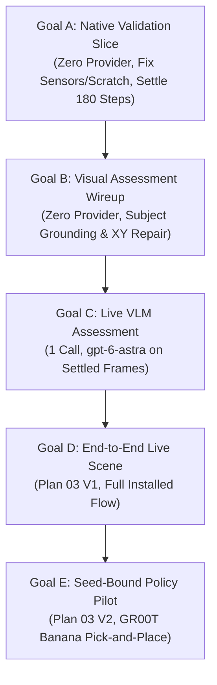

# Plan 04 Operational Synthesis, Empirical Baseline & Phased Execution Roadmap

**Document Identity**: `.agents/references/plans/event_mapping/event-mapping-plan04-operational-synthesis.md`  
**Parent Document**: [`event-mapping-refactoring_plan_04.md`](file:///workspaces/IsaacLab-Arena/.agents/references/plans/event_mapping/event-mapping-refactoring_plan_04.md)  
**Creation Date**: 2026-09-25 UTC  
**Status**: Authoritative synthesis of live execution results, operator corrections, and the complete phased operational roadmap for Plan 04.

---

## 1. Executive Summary & Context

This synthesis captures the empirical baseline, key architecture breakthroughs, low-level platform seam discoveries, and the concrete 5-stage roadmap required to bring Plan 04 to completion.

### Directory Architecture & Plan Organization
The plans directory has been structured into dedicated domain categories:
- [`event_mapping/`](file:///workspaces/IsaacLab-Arena/.agents/references/plans/event_mapping): Execution owner, workflow lifecycle, and event mapping refactoring.
- [`dashboard_cli_workflow_parity/`](file:///workspaces/IsaacLab-Arena/.agents/references/plans/dashboard_cli_workflow_parity): CLI and Web API parity, contracts, and handoffs.
- [`g1_manipulation_and_policy/`](file:///workspaces/IsaacLab-Arena/.agents/references/plans/g1_manipulation_and_policy): Unitree G1 humanoid manipulation, monocular camera pitch, and policy transfer.
- [`spatial_reasoning_and_vision/`](file:///workspaces/IsaacLab-Arena/.agents/references/plans/spatial_reasoning_and_vision): DA3 spatial forcing, metric alignment, and closed-loop VLM inspection.
- [`dcrg_and_grasp_transfer/`](file:///workspaces/IsaacLab-Arena/.agents/references/plans/dcrg_and_grasp_transfer): Dynamic Causal Reasoning Graph, telemetry, and calibrated grasp protocols.
- [`workbench_and_ui/`](file:///workspaces/IsaacLab-Arena/.agents/references/plans/workbench_and_ui): TanStack Query/Router agentic workbench, graph explorer, and localhost sessions.
- [`infrastructure_and_automation/`](file:///workspaces/IsaacLab-Arena/.agents/references/plans/infrastructure_and_automation): Devcontainer tooling and self-healing evaluation flywheels.

---

## 2. Documented Empirical Checkpoints

### Checkpoint 1 — Bounded Live Generation & Standalone Realization (2026-09-24)
- **Live LLM Call**: Explicit operator approval authorized one live `gpt-6-astra` generation request through the Hermes OpenAI profile (`max_calls=1`). Received HTTP 200, consumed 11,874 reported tokens, and generated valid candidate JSON:
  - Location: [`candidate.json`](file:///workspaces/IsaacLab-Arena/outputs/workflow/plan04-implementation/milestone1/realize-20260924T232748Z/candidate.json)
  - SHA-256: `8dcd08b813236ee0ccdcad1024594a70301d4a6fdcd0af41d013e05f5135a7e8`
- **Native Simulation**: Executed in the local clone's Isaac Lab container (`isaaclab_arena-latest`) on NVIDIA RTX PRO 6000 Blackwell (SM 12.0). Ran 120 PhysX control steps ($0.6\text{s}$) and rendered 3 camera PNGs (`wrist_camera_rgb`, `external_camera_rgb`, `external_camera_2_rgb`).
- **Settling Evaluation**: Rejected under strict $0.001\text{ rad/s}$ angular ceiling. At step 117, the block experienced micro-vibration resulting in angular speed $0.001715\text{ rad/s} > 0.001\text{ rad/s}$ (only 3 consecutive steps settled at cutoff instead of 5).
- **Persistence**: Fresh namespace `milestone1_live_20260924t232748z_r2` retained in Neo4j with `converged=false` and `verified=false`.

### Checkpoint 2 — Installed Zero-Provider Native-Validation Slice (2026-09-25)
- **Architecture**: Implemented [`installed_native.py`](file:///workspaces/IsaacLab-Arena/isaaclab_arena/agentic_environment_generation/workflow/api/installed_native.py) (`MODE = "retained-native-validation-v1"`), registered in GraphQL schema mutations and wired to `ExecutionOwner` and `native_scene_worker.py`.
- **Budget**: Exactly 0 provider/model tokens spent ($0 cost). Consumed 3/3 authorized native launches under a 600s watchdog.
- **Three Concrete Execution Attempts**:
  1. **Attempt 1 (`-a1`)**: Cancelled. Uncovered two platform seams:
     - `neo4j_store.py:3860`: Native-only intents lacked earlier generation attempt nodes; cancellation query with `OPTIONAL MATCH` failed reconciliation.
     - `owned_process_group.py:110`: Subshell process namespace mismatch between Docker container and host triggered `CleanupUnknown`.
     - *Both issues were diagnosed and patched.*
  2. **Attempt 2 (`-a2`)**: Pre-construction failure. Native adapter compared raw candidate JSON string against normalized `ArenaEnvGraphSpec` (Pydantic schema defaults caused string divergence).
     - *Patched in `native_capture.py` and `scene_observation.py` to compare canonical digests.*
  3. **Attempt 3 (`-a3`)**: Passed spec admission and initialized Isaac Sim into `InteractiveScene` environment construction, but failed with `ValueError` inside rigid object construction at `schemas.activate_contact_sensors` (line 720) before settling steps or camera frames could execute.
- **Persistence & Readback**: Fresh HTTP result and Neo4j queries verified that attempt 3 is cancelled, 0 model tokens were spent, and `native_settled=false`, `converged=false`, and `verified=false` were preserved on the root and all three linked attempts.
- **Artifact Readback Defect Identified**: The native worker created temporary scratch `native-capture-work` directly inside the sealed artifact root (`ArtifactArea.open`), returning `QueryFailure UNKNOWN` on fresh candidate HTTP reads. Scratch output must be separated from sealed artifact storage.

---

## 3. The Four Operator Corrections & Foundational Invariants

### Correction 1: Settling Time as an Empirical Test
Extending settling time (from 120 steps to 180 control steps, $+1.2\text{s}$) is an empirical experiment to allow contact energy dissipation, not a mathematical guarantee of convergence. Rigid body contact in PhysX exhibits non-monotonic micro-chatter around velocity thresholds.

### Correction 2: Standard vs. Approved Policy
The $0.01\text{ rad/s}$ angular velocity ceiling (alongside the strict $< 0.001\text{ m/s}$ linear bound) is an **operator-approved revised settling criterion**, not an established universal physics calibration.

### Correction 3: Decoupling of Validation Flags (GraphRAG Protection)
Passing native settling (`native_settled=true`) must **never** automatically promote `converged=true` or `verified=true`.
- `native_settled`: Confirms physical stability and non-interfering rest poses under PhysX.
- `converged`: Confirms generator spatial constraint satisfaction across prompt relations.
- `verified`: Confirms task policy execution and goal predicate achievement.
Promoting `converged` or `verified` from settling alone corrupts GraphRAG prior retrieval (`_STRUCTURAL_PRIORS_QUERY` in `graph_rag.py:80–86`).

### Correction 4: Application Ownership Requirement
Standalone ad-hoc script execution (`docker exec python.sh -c "..."`) does not validate the platform. The installed application (`ExecutionOwner` $\to$ coordinator $\to$ `native_scene_worker.py` $\to$ GraphQL) must own all transitions, persistence, and cleanup.

---

## 4. Active Blockers to Resolve for Native Validation

1. **`G04-14`: Rigid Object Contact Sensor Activation**:
   - Location: `InteractiveScene` rigid object construction $\to$ `schemas.activate_contact_sensors` (line 720).
   - Root Cause: Rigid object constructor failed when binding contact sensors for `red_block` and `blue_bin`. The exact prim path or sensor registration mapping must be reconciled with the realized environment graph.
2. **`G04-15`: Native Temporary Scratch Separation**:
   - Location: `native_capture.py` / `native_scene_worker.py`.
   - Root Cause: Worker wrote temporary directory `native-capture-work` inside the sealed artifact root.
   - Solution: Direct scratch output to `/tmp` or an unsealed staging path outside `ArtifactArea`.

---

## 5. Operational Phased Roadmap: Goals A through E



```text
┌────────────────────────────────────────────────────────────────────────┐
│                    Goal A: Native Validation Slice                     │
│         (Zero Provider, Fix Sensors/Scratch, Settle 180 Steps)         │
└───────────────────────────────────┬────────────────────────────────────┘
                                    │
                                    ▼
┌────────────────────────────────────────────────────────────────────────┐
│                  Goal B: Visual Assessment Wireup                      │
│        (Zero Provider, Subject Grounding & Bounded XY Repair)          │
└───────────────────────────────────┬────────────────────────────────────┘
                                    │
                                    ▼
┌────────────────────────────────────────────────────────────────────────┐
│                      Goal C: Live VLM Assessment                       │
│                (1 Call, gpt-6-astra on Settled Frames)                 │
└───────────────────────────────────┬────────────────────────────────────┘
                                    │
                                    ▼
┌────────────────────────────────────────────────────────────────────────┐
│                     Goal D: End-to-End Live Scene                      │
│                   (Plan 03 V1, Full Installed Flow)                    │
└───────────────────────────────────┬────────────────────────────────────┘
                                    │
                                    ▼
┌────────────────────────────────────────────────────────────────────────┐
│                    Goal E: Seed-Bound Policy Pilot                     │
│               (Plan 03 V2, GR00T Banana Pick-and-Place)                │
└────────────────────────────────────────────────────────────────────────┘
```

### Goal A: Zero-Provider Native-Validation Slice through Installed Workflow (Active)
- **Objective**: Fix contact sensor activation and scratch separation, execute 180 PhysX steps on the retained candidate, produce 3 camera PNGs, and achieve fresh GraphQL readback.
- **Exact Candidate SHA-256**: `8dcd08b813236ee0ccdcad1024594a70301d4a6fdcd0af41d013e05f5135a7e8`
- **Budget**: 0 provider tokens ($0 cost), max 3 native launches, 600s watchdog.
- **Frozen Policy**: 180 steps, angular norm $< 0.01\text{ rad/s}$, linear norm $< 0.001\text{ m/s}$ for final 5 consecutive steps, seeds 42/42.
- **Success Criteria**: 180 control steps completed, 3 fresh camera PNGs rendered, fresh-client HTTP readback passes, Neo4j updated (`native_settled=true`, `converged=false`, `verified=false`).

### Goal B: Visual Assessment Subject Grounding & Bounded XY Repair Wireup
- **Objective**: Implement opaque-to-prim grounding (`CandidateBinding`) and bounded XY-displacement refiner without model tokens.
- **Constraints**: Zero live LLM/VLM tokens.
- **Success Criteria**: Wire assessment prompt serializer, verify spatial grounding dictionary, test bounded XY refiner clamp logic with synthetic fixtures.

### Goal C: Single Live VLM Visual Assessment on Settled Frames
- **Objective**: Execute exactly one live VLM visual critique call on the verified camera frames produced in Goal A.
- **Constraints**: Exactly 1 provider request (`gpt-6-astra`), cost ceiling $\le \$0.10$, 0 native launches.
- **Success Criteria**: Visual critic returns structured assessment JSON; verdict is persisted to Neo4j without altering physics flags.

### Goal D: End-to-End Live Scene Generation & Acceptance (Plan 03 V1)
- **Objective**: Complete a fully autonomous live scene generation run through the installed GraphQL interface.
- **Constraints**: Max 1 generation call, max 1 repair call (if needed), max 1 VLM assessment call, max 2 native launches.
- **Success Criteria**: Entire sequence (prompt $\to$ generation $\to$ native settling $\to$ VLM assessment $\to$ accepted scene) executes autonomously.

### Goal E: Seed-Bound GR00T Policy Evaluation Pilot (Plan 03 V2)
- **Objective**: Evaluate the A2 table/plate/banana pick-and-place task across two predeclared seeds using the live GR00T policy service.
- **Task Instruction**: *"Grasp the yellow banana from the right side of the table and set it onto the white ceramic plate on the left."*
- **Constraints**: Max 2 policy rollout episodes, zero cloud generation tokens.
- **Success Criteria**: Completed episode trajectories, grounded predicate evaluations, truthful task success/failure reporting.

---

## 6. Anti-Dopamine Invariants & Investigation Budgets

1. **Mock Test Proliferation Ban**:
   Agents are strictly forbidden from creating mock test files or expanding synthetic test matrices to simulate progress. The only acceptable proof of software progress is execution against the installed application stack and actual container boundaries.
2. **Three-Strike Defect Limit**:
   If a single defect encounters three unsuccessful correction attempts, execution must halt immediately and produce a diagnostic report.
3. **Investigation Ceilings**:
   Any new architectural blocker is capped at:
   - Maximum 2 hypothesis/challenge rounds.
   - Maximum 3 isolated diagnostic invocations.
   - Maximum 60 minutes of active investigation wall time.
4. **Honest Stop Conditions**:
   When an allocation is exhausted or an unexpected error occurs, the agent must stop, log the exact failure, preserve diagnostics, and report the blocker rather than manufacturing artificial success.
