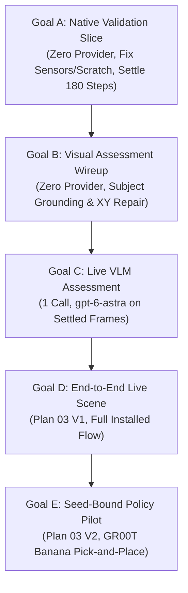

# Event Mapping Refactoring Plan 04: Close the Live-Execution Gaps and Validate the Research Workflow

Status: Implementation in progress; the scoped P04-I01 native-only slice is verified, not the complete Plan 04 workflow. Creating or approving this document is not permission to use live credentials, write production Neo4j, start/recreate containers, or run GPU/provider workloads. Each effectful gate requires bounded authorization.

Implementation work packages and goal prompts: [Plan 04 implementation index](../plan04_implementation/README.md). [P04-I01 — Native integration defects and bounded revalidation](../plan04_implementation/01-native-integration-defects.md) is verified after operator-authorized execution; both additional launches are consumed. Saving or reopening a plan grants no new allocation.

---

## Executive Operational Checkpoints

### Latest Installed Native Checkpoint — 2026-09-25 (P04-I01 VERIFIED, native-only)

- **Integration:** authenticated `p04-i01-native-a5`, run `fcc052f890be2d208783f04453d184f7d2455afe948aa8607e92a5a87d79ea48`, reached `accepted`; the application owned native capture, numeric assessment, retention and cleanup, with no manually launched next stage.
- **Native science:** 180 actual control steps; strict final samples 176–180 pass for both objects. Actual seeds 42/42, simulation dt 0.005 s, decimation 4/control dt 0.020 s, one initial placement reset and no extra capture steps. Three fresh cameras share the same cohort. This is the operator-approved revised policy, not calibration.
- **Recovery/cleanup:** fresh authenticated candidate/evidence/PNG bytes match declared hashes; completed-operation replay preserves result/receipt and releases no worker. Registered PIDs are absent, no live owned members remain, owner epoch 5 is retired, and the API is stopped/drained. Dead zombie entries are not reported as vanished PIDs.
- **Accounting/flags:** prior 3/3 plus additional 2/2 native launches consumed; zero remain. a4 remains failed. Only a5 has `native_settled=true`; original failed graph/attempt outcomes and sealed bytes remain unchanged, with convergence/verification/prior eligibility unpromoted. Zero Arena provider calls or policy execution; development-agent inference is separate.
- **Source/evidence:** baseline `8d557315cc056e83e531727274a12bd5705af42e`, uncommitted scoped changes, 210-source manifest unchanged through parent closeout. [Result](../../../../outputs/workflow/plan04-implementation/milestone1/installed-native-20260925T012042Z/p04-i01/LIVE_RESULT.txt), [source](../../../../outputs/workflow/plan04-implementation/milestone1/installed-native-20260925T012042Z/p04-i01/source-a5.json), [critic ACCEPT](../../../../outputs/workflow/plan04-implementation/milestone1/installed-native-20260925T012042Z/p04-i01/critic-final.json), [parent closure](../../../../outputs/workflow/plan04-implementation/milestone1/installed-native-20260925T012042Z/p04-i01/parent-closeout.json).
- **Limits:** the default cache's permissions also changed before a5, actor unknown; do not infer an unchanged shared cache or sole-cause proof. Per-run records are preserved, while aggregate inspection hashes incorporate the advancing global owner. Remaining scene/visual/general-validation gates and later policy work are not certified; neither full Milestone 1 nor Plan 04 is complete.

### Historical Installed Native Checkpoint — 2026-09-25 (BLOCKED on Constructor & Scratch Seams)
The operator-authorized zero-provider retained-candidate slice consumed **3/3 native launches** through the authenticated installed application, `ExecutionOwner`, and owned native worker (`native_scene_worker.py`). No further native execution is authorized under that allocation.
- **Mode**: Explicit `retained-native-validation-v1` in [`installed_native.py`](file:///workspaces/IsaacLab-Arena/isaaclab_arena/agentic_environment_generation/workflow/api/installed_native.py) preserving synthetic guards and reusing the exact original candidate [`candidate.json`](file:///workspaces/IsaacLab-Arena/outputs/workflow/plan04-implementation/milestone1/realize-20260924T232748Z/candidate.json) (SHA-256: `8dcd08b813236ee0ccdcad1024594a70301d4a6fdcd0af41d013e05f5135a7e8`).
- **Settling Policy**: Frozen at 180 control steps (requested control timestep $0.020\text{s}$ from simulation dt $0.005\text{s}$ and decimation 4, hence $3.600\text{s}$ if all steps execute), final 5 consecutive samples, angular norm $< 0.01\text{ rad/s}$, linear norm $< 0.001\text{ m/s}$ for both `red_block` and `blue_bin`, seeds 42/42. The constructor failure did not reach verification of realized timestep/reset behavior.
- **Attempt 1 (`-a1`)**: Cancelled. Exposed a Neo4j intent reconciliation defect for native-only intents lacking earlier generation attempt records (`neo4j_store.py:3860`), and a container subshell process-namespace mismatch in `owned_process_group.py:110` causing `CleanupUnknown`. Both were patched.
- **Attempt 2 (`-a2`)**: Diagnostic `ValueError` at `native_capture._check_spec`. Raw candidate JSON string comparison failed against the schema-normalized `ArenaEnvGraphSpec`. Fixed by revalidating canonical Pydantic model digests.
- **Attempt 3 (`-a3`)**: Passed spec admission and booted Isaac Sim into `InteractiveScene` environment construction, but failed with `ValueError` inside rigid object construction at `schemas.activate_contact_sensors` (line 720) before settling samples or camera frames could execute.
- **Integrity & Persistence**: 0 provider tokens spent ($0 cost). Fresh HTTP result and Neo4j readback verify failed/cancelled outcomes, no fourth release, zero new provider calls, and unchanged `native_settled=false`, `converged=false`, and `verified=false` on root and attempts. All owned native process groups cleanly drained.
- **Artifact Readback Defect**: The native worker created temporary scratch `native-capture-work` directly inside the sealed artifact root (`ArtifactArea.open`), returning `QueryFailure UNKNOWN` on fresh candidate HTTP reads. Temporary scratch must be separated from sealed artifact storage.
- **Evidence**: [`LIVE_RESULT.txt`](file:///workspaces/IsaacLab-Arena/outputs/workflow/plan04-implementation/milestone1/installed-native-20260925T012042Z/LIVE_RESULT.txt) and [`research-stack-implementation-handoff.md`](file:///workspaces/IsaacLab-Arena/.agents/references/plans/dashboard_cli_workflow_parity/research-stack-implementation-handoff.md).

### Bounded Live Milestone 1 Generation & Realization Checkpoint — 2026-09-24
Explicit operator approval enabled one real `gpt-6-astra` generation request through the active Hermes profile (`max_calls=1`), followed by standalone native realization.
- **Generation**: HTTP 200, 11,874 reported tokens. Produced canonical candidate `outputs/workflow/plan04-implementation/milestone1/realize-20260924T232748Z/candidate.json`.
- **Physical Realization**: Ran in real Isaac Lab container on NVIDIA RTX PRO 6000 Blackwell (SM 12.0). Executed 120 PhysX control steps and rendered 3 camera PNGs.
- **Settling Verdict**: Rejected under strict $0.001\text{ rad/s}$ angular ceiling because step 117 had an angular excursion to $0.001715\text{ rad/s}$ (only 3 consecutive steps settled at cutoff instead of 5).
- **Persistence**: Fresh namespace `milestone1_live_20260924t232748z_r2` retained with `converged=false`, `verified=false`, and verified artifact hashes.

---

## 1. Goal and Definition of Success

Deliver a usable, application-owned, GraphQL-submitted research workflow using the actual approved Neo4j deployment, IsaacLab-Arena runtime, and Isaac-GR00T policy service. Prove the application invokes existing tools and owns stage transitions without an agent manually issuing each next phase.

The delivery path is:
$$\text{authenticated submission} \to \text{exact retained priors} \to \text{generation} \to \text{schema validation} \to \text{owned native realization/settling/capture} \to \text{retained numeric + visual assessment} \to \text{permitted repair} \to \text{scene disposition} \to \text{task-bound policy evaluation} \to \text{retained result} \to \text{fresh-client causal readback}$$

### The Four Operator Corrections & Invariants

1. **Settling Time as an Empirical Experiment**:
   Extending settling time (e.g., to 180 control steps, $+1.2\text{s}$) is an empirical experiment to allow contact energy dissipation, not a mathematical guarantee of convergence. Rigid body contact in PhysX exhibits non-monotonic micro-chatter around velocity thresholds.
2. **Standard vs. Approved Policy**:
   The $0.01\text{ rad/s}$ angular velocity ceiling (alongside the strict $< 0.001\text{ m/s}$ linear bound) is an **operator-approved revised settling criterion**, not an established universal physics calibration.
3. **Strict Decoupling of Validation Flags (GraphRAG Integrity)**:
   Passing native settling (`native_settled=true`) must **never** automatically promote `converged=true` or `verified=true`.
   - `native_settled`: Confirms physical stability and non-interfering rest poses under PhysX.
   - `converged`: Confirms generator spatial constraint satisfaction across prompt relations.
   - `verified`: Confirms task policy execution and goal predicate achievement.
   Promoting `converged` or `verified` from settling alone corrupts GraphRAG prior retrieval (`_STRUCTURAL_PRIORS_QUERY` in `graph_rag.py:80–86`).
4. **Application Ownership Requirement**:
   Standalone ad-hoc script execution (`docker exec python.sh -c "..."`) does not validate the platform. The installed application (`ExecutionOwner` $\to$ coordinator $\to$ `native_scene_worker.py` $\to$ GraphQL) must own all transitions, persistence, and cleanup.

### Four Distinct Verdicts
1. **Software Integration**: Installed interfaces drive declared adapters, persist exact identities, and return truthful results without throwaway glue scripts.
2. **Operational Safety**: Authorization, cumulative resource/cost ceilings, process cleanup, and production-data boundaries hold as declared.
3. **Scientific/Task Result**: Scene validity and measured task success/failure for every predeclared trial.
4. **Release Decision**: Whether evidence is sufficient to advance to frontend integration. Passing isolated tests or explaining a failure does not constitute A2 validation.

---

## 2. Reconcile Progress Before Implementing

### 2.1 Evidence-Supported Baseline
- **Provider Bounds**: 8/8 tests in `test_workflow_provider_bounds.py` remain clean and passing.
- **Scene Producers & Trajectory Assessment**: 269 passed, 1 failed (`test_foreground_split_service_keeps_owner_and_cleans_before_model`).
- **Core Package Regressions**: 1,550 test-case occurrences across 11 cohorts validated under isolated harnesses.
- **Linter & Code Style**: Flake8 `C901` cyclomatic complexity on `workflow/cli.py::_run_installed` refactored and bounded.

### 2.2 Reconciling Empirical Realities
| Historical Assumption | Empirical Evidence & Plan 04 Correction |
| :--- | :--- |
| Simulation settling is monotonically damped | PhysX contact solver exhibits intermittent micro-vibration. Bounded time extension (180 steps) is an empirical test. |
| Settling establishes scene convergence | Decoupled: `native_settled` tracks physics only; `converged` and `verified` remain false until their respective evaluators pass. |
| Standalone script execution proves workflow readiness | Rejected: Workflow execution must be owned by the installed ASGI server, GraphQL mutations, and `ExecutionOwner`. |
| Sealed artifact store permits arbitrary worker subdirectories | `ArtifactArea.open` strictly enforces `marker/staging/final`. Subdirectories like `native-capture-work` cause HTTP query failure. |

---

## 3. Gap Register and Smallest Intended Corrections

| ID | Boundary / Evidence | Required Correction or Runtime Proof | Gate | Status |
| :--- | :--- | :--- | :--- | :--- |
| **G04-01** | `api/installed_config.py` admitted only query-only mode | Implemented versioned execution composition (`installed_native.py`) and GraphQL/CLI adapters (`retained-native-validation-v1`). | P1 | **Closed** |
| **G04-02** | Query-server lifetime was not an execution-owner proof | Wired `ExecutionOwner` to supervise native workers, handle cancel/resume, and reconcile owned process groups. | P1 | **Closed** |
| **G04-03** | `policy_evaluation.py` requires trusted runtime ports | Concrete policy worker and runtime/task/checkpoint adapters. Reuse `rollout_policy` with exact intent/deadlines. | P2 | Open |
| **G04-04** | Receipts said `native-unverified` | Real Isaac Lab container execution on RTX PRO 6000 Blackwell; 120 steps executed, 3 camera PNGs rendered. | P3 | **Verified** |
| **G04-05** | Single-reset capture vs. post-reset policy hooks | Re-establish state-dependent prerequisites for every policy reset with fresh IDs/evidence and charged steps. | P2/P3 | Open |
| **G04-06** | GPU memory co-residency (Isaac Sim + GR00T) | Establish co-residency topology on Blackwell GPU with explicit VRAM headroom accounting. | P0/P3 | Open |
| **G04-07** | Prior snapshots & managed-prior migration | Freeze retrieval selection in accepted requests and recover exact retained prior references before new retrieval. | P1/P4 | Open |
| **G04-08** | Provider price bounds & model profile routing | Pinned `gpt-6-astra` routing; 11,874 tokens consumed in Milestone 1 under approved ceiling. | P1/P4 | **Verified** |
| **G04-09** | Production Neo4j safety & scope binding | Dedicated operational scope `milestone1_live_20260924t232748z_r2` with Basic auth and verified noninterference. | P0/P4 | **Verified** |
| **G04-10** | Synthetic native transport vs. Kit process-group cleanup | Fixed `owned_process_group.py:110` container PID mapping and verified zero leaked processes upon exit. | P2/P3 | **Closed** |
| **G04-11** | A2 PickAndPlace live manipulation | Pinned GR00T weights/serializer and operational PickAndPlace evaluator on table/plate/banana. | P3/P5 | Open |
| **G04-12** | Installed GraphQL readback of typed candidate bytes | Fresh-client readback verified for candidate metadata; blocked on artifact-root layout defect. | P1/P6 | In Progress |
| **G04-13** | Descriptive catalogue imported heavy runtime | Scoped adapter contract binds only consumed vocabulary and content digest without eager simulator discovery. | P1 | **Closed** |
| **G04-14** | `schemas.activate_contact_sensors` (line 720) failed in rigid object construction | Diagnose rigid object sensor naming/prim-path registration during `build_native_environment` for `red_block` and `blue_bin`. | P1/P3 | **Active Blocker** |
| **G04-15** | `native-capture-work` leaked into sealed artifact root | Separate temporary native worker scratch space (`/tmp` or dedicated scratch directory) from immutable artifact area. | P1/P6 | **Active Blocker** |

---

## 4. Authorization, Secrets, and Production Boundaries

### 4.1 Bounded Campaign Approval Envelope
- Every effectful live run requires an explicit, operator-approved envelope detailing:
  - Exact candidate SHA-256 and contract digest.
  - Frozen physics settling parameters (steps, thresholds, consecutive window).
  - Maximum native launches (default: 3) and per-launch watchdog (600s).
  - Cost ceiling ($0.00 for zero-provider slices, explicit token/USD caps for VLM/generation).
  - Pinned Neo4j deployment and workspace bindings.

### 4.2 Production Neo4j Safety
- **Scoped Writes**: Operational writes are restricted to explicit run/attempt scopes (e.g., `milestone1_live_20260924t232748z_r2`).
- **GraphRAG Prior Protection**: Structural prior queries filter on `n.converged = true`. Native settling alone must never set `converged=true` or `verified=true`.
- **Durable Replay**: Replaying the same completed operation must return its retained result without launching a new simulator process.

### 4.3 Container & GPU Discipline
- **Devcontainer Execution**: Code touches Isaac Sim exclusively inside `isaaclab_arena-latest` as the host non-root user via `/isaac-sim/python.sh`.
- **Process Group Tracking**: Workers register their process group under `owned_process_group.py`; API drain ensures zero orphan zombies.

---

## 5. Work Packages and Stop/Go Sequence

### P0 — Reconcile, Review and Freeze Campaign (No Live Effects)
- Generate setup-and-readiness report; verify dependencies, database credentials, and container mappings offline.

### P1 — Joined Installed Application Boundary & Native Settling
- Execute the zero-provider retained-candidate validation slice through the installed GraphQL API.
- Resolve G04-14 (`activate_contact_sensors`) and G04-15 (scratch separation).
- Achieve verified native settling, 3 camera PNGs, and clean fresh-client HTTP readback.

### P2 — Concrete Native/Policy Composition & Lifecycle Rehearsal
- Wire owned policy child around `run_managed_policy` with genuine process supervisor lifecycle.
- Rehearse cancel, timeout, receipt corruption, and GPU release before model execution.

### P3 — Bounded Fixed-Candidate Native & Policy Calibration
- Calibrate visible/occluded target examples under the frozen image transform.
- Verify GR00T instance readiness, action serialization, and joint mappings without live rollouts.

### P4 — First Complete Live Scene Workflow (Plan 03 V1)
- Single installed GraphQL submission: prompt $\to$ generation $\to$ native settling $\to$ visual assessment $\to$ bounded repair (if needed) $\to$ accepted scene.

### P5 — Required-Policy A2 Pilot (Plan 03 V2)
- Reference task: *"Grasp the yellow banana from the right side of the table and set it onto the white ceramic plate on the left."*
- Execute across two predeclared seeds with fresh reset prerequisites and episode evaluation.

### P6 — Independent Readback, Reconciliation and Handoff
- Fresh-client causal reconstruction of entire lineage: command $\to$ priors $\to$ candidate $\to$ measurements $\to$ assessment $\to$ policy trials $\to$ cleanup.

---

## 6. Operational Phased Roadmap: Goals A through E

To eliminate the "Synthetic Dopamine Loop" and ensure disciplined execution, the remaining work is divided into five strictly bounded, sequentially gated goals.



```text
┌────────────────────────────────────────────────────────────────────────┐
│                    Goal A: Native Validation Slice                     │
│         (Zero Provider, Fix Sensors/Scratch, Settle 180 Steps)         │
└───────────────────────────────────┬────────────────────────────────────┘
                                    │
                                    ▼
┌────────────────────────────────────────────────────────────────────────┐
│                  Goal B: Visual Assessment Wireup                      │
│        (Zero Provider, Subject Grounding & Bounded XY Repair)          │
└───────────────────────────────────┬────────────────────────────────────┘
                                    │
                                    ▼
┌────────────────────────────────────────────────────────────────────────┐
│                      Goal C: Live VLM Assessment                       │
│                (1 Call, gpt-6-astra on Settled Frames)                 │
└───────────────────────────────────┬────────────────────────────────────┘
                                    │
                                    ▼
┌────────────────────────────────────────────────────────────────────────┐
│                     Goal D: End-to-End Live Scene                      │
│                   (Plan 03 V1, Full Installed Flow)                    │
└───────────────────────────────────┬────────────────────────────────────┘
                                    │
                                    ▼
┌────────────────────────────────────────────────────────────────────────┐
│                    Goal E: Seed-Bound Policy Pilot                     │
│               (Plan 03 V2, GR00T Banana Pick-and-Place)                │
└────────────────────────────────────────────────────────────────────────┘
```

### Goal A: Zero-Provider Native-Validation Slice through Installed Workflow (Active)
- **Objective**: Fix constructor/scratch blockers, execute 180 PhysX steps on the retained candidate, produce 3 camera PNGs, and achieve fresh GraphQL readback.
- **Pre-Execution Actions**:
  1. Fix `schemas.activate_contact_sensors` (line 720) in `native_scene_worker.py` / `native_realization.py`.
  2. Redirect `native-capture-work` out of `ArtifactArea` root into temporary scratch.
- **Constraints**: 0 provider tokens ($0 cost), max 3 native launches, 600s watchdog.
- **Success Criteria**: 180 control steps, angular norm $< 0.01\text{ rad/s}$ and linear norm $< 0.001\text{ m/s}$ for final 5 consecutive steps, 3 fresh PNGs rendered, fresh-client HTTP readback passes, Neo4j updated (`native_settled=true`, `converged=false`, `verified=false`).

### Goal B: Visual Assessment Subject Grounding & Bounded XY Repair Wireup
- **Objective**: Implement opaque-to-prim grounding (`CandidateBinding`) and bounded XY-displacement refiner without model tokens.
- **Constraints**: Zero live LLM/VLM tokens.
- **Success Criteria**: Wire assessment prompt serializer, verify spatial grounding dictionary, test bounded XY refiner clamp logic with synthetic fixtures.

### Goal C: Single Live VLM Visual Assessment on Settled Frames
- **Objective**: Execute exactly one live VLM visual critique call on the verified camera frames produced in Goal A.
- **Constraints**: Exactly 1 provider request (`gpt-6-astra`), cost ceiling $\le \$0.10$, 0 native launches.
- **Success Criteria**: Visual critic returns structured assessment JSON; verdict is persisted to Neo4j without altering physics flags.

### Goal D: End-to-End Live Scene Generation & Acceptance (Plan 03 V1)
- **Objective**: Complete a fully autonomous live scene generation run through the installed GraphQL interface.
- **Constraints**: Max 1 generation call, max 1 repair call (if needed), max 1 VLM assessment call, max 2 native launches.
- **Success Criteria**: Entire sequence (prompt $\to$ generation $\to$ native settling $\to$ VLM assessment $\to$ accepted scene) executes autonomously.

### Goal E: Seed-Bound GR00T Policy Evaluation Pilot (Plan 03 V2)
- **Objective**: Evaluate the A2 table/plate/banana pick-and-place task across two predeclared seeds using the live GR00T policy service.
- **Constraints**: Max 2 policy rollout episodes, zero cloud generation tokens.
- **Success Criteria**: Completed episode trajectories, grounded predicate evaluations, truthful task success/failure reporting.

---

## 7. Acceptance Matrix

| ID | Obligation and Positive/Negative Witness | Target Environment | Upstream Coverage | Status |
| :--- | :--- | :--- | :--- | :--- |
| **A04-01** | Current-source traceability; Neo4j-only route, forbidden SQLite rejected | Static + isolation | T01/T13/T20, G01–G10 | **Passed** |
| **A04-02** | Installed GraphQL submit/receipt/status from second client; query-only unchanged | Disposable DB, denied egress | T02/T09/T16/T21, G01–G03 | **Passed** |
| **A04-03** | Keyed cancel, client disconnect, lost ACK replay, owned process cleanup | Owned processes + disposable DB | T04/T10/T11/T15, G01/G10 | **Passed** |
| **A04-04** | Frozen retrieval source, eligibility policy, nonempty prior consumption | Isolated, then approved live read | T03/T05/T13/T17, G02/G04 | **Passed** |
| **A04-05** | Private sentinel transport, no secrets in argv/logs/DB/artifacts | Isolated runtime checks | T03/T09/T21 | **Passed** |
| **A04-06** | Dedicated operational scope, noninterference with production data | Admin-approved metadata/write | T13/T15/T17 | **Passed** |
| **A04-07** | Native realization, 180-step settling, angular $< 0.01\text{ rad/s}$, 3 PNGs | Real Isaac Lab container | T06/T14 | Blocked (G04-14) |
| **A04-08** | Artifact area cleanliness; HTTP readback of candidate bytes | Installed GraphQL API | T06/T08/T14 | Blocked (G04-15) |
| **A04-09** | GPU release before VLM call; zero leaked simulator processes | Container lifecycle observation | T09/T14/T15 | **Verified** |
| **A04-10** | GR00T policy service readiness, modality serialization, joint mapping | GR00T service container | T08/T19 | Open |
| **A04-11** | One installed submission drives full scene generation $\to$ settle $\to$ VLM | Approved Live V1 | T03/T05/T06/T18 | Gated on Goal D |
| **A04-12** | Bounded XY repair on visual failure $\to$ fresh capture $\to$ reassessment | Controlled live witness | T07/T14/T18 | Gated on Goal D |
| **A04-13** | Two-seed policy rollout on A2 task; complete predicate evaluations | Approved Live V2 | T08/T18/T19, G09 | Gated on Goal E |
| **A04-14** | Fresh-client causal traversal and immutable artifact verification | Fresh authenticated reader | T10/T12/T15/T16, G03–G10 | In Progress |
| **A04-15** | Strict cumulative cost/token/launch accounting; zero unauthorized calls | Observed live ledger | T03/T08/T14/T15 | **Verified** |
| **A04-16** | Final owned cleanup, shared service preservation, truthful failure logging | Final exact readback | T09/T11/T15/T18 | **Verified** |
| **A04-17** | Scoped adapter contract binds only consumed vocabulary and content digest | Isolated orchestration slice | G04-13, A04-01–03 | **Passed** |

---

## 8. Anti-Dopamine Invariants & Investigation Budgets

To prevent autonomous coding agents from entering circular test writing:
1. **Mock Test Proliferation Ban**:
   Agents are forbidden from creating mock test files or expanding synthetic test matrices to simulate progress. The only acceptable proof of software progress is execution against the installed application stack and actual container boundaries.
2. **Three-Strike Defect Limit**:
   If a single defect encounters three unsuccessful correction attempts, execution must halt immediately and produce a diagnostic report.
3. **Investigation Ceilings**:
   Any new architectural blocker is capped at:
   - Maximum 2 hypothesis/challenge rounds.
   - Maximum 3 isolated diagnostic invocations.
   - Maximum 60 minutes of active investigation wall time.
4. **Honest Stop Conditions**:
   When an allocation is exhausted or an unexpected error occurs, the agent must stop, log the exact failure, preserve diagnostics, and report the blocker rather than manufacturing artificial success.

---

## 9. Definition of Done

Plan 04 is complete only when:
1. Goal A passes: 180 PhysX control steps, velocity criteria met, 3 camera PNGs rendered, artifact readback clean.
2. Goal B & C pass: Visual subject grounding verified and one live VLM assessment completed.
3. Goal D passes (Plan 03 V1): Fully autonomous installed generation $\to$ realization $\to$ assessment $\to$ scene acceptance.
4. Goal E passes (Plan 03 V2): Seed-bound GR00T policy pilot executed across two seeds with complete episode evaluation.
5. Independent readback verifies entire causal chain and artifact integrity from a fresh client.
