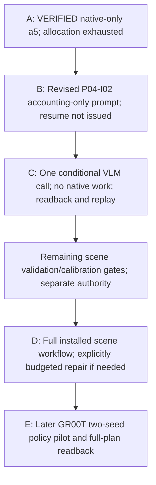

# Event Mapping Refactoring Plan 04: Close the Live-Execution Gaps and Validate the Research Workflow

Status: Implementation in progress; the scoped P04-I01 native-only slice is verified, not the complete Plan 04 workflow. Creating or approving this document is not permission to use live credentials, write production Neo4j, start/recreate containers, or run GPU/provider workloads. Each effectful gate requires bounded authorization.

Implementation work packages and goal prompts: [Plan 04 implementation index](../plan04_implementation/README.md). [P04-I01 — Native integration defects and bounded revalidation](../plan04_implementation/01-native-integration-defects.md) is verified after operator-authorized execution; both additional launches are consumed. Saving or reopening a plan grants no new allocation.

Current P04-I02 result: original cancellation/version 9, exact epoch-6 retirement
and supported post-crash handover passed, preserving old history/reservations.
Installed authenticated successor `p04-i02-visibility-r2` completed one
`gpt-6-astra` request and valid **uncertain** visual result. Fresh exact-byte
readback and no-effect replay passed; exact worker absence, epoch-7 retirement,
lease release and API stop/drain verified within the unchanged 600-second window.
Final critic `deleg_06edd9b3` returned `ACCEPT`; the parent reverified and closed
P04-I02's bounded software integration slice. One cumulative send; two unused
attempts do not authorize sending after the complete result. No additional native
work, scene acceptance, scientific-flag promotion or full Milestone1/Plan04 completion.
The [canonical handoff](../dashboard_cli_workflow_parity/research-stack-implementation-handoff.md#resume-after-a-computer-restart)
and existing operation record contain current evidence and the immediate authority gate.

Historical original outcome: [P04-I02 — installed visual assessment of retained native evidence](../plan04_implementation/02-installed-visual-assessment.md)
was issued and is **BLOCKED after installed worker release, before any provider
dispatch/result**. The narrow retained/accounting-only path and named environment
key binding were installed; gate/review passes did not certify the worker boundary.
Worker cleanup is recorded and its group absent, but owner epoch 6 remains dirty,
the run is `cancel_requested`, and supported API shutdown returned `cleanup_unknown`
with a live `stopping` process. The 600-second window expired; three provider sends
are still unspent but a one-call/190-second reservation is retained. No native work,
allowance reset, visual verdict, completed replay or full Milestone 1 acceptance.
The then-next step was review of the [issue-recovery proposal](../plan04_implementation/02-installed-visual-assessment.md#issue-recovery-proposal--draft-for-review),
which was **NOT ISSUED at that checkpoint**. It proposed bounded lifecycle recovery before a conditional
successor assessment, not another credential/budget audit or automatic submission.
The canonical handoff owns the exact identities and authorization boundary; its
[restart checkpoint](../dashboard_cli_workflow_parity/research-stack-implementation-handoff.md#resume-after-a-computer-restart)
distinguishes the last verified process observations from post-reboot state.

---

## Executive Operational Checkpoints

The current accepted recovery/successor result is summarized above. The following
original blocked assessment checkpoint is preserved historical evidence, not a
current lifecycle blocker or renewed execution authority.

### Installed Assessment Checkpoint — 2026-09-25 (P04-I02 BLOCKED)

- **Integration:** authenticated `p04-i02-visibility`, run `0664fc8038961d9ea079f89c6c35cc5d305f2c56a1255d2253c64ce089d33e19`, was admitted and released one model worker; no provider response, final assessment or specific failure envelope was recovered/linked through the installed path. The underlying cause is not yet established.
- **Visual:** not assessed; no positive/negative/uncertain scene verdict or flag promotion.
- **Readback/replay:** authenticated original input bytes/hashes and failed-state/attempt projection recovered; successful final-result recovery and completed-operation replay remain unmet.
- **Cleanup:** worker PID/group 62210 absent and cleanup recorded; owner epoch 6 dirty/unretired. Supported cancel leaves run version 8 `cancel_requested`; `api-stop` returns `cleanup_unknown` and API PID 62035 remains live/stopping. Final critic `deleg_7682ffd5` and parent both returned `BLOCKED`; fresh parent observation at 16:44:42.311753 UTC confirmed this state. Parent confirmed the schema-3-only duplicate-cleanup finalizer excludes schema4; that separate cancellation defect does not establish the original worker cause.
- **Accounting:** zero durably counted provider sends, three unspent cumulative attempts; one model-call/190-second reservation retained, token/cost caps null under explicit accounting-only policy. The 600-second deadline expired at 16:22:51.511984 UTC. No native/Kit/capture/generation/repair/policy/new-prior work or budget reset.
- **Evidence/decision:** [outcome checkpoint](../../../../outputs/workflow/plan04-implementation/milestone1/installed-native-20260925T012042Z/p04-i02/retained-assessment/outcome-checkpoint.json), [operation record](../../../../outputs/workflow/plan04-implementation/milestone1/installed-native-20260925T012042Z/p04-i02/retained-assessment/operation-record.json), [physical state](../../../../outputs/workflow/plan04-implementation/milestone1/installed-native-20260925T012042Z/p04-i02/retained-assessment/owned-physical-final.json). Requires explicit recovery authority for the existing run/live API, preserving failed records and reservations; later execution needs a new bounded window, not a fresh three-attempt allocation.
- **Preservation:** a5 remains accepted/version 12 with its exact contract/evidence payload unchanged; all five native launches remain consumed. P04-I01 is still the last accepted runtime boundary.

### Latest Installed Native Checkpoint — 2026-09-25 (P04-I01 VERIFIED, native-only)

- **Integration:** authenticated `p04-i01-native-a5`, run `fcc052f890be2d208783f04453d184f7d2455afe948aa8607e92a5a87d79ea48`, reached `accepted`; the application owned native capture, numeric assessment, retention and cleanup, with no manually launched next stage.
- **Native science:** 180 actual control steps; strict final samples 176–180 pass for both objects. Actual seeds 42/42, simulation dt 0.005 s, decimation 4/control dt 0.020 s, one initial placement reset and no extra capture steps. Three fresh cameras share the same cohort. This is the operator-approved revised policy, not calibration.
- **Recovery/cleanup:** fresh authenticated candidate/evidence/PNG bytes match declared hashes; completed-operation replay preserves result/receipt and releases no worker. Registered PIDs are absent, no live owned members remain, owner epoch 5 is retired, and the API is stopped/drained. Dead zombie entries are not reported as vanished PIDs.
- **Accounting/flags:** prior 3/3 plus additional 2/2 native launches consumed; zero remain. a4 remains failed. Only a5 has `native_settled=true`; original failed graph/attempt outcomes and sealed bytes remain unchanged, with convergence/verification/prior eligibility unpromoted. Zero Arena provider calls or policy execution; development-agent inference is separate.
- **Source/evidence:** baseline `8d557315cc056e83e531727274a12bd5705af42e`, uncommitted scoped changes, 210-source manifest unchanged through parent closeout. [Result](../../../../outputs/workflow/plan04-implementation/milestone1/installed-native-20260925T012042Z/p04-i01/LIVE_RESULT.txt), [source](../../../../outputs/workflow/plan04-implementation/milestone1/installed-native-20260925T012042Z/p04-i01/source-a5.json), [critic ACCEPT](../../../../outputs/workflow/plan04-implementation/milestone1/installed-native-20260925T012042Z/p04-i01/critic-final.json), [parent closure](../../../../outputs/workflow/plan04-implementation/milestone1/installed-native-20260925T012042Z/p04-i01/parent-closeout.json).
- **Limits:** the default cache's permissions also changed before a5, actor unknown; do not infer an unchanged shared cache or sole-cause proof. Per-run records are preserved, while aggregate inspection hashes incorporate the advancing global owner. Remaining scene/visual/general-validation gates and later policy work are not certified; neither full Milestone 1 nor Plan 04 is complete.

### Historical Installed Native Checkpoint — 2026-09-25 (BLOCKED on Constructor & Scratch Seams)
The operator-authorized zero-provider retained-candidate slice consumed **3/3 native launches** through the authenticated installed application, `ExecutionOwner`, and owned native worker (`native_scene_worker.py`). No further native execution is authorized under that allocation.
- **Mode**: Explicit `retained-native-validation-v1` in [`installed_native.py`](file:///workspaces/IsaacLab-Arena/isaaclab_arena/agentic_environment_generation/workflow/api/installed_native.py) preserving synthetic guards and reusing the exact original candidate [`candidate.json`](file:///workspaces/IsaacLab-Arena/outputs/workflow/plan04-implementation/milestone1/realize-20260924T232748Z/candidate.json) (SHA-256: `8dcd08b813236ee0ccdcad1024594a70301d4a6fdcd0af41d013e05f5135a7e8`).
- **Settling Policy**: Frozen at 180 control steps (requested control timestep $0.020\text{s}$ from simulation dt $0.005\text{s}$ and decimation 4, hence $3.600\text{s}$ if all steps execute), final 5 consecutive samples, angular norm $< 0.01\text{ rad/s}$, linear norm $< 0.001\text{ m/s}$ for both `red_block` and `blue_bin`, seeds 42/42. The constructor failure did not reach verification of realized timestep/reset behavior.
- **Attempt 1 (`-a1`)**: Cancelled. Exposed a Neo4j intent reconciliation defect for native-only intents lacking earlier generation attempt records (`neo4j_store.py:3860`), and a container subshell process-namespace mismatch in `owned_process_group.py:110` causing `CleanupUnknown`. Both were patched.
- **Attempt 2 (`-a2`)**: Diagnostic `ValueError` at `native_capture._check_spec`. Raw candidate JSON string comparison failed against the schema-normalized `ArenaEnvGraphSpec`. Fixed by revalidating canonical Pydantic model digests.
- **Attempt 3 (`-a3`)**: Passed spec admission and booted Isaac Sim into `InteractiveScene` environment construction, but failed with `ValueError` inside rigid object construction at `schemas.activate_contact_sensors` (line 720) before settling samples or camera frames could execute.
- **Integrity & Persistence**: 0 provider tokens spent ($0 cost). Fresh HTTP result and Neo4j readback verify failed/cancelled outcomes, no fourth release, zero new provider calls, and unchanged `native_settled=false`, `converged=false`, and `verified=false` on root and attempts. All owned native process groups cleanly drained.
- **Artifact Readback Defect**: The native worker created temporary scratch `native-capture-work` directly inside the sealed artifact root (`ArtifactArea.open`), returning `QueryFailure UNKNOWN` on fresh candidate HTTP reads. Temporary scratch must be separated from sealed artifact storage.
- **Evidence**: [`LIVE_RESULT.txt`](file:///workspaces/IsaacLab-Arena/outputs/workflow/plan04-implementation/milestone1/installed-native-20260925T012042Z/LIVE_RESULT.txt) and [`research-stack-implementation-handoff.md`](file:///workspaces/IsaacLab-Arena/.agents/references/plans/dashboard_cli_workflow_parity/research-stack-implementation-handoff.md).

### Bounded Live Milestone 1 Generation & Realization Checkpoint — 2026-09-24
Explicit operator approval enabled one real `gpt-6-astra` generation request through the active Hermes profile (`max_calls=1`), followed by standalone native realization.
- **Generation**: HTTP 200, 11,874 reported tokens. Produced canonical candidate `outputs/workflow/plan04-implementation/milestone1/realize-20260924T232748Z/candidate.json`.
- **Physical Realization**: Ran in real Isaac Lab container on NVIDIA RTX PRO 6000 Blackwell (SM 12.0). Executed 120 PhysX control steps and rendered 3 camera PNGs.
- **Settling Verdict**: Rejected under strict $0.001\text{ rad/s}$ angular ceiling because step 117 had an angular excursion to $0.001715\text{ rad/s}$ (only 3 consecutive steps settled at cutoff instead of 5).
- **Persistence**: Fresh namespace `milestone1_live_20260924t232748z_r2` retained with `converged=false`, `verified=false`, and verified artifact hashes.

---

## 1. Goal and Definition of Success

Deliver a usable, application-owned, GraphQL-submitted research workflow using the actual approved Neo4j deployment, IsaacLab-Arena runtime, and Isaac-GR00T policy service. Prove the application invokes existing tools and owns stage transitions without an agent manually issuing each next phase.

The delivery path is:
$$\text{authenticated submission} \to \text{exact retained priors} \to \text{generation} \to \text{schema validation} \to \text{owned native realization/settling/capture} \to \text{retained numeric + visual assessment} \to \text{permitted repair} \to \text{scene disposition} \to \text{task-bound policy evaluation} \to \text{retained result} \to \text{fresh-client causal readback}$$

### The Four Operator Corrections & Invariants

1. **Settling Time as an Empirical Experiment**:
   Extending settling time (e.g., to 180 control steps, $+1.2\text{s}$) is an empirical experiment to allow contact energy dissipation, not a mathematical guarantee of convergence. Rigid body contact in PhysX exhibits non-monotonic micro-chatter around velocity thresholds.
2. **Standard vs. Approved Policy**:
   The $0.01\text{ rad/s}$ angular velocity ceiling (alongside the strict $< 0.001\text{ m/s}$ linear bound) is an **operator-approved revised settling criterion**, not an established universal physics calibration.
3. **Strict Decoupling of Validation Flags (GraphRAG Integrity)**:
   Passing native settling (`native_settled=true`) must **never** automatically promote `converged=true` or `verified=true`.
   - `native_settled`: Records a passing frozen velocity window for the selected subjects/cohort; it does not by itself establish support, non-interference or visual correctness.
   - `converged`: Confirms generator spatial constraint satisfaction across prompt relations.
   - `verified`: Confirms task policy execution and goal predicate achievement.
   Promoting `converged` or `verified` from settling alone corrupts GraphRAG prior retrieval (`_STRUCTURAL_PRIORS_QUERY` in `graph_rag.py:80–86`).
4. **Application Ownership Requirement**:
   Standalone ad-hoc script execution (`docker exec python.sh -c "..."`) does not validate the platform. The installed application (`ExecutionOwner` $\to$ coordinator $\to$ `native_scene_worker.py` $\to$ GraphQL) must own all transitions, persistence, and cleanup.

### Four Distinct Verdicts
1. **Software Integration**: Installed interfaces drive declared adapters, persist exact identities, and return truthful results without throwaway glue scripts.
2. **Operational Safety**: Authorization, cumulative resource/cost ceilings, process cleanup, and production-data boundaries hold as declared.
3. **Scientific/Task Result**: Scene validity and measured task success/failure for every predeclared trial.
4. **Release Decision**: Whether evidence is sufficient to advance to frontend integration. Passing isolated tests or explaining a failure does not constitute A2 validation.

---

## 2. Reconcile Progress Before Implementing

### 2.1 Evidence-Supported Baseline
- **Last verified native source:** P04-I01's `source-a5.json` and parent closeout, not an inference from the latest commit or an old test total.
- **Affected existing checks at a5 closeout:** 293 tests and 17 subtests passed; 96 warnings retained. Provider-bounds checks passed separately (8). The former visual-dispatch failure was corrected, and scoped host lint/whitespace checks passed.
- **Current execution source:** P04-I02 started from `de8f03b13827517e605bb32d49ff87ae596b24bf` and exercised scoped uncommitted changes; `retained-assessment/source-freeze-admission.json` binds 212 files, unchanged after admitted submission. Affected existing checks/scoped lint passed, but the installed outcome above is blocked. This does not rewrite a5's earlier source manifest or certify the entire checkout.
- **Remaining live proof:** historical isolated checks and the standalone generation request do not prove live installed assessment, supported live pricing, calibration or the full scene workflow.

### 2.2 Reconciling Empirical Realities
| Historical Assumption | Empirical Evidence & Plan 04 Correction |
| :--- | :--- |
| Simulation settling is monotonically damped | PhysX contact solver exhibits intermittent micro-vibration. Bounded time extension (180 steps) is an empirical test. |
| Settling establishes scene convergence | Decoupled: `native_settled` tracks physics only; `converged` and `verified` remain false until their respective evaluators pass. |
| Standalone script execution proves workflow readiness | Rejected: Workflow execution must be owned by the installed ASGI server, GraphQL mutations, and `ExecutionOwner`. |
| Sealed artifact store permits arbitrary worker subdirectories | `ArtifactArea.open` strictly enforces `marker/staging/final`. Subdirectories like `native-capture-work` cause HTTP query failure. |

---

## 3. Gap Register and Smallest Intended Corrections

| ID | Boundary / Evidence | Required Correction or Runtime Proof | Gate | Status |
| :--- | :--- | :--- | :--- | :--- |
| **G04-01** | `api/installed_config.py` admitted only query-only mode | Implemented versioned execution composition (`installed_native.py`) and GraphQL/CLI adapters (`retained-native-validation-v1`). | P1 | **Closed** |
| **G04-02** | Query-server lifetime was not an execution-owner proof | Wired `ExecutionOwner` to supervise native workers, handle cancel/resume, and reconcile owned process groups. | P1 | **Closed** |
| **G04-03** | `policy_evaluation.py` requires trusted runtime ports | Concrete policy worker and runtime/task/checkpoint adapters. Reuse `rollout_policy` with exact intent/deadlines. | P2 | Open |
| **G04-04** | Native provenance and settling witness | Installed a5 executed 180 control steps, passed the strict final five for both subjects and retained three same-cohort PNGs. Preserve the profile assurance label and separate independent sampler/calibration claims. | P1/P3 | **Verified for P04-I01 only** |
| **G04-05** | Single-reset capture vs. post-reset policy hooks | Re-establish state-dependent prerequisites for every policy reset with fresh IDs/evidence and charged steps. | P2/P3 | Open |
| **G04-06** | GPU memory co-residency (Isaac Sim + GR00T) | Establish co-residency topology on Blackwell GPU with explicit VRAM headroom accounting. | P0/P3 | Open |
| **G04-07** | Prior snapshots & managed-prior migration | Freeze retrieval selection in accepted requests and recover exact retained prior references before new retrieval. | P1/P4 | Open |
| **G04-08** | Live accounting policy & model profile routing | `PricingBasis` still accepts only `synthetic_fixture`. The revised P04-I02 prompt requires explicit accounting-only monetary/token policy while retaining technical request checks, one-send/deadline enforcement and truthful usage/cost reporting. Original budget refusal remains history; no live implementation/send yet. | P1/P4 | **Open; revised prompt prepared, implementation not resumed** |
| **G04-09** | Production Neo4j safety & scope binding | Dedicated operational scope `milestone1_live_20260924t232748z_r2` with Basic auth and verified noninterference. | P0/P4 | **Verified** |
| **G04-10** | Owned native process-group cleanup | P04-I01 verified registered worker absence, no live owned members, durable retirement and API drain; dead zombie entries were disclosed, not claimed absent. | P2/P3 | **Closed for native slice** |
| **G04-11** | A2 PickAndPlace live manipulation | Pinned GR00T weights/serializer and operational PickAndPlace evaluator on table/plate/banana. | P3/P5 | Open |
| **G04-12** | Installed GraphQL candidate/evidence byte readback | Fresh authenticated a5 candidate, evidence and PNG bytes matched hashes; completed-operation replay released no worker. Full future assessment/policy lineage remains separate. | P1/P6 | **Verified for P04-I01** |
| **G04-13** | Descriptive catalogue imported heavy runtime | Scoped adapter contract binds only consumed vocabulary and content digest without eager simulator discovery. | P1 | **Closed** |
| **G04-14** | Rigid object construction failed at contact activation | a4 identified `/World/envs/env_0/blue_bin`; unreadable cache delivery was observed and the worker gained private scratch/cache bootstrap. a5 constructed and settled. Shared-cache permissions also changed before a5, so sole-cause attribution remains unsupported. | P1/P3 | **Closed for exact a5 path; causal caveat retained** |
| **G04-15** | Scratch contaminated the sealed artifact root | Scratch was recovered outside the same sealed store without changing prior bytes/inodes; authenticated byte readback and replay passed. No reader-layout weakening. | P1/P6 | **Closed in P04-I01** |
| **G04-16** | Retained producer binding versus new assessment contract/profile | Preserve a5's original candidate/cohort/manifests and link a separate assessment consumer; do not rebind receipts or fabricate earlier visual criteria. | P1/scene P2 | **Open; P04-I02 stopped before Gate A** |
| **G04-17** | Installed assessment-only composition and private role | Selected native schema 4 has zero required profiles and no assessment binding; no credentials or other private roots were searched. Keep native/synthetic guards and use approved application-private handover after prerequisites are resolved. | P1/scene P2 | **Blocked before P04-I02 Gate A** |

---

## 4. Authorization, Secrets, and Production Boundaries

### 4.1 Bounded Campaign Approval Envelope
- Every effectful live run requires an explicit, operator-approved envelope detailing:
  - Exact candidate SHA-256 and contract digest.
  - Frozen physics settling parameters (steps, thresholds, consecutive window).
  - Explicit cumulative native/provider/step allowances and deadlines, with no default renewal. The original three plus P04-I01's two native launches are consumed; issued P04-I02 has zero native launches and has spent zero provider sends.
  - Explicit cost/token policy: enforce ceilings where issued; an expressly uncapped monetary/aggregate-token policy still requires usage reporting and effect-count enforcement. Revised P04-I02 proposes that accounting-only policy; this does not change other selections or authorize execution. Zero-provider slices remain zero-provider.
  - Pinned Neo4j deployment and workspace bindings.

### 4.2 Production Neo4j Safety
- **Scoped Writes**: Operational writes are restricted to explicit run/attempt scopes (e.g., `milestone1_live_20260924t232748z_r2`).
- **GraphRAG Prior Protection**: Structural prior queries filter on `n.converged = true`. Native settling alone must never set `converged=true` or `verified=true`.
- **Durable Replay**: Replaying the same completed operation must return its retained result without launching a new simulator process.

### 4.3 Container & GPU Discipline
- **Container selection:** follow the repository `dev-container` skill to verify the existing checkout container; `isaaclab_arena-latest` is the last verified name, not permission to hardcode or recreate it. Arena checks run as non-root `ubuntu` (UID 1000) via `/isaac-sim/python.sh`; lint runs on the host.
- **No native work in P04-I02:** even a diagnostic/test Kit start is prohibited. Retained-image assessment needs no new GPU workload.
- **Process group tracking:** verify exact registered processes, no live owned group/session members, durable retirement and API drain. Retain zombie-only observations honestly; API drain alone does not prove every PID disappeared.

---

## 5. Work Packages and Stop/Go Sequence

The first scene-only path remains **remaining P1 → scene P2 → scene P3 → P4**.
P04-I02 advances the retained-assessment boundary, not every P1–P3 obligation.
GR00T, policy co-residency, the two-seed pilot and final full-plan P5/P6 do not gate
the first scene workflow. Fresh readback/replay and cleanup still accompany every
executed slice. Policy and complete lineage remain necessary for full Plan 04.

### P0 — Reconcile, Review and Freeze Campaign (No Live Effects)
- Generate setup-and-readiness report; verify dependencies, database credentials, and container mappings offline.

### P1 — Joined Installed Application Boundary & Native Settling
- **Verified slice:** P04-I01 closed exact native construction/settling/capture, scratch recovery, fresh byte readback and replay. Do not rerun it under exhausted authority.
- **Current paused slice:** P04-I02's revised prompt removes preset monetary/token budgets. It has not been issued or implemented; source provenance, approved private delivery, native/synthetic guards and Gate A still apply. Preserve the earlier capped stop as history.
- Broader joined generation/prior/assessment obligations are not closed by the native result alone.

### P2 — Concrete Native/Policy Composition & Lifecycle Rehearsal
- **Scene path:** verify retained-evidence assessment ownership, bounded send/cancel/timeout behavior, no recapture, persistence and cleanup through installed interfaces. Reuse existing simulation-free checks before live effects.
- **Later policy path:** wire the owned policy child around `run_managed_policy` with genuine process supervision; it is not a P04-I02 prerequisite.

### P3 — Bounded Fixed-Candidate Native & Policy Calibration
- **Scene path:** independently establish required visual/sensing validity and any calibration under a separately frozen protocol. One VLM visibility response on a5 is an integration witness, not calibration.
- **Later policy path:** verify GR00T readiness, action serialization and joint mappings before approved rollouts; keep this out of the first assessment slice.

### P4 — First Complete Live Scene Workflow (Plan 03 V1)
- Single installed GraphQL submission: prompt $\to$ generation $\to$ native settling $\to$ visual assessment $\to$ bounded repair (if needed) $\to$ accepted scene.

### P5 — Required-Policy A2 Pilot (Plan 03 V2)
- Reference task: *"Grasp the yellow banana from the right side of the table and set it onto the white ceramic plate on the left."*
- Execute across two predeclared seeds with fresh reset prerequisites and episode evaluation.

### P6 — Independent Readback, Reconciliation and Handoff
- Fresh-client causal reconstruction of entire lineage: command $\to$ priors $\to$ candidate $\to$ measurements $\to$ assessment $\to$ policy trials $\to$ cleanup.

---

## 6. Operational Phased Roadmap: Goals A through E

These goals describe ordering, not active allocations. P04-I01 is complete;
P04-I02 has a revised prompt awaiting issuance after its original prerequisite stop.
Later goals require their own scope and limits.

### Goal A: Zero-Provider Native-Validation Slice — VERIFIED in P04-I01
- a5 passed the frozen final five-sample velocity window for both subjects after 180 control steps, retained three same-cohort PNGs, and passed authenticated byte readback/replay and owned cleanup.
- All original three and additional two native launches remain consumed. Only a5 has `native_settled=true`; no convergence, verification or prior eligibility was promoted.
- Preserve the exact revised-policy limitations, historical failures and shared-cache attribution caveat. No new run is authorized by this status.

### Goal B: Retained Visual Assessment Preparation — REVISED PROMPT, EXECUTION PAUSED
- Preserve the source producer's binding and explicitly link a new assessment operation rather than rewriting its receipt under a new contract/profile.
- Reuse the installed owner/coordinator and existing per-frame visibility evaluator; freeze the subject mapping, original images, criterion, serializer and model envelope.
- Resolve only necessary assessment-only composition, explicit live accounting-only policy and private-role delivery gaps. Keep native mode model-free and synthetic/other budgeted selections unchanged.
- Zero provider requests and zero native work. Use affected existing simulation-free checks; no new or modified tests, mocks, fixtures or acceptance harnesses. XY repair is deferred to Goal D, not a Gate A prerequisite.

### Goal C: One Installed VLM Assessment — CONDITIONAL P04-I02, NOT DISPATCHABLE
- Revised draft: at most one `gpt-6-astra` assessment request after Gate A, zero native launches and no retry, fallback, generation or repair. No fixed USD/aggregate-token/numeric output budgets; technical context/output limits, a finite completion allowance and existing deadlines remain. No send consumed; revision not issued.
- Establish explicit live accounting-only policy, complete image/request integrity and private authority before send. Record provider usage and sourced cost estimates or explicit unknowns. Missing price certainty or an old conservative budget projection is not an admission veto; synthetic pricing is not live accounting.
- Retain the source-bound raw/structured result, usage and limitations; verify fresh authenticated bytes, same-operation replay without another call, and owned cleanup. A valid negative/inconclusive visual verdict can establish integration, not scene acceptance. Malformed output or transport failure cannot.
- Keep visibility, calibration, native settling, convergence, policy success and prior eligibility distinct. Remaining scene validation gates are not waived by this single response.

### Goal D: End-to-End Live Scene Generation & Acceptance — FUTURE
- One installed submission must own prompt → generation → native settling/capture → assessment → truthful scene disposition, with bounded repair only if separately included.
- Before execution, issue an explicit cumulative native/provider/token/cost envelope. A repair branch needs new-candidate capture and a second assessment; the former one-assessment sketch cannot certify repaired output. No amounts here renew earlier authority.
- Require complete causal readback, truthful unresolved/failure outcomes and owned cleanup. A changed candidate never inherits a5's native evidence.

### Goal E: Seed-Bound GR00T Policy Evaluation Pilot — LATER
- After the scene-only workflow, establish policy readiness and reset prerequisites, then issue a separate two-predeclared-seed A2 pilot envelope.
- Retain episode trajectories, grounded predicate evaluations and truthful task success/failure; complete independent full-lineage readback. This is not a P04-I02 prerequisite.

---

## 7. Acceptance Matrix

| ID | Obligation and Positive/Negative Witness | Target Environment | Upstream Coverage | Status |
| :--- | :--- | :--- | :--- | :--- |
| **A04-01** | Current-source traceability; Neo4j-only route, forbidden SQLite rejected | Static + isolation | T01/T13/T20, G01–G10 | **Passed** |
| **A04-02** | Installed GraphQL submit/receipt/status from second client; query-only unchanged | Disposable DB, denied egress | T02/T09/T16/T21, G01–G03 | **Passed** |
| **A04-03** | Keyed cancel, client disconnect, lost ACK replay, owned process cleanup | Owned processes + disposable DB | T04/T10/T11/T15, G01/G10 | **Passed** |
| **A04-04** | Frozen retrieval source, eligibility policy, nonempty prior consumption | Isolated, then approved live read | T03/T05/T13/T17, G02/G04 | **Passed** |
| **A04-05** | Private sentinel transport, no secrets in argv/logs/DB/artifacts | Isolated runtime checks | T03/T09/T21 | **Passed** |
| **A04-06** | Dedicated operational scope, noninterference with production data | Admin-approved metadata/write | T13/T15/T17 | **Passed** |
| **A04-07** | 180-step native realization; strict final five linear/angular samples for both subjects; three same-cohort PNGs | Real Isaac Lab container | T06/T14 | **Verified for P04-I01/a5, not calibration** |
| **A04-08** | Same sealed artifact store; authenticated candidate/evidence/PNG bytes and unchanged replay | Installed GraphQL API | T06/T08/T14 | **Verified for P04-I01/a5** |
| **A04-09** | Native worker cleanup before model execution; no live owned simulator workers | Container lifecycle observation | T09/T14/T15 | **Native cleanup verified; installed assessment integration verified & closed** |
| **A04-10** | GR00T policy service readiness, modality serialization, joint mapping | GR00T service container | T08/T19 | Open |
| **A04-11** | One installed submission drives full scene generation $\to$ settle $\to$ VLM | Approved Live V1 | T03/T05/T06/T18 | Gated on Goal D |
| **A04-12** | Bounded XY repair on visual failure $\to$ fresh capture $\to$ reassessment | Controlled live witness | T07/T14/T18 | Gated on Goal D |
| **A04-13** | Two-seed policy rollout on A2 task; complete predicate evaluations | Approved Live V2 | T08/T18/T19, G09 | Gated on Goal E |
| **A04-14** | Fresh-client causal traversal and immutable artifact verification | Fresh authenticated reader | T10/T12/T15/T16, G03–G10 | **Native and assessment slices verified; full policy lineage open** |
| **A04-15** | Cumulative effect-count enforcement and truthful usage/cost accounting; monetary/token caps enforced only where issued | Observed live ledger | T03/T08/T14/T15 | **Verified for P04-I01 and P04-I02 (1 send consumed, 2 unspent, truth-in-accounting preserved)** |
| **A04-16** | Final owned cleanup, shared service preservation, truthful failure logging | Final exact readback | T09/T11/T15/T18 | **Verified** |
| **A04-17** | Scoped adapter contract binds only consumed vocabulary and content digest | Isolated orchestration slice | G04-13, A04-01–03 | **Passed** |
| **A04-18** | Installed assessment of immutable a5 images; source/consumer lineage, one bounded send, raw/structured readback, no-send replay and cleanup | Approved installed successor `p04-i02-visibility-r2` | G04-08/G04-16/G04-17 | **Integration verified & parent-closed; visual verdict uncertain (not scene acceptance)** |

---

## 8. Anti-Dopamine Invariants & Investigation Budgets

To prevent autonomous coding agents from entering circular test writing:
1. **Mock Test Proliferation Ban**:
   Agents are forbidden from creating mock test files or expanding synthetic test matrices to simulate progress. The only acceptable proof of software progress is execution against the installed application stack and actual container boundaries.
2. **Three-Strike Defect Limit**:
   If a single defect encounters three unsuccessful correction attempts, execution must halt immediately and produce a diagnostic report.
3. **Investigation Ceilings**:
   Any new architectural blocker is capped at:
   - Maximum 2 hypothesis/challenge rounds.
   - Maximum 3 isolated diagnostic invocations.
   - Maximum 60 minutes of active investigation wall time.
4. **Honest Stop Conditions**:
   When an allocation is exhausted or an unexpected error occurs, the agent must stop, log the exact failure, preserve diagnostics, and report the blocker rather than manufacturing artificial success.

---

## 9. Definition of Done

Plan 04 is complete only when:
1. Goal A passes: 180 PhysX control steps, velocity criteria met, 3 camera PNGs rendered, artifact readback clean.
2. Goal B & C pass: Exact retained-source/subject binding and installed bounded VLM assessment are verified, without treating a visibility response as independent visual calibration. Any additional scene validation/calibration required by P3 remains explicit.
3. Goal D passes (Plan 03 V1): Fully autonomous installed generation $\to$ realization $\to$ assessment $\to$ scene acceptance.
4. Goal E passes (Plan 03 V2): Seed-bound GR00T policy pilot executed across two seeds with complete episode evaluation.
5. Independent readback verifies entire causal chain and artifact integrity from a fresh client.
