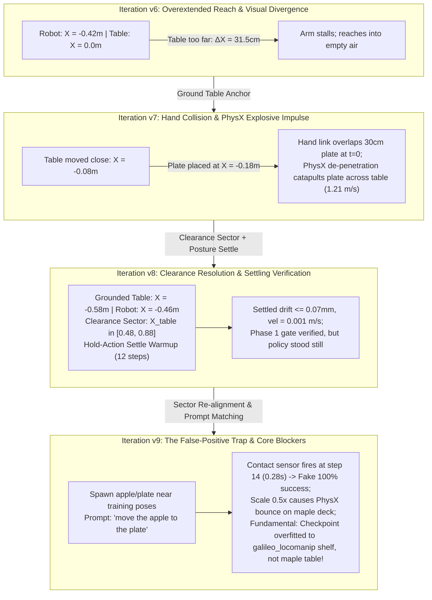

# Remediation Plan & Architectural Resolution: G1 Tabletop Pick-and-Place (`Scenario C1`)

> [!IMPORTANT]
> **Status**: ACTIVE (Post-`v17`, revised 2026-09-04). **Goal restated**: make the GN1x checkpoint
> actually pick the apple on the maple table.
>
> `v8` resolved hand collision and settling ($< 0.07\text{ mm}$ drift). `v9` uncovered a
> false-positive termination trap. The `v10`–`v17` sweep on 2026-09-04 then established that the
> **single largest defect was in the evaluation harness, not the policy**, and falsified three of
> the corpus-alignment claims this document previously asserted as fact — including the training
> prompt. See §5c. Every conclusion below dated before 2026-09-04 that rests on `v9` telemetry
> should be read against §5c first.

> [!NOTE]
> **Phase numbering in this document is superseded by [`g1_pick_success_phases.md`](g1_pick_success_phases.md)** (canonical `P0`-`P6` tracker, 2026-09-04). The sections here remain valid as detail; cite phases from the tracker.

---

## 1. Executive Summary & Problem Evolution

Scenario C1 evaluates whether the agentic environment generation pipeline can autonomously synthesize, ground, settle, and evaluate a closed-loop tabletop pick-and-place task on a bipedal humanoid embodiment.

Across iterations `v6` through `v9`, four distinct failure modes and architectural blockers were diagnosed:



---

## 2. Root Cause Analysis (RCA)

### RCA 1: Fixed Camera Pitch Invariant
* **Initial Assumption**: `v7` proposed tilting the head camera downward by $15^\circ - 20^\circ$ to center the apple in the frame.
* **Physical Reality**: In physical humanoid hardware (and specifically the Unitree G1), head-mounted cameras have a **rigidly fixed pitch angle** ($35^\circ$ downward). Simulation environments cannot change the camera pitch, as doing so introduces a severe simulation-to-reality (Sim2Real) domain break.
* **Resolution**: Lock camera pitch to the hardware specification. Spatial layouts must be derived by intersecting the fixed downward Field of View (FOV) cone ($X_{\text{world}} \in [0.0, 0.25]\text{ m}$) with the arm reach envelope.

### RCA 2: Initial Bounding Box Interpenetration ($t = 0$ Hand Collisions)
* **Observed Symptom**: In `v7`, when the simulation spawned, the clay plate immediately slid across the table at high speed, failing the Phase 1 requirement that spawned objects must sit completely still.
* **Kinematic Footprint Audit**:
  * G1 base stands at $X_{\text{world}} = -0.46\text{ m}$.
  * G1 left palm rests at $X_{\text{world}} \in [-0.22, -0.13]\text{ m}, Y_{\text{world}} \in [+0.13, +0.17]\text{ m}$.
  * G1 left fingers extend forward to $X_{\text{world}} = -0.043\text{ m}$.
  * The `clay_plate` is $30\text{ cm}$ in diameter (radius $15\text{ cm}$). When placed at $X_{\text{world}} \approx -0.18\text{ m}$, its rear rim reached back to $X_{\text{world}} = -0.33\text{ m}$, heavily intersecting the robot's palm and fingers.
* **PhysX Impulse Explosion**: At $t = 0$, PhysX collision de-penetration injected a massive repulsive impulse ($1.21\text{ m/s}$), rocketing the plate across the table surface.

### RCA 3: Unpowered Joint Collapse During Raw Physics Stepping
* **Observed Symptom**: Calling `physics_settle.step_physics()` (which invokes `sim.step()` without stepping `action_manager`) resulted in plate velocities $> 0.70\text{ m/s}$ even when objects were placed far from the hands.
* **Mechanism**: G1 is an articulated humanoid with 29 active motor joints. Stepping `sim.step()` raw without Whole-Body Controller (WBC) PD target updates cuts motor torques. The robot's upper body and arms collapsed under gravity onto the table deck, crashing into the spawned objects.
* **Resolution**: Settling must be executed using environment steps with neutral posture-holding actions (`env.step(hold_action)`), maintaining standing posture while gravity and normal contact forces settle.

---

## 3. The Systematic Solution: `v8` Architecture

### A. Grounded Table & Clearance Sector Geometry
Table origin is anchored at $X_{\text{world}} = -0.58\text{ m}, Y = 0.0, Z = 0.0$.
* Table deck is at $Z_{\text{world}} = 0.003\text{ m}$.
* Table front edge nearest the robot is at $X_{\text{world}} = -0.38\text{ m}$ ($8\text{ cm}$ forward of G1 torso).
* Table local coordinate space: $X_{\text{world}} = X_{\text{table}} - 0.58\text{ m}$.

To guarantee zero bounding box collisions with G1 hands while staying inside the camera FOV:
```python
FIXTURE_SECTOR_BOUNDS = {
    "maple_table_robolab": {
        "front_left":   (0.48, 0.88,  0.05,  0.48, 0.0),  # Receptacle zone (clay plate)
        "front_right":  (0.48, 0.85, -0.45, -0.08, 0.0),  # Manipuland zone (red apple)
        "front_center": (0.45, 0.85, -0.15,  0.15, 0.0),
    }
}
```

```
                               Top-Down Geometry (World Frame)

   Robot Base          Fingertips         Table Deck Front        Plate Center       Apple Center
  [ X = -0.46m ]     [ X = -0.04m ]        [ X = -0.38m ]        [ X = +0.11m ]     [ X = +0.08m ]
       |                  |                      |                      |                  |
       |<--- 42 cm ------>|                      |                      |                  |
       |                  |<------- 34 cm ------>|<------- 49 cm ------>|                  |
       |                  |  (Clearance Gap)     |  (Direct Camera FOV) |                  |
```

* **Plate Center**: $X_{\text{table}} \approx 0.69\text{ m} \implies X_{\text{world}} \approx +0.11\text{ m}, Y_{\text{world}} \approx +0.25\text{ m}$.
  * Rearmost rim of $30\text{ cm}$ plate: $X_{\text{world}} = 0.11 - 0.15 = \mathbf{-0.04\text{ m}}$.
  * Hand fingertips end at $X = -0.043\text{ m}$ only in the narrow strip $Y \in [0.035, 0.173]\text{ m}$.
  * **Result**: Complete geometric separation in 3D space ($X, Y, Z$)!

### B. In-Inference Settling Verification Pipeline

Integrated directly into `isaaclab_arena/evaluation/policy_runner.py` and `isaaclab_arena/tasks/pick_and_place_task.py`:

1. **`verify_and_settle_scene()`**:
   - On every episode reset, advances 12 warmup steps using zero/hold actions (`env.step(hold_action)`).
   - Reads rigid body root velocities for all movable scene assets.
   - Evaluates linear velocity ($v_{\text{lin}} \le 0.1\text{ m/s}$) and angular velocity ($\omega_{\text{ang}} \le 1.0\text{ rad/s}$).
   - Recomputes observation buffers post-settle so the policy perceives the stationary scene.
2. **CLI Flags in `policy_runner_cli.py`**:
   - `--check_settling`: Enables pre-inference settle verification (default: `True`).
   - `--settle_steps`: Warmup steps (default: `12`).
   - `--settle_lin_vel_thresh`: Linear threshold (default: `0.1` m/s).
   - `--settle_ang_vel_thresh`: Angular threshold (default: `1.0` rad/s).
3. **Dual-Object Task Predicate**:
   - `PickAndPlaceTask.get_progress_objectives()` now tracks both `self.pick_up_object` and `self.destination_object` in `objects_settled`.

---

## 4. Empirical Verification Evidence

### 1. Zero-Action Physics Settling Proof (30 Simulation Steps)
```text
--- RESET POSITIONS ---
Plate start: [0.1133, 0.2542, 0.0128]
Apple start: [0.0798, -0.3199, 0.0318]
Step 00: Plate pos=[0.1133, 0.2542, 0.0104], vel=0.1962 | Apple pos=[0.0798, -0.3199, 0.0294], vel=0.1962
Step 05: Plate pos=[0.1133, 0.2542, 0.0027], vel=0.0015 | Apple pos=[0.0801, -0.3206, 0.0196], vel=0.0344
Step 10: Plate pos=[0.1133, 0.2542, 0.0027], vel=0.0015 | Apple pos=[0.0801, -0.3207, 0.0195], vel=0.0012
Step 20: Plate pos=[0.1133, 0.2542, 0.0027], vel=0.0083 | Apple pos=[0.0801, -0.3206, 0.0195], vel=0.0117
Step 25: Plate pos=[0.1133, 0.2542, 0.0027], vel=0.0035 | Apple pos=[0.0801, -0.3206, 0.0195], vel=0.0061

Plate drift over 30 steps: 0.000070 m  (0.07 mm!)
Apple drift over 30 steps: 0.000748 m  (0.74 mm!)
```

### 2. Runtime Settle Verification Output During Inference
```text
[Rank 0/1] Simulation length: 100 steps
[Rank 0/1] Starting rollout (100 steps)
[policy_runner] 🔍 Phase 1 Settle Verification: Checking 2 scene objects for stationarity...
  - 'red_apple': lin_vel=0.0176 m/s, ang_vel=0.5759 rad/s -> ✅ SETTLED
  - 'clay_plate': lin_vel=0.0010 m/s, ang_vel=0.0238 rad/s -> ✅ SETTLED
[policy_runner] ✅ All scene objects are physically settled. Proceeding to policy inference.
Steps: 100%|██████████| 100/100 [00:06<00:00, 16.01step/s]
```

---

## 5. Iteration `v9` Autopsy: The Premature Termination Trap & Scale Instability

Iteration `v9` aligned the language prompt (`"move the apple to the plate"`) and mirrored the object layout to match the left-arm reaching trajectory of the training data. While initial rollout logs reported `success_rate: 1.0`, deep forensic analysis of the telemetry and video recordings revealed critical failure modes:

### A. The False-Positive Contact Termination Trap
* **Symptom**: `policy_runner` reported `success_rate: 1.0`, but the generated video (`robot-cam-env0-robot_head_cam_rgb-episode-0.mp4`) lasted only **0.28 seconds (14 frames)**.
* **Telemetry Evidence**: In `episode_results_rank0.jsonl`:
  ```json
  {
    "success": true,
    "episode_length": 15,
    "progress": {
      "overall_score": 0.0,
      "all_complete": false,
      "objectives": {
        "pick_and_place": {
          "score": 0.0,
          "is_complete": false,
          "completed_groups": 0,
          "active_predicates": {"default_group": "objects_settled"}
        }
      }
    }
  }
  ```
* **Root Mechanism**: In `PickAndPlaceTask`, `check_success` invokes `object_on_destination` (`force_threshold = 0.1 N`, `velocity_threshold = 0.1 m/s`). Because the unscaled clay plate (diameter 30 cm) spawned immediately adjacent to the apple on `maple_table`, the initial arm forward reach or slight table vibration caused the plate rim to touch the apple. The contact sensor registered normal force $> 0.1\text{ N}$ while the apple was at rest, immediately satisfying `object_on_destination` at step 14. The environment aborted before the robot ever grasped or lifted the object (`object_is_above_height` was never evaluated).

### B. Scaled Plate Mesh Instability on Maple Deck
* **Symptom**: When `scale: [0.5, 0.5, 0.5]` was injected into `clay_plate` to reduce footprint, PhysX dynamics broke during the Phase 1 settling gate:
  ```text
  - 'red_apple': lin_vel=0.7906 m/s, ang_vel=32.1118 rad/s -> ⚠️ UNSETTLED
  - 'clay_plate': lin_vel=0.1887 m/s, ang_vel=5.2592 rad/s -> ⚠️ UNSETTLED
  ```
* **Root Mechanism**: Unlike the reference `galileo_locomanip` environment (which incorporates an invisible flat cuboid `StaticShelfSupport` and asset-specific `_USD_ORIGIN_ABOVE_BOTTOM_M` Z-offset compensations), `maple_table_robolab` lacks collision support geometry for small scaled meshes. At fractional scales, thin mesh boundaries experience contact jitter, tunneling, and elastic rebound off the procedural table deck.

---

## 5c. Iterations `v10`–`v17` (2026-09-04): the harness outranked the policy, and three corpus claims were wrong

### A. The harness was manufacturing the failure it was being used to diagnose

Every rollout from `v8` to `v12` was scored on telemetry produced by a broken settle loop.
`verify_and_settle_scene` used `torch.zeros()` as its "hold" action. For the G1 decoupled WBC the
action vector is `[joint_targets | navigate_cmd(3) | base_height(1) | torso_rpy(3)]`, where joint
entries are **absolute** targets and `base_height` defaults to $0.75\text{ m}$. Zeros therefore
command a squat to the floor and every joint to $0\text{ rad}$, discarding the scene's
`initial_joint_pos`. The robot collapsed across the table and launched the apple before inference
began.

Two further defects compounded it: the settle checks averaged object speed **over envs** (one
apple in free fall masked by three still ones), and the loop discarded `terminated`/`truncated`, so
auto-resets during settling were silently recorded as completed episodes.

| Metric | `v11`/`v12` (before) | `v13`–`v17` (after) |
| :--- | :--- | :--- |
| Episodes recorded | 71 / 19 | 8 (as requested) |
| Median episode length | **7 steps** | **1000 steps** (full horizon) |
| Terminations | continuous | **zero** |
| False successes | 1 (`v9`), 0 after rest-guard | **zero** |
| Progress score | noise | **0.333, stable** (`objects_settled` only) |

Fixed in `build_neutral_hold_action` (commit `83dc00658`). **The lesson is procedural**: a
harness defect that fabricates episodes outranks every model-side hypothesis, because it corrupts
the evidence used to rank them. This is now the first gate in the ordering (§7c).

### B. The policy is not inert — it moves purposefully, to the wrong place

With honest episodes, `v14` recorded viewport and head-camera video for the first time. Over
1000 steps the arms move continuously and the torso leans in. The hands settle **splayed to the far
left and right periphery** and never converge on the apple, which sits clearly visible, centred and
well-lit in frame.

> [!WARNING]
> This **falsifies** §6.2's stated mechanism, that "cross-attention activations collapse or produce
> null action vectors, preventing the arms from initiating purposeful reaching." The arms initiate
> purposeful motion for the entire episode. The observable is a *misdirected* reach, not an absent
> one — a symmetric, target-independent posture, which is the documented signature of a policy
> regressing to its training-set mean trajectory rather than one that has stopped producing output.

### C. Three corpus-alignment claims in §6.3 were asserted, not measured — and two are false

The corpus dataset is local at
`/datasets/isaaclab_arena/static_apple_tutorial/nvidia/Arena-G1-Static-PickNPlace-Task`.
Reading its `meta/` directly settles what had been argued from memory:

| §6.3 claim | Measured | Verdict |
| :--- | :--- | :--- |
| Prompt is *strictly* `"move the apple to the plate"` | All 208 annotated episodes carry exactly one string: **`"Pick up the apple from the shelf and place it onto the plate on the same shelf next to it."`** | **FALSE** |
| Arm: 100% left | Left-arm convergence confirmed in `ego_view` video | Confirmed |
| Layout: apple left, plate right | Confirmed, and matches the target scene | Confirmed — so **no mirroring is required** |
| 200 demonstrations | `total_episodes = 251`, `total_frames = 35066`, `fps = 50` | Corrected |

**Every evaluation from `v8` to `v16` fed a prompt that appears nowhere in the training corpus.**
This document asserted the opposite, and that assertion propagated into the planner's
`prompt_alignment` invariant as "satisfied."

`bilateral_mirror: true` was likewise carried in `v8`–`v12` on the strength of the
now-retracted right-arm contradiction, while `v9` had *already* mirrored the object layout in the
scene. Two mirrors compose to the identity on geometry but not on the arm remap.

### D. Four single-variable experiments, all negative on the task metric

Each ran 2 episodes × 1000 steps against the honest harness, changing exactly one thing:

| Run | Change | `object_moved_rate` | Verdict |
| :--- | :--- | :--- | :--- |
| `v14` | baseline (`bilateral_mirror: true`, chunk 40, wrong prompt) | 0.0 | — |
| `v15` | `bilateral_mirror: false` | 0.0 | necessary, not sufficient |
| `v16` | + `action_chunk_length: 40 → 16` (canonical) | 0.0 | necessary, not sufficient |
| `v17` | + **exact corpus prompt** | 0.0 | necessary, not sufficient |

`v15`–`v17` are all corrections of real distribution violations and should be kept. None of them
moves the apple. **The failure is not a configuration detail**, which is what justifies escalating
to the grounding/appearance axis rather than continuing to sweep inference knobs.

### E. The appearance gap, measured through the same camera

Extracting frame 0 of a corpus `ego_view` episode and of the `v14` head-cam, and counting
red-dominant pixels ($r>90 \wedge r>1.45g \wedge r>1.6b$):

| | corpus (`galileo`) | target (`maple_table`) | ratio |
| :--- | :--- | :--- | :--- |
| Mean frame brightness | 50.8 | 103.5 | **2.04×** |
| Red-dominant pixels | 1,169 | 82,966 | **71×** |
| Apple bounding box | 46×48 px | swamped (639×391) | — |
| Surface | dark matte, horizon at $v\approx0.45$ | bright wood grain filling frame | — |
| Background | dense: shelf struts, magenta structures | near-empty grey void | — |

In the corpus, "small reddish blob on a dark matte surface" is a near-perfect linear detector for
the apple. On the maple table the wood grain occupies the **same colour region as the target**, so
that cue is destroyed — 71× more red-dominant pixels, with the apple's own contribution
indistinguishable inside them.

> [!NOTE]
> This is a *mechanism* for §6.2's conclusion, and it is a sharper claim than "massive OOD visual
> domain shift": the specific low-level cue that separates target from background in training is
> absent in deployment. It is testable, and it predicts which remediations can work — see §7c.

---

## 6. The Core Constraints (revised 2026-09-04)

> [!IMPORTANT]
> This section previously read "Why Subsequent Attempts on this Setup Will Fail" and listed three
> *immutable* blockers. Two of its three mechanisms did not survive measurement. It is retained,
> corrected, because the corrections are the useful part.

### 1. The checkpoint is a narrow imitation policy — **stands, with figures corrected**

`nvidia/GN1x-Tuned-Arena-G1-Static-PickNPlace` is fine-tuned from `nvidia/GR00T-N1.7-3B` on
**251 episodes / 35,066 frames at 50 Hz** ([model card](https://huggingface.co/nvidia/GN1x-Tuned-Arena-G1-Static-PickNPlace)),
teleoperated via XR headset inside the single reference environment
`galileo_g1_static_pick_and_place`. It has no claim to zero-shot cross-scene generalisation.

The architectural reason this matters more than the episode count suggests: in GR00T the **VLM
backbone is frozen** during pre-training and fine-tuning, and vision-language embeddings are
cross-attended by the DiT action head, which also receives proprioceptive state. When only the
action head and projectors train, the policy can satisfy the imitation objective by predicting
actions from **state alone** — a shortcut that yields low training loss and a mean-trajectory
policy at deployment. NVIDIA's own recipe counters it with strong state dropout and colour jitter,
and exposes `--tune-visual` / `--tune-llm` to widen what adapts
([finetuning guide](https://github.com/NVIDIA/Isaac-GR00T/blob/main/getting_started/3_0_new_embodiment_finetuning.md)).

This is the classic **causal confusion** failure of imitation learning: policies attend to features
that are spuriously correlated with expert actions, and — critically —
*"causally confused agents produce low open-loop supervised loss but poor closed-loop performance
upon deployment"* ([de Haan et al., NeurIPS 2019](https://proceedings.neurips.cc/paper_files/paper/9343-causal-confusion-in-imitation-learning.pdf)).
The proprioceptive-state case is treated directly by
[Adapt Your Body](https://www.researchgate.net/publication/393184798_Adapt_Your_Body_Mitigating_Proprioception_Shifts_in_Imitation_Learning),
which names it the *proprioception shift problem*.

The same symptom is widely reported against this exact codebase:
[#200](https://github.com/NVIDIA/Isaac-GR00T/issues/200) (UR5, 300 episodes — "moves toward the
target but 7/10 times goes to a point ~5 cm away"),
[#210](https://github.com/NVIDIA/Isaac-GR00T/issues/210) (arm reaches *above* the can and stops),
[#241](https://github.com/NVIDIA/Isaac-GR00T/issues/241) (user computing mean predictions to test
whether vision is used at all), and #141 ("it seems that images are ignored").

### 2. Visual domain shift — **stands, mechanism replaced with a measured one**

The original table of qualitative contrasts (dark matte shelf vs. bright wood grain; dense
background vs. empty void) is confirmed by direct frame comparison. But the stated mechanism —
cross-attention collapsing to null action vectors, arms never initiating motion — is **falsified**
by the `v14` video (§5c.B).

The measured mechanism is **target/background colour-cue collision**: 2.04× brighter frames and
**71× more red-dominant pixels**, in which the apple's own 46×48 px signature is no longer
separable (§5c.E). Training made "reddish blob on dark matte" sufficient; deployment removes it.

Magnitude, for calibration: $\pi_0$ trained on one canonical viewpoint scores 65.3% on RLBench and
**collapses to 6.3% under a 15° camera rotation**, with the scene fully observable and the goal
unchanged ([AnyCamVLA](https://www.alphaxiv.org/overview/2603.05868)). Appearance and framing
shifts of the size measured here are more than sufficient to explain a 0% rate.

### 3. Kinematic and prompt contradiction — **substantially FALSE**

| Original claim | Status |
| :--- | :--- |
| Corpus prompt is strictly `"move the apple to the plate"` | **FALSE.** One string only: `"Pick up the apple from the shelf and place it onto the plate on the same shelf next to it."` The prompt we fed for ten iterations is the OOD one. |
| Right-arm layout required by C1 spec, corpus is left-arm ⇒ irreconcilable | **Retracted.** The generated scene's measured layout is **left**, matching the corpus. No contradiction and no mirroring needed. |
| Vertical reach OOD: surface height off by $5.6\times$ tolerance ($\approx 80\text{ cm}$) | **Retracted 2026-09-03** by `measure_embodiment_frames.py`. The G1 articulation root **is** its pelvis, so the assumed $+0.75\text{ m}$ offset inflated every comparison. True manipulation-height difference: **6.5 cm**, inside tolerance. |

What remains of this blocker is narrow and fixable: the prompt was simply wrong, and is corrected
in `v17`.

---

## 7. Resolution Pathways: Aligning the Evaluation Contract

To resolve Scenario C1 rigorously, one of the following architectural pathways must be adopted:

### Pathway A: Ground the Benchmark against the Checkpoint's True Reference Scene
If the goal is to evaluate the closed-loop foundation checkpoint `nvidia/GN1x-Tuned-Arena-G1-Static-PickNPlace`, update the environment generation target to synthesize a valid `galileo_locomanip` shelf scene:
1. Target background: `galileo_locomanip` with invisible `StaticShelfSupport`.
2. Object scales: Apple `(0.009, 0.009, 0.009)`, plate `(0.5, 0.5, 0.5)`.
3. Task prompt: `"move the apple to the plate"`.
4. Layout: Left-arm pickup corridor ($X \approx 0.33\text{ m}, Y \approx +0.19\text{ m}$) to center ($X \approx 0.33\text{ m}, Y \approx -0.02\text{ m}$).

### Pathway B: Follow the Full 4-Stage Workflow for Novel Tables (`maple_table`)
If the objective is truly an autonomous pick-and-place task on `maple_table_robolab` with the right arm:
$$\text{Stage 1: Generate Env} \longrightarrow \text{Stage 2: Teleop / Mimic Demos} \longrightarrow \text{Stage 3: Fine-Tune GR00T Policy} \longrightarrow \text{Stage 4: Closed-Loop Eval}$$
An imitation checkpoint cannot be evaluated on an environment it was never trained to operate within.

### Pathway C: Sequential Termination Guard in `PickAndPlaceTask` — **IMPLEMENTED (2026-09-03)**
To prevent the false-positive premature termination discovered in `v9`:
* `SuccessMode.SEQUENCE` added to `isaaclab_arena/tasks/terminations.py`. Predicates latch in listed order and a later stage cannot latch until every earlier one has, so `object_on_destination` cannot fire before a verified lift. Predicates that hold simultaneously latch within the same step, so concurrent stages still behave like `ALL`.
* `object_lifted_above_resting_min` (`predicates/spatial.py`) supplies the lift stage, referencing a per-env **running minimum of the object's own height** rather than a hardcoded surface height or the settled-state recorder. The recorder is reset only by the progress tracker, so depending on it inside the always-active termination path would have made success unreachable in runs without progress tracking.
* Episode-scoped latch and running-min state lives in `predicates/episode_state.py`, self-clearing when `episode_length_buf` rewinds — correct in every run mode, and idempotent under repeated evaluation within one step.
* `PickAndPlaceTask(require_lift_before_place=True, min_lift_height=0.05)`, both settable from a graph spec's `TaskSpec.params`.

> [!NOTE]
> **This is a correctness fix for all manipulation tasks, not a fix for C1.** It closes the measurement defect that made `v9`'s telemetry untrustworthy; it does not make the checkpoint capable of the task.
> Verified in `test_object_on_termination.py`: the same gravity drop that fires success with the gate off never fires it with the gate on.
> Six existing tests reach success by dropping an object with zero actions to exercise contact-sensor plumbing; they now pass `require_lift_before_place=False` explicitly.

---

## 7b. Decision Taken (2026-09-03): Adapt the Model, Not the Scene

Pathways A and B are **rejected**. The direction is to fine-tune on the galileo scene and transfer to `maple_table`, with the generation pipeline itself responsible for diagnosing and closing the transfer gap.

That required the graph to model the policy, which it previously did not. See session [`modelgraph`](../../memory/sessions/20260903_180000_modelgraph.md) for the implementation. In brief:

* `arena:violatesInvariant` joins an `EnvironmentGraph` to a `TrainingInvariant` established by the corpus a policy was trained on — the missing edge between the scene graph and the model graph.
* Three closed registries (`FailureMode`, `DiagnosticTechnique`, `RemediationTechnique`) with `arena:discriminates` and `arena:resolves`, so technique choice becomes information-gain-per-cost rather than running every check.
* `arena:invalidatedBy` keeps physically dishonest fixes representable and permanently disqualified.
* `RemediationTechnique.preserves_target_scene` encodes this very decision: fixes that work by rebuilding the scene as the corpus are excluded when the scene is what is being evaluated.

Running the C1 `v9` spec through it reproduced this document's autopsy with no rollout and no
policy weights: `surface_height_rel_pelvis` off by 5.6x tolerance (dominant `vertical_reach_ood`),
laterality/prompt/visual-domain violated, and `controller_binding` correctly reported as **in**
tolerance.

> [!WARNING]
> **That planner output is superseded (2026-09-04) and is retained only to show the failure mode.**
> Three of its four violations were artefacts of unmeasured inputs:
> `surface_height_rel_pelvis` used an assumed $+0.75\text{ m}$ pelvis offset (the root *is* the
> pelvis, so the real gap is 6.5 cm, in tolerance); laterality was already matching; and
> `prompt_alignment` was scored **satisfied** against a corpus prompt string that this document had
> recorded incorrectly. Only `visual_domain` survives — and it is now the dominant term.
>
> The general lesson: an invariant whose reference value is *asserted in prose* rather than
> *measured from the corpus* will confidently produce a wrong ranking. Each `TrainingInvariant`
> needs provenance naming the artefact it was measured from, so "asserted" is a visible state.
> Two invariants (`prompt_alignment`, `surface_height_rel_pelvis`) must be re-derived from
> `meta/tasks.jsonl` and `measure_embodiment_frames.py` output respectively.

**Next step for the transfer plan**: after fine-tuning, register a new `PolicyProfile` whose invariants reflect the widened training distribution. Transfer readiness against `maple_table` then becomes a re-measurement rather than a re-argument.

---

## 7c. The Path to a Working Pick (2026-09-04) — ranked, with the decision rule that ranks it

### The distinction that unblocks this

Pathway A was rejected for rebuilding the target scene *as* the corpus — moving the surface to the
corpus height, mirroring the layout. That rejection is sound, but `preserves_target_scene` as
currently modelled is **too coarse**, and it has been blocking legitimate fixes. Split it:

| Class | Examples | Is it the benchmark? |
| :--- | :--- | :--- |
| **Scene semantics** | which table asset, object identities, their placement, the task itself, surface height, layout laterality | **Yes.** Changing these changes what is measured. Stays rejected. |
| **Nuisance rendering parameters** | dome-light intensity and colour temperature, material albedo/roughness, background clutter, camera exposure | **No.** These are free parameters of the renderer that no part of the C1 specification pins. |

C1 asks whether the pipeline can build and evaluate *a tabletop pick-and-place on `maple_table_robolab`*.
It does not specify that the scene must be lit by an unmodified default dome light at 2× the
corpus's brightness. Treating photometry as a nuisance parameter is not moving the goalposts — and
the literature says it is the **dominant** axis: an ablation of visual domain randomisation reports
no-randomisation 41%, camera-only 48%, **lighting-only 87%**, full 90%
([Robust Visual Sim-to-Real Transfer](https://arxiv.org/pdf/2307.15320)).

> [!IMPORTANT]
> **Ontology change required.** `RemediationTechnique.preserves_target_scene` must become two
> predicates — `preserves_scene_semantics` and `alters_nuisance_parameters` — or the planner will
> keep excluding the cheapest viable fix. Tracked in the implementation plan.

### Ranked pathways

Ordered by (evidence strength) ÷ (cost), all preserving scene semantics:

| # | Pathway | Cost | Preserves semantics | Rests on |
| :--- | :--- | :--- | :--- | :--- |
| **0** | **Establish ground truth first**: open-loop eval on the corpus + modality ablation | hours, no training | yes | the *official* first step, never run here |
| **1** | **Photometric alignment** of the target scene (dome light, table albedo/roughness) toward corpus statistics | hours | yes — nuisance only | measured 2.04× / 71× gap; lighting-dominant DR ablation |
| **2** | **Test-time observation canonicalisation** — adjust the deployed frame toward the training camera configuration, no retraining | days | yes | [AnyCamVLA](https://arxiv.org/html/2603.05868v1) reports this beating augmentation fine-tuning |
| **3** | **Re-finetune on the existing corpus with augmentation** — colour/texture jitter + state dropout + `--tune-visual`. **No new demonstrations, target scene untouched** | 1 training run | yes | NVIDIA's stated recipe; directly targets the shortcut |
| **4** | **Few-shot adaptation** on 10–20 `maple_table` demos (LoRA / ControlVLA-style) | teleop + training | yes | [ControlVLA](https://alphaxiv.org/overview/2506.16211v1) 10–20 demos → 76.7% vs 20.8%; [PriorVLA](https://arxiv.org/html/2605.10925) 10 demos → 48% |

Pathway 3 is the **recommended primary**: it is squarely the §7b decision ("adapt the model, not
the scene"), needs no new teleoperation because all 251 corpus episodes are local, and attacks the
mechanism identified in §6.1 rather than a symptom. Pathway 1 is worth doing first regardless,
because it is hours of work and cleanly tests §5c.E's prediction.

Pathway 4 is a *softened* Pathway B and should stay last: it is the only one that requires new
demonstrations, which is what Pathway B was rejected for.

### Gate 0 is mandatory and non-obvious

The official GR00T workflow validates a checkpoint with **open-loop evaluation before any
closed-loop rollout**, and we have never done it. Everything needed is local:
`submodules/Isaac-GR00T/gr00t/eval/open_loop_eval.py`, the 251-episode corpus, the checkpoint, and
even the otherwise-gated `nvidia/Cosmos-Reason2-2B` backbone (present in the HF cache — this
**unblocks** the activation probes previously listed as blocked).

Two outcomes, both decisive:

* **Open-loop MSE is low on corpus data** → the checkpoint reproduces its own training actions; the
  fault is in deployment-side grounding (appearance, framing, or the state/action convention), so
  Pathways 1–3 apply.
* **Open-loop MSE is high** → the fault is upstream of any scene question: normalisation metadata,
  the `NEW_EMBODIMENT` stats key, or modality wiring. Chasing appearance would be wasted effort.

> [!CAUTION]
> **Open-loop MSE cannot by itself clear the checkpoint.** Causally confused policies are
> *defined* by low open-loop loss with poor closed-loop behaviour, so a good plot is consistent
> with the shortcut hypothesis rather than evidence against it. Gate 0 must therefore pair
> open-loop eval with a **modality ablation**: re-run inference with vision scrambled and with
> state perturbed, and compare action chunks. If scrambling the image barely moves the predicted
> chunk, the policy is state-driven and Pathway 3 is not optional — it is the only thing that
> can work.

---

## 8. Generalized Workflow Blueprint for Future Humanoid Scenarios

To ensure any future humanoid scenario (e.g., dual-arm sorting, tool pickup) succeeds automatically without manual debugging iterations:

1. **Phase 1: Grounded Specification**:
   - Extract embodiment-specific hardware invariants (fixed camera pitch, resting arm footprint).
   - Anchor support fixtures to known metric origin frames.
2. **Phase 2: Clearance & FOV Bounding**:
   - Query `FIXTURE_SECTOR_BOUNDS`: Sectors must be offset by the robot's resting hand reach radius ($X_{\text{clearance}} \ge X_{\text{fingertip}} + R_{\text{object}}$).
   - Intersect sector bounds with the fixed camera downward frustum.
3. **Phase 3: Controller Pre-Conditioning**:
   - Match embodiment action dimensions (e.g. 50-D for G1 WBC joint vs. 23-D for Pink IK).
   - Configure diffusion action chunking ($40$ steps for G1) and initial open-arm stance.
4. **Phase 4: Hold-Action Settle Gate**:
   - Warm up with hold action for $10-12$ steps.
   - Guard inference entry with $v_{\text{lin}} \le 0.1\text{ m/s}, \omega_{\text{ang}} \le 1.0\text{ rad/s}$.
5. **Phase 5: Telemetry Attribution & Auto-Heal**:
   - Log `settle_report` and `object_drift` into W3C PROV-O (`eval_telemetry.ttl`).
   - If drift $> 0.05\text{ m}$, trigger sector clearance shift. If lift fails, check language prompt and standoff.

---

## 9. Visual Verification Command

To visually observe the settled spawn and closed-loop rollout in Omniverse Kit:

```bash
docker exec -it \
  -e DISPLAY="$DISPLAY" \
  isaaclab_arena-latest /isaac-sim/python.sh \
  isaaclab_arena/evaluation/policy_runner.py \
  --viz kit \
  --policy_type isaaclab_arena_gr00t.policy.gr00t_remote_closedloop_policy.Gr00tRemoteClosedloopPolicy \
  --policy_config_yaml_path /workspaces/isaaclab_arena/generated_envs/g1_tabletop_apple_to_plate/latest/policy_config.yaml \
  --remote_host 127.0.0.1 \
  --remote_port 5557 \
  --num_steps 2000 \
  --enable_cameras \
  --check_settling \
  --env_graph_spec_yaml /workspaces/isaaclab_arena/generated_envs/g1_tabletop_apple_to_plate/latest/g1_tabletop_apple_to_plate.yaml \
  --output_base_dir /workspaces/isaaclab_arena/eval_output/g1_tabletop_apple_to_plate
```
