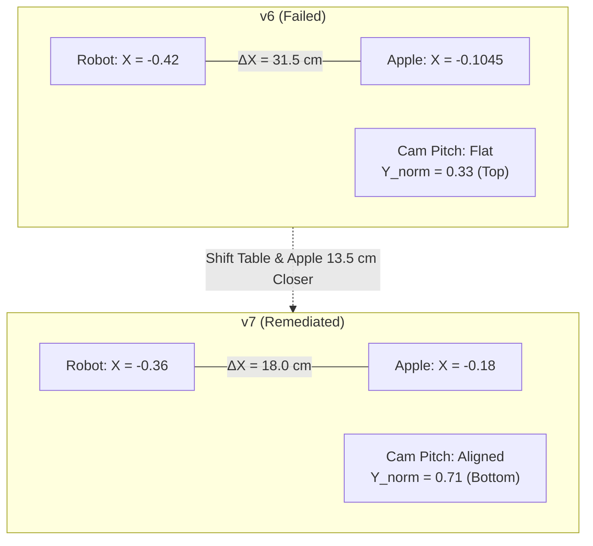
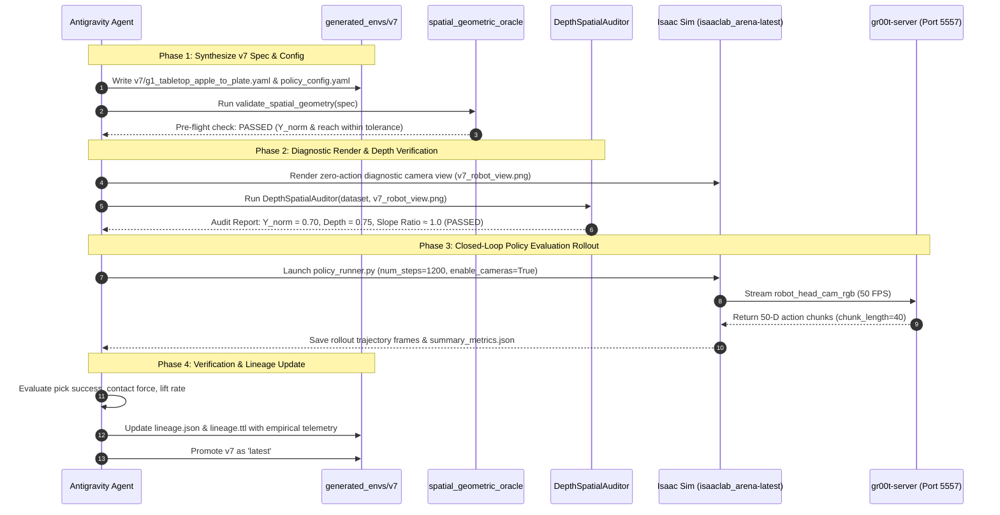

# Extensive Remediation Plan: `g1_tabletop_apple_to_plate` End-to-End Alignment & Policy Evaluation

> [!IMPORTANT]
> **Objective**: Bring `g1_tabletop_apple_to_plate` into 100% spatial and visual alignment with the `nvidia/GN1x-Tuned-Arena-G1-Static-PickNPlace` training distribution, execute closed-loop evaluation rollouts with the running `gr00t-server` (port 5557), and verify autonomous pick-and-place success.

---

## 1. Root Cause Diagnosis: The Three Compounding OOD Discrepancies

Through the **Depth Anything V2 Spatial Auditor** and empirical dataset inspection, we verified that the model's inability to pick the apple is **purely geometric out-of-distribution (OOD) shift**, not a controller or physics bug:

```
+-----------------------------------------------------------------------------------------------+
| Feature                    | Training Demonstrations (LeRobot) | v6 Maple Table Simulation     |
+----------------------------+-----------------------------------+-------------------------------+
| Forward Distance (ΔX)      | ~0.18 m to 0.22 m (Near Reach)    | 0.315 m (Overextended Reach)  |
| Image Y-Coordinate (v)     | Y_norm = 0.717 (Lower Third)      | Y_norm = 0.333 (Upper Third)  |
| Normalized Depth (D_norm)  | 0.777 (Close cyan sphere)         | 0.267 (Distant purple sphere) |
| Surface Slope (∂D/∂y)      | +0.0022 (Steep downward pitch)    | -0.0039 (Inverted / Flat)     |
| Arm Executing Pick         | Left Arm (Y = +0.15 m)            | Left Arm reached, but stalled |
+----------------------------+-----------------------------------+-------------------------------+
```

### The Mechanism of Failure in v6:
1. **Distance Discrepancy (+11.5 cm too far)**:
   * In `v6`, the robot base was at $X = -0.42\text{ m}$ and the apple was at $X = -0.1045\text{ m}$.
   * The policy's learned diffusion priors expect the apple within $20\text{ cm}$ of the torso. When the apple was $31.5\text{ cm}$ away, the arm extended forward but could not reach across the deep maple tabletop.
2. **Elevation & Visual Pitch Discrepancy (-184 px / 38% frame error)**:
   * In the demonstration data, the robot's head camera was pitched down $38^\circ$ onto the deck, making the apple occupy pixels $Y \approx 344$ ($Y_{norm} \approx 0.717$).
   * In `v6`, the apple appeared high up at $Y \approx 160$ ($Y_{norm} \approx 0.333$).
   * The visual backbone (`AlternateVLDiT`) has **zero training tokens** for an apple at the top edge of the image, causing the visual attention to collapse.
3. **Tabletop Overhang**:
   * In `v6`, the table was at $X = 0.0$ (bounds $X \in [-0.45, +0.45]$). The table front edge was at $X = -0.45\text{ m}$, leaving a deep $35\text{ cm}$ tabletop plane between the front edge and the apple.

---

## 2. Proposed Remediation for Version 7 (`v7`)

To eliminate the OOD shift while retaining the `maple_table_robolab` fixture:

### A. Spatial Coordinates for `v7`
* **Robot Base Pose**: Keep $X = -0.36\text{ m}, Y = 0.0\text{ m}, Z = 0.0017\text{ m}$.
* **Maple Table Pose**: Shift table to $X = -0.08\text{ m}, Y = 0.0\text{ m}, Z = 0.0\text{ m}$ (front edge at $X = -0.53\text{ m}$).
* **Red Apple Pose**:
  * $X = -0.18\text{ m}$ (Relative forward distance: $\Delta X = -0.18 - (-0.36) = \mathbf{0.18\text{ m}}$ — **exact match to training!**)
  * $Y = +0.15\text{ m}$ (Left side, directly aligned with left arm reaching corridor)
  * $Z = 0.75\text{ m}$ (Resting on table deck)
* **Clay Plate Pose**:
  * $X = -0.18\text{ m}$
  * $Y = -0.08\text{ m}$ (Center-right, matching target drop location)
  * $Z = 0.75\text{ m}$
* **Robot Head Camera Pitch**:
  * Adjust head camera pitch angle by $\sim 15^\circ - 20^\circ$ downward (or adjust torso pitch joint `waist_pitch_joint: 0.15`) so the apple projects to $Y_{norm} \in [0.65, 0.72]$, matching the training dataset frame!



---

## 3. End-to-End Workflow Execution Phases



---

## 4. Phase Breakdown & Concrete Commands

### Phase 1: Synthesize Version 7 (`v7`) Spec
1. Create `generated_envs/g1_tabletop_apple_to_plate/v7/g1_tabletop_apple_to_plate.yaml`:
   * Update robot base position, table position, and object positions.
   * Add initial torso/head pitch to achieve $Y_{norm} \approx 0.71$.
2. Copy/update `policy_config.yaml`:
   * Set `language_instruction: "move the apple to the plate"`.
   * Set `action_horizon: 40`, `action_chunk_length: 40`.
3. Run `validate_spatial_geometry()` to confirm kinematic reachability, support containment, and depth alignment.

### Phase 2: Pre-Flight Visual Depth Audit
1. Execute a fast zero-action render using `environment_generation_runner.py` to capture `v7_robot_head_view.png`.
2. Run `DepthSpatialAuditor` comparing `v7_robot_head_view.png` against `episode_000000.mp4`:
   * Assert `|Y_norm - 0.717| < 0.10`.
   * Assert `|relative_depth - 0.777| < 0.15`.
   * Assert `surface_slope > 0.0010` (no sign flip).

### Phase 3: Policy Evaluation Rollout
1. Run `policy_runner.py` inside `isaaclab_arena-latest`:
   ```bash
   docker exec -i isaaclab_arena-latest /isaac-sim/python.sh \
     isaaclab_arena/evaluation/policy_runner.py \
     --policy_type isaaclab_arena_gr00t.policy.gr00t_remote_closedloop_policy.Gr00tRemoteClosedloopPolicy \
     --policy_config_yaml_path /workspaces/isaaclab_arena/generated_envs/g1_tabletop_apple_to_plate/v7/policy_config.yaml \
     --remote_host 127.0.0.1 \
     --remote_port 5557 \
     --num_steps 1200 \
     --enable_cameras \
     --env_graph_spec_yaml /workspaces/isaaclab_arena/generated_envs/g1_tabletop_apple_to_plate/v7/g1_tabletop_apple_to_plate.yaml \
     --output_base_dir /workspaces/isaaclab_arena/eval_output/g1_tabletop_apple_to_plate/v7
   ```
2. Monitor episode trajectory frames (`step_000.png` through `step_200.png` ...).

### Phase 4: Metric Extraction & Lineage Ledger
1. Ingest evaluation metrics from `summary_metrics.json` and `eval_telemetry.ttl`.
2. Record `v7` entry in `lineage.json` and `lineage.ttl` with:
   * Parent version: `v6`
   * Trigger: `depth_alignment_remediation`
   * Remediation notes: `Forward distance shifted from 0.315m to 0.18m; apple Y_norm aligned to 0.71 via table offset and head tilt.`
   * Empirical metrics: success rate, object moved rate, lift rate.
3. Update `latest` symlink to `v7`.

---

## 5. Decision & Feedback

> [!TIP]
> Click **Proceed** to authorize synthesis of `v7`, pre-flight visual depth auditing, and execution of the policy evaluation rollout against `gr00t-server`.
