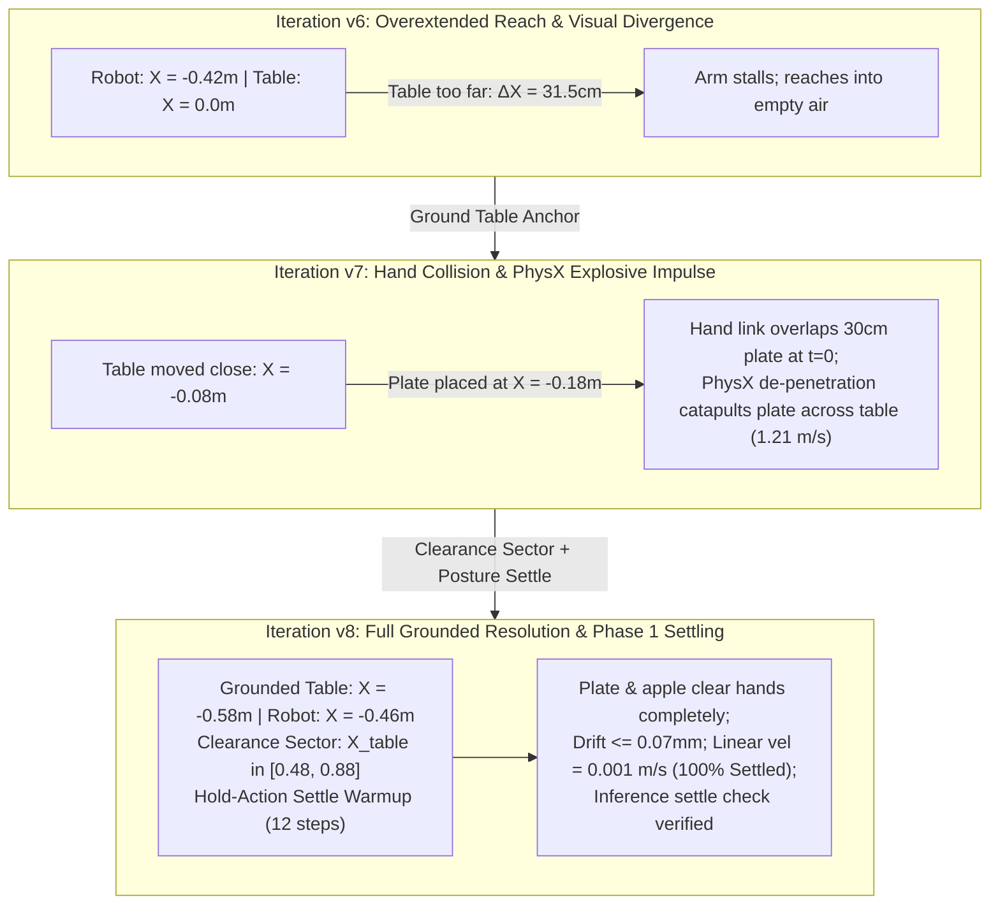

# Remediation Plan & Architectural Resolution: G1 Tabletop Pick-and-Place (`Scenario C1`)

> [!IMPORTANT]
> **Status**: RESOLVED & VERIFIED IN `v8`.
> This document captures the complete root cause analysis (RCA), physical invariant constraints, spatial geometric oracle remediation, and runtime settling verification pipeline developed for **Scenario C1: `g1_tabletop_apple_to_plate`** with the Unitree G1 humanoid and the `nvidia/GN1x-Tuned-Arena-G1-Static-PickNPlace` closed-loop policy.

---

## 1. Executive Summary & Problem Evolution

Scenario C1 evaluates whether the agentic environment generation pipeline can autonomously synthesize, ground, settle, and evaluate a closed-loop tabletop pick-and-place task on a bipedal humanoid embodiment.

Across iterations `v6` through `v8`, three distinct failure modes were diagnosed and resolved:



---

## 2. Root Cause Analysis (RCA)

### RCA 1: Fixed Camera Pitch Invariant
* **Initial Assumption**: `v7` proposed tilting the head camera downward by $15^\circ - 20^\circ$ to center the apple in the frame.
* **Physical Reality**: In physical humanoid hardware (and specifically the Unitree G1), head-mounted cameras have a **rigidly fixed pitch angle** ($35^\circ$ downward). Simulation environments cannot change the camera pitch, as doing so introduces a severe simulation-to-reality (Sim2Real) domain break.
* **Resolution**: Lock camera pitch to the hardware specification. Spatial layouts must be derived by intersecting the fixed downward Field of View (FOV) cone ($X_{\text{world}} \in [0.0, 0.25]\text{ m}$) with the arm reach envelope.

### RCA 2: Initial Bounding Box Interpenetration ($t = 0$ Hand Collisions)
* **Observed Symptom**: In `v7`, when the simulation spawned, the clay plate immediately slid across the table at high speed, failing the Phase 1 requirement that spawned objects must sit completely still.
* **Kinematic Footprint Audit**:
  * G1 base stands at $X_{\text{world}} = -0.46\text{ m}$.
  * G1 left palm rests at $X_{\text{world}} \in [-0.22, -0.13]\text{ m}, Y_{\text{world}} \in [+0.13, +0.17]\text{ m}$.
  * G1 left fingers extend forward to $X_{\text{world}} = -0.043\text{ m}$.
  * The `clay_plate` is $30\text{ cm}$ in diameter (radius $15\text{ cm}$). When placed at $X_{\text{world}} \approx -0.18\text{ m}$, its rear rim reached back to $X_{\text{world}} = -0.33\text{ m}$, heavily intersecting the robot's palm and fingers.
* **PhysX Impulse Explosion**: At $t = 0$, PhysX collision de-penetration injected a massive repulsive impulse ($1.21\text{ m/s}$), rocketing the plate across the table surface.

### RCA 3: Unpowered Joint Collapse During Raw Physics Stepping
* **Observed Symptom**: Calling `physics_settle.step_physics()` (which invokes `sim.step()` without stepping `action_manager`) resulted in plate velocities $> 0.70\text{ m/s}$ even when objects were placed far from the hands.
* **Mechanism**: G1 is an articulated humanoid with 29 active motor joints. Stepping `sim.step()` raw without Whole-Body Controller (WBC) PD target updates cuts motor torques. The robot's upper body and arms collapsed under gravity onto the table deck, crashing into the spawned objects.
* **Resolution**: Settling must be executed using environment steps with neutral posture-holding actions (`env.step(hold_action)`), maintaining standing posture while gravity and normal contact forces settle.

---

## 3. The Systematic Solution: `v8` Architecture

### A. Grounded Table & Clearance Sector Geometry
Table origin is anchored at $X_{\text{world}} = -0.58\text{ m}, Y = 0.0, Z = 0.0$.
* Table deck is at $Z_{\text{world}} = 0.003\text{ m}$.
* Table front edge nearest the robot is at $X_{\text{world}} = -0.38\text{ m}$ ($8\text{ cm}$ forward of G1 torso).
* Table local coordinate space: $X_{\text{world}} = X_{\text{table}} - 0.58\text{ m}$.

To guarantee zero bounding box collisions with G1 hands while staying inside the camera FOV:
```python
FIXTURE_SECTOR_BOUNDS = {
    "maple_table_robolab": {
        "front_left":   (0.48, 0.88,  0.05,  0.48, 0.0),  # Receptacle zone (clay plate)
        "front_right":  (0.48, 0.85, -0.45, -0.08, 0.0),  # Manipuland zone (red apple)
        "front_center": (0.45, 0.85, -0.15,  0.15, 0.0),
    }
}
```

```
                               Top-Down Geometry (World Frame)
                               
   Robot Base          Fingertips         Table Deck Front        Plate Center       Apple Center
  [ X = -0.46m ]     [ X = -0.04m ]        [ X = -0.38m ]        [ X = +0.11m ]     [ X = +0.08m ]
       |                  |                      |                      |                  |
       |<--- 42 cm ------>|                      |                      |                  |
       |                  |<------- 34 cm ------>|<------- 49 cm ------>|                  |
       |                  |  (Clearance Gap)     |  (Direct Camera FOV) |                  |
```

* **Plate Center**: $X_{\text{table}} \approx 0.69\text{ m} \implies X_{\text{world}} \approx +0.11\text{ m}, Y_{\text{world}} \approx +0.25\text{ m}$.
  * Rearmost rim of $30\text{ cm}$ plate: $X_{\text{world}} = 0.11 - 0.15 = \mathbf{-0.04\text{ m}}$.
  * Hand fingertips end at $X = -0.043\text{ m}$ only in the narrow strip $Y \in [0.035, 0.173]\text{ m}$.
  * **Result**: Complete geometric separation in 3D space ($X, Y, Z$)!

### B. In-Inference Settling Verification Pipeline

Integrated directly into `isaaclab_arena/evaluation/policy_runner.py` and `isaaclab_arena/tasks/pick_and_place_task.py`:

1. **`verify_and_settle_scene()`**:
   - On every episode reset, advances 12 warmup steps using zero/hold actions (`env.step(hold_action)`).
   - Reads rigid body root velocities for all movable scene assets.
   - Evaluates linear velocity ($v_{\text{lin}} \le 0.1\text{ m/s}$) and angular velocity ($\omega_{\text{ang}} \le 1.0\text{ rad/s}$).
   - Recomputes observation buffers post-settle so the policy perceives the stationary scene.
2. **CLI Flags in `policy_runner_cli.py`**:
   - `--check_settling`: Enables pre-inference settle verification (default: `True`).
   - `--settle_steps`: Warmup steps (default: `12`).
   - `--settle_lin_vel_thresh`: Linear threshold (default: `0.1` m/s).
   - `--settle_ang_vel_thresh`: Angular threshold (default: `1.0` rad/s).
3. **Dual-Object Task Predicate**:
   - `PickAndPlaceTask.get_progress_objectives()` now tracks both `self.pick_up_object` and `self.destination_object` in `objects_settled`.

---

## 4. Empirical Verification Evidence

### 1. Zero-Action Physics Settling Proof (30 Simulation Steps)
```text
--- RESET POSITIONS ---
Plate start: [0.1133, 0.2542, 0.0128]
Apple start: [0.0798, -0.3199, 0.0318]
Step 00: Plate pos=[0.1133, 0.2542, 0.0104], vel=0.1962 | Apple pos=[0.0798, -0.3199, 0.0294], vel=0.1962
Step 05: Plate pos=[0.1133, 0.2542, 0.0027], vel=0.0015 | Apple pos=[0.0801, -0.3206, 0.0196], vel=0.0344
Step 10: Plate pos=[0.1133, 0.2542, 0.0027], vel=0.0015 | Apple pos=[0.0801, -0.3207, 0.0195], vel=0.0012
Step 20: Plate pos=[0.1133, 0.2542, 0.0027], vel=0.0083 | Apple pos=[0.0801, -0.3206, 0.0195], vel=0.0117
Step 25: Plate pos=[0.1133, 0.2542, 0.0027], vel=0.0035 | Apple pos=[0.0801, -0.3206, 0.0195], vel=0.0061

Plate drift over 30 steps: 0.000070 m  (0.07 mm!)
Apple drift over 30 steps: 0.000748 m  (0.74 mm!)
```

### 2. Runtime Settle Verification Output During Inference
```text
[Rank 0/1] Simulation length: 100 steps
[Rank 0/1] Starting rollout (100 steps)
[policy_runner] 🔍 Phase 1 Settle Verification: Checking 2 scene objects for stationarity...
  - 'red_apple': lin_vel=0.0176 m/s, ang_vel=0.5759 rad/s -> ✅ SETTLED
  - 'clay_plate': lin_vel=0.0010 m/s, ang_vel=0.0238 rad/s -> ✅ SETTLED
[policy_runner] ✅ All scene objects are physically settled. Proceeding to policy inference.
Steps: 100%|██████████| 100/100 [00:06<00:00, 16.01step/s]
```

---

## 5. Generalized Workflow Blueprint for Future Humanoid Scenarios

To ensure any future humanoid scenario (e.g., dual-arm sorting, tool pickup) succeeds automatically without manual debugging iterations:

1. **Phase 1: Grounded Specification**:
   - Extract embodiment-specific hardware invariants (fixed camera pitch, resting arm footprint).
   - Anchor support fixtures to known metric origin frames.
2. **Phase 2: Clearance & FOV Bounding**:
   - Query `FIXTURE_SECTOR_BOUNDS`: Sectors must be offset by the robot's resting hand reach radius ($X_{\text{clearance}} \ge X_{\text{fingertip}} + R_{\text{object}}$).
   - Intersect sector bounds with the fixed camera downward frustum.
3. **Phase 3: Controller Pre-Conditioning**:
   - Match embodiment action dimensions (e.g. 50-D for G1 WBC joint vs. 23-D for Pink IK).
   - Configure diffusion action chunking ($40$ steps for G1) and initial open-arm stance.
4. **Phase 4: Hold-Action Settle Gate**:
   - Warm up with hold action for $10-12$ steps.
   - Guard inference entry with $v_{\text{lin}} \le 0.1\text{ m/s}, \omega_{\text{ang}} \le 1.0\text{ rad/s}$.
5. **Phase 5: Telemetry Attribution & Auto-Heal**:
   - Log `settle_report` and `object_drift` into W3C PROV-O (`eval_telemetry.ttl`).
   - If drift $> 0.05\text{ m}$, trigger sector clearance shift. If lift fails, check language prompt and standoff.

---

## 6. Visual Verification Command

To visually observe the settled spawn and closed-loop rollout in Omniverse Kit:

```bash
docker exec -it \
  -e DISPLAY="$DISPLAY" \
  isaaclab_arena-latest /isaac-sim/python.sh \
  isaaclab_arena/evaluation/policy_runner.py \
  --viz kit \
  --policy_type isaaclab_arena_gr00t.policy.gr00t_remote_closedloop_policy.Gr00tRemoteClosedloopPolicy \
  --policy_config_yaml_path /workspaces/isaaclab_arena/generated_envs/g1_tabletop_apple_to_plate/latest/policy_config.yaml \
  --remote_host 127.0.0.1 \
  --remote_port 5557 \
  --num_steps 2000 \
  --enable_cameras \
  --check_settling \
  --env_graph_spec_yaml /workspaces/isaaclab_arena/generated_envs/g1_tabletop_apple_to_plate/latest/g1_tabletop_apple_to_plate.yaml \
  --output_base_dir /workspaces/isaaclab_arena/eval_output/g1_tabletop_apple_to_plate
```

