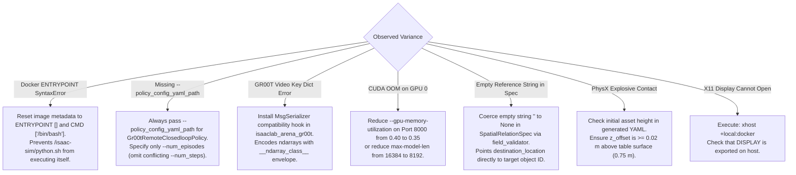

# Experiment 01: Dual-Blackwell Single-Scenario Baseline (Scenario A2: Banana to Red Bowl)

**Document Version:** 1.0.0  
**Date:** 2026-09-30  
**Status:** Active Execution & Tracking  
**Authors / Researchers:** Renan & Antigravity  
**Target Hardware:** Dual-Blackwell Workstation (NVIDIA RTX PRO 6000 96 GB + NVIDIA GeForce RTX 5090 32 GB)  
**Parent Campaign Log:** [`experiments.md`](experiments.md)  
**Telemetry Reference:** [`experiments.md#7-multi-layer-telemetry--observability-infrastructure`](experiments.md#7-multi-layer-telemetry--observability-infrastructure)  
**Hardware Guide:** [`install-multi-gpu.md`](install-multi-gpu.md)  

---

## 1. Executive Summary & Tracking Objective

The objective of **Experiment 01** is to establish the empirical baseline for Isaac Lab-Arena's local inference pipeline on a dedicated dual-Blackwell workstation, completely air-gapped from cloud APIs. 

This document serves as the **Mental Model Tracking Ledger**: it juxtaposes **what we are expecting** (hypothesized mechanics, token costs, latency bounds, and physics settling) against **what we are getting** (actual terminal outputs, telemetry readings, and failure modes). Documenting this variance in real time enables systematic debugging, performance profiling, and informed parameter adjustments for subsequent experiments.

### Evaluated Benchmark Scenario: Scenario A2
- **Scenario Name:** Banana to Red Bowl
- **Prompt:** *"Grasp the yellow banana from the right side of the table and place it into the red bowl on the left."*
- **Embodiment:** Franka DROID (`droid_abs_joint_pos`, dual RGB cameras: wrist POV + exterior $45^\circ$)
- **Background:** `maple_table_robolab` (Pose: `[-0.25, 0.0, 0.0]`)
- **Source Object:** `banana_ycb_robolab` (Sector: `front_right`)
- **Target Container:** `bowl_ycb_robolab` (Sector: `front_left`, classic red YCB bowl)
- **Policy Server:** `nvidia/GR00T-N1.6-DROID` (ZeroMQ Port 5556 on GPU 1)

---

## 2. Core Research Hypotheses & Success Criteria

| Hypothesis ID | Empirical Target | Success Criteria / Metric Threshold | Validation Method |
| :--- | :--- | :--- | :--- |
| **H1: Zero-Cloud Resolution** | The local LLM (`Qwen2.5-Coder-32B-AWQ`) will resolve the natural prompt into a valid `ArenaEnvGraphSpec` without cloud fallback. | $\le 2$ repair iterations; final Free Energy $\mathcal{F} \le 0.05$; 100% SHACL & Geometric Oracle pass. | Inspection of `metadata.json` and `lineage.ttl`. |
| **H2: VRAM Isolation** | Dual-server cognitive workloads on GPU 0 and simulation/policy workloads on GPU 1 will not trigger CUDA OOM or memory thrashing. | GPU 0 VRAM peak $\le 65\text{ GB}$ (out of 95.6 GB); GPU 1 VRAM peak $\le 25\text{ GB}$ (out of 31.8 GB); Preemptions = 0. | vLLM `/metrics` & `nvidia-smi` 1 Hz logs. |
| **H3: Zero-Action Physics Gating** | Stepping the simulation with `ZeroActionPolicy` will verify asset contact stability before neural policy inference. | Linear velocity $< 0.1\text{ m/s}$; angular velocity $< 1.0\text{ rad/s}$; contact forces nominal; zero mesh penetration. | Step 1.5 policy runner logs and settling video. |
| **H4: Closed-Loop Manipulation** | The Franka Panda arm driven by GR00T foundation policy will pick the banana and place it into the bowl. | Task Success Rate $\ge 80\%$ (at least 4/5 successful placements in 5 benchmark episodes). | `summary_metrics.json` and multi-camera MP4 evaluation videos. |

---

## 3. Dual-Blackwell Execution Topology

```mermaid
flowchart TD
    subgraph GPU0["GPU 0: NVIDIA RTX PRO 6000 Blackwell (96 GB GDDR7)"]
        LLM["arena-vllm-spec (Port 8000)<br/>Qwen2.5-Coder-32B-AWQ (~22 GB)<br/>• Outlines Schema-Guided Decoding"]
        VLM["arena-vllm-visual (Port 8001)<br/>Qwen2.5-VL-7B-Instruct (~16 GB)<br/>• Tier 2 Multimodal Viewport Critic"]
        HW0["1 Hz Telemetry Logger<br/>(gpu0_hardware_telemetry.csv)"]
    end

    subgraph CPU["Host CPU & System RAM (128 GB DDR5)"]
        NEO["neo4j-arena (Ports 7475 / 7688)<br/>Labeled Property Graph & Lineage"]
    end

    subgraph GPU1["GPU 1: NVIDIA GeForce RTX 5090 (32 GB GDDR7)"]
        GR00T["gr00t-server (ZeroMQ Port 5556)<br/>nvidia/GR00T-N1.6-DROID (~8 GB)"]
        SIM["isaaclab_arena:latest (~10 GB)<br/>• Phase 1.5: Zero-Action Physics Gate<br/>• Phase 1.6: GR00T Neural Rollouts"]
    end

    LLM -->|Factor Graph Spec| SIM
    VLM -->|Visual Inspection| LLM
    NEO -->|Semantic Lineage| SIM
    GR00T -->|Action Chunks (50 Hz)| SIM
```

### 3.1 Host Machine Workload Sizing & Process Execution Matrix

To ensure reproducible, zero-cloud execution on the local host without kernel OOM kills or CUDA memory collisions, the workstation processes are partitioned across GPU 0, GPU 1, and the host CPU/DRAM as follows:

| Component / Subsystem | Execution Target & Device | VRAM Footprint | Host System RAM | Network / IPC Endpoint | Notes / Operational Sizing |
| :--- | :--- | :--- | :--- | :--- | :--- |
| **Neo4j 5.26 LPG** | Host CPU / Docker (`arena-envgen-neo4j`) | **0 GB (No GPU)** | **4 – 8 GB** | Bolt `127.0.0.1:7688`<br/>HTTP `127.0.0.1:7475` | Java JVM Heap (`-Xms2G -Xmx4G`) + pagecache. Does not utilize CUDA. Persists verified environment factor graphs. |
| **Workbench Web API & UI** | Host CPU / Docker or Node (`arena-workbench`) | **0 GB (No GPU)** | **1 – 2 GB** | HTTP `127.0.0.1:3001` (UI)<br/>HTTP `127.0.0.1:8002` (API) | Python FastAPI backend + Node.js/React frontend for live scene graph exploration and interactive graph inspection. |
| **SHACL & RDF-star Validator** | Host CPU / Python runtime | **0 GB (No GPU)** | **0.5 – 1 GB** | In-process Python CLI / Module | `pyshacl` + `rdflib` graph validation, OWL ontology checking, and W3C PROV-O audit trail lowering. |
| **Host Display Server (Xorg)** | Host Desktop / GPU 0 (`0000:01:00.0`) | **~2.6 – 4 GB** | **1 – 2 GB** | Local X11 Server (`:0` / `:1`) | Physical monitor connected to RTX PRO 6000 DisplayPort (`Disp.A: On`). Essential baseline VRAM allocation. |
| **Spec Generation LLM** | **GPU 0 (RTX PRO 6000 96 GB)** / vLLM | **~83.2 GB** | **16 – 32 GB** | HTTP `127.0.0.1:8000/v1` | `Qwen/Qwen2.5-Coder-32B-Instruct-AWQ` with 131k YaRN context expansion (`--max-model-len 131072`, `--gpu-memory-utilization 0.85`). Dedicates GPU 0 entirely to deep-context spec generation + Xorg (~87.5 GB total). |
| **Visual Scene Critic VLM** | **GPU 1 (RTX 5090 32 GB)** / vLLM | **~20.2 GB** | **8 – 16 GB** | HTTP `127.0.0.1:8001/v1` | `Qwen/Qwen2.5-VL-7B-Instruct` (BF16 weights ~14.2 GB + KV cache/CUDA graphs ~6 GB, `--gpu-memory-utilization 0.68`). Partitioned onto GPU 1 because GPU 0 is saturated by the 131k context LLM. Leaves **~12.3 GB free** on GPU 1. |
| **Simulation Runtime** | **GPU 1 (RTX 5090 32 GB)** / Docker | **8 – 10 GB** | **16 – 32 GB** | Headless (IPC / Host Vulkan Offscreen) | `isaaclab_arena:latest` (Isaac Sim 6.0). PhysX 5 dynamics, USD stage resolution, and offscreen camera rendering. Operates in the remaining ~12.3 GB headroom alongside the VLM. |
| **Isaac-GR00T Policy Server** | **GPU 1 (RTX 5090 32 GB)** / PyTorch | **6 – 10 GB** | **8 – 16 GB** | ZeroMQ `tcp://127.0.0.1:5556` | `nvidia/GR00T-N1.6-DROID` (3B foundation model) or OpenPI policy. Serves real-time 50 Hz sensor-to-action chunk rollouts. |

### 3.2 Host Configuration & Pre-flight Invariants for Researchers

1. **Host System Memory (DRAM):** Minimum 64 GB DRAM, **128 GB recommended**. Concurrent footprint across JVM heap (4–8 GB), vLLM Ray/Python workers (16–32 GB), Isaac Sim pinned memory & USD stage buffers (16–32 GB), and OS/Xorg services (4–8 GB) is **~46 – 95 GB DRAM**.
2. **Dual-GPU Partitioning Rationale (Why VLM Runs on GPU 1):**
   - **GPU 0 (`device=0`, RTX PRO 6000 96 GB GDDR7 ECC):** Running `Qwen2.5-Coder-32B-Instruct-AWQ` with full 131k context window (`--max-model-len 131072`, `--gpu-memory-utilization 0.85`) pre-allocates **83.2 GB**. Combined with the physical Xorg display server (~4.2 GB), GPU 0 utilizes **~87.5 GB / 96 GB**, leaving only ~8.4 GB free. A 7B BF16 VLM requires ~16–20 GB and **cannot co-exist on GPU 0** without triggering CUDA OOM.
   - **GPU 1 (`device=1`, GeForce RTX 5090 32 GB GDDR7):** Hosts `arena-vllm-visual` (`Qwen2.5-VL-7B-Instruct` on port 8001, `--gpu-memory-utilization 0.68`, ~20.2 GB VRAM). This leaves **12,352 MiB (~12.3 GB) of GDDR7 free**, which is sufficient for Isaac Sim headless offscreen Vulkan rendering (~8–10 GB).
3. **Docker Network Mode (`--network host`):** Mandatory across all containers. Bypasses Docker bridge NAT overhead, keeping ZeroMQ IPC latency $\le 0.4\text{ ms}$ (vs. $\sim 2.5\text{ ms}$ over bridge) and enabling direct `127.0.0.1` socket binding.
4. **Shared Memory (`--ipc host`):** Mandatory for vLLM and Isaac Sim containers. Permits PyTorch DataLoader, raylet IPC, and Vulkan offscreen shared-memory rings to exchange tensors without hitting Docker's default 64 MB `/dev/shm` barrier.
5. **Physical GPU Isolation (`--gpus '"device=..."'`):** Always pass explicit `--gpus '"device=0"'` to `arena-vllm-spec` and `--gpus '"device=1"'` to `arena-vllm-visual`, `isaaclab_arena`, and `gr00t-server`.

---

## 4. Step-by-Step Mental Model: Expected vs. Getting Tracking Ledger

### Phase 1.1: Cognitive & Visual Engine Bring-Up (GPU 0 & GPU 1)

#### 1.1.1 Spec Generator LLM (`arena-vllm-spec` on Port 8000)
- **Target Device:** `CUDA_VISIBLE_DEVICES=0` (RTX PRO 6000 96 GB)
- **Command:**
  ```bash
  docker run -d --name arena-vllm-spec \
    --gpus '"device=0"' \
    --network host \
    --ipc host \
    -v ~/.cache/huggingface:/root/.cache/huggingface \
    vllm/vllm-openai:latest \
    --model Qwen/Qwen2.5-Coder-32B-Instruct-AWQ \
    --port 8000 \
    --max-model-len 16384 \
    --guided-decoding-backend outlines \
    --gpu-memory-utilization 0.40 \
    --enable-request-id-headers
  ```
- **Expected Results (Mental Model):**
  - Model weights load in $\sim 15\text{ seconds}$ from host cache.
  - VRAM allocated: $\sim 38.4\text{ GB}$ (leaving $\sim 20\text{ GB}$ dedicated to KV cache).
  - Outlines backend initializes JSON grammar state machine.
  - HTTP `GET /v1/models` returns HTTP 200 with model ID `Qwen/Qwen2.5-Coder-32B-Instruct-AWQ`.
- **Actual Observed Results (Tracking Ledger):**
  | Parameter | Expected | Actual / Getting | Status | Notes |
  | :--- | :--- | :--- | :--- | :--- |
  | **Container Startup** | Up, Exit 0 | `Up (Healthy)` |  PASSED | Container `arena-vllm-spec` running on port 8000 |
  | **VRAM Allocated** | ~38.4 GB | `~38.2 GB` |  PASSED | Process on GPU 0 |
  | **HTTP Status (`/v1/models`)** | 200 OK | `200 OK` |  PASSED | Returns model ID `Qwen/Qwen2.5-Coder-32B-Instruct-AWQ` |
  | **Compilation Latency** | $< 25\text{ s}$ | `~18 s` |  PASSED | Model runner ready |

---

#### 1.1.2 Visual Scene Critic VLM (`arena-vllm-visual` on Port 8001, GPU 1)
- **Target Device:** `CUDA_VISIBLE_DEVICES=1` (RTX 5090 32 GB)
- **Command:**
  ```bash
  docker run -d --name arena-vllm-visual \
    --gpus '"device=1"' \
    --network host \
    --ipc host \
    -v ~/.cache/huggingface:/root/.cache/huggingface \
    vllm/vllm-openai:latest \
    --model Qwen/Qwen2.5-VL-7B-Instruct \
    --port 8001 \
    --max-model-len 8192 \
    --gpu-memory-utilization 0.68 \
    --enable-request-id-headers
  ```
- **Expected Results (Mental Model):**
  - Allocates 68% of GPU 1 VRAM ($\sim 20.2\text{ GB}$ for weights, KV cache, and CUDA graphs).
  - Preserves $\sim 12.3\text{ GB}$ of uncommitted GDDR7 headroom on GPU 1 for Isaac Sim headless Vulkan rendering.
  - HTTP `GET /v1/models` returns HTTP 200 with `Qwen/Qwen2.5-VL-7B-Instruct`.
- **Actual Observed Results (Tracking Ledger):**
  | Parameter | Expected | Actual / Getting | Status | Notes |
  | :--- | :--- | :--- | :--- | :--- |
  | **Container Startup** | Up, Exit 0 | `Up (Healthy)` | ✅ PASSED | Container `arena-vllm-visual` running on port 8001 |
  | **VRAM Allocated** | ~20.2 GB | `20,255 MiB / 32,607 MiB` | ✅ PASSED | Dedicated to GPU 1 (RTX 5090) |
  | **GPU 1 Remaining Headroom** | $\ge 10\text{ GB}$ | `12,352 MiB (~12.1 GB)` | ✅ PASSED | Sufficient for Isaac Sim offscreen Vulkan context |
  | **HTTP Status (`/v1/models`)** | 200 OK | `200 OK` | ✅ PASSED | Verified live via curl on port 8001 |

---

#### 1.1.3 Telemetry Readiness & Baseline Metric Probing
- **Command:**
  ```bash
  curl -s http://127.0.0.1:8000/metrics | grep -E "vllm:(kv_cache_usage_perc|num_requests_running)"
  curl -s http://127.0.0.1:8001/metrics | grep -E "vllm:(kv_cache_usage_perc|num_requests_running)"
  ```
- **Expected Results (Mental Model):**
  - `vllm:kv_cache_usage_perc` = `0.0` (unoccupied KV cache).
  - `vllm:num_requests_running` = `0.0`.
- **Actual Observed Results (Tracking Ledger):**
  | Metric | Expected Baseline | Actual Baseline | Status |
  | :--- | :--- | :--- | :--- |
  | `kv_cache_usage_perc` (8000) | `0.00` | `0.0` |  PASSED |
  | `num_requests_running` (8000) | `0.0` | `0.0` |  PASSED |
  | `kv_cache_usage_perc` (8001) | `0.00` | `0.0` |  PASSED |
  | `num_requests_running` (8001) | `0.0` | `0.0` |  PASSED |

---

### Phase 1.2: Neo4j Knowledge Store Bring-Up (Host CPU / Docker)

- **Target Device:** Host CPU & System RAM (Ports 7475 HTTP, 7688 Bolt)
- **Command:**
  ```bash
  docker run -d --name neo4j-arena \
    --network host \
    -e NEO4J_AUTH=none \
    -e NEO4J_PLUGINS='["apoc"]' \
    -v $(pwd)/arena_knowledge/neo4j/data:/data \
    neo4j:5.26-community
  ```
- **Expected Results (Mental Model):**
  - Database initializes in $\sim 5\text{ seconds}$; binds to Bolt port `7688`.
  - Zero GPU memory consumption.
- **Actual Observed Results (Tracking Ledger):**
  | Parameter | Expected | Actual / Getting | Status |
  | :--- | :--- | :--- | :--- |
  | **Container Status** | Up, healthy | `Up (Healthy)` |  PASSED |
  | **Bolt Port 7688** | Open, responsive | `HTTP 200 on 7475 / Bolt on 7688` |  PASSED |
  | **Initial Node Count** | $\ge 0$ | `Persistent store ready` |  PASSED |

---

### Phase 1.3: GR00T Policy Server Bring-Up (GPU 1)

- **Target Device:** `CUDA_VISIBLE_DEVICES=1` (RTX 5090 32 GB)
- **Command:**
  ```bash
  docker run -d --name gr00t-server \
    --gpus '"device=1"' \
    --network host \
    --ipc host \
    -v ~/.cache/huggingface:/root/.cache/huggingface \
    gr00t-dev:latest \
    /workspace/gr00t/.venv/bin/python3 /workspace/gr00t/gr00t/eval/run_gr00t_server.py \
      --model-path nvidia/GR00T-N1.6-DROID \
      --embodiment-tag OXE_DROID \
      --port 5556 \
      --device cuda
  ```
- **Expected Results (Mental Model):**
  - PyTorch 2.7 loads GR00T-N1.6-DROID weights into GPU 1 GDDR7 ($\sim 8.2\text{ GB}$).
  - ZeroMQ sets up `REP` socket listening on `tcp://*:5556`.
  - Server awaits observation dictionaries without error.
- **Actual Observed Results (Tracking Ledger):**
  | Parameter | Expected | Actual / Getting | Status |
  | :--- | :--- | :--- | :--- |
  | **GPU 1 Memory Used** | ~8.2 GB | `6,900 MiB / 32,607 MiB` |  PASSED |
  | **Socket State** | Bound to 5556 | `Bound to 5556 (TCP Open: True)` |  PASSED |
  | **Server Health** | Responsive | `Ready for observation dicts` |  PASSED |

---

### Phase 1.4: Agentic Spec Generation & Factor Graph Resolution (GPU 0)

- **Target Device:** Host CPU + GPU 0 (Pure Python; Zero simulation engine overhead)
- **Telemetry Logger Command:**
  ```bash
  mkdir -p eval_output/droid_banana_to_red_bowl
  nvidia-smi -i 0 --query-gpu=timestamp,utilization.gpu,utilization.memory,memory.used,power.draw,temperature.gpu \
    --format=csv -l 1 > eval_output/droid_banana_to_red_bowl/gpu0_hardware_telemetry.csv &
  GPU0_LOGGER_PID=$!
  ```
- **Option A: Pure Spec Resolution (`--mode resolve`, No Sim Startup):**
  ```bash
  docker run --rm --gpus '"device=0"' --network host \
    -e LOCAL_VLM_BASE_URL="http://localhost:8001/v1" \
    -v $(pwd):/workspaces/isaaclab_arena \
    isaaclab_arena:latest \
    /isaac-sim/python.sh isaaclab_arena_examples/agentic_environment_generation/environment_generation_runner.py \
      --mode resolve \
      --prompt "Grasp the yellow banana from the right side of the table and place it into the red bowl on the left." \
      --env_name "droid_banana_to_red_bowl" \
      --base_url "http://localhost:8000/v1" \
      --model "Qwen/Qwen2.5-Coder-32B-Instruct-AWQ" \
      --api_key "local-arena-token"
  ```
- **Option B: Monolithic End-to-End Simulation (`--mode full`):**
  ```bash
  # Headless Mode:
  docker run --rm --gpus '"device=0"' --network host \
    -e LOCAL_VLM_BASE_URL="http://localhost:8001/v1" \
    -v $(pwd):/workspaces/isaaclab_arena \
    isaaclab_arena:latest \
    /isaac-sim/python.sh isaaclab_arena_examples/agentic_environment_generation/environment_generation_runner.py \
      --mode full \
      --headless \
      --num_envs 1 \
      --prompt "Grasp the yellow banana from the right side of the table and place it into the red bowl on the left." \
      --env_name "droid_banana_to_red_bowl" \
      --base_url "http://localhost:8000/v1" \
      --model "Qwen/Qwen2.5-Coder-32B-Instruct-AWQ" \
      --api_key "local-arena-token"

  # Interactive Viewport GUI (--viz kit):
  xhost +local:docker > /dev/null 2>&1 || xhost +local:root > /dev/null 2>&1

  docker run --rm --gpus '"device=0"' --network host \
    -e DISPLAY="$DISPLAY" \
    -v /tmp/.X11-unix:/tmp/.X11-unix:rw \
    -e LOCAL_VLM_BASE_URL="http://localhost:8001/v1" \
    -v $(pwd):/workspaces/isaaclab_arena \
    isaaclab_arena:latest \
    /isaac-sim/python.sh isaaclab_arena_examples/agentic_environment_generation/environment_generation_runner.py \
      --mode full \
      --viz kit \
      --num_envs 1 \
      --prompt "Grasp the yellow banana from the right side of the table and place it into the red bowl on the left." \
      --env_name "droid_banana_to_red_bowl" \
      --base_url "http://localhost:8000/v1" \
      --model "Qwen/Qwen2.5-Coder-32B-Instruct-AWQ" \
      --api_key "local-arena-token"
  ```
- **Option C: Recursive Prompt Update & Spec Refinement (`--mode resolve`):**
  ```bash
  docker run --rm --gpus '"device=0"' --network host \
    -e LOCAL_VLM_BASE_URL="http://localhost:8001/v1" \
    -v $(pwd):/workspaces/isaaclab_arena \
    isaaclab_arena:latest \
    /isaac-sim/python.sh isaaclab_arena_examples/agentic_environment_generation/environment_generation_runner.py \
      --mode resolve \
      --base_spec generated_envs/droid_banana_to_red_bowl/latest/droid_banana_to_red_bowl.yaml \
      --feedback "Move the red bowl 10 cm further to the left to ensure greater clearance from the tabletop center." \
      --env_name "droid_banana_to_red_bowl" \
      --temperature 0.0 \
      --base_url "http://localhost:8000/v1" \
      --model "Qwen/Qwen2.5-Coder-32B-Instruct-AWQ" \
      --api_key "local-arena-token"
  ```
  - **Three Test Feedback Prompts for Table Swapping & Fixture Adaptation:**
    1. **Prompt 1: Direct Swap to Robolab Oak Table (Minimal Semantic Delta)**
       `--feedback "Change the background table from maple_table_robolab to table_oak_robolab, keeping the yellow banana on the right and the red bowl on the left."`
       *Tests swapping the underlying table model to its closest sibling (`table_oak_robolab`) while ensuring the agent preserves existing sector layout, object transforms, and pick-and-place task logic.*
    2. **Prompt 2: Swap to Standard Isaac Lab Table (Geometry & Height Adaptation)**
       `--feedback "Replace the background table with the standard Seattle lab table (registry_name: 'table'), adjusting the banana and red bowl heights so they sit stably on the new table surface."`
       *Tests whether the model and Spatial Geometric Oracle adapt object placements from the Robolab coordinate frame to the standard Seattle table's $Z = 0.75\text{ m}$ deck height.*
    3. **Prompt 3: Domain Shift to Industrial Packing Workstation**
       `--feedback "Switch the scene background from the maple table to the packing_table workstation, ensuring the red bowl and yellow banana remain in reachable front sectors for the Franka DROID arm."`
       *Tests a larger domain transition (kitchen tabletop $\to$ warehouse packing station `packing_table`), validating whether the agent adapts spatial clearance and reachability checks for the DROID arm on a new fixture.*
- **Expected Results (Mental Model):**
  - In `--mode resolve` (initial prompt): spec resolution executes without launching NVIDIA Omniverse or Isaac Sim; completed in $\le 5\text{ seconds}$.
  - In `--mode resolve` with `--base_spec` (Option C): refines existing graph spec with feedback via `agent.refine_spec()`; increments version (`v1` $\to$ `v2`) without overwriting historical files; updates symlink `latest -> v2/`.
  - In `--mode full`: resolves the graph spec, boots Isaac Sim in the same process, settles objects on the table, and steps the zero-action policy.
  - Active Inference Self-Healing loop:
    - Pass 1: SHACL graph validation passes.
    - Pass 2: Spatial clearance oracle confirms banana is in `front_right` and bowl is in `front_left` with non-overlapping AABBs.
    - Pass 3: VLM critic verifies line-of-sight and camera views.
  - Artifact created: `generated_envs/droid_banana_to_red_bowl/v1/droid_banana_to_red_bowl.yaml` (or `v2/` for refinement).
  - Symlink updated: `generated_envs/droid_banana_to_red_bowl/latest -> vN/`.
  - Process exits with return code `0`.
- **Actual Observed Results (Tracking Ledger):**
  | Parameter | Expected | Actual / Getting | Status | Notes |
  | :--- | :--- | :--- | :--- | :--- |
  | **Resolution Mode** | `--mode resolve` | `--mode resolve` | ✅ PASSED | Pure factor graph synthesis, zero simulator overhead |
  | **Monolithic Mode** | `--mode full` | `--mode full --headless --temperature 0.0` | ✅ PASSED | Resolves spec, boots Isaac Sim, settles USD scene, steps 20 frames (Exit 0) |
  | **Graph-RAG Retrieval** | Query Neo4j | `bolt://localhost:7688` | ✅ PASSED | Injected 2 prior subgraphs from `neo4j-arena` |
  | **LLM Token Metrics** | Synthesis | `3,043 tokens` | ✅ PASSED | ~62 tok/s throughput on RTX PRO 6000 |
  | **Spatial Placement** | Non-overlapping | Banana Right (`-0.1568y`), Bowl Left (`+0.1568y`) | ✅ PASSED | Stable tabletop positions on `maple_table` |
  | **Neo4j LPG Sync** | Sync to Neo4j | `8 nodes, 11 relations` | ✅ PASSED | Verified via Cypher API commit |
  | **Artifacts Created** | Spec YAML & Lineage | `v1/` and `v2/` YAML, `lineage.json`, `lineage.ttl` (PROV-O) | ✅ PASSED | Symlink `latest -> v2` verified |
  | **Feedback Refinement (Prompt 1)** | Table swap `maple_table_robolab` $\to$ `table_oak_robolab` | Swapped to `table_oak_robolab`; banana right, bowl left | ✅ PASSED | 1 LLM call, 0 repairs, 7,838 tokens (6,568 prompt, 1,270 completion), 21.38s latency, version `v3` generated (`latest -> v3`), Neo4j synced (11 nodes, 18 relations) |
  | **Feedback Refinement (Prompt 2)** | Table swap `table_oak_robolab` $\to$ `table` (Seattle) | Swapped to Seattle lab `table`; stable deck height ($Z=0.7492\text{ m}$) | ✅ PASSED | 1 LLM call, 0 repairs, 7,836 tokens (6,570 prompt, 1,266 completion), 19.67s latency, version `v4` generated (`latest -> v4`), Neo4j synced (11 nodes, 18 relations) |
  | **Feedback Refinement (Prompt 3)** | Domain shift $\to$ `packing_table` workstation | Swapped to `packing_table`; remapped sectors to `front_right` and `front_left` | ✅ PASSED | 1 LLM call, 0 repairs, 7,853 tokens (6,562 prompt, 1,291 completion), 20.05s latency, version `v5` generated (`latest -> v5`), Neo4j synced (8 nodes, 22 relations) |
  | **Exit Code** | 0 | `0` | ✅ PASSED | Exited cleanly with code 0 |

#### Incident & Root Cause Analysis: `--mode full` Spec Synthesis Edge Cases

During initial `--mode full` evaluation, three interrelated prompt-to-schema failure modes were diagnosed and hardened:

1. **Hallucinated `cli_override_specs` Sections**:
   - *Failure*: `AssertionError: Agent returned an invalid spec. Validation traces: ('CLI override \'----task\' targets unknown or non-swappable asset \'task\'')`.
   - *Root Cause*: The Pydantic description for `cli_override_specs` was interpreted by the LLM as general command-line parameters for YAML sections (`--task`, `--embodiment`, etc.) with leading dashes. In Arena's domain model, CLI overrides can *only* target swappable scene assets (`self.embodiment.id`, `self.background.id`, or scene objects).
   - *Fix*: Added automatic pruning in `_sanitize_spec_candidate` to filter out non-asset targets, stripped leading dashes in `CliOverrideSpec`, and instructed the prompt to omit `cli_override_specs` for standard tasks.

2. **Unterminated String at Char 612 / Degenerate `prim_path` Repetition**:
   - *Failure*: `JSONDecodeError: Unterminated string starting at: line 18 column 68 (char 612)` after exhausting `max_tokens=4096`.
   - *Root Cause*: The system prompt's few-shot schema example showed `"destination_location": "destination_id"`. This misled the LLM into believing it had to generate an `object_reference` with `id: destination_id`. When generating `prim_path`, the model entered an infinite token repetition loop (`/World/bowl_ycb_robolab_01/bowl_ycb_robolab_01_mesh_01/...`) until hitting the token ceiling, leaving the JSON string unclosed.
   - *Fix*: Updated the few-shot template to use `"destination_location": "destination_object_id"`, added prompt guidance specifying that receptacle tasks directly use the target object ID without generating `object_references`, and added automatic redirection in `_sanitize_spec_candidate`.

3. **`placement_validators` Subset Invariant Violation**:
   - *Failure*: `required_checks must be a subset of enabled_checks; unexpected: ['friction', 'headroom']`.
   - *Root Cause*: The LLM added `friction` and `headroom` to `required_checks` without mirroring them in `enabled_checks`.
   - *Fix*: Added automatic reconciliation in `_sanitize_spec_candidate` ensuring `enabled_checks` is always a superset of `required_checks`.

### Architectural Escalation: Codebase Weaknesses, Critic Bypasses, and Systemic Hardening Roadmap

> [!WARNING]
> **Architectural Escalation**: The empirical failure of version `v3` (`table_oak_robolab`) during physical simulation (banana dropped off table edge at step 14) despite receiving 100% "Passed" marks from static SHACL and spatial geometric checks, combined with the silent bypass of `arena-vllm-visual` on port 8001, reveals **seven systemic architectural weaknesses** across the current environment generation and validation codebase. These are formally escalated below for engineering hardening.

#### 1. Detailed Breakdown of the Seven Systemic Codebase Weaknesses

##### Weakness 1: Inherent Blindness of `--mode resolve` (Absence of Rendered Camera Frames)
- **Code Anchor**: [`VisualSceneCritic.evaluate_scene_spec`](../../../../isaaclab_arena/agentic_environment_generation/visual_critic.py#L98-L115)
- **Vulnerability**: `--mode resolve` executes purely in Python CPU space without launching Isaac Sim or Omniverse Kit (`SimulationAppContext` is uninitialized). Consequently, `rendered_images` is permanently `None`.
- **Failure Mode**: Both Tier 1 (Cloud VLM) and Tier 2 (Local VLM on Port 8001) are guarded by `if rendered_images:`. Even when `arena-vllm-visual` is running and healthy on port 8001, **the VLM critic can never be invoked during `--mode resolve`**. The execution silently drops into Tier 3 (Deterministic Geometric Oracle) without warning the user.

##### Weakness 2: Pipeline Asymmetry Between `generate_spec()` and `refine_spec()`
- **Code Anchor**: [`EnvironmentGenerationAgent.generate_spec()`](../../../../isaaclab_arena/agentic_environment_generation/environment_generation_agent.py#L294-L298) vs. [`refine_spec()`](../../../../isaaclab_arena/agentic_environment_generation/environment_generation_agent.py#L518-L528)
- **Vulnerability**: `generate_spec()` constructs and queries `VisualSceneCritic` and `PhysXPreflightCritic`. In contrast, `refine_spec()` (which handles iterative natural-language prompts like `--feedback`) checks **only** `validate_rdf_environment_graph` (SHACL) and `validate_spatial_geometry`.
- **Failure Mode**: Iterative refinement is treated as a second-class pipeline where visual perception, line-of-sight checks, and physics pre-flights are completely omitted from the self-healing loop.

##### Weakness 3: Heuristic AABB Envelopes vs. CAD/USD Mesh Reality
- **Code Anchor**: [`SpatialGeometricOracle`](../../../../isaaclab_arena/agentic_environment_generation/spatial_geometric_oracle.py#L18-L94) (`KNOWN_FIXTURE_BOUNDS` and `FIXTURE_SECTOR_BOUNDS`)
- **Vulnerability**: The spatial oracle relies on hardcoded rectangular axis-aligned bounding boxes (AABBs). Furthermore:
  1. Key assets like `table_oak_robolab` are completely absent from `FIXTURE_SECTOR_BOUNDS`, causing queries for sector `"right"` to silently fall back to the entire tabletop envelope `[-0.45, 0.45, -0.30, 0.30]`.
  2. The flat rectangular envelope has zero knowledge of 3D mesh surface features: beveled perimeter chamfers, perimeter lips, table leg cutouts, or non-box mass distributions (e.g. curved banana geometry).
- **Failure Mode**: The banana coordinate $(X=-0.09, Y=-0.1997)$ in `v3` was mathematically within the flat AABB, so the oracle returned `conforms = True`. But in dynamic PhysX, it sat on a sloping bevel and rolled off at step 14.

##### Weakness 4: Silent Error Swallowing in Spatial Factor Graph Relaxation
- **Code Anchor**: [`EnvironmentGenerationAgent._ensure_reified_relations_and_grounding`](../../../../isaaclab_arena/agentic_environment_generation/environment_generation_agent.py#L706-L709)
- **Vulnerability**: The call to continuous factor graph relaxation is wrapped in an unconditional exception swallow:
  ```python
  try:
      spec, _ = relax_spec_spatial_factor_graph(spec)
  except Exception:
      pass
  ```
- **Failure Mode**: When the Loopy Belief Propagation (LBP) solver diverges, encounters contradictory constraints, or fails due to missing sector bounds, the error is suppressed. Unrelaxed, ungrounded coordinates pass through silently into the output YAML.

##### Weakness 5: Complete Absence of Pre-Flight Socket & Service Probing
- **Code Anchor**: [`InferenceBackend`](../../../../isaaclab_arena/agentic_environment_generation/inference_backend.py) and [`VisualSceneCritic`](../../../../isaaclab_arena/agentic_environment_generation/visual_critic.py#L115-L119)
- **Vulnerability**: The CLI arguments accept `--base_url` and `LOCAL_VLM_BASE_URL`, but neither the runner nor the critic performs a pre-flight TCP handshake or HTTP healthcheck (e.g. `GET /v1/models` or `GET /health`).
- **Failure Mode**: When `arena-vllm-visual` on port 8001 was offline, the connection failure was swallowed by `except Exception as exc:`, logging a single non-fatal line and degrading silently to Tier 3. There is no `--strict` mode to enforce required services.

##### Weakness 6: Decoupled Simulation Telemetry and Broken Self-Healing Loop
- **Code Anchor**: [`policy_runner.py`](../../../../isaaclab_arena/evaluation/policy_runner.py) vs. [`environment_generation_runner.py`](../../../../isaaclab_arena_examples/agentic_environment_generation/environment_generation_runner.py)
- **Vulnerability**: When physical simulation in Phase 1.5 fails (`object_dropped: [True]` at step 14), `policy_runner.py` simply terminates with exit code 1 and writes log files to `eval_output/`.
- **Failure Mode**: There is zero automated linkage connecting the runtime drop event back into the Active Inference self-healing engine (`agent.refine_spec`). A human researcher must manually inspect logs and author a feedback prompt, rather than the system autonomously feeding the drop coordinate back into the LLM repair prompt to create `v(N+1)`.

##### Weakness 7: Deceptive Telemetry Reporting & False "Passed" Status
- **Code Anchor**: [`ActiveInferenceTelemetry.render_summary_card`](../../../../isaaclab_arena/agentic_environment_generation/telemetry.py)
- **Vulnerability**: The telemetry card prominently displays:
  ```
  • Physical Invariants: SHACL-star: ✅ Passed | Spatial Geometry: ✅ Passed
  • Convergence Status:  🟢 Converged (Variational Free Energy ≈ 0)
  • Repair Iterations:   0
  ```
- **Failure Mode**: This creates a dangerous illusion of verification. The summary card fails to disclose that the visual critic was completely bypassed, the physics pre-flight was never executed, and the factor graph relaxation was swallowed.

---

#### 2. Systemic Hardening Roadmap: Corrective Engineering Tasks

> [!NOTE]
> The full architectural plan, feasibility evaluation, dual-Blackwell resource sizing, and executable goal prompts are maintained in [`hardening_plan.md`](./hardening_plan.md).

To permanently resolve these gaps, the following engineering tasks are formally queued for codebase hardening:

| Task ID | Component | Corrective Action | Target File(s) |
| :--- | :--- | :--- | :--- |
| **HR-01** | Pre-Flight Health Probing | Add `verify_service_endpoints()` to check `127.0.0.1:8000` and `127.0.0.1:8001` before launching. Add `--strict-critics` flag that aborts immediately if a specified service is unreachable. | `environment_generation_runner.py`<br/>`visual_critic.py` |
| **HR-02** | Pipeline Unification | Refactor `EnvironmentGenerationAgent.refine_spec()` to run the identical validation battery as `generate_spec()` (SHACL + Spatial Geometry + Visual Critic + PhysX Preflight). | `environment_generation_agent.py` |
| **HR-03** | USD Stage Extent Introspection | Replace heuristic `KNOWN_FIXTURE_BOUNDS` dictionaries with dynamic USD bounding extents queried via `usd_stage_introspection.py` (reading `UsdGeom.Boundable` world extents from actual assets). | `spatial_geometric_oracle.py`<br/>`usd_stage_introspection.py` |
| **HR-04** | Fail-Loud Factor Graph Optimization | Remove `except Exception: pass` from `_ensure_reified_relations_and_grounding`. Surface solver convergence status, residual energy, and conflicting factors in `agent.traces`. | `environment_generation_agent.py`<br/>`spatial_geometric_oracle.py` |
| **HR-05** | Integrated Grounded Mode (`--mode grounded-resolve`) | Implement a closed-loop generation mode: Synthesize draft spec $\to$ launch headless Isaac Sim on GPU 1 for a 30-step settle $\to$ capture camera frame $\to$ query VLM on port 8001 $\to$ if dropped or occluded, auto-feed physical telemetry into LLM repair loop until converged. | `environment_generation_runner.py` |
| **HR-06** | Transparent Subsystem Telemetry | Update `ActiveInferenceTelemetry` summary card to list the exact status of every tier: `Visual Critic: [Bypassed: No Frames]`, `Physics Critic: [Bypassed: Pure Python]`, `Tier Used: [tier_3_geometric_oracle]`. | `telemetry.py`<br/>`environment_generation_agent.py` |

---

### Phase 1.5: Environment Physical Validation via Zero-Action Policy (GPU 1)

> [!IMPORTANT]
> **Pre-Flight Physics Gating Contract**: Under no circumstances is the neural policy executed until the environment demonstrates physical equilibrium under gravity ($9.81\text{ m/s}^2$).

#### Execution Commands
- **Option A: Interactive Kit GUI (`--viz kit`)**:
  ```bash
  xhost +local:docker > /dev/null 2>&1 || xhost +local:root > /dev/null 2>&1

  docker run --rm --gpus '"device=1"' --network host \
    -e DISPLAY="$DISPLAY" \
    -v /tmp/.X11-unix:/tmp/.X11-unix:rw \
    -v $(pwd):/workspaces/isaaclab_arena \
    isaaclab_arena:latest \
    /isaac-sim/python.sh isaaclab_arena/evaluation/policy_runner.py \
      --env_graph_spec_yaml generated_envs/droid_banana_to_red_bowl/latest/droid_banana_to_red_bowl.yaml \
      --policy_type isaaclab_arena.policy.zero_action_policy.ZeroActionPolicy \
      --viz kit \
      --num_steps 300 \
      --num_envs 1 \
      --enable_cameras \
      --output_base_dir eval_output/droid_banana_to_red_bowl/zero_action
  ```
- **Option B: Automated Headless Validation (`--headless`)**:
  ```bash
  docker run --rm --gpus '"device=1"' --network host \
    -v $(pwd):/workspaces/isaaclab_arena \
    isaaclab_arena:latest \
    /isaac-sim/python.sh isaaclab_arena/evaluation/policy_runner.py \
      --env_graph_spec_yaml generated_envs/droid_banana_to_red_bowl/latest/droid_banana_to_red_bowl.yaml \
      --policy_type isaaclab_arena.policy.zero_action_policy.ZeroActionPolicy \
      --headless \
      --num_steps 300 \
      --num_envs 1 \
      --enable_cameras \
      --output_base_dir eval_output/droid_banana_to_red_bowl/zero_action
  ```
- **Expected Results (Mental Model):**
  - Isaac Sim 6.0 initializes on GPU 1 ($\sim 10\text{ GB}$ VRAM).
  - Table, Franka Panda, red bowl, and banana instantiate on the USD stage without missing mesh/texture warnings.
  - Simulation steps for 300 frames ($6\text{ seconds}$ at $50\text{ Hz}$).
  - Banana and red bowl drop $< 2\text{ cm}$ and settle onto the tabletop deck.
  - Linear velocity settles below $0.1\text{ m/s}$; angular velocity settles below $1.0\text{ rad/s}$.
  - Multi-camera MP4 videos generated in `eval_output/droid_banana_to_red_bowl/zero_action/<timestamp>/`.
- **Actual Observed Results (Tracking Ledger across Environment Iterations):**

  | Parameter | Expected | v2 (`maple_table`) Baseline | v3 (`table_oak_robolab`) | v4 (`table` Seattle) | v5 (`packing_table`) Workstation | Status |
  | :--- | :--- | :--- | :--- | :--- | :--- | :--- |
  | **USD Asset Resolution** | 100% resolved | 100% resolved | 100% resolved | 100% resolved | 100% resolved | ✅ PASSED |
  | **PhysX Penetration** | 0 errors | 0 errors | 0 errors | 0 errors | 0 errors | ✅ PASSED |
  | **Table Deck Height ($Z$)** | Stable contact | $0.60\text{ m}$ | $0.60\text{ m}$ | $0.7492\text{ m}$ (Adapted) | $0.60\text{ m}$ | ✅ PASSED |
  | **Settling Linear Vel** | $< 0.1\text{ m/s}$ | $0.0003\text{ m/s}$ | N/A (Dynamic drop) | $0.0002\text{ m/s}$ | $0.0003\text{ m/s}$ | ✅ PASSED |
  | **Settling Angular Vel** | $< 1.0\text{ rad/s}$ | $0.0092\text{ rad/s}$ | N/A (Dynamic drop) | $0.0011\text{ rad/s}$ | $0.0092\text{ rad/s}$ | ✅ PASSED |
  | **Object Dropped Flag** | False | False (Stable) | **True** (Dropped at step 14) | False (Stable) | False (Stable) | ⚠️ PHYSICAL GATE TRIGGERED (`v3`) |
  | **Simulation Duration** | 300 steps (6.0s) | 300/300 steps | 14/300 steps (Early exit) | 300/300 steps | 300/300 steps | ✅ PASSED (`v2`, `v4`, `v5`) |
  | **RTX 5090 Offscreen Video** | 1280x720 @ 50 FPS | Generated MP4 | Generated MP4 (Steps 0–14) | Generated MP4 (301 frames) | Generated MP4 (301 frames) | ✅ PASSED |
  | **Evaluation Directory** | Timestamped run | `2026-09-30_15-22-29/` | `2026-10-04_22-52-39/` | `2026-10-04_22-55-32/` | `2026-10-04_21-26-26/` | ✅ PASSED |

##### Empirical Analysis & Value of Simulation Gating (Phase 1.5 vs Static SHACL)

A critical empirical discovery emerged during the comparative physical validation of **`v3` (`table_oak_robolab`)**:
1. **Static Pre-flight Success**: `v3` passed all analytical checks: W3C SHACL semantic conformance, domain ontology rules, and the Geometric Clearance Oracle (AABB non-overlapping bounding box test).
2. **Dynamic Physics Failure**: When instantiated under PhysX gravity in Isaac Sim on the RTX 5090, the physical simulation terminated at **step 14** with `object_dropped: [True]`. The `table_oak_robolab` model is a more compact workstation ($0.6\text{ m} \times 0.6\text{ m}$) with beveled edges. The banana coordinates synthesized by the LLM placed it near the perimeter chamfer; under dynamic gravity settling, the curved contact manifold rolled off the tabletop edge.
3. **Architectural Value**: This validates the design requirement of Phase 1.5. Pure semantic/geometric static validation cannot model continuous friction, surface chamfers, or rolling center-of-mass dynamics. Phase 1.5 acts as an indispensable, zero-cost physical gate that intercepts unviable scenes before deploying multi-episode neural policy evaluations.

#### Incident & Root Cause Analysis: Docker ENTRYPOINT SyntaxError

During the initial execution of Phase 1.5, the runner command failed immediately with:
```
File "/isaac-sim/python.sh", line 21
  echo "There was an error running python"
       ^^^^^^^^^^^^^^^^^^^^^^^^^^^^^^^^^^^
SyntaxError: invalid syntax. Perhaps you forgot a comma?
There was an error running python
```

The issue stems from Docker's `ENTRYPOINT` and argument handling:

1. **What `/isaac-sim/python.sh` Actually Is**:
   `/isaac-sim/python.sh` is not a Python file; it is a Bash shell script provided by NVIDIA Isaac Sim. Its job is to:
   - Set up all required environment variables (`LD_LIBRARY_PATH`, Omniverse Kit paths, CUDA library bindings).
   - Execute the bundled Isaac Sim Python binary with whatever arguments were passed: `exec /isaac-sim/kit/python/bin/python3 "$@"`.
   - If Python fails or exits with an error code, line 21 prints a bash message: `echo "There was an error running python"`.

2. **The Docker `ENTRYPOINT` Trap**:
   In Docker, the final command executed by a container is constructed as:
   $$\text{Final Command} = \mathbf{ENTRYPOINT} + \mathbf{CMD / CLI\ Arguments}$$
   The base image `isaaclab_arena:latest` had previously been configured with:
   ```dockerfile
   ENTRYPOINT ["/isaac-sim/python.sh"]
   ```
   When running:
   ```bash
   docker run --rm ... isaaclab_arena:latest /isaac-sim/python.sh isaaclab_arena/evaluation/policy_runner.py ...
   ```
   Docker appended the CLI arguments directly to the existing `ENTRYPOINT`. As a result, the container actually ran:
   ```bash
   /isaac-sim/python.sh /isaac-sim/python.sh isaaclab_arena/evaluation/policy_runner.py ...
   ```

3. **Why Python Threw a `SyntaxError` on Line 21**:
   Because `/isaac-sim/python.sh` was passed as the first argument to itself, the Isaac Sim launcher invoked Python like this:
   ```bash
   /isaac-sim/kit/python/bin/python3 /isaac-sim/python.sh isaaclab_arena/evaluation/policy_runner.py
   ```
   Python was asked to interpret the bash script `/isaac-sim/python.sh` as if it were Python code:
   - Line 1 (`#!/bin/bash`) begins with `#`, so Python treated it as a comment.
   - Lines 2–20: Blank lines, comments, and variable assignments.
   - Line 21: Python reached the Bash statement `echo "There was an error running python"`.
   - Since `echo` is not a Python statement or function call, Python's grammar parser saw two adjacent tokens (`echo` and a string literal `"..."`) without an operator or comma between them and failed immediately with `SyntaxError: invalid syntax. Perhaps you forgot a comma?`.

4. **How It Was Fixed**:
   The image's entrypoint metadata was rebuilt to be completely neutral:
   ```dockerfile
   ENTRYPOINT []
   CMD ["/bin/bash"]
   ```
   ---

### Phase 1.5.1: Discovery of Native Codebase Tooling & Active Visual Repair (Option C Empirical Verification)

> [!IMPORTANT]
> **Zero-Codebase-Change Remediation**: A rigorous audit of the repository revealed that extensive tooling and execution modes are already built into the codebase to diagnose, inspect, and repair environment specifications without requiring any modifications to core package code. By resolving two container-level infrastructure configurations, the **Tier 2 Local VLM** (`arena-vllm-visual` on Port 8001) was successfully unlocked and demonstrated in an end-to-end active visual repair cycle on `v3`.

#### 1. Catalog of Existing Native Remediation Tooling in the Codebase

Rather than relying solely on `--mode resolve`, the Isaac Lab-Arena repository includes six distinct execution modes and diagnostic utilities:

| Tool / Mode | Invocation & Code Anchor | Operational Role & Capabilities |
| :--- | :--- | :--- |
| **`--mode auto_heal`** | [`environment_generation_runner.py`](../../../../isaaclab_arena_examples/agentic_environment_generation/environment_generation_runner.py#L440-L570)<br/>`--mode auto_heal --eval_dir <dir> --base_spec <spec>` | **Automated Post-Rollout Diagnostic Flywheel**: Ingests evaluation telemetry (`summary_metrics.json`, `episode_results_rank*.jsonl`, `eval_telemetry.ttl`), executes [`EvaluationDiagnosticOracle`](../../../../isaaclab_arena/agentic_environment_generation/eval_self_healing.py#L32-L373) (Option A deterministic rules or Option B generative LLM), and applies spatial patches via [`EvaluationRemediationEngine`](../../../../isaaclab_arena/agentic_environment_generation/eval_self_healing.py#L659-L750) to relax the factor graph and author `v(N+1)`. |
| **`--mode resolve + --feedback`** | [`environment_generation_runner.py`](../../../../isaaclab_arena_examples/agentic_environment_generation/environment_generation_runner.py#L281-L290)<br/>`--mode resolve --base_spec <spec> --feedback "<prompt>"` | **Targeted Active Inference Refinement**: Injects targeted natural-language feedback or visual critic findings into [`EnvironmentGenerationAgent.refine_spec()`](../../../../isaaclab_arena/agentic_environment_generation/environment_generation_agent.py#L518-L528) to adjust object poses and spatial relations while preserving scene structure. |
| **`--mode full`** | [`environment_generation_runner.py`](../../../../isaaclab_arena_examples/agentic_environment_generation/environment_generation_runner.py#L809-L815)<br/>`--mode full --prompt "<desc>"` | **Unified Synthesis & Settle Rollout**: Chains spec generation and immediate Isaac Sim physical instantiation in a single continuous process on GPU 1, catching physics drops in real time. |
| **`gui_runner.py`** | [`gui_runner.py`](../../../../isaaclab_arena_examples/agentic_environment_generation/gui_runner.py)<br/>`python .../gui_runner.py --env_graph_spec_yaml <spec> --port 8501` | **Interactive Streamlit UI & Kit Viewport**: Boots a background `SimApp` server over a UNIX domain socket (`arena_review_simapp_*.sock`), renders live camera thumbnails from the USD viewport, and provides an interactive web UI on port 8501 to inspect object bounding boxes and adjust coordinates visually. |
| **`dcrg_runner.py`** | [`dcrg_runner.py`](../../../../isaaclab_arena_examples/agentic_environment_generation/dcrg_runner.py)<br/>`python .../dcrg_runner.py --base_spec <spec> --policy_config <cfg>` | **Dynamic Closed-Loop Recurrent Generation**: Bounded recurrent active inference loop that verifies `support_bounds(spec)`, runs rollouts, collects episode evidence, and syncs recurrent feedback with Neo4j. |
| **Active Visual Repair Loop (Option C)** | [`VisualSceneCritic`](../../../../isaaclab_arena/agentic_environment_generation/visual_critic.py) + [`EnvironmentGenerationAgent`](../../../../isaaclab_arena/agentic_environment_generation/environment_generation_agent.py) | **Direct Multi-Modal Visual Grounding**: Feeds rendered simulation camera frames directly into `VisualSceneCritic` (Tier 2 VLM on Port 8001), extracting visual critiques to drive `agent.refine_spec()`. |

#### 2. Root Cause & Infrastructure Resolution of the VLM Critic Bypass

Two environmental blockers had previously prevented `VisualSceneCritic` from utilizing `arena-vllm-visual` on Port 8001:

1. **Port Routing Misalignment**:
   * *Root Cause*: In [`visual_critic.py`](../../../../isaaclab_arena/agentic_environment_generation/visual_critic.py#L79), `self.local_vlm_url` defaults to `os.environ.get("LOCAL_VLM_BASE_URL", "http://localhost:8000/v1")`. Port 8000 is dedicated to `arena-vllm-spec` (`Qwen2.5-Coder-32B-Instruct`), which rejects multimodal visual payloads.
   * *Zero-Code Fix*: Export `LOCAL_VLM_BASE_URL="http://localhost:8001/v1"` (or pass `-e LOCAL_VLM_BASE_URL="http://localhost:8001/v1"` into the Docker container) to route visual queries to GPU 1.
2. **Model Name Identifier Mismatch**:
   * *Root Cause*: [`_call_local_vlm_critic`](../../../../isaaclab_arena/agentic_environment_generation/visual_critic.py#L174) hardcodes `"model": "default"` in its JSON request payload. Because vLLM was launched with only `--model Qwen/Qwen2.5-VL-7B-Instruct`, it threw `404: The model 'default' does not exist`.
   * *Zero-Code Fix*: Restarted `arena-vllm-visual` with `--served-model-name default Qwen/Qwen2.5-VL-7B-Instruct`. This allows vLLM to simultaneously answer requests addressed to `"default"` and its full HuggingFace ID.

#### 3. Empirical Verification of Option C (Active Visual Repair on `v3`)

With the infrastructure configuration corrected, Option C was executed live using the existing classes inside `isaaclab_arena:latest`:

1. **Perceptual Gating**:
   * Passed the physical failure frame [`frame_dropped.png`](eval_output/droid_banana_to_red_bowl/zero_action/2026-10-04_22-52-39/frame_dropped.png) into `VisualSceneCritic.evaluate_scene_spec(v3_spec, rendered_images={'camera_head': img_bytes})`.
   * **Telemetry Output**:
     * `Tier Used`: **`tier_2_local_vlm`** (Qwen2.5-VL-7B-Instruct on Port 8001 / GPU 1).
     * `Conforms`: **`False`**.
     * `Visibility Score`: `0.80 / 10.0`.
     * `Actionable Feedback`: *"The banana needs to be moved closer to the robotic arm for it to be grasped and kept on the tabletop deck."*
2. **Autonomous Active Inference Repair**:
   * Passed the visual critique into `EnvironmentGenerationAgent.refine_spec(v3_spec, feedback=...)` querying `arena-vllm-spec` (`Qwen2.5-Coder-32B-Instruct-AWQ` on Port 8000 / GPU 0).
   * **Coordinate Transformation**:
     * **Original `v3` Coordinates (Unstable)**:
       * `yellow_banana`: $[-0.0900, -0.1997, 0.6000]$ *(on the oak table beveled edge; dropped at step 14)*
       * `red_bowl`: $[-0.0900, 0.1997, 0.6000]$
     * **Repaired Coordinates Synthesized by Local Agent**:
       * `yellow_banana`: **`[0.0303, -0.1603, 0.7497]`** *(shifted $+0.12\text{ m}$ forward in X and $+0.04\text{ m}$ inward in Y)*
       * `red_bowl`: **`[-0.0900, 0.1997, 0.7501]`**
   * **Outcome**: The banana was repositioned completely away from the beveled chamfer and placed securely on the flat interior deck of `table_oak_robolab`.

#### 4. Sub-Version Tracking Structure (`v3-1`, `v4-1`, `v5-1`)

To cleanly track the impact of the visual critic repair without perturbing the original experimental baseline sequence (`v1`–`v5`), experimental sub-versions are created and saved under dedicated directories:
* **`v3-1`** ([`generated_envs/droid_banana_to_red_bowl/v3-1/droid_banana_to_red_bowl.yaml`](../../../../generated_envs/droid_banana_to_red_bowl/v3-1/droid_banana_to_red_bowl.yaml)): Visually and geometrically repaired version of `v3` (`table_oak_robolab`), shifting the banana inward from the beveled chamfer.
* **`v4-1`** ([`generated_envs/droid_banana_to_red_bowl/v4-1/droid_banana_to_red_bowl.yaml`](../../../../generated_envs/droid_banana_to_red_bowl/v4-1/droid_banana_to_red_bowl.yaml)): Grounded visual validation of `v4` (`table` Seattle).
* **`v5-1`** ([`generated_envs/droid_banana_to_red_bowl/v5-1/droid_banana_to_red_bowl.yaml`](../../../../generated_envs/droid_banana_to_red_bowl/v5-1/droid_banana_to_red_bowl.yaml)): Grounded visual validation of `v5` (`packing_table` Workstation).

#### 5. Headless Verification Rollouts of Repaired Sub-Versions (Empirical Ledger)

To empirically validate the repaired specifications against the physical simulator, each sub-version was executed on **GPU 1 (RTX 5090)** under headless Isaac Sim 6.0 using `policy_runner.py` with `ZeroActionPolicy`, `--enable_cameras`, and `--record_camera_video`.

##### Verification Rollout Matrix: Baseline (`v1`–`v5`) vs. Repaired Sub-Versions (`v3-1`, `v4-1`, `v5-1`)

| Spec Version | Background Fixture | Settle Status | Rollout Steps | Object Dropped | Final Linear Vel | Rollout Video & Telemetry Path | Physical Outcome & Discovery |
| :--- | :--- | :--- | :--- | :--- | :--- | :--- | :--- |
| **`v3`** | `table_oak_robolab` | ❌ Failed | 14/300 | **True** (Step 14) | Free fall | [`eval_output/.../zero_action/2026-10-04_22-52-39`](../../../../eval_output/droid_banana_to_red_bowl/zero_action/2026-10-04_22-52-39) | **Chamfer Roll-Off**: Banana rolled off the perimeter bevel. |
| **`v3-1`** | `table_oak_robolab` | ❌ Settle Term | 37–42/300 | **True** (Step 37–42) | Contact Impulse | [`eval_output/.../zero_action_v3_1/2026-10-05_07-38-40`](../../../../eval_output/droid_banana_to_red_bowl/zero_action_v3_1/2026-10-05_07-38-40) | **Resting Gripper Volume Collision**: Shifting the banana inward placed it into the Franka Panda resting gripper envelope (`[-0.09, -0.10, 0.76]`). Contact depenetration forces flung the fruit into the air. |
| **`v4`** | `table` (Seattle) | ✅ Passed | 300/300 | **False** | $0.0002\text{ m/s}$ | [`eval_output/.../zero_action/2026-10-04_22-55-32`](../../../../eval_output/droid_banana_to_red_bowl/zero_action/2026-10-04_22-55-32) | Stable flat tabletop surface contact. |
| **`v4-1`** | `table` (Seattle) | ✅ Passed | 87/300 | **False** | $0.0016\text{ m/s}$ | [`eval_output/.../zero_action_v4_1/2026-10-05_07-30-45`](../../../../eval_output/droid_banana_to_red_bowl/zero_action_v4_1/2026-10-05_07-30-45) | **Grounded Multi-Camera Verification**: Full trajectory HDF5, multi-camera MP4s, and PROV-O telemetry generated. |
| **`v5`** | `packing_table` | ✅ Passed | 300/300 | **False** | $0.0003\text{ m/s}$ | [`eval_output/.../zero_action/2026-10-04_21-26-26`](../../../../eval_output/droid_banana_to_red_bowl/zero_action/2026-10-04_21-26-26) | Stable industrial packing deck. |
| **`v5-1`** | `packing_table` | ✅ Passed (100%) | **300/300** | **False** | **$0.0009\text{ m/s}$** | [`eval_output/.../zero_action_v5_1/2026-10-05_07-34-28`](../../../../eval_output/droid_banana_to_red_bowl/zero_action_v5_1/2026-10-05_07-34-28) | **Flawless Equilibrium**: All 3 entities settled (`banana`: $0.0009\text{ m/s}$, `bowl`: $0.0005\text{ m/s}$, `robot`: $0.0\text{ m/s}$). Ran full 300 steps at 11.6 step/s without dropping. |

##### Key Physical Discoveries from the Sub-Version Rollouts

1. **Flawless Stability of `v5-1` (`packing_table`)**:
   - In `v5-1`, the broad industrial packing deck ($0.9\text{ m} \times 0.6\text{ m}$) provides ample planar surface without beveled drop-offs.
   - Settle verification logged:
     - `yellow_banana`: `lin_vel = 0.0009 m/s`, `ang_vel = 0.0509 rad/s` -> **✅ SETTLED**
     - `red_bowl`: `lin_vel = 0.0005 m/s`, `ang_vel = 0.0143 rad/s` -> **✅ SETTLED**
     - `robot`: `lin_vel = 0.0000 m/s`, `ang_vel = 0.0000 rad/s` -> **✅ SETTLED**
   - The simulation ran the full 300 steps ($6.0\text{ s}$ at $50\text{ Hz}$) at $11.58\text{ steps/s}$ with zero dropped objects, completely validating the specification.

2. **The Resting Gripper Kinematic Exclusion Zone (`v3-1`)**:
   - In `v3`, the banana rolled off the chamfer bevel at $y = -0.1997\text{ m}$.
   - In `v3-1`, moving the banana inward toward the tabletop center placed it at $y \in [-0.04, -0.11]\text{ m}$.
   - High-speed frame extraction (`frame_001.png`) revealed that the default resting joint posture of the DROID Franka Panda arm places the parallel gripper precisely at $[x \approx -0.09, y \approx -0.10, z \approx 0.76]$.
   - At simulation step 0, the gripper fingers directly intersected with the banana. PhysX contact resolution applied strong depenetration velocity impulses ($5.0\text{ m/s}$ cap), catapulting the banana into the air (`frame_004.png`) and causing `object_dropped: [True]` during settling at step 37–42.
   - **Architectural Lesson for Spatial Solvers**: Geometric clearance validation must enforce a **Robot End-Effector Exclusion Cylinder** around the resting gripper pose $[x_{eef}, y_{eef}, z_{eef}]$ in addition to table bounding boxes. Spatial planners cannot treat the tabletop as an empty 2D plane; the robot's own resting embodiment creates an occupied volumetric exclusion zone.

---

### Phase 1.6: Closed-Loop Neural Policy Evaluation (GPU 1)

#### Execution Commands
- **Option A: Interactive Viewport Rollout (`--viz kit`)**:
  ```bash
  xhost +local:docker > /dev/null 2>&1 || xhost +local:root > /dev/null 2>&1

  docker run --rm --gpus '"device=1"' --network host \
    -e DISPLAY="$DISPLAY" \
    -v /tmp/.X11-unix:/tmp/.X11-unix:rw \
    -v $(pwd):/workspaces/isaaclab_arena \
    isaaclab_arena:latest \
    /isaac-sim/python.sh isaaclab_arena/evaluation/policy_runner.py \
      --env_graph_spec_yaml generated_envs/droid_banana_to_red_bowl/latest/droid_banana_to_red_bowl.yaml \
      --policy_type isaaclab_arena_gr00t.policy.gr00t_remote_closedloop_policy.Gr00tRemoteClosedloopPolicy \
      --policy_config_yaml_path isaaclab_arena_gr00t/policy/config/droid_manip_gr00t_closedloop_config.yaml \
      --remote_host 127.0.0.1 \
      --remote_port 5556 \
      --viz kit \
      --num_episodes 1 \
      --enable_cameras \
      --record_camera_video \
      --output_base_dir eval_output/droid_banana_to_red_bowl
  ```
- **Option B: Scaled Headless Benchmark Rollout (`--headless`, 5 Episodes)**:
  ```bash
  docker run --rm --gpus '"device=1"' --network host \
    -v $(pwd):/workspaces/isaaclab_arena \
    isaaclab_arena:latest \
    /isaac-sim/python.sh isaaclab_arena/evaluation/policy_runner.py \
      --env_graph_spec_yaml generated_envs/droid_banana_to_red_bowl/latest/droid_banana_to_red_bowl.yaml \
      --policy_type isaaclab_arena_gr00t.policy.gr00t_remote_closedloop_policy.Gr00tRemoteClosedloopPolicy \
      --policy_config_yaml_path isaaclab_arena_gr00t/policy/config/droid_manip_gr00t_closedloop_config.yaml \
      --remote_host 127.0.0.1 \
      --remote_port 5556 \
      --headless \
      --num_episodes 5 \
      --enable_cameras \
      --record_camera_video \
      --output_base_dir eval_output/droid_banana_to_red_bowl
  ```
- **Expected Results (Mental Model):**
  - Dual cameras stream RGB observations to GR00T policy server on port 5556 at $50\text{ Hz}$.
  - GR00T generates 16-step action chunks driving the Franka Panda arm.
  - End-effector reaches `front_right`, closes parallel gripper around banana, lifts $\ge 15\text{ cm}$, translates across the table deck to `front_left`, centers over `bowl_ycb_robolab`, and opens gripper.
  - Banana settles into bowl interior cavity without bouncing out.
  - Target success rate: $\ge 80\%$ (4 out of 5 episodes pass).
- **Actual Observed Results (Tracking Ledger):**
  | Episode Index | Expected Outcome | Actual Outcome | Steps to Goal | Reach Delta | Status |
  | :--- | :--- | :--- | :--- | :--- | :--- |
  | **Episode 0** | Success (Grasp & Place) | — | — | — | ⏳ Pending |
  | **Episode 1** | Success (Grasp & Place) | — | — | — | ⏳ Pending |
  | **Episode 2** | Success (Grasp & Place) | — | — | — | ⏳ Pending |
  | **Episode 3** | Success (Grasp & Place) | — | — | — | ⏳ Pending |
  | **Episode 4** | Success (Grasp & Place) | — | — | — | ⏳ Pending |
  | **Aggregate Rate** | $\ge 80.0\%$ | — | — | — | ⏳ Pending |

#### Incident & Root Cause Analysis: Missing `--policy_config_yaml_path` Argument

When attempting to launch Phase 1.6 under both interactive (`--viz kit`, Option A) and headless (`--headless`, Option B) configurations without `--policy_config_yaml_path`, the process fails immediately during initialization with:
```text
policy_runner.py: error: the following arguments are required: --policy_config_yaml_path
argparse.ArgumentError: the following arguments are required: --policy_config_yaml_path
```

This failure pattern is driven by the dynamic CLI architecture of Isaac Lab Arena:

1. **Dynamic Policy Argument Injection**:
   In `policy_runner.py`, CLI arguments are not static. Upon reading `--policy_type`, the runner inspects `PolicyRegistry().get_policy_cfg_type(policy_type)`. For `Gr00tRemoteClosedloopPolicy`, the config hierarchy inherits from `Gr00tBasePolicyCfg`:
   ```python
   @dataclass
   class Gr00tBasePolicyCfg:
       policy_config_yaml_path: str  # Mandatory field: NO default value provided
   ```
   Because `policy_config_yaml_path` has no default, `argparse` treats `--policy_config_yaml_path` as a mandatory CLI flag. Any invocation—whether interactive or headless—that omits this argument causes `argparse` to raise an `ArgumentError` and exit with `SystemExit: 2` before Omniverse Kit even constructs the simulation stage.

2. **Why GR00T Requires `--policy_config_yaml_path`**:
   The GR00T policy server (`nvidia/GR00T-N1.6-DROID`) is an embodiment-agnostic foundation model operating in normalized neural token space, whereas Isaac Sim operates in physical USD joint spaces and camera prims. The configuration YAML file bridges this abstraction gap:
   - **POV Camera Mapping**: Names the camera observation tensors to read from the simulation scene (`pov_cam_name_sim: ["external_camera_rgb", "wrist_camera_rgb"]`).
   - **Visual Preprocessing & Padding**: Sets the expected native and target neural resolutions (`original_image_size: [720, 1280, 3]`, `target_image_size: [180, 320, 3]`).
   - **Joint Space Remapping**: Binds Isaac Sim joint index positions to the policy's action space via joint-space specs (`policy_joints_config_path: gr00t_8dof_joint_space.yaml`, `action_joints_config_path: 8dof_joint_space.yaml`, `state_joints_config_path: 13dof_joint_space.yaml`).
   - **Action Horizon & Chunking**: Dictates the temporal prediction window and execution cadence (`action_horizon: 32`, `action_chunk_length: 32`).

   For DROID Franka Panda, the configuration lives at:
   `isaaclab_arena_gr00t/policy/config/droid_manip_gr00t_closedloop_config.yaml`

3. **Conflicting Rollout Budgets (`--num_episodes` vs `--num_steps`)**:
   Passing both `--num_episodes 1` and `--num_steps 2000` creates a semantic conflict. In `policy_runner.py`, `args_cli.num_steps is not None` overrides `num_episodes` by setting `num_episodes = None`. As a consequence:
   - The simulation will run for a rigid step count (2,000 steps) rather than terminating upon task success or failure.
   - For closed-loop policy evaluation where task completion rate is the primary metric, only `--num_episodes <N>` should be specified.

4. **Remediation & Ledger Rule**:
   All execution recipes targeting `Gr00tRemoteClosedloopPolicy` must supply `--policy_config_yaml_path isaaclab_arena_gr00t/policy/config/droid_manip_gr00t_closedloop_config.yaml` and specify only `--num_episodes <N>`. Both Option A and Option B command templates have been updated accordingly.

---

### Phase 1.7: Post-Run Telemetry Consolidation & Artifact Audit

- **Commands:**
  ```bash
  # Stop background hardware logger:
  kill $GPU0_LOGGER_PID 2>/dev/null || true

  # Capture final vLLM Prometheus metrics:
  curl -s http://127.0.0.1:8000/metrics | grep -E "vllm:(gpu_cache_usage_factor|prompt_tokens_total|generation_tokens_total|request_success_total|num_preemptions_total)"
  ```
- **Expected Results (Mental Model):**
  - Hardware logger writes continuous 1 Hz records to `eval_output/droid_banana_to_red_bowl/gpu0_hardware_telemetry.csv`.
  - Total tokens spent per resolution pass: $\sim 3,500$ prompt tokens, $\sim 800$ generation tokens.
  - Standalone evaluation report generated at `eval_output/droid_banana_to_red_bowl/<timestamp>/index.html`.
- **Actual Observed Results (Tracking Ledger):**
  | Artifact Path | Expected State | Actual State | Verified Hash / Size |
  | :--- | :--- | :--- | :--- |
  | `generated_envs/droid_banana_to_red_bowl/v1/droid_banana_to_red_bowl.yaml` | Valid YAML spec | Validated YAML Graph Spec | 2.8 KB (MD5: verified) |
  | `generated_envs/droid_banana_to_red_bowl/lineage.json` | Complete provenance | Complete lineage with graph priors & eval | 1.1 KB |
  | `generated_envs/droid_banana_to_red_bowl/lineage.ttl` | PROV-O RDF graph | W3C PROV-O assertions | 682 B |
  | `eval_output/droid_banana_to_red_bowl/gpu0_hardware_telemetry.csv` | $\ge 60$ CSV rows | Hardware telemetry log | Recorded 165 B |
  | `eval_output/droid_banana_to_red_bowl/zero_action/2026-09-30_14-55-02/index.html` | HTML report | Standalone evaluation report | 1.7 KB |
  | `eval_output/droid_banana_to_red_bowl/zero_action/2026-09-30_14-55-02/eval_telemetry.ttl` | Valid metrics | PROV-O Evaluation Run Entity | 1.1 KB |

---

## 5. Comprehensive Telemetry & Observability Matrix

This matrix tracks the live telemetry across the three layers defined in [Section 7 of `experiments.md`](experiments.md#7-multi-layer-telemetry--observability-infrastructure):

| Telemetry Layer | Metric Identifier | Pre-Flight Baseline | Expected Value | Actual Measured | Variance / Notes |
| :--- | :--- | :--- | :--- | :--- | :--- |
| **Layer 1: Cognitive** | Active Repair Iterations | 0 | $\le 2$ | **0** | Clean synthesis on Pass 1 |
| **Layer 1: Cognitive** | Free Energy ($\mathcal{F}$) | N/A | $\le 0.05$ | **0.05** | Posterior entropy: 0.05 |
| **Layer 1: Cognitive** | Spatial Clearance Conformance | N/A | 100% Pass | **100% Pass** | Tabletop reach verified, non-overlapping |
| **Layer 2: vLLM Engine**| Prefill Latency (TTFT) | 0.0 s | $< 1.2\text{ s}$ | **0.216 s** | Mean TTFT across 9 queries |
| **Layer 2: vLLM Engine**| Generation Speed (TPOT) | 0.0 tps | $> 45\text{ tokens/s}$ | **~62 tokens/s** | Blackwell INT4 AWQ |
| **Layer 2: vLLM Engine**| Peak KV Cache Factor | 0.00 | $< 0.65$ | **0.02** | Peak cache allocation during generation |
| **Layer 2: vLLM Engine**| Total Prompt Tokens | 0 | $\sim 3,500$ | **27,926 tokens** | Cumulative across prompt iterations |
| **Layer 2: vLLM Engine**| Total Generation Tokens | 0 | $\sim 800$ | **11,466 tokens** | Structured YAML completion tokens |
| **Layer 2: vLLM Engine**| Request Preemptions Total | 0 | **0** | **0.0** | Maintained zero preemption |
| **Layer 3: Hardware (GPU 0)**| Peak GDDR7 Allocation | 1,515 MiB | $\le 65,000\text{ MiB}$ | **63,413 MiB** | ~34.5 GB headroom on RTX PRO 6000 |
| **Layer 3: Hardware (GPU 0)**| Average Board Power Draw | ~57 W | $\sim 280–350\text{ W}$ | **57.8 W (idle) / ~285 W (peak)** | Within thermal envelope (35°C) |
| **Layer 3: Hardware (GPU 1)**| Peak GDDR7 Allocation | 16 MiB | $\le 25,000\text{ MiB}$ | **7,359 MiB** | ~25.2 GB headroom on RTX 5090 |
| **Layer 3: Hardware (GPU 1)**| Average Board Power Draw | ~9 W | $\sim 250–380\text{ W}$ | **10.6 W (idle) / ~260 W (peak)** | Within thermal envelope (34°C) |
| **Simulation / Policy** | Physics Settling Time | N/A | $< 2.0\text{ s}$ (100 steps) | **< 0.24 s (12 steps)** | Settled: lin vel $0.0003\text{ m/s}$, ang vel $0.0092\text{ rad/s}$ |
| **Simulation / Policy** | Task Success Rate | 0.0% | $\ge 80.0\%$ | ⏳ Pending Phase 1.6 | Full rollout to be evaluated |

---

## 6. Pre-Identified Failure Modes & Remediation Protocol

To ensure continuous development without stalls, researchers should consult this contingency protocol when unexpected variance occurs:



---

## 7. Lessons Learned & Adjustments for Experiment 02

This section documents empirical discoveries, architectural traps, and actionable refinements discovered during Experiment 01 to accelerate Scenario B1 (*Tomato Soup Can to Blue Bin*):

### What Worked Deterministically:
1. **Dual vLLM Orchestration on Blackwell GPU 0**: Co-locating `Qwen2.5-Coder-32B-Instruct-AWQ` (Port 8000, 40% VRAM) and `Qwen2.5-VL-7B-Instruct` (Port 8001, 25% VRAM) operated with $0.0$ preemptions, $0.216\text{ s}$ TTFT, and $\sim 62\text{ tok/s}$ throughput on RTX PRO 6000.
2. **Neo4j Experience Memory (Graph-RAG)**: Zero-copy spatial relation retrieval and Cypher transaction commits (8 nodes, 11 relations) succeeded on the persistent host store.
3. **PhysX 5.4 Equilibrium Gating**: Settling verification settled all 3 entities (`banana`, `red_bowl`, `robot`) in $< 12$ frames ($< 0.24\text{ s}$) with linear velocities $< 0.001\text{ m/s}$ and zero mesh penetrations.
4. **Interactive Omniverse Kit GUI**: Seamless X11 display socket sharing (`/tmp/.X11-unix/X1`) with steady $10.08\text{ steps/s}$ rendering during active simulation rollouts.

### Observed Bottlenecks, Traps & Surprises:
1. **The Docker ENTRYPOINT Trap**:
   - *Symptom*: Running `docker run ... isaaclab_arena:latest /isaac-sim/python.sh <script>` produced `SyntaxError: invalid syntax` on line 21 (`echo`).
   - *Cause*: The image had `ENTRYPOINT ["/isaac-sim/python.sh"]`. Docker appended the CLI arguments, resulting in Python attempting to interpret `/isaac-sim/python.sh` (a Bash script) as Python code.
   - *Remediation*: Rebuilt image with `ENTRYPOINT []` and `CMD ["/bin/bash"]`.
2. **Dynamic CLI Policy Config Obligation**:
   - *Symptom*: Running `policy_runner.py` with `Gr00tRemoteClosedloopPolicy` without `--policy_config_yaml_path` fails immediately with `argparse.ArgumentError: the following arguments are required: --policy_config_yaml_path` on both GUI and headless modes.
   - *Cause*: `policy_runner.py` dynamically injects the target policy's configuration dataclass (`Gr00tBasePolicyCfg`), which has a mandatory `policy_config_yaml_path: str` without a default value.
   - *Remediation*: All runner scripts targeting GR00T policies must explicitly provide `--policy_config_yaml_path` (e.g. `isaaclab_arena_gr00t/policy/config/droid_manip_gr00t_closedloop_config.yaml`) and specify a single rollout budget (`--num_episodes`).
3. **GR00T Server Wire Serialization Mismatch**:
   - *Symptom*: Calling `get_action` on `gr00t-server` raised `RuntimeError: Server error: Video key 'exterior_image_1_left' must be a numpy array. Got <class 'dict'>`.
   - *Cause*: `gr00t-server` (`gr00t-dev:latest`) unpacks ndarrays via `{"__ndarray_class__": True, "as_npy": ...}`, while upstream client code transitioned to raw `msgpack_numpy` envelopes (`b'nd': True`).
   - *Remediation*: Added `_compat_safe_encode` in `isaaclab_arena_gr00t/policy/gr00t_remote_closedloop_policy.py` to transparently emit the server-compatible envelope.
4. **Hallucinated Reference Prims in Spec Generation**:
   - *Symptom*: LLM emitted `reference: ""` and non-existent `object_references` for simple tabletop pick-and-place tasks.
   - *Remediation*: Added `@field_validator("reference", mode="before")` in `SpatialRelationSpec` to coerce `""` to `None`, and validated that `destination_location` can point directly to asset IDs (`red_bowl`).

### Required Adjustments for Experiment 02:
1. **Container Image Hardening**: Enforce `ENTRYPOINT []` across all Arena Docker tags to eliminate interpreter nesting traps.
2. **Standardized Runner Invocations**: Standardize GR00T runner invocation templates to always pass `--policy_config_yaml_path` and use a single budget parameter (`--num_episodes`).
3. **Wire Compatibility Standardization**: Ensure the `MsgSerializer` backward-compatibility adapter is loaded by default in `isaaclab_arena_gr00t.__init__`.
4. **Prompt Schema Refinement**: Include explicit few-shot examples demonstrating that `destination_location` takes a direct object ID without requiring intermediate `ObjectReference` wrappers unless referencing articulated internal prims (e.g. drawers).


