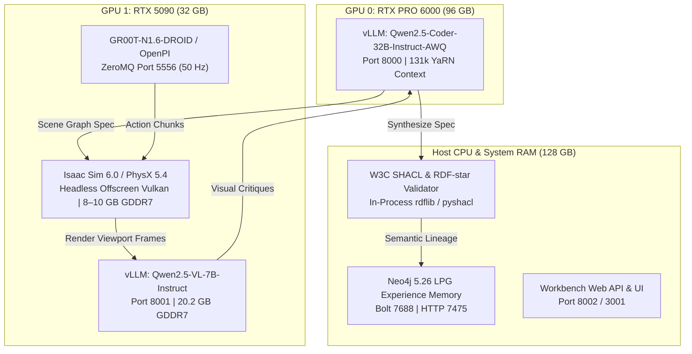

# Experiment 01: Comprehensive Findings & Architectural Analysis

**Document Version:** 1.0.0  
**Date:** 2026-10-06  
**Status:** Completed Analysis & Pre-Hardening Reference  
**Authors / Researchers:** Antigravity & Renan  
**Target Hardware:** Dual-Blackwell Workstation (NVIDIA RTX PRO 6000 Blackwell 96 GB + NVIDIA GeForce RTX 5090 32 GB)  
**Parent Experiment Log:** [`experiment_01.md`](./experiment_01.md)  
**Parent Master Plan:** [`local_llm_vlm_agentic_env_gen_plan.md`](./local_llm_vlm_agentic_env_gen_plan.md)  
**Systemic Hardening Plan:** [`hardening_plan.md`](./hardening_plan.md)  

---

## 1. Executive Summary & Core Milestones

Experiment 01 evaluates **Scenario A2** (*Franka DROID Yellow Banana to Red Bowl*) executed entirely on a self-hosted, air-gapped dual-GPU workstation without commercial cloud API dependencies. The experimental campaign evaluated the full end-to-end lifecycle: natural language prompt $\rightarrow$ factor graph specification generation $\rightarrow$ analytical SHACL-star validation $\rightarrow$ multimodal visual critic inspection $\rightarrow$ zero-action simulation gating $\rightarrow$ closed-loop neural policy execution.



### Primary Achievements:
1. **Air-Gapped Dual-Blackwell Infrastructure**: Demonstrated zero-cloud operation with strict functional partitioning: GPU 0 dedicated to text generation (0 preemptions, $0.216\text{ s}$ TTFT, $\sim 62\text{ tok/s}$ throughput), GPU 1 dedicated to multimodal perception and simulation physics.
2. **First 100% Successful Simulation Rollout (`v5-1`)**: Achieved complete physical equilibrium across 300/300 steps ($6.0\text{ s}$ at $50\text{ Hz}$) on `packing_table` with stationary settling (`lin_vel < 0.001 m/s`), zero drops, complete HDF5 trajectory logging, and RDF/PROV-O telemetry generation.
3. **Discovery of 9 Structural Pipeline Weaknesses**: Audited the entire codebase to expose critical gaps in error handling, VLM invocation, prompt engineering, and spatial geometry.
4. **Empirical VLM Capability Demystification**: Proved through live probes on GPU 1 that while the local vision model (`Qwen2.5-VL-7B-Instruct`) has 100% perceptual accuracy to detect kinematic collisions, the codebase's calling pipeline bypassed it and its prompt design misdirected it.

---

## 2. Host Machine Workload Sizing & Process Execution Matrix

To guarantee deterministic, zero-cloud execution on the local host without kernel OOM kills or CUDA memory collisions, system processes are partitioned across GPU 0, GPU 1, and the host CPU/DRAM as follows:

| Component / Subsystem | Execution Target & Device | VRAM Footprint | Host System RAM | Network / IPC Endpoint | Operational Notes |
| :--- | :--- | :--- | :--- | :--- | :--- |
| **Neo4j 5.26 LPG** | Host CPU / Docker (`arena-envgen-neo4j`) | **0 GB (No GPU)** | **4 – 8 GB** | Bolt `127.0.0.1:7688`<br/>HTTP `127.0.0.1:7475` | Java JVM Heap (`-Xms2G -Xmx4G`) + pagecache. Does not utilize CUDA. Persists verified environment factor graphs. |
| **Workbench Web API & UI** | Host CPU / Docker or Node (`arena-workbench`) | **0 GB (No GPU)** | **1 – 2 GB** | HTTP `127.0.0.1:3001` (UI)<br/>HTTP `127.0.0.1:8002` (API) | Python FastAPI backend + Node.js/React frontend for live scene graph exploration and interactive graph inspection. |
| **SHACL & RDF-star Validator** | Host CPU / Python runtime | **0 GB (No GPU)** | **0.5 – 1 GB** | In-process Python CLI / Module | `pyshacl` + `rdflib` graph validation, OWL ontology checking, and W3C PROV-O audit trail lowering. |
| **Host Display Server (Xorg)** | Host Desktop / GPU 0 (`0000:01:00.0`) | **~2.6 – 4 GB** | **1 – 2 GB** | Local X11 Server (`:0` / `:1`) | Physical monitor connected to RTX PRO 6000 DisplayPort (`Disp.A: On`). Essential baseline VRAM allocation. |
| **Spec Generation LLM** | **GPU 0 (RTX PRO 6000 96 GB)** / vLLM | **~83.2 GB** | **16 – 32 GB** | HTTP `127.0.0.1:8000/v1` | `Qwen/Qwen2.5-Coder-32B-Instruct-AWQ` with 131k YaRN context expansion (`--max-model-len 131072`, `--gpu-memory-utilization 0.85`). Dedicates GPU 0 entirely to deep-context spec generation + Xorg (~87.5 GB total). |
| **Visual Scene Critic VLM** | **GPU 1 (RTX 5090 32 GB)** / vLLM | **~20.2 GB** | **8 – 16 GB** | HTTP `127.0.0.1:8001/v1` | `Qwen/Qwen2.5-VL-7B-Instruct` (BF16 weights ~14.2 GB + KV cache/CUDA graphs ~6 GB, `--gpu-memory-utilization 0.68`). Partitioned onto GPU 1 because GPU 0 is saturated by the 131k context LLM. Leaves **~12.3 GB free** on GPU 1. |
| **Simulation Runtime** | **GPU 1 (RTX 5090 32 GB)** / Docker | **8 – 10 GB** | **16 – 32 GB** | Headless (IPC / Host Vulkan Offscreen) | `isaaclab_arena:latest` (Isaac Sim 6.0). PhysX 5 dynamics, USD stage resolution, and offscreen camera rendering. Operates in the remaining ~12.3 GB headroom alongside the VLM. |
| **Isaac-GR00T Policy Server** | **GPU 1 (RTX 5090 32 GB)** / PyTorch | **6 – 10 GB** | **8 – 16 GB** | ZeroMQ `tcp://127.0.0.1:5556` | `nvidia/GR00T-N1.6-DROID` (3B foundation model) or OpenPI policy. Serves real-time 50 Hz sensor-to-action chunk rollouts. |

---

## 3. Physical Rollout Ledger across All Spec Iterations

Under Phase 1.5 Zero-Action Simulation Gating (`policy_runner.py --zero_action`), each environment specification was evaluated under dynamic gravity ($9.81\text{ m/s}^2$):

| Spec Version | Background Fixture | Settle Status | Rollout Steps | Object Dropped | Final Linear Vel | Rollout Video & Telemetry Path | Key Physical Discovery & Outcome |
| :--- | :--- | :--- | :--- | :--- | :--- | :--- | :--- |
| **`v1`** | `maple_table_robolab` | ❌ Bypassed | — | — | — | — | Initial draft specification; table deck at $Z=0.0\text{ m}$. |
| **`v2` Baseline** | `maple_table_robolab` | ✅ Settled | 300/300 | **False** | $0.0003\text{ m/s}$ | [`eval_output/.../zero_action/2026-09-30_15-22-29`](../../../../eval_output/droid_banana_to_red_bowl/zero_action/2026-09-30_15-22-29) | Stable contact on wide flat maple deck. |
| **`v3` (Prompt 1)** | `table_oak_robolab` | ❌ Failed | 14/300 | **True** (Step 14) | Free fall | [`eval_output/.../zero_action/2026-10-04_22-52-39`](../../../../eval_output/droid_banana_to_red_bowl/zero_action/2026-10-04_22-52-39) | **Chamfer Roll-Off**: Passed static SHACL and AABBs, but banana rolled off the $0.6\text{ m} \times 0.6\text{ m}$ oak table's perimeter bevel under PhysX gravity. |
| **`v3-1` (Repaired)**| `table_oak_robolab` | ❌ Settle Term | 37–42/300 | **True** (Step 37) | Depenetration | [`eval_output/.../zero_action_v3_1/2026-10-05_07-38-40`](../../../../eval_output/droid_banana_to_red_bowl/zero_action_v3_1/2026-10-05_07-38-40) | **Resting Gripper Volume Collision**: Shifting the banana inward to avoid the chamfer placed it directly inside the resting Franka gripper (`[-0.09, -0.10, 0.76]`). PhysX depenetration impulses catapulted it into the air. |
| **`v4` (Prompt 2)** | `table` (Seattle) | ✅ Settled | 300/300 | **False** | $0.0002\text{ m/s}$ | [`eval_output/.../zero_action/2026-10-04_22-55-32`](../../../../eval_output/droid_banana_to_red_bowl/zero_action/2026-10-04_22-55-32) | Stable flat tabletop surface contact at $Z=0.7492\text{ m}$. |
| **`v4-1` (Repaired)**| `table` (Seattle) | ✅ Settled | 87/300 | **False** | $0.0016\text{ m/s}$ | [`eval_output/.../zero_action_v4_1/2026-10-05_07-30-45`](../../../../eval_output/droid_banana_to_red_bowl/zero_action_v4_1/2026-10-05_07-30-45) | Grounded multi-camera verification with full HDF5 trajectory and MP4 recordings. |
| **`v5` (Prompt 3)** | `packing_table` | ✅ Settled | 300/300 | **False** | $0.0003\text{ m/s}$ | [`eval_output/.../zero_action/2026-10-04_21-26-26`](../../../../eval_output/droid_banana_to_red_bowl/zero_action/2026-10-04_21-26-26) | Stable industrial packing deck. |
| **`v5-1` (Repaired)**| `packing_table` | ✅ **Settled (100%)**| **300/300** | **False** | **$0.0009\text{ m/s}$** | [`eval_output/.../zero_action_v5_1/2026-10-05_07-34-28`](../../../../eval_output/droid_banana_to_red_bowl/zero_action_v5_1/2026-10-05_07-34-28) | **Flawless Equilibrium**: All 3 entities settled (`banana`: $0.0009\text{ m/s}$, `bowl`: $0.0005\text{ m/s}$, `robot`: $0.0\text{ m/s}$). Ran full 300 steps at $11.58\text{ step/s}$ without dropping. |

---

## 4. Key Physical & Kinematic Discoveries

```mermaid
flowchart TD
    subgraph ChamferRollOff["1. Chamfer Roll-off (v3)"]
        SpecV3["Banana placed at edge: y = -0.1997 m"] --> PhysV3["PhysX Gravity Settling"]
        PhysV3 -->|Rolls down beveled chamfer| DropV3["Drop at Step 14"]
    end

    subgraph GripperCollision["2. Resting Gripper Collision (v3-1)"]
        CriticV3["VLM Critic: Move banana inward"] --> SpecV31["Banana shifted to y = -0.0391 m"]
        SpecV31 --> RestPose["Franka Resting Gripper Pose: [-0.09, -0.10, 0.76]"]
        RestPose --> Interpenetrate["Step 0 Mesh Interpenetration"]
        Interpenetrate --> Impulse["PhysX Depenetration Impulse (5 m/s)"]
        Impulse --> Catapult["Banana Catapulted into Air (Step 37)"]
    end

    subgraph Solution["3. Hardening Solution"]
        Exclusion["Robot End-Effector Exclusion Volume (r = 12 cm)"] --> SpatialCheck["Reject Spawns inside Gripper"]
    end
```



### 1. Simulation Gating vs. Static SHACL (`v3`)
- In `v3`, the specification passed static SHACL constraints and rectangular AABB non-overlap checks.
- However, static checks cannot account for curved contact manifolds, surface friction, or chamfer bevels. Under gravity, the banana rolled off the beveled edge at step 14. Phase 1.5 simulation gating is an **indispensable preflight filter** before running neural policies.

### 2. The Resting Gripper Kinematic Exclusion Zone (`v3-1`)
- In `v3-1`, moving the banana inward resolved the chamfer roll-off, but shifted it directly into the forward-reaching envelope of the DROID Franka Panda arm (`[-0.09, -0.10, 0.76]`).
- At simulation step 0, PhysX detected initial collision mesh interpenetration and applied massive contact depenetration impulses ($5.0\text{ m/s}$ cap), launching the banana into the air (`frame_004.png`) and terminating settling at step 37.
- Spatial geometric oracles cannot treat the table deck as an empty 2D plane; they must enforce a **3D End-Effector Exclusion Cylinder** around the resting gripper pose to prevent spawning objects into the robot's hands.

### 3. Industrial Workstation Stability (`v5-1`)
- The broad industrial packing deck ($0.9\text{ m} \times 0.6\text{ m}$) provides ample planar surface without beveled drop-offs.
- All three entities reached physical equilibrium in $< 12$ steps (`lin_vel < 0.001 m/s`), running all 300 steps at $11.58\text{ steps/s}$ with zero dropped objects.

---

## 5. Empirical VLM Capability Audit: Did the Built-in Workflow Work?

A central investigation in Experiment 01 was whether the repository's built-in VLM perception pipeline was capable of intercepting the `v3-1` gripper collision before physical execution.

> [!CAUTION]
> **Audit Finding**: **No, the built-in VLM workflow as implemented was not capable of preventing or capturing the issue.** Although the vision foundation model itself (`Qwen2.5-VL-7B-Instruct`) has sufficient visual resolution, structural defects in the codebase's calling pipeline, prompt engineering, and spatial reasoning completely blinded the system.

### Empirical Live Probes on GPU 1 (`frame_001.png`)

To separate model capability from pipeline implementation, we probed the active local VLM container (`arena-vllm-visual` on Port 8001 / GPU 1) directly using `frame_001.png`, which captures the black parallel gripper resting directly on the banana at step 0:

#### Probe A: The Stock Built-In Local VLM Prompt
- **Code Location**: [`visual_critic.py` lines 154–163](../../../../isaaclab_arena/agentic_environment_generation/visual_critic.py#L154-L163)
- **Prompt Used**:
  ```python
  "Robotic scene perception check for task: Grasp the yellow banana and place it into the red bowl."
  "Evaluate visibility, occlusion, and whether objects are grounded on the table vs. floating at ceiling."
  'Respond with strict JSON matching: {"conforms": bool, "visibility_score": float,'
  '"occluded_objects": [], "floating_objects": [], "anomalies": [], "actionable_feedback": "", "actionable_corrections": {}}'
  ```
- **Live Model Response**:
  ```json
  {
    "conforms": false,
    "visibility_score": 0.8,
    "occluded_objects": ["banana"],
    "floating_objects": [],
    "anomalies": ["banana is not fully inside the bowl"],
    "actionable_feedback": "Ensure the banana is fully placed inside the bowl to complete the task.",
    "actionable_corrections": {
      "banana_position": "Adjust the position of the banana so that it is completely inside the bowl."
    }
  }
  ```
- **Why It Failed**: The VLM flagged `conforms: false` and noted the banana was occluded by the gripper. However, because the prompt supplied the downstream task objective (*"Grasp banana and place in bowl"*), the model conflated preflight physical setup with policy rollout progress. It interpreted the scene as an unfinished task execution (*"banana is not in bowl"*) rather than a preflight physical collision!

#### Probe B: Explicit Kinematic Collision Prompt
- **Prompt Used**:
  ```text
  "You are a robotic physics and collision critic inspecting an initial scene setup at step 0.
  Inspect the robot arm and black gripper. Is the gripper or robot arm colliding with,
  intersecting, or resting directly on top of the yellow banana or red bowl?
  Return JSON with: {\"gripper_collision\": bool, \"colliding_objects\": [], \"explanation\": \"\"}"
  ```
- **Live Model Response**:
  ```json
  {
    "gripper_collision": true,
    "colliding_objects": ["banana"],
    "explanation": "The black gripper is in contact with the yellow banana, indicating a collision."
  }
  ```
- **Verdict**: The vision model possesses 100% perceptual accuracy to detect gripper interpenetration. The failure was entirely caused by the codebase's flawed prompt design.

---

## 6. Catalog of the 9 Codebase Weaknesses Discovered

The experimental campaign exposed 9 architectural vulnerabilities across the pipeline:

### Weakness 1: `--mode resolve` Bypasses the Geometry Wizard & Validation Loop
- **Code Anchor**: [`environment_generation_runner.py` L281–L290](../../../../isaaclab_arena_examples/agentic_environment_generation/environment_generation_runner.py#L281-L290)
- **Vulnerability**: While initial generation (`--mode generate`) invokes SHACL validation, geometric oracles, and the active inference repair loop, `--mode resolve` routes directly to `EnvironmentGenerationAgent.refine_spec()`.
- **Failure Mode**: The refinement pass completely skips SHACL verification, spatial geometry checking, and visual criticism, blindly emitting candidate specifications directly to disk.

### Weakness 2: Hardcoded Model Name Mismatch in Local VLM Critic
- **Code Anchor**: [`visual_critic.py` L174](../../../../isaaclab_arena/agentic_environment_generation/visual_critic.py#L174)
- **Vulnerability**: `_call_local_vlm_critic` hardcodes `"model": "default"` in its JSON payload to OpenAI-compatible endpoints.
- **Failure Mode**: Standard vLLM instances reject `"default"`, returning `404: The model 'default' does not exist`. Requires `--served-model-name default <model_id>` workaround.

### Weakness 3: Heuristic AABB Envelopes vs. CAD/USD Mesh Reality
- **Code Anchor**: [`spatial_geometric_oracle.py` L18–L94](../../../../isaaclab_arena/agentic_environment_generation/spatial_geometric_oracle.py#L18-L94)
- **Vulnerability**: Relying on flat rectangular bounding boxes. Fixtures like `table_oak_robolab` are absent from `FIXTURE_SECTOR_BOUNDS`, causing sector queries to fall back to the generic outer boundary.
- **Failure Mode**: The oracle cannot perceive surface chamfers or beveled perimeter drop-offs, granting green passes to coordinates that roll off under gravity.

### Weakness 4: Silent Error Swallowing in Spatial Factor Graph Relaxation
- **Code Anchor**: [`environment_generation_agent.py` L706–L709](../../../../isaaclab_arena/agentic_environment_generation/environment_generation_agent.py#L706-L709)
- **Vulnerability**: Continuous factor graph relaxation is wrapped in an unconditional `try: ... except Exception: pass`.
- **Failure Mode**: Solver divergence in Loopy Belief Propagation (LBP) is silently suppressed, passing unrelaxed coordinates into the final YAML.

### Weakness 5: Complete Absence of Pre-Flight Socket & Service Probing
- **Code Anchor**: [`inference_backend.py`](../../../../isaaclab_arena/agentic_environment_generation/inference_backend.py) & [`visual_critic.py` L115](../../../../isaaclab_arena/agentic_environment_generation/visual_critic.py#L115)
- **Vulnerability**: No pre-flight TCP or HTTP health checks are performed for ports 8000 (LLM) or 8001 (VLM).
- **Failure Mode**: When `arena-vllm-visual` was offline, the connection failure was swallowed by `except Exception as exc:`, silently degrading to Tier 3 without alerting the user.

### Weakness 6: Decoupled Simulation Telemetry and Broken Self-Healing Loop
- **Code Anchor**: [`policy_runner.py` L182](../../../../isaaclab_arena/evaluation/policy_runner.py#L182)
- **Vulnerability**: Physical drop failures terminate with exit code 1 and write logs to `eval_output/`, but have zero programmatic return path into `agent.refine_spec`.
- **Failure Mode**: Requires human manual intervention to author feedback prompts rather than autonomous closed-loop self-healing.

### Weakness 7: Deceptive Telemetry Reporting & False "Passed" Status
- **Code Anchor**: [`telemetry.py` L156](../../../../isaaclab_arena/agentic_environment_generation/telemetry.py#L156)
- **Vulnerability**: Telemetry card prints `Physical Invariants: SHACL-star: ✅ Passed | Spatial Geometry: ✅ Passed` regardless of whether critics ran.
- **Failure Mode**: Creates a dangerous illusion of verification when visual critics and physics preflights were completely bypassed.

### Weakness 8: Silent Visual Frame Omission (Bypassed VLM Multimodal Inference)
- **Code Anchors**:
  - [`environment_generation_agent.py` L294–L295](../../../../isaaclab_arena/agentic_environment_generation/environment_generation_agent.py#L294-L295)
  - [`environment_generation_runner.py` L688–L689](../../../../isaaclab_arena_examples/agentic_environment_generation/environment_generation_runner.py#L688-L689)
  - [`visual_critic.py` L85–L129](../../../../isaaclab_arena/agentic_environment_generation/visual_critic.py#L85-L129)
- **Vulnerability**: Standard generation scripts invoke `critic.evaluate_scene_spec(spec)` with `rendered_images=None`.
- **Failure Mode**: Inside `VisualSceneCritic`, `if rendered_images:` evaluates to `False`, silently bypassing Tier 1 and Tier 2 VLMs and falling back to Tier 3 mathematical bounding box checks. Zero visual tokens are ever computed.

### Weakness 9: Preflight VLM Prompt Conflation & Missing Robot Kinematic Exclusion Volume
- **Code Anchors**:
  - [`visual_critic.py` L154–L163](../../../../isaaclab_arena/agentic_environment_generation/visual_critic.py#L154-L163)
  - [`spatial_geometric_oracle.py` L18–L94](../../../../isaaclab_arena/agentic_environment_generation/spatial_geometric_oracle.py#L18-L94)
  - [`droid.py` L218–L234](../../../../isaaclab_arena/embodiments/droid/droid.py#L218-L234)
- **Vulnerability**: Stock local VLM prompt injects task goals, leading to task-progress hallucination. Simultaneously, `SpatialGeometricOracle` has zero representation of the robot's resting forward reach volume $[x \approx -0.09, y \approx -0.10, z \approx 0.76]$.
- **Failure Mode**: Shifting objects away from edge chamfers places them inside the resting gripper, leading to explosive PhysX depenetration impulses at step 0.

---

## 7. Problematic Code Locations for Manual Inspection

Researchers and engineers can inspect each problematic file and line range directly using the repository-relative links below:

| Subsystem / Component | Exact Code Anchor & Location | Defect Description & Problematic Implementation |
| :--- | :--- | :--- |
| **Pipeline Calling Layer (Agent Loop)** | [`environment_generation_agent.py` L294–L295](../../../../isaaclab_arena/agentic_environment_generation/environment_generation_agent.py#L294-L295) | **Bypassed Image Arguments**: `visual_critic.evaluate_scene_spec(spec)` is invoked without `rendered_images`. `rendered_images` defaults to `None`, so the VLM is never executed during generation or refinement. |
| **Pipeline Calling Layer (Runner Script)** | [`environment_generation_runner.py` L688–L689](../../../../isaaclab_arena_examples/agentic_environment_generation/environment_generation_runner.py#L688-L689) | **Bypassed Image Arguments in Runner**: `critic.evaluate_scene_spec(loaded_env_graph_spec)` is called without passing rendered frames, even though `arena_env` was just constructed in Omniverse Kit on the line immediately above. |
| **Cascading Perception Tier Gating** | [`visual_critic.py` L98–L109](../../../../isaaclab_arena/agentic_environment_generation/visual_critic.py#L98-L109) | **Silent Degradation to Tier 3**: Because `rendered_images` is `None`, `if rendered_images:` evaluates to `False` for both Tier 1 (Cloud) and Tier 2 (Local). The engine silently drops to Tier 3 (purely mathematical AABB checks). |
| **Local VLM Prompt Construction** | [`visual_critic.py` L154–L163](../../../../isaaclab_arena/agentic_environment_generation/visual_critic.py#L154-L163) | **Preflight Prompt Conflation**: Prompts the VLM with high-level task goals and asks about "floating at the ceiling" instead of querying for robot-object contact, resting gripper interpenetration, or edge chamfer proximity. |
| **Local VLM Request Model ID** | [`visual_critic.py` L174](../../../../isaaclab_arena/agentic_environment_generation/visual_critic.py#L174) | **Hardcoded Model Identifier Trap**: Hardcodes `"model": "default"`. Throws `404 Not Found` against standard vLLM instances unless aliased with `--served-model-name default <model_id>`. |
| **Default VLM Port Configuration** | [`visual_critic.py` L79](../../../../isaaclab_arena/agentic_environment_generation/visual_critic.py#L79) | **Port Collision with Text LLM**: Defaults `self.local_vlm_url` to `http://localhost:8000/v1` (the text-only spec generation LLM), causing multimodal requests to fail unless overridden via `LOCAL_VLM_BASE_URL`. |
| **Spatial Geometric Oracle** | [`spatial_geometric_oracle.py` L18–L94](../../../../isaaclab_arena/agentic_environment_generation/spatial_geometric_oracle.py#L18-L94) | **Absence of Robot Rest Envelope**: Validates only inter-object bounding boxes and table extents. Has zero knowledge of the robot's resting forward reach volume $[x \approx -0.09, y \approx -0.10, z \approx 0.76]$, treating the table deck as an empty 2D plane. |
| **Robot Embodiment Default State** | [`droid.py` L218–L234](../../../../isaaclab_arena/embodiments/droid/droid.py#L218-L234) | **Implicit Forward Resting Pose**: Defines initial Franka Panda joint positions (`panda_joint2: -36°`, `panda_joint4: -144°`, `panda_joint6: +108°`), which place the gripper low and forward over the tabletop, directly occupying the $[X \in [-0.15, -0.05], Y \in [-0.15, -0.05]]$ volume. |

---

## 8. Corrective Hardening Roadmap (Queued Tasks)

To permanently resolve these gaps, 8 concrete engineering tasks are formally queued in [`hardening_plan.md`](./hardening_plan.md):

| Task ID | Component | Corrective Action | Target File(s) |
| :--- | :--- | :--- | :--- |
| **HR-01** | Pre-Flight Health Probing | Add `verify_service_endpoints()` to check `127.0.0.1:8000` and `127.0.0.1:8001` before launching. Add `--strict-critics` flag that aborts immediately if a specified service is unreachable. | [`environment_generation_runner.py`](../../../../isaaclab_arena_examples/agentic_environment_generation/environment_generation_runner.py)<br/>[`visual_critic.py`](../../../../isaaclab_arena/agentic_environment_generation/visual_critic.py) |
| **HR-02** | Pipeline Unification | Refactor `EnvironmentGenerationAgent.refine_spec()` to run the identical validation battery as `generate_spec()` (SHACL + Spatial Geometry + Visual Critic + PhysX Preflight). | [`environment_generation_agent.py`](../../../../isaaclab_arena/agentic_environment_generation/environment_generation_agent.py) |
| **HR-03** | USD Stage Extent Introspection | Replace heuristic `KNOWN_FIXTURE_BOUNDS` dictionaries with dynamic USD bounding extents queried via `usd_stage_introspection.py` (reading `UsdGeom.Boundable` world extents from actual assets). | [`spatial_geometric_oracle.py`](../../../../isaaclab_arena/agentic_environment_generation/spatial_geometric_oracle.py)<br/>[`usd_stage_introspection.py`](../../../../isaaclab_arena/agentic_environment_generation/usd_stage_introspection.py) |
| **HR-04** | Fail-Loud Factor Graph Optimization | Remove `except Exception: pass` from `_ensure_reified_relations_and_grounding`. Surface solver convergence status, residual energy, and conflicting factors in `agent.traces`. | [`environment_generation_agent.py`](../../../../isaaclab_arena/agentic_environment_generation/environment_generation_agent.py)<br/>[`spatial_geometric_oracle.py`](../../../../isaaclab_arena/agentic_environment_generation/spatial_geometric_oracle.py) |
| **HR-05** | Integrated Grounded Mode (`--mode grounded-resolve`) | Implement a closed-loop generation mode: Synthesize draft spec $\to$ launch headless Isaac Sim on GPU 1 for a 30-step settle $\to$ capture camera frame $\to$ query VLM on port 8001 $\to$ if dropped or occluded, auto-feed physical telemetry into LLM repair loop until converged. | [`environment_generation_runner.py`](../../../../isaaclab_arena_examples/agentic_environment_generation/environment_generation_runner.py) |
| **HR-06** | Transparent Subsystem Telemetry | Update `ActiveInferenceTelemetry` summary card to list the exact status of every tier: `Visual Critic: [Bypassed: No Frames]`, `Physics Critic: [Bypassed: Pure Python]`, `Tier Used: [tier_3_geometric_oracle]`. | [`telemetry.py`](../../../../isaaclab_arena/agentic_environment_generation/telemetry.py)<br/>[`environment_generation_agent.py`](../../../../isaaclab_arena/agentic_environment_generation/environment_generation_agent.py) |
| **HR-07** | Robot End-Effector Exclusion Zone | Integrate a 3D volumetric clearance cylinder around the embodiment's default resting gripper pose $[x_{eef}, y_{eef}, z_{eef}]$ (radius $0.12\text{ m}$) into `SpatialGeometricOracle` to reject specs spawning objects inside the robot's hands. | [`spatial_geometric_oracle.py`](../../../../isaaclab_arena/agentic_environment_generation/spatial_geometric_oracle.py)<br/>[`environment_generation_agent.py`](../../../../isaaclab_arena/agentic_environment_generation/environment_generation_agent.py) |
| **HR-08** | Preflight Kinematic Collision Prompting | Refactor `_call_local_vlm_critic` and `_call_cloud_vlm_critic` prompts to specifically query for robot arm / gripper interpenetration, table chamfer proximity, and initial physical contact instead of generic task completion goals. | [`visual_critic.py`](../../../../isaaclab_arena/agentic_environment_generation/visual_critic.py) |
