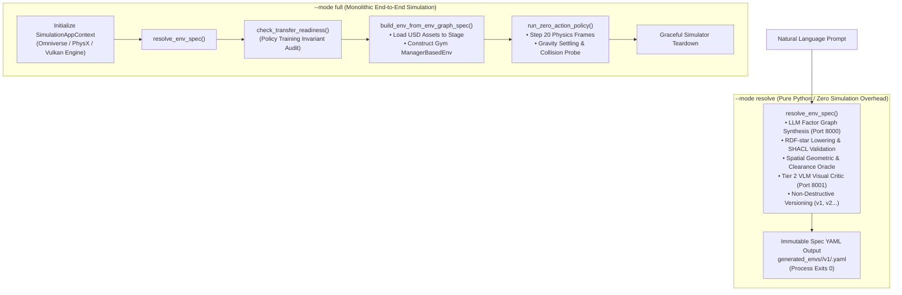
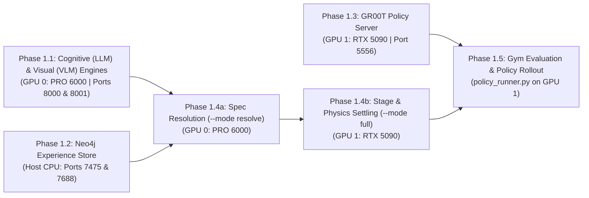

# Dual-GPU Local Inference Experiments & Validation Log

**Document Version:** 1.2.0  
**Date:** 2026-09-30  
**Status:** Active Research & Execution  
**Authors / Researchers:** Antigravity & Renan  
**Target Hardware:** Dual-Blackwell Workstation (NVIDIA RTX PRO 6000 Blackwell 96 GB + NVIDIA GeForce RTX 5090 32 GB)  
**Host Environment:** Ubuntu 22.04.5 LTS (Kernel `7.2.4-zabbly+`) | Driver `595.91.07` | CUDA `13.2`  
**Parent Plan:** [`local_llm_vlm_agentic_env_gen_plan.md`](local_llm_vlm_agentic_env_gen_plan.md)  
**Hardware Guide:** [`install-multi-gpu.md`](install-multi-gpu.md)  

---

## 1. Executive Summary & Purpose

This document serves as the live, human-readable operational experimental journal and validation log for running Isaac Lab-Arena's `agentic_environment_generation` pipeline entirely on a self-hosted, local dual-GPU system.

The objectives of this experimental campaign are:
1. **Air-Gapped Autonomous Operation**: Verify zero reliance on commercial cloud APIs (OpenAI, Google Gemini, OpenRouter) for environment graph specification, spatial constraint solving, and active inference repair.
2. **Deterministic Dual-Blackwell Functional Separation**: Isolate cognitive language/vision generation (GPU 0) from physics simulation and policy neural inference (GPU 1).
3. **Structured Research Documentation**: Maintain human-auditable logs, reproducible command invocations, telemetry benchmarks, and decision rationale as each experiment is conducted.

---

## 2. System Hardware & Driver Baseline Audit (2026-09-29)

Prior to running experimental workloads, the system state was verified using `nvidia-smi` and in-container PyTorch CUDA probes.

### 2.1 GPU Enumeration & Topology

```
+-----------------------------------------------------------------------------------------+
| NVIDIA-SMI 595.91.07              Driver Version: 595.91.07      CUDA Version: 13.2     |
+-----------------------------------------+------------------------+----------------------+
| GPU  Name                 Persistence-M | Bus-Id          Disp.A | Volatile Uncorr. ECC |
| Fan  Temp   Perf          Pwr:Usage/Cap |           Memory-Usage | GPU-Util  Compute M. |
|=========================================+========================+======================|
|   0  NVIDIA RTX PRO 6000 Blac...     On |   00000000:01:00.0  On |                  Off |
| 30%   31C    P5             49W /  600W |    1167MiB /  97887MiB |     15%      Default |
+-----------------------------------------+------------------------+----------------------+
|   1  NVIDIA GeForce RTX 5090         On |   00000000:06:00.0 Off |                  N/A |
|  0%   30C    P8              9W /  575W |      15MiB /  32607MiB |      0%      Default |
+-----------------------------------------+------------------------+----------------------+
```

| Parameter | GPU 0 (Cognitive Engine) | GPU 1 (Sim & Policy Engine) | Notes |
| :--- | :--- | :--- | :--- |
| **Model** | NVIDIA RTX PRO 6000 Blackwell Workstation | NVIDIA GeForce RTX 5090 | Both SM 12.0 (`sm_120`) |
| **PCI Bus ID** | `00000000:01:00.0` | `00000000:06:00.0` | Discrete dual-device slots |
| **Total Memory** | **95.6 GiB** (97,887 MiB) | **31.8 GiB** (32,607 MiB) | Total: **127.4 GiB GDDR7** |
| **Free Memory** | 93.7 GiB | 31.3 GiB | GPU 1 is 100% headless |
| **Persistence Mode**| **Enabled** | **Enabled** | Set via `nvidia-smi -pm 1` |
| **PCIe Link Status**| Gen 5 x16 (32 GT/s) | Gen 3/4 x4 (8 GT/s) | Functional; see hardware note below |
| **Default Power Limit**| 600 W | 575 W | Combined peak: ~1175 W GPU load |

> [!NOTE]
> **PCIe Link Note for GPU 1:** The RTX 5090 is currently routed via `0000:06:00.0` negotiating at x4 link width. Because policy weights and simulation meshes load once at session startup, this provides ample bandwidth for real-time control (~4–8 GB/s). Optional hardware tuning in ASUS UEFI BIOS can configure `PCIEX16_2` to Gen 5 x8/x8 if desired.
>
> [!WARNING]
> **Power Budget Safety:** Under heavy concurrent generation (LLM token synthesis on GPU 0 + Isaac Sim rendering and PhysX stepping on GPU 1), ensure the host PSU is rated $\ge 1500\text{ W}$. For PSUs $\le 1200\text{ W}$, apply power caps (`nvidia-smi -i 0 -pl 450` and `nvidia-smi -i 1 -pl 400`) before running stress benchmarks.

### 2.2 PyTorch CUDA Capability Verification

Executed inside `isaaclab_arena:latest` and `gr00t-dev:latest` containers:
- **CUDA Device Count:** 2
- **Device 0:** `NVIDIA RTX PRO 6000 Blackwell Workstation Edition` — Capability: `(12, 0)`
- **Device 1:** `NVIDIA GeForce RTX 5090` — Capability: `(12, 0)`
- **Matmul & Tensor Allocations:** Passed on both devices with zero errors.
- **P2P Access:** Not enabled (NVLink bridge not present; intentional functional separation over PCIe/TCP).

---

## 3. Local Model & Container Inventory

Local inspection confirms the following assets are pre-cached and ready for deployment without internet egress:

### 3.1 Downloaded Models (`~/.cache/huggingface/hub/`)
- `Qwen/Qwen2.5-Coder-32B-Instruct-AWQ`: Fast, memory-efficient structured code & graph generator (~22 GB VRAM).
- `casperhansen/llama-3.3-70b-instruct-awq`: High-capacity 70B reasoning model (~40 GB VRAM).
- `nvidia/GR00T-N1.6-DROID`: Humanoid / multi-embodiment policy checkpoint for physical rollouts.
- `nvidia/GR00T-N1.7-3B`: Updated 3B physical AI foundation policy checkpoint.
- `nvidia/Cosmos-Reason2-2B`: Physical spatial reasoning & visual dynamics critic.
- `depth-anything/DA3-BASE`, `moge-2-vitl`, `map-anything-apache`: Dense visual geometry estimation.

### 3.2 Pre-built Docker Containers
- `isaaclab_arena:latest` (58.7 GB): Full Isaac Sim 6.0 + Isaac Lab 3.0 Beta + Arena core.
- `gr00t-dev:latest` (57.6 GB): ZeroMQ policy server environment with PyTorch 2.7 (SM 12.0 enabled).
- `neo4j:5.26-community` (980 MB): Labeled Property Graph experience memory.

---

## 4. Evaluation Benchmark Scenarios Catalog

To systematically benchmark and validate self-hosted local inference across diverse robotic manipulation affordances, candidate scenarios are organized into two standardized benchmark categories. Each individual experiment selects **one scenario** from this catalog to evaluate end-to-end under a specific hardware and model configuration.

### 4.1 🍎 Category A: Fresh Food & Kitchen Tabletop (Franka DROID / Single-Arm)
- **Embodiment**: `droid_abs_joint_pos` (Dual cameras: exterior $45^\circ$ + wrist)
- **Background**: `maple_table_robolab` (Pose: `[-0.25, 0.0, 0.0]`)
- **Policy Server**: `nvidia/GR00T-N1.6-DROID` (ZeroMQ Port 5556)
- **Core Challenge**: Grasping compliant, organic geometric objects with varied friction and placing them onto fragile open ceramic/wooden dishware without tipping.

| Scenario ID | Test Name | Source Object | Target Container | Source Sector | Target Sector | Prompt / Language Instruction |
| :--- | :--- | :--- | :--- | :--- | :--- | :--- |
| **A1** | **Apple to Wooden Bowl** | `apple_01_objaverse_robolab` | `wooden_bowl_hot3d_robolab` | `front_right` | `front_left` | *"Pick up the red apple from the front right of the maple table and place it into the wooden bowl on the front left."* |
| **A2** ⭐ | **Banana to Red Bowl** | `banana_ycb_robolab` | `bowl_ycb_robolab` | `front_right` | `front_left` | *"Grasp the yellow banana from the right side of the table and place it into the red bowl on the left."* |
| **A3** | **Lemon to Clay Plate** | `lemon_01_fruits_veggies_robolab` | `clay_plates_hot3d_robolab` | `front_right` | `front_left` | *"Pick up the fresh lemon from the front right and carefully place it on the clay plate at the front left."* |
| **A4** | **Avocado to Serving Bowl** | `avocado01_fruits_veggies_robolab` | `serving_bowl_vomp_robolab` | `front_right` | `front_left` | *"Pick the green avocado from the right sector and place it inside the serving bowl on the left."* |
| **A5** | **Red Bell Pepper to Blue Bin** | `red_bell_pepper_objaverse_robolab` | `bin_b03_vomp_robolab` | `front_right` | `front_left` | *"Grasp the red bell pepper from the front right table sector and drop it into the blue bin on the front left."* |

*(⭐ Scenario A2 is selected as the primary benchmark scenario for Experiment 1.)*

---

### 4.2 🥫 Category B: Packaged Groceries & Pantry Sorting (Franka DROID / Single-Arm)
- **Embodiment**: `droid_abs_joint_pos`
- **Background**: `maple_table_robolab` / `kitchen`
- **Policy Server**: `nvidia/GR00T-N1.6-DROID` (ZeroMQ Port 5556)
- **Core Challenge**: High-aspect-ratio prismatic cylinders and cuboids requiring vertical clearance and upright orientation within high-walled bins and crates.

| Scenario ID | Test Name | Source Object | Target Container | Source Sector | Target Sector | Prompt / Language Instruction |
| :--- | :--- | :--- | :--- | :--- | :--- | :--- |
| **B1** | **Tomato Soup to Blue Bin** | `tomato_soup_can_ycb_robolab` | `bin_b03_vomp_robolab` | `front_right` | `front_left` | *"Pick up the red tomato soup can from the front right of the counter and deposit it into the blue sorting bin."* |
| **B2** | **Mustard Bottle to Purple Crate** | `mustard_bottle_hot3d_robolab` | `purple_crate` | `front_right` | `front_left` | *"Grasp the yellow mustard bottle from the right side and place it upright inside the purple storage crate."* |
| **B3** | **Cracker Box to Brown Box** | `cracker_box` | `brown_box` | `front_right` | `front_left` | *"Pick up the Cheez-It cracker box from the packing table and place it into the brown cardboard box."* |
| **B4** | **Spam Can to Grey Bin** | `spam_can_ycb_robolab` | `grey_bin_robolab` | `front_right` | `front_left` | *"Pick the blue Spam can from the right section and drop it into the grey bin on the left."* |
| **B5** | **Tuna Can to Small Plate** | `tuna_can_ycb_robolab` | `plate_small_vomp_robolab` | `front_right` | `front_left` | *"Pick up the tuna can from the front right sector and set it onto the small plate on the front left."* |

---

## 5. Artifact Storage Architecture & Non-Destructive Versioning

To guarantee scientific reproducibility, traceability, and prevent unintentional data loss or overwrites across repeated experiment runs, Isaac Lab-Arena strictly implements **Dual-Namespace Isolation** and **Append-Only Versioning**.

### 5.1 Zero-Overwrite Guarantee & Namespace Isolation

Artifacts generated by the system are partitioned into two strictly separated directory trees rooted at the workspace level:

```
<repo-root>/
├── generated_envs/<env_name>/     # Environment specifications, factor graphs, and W3C PROV-O lineage
└── eval_output/<env_name>/        # Rollout videos, step-by-step telemetry, metrics, and interactive reports
```

1. **Environment Family Isolation (`--env_name`)**:
   - The `--env_name` argument acts as the canonical namespace boundary.
   - For example, the previous banana demonstration ran under `droid_banana_to_plate`, writing to `generated_envs/droid_banana_to_plate/` and `eval_output/droid_banana_to_plate/`.
   - The current experiment targets the red bowl under `droid_banana_to_red_bowl`. Its files write exclusively to `generated_envs/droid_banana_to_red_bowl/` and `eval_output/droid_banana_to_red_bowl/`.
   - The historical data for `droid_banana_to_plate` remains completely untouched.

2. **Immutable Append-Only Versioning (`EnvironmentVersionManager`)**:
   - Even if the exact same `--env_name` is invoked repeatedly (e.g. during iterative prompt refinement or active inference healing), the system **never overwrites** existing versions.
   - The `EnvironmentVersionManager` checks the latest version integer $N$ and automatically creates directory `v(N+1)`.
   - The symlink `latest` is atomically repointed to `v(N+1)`, while all historical version directories (`v1/`, `v2/`, etc.) remain permanent and read-only.

---

### 5.2 Environment Specification Layout (`generated_envs/<env_name>/`)

When [`environment_generation_runner.py`](../../../../isaaclab_arena_examples/agentic_environment_generation/environment_generation_runner.py) synthesizes an environment, it outputs the following structure:

```
generated_envs/<env_name>/
├── lineage.json                 # JSON version registry tracking derivation triggers and parent hashes
├── lineage.ttl                  # W3C PROV-O semantic RDF-star lineage graph for Neo4j synchronization
├── README.md                    # Auto-generated markdown summary of environment history and parameters
├── latest -> vN/                # Symbolic link pointing to the newest validated version directory
├── v1/                          # Initial version from human language prompt
│   ├── <env_name>.yaml          # The complete ArenaEnvGraphSpec (objects, relations, spatial sectors)
│   ├── policy_config.yaml       # Robot embodiment, observation spaces, action layouts, and camera configs
│   └── metadata.json            # Generation telemetry (LLM model ID, token count, generation latency)
└── v2/                          # (Optional) Remediated version produced by active inference repair
    ├── <env_name>.yaml
    ├── policy_config.yaml
    └── metadata.json
```

---

### 5.3 Evaluation Demos & Telemetry Layout (`eval_output/<env_name>/`)

When [`policy_runner.py`](../../../../isaaclab_arena/evaluation/policy_runner.py) executes a policy against a generated environment, it writes to a second-precision timestamped directory:

```
eval_output/<env_name>/
└── <YYYY-MM-DD_HH-MM-SS>/                                  # Unique run directory (e.g. 2026-09-29_23-50-00)
    ├── robot-cam-env0-wrist_camera_rgb-episode-0.mp4       # Franka Panda wrist POV camera video (H.264)
    ├── robot-cam-env0-external_camera_rgb-episode-0.mp4    # 45° exterior perspective camera video
    ├── robot-cam-env0-external_camera_2_rgb-episode-0.mp4  # Secondary overview camera video
    ├── episode_results_rank0.jsonl                         # Step-by-step joint angles, velocities, action vectors
    ├── summary_metrics.json                                # Aggregate success rate, mean steps-to-goal, settle status
    ├── eval_telemetry.ttl                                  # W3C PROV-O execution graph linked to env UUID
    └── index.html                                          # Standalone visual HTML report for browser review
```

#### Key Output Artifacts Explained:
- **Multi-Camera Videos (`.mp4`)**: Generated by Gymnasium's `wrap_env_for_video()` recorder during policy rollout. Encoded in H.264 so researchers can visually verify grasp contact, trajectory smoothness, and object placement without running a simulation GUI.
- **Step Telemetry (`episode_results_rank0.jsonl`)**: High-frequency physics data logging gripper force, reach distance to target, linear/angular velocity, and termination trigger flags at each control cycle ($50\text{ Hz}$).
- **Summary Metrics (`summary_metrics.json`)**: Machine-readable JSON summary consumed by the benchmarking flywheel, containing task success rates and lift statistics.
- **Semantic Provenance (`eval_telemetry.ttl`)**: Graph triples connecting the evaluation episode back to the specific version of the environment graph and the GR00T policy weights hash.

---

## 6. Runner Execution Modes: `--mode resolve` vs `--mode full`

The agentic environment generation CLI [`environment_generation_runner.py`](../../../../isaaclab_arena_examples/agentic_environment_generation/environment_generation_runner.py) supports distinct execution lifecycles controlled via the `--mode` argument (`resolve`, `build`, `full`, `auto_heal`, `schema`, `catalog`). For rigorous empirical validation, our experimental protocol exercises **both `--mode resolve` and `--mode full`** for every scenario:



### 6.1 Execution Mode Comparison Matrix

| Feature / Dimension | `--mode resolve` | `--mode full` |
| :--- | :--- | :--- |
| **SimulationApp Lifecycle** | ❌ **No Isaac Sim launched** (pure Python execution) | ✅ **Launches full `SimulationApp`** (Omniverse / PhysX / CUDA) |
| **Primary Compute Requirement** | Host CPU + GPU 0 (vLLM inference only) | Host CPU + GPU 0 (vLLM) + GPU 1 (RTX rendering & PhysX) |
| **Cognitive Agent Execution** | ✅ Prompt $\rightarrow$ Factor Graph $\rightarrow$ Active Inference Repair | ✅ Prompt $\rightarrow$ Factor Graph $\rightarrow$ Active Inference Repair |
| **Semantic & Visual Validation** | ✅ SHACL constraints, Spatial Oracle, Tier 2 VLM critic | ✅ SHACL constraints, Spatial Oracle, Tier 2 VLM critic |
| **Transfer Readiness Audit** | ❌ Skipped (pure spec level) | ✅ `check_transfer_readiness()` against target policy profile |
| **USD Stage Instantiation** | ❌ No USD stage created | ✅ Spawns assets, textures, and Franka Panda embodiment on stage |
| **Physics Settling Rollout** | ❌ None | ✅ Steps `ZeroActionPolicy` for $N$ steps to verify gravity settling |
| **Execution Latency** | **Fast** (~5–15 seconds total) | **Moderate** (~45–75 seconds due to Omniverse runtime init) |
| **Primary Failure Modes Caught** | Schema errors, spatial sector overlap, visual occlusions, floating prompts | Missing USD asset paths, PhysX contact instabilities, mesh penetration |
| **Output Artifacts** | `generated_envs/<name>/v<N>/<name>.yaml`, `lineage.ttl`, `policy_config.yaml` | Same YAML specs + physics verification + (optional) settling video |

---

### 6.2 Detailed Mode Breakdown

#### 6.2.1 `--mode resolve` (Decoupled Cognitive Specification)
- **What it does:** Executes [`resolve_env_spec()`](../../../../isaaclab_arena_examples/agentic_environment_generation/environment_generation_runner.py#L255) as a lightweight Python process without booting NVIDIA Omniverse or Isaac Sim.
- **Internal Lifecycle:**
  1. Loads ontology catalogs (registered assets, spatial relations, and manipulation tasks).
  2. Dispatches structured output prompt to LLM (`Qwen2.5-Coder-32B`) via `--base_url http://localhost:8000/v1`.
  3. Enters the Active Inference Self-Healing loop:
     - Converts spec to RDF-star graph (`spec_to_rdf_graph`).
     - Validates W3C SHACL semantic constraints (`validate_rdf_environment_graph`).
     - Validates spatial clearance and sector bounds via Geometric Oracle (`validate_spatial_geometry`).
     - Inspects camera viewpoints via Tier 2 VLM visual critic (`LOCAL_VLM_BASE_URL="http://localhost:8001/v1"`).
  4. Saves immutable version directory `generated_envs/<env_name>/v1/` and updates symlink `latest`.
  5. Syncs semantic lineage graph to Neo4j database (if running).
  6. **Exits immediately with return code 0.**
- **Value to Researchers:** Enables rapid, cost-free iteration over natural language prompts, constraint variations, and VLM perception tests without tying up GPU simulation contexts or waiting for heavy 3D engine startup.

#### 6.2.2 `--mode full` (Monolithic Simulation & Physics Verification)
- **What it does:** Wraps cognitive resolution, transfer-readiness verification, and live stage construction inside [`SimulationAppContext`](../../../../isaaclab_arena_examples/agentic_environment_generation/environment_generation_runner.py#L809).
- **Internal Lifecycle:**
  1. Initializes Isaac Sim 6.0 and Carbonite core on GPU 1.
  2. Resolves prompt $\rightarrow$ factor graph (same validation loop as `--mode resolve`).
  3. Executes `check_transfer_readiness()`: audits the generated scene against target policy invariants (Franka Panda reachability envelope, table surface elevation).
  4. Constructs Gymnasium `ManagerBasedEnv`: resolves USD prim paths, binds physics materials, and registers cameras.
  5. Executes `run_zero_action_policy()`: steps simulation for `--num_steps 20` to verify that assets settle stably onto the table deck under gravity ($9.81\text{ m/s}^2$) without explosive PhysX contact jitter or penetration.
  6. Gracefully shuts down the simulator.
- **Value to Researchers:** Provides deterministic end-to-end proof that the synthesized environment graph is physically stable and USD-valid before committing to expensive multi-episode neural policy rollouts.

---

### 6.3 Dual-Run Experimental Protocol

Every scenario evaluated in this campaign is tested in two sequential verification steps:
1. **Run 1.4a (`--mode resolve` on GPU 0)**: Validates pure cognitive factor graph synthesis, active repair, and VLM perception in isolation.
2. **Run 1.4b (`--mode full` on GPU 1)**: Validates end-to-end stage instantiation, USD asset loading, transfer-readiness auditing, and PhysX gravity settling.
3. **Run 1.5 (`policy_runner.py` on GPU 1)**: Executes multi-episode closed-loop neural policy rollouts driven by the live GR00T model on port 5556 to record benchmark video demonstrations.

---

## 7. Multi-Stage Experimental Architecture

Each experiment executes a single evaluated scenario through a standardized 5-phase sequential pipeline:



### Pipeline Phase Breakdown

| Phase ID | Execution Phase | Primary Target | Success Criteria |
| :--- | :--- | :--- | :--- |
| **Phase 1.1** | Cognitive (LLM) & Visual (VLM) Bring-Up | GPU 0 (RTX PRO 6000) | Local inference servers respond on port 8000 (LLM schema decoding) and port 8001 (VLM multimodal critic). |
| **Phase 1.2** | Neo4j Knowledge Store Bring-Up | Host CPU / Docker | Neo4j listens on bolt port 7688; Cypher queries read/write factor graphs without error. |
| **Phase 1.3** | GR00T Policy Server Bring-Up | GPU 1 (RTX 5090) | ZeroMQ RPC server serves `nvidia/GR00T-N1.6-DROID` on port 5556; responds to observation pings. |
| **Phase 1.4a** | Cognitive Spec Resolution (`--mode resolve`) | GPU 0 (RTX PRO 6000) | Runner resolves human prompt into valid `ArenaEnvGraphSpec` with SHACL and multimodal VLM satisfaction. |
| **Phase 1.4b** | Simulation Stage & Physics Settling (`--mode full`) | GPU 1 (RTX 5090) | Monolithic runner loads stage in Isaac Sim, audits transfer readiness, and steps zero-action physics stably for 20 frames. |
| **Phase 1.5** | Closed-Loop Simulation & Policy Rollout | GPU 1 (RTX 5090) | Isaac Sim executes environment rollout on RTX 5090 driven by live GR00T actions over port 5556. |

---

## 8. Experiment Execution Logs & Validation Records

### 8.1 Experiment 1: Dual-Blackwell Single-Scenario Evaluation (Scenario A2: Banana to Red Bowl)

#### 8.1.0 Experiment 1 Setup & Models Running
This experiment evaluates **one scenario only** with a single dedicated dual-GPU setup from initial prompt through active constraint repair to physical policy execution.

##### Scenario & Problem Definition
| Configuration Item | Value / Description | Notes |
| :--- | :--- | :--- |
| **Scenario Evaluated** | **Scenario A2: Banana to Red Bowl** | Selected from [Section 4.1 Category A](#41--category-a-fresh-food--kitchen-tabletop-franka-droid--single-arm) |
| **Starting Prompt** | *"Grasp the yellow banana from the right side of the table and place it into the red bowl on the left."* | Canonical single-arm Franka DROID pick-and-place instruction |
| **Embodiment** | `droid_abs_joint_pos` | Franka Panda arm with dual RGB cameras (exterior $45^\circ$ + wrist) |
| **Background / Scene** | `maple_table_robolab` (Pose: `[-0.25, 0.0, 0.0]`) | Tabletop surface with defined spatial sectors |
| **Source Object** | `banana_ycb_robolab` | Placed at `front_right` sector |
| **Target Container** | `bowl_ycb_robolab` | Placed at `front_left` sector (Classic red YCB bowl) |
| **Problem to Solve** | Zero-cloud autonomous prompt resolution, spatial constraint satisfaction, and closed-loop robotic policy execution on an organic curved object (`banana_ycb_robolab`) placed into a concave benchmark receptacle (`bowl_ycb_robolab`). | Validates complete air-gapped dual-GPU pipeline |

##### Models & Runtimes Executing in Experiment 1
| System Role | Model / Image | Execution Device | Memory Footprint | Network / Port | Primary Responsibility |
| :--- | :--- | :--- | :--- | :--- | :--- |
| **Cognitive Spec Generator (LLM)** | `Qwen/Qwen2.5-Coder-32B-Instruct-AWQ` | GPU 0 (RTX PRO 6000 96 GB) | ~22 GB GDDR7 | HTTP `127.0.0.1:8000` | Zero-cloud schema-guided factor graph synthesis & active repair |
| **Visual Scene Critic (VLM)** | `Qwen/Qwen2.5-VL-7B-Instruct` | GPU 0 (RTX PRO 6000 96 GB) | ~14–16 GB GDDR7 | HTTP `127.0.0.1:8001` | Tier 2 local multimodal inspection of multi-camera USD viewport renders (occlusion, line-of-sight, floating objects) |
| **Knowledge Graph Store** | `neo4j:5.26-community` | Host CPU / System RAM | ~4 GB DRAM | Bolt `127.0.0.1:7688`<br/>HTTP `127.0.0.1:7475` | Labeled Property Graph (LPG) storage for verified environment graphs |
| **Physical Policy Server** | `nvidia/GR00T-N1.6-DROID` (3B) | GPU 1 (RTX 5090 32 GB) | ~8 GB GDDR7 | ZeroMQ `tcp://127.0.0.1:5556` | Real-time sensor-to-action policy rollouts (7-DoF joint position delta) |
| **Simulation Runtime** | `isaaclab_arena:latest` (Isaac Sim 6.0) | GPU 1 (RTX 5090 32 GB) | ~10 GB GDDR7 | Headless (IPC / Host) | PhysX dynamics, USD stage resolution, and camera rendering |

> **GPU 0 VRAM Allocation Summary:**  
> - Spec Generator LLM: ~22 GB GDDR7  
> - Visual Critic VLM: ~16 GB GDDR7  
> - **Total GPU 0 Utilization:** ~38 GB / 96 GB (**~58 GB free headroom** for KV cache and large context batches)

---

#### 8.1.1 Phase 1.1: Cognitive & Visual Engine Bring-Up (vLLM on GPU 0)
- **Target Device:** `CUDA_VISIBLE_DEVICES=0` (RTX PRO 6000 Blackwell 96 GB)

##### 8.1.1.1 Component A: Cognitive Spec Generator LLM (Port 8000)
- **Primary Model:** `Qwen/Qwen2.5-Coder-32B-Instruct-AWQ`
- **Execution Endpoint:** HTTP `127.0.0.1:8000/v1`
- **Proposed Command:**
  ```bash
  docker run -d --name arena-vllm-spec \
    --gpus '"device=0"' \
    --network host \
    --ipc host \
    -v ~/.cache/huggingface:/root/.cache/huggingface \
    vllm/vllm-openai:latest \
    --model Qwen/Qwen2.5-Coder-32B-Instruct-AWQ \
    --port 8000 \
    --max-model-len 16384 \
    --guided-decoding-backend outlines \
    --gpu-memory-utilization 0.40
  ```
- **Validation Test:** HTTP GET `http://localhost:8000/v1/models` and test JSON-schema completion.

##### 8.1.1.2 Component B: Visual Scene Critic VLM (Port 8001)
- **Primary Model:** `Qwen/Qwen2.5-VL-7B-Instruct`
- **Execution Endpoint:** HTTP `127.0.0.1:8001/v1`
- **Proposed Command:**
  ```bash
  docker run -d --name arena-vllm-visual \
    --gpus '"device=0"' \
    --network host \
    --ipc host \
    -v ~/.cache/huggingface:/root/.cache/huggingface \
    vllm/vllm-openai:latest \
    --model Qwen/Qwen2.5-VL-7B-Instruct \
    --port 8001 \
    --max-model-len 8192 \
    --gpu-memory-utilization 0.25
  ```
- **Validation Test:** HTTP GET `http://localhost:8001/v1/models` and multimodal chat test with base64 image.

- **Results & Metrics:** *(To be recorded upon execution)*
- **Observations:** *(To be recorded)*

---

#### 8.1.2 Phase 1.2: Neo4j Experience Database Bring-Up (Host CPU / Docker)
- **Target Device:** Host CPU & System RAM (Port 7475 HTTP, Port 7688 Bolt)
- **Proposed Command:**
  ```bash
  docker start neo4j-arena
  ```
- **Validation Test:** Cypher handshake over port 7688; probe `MATCH (n) RETURN count(n)`.
- **Results & Metrics:** *(To be recorded upon execution)*
- **Observations:** *(To be recorded)*

---

#### 8.1.3 Phase 1.3: GR00T Policy Server Bring-Up (GPU 1: RTX 5090)
- **Target Device:** `CUDA_VISIBLE_DEVICES=1` (RTX 5090 32 GB)
- **Proposed Command:**
  ```bash
  docker run -d --name gr00t-server \
    --gpus '"device=1"' \
    --network host \
    --ipc host \
    -v ~/.cache/huggingface:/root/.cache/huggingface \
    gr00t-dev:latest \
    python3 gr00t/eval/run_gr00t_server.py \
      --model-path nvidia/GR00T-N1.6-DROID \
      --embodiment-tag OXE_DROID \
      --port 5556 \
      --device cuda:0
  ```
- **Validation Test:** ZeroMQ echo request to `tcp://127.0.0.1:5556`.
- **Results & Metrics:** *(To be recorded upon execution)*
- **Observations:** *(To be recorded)*

---

#### 8.1.4 Phase 1.4: Agentic Spec Generation & Stage Verification

##### 8.1.4.1 Step 1.4a: Cognitive Spec Resolution (`--mode resolve` on GPU 0)
- **Target Device:** `CUDA_VISIBLE_DEVICES=0` (RTX PRO 6000 Blackwell 96 GB)
- **Primary Objective:** Pure Python cognitive prompt-to-factor-graph synthesis, active repair, and VLM inspection without simulation engine startup.
- **Proposed Command:**
  ```bash
  docker run --rm --gpus '"device=0"' --network host \
    -e LOCAL_VLM_BASE_URL="http://localhost:8001/v1" \
    -v $(pwd):/workspaces/isaaclab_arena \
    isaaclab_arena:latest \
    /isaac-sim/python.sh isaaclab_arena_examples/agentic_environment_generation/environment_generation_runner.py \
      --mode resolve \
      --prompt "Grasp the yellow banana from the right side of the table and place it into the red bowl on the left." \
      --env_name "droid_banana_to_red_bowl" \
      --base_url "http://localhost:8000/v1" \
      --model "Qwen/Qwen2.5-Coder-32B-Instruct-AWQ" \
      --api_key "local-arena-token"
  ```
- **Validation Test:** Inspect `generated_envs/droid_banana_to_red_bowl/latest/droid_banana_to_red_bowl.yaml`, check SHACL conformance report and VLM feedback.
- **Results & Metrics:** *(To be recorded upon execution)*
- **Observations:** *(To be recorded)*

##### 8.1.4.2 Step 1.4b: Simulation Stage Instantiation & Physics Settling (`--mode full` on GPU 1)
- **Target Device:** `CUDA_VISIBLE_DEVICES=1` (RTX 5090 32 GB)
- **Primary Objective:** Monolithic end-to-end stage verification: resolves spec, instantiates USD assets in Isaac Sim 6.0, audits policy transfer readiness, and steps physics stably for 20 frames under gravity.
- **Proposed Command:**
  ```bash
  docker run --rm --gpus '"device=1"' --network host \
    -e LOCAL_VLM_BASE_URL="http://localhost:8001/v1" \
    -v $(pwd):/workspaces/isaaclab_arena \
    isaaclab_arena:latest \
    /isaac-sim/python.sh isaaclab_arena_examples/agentic_environment_generation/environment_generation_runner.py \
      --mode full \
      --prompt "Grasp the yellow banana from the right side of the table and place it into the red bowl on the left." \
      --env_name "droid_banana_to_red_bowl" \
      --base_url "http://localhost:8000/v1" \
      --model "Qwen/Qwen2.5-Coder-32B-Instruct-AWQ" \
      --api_key "local-arena-token" \
      --num_steps 20 \
      --headless
  ```
- **Validation Test:** Verify clean console log `[runner] step 19: episode done ... [runner] done.` and confirm no PhysX contact solver explosion or asset load failures.
- **Results & Metrics:** *(To be recorded upon execution)*
- **Observations:** *(To be recorded)*

---

#### 8.1.5 Phase 1.5: Closed-Loop Simulation Runtime & Policy Evaluation (GPU 1: RTX 5090)
- **Target Device:** `CUDA_VISIBLE_DEVICES=1` (RTX 5090 32 GB)
- **Primary Objective:** Multi-episode policy evaluation driven by live GR00T policy server over ZeroMQ, recording multi-camera H.264 MP4 videos and step telemetry.
- **Command:**
  ```bash
  docker run --rm --gpus '"device=1"' --network host \
    -v $(pwd):/workspaces/isaaclab_arena \
    isaaclab_arena:latest \
    /isaac-sim/python.sh isaaclab_arena/evaluation/policy_runner.py \
      --env_graph_spec_yaml generated_envs/droid_banana_to_red_bowl/latest/droid_banana_to_red_bowl.yaml \
      --policy_type isaaclab_arena_gr00t.policy.gr00t_remote_closedloop_policy.Gr00tRemoteClosedloopPolicy \
      --remote_host 127.0.0.1 \
      --remote_port 5556 \
      --output_base_dir eval_output/droid_banana_to_red_bowl \
      --num_episodes 5 \
      --enable_cameras \
      --headless
  ```
- **Validation Test:** Verify output directory `eval_output/droid_banana_to_red_bowl/<timestamp>/` contains MP4s and `summary_metrics.json`.
- **Results & Metrics:** *(To be recorded upon execution)*
- **Observations:** *(To be recorded)*

---

### 8.2 (Future) Experiment 2: Dual-Blackwell Single-Scenario Evaluation (Scenario B1: Tomato Soup to Blue Bin)
*(To be specified following successful completion and benchmarking of Experiment 1)*

---

### 8.3 (Future) Experiment 3: High-Parameter & Context Stress Testing (Qwen-72B / LLaMA-70B)
*(To be specified following successful completion of Experiment 1 & 2)*

---

## 9. Human Research Notes & Decision Log

| Date | Researcher | Topic | Decision / Observation | Action Item |
| :--- | :--- | :--- | :--- | :--- |
| 2026-09-29 | Renan & Antigravity | Hardware Audit | Confirmed dual-Blackwell initialization: RTX PRO 6000 (96 GB) on `0000:01:00.0` and RTX 5090 (32 GB) on `0000:06:00.0`. Persistence mode enabled on both. | Proceed with functional separation (GPU 0 for LLM, GPU 1 for Sim/Policy). |
| 2026-09-29 | Renan & Antigravity | LLM Model Selection | Selected `Qwen2.5-Coder-32B-Instruct-AWQ` as primary spec generator for Experiment 1 Phase 1.1 due to existing local cache and optimal ~22 GB memory footprint on GPU 0. | Test vLLM serving container with outlines backend on Port 8000. |
| 2026-09-29 | Renan & Antigravity | VLM Critic Selection | Designated `Qwen/Qwen2.5-VL-7B-Instruct` as the single primary VLM on GPU 0 (Port 8001, ~16 GB) for Experiment 1. Integrated with `VisualSceneCritic` via `LOCAL_VLM_BASE_URL` to inspect rendered multi-camera snapshots during active inference repair. | Configure dual-server deployment on GPU 0; combined VRAM (~38 GB) leaves ~58 GB free. |
| 2026-09-30 | Renan & Antigravity | Dual-Mode Runner Protocol | Mandated execution of both `--mode resolve` (Step 1.4a on GPU 0) and `--mode full` (Step 1.4b on GPU 1) for every scenario to independently isolate cognitive spec validity from 3D USD physics settling. | Added Section 6 to document mode differences and updated Phase 1.4 execution plans. |
