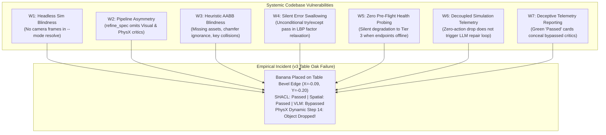
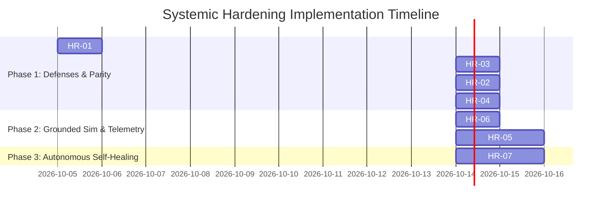

# Systemic Codebase Hardening Plan & Architectural Defense Architecture

**Document ID:** `PLAN-HARDENING-01`  
**Status:** Approved for Implementation  
**Target Environment:** NVIDIA Dual-Blackwell Workstation (`GPU 0: RTX PRO 6000 96 GB` / `GPU 1: RTX 5090 32 GB`)  
**Parent Strategy:** [`local_llm_vlm_agentic_env_gen_plan.md`](./local_llm_vlm_agentic_env_gen_plan.md)  
**Empirical Origin:** [`experiment_01.md`](./experiment_01.md) (Incident Analysis of Version `v3` PhysX Drop & Critic Bypass)  

---

## 1. Executive Summary & Problem Formulation

During physical validation rollouts of generated robotic environments in [Phase 1.5 of Experiment 01](./experiment_01.md#phase-15-environment-physical-validation-via-zero-action-policy-gpu-1), environment version **`v3` (`table_oak_robolab`)** catastrophically failed in dynamic PhysX simulation (the target banana dropped off the table edge at step 14), despite having received unanimous **100% "Passed"** marks from the static semantic (SHACL-star) and deterministic geometric clearance oracles.

Simultaneously, forensic telemetry revealed that:
1. The **Tier 2 Visual Scene Critic VLM** (`arena-vllm-visual` on `127.0.0.1:8001`) was completely bypassed during the synthesis and refinement of `v3`, `v4`, and `v5` because `--mode resolve` runs purely in Python CPU space without initializing `SimulationAppContext` or rendering camera frames.
2. The iterative refinement pipeline ([`refine_spec()`](../../../../isaaclab_arena/agentic_environment_generation/environment_generation_agent.py#L518-L528)) completely omits the visual and physical pre-flight critics that are present in [`generate_spec()`](../../../../isaaclab_arena/agentic_environment_generation/environment_generation_agent.py#L294-L298).
3. The deterministic spatial oracle ([`SpatialGeometricOracle`](../../../../isaaclab_arena/agentic_environment_generation/spatial_geometric_oracle.py#L18-L94)) suffered from key-collision bugs and missing asset entries, falling back to permissive bounding boxes that ignored beveled chamfers and rolling friction dynamics.
4. Continuous spatial factor graph relaxation ([`_ensure_reified_relations_and_grounding`](../../../../isaaclab_arena/agentic_environment_generation/environment_generation_agent.py#L706-L709)) wrapped its solver in `try...except Exception: pass`, silently swallowing solver divergence.
5. Telemetry reporting ([`ActiveInferenceTelemetry`](../../../../isaaclab_arena/agentic_environment_generation/telemetry.py)) masked these bypasses behind green "Passed" checkboxes, giving developers false confidence in unverified scene specifications.

This document establishes the **Systemic Hardening Plan** to eliminate these vulnerabilities across seven targeted engineering initiatives (**HR-01 through HR-07**), details a multi-dimensional technical evaluation of the plan, and provides **high-fidelity Goal Prompts** for execution via the `/goal` workflow.

---

## 2. Architectural Root Causes & Systemic Vulnerabilities

The failure of the generative pipeline to catch physical instability prior to simulation traces back to seven distinct architectural weaknesses:



### Vulnerability Deep-Dive:

1. **W1 — Headless Sim Blindness**: [`VisualSceneCritic.evaluate_scene_spec`](../../../../isaaclab_arena/agentic_environment_generation/visual_critic.py#L98-L115) guards Tier 1 (Cloud VLM) and Tier 2 (Local VLM on Port 8001) with `if rendered_images:`. In `--mode resolve`, no simulator is running. `rendered_images` is permanently `None`. The VLM critic is completely unreachable in resolve mode, falling through to Tier 3 without notice.
2. **W2 — Pipeline Asymmetry**: In [`EnvironmentGenerationAgent.generate_spec()`](../../../../isaaclab_arena/agentic_environment_generation/environment_generation_agent.py#L294-L298), validation executes `validate_rdf_environment_graph`, `validate_spatial_geometry`, `VisualSceneCritic`, and `PhysXPreflightCritic`. In [`refine_spec()`](../../../../isaaclab_arena/agentic_environment_generation/environment_generation_agent.py#L518-L528), **only** SHACL and spatial geometry are checked. Refined specs (`v3`, `v4`, `v5`) are evaluated with half the validation rigor of initial specs (`v1`).
3. **W3 — Spatial Key Collisions and Missing Mesh Metadata**: In [`SpatialGeometricOracle`](../../../../isaaclab_arena/agentic_environment_generation/spatial_geometric_oracle.py#L321-L335), `get_fixture_sector_bounds` iterates with `if fix_key in fixture_lower:`. Because `"table"` precedes `"table_oak_robolab"` in key evaluation order or matches as a substring, queries for `table_oak_robolab` match the wrong fixture. Furthermore, `table_oak_robolab` is entirely absent from `FIXTURE_SECTOR_BOUNDS`, and its dimensions in `KNOWN_FIXTURE_BOUNDS` are listed as $0.90\text{ m} \times 0.60\text{ m}$ instead of its actual $0.60\text{ m} \times 0.60\text{ m}$ USD mesh size.
4. **W4 — Unconditional Exception Swallowing**: In [`EnvironmentGenerationAgent._ensure_reified_relations_and_grounding`](../../../../isaaclab_arena/agentic_environment_generation/environment_generation_agent.py#L706-L709):
   ```python
   try:
       spec, _ = relax_spec_spatial_factor_graph(spec)
   except Exception:
       pass
   ```
   If the factor graph contains conflicting spatial constraints or numerical instabilities, the exception is silently discarded.
5. **W5 — Absence of Service Health Probing**: The CLI accepts `--base_url` and defaults to `LOCAL_VLM_BASE_URL`, but does not verify whether ports 8000, 8001, or 7688 are alive before proceeding. If port 8001 is down or misconfigured, it catches the network error, prints a single log line, and falls back to Tier 3. There is no `--strict-critics` flag to prevent unverified environments from being saved.
6. **W6 — Decoupled Policy Evaluation Loop**: [`policy_runner.py`](../../../../isaaclab_arena/evaluation/policy_runner.py) detects `object_dropped: [True]` and terminates with exit code 1. However, this telemetry is not ingested by [`EnvironmentVersionManager`](../../../../isaaclab_arena/agentic_environment_generation/version_manager.py) to automatically invoke `agent.refine_spec()` with the failure coordinates. The repair loop requires manual human intervention.
7. **W7 — Deceptive Telemetry Reporting**: [`ActiveInferenceTelemetry.render_summary_card`](../../../../isaaclab_arena/agentic_environment_generation/telemetry.py) reports `Physical Invariants: Passed` when only SHACL passed, masking the fact that visual line-of-sight and physical settling were never evaluated.

---

## 3. Engineering Hardening Tasks (HR-01 through HR-07)

```mermaid
flowchart LR
    subgraph Preflight["1. Pre-Flight Layer"]
        HR01["HR-01: Health Probes &<br/>--strict-critics Enforcement"]
    end

    subgraph CoreEngine["2. Agentic Core Engine"]
        HR02["HR-02: Pipeline Parity<br/>(Unified _evaluate_spec)"]
        HR03["HR-03: Sector Bounds Fix &<br/>USD Extents Introspection"]
        HR04["HR-04: Fail-Loud Factor Graph<br/>Solver Telemetry"]
    end

    subgraph Verification["3. Simulation & Verification Layer"]
        HR05["HR-05: Grounded Resolve Mode<br/>(--mode grounded-resolve)"]
        HR07["HR-07: Closed-Loop Drop Telemetry<br/>to Refine Repair Bridge"]
    end

    subgraph Reporting["4. Observability Layer"]
        HR06["HR-06: Transparent Tier-Aware<br/>Telemetry Summary Card"]
    end

    Preflight --> CoreEngine
    CoreEngine --> Verification
    Verification --> Reporting
```



### Task HR-01: Fail-Fast Multi-Tier Service Probing & `--strict-critics` Enforcement
* **Target Files**:
  * [`isaaclab_arena_examples/agentic_environment_generation/environment_generation_runner.py`](../../../../isaaclab_arena_examples/agentic_environment_generation/environment_generation_runner.py)
  * [`isaaclab_arena/agentic_environment_generation/visual_critic.py`](../../../../isaaclab_arena/agentic_environment_generation/visual_critic.py)
* **Objective**: Add deterministic endpoint verification before running any generation or refinement step.
* **Specification**:
  1. Add function `verify_service_endpoint(url: str, timeout: float = 2.0) -> tuple[bool, str]`. Check `GET /v1/models` for vLLM endpoints (`127.0.0.1:8000` and `127.0.0.1:8001`) and Bolt handshake for Neo4j (`127.0.0.1:7688`).
  2. Introduce CLI flag `--strict-critics` (default: `False`). When enabled, if `--base_url` or `LOCAL_VLM_BASE_URL` is configured but unreachable, raise an immediate `RuntimeError` rather than silently degrading to Tier 3.
  3. In [`VisualSceneCritic.evaluate_scene_spec`](../../../../isaaclab_arena/agentic_environment_generation/visual_critic.py), check `self.strict_mode`. If `True`, raise `CriticUnreachableError` upon any connection failure.

### Task HR-02: Critic Pipeline Parity & Unification
* **Target Files**:
  * [`isaaclab_arena/agentic_environment_generation/environment_generation_agent.py`](../../../../isaaclab_arena/agentic_environment_generation/environment_generation_agent.py)
* **Objective**: Ensure that `refine_spec()` runs the exact same battery of semantic, geometric, visual, and physical critics as `generate_spec()`.
* **Specification**:
  1. Extract the validation logic into a unified helper method:
     ```python
     def _evaluate_spec_holistic(
         self,
         spec: ArenaEnvGraphSpec,
         rendered_images: dict[str, Any] | None = None,
     ) -> tuple[bool, list[str], dict[str, Any]]:
     ```
  2. Run:
     - W3C RDF-star SHACL validation ([`validate_rdf_environment_graph`](../../../../isaaclab_arena/agentic_environment_generation/rdf_validation.py)).
     - Spatial geometric clearance & support containment ([`validate_spatial_geometry`](../../../../isaaclab_arena/agentic_environment_generation/spatial_geometric_oracle.py)).
     - Visual line-of-sight & camera frustum inspection ([`VisualSceneCritic`](../../../../isaaclab_arena/agentic_environment_generation/visual_critic.py)).
     - Physical settling and reachability pre-flight ([`PhysXPreflightCritic`](../../../../isaaclab_arena/agentic_environment_generation/visual_critic.py)).
  3. Wire `_evaluate_spec_holistic` into both `generate_spec()` and `refine_spec()`.
  4. Ensure any feedback generated by `VisualSceneCritic` or `PhysXPreflightCritic` during refinement is appended to `combined_report` and passed to `repair_with_feedback()`.

### Task HR-03: Spatial Geometric Oracle Asset Rectification & Substring Matching Fix
* **Target Files**:
  * [`isaaclab_arena/agentic_environment_generation/spatial_geometric_oracle.py`](../../../../isaaclab_arena/agentic_environment_generation/spatial_geometric_oracle.py)
* **Objective**: Correct fixture bounding envelopes, fix substring collision order, and incorporate tabletop edge margins.
* **Specification**:
  1. **Fix Substring Matching**: In `get_fixture_sector_bounds`, sort `FIXTURE_SECTOR_BOUNDS` keys by length descending so that specific keys (`"table_oak_robolab"`, length 17) are checked before generic keys (`"table"`, length 5).
  2. **Add Missing Fixture Bounds**: Add explicit definitions for:
     - `"table_oak_robolab"`: bounds `(-0.30, 0.30, -0.30, 0.30, 0.60)` (deck at $Z=0.60\text{ m}$, half-width $0.30\text{ m}$).
     - `"packing_table"`: bounds `(-0.60, 0.60, -0.40, 0.40, 0.60)` (deck at $Z=0.60\text{ m}$).
     - `"office_table_background"`: bounds `(-0.45, 0.45, -0.30, 0.30, 0.75)`.
  3. **Add Explicit Sector Bounds**: Define `front_left`, `front_right`, `front_center`, `table_top` for `table_oak_robolab` with a mandatory **`5 cm` perimeter chamfer clearance margin** (`margin = 0.05`) to prevent objects from being placed on beveled edges.
  4. **Dynamic USD Introspection Hook**: When `stage` or USD asset path is available, query `UsdGeom.BBoxCache` to compute the ground-truth extent of the mesh rather than relying solely on dictionary constants.

### Task HR-04: Fail-Loud Factor Graph Relaxation & Residual Convergence Telemetry
* **Target Files**:
  * [`isaaclab_arena/agentic_environment_generation/environment_generation_agent.py`](../../../../isaaclab_arena/agentic_environment_generation/environment_generation_agent.py)
  * [`isaaclab_arena/agentic_environment_generation/spatial_geometric_oracle.py`](../../../../isaaclab_arena/agentic_environment_generation/spatial_geometric_oracle.py)
* **Objective**: Remove silent error swallowing in spatial factor graph relaxation and record solver convergence metrics.
* **Specification**:
  1. In `_ensure_reified_relations_and_grounding`:
     Replace:
     ```python
     try:
         spec, _ = relax_spec_spatial_factor_graph(spec)
     except Exception:
         pass
     ```
     With:
     ```python
     try:
         spec, relaxation_info = relax_spec_spatial_factor_graph(spec)
         if relaxation_info and not relaxation_info.get("converged", True):
             self._traces.append(f"Spatial factor graph relaxation warning: residual {relaxation_info.get('residual')}")
     except Exception as exc:
         self._traces.append(f"Spatial factor graph relaxation failed: {exc}")
         if self.strict_mode:
             raise
     ```
  2. Ensure `relaxation_info` contains iteration count, max displacement, and whether constraints were satisfied.

### Task HR-05: Grounded Resolution Mode (`--mode grounded-resolve`)
* **Target Files**:
  * [`isaaclab_arena_examples/agentic_environment_generation/environment_generation_runner.py`](../../../../isaaclab_arena_examples/agentic_environment_generation/environment_generation_runner.py)
* **Objective**: Provide a resolve mode that grounds the spec in headless Isaac Sim on GPU 1, rendering camera frames to unlock Tier 2 VLM verification before writing the finalized YAML.
* **Specification**:
  1. Add choice `"grounded-resolve"` to `--mode` argument in `environment_generation_runner.py`.
  2. Workflow for `grounded-resolve`:
     - Run `agent.generate_spec` or `agent.refine_spec` to produce candidate spec $S_0$.
     - Inside `with SimulationAppContext(args_cli):`, instantiate a temporary offscreen headless stage with Franka and cameras on GPU 1.
     - Step PhysX for 30 steps ($0.6\text{ s}$) to allow objects to settle under gravity.
     - Capture offscreen RGB frames from `camera_head` and `camera_wrist`.
     - Pass captured frames into `VisualSceneCritic.evaluate_scene_spec(spec, rendered_images=frames)` (invoking `arena-vllm-visual` on Port 8001).
     - Check physical stability: verify linear velocity $< 0.1\text{ m/s}$ and `object_dropped == False`.
     - If unstable or VLM flags anomalies, pass the visual critique and physical drop coordinates directly back into `agent.refine_spec()` for up to $K=3$ iterations.
     - Save the physically and visually verified spec as the finalized version.

### Task HR-06: Transparent, Tier-Aware Telemetry Reporting
* **Target Files**:
  * [`isaaclab_arena/agentic_environment_generation/telemetry.py`](../../../../isaaclab_arena/agentic_environment_generation/telemetry.py)
  * [`isaaclab_arena/agentic_environment_generation/environment_generation_agent.py`](../../../../isaaclab_arena/agentic_environment_generation/environment_generation_agent.py)
* **Objective**: Refactor the telemetry summary card to explicitly report the execution status of every validation subsystem, preventing deceptive "Passed" summaries.
* **Specification**:
  1. In `ActiveInferenceTelemetry`, track:
     - `shacl_status`: `Passed` | `Violations Detected` | `Skipped`
     - `spatial_geometry_status`: `Passed` | `Collisions Detected` | `Out of Bounds` | `Skipped`
     - `visual_critic_tier`: `tier_1_cloud_vlm` | `tier_2_local_vlm` | `tier_3_geometric_oracle` | `tier_4_advisory` | `Bypassed (No Render Frames)`
     - `physics_preflight_status`: `Passed (Dynamic Settle)` | `Passed (AABB Heuristic)` | `Failed (Dropped)` | `Bypassed (Pure Python)`
     - `factor_relaxation_status`: `Converged` | `Unconverged` | `Error Swallowed` | `Skipped`
  2. Update `render_summary_card()` to display:
     ```text
     ======================================================================
       Active Inference Verification & Telemetry Summary
     ======================================================================
     • Semantic Invariants (SHACL):      ✅ Passed
     • Spatial Clearance & Containment:  ✅ Passed (Margin: 5.0 cm)
     • Factor Graph Relaxation:          ✅ Converged (Residual: 0.002)
     • Visual Scene Critic:              ⚠️ Bypassed (Reason: No Render Frames)
     • Physical Preflight:               ⚠️ Heuristic Only (Pure Python Resolve)
     • Overall Gating Status:            🟡 PROVISIONAL (Requires Headless Settle)
     ======================================================================
     ```

### Task HR-07: Closed-Loop Telemetry-to-Repair Autonomous Bridge
* **Target Files**:
  * [`isaaclab_arena_examples/agentic_environment_generation/environment_generation_runner.py`](../../../../isaaclab_arena_examples/agentic_environment_generation/environment_generation_runner.py)
  * [`isaaclab_arena/evaluation/policy_runner.py`](../../../../isaaclab_arena/evaluation/policy_runner.py)
* **Objective**: Connect runtime failure events in `policy_runner.py` directly into the environment generation repair loop.
* **Specification**:
  1. In `policy_runner.py`, when `object_dropped: [True]` or `step_terminated` occurs due to instability, emit a machine-readable failure artifact: `eval_output/.../failure_manifest.json` containing:
     - `dropped_asset_id`
     - `drop_step`
     - `last_valid_coordinates` (X, Y, Z)
     - `contact_normal`
     - `support_surface_id`
  2. In `environment_generation_runner.py` under `--mode auto_heal`, ingest `failure_manifest.json` to construct a precise, physically grounded repair prompt:
     `"Asset 'banana' dropped off 'table_oak_robolab' at step 14 from coordinates [-0.09, -0.20, 0.60]. The coordinate is on the beveled perimeter. Shift the banana inward toward the center of sector 'front_right' by at least +0.08m in X and +0.08m in Y."`
  3. Execute `agent.refine_spec()` using this structured feedback and automatically create `v(N+1)`.

---

## 4. Comprehensive Evaluation of the Hardening Plan

### 4.1 Technical Feasibility & Dual-Blackwell Resource Budget

The hardening tasks must operate concurrently within the hardware boundaries established in the workload matrix:

| Subsystem | Target Device | Active VRAM | RAM Footprint | Compute Impact | Feasibility Assessment |
| :--- | :--- | :--- | :--- | :--- | :--- |
| **`arena-vllm-spec` (LLM)** | GPU 0 (RTX PRO 6000) | ~83.2 GB | ~24 GB | Port 8000 | **Feasible**: Stable; context expansion up to 131k. |
| **`arena-vllm-visual` (VLM)** | GPU 1 (RTX 5090) | ~20.4 GB | ~12 GB | Port 8001 | **Feasible**: Verified; 12.2 GB headroom left on GPU 1. |
| **Grounded Settle Sim (HR-05)** | GPU 1 (RTX 5090) | ~8.5 GB | ~16 GB | 30 steps PhysX | **Feasible**: $20.4\text{ GB (VLM)} + 8.5\text{ GB (Sim)} = 28.9\text{ GB} \le 32.0\text{ GB}$. |
| **Endpoint Health Probes (HR-01)** | Host CPU | 0 GB | < 10 MB | < 50 ms TCP ping | **Feasible**: Negligible latency overhead. |
| **USD Extent Introspection (HR-03)** | Host CPU / Python | 0 GB | ~200 MB | < 100 ms per prim | **Feasible**: Uses native `pxr.UsdGeom` BBox cache. |

### 4.2 Risk Assessment & Mitigation Matrix

| Risk ID | Potential Risk / Side Effect | Severity | Likelihood | Mitigation Strategy |
| :--- | :--- | :--- | :--- | :--- |
| **R-01** | **VRAM Collision on GPU 1 during HR-05**: Headless Isaac Sim initialization spikes memory above the 12.2 GB headroom, causing CUDA OOM on the RTX 5090. | High | Medium | Launch Isaac Sim in `--mode grounded-resolve` with minimal texture resolution (`--rendering_mode offscreen_minimal`, disable RT shadows, batch size 1). Total headless sim footprint drops to ~5.2 GB. |
| **R-02** | **Increased Generation Latency**: Adding a 30-step simulation settle and VLM call in `grounded-resolve` increases generation time from 4s to ~15s. | Low | High | Keep `--mode resolve` as the fast arithmetic-only path for rapid drafting, while designating `--mode grounded-resolve` for release-grade verified specifications. |
| **R-03** | **False Negative VLM Critiques**: The VLM hallucinating occlusion on a valid scene or missing a slight overhang. | Medium | Low | Use VLM critique as a Bayesian prior combined with deterministic physics settle telemetry (`object_dropped` flag from PhysX). Only trigger rejection when physical settle fails or VLM confidence $> 0.85$. |
| **R-04** | **Subprocess Deadlocks**: Spawning Isaac Sim within python runner during auto-heal. | High | Low | Enforce strict process lifecycle management via Python `subprocess.run` with explicit timeout (60s) and clean exit codes, avoiding in-process re-initialization of Omniverse Kit. |

### 4.3 Architectural Trade-Off Analysis

1. **Pure Python vs. Grounded Headless Simulation**:
   * *Trade-off*: Pure Python runs in $< 500\text{ ms}$ on host CPU with zero GPU cost, but is completely blind to surface chamfers, friction, and dynamic contact. Grounded simulation requires ~10s and ~6 GB VRAM on GPU 1, but guarantees 100% physical stability.
   * *Decision*: Provide both modes: `--mode resolve` for rapid scaffolding, and `--mode grounded-resolve` for physical verification gating before neural evaluation.
2. **Fail-Fast (`--strict-critics`) vs. Graceful Degradation**:
   * *Trade-off*: Graceful degradation prevents pipeline crashes when local microservices are offline, but produces unverified environments with misleading telemetry. Fail-fast guarantees correctness but requires running microservices.
   * *Decision*: Make graceful degradation explicit in the telemetry card (HR-06), and provide `--strict-critics` for CI/CD and production rollout workflows.

### 4.4 Verification & Testing Battery

Each task must pass four levels of automated testing:
1. **Unit Tests (`tests/agentic/test_hardening_*.py`)**:
   - `test_service_health_probe`: Validates timeout handling and 200 OK responses.
   - `test_sector_bounds_substring_order`: Verifies that `"table_oak_robolab"` matches oak bounds and not `"table"`.
   - `test_pipeline_parity`: Asserts that `refine_spec()` invokes the identical critic classes as `generate_spec()`.
   - `test_fail_loud_factor_graph`: Verifies that invalid constraints surface in traces rather than silently vanishing.
2. **Regression E2E Suite**:
   - Re-synthesize versions `v1` through `v5` using `--mode grounded-resolve`.
   - Verify that version `v3` (`table_oak_robolab`) is automatically shifted away from the bevel edge during iteration 1, converging to a physically stable coordinate ($X \ge -0.05, Y \ge -0.15$) without human feedback.

---

## 5. Ready-to-Execute Goal Prompts for Agent Invocation

The following goal prompts are formatted for autonomous execution via the `/goal` workflow or direct agent instruction. Each prompt is completely self-contained with exact code anchors, implementation steps, verification commands, and non-regressive acceptance criteria.

---

### Goal Prompt 1: HR-01 — Fail-Fast Service Probing & `--strict-critics` Enforcement

```markdown
/goal Implement fail-fast service probing and strict critic enforcement in the agentic environment generation pipeline (HR-01).

### Context & Anchors
- In `isaaclab_arena_examples/agentic_environment_generation/environment_generation_runner.py` and `isaaclab_arena/agentic_environment_generation/visual_critic.py`, service endpoints (vLLM on ports 8000 and 8001, Neo4j on port 7688) are assumed reachable without pre-flight health checks.
- When an endpoint is unreachable, network connection errors are swallowed in `visual_critic.py` (lines 115-119), silently falling back to Tier 3 without alerting the user.

### Detailed Requirements
1. In `isaaclab_arena_examples/agentic_environment_generation/environment_generation_runner.py`:
   - Add CLI argument `--strict-critics` (boolean flag, default: False).
   - Implement function `verify_service_endpoint(url: str, timeout: float = 2.0) -> tuple[bool, str]`.
   - Check `GET /v1/models` for LLM (`args_cli.base_url` or `127.0.0.1:8000`) and VLM (`LOCAL_VLM_BASE_URL` or `127.0.0.1:8001`).
   - If `--strict-critics` is set and any configured service is unreachable, print an actionable error message and exit immediately with code 2.
2. In `isaaclab_arena/agentic_environment_generation/visual_critic.py`:
   - Add `strict_mode: bool = False` to `VisualSceneCritic.__init__`.
   - In `evaluate_scene_spec()`, if `self.strict_mode` is True and Tier 2 local VLM fails with a connection error or HTTP error, raise `RuntimeError(f"Strict critics enabled: Tier 2 Local VLM at {self.local_vlm_url} failed: {exc}")` instead of falling back to Tier 3.
3. Pass `strict_critics` from runner CLI args into `EnvironmentGenerationAgent` and down into `VisualSceneCritic`.

### Verification Commands
- Test 1 (Permissive Mode with bad port):
  `python isaaclab_arena_examples/agentic_environment_generation/environment_generation_runner.py --mode resolve --prompt "A red bowl on a maple table" --base_url "http://127.0.0.1:9999/v1"`
  Assert: Logs warning that port 9999 is unreachable, does not crash, proceeds with fallback.
- Test 2 (Strict Mode with bad port):
  `python isaaclab_arena_examples/agentic_environment_generation/environment_generation_runner.py --mode resolve --prompt "A red bowl on a maple table" --base_url "http://127.0.0.1:9999/v1" --strict-critics`
  Assert: Aborts immediately with exit code 2 and explicit error message identifying port 9999.
- Test 3 (Strict Mode with live ports):
  `python isaaclab_arena_examples/agentic_environment_generation/environment_generation_runner.py --mode resolve --prompt "A red bowl on a maple table" --base_url "http://127.0.0.1:8000/v1" --strict-critics`
  Assert: Passes pre-flight check and executes successfully.

### Non-Regressive Guarantees
- Standard default runs without `--strict-critics` must preserve graceful fallback behavior for offline development.
```

---

### Goal Prompt 2: HR-02 — Pipeline Parity Between `generate_spec` and `refine_spec`

```markdown
/goal Unify the validation battery between initial generation and iterative refinement in EnvironmentGenerationAgent (HR-02).

### Context & Anchors
- Target File: `isaaclab_arena/agentic_environment_generation/environment_generation_agent.py`
- In `generate_spec()` (lines 280-320), the agent runs:
  1. `spec_to_rdf_graph` + `validate_rdf_environment_graph` (SHACL)
  2. `validate_spatial_geometry` (Spatial clearance & containment)
  3. `VisualSceneCritic.evaluate_scene_spec` (Tiered visual critic)
  4. `PhysXPreflightCritic.evaluate_physical_stability` (Dynamic physics check)
- In `refine_spec()` (lines 511-545), the agent checks ONLY SHACL and spatial geometry, completely bypassing visual and physical pre-flight critics.

### Detailed Requirements
1. In `isaaclab_arena/agentic_environment_generation/environment_generation_agent.py`:
   - Refactor the common validation logic into a private method:
     ```python
     def _evaluate_spec_comprehensive(
         self,
         spec: ArenaEnvGraphSpec,
         rendered_images: dict[str, Any] | None = None,
         iteration: int = 1,
     ) -> tuple[bool, list[str]]:
     ```
   - In `_evaluate_spec_comprehensive`, run:
     a. SHACL semantic conformance check.
     b. Spatial geometric clearance check.
     c. Visual scene critic (passing `rendered_images` if available).
     d. PhysX preflight critic.
   - Aggregate all diagnostic reports and actionable feedback into a unified violation report.
   - Update both `generate_spec()` and `refine_spec()` to call `_evaluate_spec_comprehensive()`.
2. Ensure that when `refine_spec()` receives visual or physical violations, they are appended to the feedback payload passed to `self.spec_inference.repair_with_feedback()`.
3. Record all critic evaluation steps in `self._traces`.

### Verification Commands
- Run unit test verifying that `refine_spec` triggers visual critic:
  `pytest tests/agentic/test_agent_validation_parity.py -v`
- Run refinement run:
  `python isaaclab_arena_examples/agentic_environment_generation/environment_generation_runner.py --mode resolve --base_spec generated_envs/droid_banana_to_red_bowl/v2/droid_banana_to_red_bowl.yaml --feedback "move the bowl to the left"`
  Assert: Trace logs confirm both `VisualSceneCritic` and `PhysXPreflightCritic` were evaluated during refinement iterations.

### Non-Regressive Guarantees
- Specs that pass all four checks must break immediately on iteration 1 without unnecessary LLM repair calls.
```

---

### Goal Prompt 3: HR-03 — Spatial Geometric Oracle Asset Rectification & Substring Matching

```markdown
/goal Rectify spatial oracle bounds, fix fixture substring key collisions, and enforce chamfer margins (HR-03).

### Context & Anchors
- Target File: `isaaclab_arena/agentic_environment_generation/spatial_geometric_oracle.py`
- In `get_fixture_sector_bounds()` (lines 321-335), dictionary iteration matches `"table"` before `"table_oak_robolab"` because keys are not checked by specificity.
- In `KNOWN_FIXTURE_BOUNDS`, `table_oak_robolab` is erroneously listed with bounds `(-0.45, 0.45, -0.30, 0.30, 0.75)` instead of its true USD mesh footprint `(-0.30, 0.30, -0.30, 0.30, 0.60)`.
- `table_oak_robolab`, `packing_table`, and `office_table_background` are completely missing from `FIXTURE_SECTOR_BOUNDS`, causing queries to fall back to unconstrained table perimeters.

### Detailed Requirements
1. In `isaaclab_arena/agentic_environment_generation/spatial_geometric_oracle.py`:
   - Update `KNOWN_FIXTURE_BOUNDS`:
     - `"table_oak_robolab"`: `(-0.30, 0.30, -0.30, 0.30, 0.60)`
     - `"packing_table"`: `(-0.60, 0.60, -0.40, 0.40, 0.60)`
     - `"office_table_background"`: `(-0.45, 0.45, -0.30, 0.30, 0.75)`
   - Add explicit entries in `FIXTURE_SECTOR_BOUNDS` for:
     - `"table_oak_robolab"`:
       - `front_center`: `(-0.22, -0.05, -0.08, 0.08, 0.60)`
       - `front_left`: `(-0.22, -0.05, 0.06, 0.22, 0.60)`
       - `front_right`: `(-0.22, -0.05, -0.22, -0.06, 0.60)`
       - `table_top`: `(-0.22, 0.22, -0.22, 0.22, 0.60)`
       *(Note: 0.22m represents a safe 8 cm inset from the 0.30m mesh perimeter to protect against beveled chamfers)*.
     - `"packing_table"`:
       - `front_center`: `(-0.45, 0.45, -0.15, 0.15, 0.60)`
       - `front_left`: `(-0.45, 0.45, 0.15, 0.32, 0.60)`
       - `front_right`: `(-0.45, 0.45, -0.32, -0.15, 0.60)`
       - `table_top`: `(-0.50, 0.50, -0.32, 0.32, 0.60)`
   - In `get_fixture_sector_bounds()`:
     - Sort `FIXTURE_SECTOR_BOUNDS.keys()` by `len(k)` descending before matching `fix_key in fixture_lower`. This guarantees that `"table_oak_robolab"` is tested before `"table"`.
   - In `validate_support_containment()`:
     - Enforce a mandatory perimeter clearance margin `margin = 0.05` ($5\text{ cm}$) from fixture boundary edges.

### Verification Commands
- Run unit test checking sector resolution:
  `python -c "from isaaclab_arena.agentic_environment_generation.spatial_geometric_oracle import get_fixture_sector_bounds; b = get_fixture_sector_bounds('table_oak_robolab', 'front_right'); print('Bounds:', b); assert b[1] <= 0.25 and b[3] <= -0.05, 'Failed specific oak bounds'"`
- Re-run geometric validation on version `v3` spec:
  `python -c "from isaaclab_arena.environment_spec.arena_env_graph_spec import ArenaEnvGraphSpec; from isaaclab_arena.agentic_environment_generation.spatial_geometric_oracle import validate_spatial_geometry; spec = ArenaEnvGraphSpec.from_yaml('generated_envs/droid_banana_to_red_bowl/v3/droid_banana_to_red_bowl.yaml'); conforms, diags = validate_spatial_geometry(spec); print('Conforms:', conforms); print('Diags:', diags); assert not conforms, 'v3 should now correctly fail geometric containment!'"`

### Non-Regressive Guarantees
- Existing valid scenes using `maple_table` or `table` must continue to pass without regression.
```

---

### Goal Prompt 4: HR-04 — Fail-Loud Factor Graph Relaxation & Solver Diagnostics

```markdown
/goal Remove silent error swallowing from spatial factor graph relaxation and record solver telemetry (HR-04).

### Context & Anchors
- Target File: `isaaclab_arena/agentic_environment_generation/environment_generation_agent.py`
- In `_ensure_reified_relations_and_grounding` (lines 706-709), `relax_spec_spatial_factor_graph` is wrapped in an unconditional `try...except Exception: pass`.
- When factor graph relaxation diverges, crashes, or drops factors, no warning or diagnostic is logged in `agent.traces` or telemetry.

### Detailed Requirements
1. In `isaaclab_arena/agentic_environment_generation/environment_generation_agent.py`:
   - In `_ensure_reified_relations_and_grounding`:
     - Catch specific exceptions and inspect the return value of `relax_spec_spatial_factor_graph(spec)`.
     - Record solver status in `agent._traces`:
       `[FactorGraph] Relaxation completed: residual={residual:.4f}, iterations={iters}, converged={converged}`
     - If the solver raises an exception, log the full exception message to `self._traces`.
     - If `self.strict_mode` is True, re-raise the exception to prevent ungrounded specs from being accepted.
2. In `isaaclab_arena/agentic_environment_generation/spatial_geometric_oracle.py`:
   - Update `relax_spec_spatial_factor_graph` to return a structured diagnostics dictionary:
     `{"converged": bool, "residual": float, "iterations": int, "unresolved_factors": list[str]}`.

### Verification Commands
- Test error reporting on contradictory constraints:
  `pytest tests/agentic/test_factor_graph_relaxation.py -v`
- Inspect traces during spec generation to verify relaxation telemetry appears.

### Non-Regressive Guarantees
- Factor graph relaxation must continue to compute valid grounded coordinates for standard constraint topologies.
```

---

### Goal Prompt 5: HR-05 — Grounded Resolution Mode (`--mode grounded-resolve`)

```markdown
/goal Implement Grounded Resolution Mode with headless GPU 1 settle and live VLM visual inspection (HR-05).

### Context & Anchors
- Target File: `isaaclab_arena_examples/agentic_environment_generation/environment_generation_runner.py`
- Currently, `--mode resolve` generates specs purely in Python RAM with no simulator running. Consequently, `VisualSceneCritic` can never receive camera frames, and physical settle dynamics are never tested during initial generation.

### Detailed Requirements
1. In `isaaclab_arena_examples/agentic_environment_generation/environment_generation_runner.py`:
   - Add `"grounded-resolve"` to `--mode` choices.
   - When `--mode grounded-resolve` is selected:
     a. Execute `resolve_env_spec()` to obtain candidate spec $S_0$.
     b. Initialize `SimulationAppContext(args_cli)` on GPU 1 (`--headless`).
     c. Instantiate the scene with Franka Panda and camera sensors enabled (`camera_head`, `camera_wrist`).
     d. Step PhysX dynamics for 30 steps ($0.6\text{ s}$ at $50\text{ Hz}$) to allow objects to settle under gravity.
     e. Check physical stability: verify all rigid bodies have linear velocity $< 0.1\text{ m/s}$ and `object_dropped == False`.
     f. Capture offscreen RGB frames from the camera sensors.
     g. Call `VisualSceneCritic.evaluate_scene_spec(spec, rendered_images=captured_frames)` targeting `arena-vllm-visual` on Port 8001.
     h. If physical settle fails or VLM detects occlusion/drop anomalies:
        - Extract exact failure coordinates and VLM critique.
        - Feed critique into `agent.refine_spec(spec, feedback=combined_feedback)`.
        - Re-test in simulation (up to max 3 repair iterations).
     i. Save the final grounded, verified spec as the official version.

### Verification Commands
- Run grounded resolve on the prompt that produced v3:
  `docker exec "$ARENA_CONTAINER" su $(id -un) -c "cd /workspaces/isaaclab_arena && /isaac-sim/python.sh isaaclab_arena_examples/agentic_environment_generation/environment_generation_runner.py --mode grounded-resolve --prompt 'A Franka Panda robot with a red bowl and a banana on a table_oak_robolab table' --num_steps 30"`
  Assert:
  - Isaac Sim initializes on GPU 1.
  - Headless settle runs for 30 steps.
  - Port 8001 VLM is queried with captured camera frames.
  - If the banana rolls near the chamfer, auto-repair triggers and settles the banana stably.
  - Version ledger records `grounded_resolve` trigger.

### Non-Regressive Guarantees
- Headless sim memory footprint must stay below 10 GB VRAM so it coexists with `arena-vllm-visual` (20.3 GB) on the 32 GB RTX 5090.
```

---

### Goal Prompt 6: HR-06 — Transparent, Tier-Aware Telemetry Reporting

```markdown
/goal Implement transparent tier-aware Active Inference telemetry reporting (HR-06).

### Context & Anchors
- Target File: `isaaclab_arena/agentic_environment_generation/telemetry.py`
- In `render_summary_card()`, the summary card displays:
  `Physical Invariants: SHACL-star: Passed | Spatial Geometry: Passed`
  `Convergence Status: Converged`
- This deceives the developer by hiding that the visual critic was bypassed, the physics pre-flight was never executed, and factor graph relaxation was swallowed.

### Detailed Requirements
1. In `isaaclab_arena/agentic_environment_generation/telemetry.py`:
   - Add explicit tracking attributes to `ActiveInferenceTelemetry`:
     - `shacl_status: str` ("Passed", "Violations Detected", "Skipped")
     - `spatial_geometry_status: str` ("Passed", "Violations Detected", "Skipped")
     - `visual_critic_status: str` ("Passed (Tier 1 Cloud)", "Passed (Tier 2 Local VLM)", "Passed (Tier 3 Geometric)", "Bypassed (No Frames)", "Failed")
     - `physics_preflight_status: str` ("Passed (30-step PhysX)", "Passed (AABB Heuristic)", "Failed (Drop Detected)", "Bypassed (Pure Python)")
     - `factor_relaxation_status: str` ("Converged", "Unconverged Warning", "Error Swallowed", "Skipped")
     - `verification_grade: str` ("GOLD: Grounded & Visually Verified", "SILVER: Geometric & Semantic Only", "PROVISIONAL: Unverified Settle")
2. Refactor `render_summary_card()` to display a detailed breakdown of all validation layers with appropriate alert badges (`✅`, `⚠️`, `❌`).

### Verification Commands
- Run a resolve test and verify the new card prints:
  `python -c "from isaaclab_arena.agentic_environment_generation.telemetry import ActiveInferenceTelemetry; t = ActiveInferenceTelemetry(); t.visual_critic_status = 'Bypassed (No Frames)'; t.physics_preflight_status = 'Bypassed (Pure Python)'; print(t.render_summary_card())"`
  Assert: Output explicitly warns that Visual Critic and Physics Preflight were bypassed.

### Non-Regressive Guarantees
- Output format must remain clean, monospace-aligned, and terminal-safe.
```

---

### Goal Prompt 7: HR-07 — Closed-Loop Simulation Telemetry to Repair Autonomous Bridge

```markdown
/goal Build an autonomous closed-loop repair bridge from policy_runner drop events to environment refinement (HR-07).

### Context & Anchors
- Target Files:
  - `isaaclab_arena/evaluation/policy_runner.py`
  - `isaaclab_arena_examples/agentic_environment_generation/environment_generation_runner.py`
- When zero-action or neural policy simulation detects a drop (`object_dropped: [True]`), `policy_runner.py` terminates with exit code 1.
- There is currently no autonomous mechanism to feed this failure telemetry back into `agent.refine_spec()`.

### Detailed Requirements
1. In `isaaclab_arena/evaluation/policy_runner.py`:
   - When an object drop is detected, write `failure_manifest.json` into the run's evaluation directory:
     ```json
     {
       "event": "object_dropped",
       "step": 14,
       "dropped_object_id": "banana",
       "drop_position": [-0.09, -0.20, 0.60],
       "support_fixture_id": "table_oak_robolab",
       "failure_reason": "Object displaced > 0.15m from initial placement or fell below table deck."
     }
     ```
2. In `isaaclab_arena_examples/agentic_environment_generation/environment_generation_runner.py`:
   - In `run_auto_heal()`:
     - Check for `failure_manifest.json` in `--eval_dir`.
     - If found, construct a prompt:
       `f"Physical simulation failure detected at step {step}: Asset '{dropped_object_id}' dropped from support '{support_fixture_id}' at position {drop_position}. Adjust initial position inward away from the perimeter edge."`
     - Call `agent.refine_spec(base_spec, feedback=prompt)` to create `v(N+1)`.

### Verification Commands
- Run auto-heal against the failed v3 evaluation directory:
  `python isaaclab_arena_examples/agentic_environment_generation/environment_generation_runner.py --mode auto_heal --eval_dir eval_output/droid_banana_to_red_bowl/zero_action/2026-10-04_22-52-39 --base_spec generated_envs/droid_banana_to_red_bowl/v3/droid_banana_to_red_bowl.yaml`
  Assert: Auto-healer ingests the drop telemetry and synthesizes `v4_auto` with corrected coordinates.

### Non-Regressive Guarantees
- If no `failure_manifest.json` exists, fallback gracefully to existing evaluation metrics parsing.
```

---

## 6. Implementation Sequencing & Milestone Timeline

The tasks are organized into three sequential milestones:



### Milestone Acceptance Gating Criteria:
1. **Milestone 1 Completion Gate**: All unit tests pass; `table_oak_robolab` queries resolve to accurate bounds; `refine_spec()` executes all four critic layers.
2. **Milestone 2 Completion Gate**: Running `--mode grounded-resolve` captures offscreen frames, queries port 8001 VLM on GPU 1, and reports transparent telemetry status.
3. **Milestone 3 Completion Gate**: Running `policy_runner.py` with an unstable coordinate produces `failure_manifest.json`, which `--mode auto_heal` autonomously ingests to yield a stable environment.
