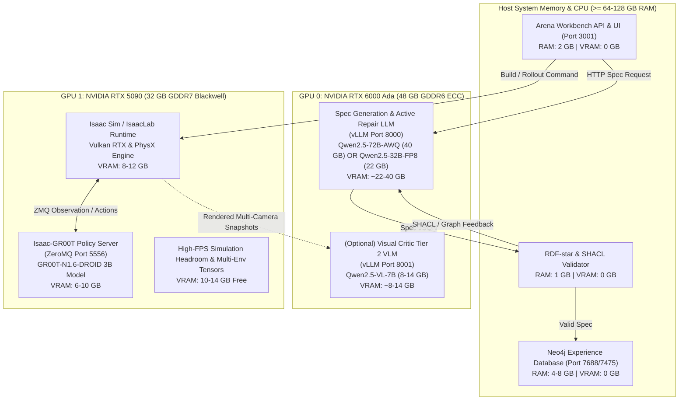

# Local LLM & VLM Inference Execution Plan for Agentic Environment Generation

**Status:** Draft / Active Implementation Plan  
**Owner:** Isaac Lab-Arena Core Engineering  
**Scope:** Execution of self-hosted local Large Language Models (LLM) and Vision-Language Models (VLM) for `agentic_environment_generation` (spec synthesis, active inference self-healing, and visual perception criticism) utilizing an **NVIDIA RTX 6000 Ada (48 GB)** and **NVIDIA RTX 5090 (32 GB)** dual-GPU topology.

---

## 1. Executive Summary & Hardware Context

The `agentic_environment_generation` and evaluation ecosystem in Isaac Lab-Arena consists of four demanding computational systems:
1. **Neo4j Experience Database (LPG)**: Stores environment graphs, reified factors, and evaluation run telemetry.
2. **Isaac-GR00T / OpenPI Policy Server**: ZeroMQ RPC policy inference server executing robot control actions.
3. **Isaac Sim / IsaacLab Simulation Runtime**: Real-time PhysX simulation, Vulkan RTX camera rendering, and USD stage manipulation.
4. **Agentic Spec Generation & Criticism (LLM + VLM)**: Structured schema generation, Active Bayesian repair, and multi-camera visual occlusion criticism.

By installing the **RTX 5090 (32 GB GDDR7)** alongside the existing **RTX 6000 Ada (48 GB GDDR6)**, the system achieves **80 GB total GPU VRAM**. This enables a completely local, air-gapped, zero-cloud pipeline without VRAM collisions or thrashing.

---

## 2. Workload Resource Accounting & Memory Budget

### 2.1 Component Resource Footprint

| Component | Execution Target | VRAM Footprint | Host System RAM | Notes / Sizing |
| :--- | :--- | :--- | :--- | :--- |
| **Neo4j 5.26 LPG** | Host CPU / Docker | **0 GB (No GPU)** | **4 – 8 GB** | Java JVM Heap (`-Xms2G -Xmx4G`) + pagecache. Does not utilize CUDA. |
| **Workbench Web API & UI** | Host CPU / Docker | **0 GB (No GPU)** | **1 – 2 GB** | Python FastAPI + Node.js frontend. |
| **SHACL & RDF-star Validator** | Host CPU / Python | **0 GB (No GPU)** | **0.5 – 1 GB** | `pyshacl` + `rdflib` graph validation. |
| **Isaac Sim / IsaacLab** | **GPU (Vulkan / CUDA)** | **8 – 12 GB** | **16 – 32 GB** | PhysX dynamics, USD stage, headless offscreen rendering for multi-camera sensors. |
| **Isaac-GR00T Policy Server** | **GPU (CUDA / PyTorch)**| **6 – 10 GB** | **8 – 16 GB** | `nvidia/GR00T-N1.6-DROID` (3B model) or OpenPI policy over ZeroMQ (`port 5556`). |
| **Spec Generation LLM** | **GPU (CUDA / vLLM)** | **22 – 42 GB** | **16 – 32 GB** | Qwen2.5-72B (AWQ: ~40 GB) or Qwen2.5-32B (FP8: ~22 GB, BF16: ~32 GB). |
| **Visual Scene Critic VLM** | **GPU (CUDA / vLLM)** | **8 – 14 GB** | **8 – 16 GB** | Qwen2.5-VL-7B (BF16: ~14 GB, AWQ: ~8 GB) on Tier 2 perception. |

### 2.2 System Memory (DRAM) Requirement
- **Total System RAM Needed:** ~64 GB minimum, **128 GB recommended**.
- Neo4j, Isaac Sim host buffers, vLLM CPU memory pool, and Docker shared memory (`--ipc=host`) can run concurrently without paging.

---

## 3. Dual-GPU Partitioning Strategy: Functional Separation

Rather than attempting heterogeneous Tensor Parallelism (TP=2) across differing architectures (Ada Lovelace `sm_89` vs. Blackwell `sm_120`), which causes NCCL kernel divergence, clock throttling, and memory clamping to 32 GB, the architecture adopts **strict Functional Separation**:



### Partitioning Rationale

1. **GPU 0 (RTX 6000 Ada, 48 GB) as the Cognitive / Reasoning Engine:**
   - **Large Continuous VRAM Pool:** Deep language models with long context windows (32k tokens) require large KV caches. 48 GB comfortably accommodates `Qwen2.5-72B-Instruct` (AWQ 4-bit) or a concurrent pair of `Qwen2.5-32B-Instruct` (FP8) + `Qwen2.5-VL-7B-Instruct`.
   - **Isolation from Graphics Interrupts:** The cognitive server runs isolated from rendering display servers or Vulkan context recreations, preventing out-of-memory crashes during generation loops.

2. **GPU 1 (RTX 5090, 32 GB) as the Physical Simulation & Policy Execution Engine:**
   - **Massive Compute & Memory Bandwidth (Blackwell):** The RTX 5090 delivers unmatched FP4/FP8 compute and ~1,792 GB/s bandwidth. This maximizes ray-traced rendering framerates and accelerates low-latency policy rollouts in Isaac Sim and GR00T.
   - **Combined Sim + Policy Footprint:** Isaac Sim (~10 GB) and GR00T 3B (~8 GB) total ~18 GB, leaving **~14 GB of safe VRAM headroom** on the 5090 for parallel simulation environments (`--num_envs 4` to `8`) and camera rendering buffers.

---

## 4. Hardware Installation & Preflight Checklist (RTX 5090 Integration)

Before launching the dual-GPU stack, complete the following physical and system preflight checks:

1. **Power Supply Unit (PSU) Capacity:**
   - RTX 6000 Ada: 300W TDP.
   - RTX 5090: Up to 600W TDP.
   - CPU + Motherboard + Storage: ~250–350W.
   - **Requirement:** A high-quality **1200W–1600W PSU** (ATX 3.1 / PCIe 5.1 compliant) with dedicated native 12V-2x6 (16-pin) cable for the RTX 5090 and dedicated 8-pin PCIe cables for the RTX 6000 Ada.
2. **PCIe Slot Configuration & Motherboard Bifurcation:**
   - Slot 1 (RTX 5090): PCIe Gen 5 x16 (or Gen 4 x16).
   - Slot 2 (RTX 6000 Ada): PCIe Gen 4 x16 (or Gen 4 x8).
   - Verify motherboard bifurcation in BIOS so both slots maintain $\ge 8$ PCIe Gen 4/5 lanes.
3. **Driver & CUDA Support for Blackwell (`sm_120`):**
   - Blackwell architecture requires **NVIDIA Linux Driver $\ge 570.xx$** and **CUDA Toolkit $\ge 12.8$**.
   - Verify host driver after physical installation:
     ```bash
     nvidia-smi --query-gpu=index,name,memory.total,compute_cap --format=csv
     ```
     Expected output:
     ```
     0, NVIDIA RTX 6000 Ada Generation, 49140 MiB, 8.9
     1, NVIDIA GeForce RTX 5090, 32768 MiB, 12.0
     ```

---

## 5. End-to-End Local Execution Runbook

### Phase 1: Start Neo4j Database on Host (Zero VRAM)
```bash
# Starts on Host CPU / System RAM using Docker
docker run -d --name arena-envgen-neo4j \
  --restart unless-stopped \
  -p 127.0.0.1:7475:7474 \
  -p 127.0.0.1:7688:7687 \
  -e NEO4J_AUTH=neo4j/arena_local_password \
  --mount source=arena-envgen-neo4j-data,target=/data \
  neo4j:5.26-community
```

---

### Phase 2: Launch Local Inference on GPU 0 (RTX 6000 Ada)

Pin vLLM strictly to **GPU 0** (`CUDA_VISIBLE_DEVICES=0`).

#### Option 2A: High-Reasoning 72B Configuration (Single Unified Port)
Serve `Qwen2.5-72B-Instruct-AWQ` on Port 8000:
```bash
CUDA_VISIBLE_DEVICES=0 vllm serve Qwen/Qwen2.5-72B-Instruct-AWQ \
  --host 0.0.0.0 \
  --port 8000 \
  --max-model-len 32768 \
  --guided-decoding-backend outlines \
  --api-key local-arena-token \
  --gpu-memory-utilization 0.90
```

#### Option 2B: Dual LLM + VLM Concurrent Configuration
If running both a dedicated 32B spec generator and a 7B visual critic:
```bash
# Terminal 1: Spec Generation LLM on Port 8000 (~22 GB VRAM)
CUDA_VISIBLE_DEVICES=0 vllm serve Qwen/Qwen2.5-32B-Instruct \
  --host 0.0.0.0 \
  --port 8000 \
  --max-model-len 32768 \
  --quantization fp8 \
  --guided-decoding-backend outlines \
  --api-key local-arena-token \
  --gpu-memory-utilization 0.50

# Terminal 2: Visual Perception VLM on Port 8001 (~14 GB VRAM)
CUDA_VISIBLE_DEVICES=0 vllm serve Qwen/Qwen2.5-VL-7B-Instruct \
  --host 0.0.0.0 \
  --port 8001 \
  --max-model-len 8192 \
  --api-key local-arena-token \
  --limit-mm-per-prompt image=4 \
  --gpu-memory-utilization 0.35
```

---

### Phase 3: Launch GR00T Policy Server on GPU 1 (RTX 5090)

The GR00T server launcher in [run_gr00t_server.sh](../../../../docker/run_gr00t_server.sh) supports detached execution. Pass `NVIDIA_VISIBLE_DEVICES=1` or configure docker to bind GPU 1:

```bash
# Launch GR00T policy server bound to GPU 1
docker run -d \
  --name gr00t-server \
  --gpus '"device=1"' \
  --network host \
  --ipc host \
  gr00t-dev:latest \
  uv run python gr00t/eval/run_gr00t_server.py \
    --model-path nvidia/GR00T-N1.6-DROID \
    --embodiment-tag OXE_DROID \
    --port 5556 \
    --device cuda:0
```
*(Inside the container with `--gpus '"device=1"'`, the RTX 5090 is presented as `cuda:0`.)*

---

### Phase 4: Launch IsaacLab-Arena Simulation Container on GPU 1 (RTX 5090)

Launch the simulation runtime pinned to **GPU 1**:

```bash
# Modify or override docker run flags to bind device 1
docker exec -it --env CUDA_VISIBLE_DEVICES=1 \
  isaaclab_arena-local su $(id -un)
```
*(Or launch [run_docker.sh](../../../../docker/run_docker.sh) with `--gpus '"device=1"'`)*

---

### Phase 5: Execute End-to-End Generation & Simulation Rollout

Inside the Arena container shell on GPU 1:

#### 1. Generate & Resolve Environment Spec via GPU 0:
```bash
/isaac-sim/python.sh isaaclab_arena_examples/agentic_environment_generation/environment_generation_runner.py \
  --mode resolve \
  --prompt "Droid grasps the yellow banana from the right side of the maple table and places it onto the large white ceramic plate on the left." \
  --base_url "http://localhost:8000/v1" \
  --model "Qwen/Qwen2.5-72B-Instruct-AWQ" \
  --api_key "local-arena-token"
```

#### 2. Execute Isaac Sim Gym Build & Zero-Action Rollout on GPU 1:
```bash
/isaac-sim/python.sh isaaclab_arena_examples/agentic_environment_generation/environment_generation_runner.py \
  --mode build \
  --headless \
  --num_envs 1 \
  --env_graph_spec_yaml isaaclab_arena_environments/agent_generated/droid_grasps_the_yellow_banana_env_graph.yaml
```

#### 3. Evaluate Policy with GR00T Policy Server on GPU 1:
Run evaluation against the live ZeroMQ GR00T server on port 5556:
```bash
/isaac-sim/python.sh isaaclab_arena/policy/policy_runner.py \
  --env_graph_spec_yaml isaaclab_arena_environments/agent_generated/droid_grasps_the_yellow_banana_env_graph.yaml \
  --policy_endpoint "tcp://127.0.0.1:5556" \
  --num_episodes 5 \
  --headless
```

---

## 6. Verification Gates for the Dual-GPU Architecture

| Gate | Target Subsystem | Pass Criteria |
| :--- | :--- | :--- |
| **Gate 1: Hardware Preflight** | `nvidia-smi` | GPU 0 (RTX 6000 Ada, 48GB) and GPU 1 (RTX 5090, 32GB) visible under Driver $\ge 570$. |
| **Gate 2: Cognitive Engine Isolation** | vLLM on GPU 0 | Peak VRAM $\le 44$ GB; constructor probe returns HTTP 200 within 2.0s. |
| **Gate 3: Simulation & Policy Concurrency** | Isaac Sim + GR00T on GPU 1 | Combined VRAM usage $\le 22$ GB on RTX 5090; zero Vulkan allocation errors; 0 FPS degradation. |
| **Gate 4: Schema & Active Inference** | `ArenaEnvGraphSpec` parser | Zero grammar truncation; SHACL constraints and USD spatial bounds converge in $\le 2$ iterations. |
| **Gate 5: Full Policy Evaluation Rollout** | ZeroMQ RPC (Port 5556) | ZeroMQ communication latency $\le 25\text{ ms}$; robot executes policy trajectories without CUDA OOM. |
