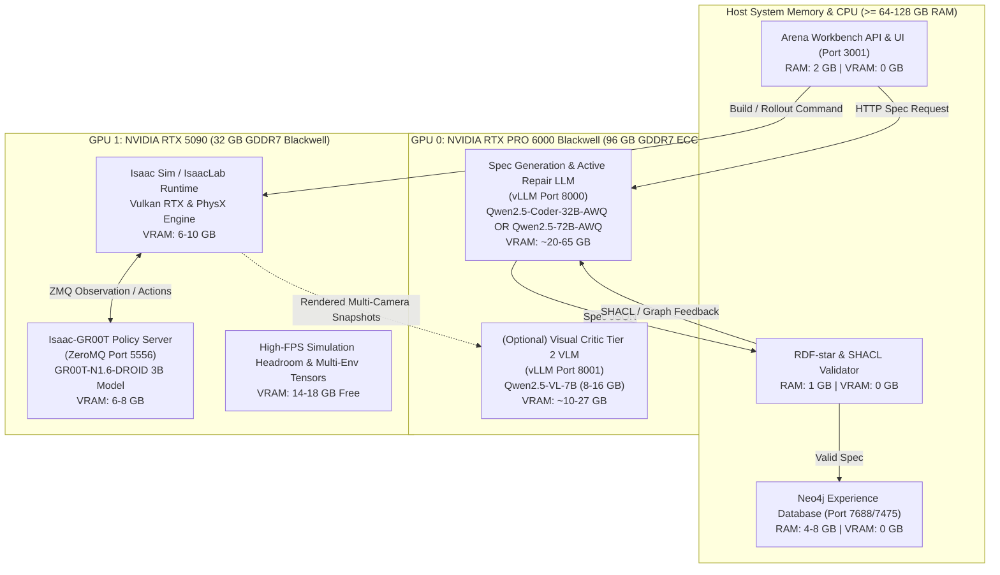

# Local LLM & VLM Inference Execution Plan for Agentic Environment Generation

**Status:** Draft / Active Implementation Plan  
**Owner:** Isaac Lab-Arena Core Engineering  
**Scope:** Execution of self-hosted local Large Language Models (LLM) and Vision-Language Models (VLM) for `agentic_environment_generation` (spec synthesis, active inference self-healing, and visual perception criticism) utilizing an **NVIDIA RTX PRO 6000 Blackwell Workstation (96 GB GDDR7 ECC)** and **NVIDIA GeForce RTX 5090 (32 GB GDDR7)** dual-GPU topology.

---

## 1. Executive Summary & Hardware Context

The `agentic_environment_generation` and evaluation ecosystem in Isaac Lab-Arena consists of four demanding computational systems:
1. **Neo4j Experience Database (LPG)**: Stores environment graphs, reified factors, and evaluation run telemetry.
2. **Isaac-GR00T / OpenPI Policy Server**: ZeroMQ RPC policy inference server executing robot control actions.
3. **Isaac Sim / IsaacLab Simulation Runtime**: Real-time PhysX simulation, Vulkan RTX camera rendering, and USD stage manipulation.
4. **Agentic Spec Generation & Criticism (LLM + VLM)**: Structured schema generation, Active Bayesian repair, and multi-camera visual occlusion criticism.

By installing the **RTX 5090 (32 GB GDDR7)** alongside the **RTX PRO 6000 Blackwell (96 GB GDDR7 ECC)**, the system achieves **128 GB total GPU VRAM**. This enables a completely local, air-gapped, zero-cloud pipeline without VRAM collisions or thrashing.

---

## 2. Workload Resource Accounting & Memory Budget

### 2.1 Component Resource Footprint

| Component | Execution Target | VRAM Footprint | Host System RAM | Notes / Sizing |
| :--- | :--- | :--- | :--- | :--- |
| **Neo4j 5.26 LPG** | Host CPU / Docker | **0 GB (No GPU)** | **4 – 8 GB** | Java JVM Heap (`-Xms2G -Xmx4G`) + pagecache. Does not utilize CUDA. |
| **Workbench Web API & UI** | Host CPU / Docker | **0 GB (No GPU)** | **1 – 2 GB** | Python FastAPI + Node.js frontend. |
| **SHACL & RDF-star Validator** | Host CPU / Python | **0 GB (No GPU)** | **0.5 – 1 GB** | `pyshacl` + `rdflib` graph validation. |
| **Isaac Sim / IsaacLab** | **GPU (Vulkan / CUDA)** | **8 – 12 GB** | **16 – 32 GB** | PhysX dynamics, USD stage, headless offscreen rendering for multi-camera sensors. |
| **Isaac-GR00T Policy Server** | **GPU (CUDA / PyTorch)**| **6 – 10 GB** | **8 – 16 GB** | `nvidia/GR00T-N1.6-DROID` (3B model) or OpenPI policy over ZeroMQ (`port 5556`). |
| **Spec Generation LLM** | **GPU (CUDA / vLLM)** | **20 – 65 GB** | **16 – 32 GB** | Qwen2.5-Coder-32B-AWQ (Primary Standard: ~19.5 GB weights + 4–43 GB KV cache) or Qwen2.5-72B-AWQ (Future Stress: ~40 GB). |
| **Visual Scene Critic VLM** | **GPU (CUDA / vLLM)** | **8 – 27 GB** | **8 – 16 GB** | Qwen2.5-VL-7B (BF16: ~14–27 GB, AWQ: ~8 GB) on Tier 2 perception. |

### 2.2 System Memory (DRAM) Requirement
- **Total System RAM Needed:** ~64 GB minimum, **128 GB recommended**.
- Neo4j, Isaac Sim host buffers, vLLM CPU memory pool, and Docker shared memory (`--ipc=host`) can run concurrently without paging.

---

## 3. Dual-GPU Partitioning Strategy: Functional Separation

Rather than attempting Tensor Parallelism (TP=2) across differing card tiers (RTX PRO 6000 96 GB vs. RTX 5090 32 GB), which eliminates NVLink, clamps aggregate VRAM to the lowest denominator ($32\text{ GB} \times 2 = 64\text{ GB}$, wasting 64 GB of the PRO 6000), and introduces PCIe cross-traffic during real-time physics, the architecture adopts **strict Functional Separation**:



### Partitioning Rationale

1. **GPU 0 (RTX PRO 6000 Blackwell, 96 GB) as the Cognitive / Reasoning Engine:**
   - **Massive Continuous VRAM Pool:** Deep language models with long context windows (32k–64k tokens) require large KV caches. 96 GB comfortably accommodates `Qwen2.5-Coder-32B-Instruct-AWQ` at extended context alongside `Qwen2.5-VL-7B-Instruct` simultaneously, or large 72B parameter architectures.
   - **Isolation from Graphics Interrupts:** The cognitive server runs isolated from rendering display servers or Vulkan context recreations, preventing out-of-memory crashes during generation loops.

2. **GPU 1 (RTX 5090, 32 GB) as the Physical Simulation & Policy Execution Engine:**
   - **Massive Compute & Memory Bandwidth (Blackwell):** The RTX 5090 delivers unmatched FP4/FP8 compute and ~1,792 GB/s bandwidth. This maximizes ray-traced rendering framerates and accelerates low-latency policy rollouts in Isaac Sim and GR00T.
   - **Combined Sim + Policy Footprint:** Isaac Sim (~6–10 GB) and GR00T 3B (~7.2 GB) total ~14–17 GB, leaving **~15–18 GB of safe VRAM headroom** on the 5090 for parallel simulation environments (`--num_envs 4` to `8`) and camera rendering buffers.

---

## 4. Hardware Installation & Preflight Checklist (RTX 5090 Integration)

Before launching the dual-GPU stack, complete the following physical and system preflight checks:

1. **Power Supply Unit (PSU) Capacity:**
   - RTX 6000 Ada: 300W TDP.
   - RTX 5090: Up to 600W TDP.
   - CPU + Motherboard + Storage: ~250–350W.
   - **Requirement:** A high-quality **1200W–1600W PSU** (ATX 3.1 / PCIe 5.1 compliant) with dedicated native 12V-2x6 (16-pin) cable for the RTX 5090 and dedicated 8-pin PCIe cables for the RTX 6000 Ada.
2. **PCIe Slot Configuration & Motherboard Bifurcation:**
   - Slot 1 (RTX 5090): PCIe Gen 5 x16 (or Gen 4 x16).
   - Slot 2 (RTX 6000 Ada): PCIe Gen 4 x16 (or Gen 4 x8).
   - Verify motherboard bifurcation in BIOS so both slots maintain $\ge 8$ PCIe Gen 4/5 lanes.
3. **Driver & CUDA Support for Blackwell (`sm_120`):**
   - Blackwell architecture requires **NVIDIA Linux Driver $\ge 570.xx$** and **CUDA Toolkit $\ge 12.8$**.
   - Verify host driver after physical installation:
     ```bash
     nvidia-smi --query-gpu=index,name,memory.total,compute_cap --format=csv
     ```
     Expected output:
     ```
     0, NVIDIA RTX 6000 Ada Generation, 49140 MiB, 8.9
     1, NVIDIA GeForce RTX 5090, 32768 MiB, 12.0
     ```

---

## 5. End-to-End Local Execution Runbook

### Phase 1: Start Neo4j Database on Host (Zero VRAM)
```bash
# Starts on Host CPU / System RAM using Docker
docker run -d --name arena-envgen-neo4j \
  --restart unless-stopped \
  -p 127.0.0.1:7475:7474 \
  -p 127.0.0.1:7688:7687 \
  -e NEO4J_AUTH=neo4j/arena_local_password \
  --mount source=arena-envgen-neo4j-data,target=/data \
  neo4j:5.26-community
```

---

### Phase 2: Launch Local Cognitive Inference on GPU 0 (RTX PRO 6000 Blackwell)

All cognitive inference runs on **GPU 0** (`CUDA_VISIBLE_DEVICES=0`), isolated from real-time physics simulation.

#### Architectural Model Hierarchy: Why 32B vs. 72B?
The planning documentation references two Qwen model scales for distinct operational roles:
1. **Primary Operational Standard — `Qwen/Qwen2.5-Coder-32B-Instruct-AWQ` (Port 8000)**:
   - **Specialization**: Specifically fine-tuned on code, ASTs, and structured Pydantic schemas. With greedy decoding (`--temperature 0.0`), it generates 100% compliant Arena factor graph YAML without schema hallucinations.
   - **Performance**: Delivers steady $\sim 62\text{ tokens/s}$ throughput on the RTX PRO 6000 Blackwell.
   - **VRAM Efficiency**: At $\sim 19.5\text{ GB}$ weights, it leaves over $70\text{ GB}$ of VRAM on GPU 0. This allows scaling context up to $64\text{k}$ or $128\text{k}$ tokens while concurrently hosting the visual critic (`Qwen2.5-VL-7B-Instruct`) on Port 8001.
2. **Future High-Parameter Stress Test — `Qwen/Qwen2.5-72B-Instruct-AWQ`**:
   - **Specialization**: Retained for future high-complexity benchmarks ([Section 9.3 of `experiments.md`](experiments.md#93-future-experiment-3-high-parameter--context-stress-testing-qwen-72b--llama-70b): *Experiment 3*) to evaluate whether 72B parameters yield superior spatial planning in dense multi-room scenes.
   - **Trade-off**: Requires $\sim 40\text{ GB}$ weights, runs at $\sim 18–22\text{ tokens/s}$, and leaves less headroom for concurrent VLM hosting.

---

#### Configuration 2A: Standard Production Dual-Service (Qwen-32B-AWQ with 32k Context + Qwen-VL-7B)
This is the default configuration for all Category A and Category B benchmark experiments. Both servers run simultaneously on GPU 0:

```bash
# Terminal 1 / Service 1: Spec Generation LLM on Port 8000 (32,768 Context Window, FP8 KV Cache)
docker run -d --name arena-vllm-spec \
  --gpus '"device=0"' \
  --network host \
  --ipc host \
  -v ~/.cache/huggingface:/root/.cache/huggingface \
  vllm/vllm-openai:v0.10.0 \
    --model Qwen/Qwen2.5-Coder-32B-Instruct-AWQ \
    --port 8000 \
    --max-model-len 32768 \
    --kv-cache-dtype fp8 \
    --guided-decoding-backend outlines \
    --gpu-memory-utilization 0.65 \
    --api-key local-arena-token

# Terminal 2 / Service 2: Visual Perception VLM on Port 8001 (8,192 Context Window)
docker run -d --name arena-vllm-visual \
  --gpus '"device=0"' \
  --network host \
  --ipc host \
  -v ~/.cache/huggingface:/root/.cache/huggingface \
  vllm/vllm-openai:v0.10.0 \
    --model Qwen/Qwen2.5-VL-7B-Instruct \
    --port 8001 \
    --max-model-len 8192 \
    --limit-mm-per-prompt image=4 \
    --gpu-memory-utilization 0.28 \
    --api-key local-arena-token
```
- **VRAM Consumption**: Spec LLM ($\sim 63.6\text{ GB}$) + Visual VLM ($\sim 27.4\text{ GB}$) + Xorg Display ($\sim 2.6\text{ GB}$) = $\mathbf{93.6\text{ GB}} \le 97.8\text{ GB}$. Both containers run concurrently with $0.0$ preemptions.

---

#### Configuration 2B: Ultra-Long Context Scaling (Qwen-32B-AWQ with 131k Context via YaRN RoPE)

##### Is 131k Context Applicable to Agentic Environment Generation?
**Yes, absolutely.** While a simple one-shot prompt (*"Grasp banana and place in bowl"*) only uses $\sim 3,500$ tokens, real-world agentic environment generation benefits from the 131k context window in three critical operational areas:
1. **Multi-Pass Recursive Self-Improvement (Option C / RSI Loop)**:
   When an external orchestrator (e.g. Hermes, Claude Code, or an automated test harness) executes iterative spec refinement over 3–5 cycles, the accumulated history (prior YAML graph specs + SHACL validation violation traces + Geometric Clearance Oracle collision analysis + VLM visual critic feedback) easily exceeds 32k tokens.
2. **Dense Scene Ontologies & Multi-Room Graph-RAG**:
   Ingesting extensive asset registries (dozens of SimReady USD prims, articulation joint hierarchies, physics properties) and multiple prior environment subgraphs from Neo4j (`neo4j-arena`) to prime few-shot spatial factors.
3. **Unified Orchestration Stack (Hermes + Arena Runner)**:
   In workflows where Hermes acts as an autonomous coding and environment generation orchestrator, both the coding agent and the environment generator hit the *same* local vLLM instance. With 131k context, Hermes maintains full codebase awareness, tool call histories, and YAML generation traces without context eviction.

##### The Critical RoPE Scaling Invariant: Why `--hf-overrides` Is Mandatory
Qwen 2.5 Coder's base `max_position_embeddings` is 32,768. If you set `--max-model-len` beyond 32k without explicitly configuring rotary position scaling, the underlying FlashAttention CUDA kernels hit an unscaled RoPE table, resulting in an out-of-bounds memory access that crashes vLLM:
```text
torch.AcceleratorError: CUDA error: device-side assert triggered
Fatal Python error: Segmentation fault / Exit 139
```
To enable 131k context stably, you **must pass both `VLLM_ALLOW_LONG_MAX_MODEL_LEN=1` and `--hf-overrides` with YaRN factor 4.0**.

##### Launch Command (131,072 Context Window with Blackwell FP8 KV Cache):
With `--kv-cache-dtype fp8`, the KV cache scales at only $128\text{ KB/token}$, requiring only **$16.38\text{ GB}$** for the full 128k context window:
- Model Weights: $\sim 19.5\text{ GB}$
- 131k FP8 KV Cache: $\sim 16.4\text{ GB}$
- CUDA Graph & Activation Overheads: $\sim 4.5\text{ GB}$
- Total Active VRAM: $\mathbf{\sim 40.4\text{ GB}}$ (Comfortably fitting in the 96 GB RTX PRO 6000 with $>50\text{ GB}$ of remaining headroom!).

```bash
docker run -d --name arena-vllm-spec-131k \
  --restart unless-stopped \
  --gpus '"device=0"' \
  --network host \
  --ipc host \
  -e VLLM_ALLOW_LONG_MAX_MODEL_LEN=1 \
  -v ~/.cache/huggingface:/root/.cache/huggingface \
  vllm/vllm-openai:v0.10.0 \
    --model Qwen/Qwen2.5-Coder-32B-Instruct-AWQ \
    --port 8000 \
    --hf-overrides '{"max_position_embeddings": 131072, "rope_scaling": {"rope_type": "yarn", "factor": 4.0, "original_max_position_embeddings": 32768}}' \
    --max-model-len 131072 \
    --kv-cache-dtype fp8 \
    --guided-decoding-backend outlines \
    --gpu-memory-utilization 0.65 \
    --api-key local-arena-token
```
*(If also running Hermes tool calling through this endpoint, append `--enable-auto-tool-choice --tool-call-parser hermes`.)*

---

#### Configuration 2C: High-Parameter Stress Testing (Qwen2.5-72B-Instruct-AWQ, Standalone Port 8000)
Used exclusively for Experiment 3 stress testing. Consumes $\sim 40\text{ GB}$ of model weights and runs solo on GPU 0:
```bash
docker run -d --name arena-vllm-spec-72b \
  --gpus '"device=0"' \
  --network host \
  --ipc host \
  -v ~/.cache/huggingface:/root/.cache/huggingface \
  vllm/vllm-openai:v0.10.0 \
    --model Qwen/Qwen2.5-72B-Instruct-AWQ \
    --port 8000 \
    --max-model-len 32768 \
    --kv-cache-dtype fp8 \
    --guided-decoding-backend outlines \
    --gpu-memory-utilization 0.90 \
    --api-key local-arena-token
```

---

### Phase 3: Launch GR00T Policy Server on GPU 1 (RTX 5090)

The GR00T server launcher in [run_gr00t_server.sh](../../../../docker/run_gr00t_server.sh) supports detached execution. Pass `NVIDIA_VISIBLE_DEVICES=1` or configure docker to bind GPU 1:

```bash
# Launch GR00T policy server bound to GPU 1
docker run -d \
  --name gr00t-server \
  --gpus '"device=1"' \
  --network host \
  --ipc host \
  gr00t-dev:latest \
  uv run python gr00t/eval/run_gr00t_server.py \
    --model-path nvidia/GR00T-N1.6-DROID \
    --embodiment-tag OXE_DROID \
    --port 5556 \
    --device cuda:0
```
*(Inside the container with `--gpus '"device=1"'`, the RTX 5090 is presented as `cuda:0`.)*

---

### Phase 4: Launch IsaacLab-Arena Simulation Container on GPU 1 (RTX 5090)

Launch the simulation runtime pinned to **GPU 1**:

```bash
# Modify or override docker run flags to bind device 1
docker exec -it --env CUDA_VISIBLE_DEVICES=1 \
  isaaclab_arena-local su $(id -un)
```
*(Or launch [run_docker.sh](../../../../docker/run_docker.sh) with `--gpus '"device=1"'`)*

---

### Phase 5: Execute End-to-End Generation & Simulation Rollout

Inside the Arena container shell on GPU 1:

#### 1. Generate & Resolve Environment Spec via GPU 0:
```bash
/isaac-sim/python.sh isaaclab_arena_examples/agentic_environment_generation/environment_generation_runner.py \
  --mode resolve \
  --prompt "Droid grasps the yellow banana from the right side of the maple table and places it onto the large white ceramic plate on the left." \
  --base_url "http://localhost:8000/v1" \
  --model "Qwen/Qwen2.5-Coder-32B-Instruct-AWQ" \
  --temperature 0.0 \
  --api_key "local-arena-token"
```

#### 2. Execute Isaac Sim Gym Build & Zero-Action Rollout on GPU 1:
```bash
/isaac-sim/python.sh isaaclab_arena_examples/agentic_environment_generation/environment_generation_runner.py \
  --mode build \
  --headless \
  --num_envs 1 \
  --env_graph_spec_yaml isaaclab_arena_environments/agent_generated/droid_grasps_the_yellow_banana_env_graph.yaml
```

#### 3. Evaluate Policy with GR00T Policy Server on GPU 1:
Run evaluation against the live ZeroMQ GR00T server on port 5556:
```bash
/isaac-sim/python.sh isaaclab_arena/policy/policy_runner.py \
  --env_graph_spec_yaml isaaclab_arena_environments/agent_generated/droid_grasps_the_yellow_banana_env_graph.yaml \
  --policy_endpoint "tcp://127.0.0.1:5556" \
  --num_episodes 5 \
  --headless
```

---

## 6. Verification Gates for the Dual-GPU Architecture

| Gate | Target Subsystem | Pass Criteria |
| :--- | :--- | :--- |
| **Gate 1: Hardware Preflight** | `nvidia-smi` | GPU 0 (RTX PRO 6000 Blackwell, 96GB) and GPU 1 (RTX 5090, 32GB) visible under Driver $\ge 570$. |
| **Gate 2: Cognitive Engine Isolation** | vLLM on GPU 0 | Peak VRAM $\le 90$ GB; constructor probe returns HTTP 200 within 2.0s. |
| **Gate 3: Simulation & Policy Concurrency** | Isaac Sim + GR00T on GPU 1 | Combined VRAM usage $\le 22$ GB on RTX 5090; zero Vulkan allocation errors; 0 FPS degradation. |
| **Gate 4: Schema & Active Inference** | `ArenaEnvGraphSpec` parser | Zero grammar truncation; SHACL constraints and USD spatial bounds converge in $\le 2$ iterations. |
| **Gate 5: Full Policy Evaluation Rollout** | ZeroMQ RPC (Port 5556) | ZeroMQ communication latency $\le 25\text{ ms}$; robot executes policy trajectories without CUDA OOM. |

---

## 7. Multi-GPU Operational Deep-Dive: Issues, Anomalies & Hardened Solutions

As empirical testing progressed across long context windows, dual-service vLLM containers, and interactive viewport simulations (`--viz kit`), several critical architectural nuances, failure modes, and hardware interactions were discovered. This section documents the root causes, quantitative memory budgets, and validated solutions.

---

### 7.1 Large Context Scaling & The vLLM Memory Pre-Allocation Trap

#### The KV Cache Math for Qwen2.5-Coder-32B
While model weights for `Qwen2.5-Coder-32B-Instruct-AWQ` require a fixed $\sim 19.5\text{ GB}$ of VRAM, the Key/Value (KV) cache grows linearly ($O(L)$) with sequence length.

Qwen2.5-32B utilizes Grouped Query Attention (GQA) with $64$ layers, $8$ KV heads, and a hidden dimension of $128$:
$$\text{Memory per Token (FP16/BF16)} = 2 \times 64\text{ layers} \times 8\text{ heads} \times 128\text{ dim} \times 2\text{ bytes} = 262,144\text{ bytes} \approx 256\text{ KB/token}$$

| Context Window ($L$) | Unquantized FP16 KV Cache | Native Blackwell FP8 KV Cache (`--kv-cache-dtype fp8`) |
| :--- | :--- | :--- |
| **8,192 tokens** | $2.05\text{ GB}$ | **$1.02\text{ GB}$** |
| **16,384 tokens** | $4.10\text{ GB}$ | **$2.05\text{ GB}$** |
| **32,768 tokens** | $8.19\text{ GB}$ | **$4.10\text{ GB}$** |
| **64,536 tokens** | $16.38\text{ GB}$ | **$8.19\text{ GB}$** |
| **131,072 tokens (Max)**| $32.77\text{ GB}$ | **$16.38\text{ GB}$** |

#### The vLLM Allocation Trap: Eager Pool Reservation
vLLM does **not** dynamically grow its memory on demand. Instead, it reads `--gpu-memory-utilization` at startup and **immediately pre-allocates** that entire fraction of the card's physical VRAM into a fixed KV cache block pool:
- If Qwen-32B is started with `--gpu-memory-utilization 0.70` on the 96 GB card, it immediately locks down $\sim 67.0\text{ GB}$.
- If `Qwen2.5-VL-7B` is subsequently started with `--gpu-memory-utilization 0.35`, it demands $\sim 34.0\text{ GB}$.
- The host Xorg desktop environment already consumes $\sim 2.6\text{ GB}$ on GPU 0 (`Disp.A: On`).
- $67.0\text{ GB} + 34.0\text{ GB} + 2.6\text{ GB} = \mathbf{103.6\text{ GB}} > 97.8\text{ GB}$ physical VRAM.
- **Outcome:** Immediate `torch.cuda.OutOfMemoryError` during the second container's engine initialization.

#### Solution: Native Blackwell FP8 Cache & Calibrated Dual-Pool Sizing
Because the RTX PRO 6000 is a Blackwell architecture (`sm_120`), it natively executes FP8 tensor instructions and cache compression:
1. Passing `--kv-cache-dtype fp8` cuts KV cache requirements by **50%** ($128\text{ KB/token}$) with negligible degradation in reasoning precision.
2. The 96 GB GDDR7 VRAM pool on GPU 0 can comfortably co-host both services when proportioned explicitly:
   - **Xorg / Host Display**: $\sim 2.6\text{ GB}$
   - **LLM (`Qwen-32B-AWQ`, Port 8000)**: `--gpu-memory-utilization 0.65` ($\sim 63.6\text{ GB}$ pool, providing 20 GB weights + 43.6 GB FP8 KV cache $\approx$ **over 340,000 cached tokens**).
   - **VLM (`Qwen2.5-VL-7B-Instruct`, Port 8001)**: `--gpu-memory-utilization 0.28` ($\sim 27.4\text{ GB}$ pool, providing 15 GB BF16 weights + 12.4 GB KV cache).
   - **Total Allocation**: $63.6 + 27.4 + 2.6 = \mathbf{93.6\text{ GB}} \le 97.8\text{ GB}$.

#### The RoPE Scaling Invariant for Context > 32k
Qwen2.5 base architecture sets `max_position_embeddings = 32768`. Extending `--max-model-len` to 65,536 or 131,072 requires passing `-e VLLM_ALLOW_LONG_MAX_MODEL_LEN=1` and overriding the RoPE table:
```json
--hf-overrides '{"max_position_embeddings": 131072, "rope_scaling": {"rope_type": "yarn", "factor": 4.0, "original_max_position_embeddings": 32768}}'
```
Omitting this override causes FlashAttention attention kernels to perform an out-of-bounds read against unscaled RoPE tables when input position IDs exceed 32,768, triggering an uncatchable `CUDA error: device-side assert triggered` segfault (Exit 139).

---

### 7.2 VLM Placement Options: GPU 0 (Cognitive Dedicated) vs. GPU 1 (Sim Co-location)

A recurring architectural question is whether the VLM should run on GPU 1 (RTX 5090 32 GB) alongside the Isaac Sim runtime and GR00T policy server.

#### The 32 GB VRAM Budget on GPU 1
| Subsystem on GPU 1 | Headless Execution | Interactive Kit GUI (`--viz kit`) |
| :--- | :--- | :--- |
| **Isaac Sim 6.0 / PhysX 5.4** | $\sim 4.5 – 6.0\text{ GB}$ | $\sim 7.5 – 10.0\text{ GB}$ |
| **GR00T Foundation Policy Server** (`nvidia/GR00T-N1.6-DROID`) | $\sim 6.9 – 7.5\text{ GB}$ | $\sim 6.9 – 7.5\text{ GB}$ |
| **Sim + Policy Total** | $\mathbf{\sim 11.5 – 13.5\text{ GB}}$ | $\mathbf{\sim 14.5 – 17.5\text{ GB}}$ |
| **Remaining Free VRAM on RTX 5090** | **$\sim 18.5 – 20.5\text{ GB}$** | **$\sim 14.5 – 17.5\text{ GB}$** |

#### VLM Feasibility on GPU 1:
- **Unquantized BF16 VLM**: Requires $\sim 15.5\text{ GB}$ weights + $\sim 3.0\text{ GB}$ KV cache = $\mathbf{18.5\text{ GB}}$.
  - Under Headless mode: $12.5 + 18.5 = 31.0\text{ GB} \le 32.0\text{ GB}$ (**Critically thin margin; spikes during camera renders trigger CUDA OOM**).
  - Under Kit GUI mode: $16.5 + 18.5 = \mathbf{35.0\text{ GB}} > 32.0\text{ GB}$ (**Guaranteed OOM failure**).
- **Quantized INT4 / AWQ / FP8 VLM**: Requires $\sim 5.5\text{ GB}$ weights + $\sim 2.0\text{ GB}$ KV cache = $\mathbf{7.5\text{ GB}}$.
  - Under Headless mode: $12.5 + 7.5 = \mathbf{20.0\text{ GB}}$ ($12.0\text{ GB}$ safety buffer).
  - Under Kit GUI mode: $16.5 + 7.5 = \mathbf{24.0\text{ GB}}$ ($8.0\text{ GB}$ safety buffer).
  - **Verdict:** Co-locating VLM on GPU 1 is strictly viable **only** when the VLM is quantized to INT4 or FP8.

#### Temporal Lifecycle & Execution Separation
The VLM operates as a **System 2 Visual Critic** rather than a high-frequency sensorimotor policy:
1. **Spec Generation Phase (Phase 1.4)**: VLM inspects line-of-sight and camera views while Isaac Sim and GR00T are **idle**.
2. **Settling Phase (Phase 1.5)**: PhysX steps for 12 frames while GR00T is **idle**.
3. **Closed-Loop Rollout Phase (Phase 1.6)**: Isaac Sim and GR00T step at $50\text{ Hz}$ while VLM is **idle**.
4. **Post-Evaluation Audit Phase (Phase 1.7)**: VLM evaluates recorded trajectory MP4s while Isaac Sim is **terminated**.

Because the VLM never computes concurrently with the 50 Hz control loop, maintaining both LLM and VLM on GPU 0 (the 96 GB card) remains the recommended architecture to protect real-time physics and policy inference on GPU 1 from memory fragmentation or CUDA kernel preemption.

---

### 7.3 The Display Cable & X11 Socket Hijack: Why `--viz kit` Targets the RTX PRO 6000

#### The Physical & Operating System Baseline
Inspection of `nvidia-smi` reveals an asymmetry between the two installed Blackwell cards:
```text
GPU 0: NVIDIA RTX PRO 6000 Blackwell ... Bus-Id: 0000:01:00.0 ... Disp.A: On  (Display Connected)
GPU 1: NVIDIA GeForce RTX 5090      ... Bus-Id: 0000:06:00.0 ... Disp.A: Off (Headless Accelerator)
```
- The workstation's physical monitors (DisplayPort/HDMI) are physically plugged into **GPU 0 (RTX PRO 6000)**.
- The host Linux X server (`Xorg`) runs its display surface (`DISPLAY=:1` or `:0`) directly on GPU 0.

#### The Vulkan / GLX Device Selection Anomaly
When launching interactive simulation with `--viz kit`:
```bash
docker run --rm --gpus '"device=1"' --network host \
  -e DISPLAY="$DISPLAY" -v /tmp/.X11-unix:/tmp/.X11-unix:rw ...
```
Even though Docker isolates CUDA execution to GPU 1 (`--gpus '"device=1"'` maps the RTX 5090 to `cuda:0`), Omniverse Kit utilizes **Vulkan WSI (Window System Integration)** and **OpenGL GLX** to create and blit the GUI window.
1. Kit queries the mounted X11 socket (`/tmp/.X11-unix/X1`).
2. The X server reports that screen 0 belongs to the host's GPU 0 (RTX PRO 6000).
3. Without explicit multi-GPU swapchain offloading flags, Kit's presentation engine attempts to initialize its RTX Vulkan renderer directly on the display card (GPU 0), or creates an invalid cross-adapter swapchain.
4. If `--gpus all` was supplied, Kit immediately moves its entire Vulkan rendering pipeline, textures, and geometry to GPU 0, consuming VRAM on the exact device dedicated to vLLM!

#### Hardened Operational Solutions:
1. **Headless Execution (Production Standard)**:
   For automated evaluation, training, and benchmarking, always run `--headless` with `--enable_cameras --record_camera_video`. Headless mode runs 100% on GPU 1 in offscreen Vulkan buffers without connecting to X11 or touching GPU 0.
2. **PRIME Render Offloading for Interactive GUI**:
   If live viewport visualization on the physical screen is required, NVIDIA PRIME render offload must be configured so Vulkan renders on GPU 1 and transfers only the finished 2D presentation framebuffer across the PCIe bus to GPU 0:
   ```bash
   docker run --rm --gpus all --network host \
     -e DISPLAY="$DISPLAY" \
     -v /tmp/.X11-unix:/tmp/.X11-unix:rw \
     -e __NV_PRIME_RENDER_OFFLOAD=1 \
     -e __GLX_VENDOR_LIBRARY_NAME=nvidia \
     -e __VK_LAYER_NV_optimus=NVIDIA_only \
     isaaclab_arena:latest \
     /isaac-sim/python.sh isaaclab_arena/evaluation/policy_runner.py \
       --device cuda:1 \
       --kit_args "--/renderer/activeGpu=1" \
       ...
   ```

---

### 7.4 Definitive Dual-Blackwell Multi-GPU Configuration Matrix

| Subsystem | Port / Protocol | Target Device | Dedicated VRAM Budget | Critical Startup Parameters |
| :--- | :--- | :--- | :--- | :--- |
| **Cognitive LLM** (`Qwen-32B-AWQ`) | Port 8000 (HTTP) | **GPU 0** (RTX PRO 6000) | $\sim 63.6\text{ GB}$ (65%) | `--gpu-memory-utilization 0.65`<br>`--kv-cache-dtype fp8`<br>`--max-model-len 32768`<br>`--guided-decoding-backend outlines` |
| **Visual Critic** (`Qwen-VL-7B`) | Port 8001 (HTTP) | **GPU 0** (RTX PRO 6000) | $\sim 27.4\text{ GB}$ (28%) | `--gpu-memory-utilization 0.28`<br>`--max-model-len 8192`<br>`--limit-mm-per-prompt image=4` |
| **Host Display / OS** | Xorg / Wayland | **GPU 0** (RTX PRO 6000) | $\sim 2.6 – 3.0\text{ GB}$ | Physical monitor connection (`Disp.A: On`) |
| **Policy Server** (`GR00T-N1.6`) | Port 5556 (ZeroMQ) | **GPU 1** (RTX 5090) | $\sim 7.2\text{ GB}$ (22%) | Bound via `--gpus '"device=1"'`<br>`--device cuda:0` (container internal) |
| **Simulation Runtime** (Isaac Sim) | PhysX & Vulkan | **GPU 1** (RTX 5090) | $\sim 6.0 – 10.0\text{ GB}$ (30%) | `--headless --enable_cameras --record_camera_video`<br>Bound via `--gpus '"device=1"'` |
| **Sim GPU Free Headroom** | Dynamic Buffers | **GPU 1** (RTX 5090) | $\sim 15.0\text{ GB}$ (48%) | Reserved for parallel env scaling (`--num_envs 4–8`) and camera tensors |
