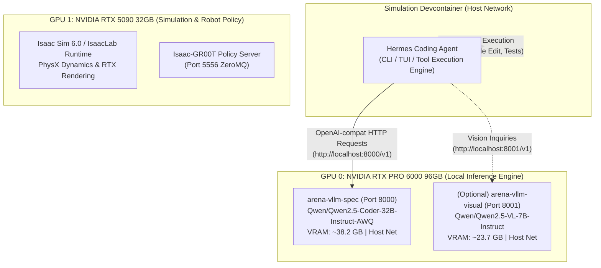

# Running Hermes Coding Agent with Local vLLM

**Status:** Verified Operational Guide  
**Owner:** Isaac Lab-Arena Core Engineering & Agentic Infrastructure  
**Target Hardware:** Dual-Blackwell Workstation (NVIDIA RTX PRO 6000 96GB + RTX 5090 32GB)  
**Scope:** Running the autonomous [Hermes Agent](../../../../.agents/references/quick_notes/recommendation_hermes_development.md) coding assistant locally using self-hosted vLLM inference containers (`Qwen/Qwen2.5-Coder-32B-Instruct-AWQ` on Port 8000).

---

## 1. Quick Start (TL;DR for Researchers)

If you already have the `arena-vllm-spec` container running, follow these 3 steps to start coding with Hermes locally:

```bash
# Step 1: Confirm local vLLM is healthy
curl -s http://localhost:8000/v1/models | jq .data[0].id
# Expected output: "Qwen/Qwen2.5-Coder-32B-Instruct-AWQ"

# Step 2: Create and configure an isolated Hermes profile (leaves cloud profiles untouched)
hermes profile create local-vllm --clone
hermes -p local-vllm config set model.provider custom
hermes -p local-vllm config set model.base_url "http://localhost:8000/v1"
hermes -p local-vllm config set model.default "Qwen/Qwen2.5-Coder-32B-Instruct-AWQ"
hermes -p local-vllm config set model.context_length 65536

# Step 3: Launch Hermes Agent in interactive Terminal UI (TUI)
hermes -p local-vllm --tui
```

> [!TIP]
> Once created, you can also launch the agent via the direct wrapper shortcut:
> ```bash
> local-vllm --tui
> ```

---

## 2. System Architecture & Topology

To prevent GPU compute collisions with Isaac Sim and Isaac-GR00T, local inference runs strictly on **GPU 0**, leaving **GPU 1** entirely free for PhysX simulation, Vulkan rendering, and policy execution:



---

## 3. Key Operational Requirements

Hermes is an **autonomous coding agent**: unlike standard chatbots, it actively reads code, applies git diffs, executes tests, and iterates on errors. This introduces two critical configuration requirements:

### 3.1 Hermes Context Window Override (`model.context_length: 65536`)

* **Why it is needed:** Hermes Agent requires a minimum working memory of $\ge 64,000$ tokens to accommodate system prompts, tool schemas, and multi-turn execution history.
* **The Situation:** To maximize concurrent VRAM headroom on GPU 0, `arena-vllm-spec` serves a 16k KV-cache window (`--max-model-len 16384`).
* **The Fix:** Setting `model.context_length: 65536` in the Hermes profile instructs Hermes to allow local execution while managing context compression smoothly:
  ```bash
  hermes -p local-vllm config set model.context_length 65536
  ```

### 3.2 vLLM Tool-Calling Flags (`--enable-auto-tool-choice` & `--tool-call-parser`)

* **Why it is needed:** When Hermes issues code editing or terminal tool commands, it includes `tool_choice="auto"`. Without tool parsing enabled, vLLM will return:
  ```text
  HTTP 400: "auto" tool choice requires --enable-auto-tool-choice and --tool-call-parser to be set
  ```
* **The Parser:** Both `Qwen2.5-Coder` and `Hermes-3` use the `<tool_call>` XML format. In vLLM, this is handled by `--tool-call-parser hermes`.

---

## 4. Container Management: Launching vLLM for Agentic Coding

### 4.1 Check the Current vLLM Container

Inspect the running spec container:
```bash
docker ps --filter "name=arena-vllm-spec"
```

### 4.2 Start or Restart vLLM with Tool-Calling Support

If you need full autonomous tool execution (file editing, terminal commands, running pytest), launch or update the container with `--enable-auto-tool-choice` and `--tool-call-parser hermes`:

```bash
docker run -d --name arena-vllm-coder \
  --gpus '"device=0"' \
  --network host \
  --ipc host \
  -v ~/.cache/huggingface:/root/.cache/huggingface \
  vllm/vllm-openai:latest \
  serve Qwen/Qwen2.5-Coder-32B-Instruct-AWQ \
  --port 8000 \
  --max-model-len 32768 \
  --enable-auto-tool-choice \
  --tool-call-parser hermes \
  --gpu-memory-utilization 0.45 \
  --enable-request-id-headers
```

> [!NOTE]
> If `arena-vllm-spec` is already running on port 8000, you can either stop it (`docker stop arena-vllm-spec`) before starting `arena-vllm-coder`, or expose the coder container on an alternative port (e.g., `--port 8002`) and set `model.base_url: "http://localhost:8002/v1"`.

---

## 5. Hermes Agent Setup Options

You have three ways to configure Hermes to talk to the local vLLM:

### Method A: Isolated Profile (Recommended)
Preserves your existing cloud API keys and defaults intact.

```bash
# 1. Clone active configuration into a new profile
hermes profile create local-vllm --clone

# 2. Bind to local vLLM
hermes -p local-vllm config set model.provider custom
hermes -p local-vllm config set model.base_url "http://localhost:8000/v1"
hermes -p local-vllm config set model.default "Qwen/Qwen2.5-Coder-32B-Instruct-AWQ"
hermes -p local-vllm config set model.context_length 65536

# 3. Launch
hermes -p local-vllm --tui
```

### Method B: Configure Active Default Profile
If you want local vLLM to be your primary daily driver across all terminal sessions:

```bash
hermes config set model.provider custom
hermes config set model.base_url "http://localhost:8000/v1"
hermes config set model.default "Qwen/Qwen2.5-Coder-32B-Instruct-AWQ"
hermes config set model.context_length 65536

# Launch directly
hermes --tui
```

### Method C: One-Shot / Ad-Hoc Invocation
Run an individual task without changing saved configuration:

```bash
hermes --provider custom \
  --model "Qwen/Qwen2.5-Coder-32B-Instruct-AWQ" \
  -z "Summarize the status of tests in isaaclab_arena/tests/"
```

---

## 6. Verification & Telemetry Validation

### 6.1 Smoke Test Endpoint Connectivity

Test direct inference from the devcontainer shell:

```bash
curl -s http://localhost:8000/v1/chat/completions \
  -H "Content-Type: application/json" \
  -d '{
    "model": "Qwen/Qwen2.5-Coder-32B-Instruct-AWQ",
    "messages": [{"role": "user", "content": "Respond with: LOCAL_VLLM_ONLINE"}]
  }' | jq -r '.choices[0].message.content'
```
* **Expected Output:** `LOCAL_VLLM_ONLINE`

### 6.2 Smoke Test Agentic Execution

Run a one-shot query testing tool access:

```bash
hermes -p local-vllm -z "List the top 3 files in .agents/references/plans/local-inference/ and explain their purpose."
```

### 6.3 Monitor vLLM Memory & KV Cache

Check vLLM live telemetry while Hermes is running:

```bash
curl -s http://127.0.0.1:8000/metrics | grep -E "vllm:(kv_cache_usage_perc|num_requests_running)"
```

---

## 7. Alternative: Serving a Native Hermes 3 Model in vLLM

If you prefer to serve Nous Research's native **Hermes 3** model instead of Qwen:

```bash
docker run -d --name arena-vllm-hermes3 \
  --gpus '"device=0"' \
  --network host \
  --ipc host \
  -v ~/.cache/huggingface:/root/.cache/huggingface \
  vllm/vllm-openai:latest \
  serve NousResearch/Hermes-3-Llama-3.1-8B \
  --port 8000 \
  --max-model-len 65536 \
  --enable-auto-tool-choice \
  --tool-call-parser hermes \
  --gpu-memory-utilization 0.35 \
  --enable-request-id-headers
```

Then point Hermes Agent to it:
```bash
hermes -p local-vllm config set model.default "NousResearch/Hermes-3-Llama-3.1-8B"
```

---

## 8. Troubleshooting & FAQ

| Symptom / Error | Root Cause | Resolution |
| :--- | :--- | :--- |
| `HTTP 400: "auto" tool choice requires --enable-auto-tool-choice and --tool-call-parser to be set` | The vLLM container was launched without tool parser arguments. | Start or restart vLLM including `--enable-auto-tool-choice --tool-call-parser hermes`. |
| `Model ... has a context window of ... below the minimum 64,000 required` | Hermes Agent detected `< 64,000` tokens reported by `/v1/models`. | Run `hermes -p local-vllm config set model.context_length 65536`. |
| `provider 'vllm' has no endpoint configured` | Provider is set to `vllm` but `model.base_url` is missing or unset. | Run `hermes -p local-vllm config set model.base_url "http://localhost:8000/v1"` (or use `custom` as the provider name). |
| Streaming responses leak raw XML tags like `<tool_call>` into chat | Known streaming tool-parser interaction in some vLLM builds. | Disable streaming in Hermes: `hermes -p local-vllm config set model.streaming false`. |
| `Connection refused on localhost:8000` | vLLM container is stopped or using a bridge network instead of host network. | Ensure the container is started with `--network host` and verify with `docker ps`. |

---

## 9. Related Plans & Artifacts

- [Local Inference Plans Index](README.md)
- [Local LLM & VLM Execution Plan](local_llm_vlm_agentic_env_gen_plan.md)
- [Dual-GPU Experiments Ledger](experiments.md)
- [Experiment 01 Baseline Tracking](experiment_01.md)
- [Hermes Development Recommendations](../../../../.agents/references/quick_notes/recommendation_hermes_development.md)
