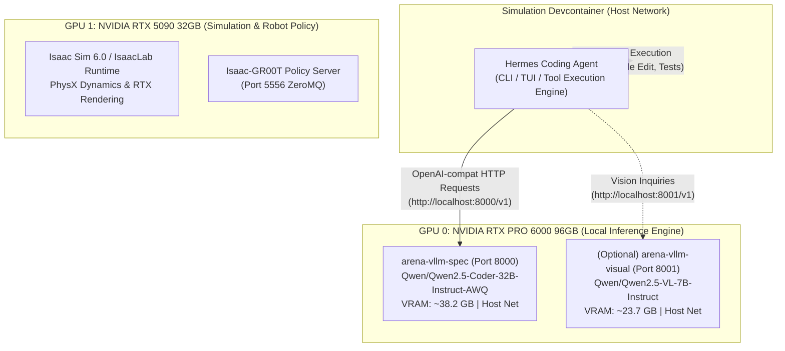
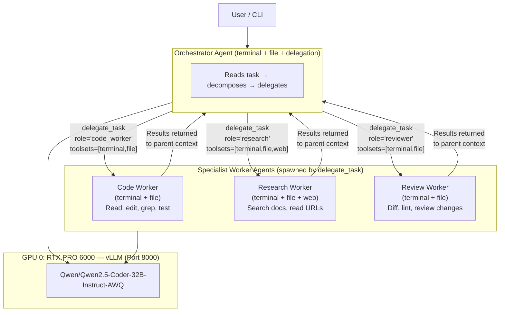

# Running Hermes Coding Agent with Local vLLM

**Status:** Verified Operational Guide  
**Owner:** Isaac Lab-Arena Core Engineering & Agentic Infrastructure  
**Target Hardware:** Dual-Blackwell Workstation (NVIDIA RTX PRO 6000 96GB + RTX 5090 32GB)  
**Scope:** Running the autonomous [Hermes Agent](../../../../.agents/references/quick_notes/recommendation_hermes_development.md) coding assistant locally using self-hosted vLLM inference containers (`Qwen/Qwen2.5-Coder-32B-Instruct-AWQ` on Port 8000).

---

## 1. Quick Start (TL;DR for Researchers)

If you already have the `arena-vllm-spec` container running, follow these 3 steps to start coding with Hermes locally:

```bash
# Step 1: Confirm local vLLM is healthy
curl -s http://localhost:8000/v1/models | jq .data[0].id
# Expected output: "Qwen/Qwen2.5-Coder-32B-Instruct-AWQ"

# Step 2: Create and configure an isolated Hermes profile (leaves cloud profiles untouched)
hermes profile create local-vllm --clone
hermes -p local-vllm config set model.provider custom
hermes -p local-vllm config set model.base_url "http://localhost:8000/v1"
hermes -p local-vllm config set model.default "Qwen/Qwen2.5-Coder-32B-Instruct-AWQ"
hermes -p local-vllm config set model.context_length 65536
hermes -p local-vllm config set model.streaming false
hermes -p local-vllm config set tools.tool_search.enabled false
hermes -p local-vllm config set terminal.cwd "/workspaces/IsaacLab-Arena"

# Step 3: Launch Hermes Agent in interactive Terminal UI (TUI)
hermes -p local-vllm --tui
```

> [!TIP]
> Once created, you can also launch the agent via the direct wrapper shortcut:
> ```bash
> local-vllm --tui
> ```

---

## 2. System Architecture & Topology

To prevent GPU compute collisions with Isaac Sim and Isaac-GR00T, local inference runs strictly on **GPU 0**, leaving **GPU 1** entirely free for PhysX simulation, Vulkan rendering, and policy execution:



---

## 3. Key Operational Requirements

Hermes is an **autonomous coding agent**: unlike standard chatbots, it actively reads code, applies git diffs, executes tests, and iterates on errors. This introduces two critical configuration requirements:

### 3.1 Context Window Sizing: Why `--max-model-len 65536` is the Operational Standard

* **The Problem:** Hermes Agent loads system prompts, repository rules (`AGENTS.md`), personas (`SOUL.md`), long-term memories, and full schemas for 22+ active tools. On turn 1, this baseline prompt alone consumes **~17,412 tokens**!
* **The 32k Failure Mode:** If `arena-vllm-spec` is started with only `--max-model-len 32768`, the usable working memory is only ~15,356 tokens (over 53% of the window is consumed by fixed overhead). When an agent inspects large directories (e.g. `ls -l .agents/skills/` with 352 items) or reads several files across multiple turns, prompt size exceeds 32,768 tokens, triggering `HTTP 400: prompt contains at least 32769 tokens` and halting the conversation.
* **The Solution:** Run `arena-vllm-spec` with `-e VLLM_ALLOW_LONG_MAX_MODEL_LEN=1`, `--max-model-len 65536`, and `--gpu-memory-utilization 0.45`. On the RTX PRO 6000 96GB, vLLM allocates 87,440 tokens of KV-cache memory (~21.3 GiB). This provides **over 55,000 tokens of clean working workspace**, giving nearly 4x more headroom for multi-turn agentic coding without GPU contention.
* **Tool Schema Pruning (Reclaiming ~7,000 Tokens):** By disabling unused non-coding tools (browser, delegation, tts, image_gen, computer_use), baseline tool schema size is cut by 34%:
  ```bash
  local-vllm tools disable browser delegation tts image_gen computer_use
  ```
* **Hermes Profile Pin:** Keep `model.context_length: 65536` pinned in Hermes:
  ```bash
  hermes -p local-vllm config set model.context_length 65536
  ```

### 3.2 vLLM Tool-Calling Flags (`--enable-auto-tool-choice` & `--tool-call-parser`)

* **Why it is needed:** When Hermes issues code editing or terminal tool commands, it includes `tool_choice="auto"`. Without tool parsing enabled, vLLM will return:
  ```text
  HTTP 400: "auto" tool choice requires --enable-auto-tool-choice and --tool-call-parser to be set
  ```
* **The Parser:** Both `Qwen2.5-Coder` and `Hermes-3` use the `<tool_call>` XML format. In vLLM, this is handled by `--tool-call-parser hermes`.

---

## 4. Container Management: Launching vLLM for Agentic Coding

### 4.1 Check the Current vLLM Container

Inspect the running spec container:
```bash
docker ps --filter "name=arena-vllm-spec"
```

### 4.2 Start or Restart vLLM with Tool-Calling Support

With the visual model (`arena-vllm-visual`) moved to **GPU 1 (RTX 5090)**, GPU 0 (RTX PRO 6000, 96 GB) is now fully dedicated to the coding model. This enables the maximum **128k context window** with YaRN RoPE factor 4.0:

```bash
# Step 1: Stop and remove the old container instance to prevent name conflicts
docker stop arena-vllm-spec && docker rm arena-vllm-spec

# Step 2: Launch the spec container with 128k context on GPU 0
docker run -d --name arena-vllm-spec \
  --restart unless-stopped \
  --gpus '"device=0"' \
  --network host \
  --ipc host \
  -v ~/.cache/huggingface:/root/.cache/huggingface \
  -v "$(pwd)/.agents/references/plans/local-inference/vllm_patches/hermes_tool_parser.py:/usr/local/lib/python3.12/dist-packages/vllm/tool_parsers/hermes_tool_parser.py" \
  vllm/vllm-openai:latest \
  --model Qwen/Qwen2.5-Coder-32B-Instruct-AWQ \
  --port 8000 \
  --hf-overrides '{"max_position_embeddings": 131072, "rope_scaling": {"rope_type": "yarn", "factor": 4.0, "original_max_position_embeddings": 32768}}' \
  --max-model-len 131072 \
  --enable-auto-tool-choice \
  --tool-call-parser hermes \
  --gpu-memory-utilization 0.65 \
  --enable-request-id-headers
```

#### 4.2.1 Remove the vLLM spec if we have issues

We might face some issues

```bash
docker rm -f arena-vllm-spec 2>/dev/null || true

docker run -d --name arena-vllm-spec \
  --restart unless-stopped \
  --gpus '"device=0"' \
  --network host \
  --ipc host \
  -e VLLM_ALLOW_LONG_MAX_MODEL_LEN=1 \
  -v ~/.cache/huggingface:/root/.cache/huggingface \
  -v "$(pwd)/.agents/references/plans/local-inference/vllm_patches/hermes_tool_parser.py:/usr/local/lib/python3.12/dist-packages/vllm/tool_parsers/hermes_tool_parser.py" \
  vllm/vllm-openai:latest \
  --model Qwen/Qwen2.5-Coder-32B-Instruct-AWQ \
  --port 8000 \
  --hf-overrides '{"max_position_embeddings": 131072, "rope_scaling": {"rope_type": "yarn", "factor": 4.0, "original_max_position_embeddings": 32768}}' \
  --max-model-len 131072 \
  --enable-auto-tool-choice \
  --tool-call-parser hermes \
  --gpu-memory-utilization 0.85 \
  --enable-request-id-headers
```

#### 4.2.2 Launch the Visual Model on GPU 1

The visual perception VLM shares GPU 1 with `gr00t-server`. Use `--gpu-memory-utilization 0.68` to leave headroom for the GR00T policy model (~7.4 GiB):

```bash
docker stop arena-vllm-visual && docker rm arena-vllm-visual

docker run -d --name arena-vllm-visual \
  --restart unless-stopped \
  --gpus '"device=1"' \
  --network host \
  --ipc host \
  -v ~/.cache/huggingface:/root/.cache/huggingface \
  vllm/vllm-openai:latest \
  --model Qwen/Qwen2.5-VL-7B-Instruct \
  --port 8001 \
  --max-model-len 8192 \
  --gpu-memory-utilization 0.68 \
  --enable-request-id-headers
```

> [!IMPORTANT]
> **Why `--hf-overrides` is mandatory for context > 32k:**  
> Qwen 2.5 Coder's default `max_position_embeddings` is 32,768. If you extend `--max-model-len` beyond that without injecting `rope_scaling` via `--hf-overrides`, the underlying CUDA attention kernels do not scale their rotary embedding tables. When a prompt's position IDs exceed 32,768, the kernel hits an out-of-bounds index and crashes vLLM with `CUDA error: device-side assert triggered` (Exit 139 / Segfault). Passing `--hf-overrides` with YaRN factor 4.0 properly initializes RoPE scaling to 131,072 positions.

> [!NOTE]
> **GPU architecture (current operational state):**  
> - **GPU 0 (RTX PRO 6000, 96 GB):** `arena-vllm-spec` only — 128k context, ~65 GiB used, ~33 GiB free headroom.  
> - **GPU 1 (RTX 5090, 32 GB):** `arena-vllm-visual` (~20 GiB) + `gr00t-server` (~7.4 GiB) — ~28 GiB used, ~5 GiB free.  
> Previously both models shared GPU 0, limiting context to 64k. Moving the visual model to GPU 1 doubled the available context window.

> [!IMPORTANT]
> If you omit `docker stop` and `docker rm`, Docker will reject the command with:  
> `docker: Error response from daemon: Conflict. The container name "/arena-vllm-spec" is already in use by container "...".`  
> You must remove or rename the existing container first.

---

## 5. Hermes Profile Anatomy & Configuration

Hermes isolates each runtime configuration into a **named profile**. This guarantees that local experiments never pollute your default profile, cloud API keys, or conversation histories.

### 5.1 What is Saved Inside a Profile?

Every profile lives in its own dedicated directory under `~/.hermes/profiles/<profile-name>/`:

```text
~/.hermes/profiles/local-vllm/
├── config.yaml          # Model & operational configuration (base_url, context_length)
├── .env                 # Profile-specific credentials & private API keys
├── SOUL.md              # Agent persona, coding tone & system prompt
├── state.db             # Isolated SQLite database (messages, turns, FTS search)
├── sessions/            # Transcripts of past interactive & one-shot runs
├── memories/            # Long-term agent memory
│   ├── MEMORY.md        # Technical facts & codebase architecture learned over time
│   └── USER.md          # Personal user preferences & workflow instructions
├── skills/              # Installed & agent-generated workflow skills
├── logs/                # agent.log, errors.log, and execution telemetry
├── cron/                # Scheduled background tasks for this profile
├── hooks/               # Pre/post command execution security hooks
└── cache/               # Tool-call spillover payloads & scratch directory
```

#### Key Components:
1. **`config.yaml`**: Configures the local model mapping (`provider: custom`, `base_url: http://localhost:8000/v1`, `context_length: 65536`).
2. **`SOUL.md`**: Persists the agent's core behavioral instructions. Hermes is instructed to be direct, concise, and focused on tangible verification over fluff.
3. **`state.db`**: Stores all turns, token counts, and full-text search indexes without colliding with other parallel agents.
4. **`memories/`**: Stores lessons the agent learns while working on your codebase across sessions.
5. **`skills/`**: Houses procedural routines (e.g. running pytest suites, checking PhysX settling) that the agent can invoke and refine.

---

### 5.2 Creating the Isolated Profile

To create `local-vllm`:

```bash
# 1. Clone settings from your active environment
hermes profile create local-vllm --clone

# 2. Point to local vLLM
hermes -p local-vllm config set model.provider custom
hermes -p local-vllm config set model.base_url "http://localhost:8000/v1"
hermes -p local-vllm config set model.default "Qwen/Qwen2.5-Coder-32B-Instruct-AWQ"
hermes -p local-vllm config set model.context_length 65536
hermes -p local-vllm config set model.streaming false
hermes -p local-vllm config set tools.tool_search.enabled false
hermes -p local-vllm config set terminal.cwd "/workspaces/IsaacLab-Arena"
```

---

### 5.3 How to Verify the Profile is Configured Correctly

Researchers can run four quick checks to verify that the profile is correctly wired to the local vLLM:

#### Check 1: 1-Line Model Settings Query
```bash
local-vllm config get model
```
*Expected Output:*
```yaml
base_url: http://localhost:8000/v1
context_length: 65536
default: Qwen/Qwen2.5-Coder-32B-Instruct-AWQ
provider: custom
streaming: false
```

#### Check 2: Confirm Context Length & Working Directory Overrides
```bash
local-vllm config get model.context_length
# Output: 65536

local-vllm config get terminal.cwd
# Output: /workspaces/IsaacLab-Arena
```

#### Check 3: High-Level Profile Summary
```bash
hermes profile show local-vllm
```
*Expected Output:*
```text
Profile: local-vllm
Path:    /root/.hermes/profiles/local-vllm
Model:   Qwen/Qwen2.5-Coder-32B-Instruct-AWQ (custom)
Alias:   local-vllm → hermes -p local-vllm  (/root/.local/bin/local-vllm)
```

#### Check 4: Built-in Doctor Diagnostics
```bash
local-vllm doctor
```
Verifies SQLite integrity, config versioning, environment variables, and tool availability.

---

### 5.4 Global `~/.hermes/config.yaml` and Two-Level Config Resolution

Hermes uses a **two-level configuration cascade** that the profile-based commands above don't fully surface:

1. **Global config** — `~/.hermes/config.yaml` — sets defaults for *every* profile.
2. **Profile config** — `~/.hermes/profiles/<name>/config.yaml` — overrides specific keys per profile.

When Hermes loads configuration for a profile, it reads the global config first, then merges the profile-level config on top. Keys present in the profile win; **keys absent from the profile silently inherit from the global file**.

> [!IMPORTANT]
> The `hermes -p local-vllm config set ...` commands shown in this guide **only write to the profile-level config**. If the global `~/.hermes/config.yaml` has conflicting or stale settings for keys the profile doesn't override, those global values will silently take effect and can cause confusing failures.

#### Critical global settings that affect local vLLM operation

The global `~/.hermes/config.yaml` controls several settings that directly impact whether Hermes works correctly with local vLLM:

| Global Key | Why It Matters for Local vLLM | Recommended Value |
| :--- | :--- | :--- |
| `model.provider` | If set to a cloud provider globally, and the profile doesn't override it, requests go to the cloud instead of local vLLM. | `custom` |
| `model.base_url` | Must point to `http://127.0.0.1:8000/v1` for local inference. | `http://127.0.0.1:8000/v1` |
| `model.streaming` | Streaming can cause XML tool-call leakage with vLLM (see Case 6). | `false` |
| `tools.tool_search.enabled` | **Critical.** Defaults to `auto`, which injects `<tool_search>` XML instructions into the system prompt. Local models (Qwen 2.5 Coder) emit these tags as plain text instead of using actual tools — completely breaking agentic operation. The legacy flat key `tools.tool_search: false` does **not** control this; you must use the nested path. | `false` |
| `terminal.cwd` | If set to `"."` globally (the default), Hermes resolves to its sandbox home — not the repo root (see Case 9). | `/workspaces/IsaacLab-Arena` |
| `compression.threshold_tokens` | Must be within the vLLM-served context window. | ≤ `model.context_length` |
| `agent.reasoning_effort` | Local models like Qwen 2.5 Coder don't support reasoning tokens. | `"none"` |

#### Inspecting and editing the global config

```bash
# View the full global config
cat ~/.hermes/config.yaml

# Or query a specific key
hermes config get model           # reads from the ACTIVE profile (merged view)
hermes config get --global model  # reads from the global layer only

# Set a global default (affects all profiles that don't override it)
hermes config set --global tools.tool_search.enabled false
hermes config set --global terminal.cwd "/workspaces/IsaacLab-Arena"
```

#### Verifying which layer a setting comes from

When debugging, compare global vs. profile to see what's actually in effect:

```bash
# Profile-level overrides only
cat ~/.hermes/profiles/local-vllm/config.yaml | grep -A2 "model:"

# Global defaults
cat ~/.hermes/config.yaml | grep -A5 "model:"

# Merged effective config (what Hermes actually uses)
hermes -p local-vllm config get model
```

> [!TIP]
> After making changes to `~/.hermes/config.yaml`, restart any running Hermes session (`/exit` then relaunch) — global config is read at process startup, not hot-reloaded.

---

## 6. Devcontainer Lifecycle: Reusing & Persisting Profiles

Because devcontainers manage their own container filesystem, `/root/.hermes/` is **container-local** by default. When you spin up a brand-new container or rebuild from scratch, only the `default` profile exists initially.

Here are the supported strategies to persist and reuse your profile across devcontainers:

### Strategy A: Hermes Native Export & Import (Simplest Portability)

Hermes includes native archive management for sharing profiles between developers or containers:

```bash
# In the existing container: Export profile to an archive
hermes profile export local-vllm -o ./local-vllm-profile.tar.gz

# In any new devcontainer: Import the archive
hermes profile import ./local-vllm-profile.tar.gz
```
*All settings, memories, skills, and configuration are restored in a single command.*

### Strategy B: 10-Second Command (Zero Setup Prerequisite)

Run this chained command in any newly initialized devcontainer:
```bash
hermes profile create local-vllm --clone && \
local-vllm config set model.provider custom && \
local-vllm config set model.base_url "http://localhost:8000/v1" && \
local-vllm config set model.default "Qwen/Qwen2.5-Coder-32B-Instruct-AWQ" && \
local-vllm config set model.context_length 65536 && \
local-vllm config set model.streaming false && \
local-vllm config set tools.tool_search.enabled false && \
local-vllm config set terminal.cwd "/workspaces/IsaacLab-Arena"
```

### Strategy C: Automated Provisioning in `init_agent_workspace.sh`

To make every newly built devcontainer automatically have `local-vllm` pre-configured without typing any commands, add this snippet to [`.devcontainer/init_agent_workspace.sh`](../../../../.devcontainer/init_agent_workspace.sh):

```bash
# Auto-configure Hermes local-vllm profile if missing
if command -v hermes >/dev/null 2>&1 && [ ! -d "/root/.hermes/profiles/local-vllm" ]; then
  hermes profile create local-vllm --clone || true
  local-vllm config set model.provider custom
  local-vllm config set model.base_url "http://localhost:8000/v1"
  local-vllm config set model.default "Qwen/Qwen2.5-Coder-32B-Instruct-AWQ"
  local-vllm config set model.context_length 65536
  local-vllm config set model.streaming false
  local-vllm config set tools.tool_search.enabled false
  local-vllm config set terminal.cwd "/workspaces/IsaacLab-Arena"
  echo "  ✓ Pre-configured Hermes local-vllm profile"
fi
```

### Strategy D: Host Volume Mount in `devcontainer.json`

If you want all devcontainers on your physical workstation to share identical session history, profiles, and memories, mount `~/.hermes` in the `runArgs` array of [`.devcontainer/devcontainer.json`](../../../../.devcontainer/devcontainer.json):

```json
"-v", "${localEnv:HOME}/.hermes:/root/.hermes:rw"
```

---

## 7. Verification & Telemetry Validation

### 7.1 Smoke Test Endpoint Connectivity

Test direct inference from the devcontainer shell:

```bash
curl -s http://localhost:8000/v1/chat/completions \
  -H "Content-Type: application/json" \
  -d '{
    "model": "Qwen/Qwen2.5-Coder-32B-Instruct-AWQ",
    "messages": [{"role": "user", "content": "Respond with: LOCAL_VLLM_ONLINE"}]
  }' | jq -r '.choices[0].message.content'
```
* **Expected Output:** `LOCAL_VLLM_ONLINE`

### 7.2 Smoke Test Agentic Execution

Run a one-shot query testing tool access:

```bash
hermes -p local-vllm -z "List the top 3 files in .agents/references/plans/local-inference/ and explain their purpose."
```

### 7.3 Monitor vLLM Memory & KV Cache

Check vLLM live telemetry while Hermes is running:

```bash
curl -s http://127.0.0.1:8000/metrics | grep -E "vllm:(kv_cache_usage_perc|num_requests_running)"
```

---

## 8. Alternative: Serving a Native Hermes 3 Model in vLLM

If you prefer to serve Nous Research's native **Hermes 3** model instead of Qwen:

```bash
docker run -d --name arena-vllm-hermes3 \
  --gpus '"device=0"' \
  --network host \
  --ipc host \
  -v ~/.cache/huggingface:/root/.cache/huggingface \
  vllm/vllm-openai:latest \
  --model NousResearch/Hermes-3-Llama-3.1-8B \
  --port 8000 \
  --max-model-len 65536 \
  --enable-auto-tool-choice \
  --tool-call-parser hermes \
  --gpu-memory-utilization 0.35 \
  --enable-request-id-headers
```

Then point Hermes Agent to it:
```bash
hermes -p local-vllm config set model.default "NousResearch/Hermes-3-Llama-3.1-8B"
```

---

## 9. Debugging & Diagnostic Runbook

When setting up or running Hermes Agent against local vLLM instances, issues typically fall into one of three layers: **Docker Container Execution**, **vLLM Inference Server**, or **Hermes Agent Wire Configuration**. Use the following structured runbook to triage and fix issues.

### 9.1 The 4-Step Diagnostic Triage

When something fails, execute these 4 commands in order:

```bash
# Step 1: Check container lifecycle status
docker ps -a --filter "name=arena-vllm"
# -> Look for "Up X minutes" vs "Exited (code)"

# Step 2: Tail container logs for errors or warmup progress
docker logs --tail 30 arena-vllm-spec
# -> Check if weights are loading, CUDA graphs are compiling, or an argument failed

# Step 3: Test endpoint reachability with verbose HTTP output
curl -v http://localhost:8000/v1/models
# -> Confirms HTTP 200 vs Connection Refused

# Step 4: Verify active Hermes profile settings
local-vllm config get model
# -> Checks base_url, provider, model name, and context length
```

---

### 9.2 Common Failure Modes & Root-Cause Analysis

#### Case 1: Docker Container Name Conflict
* **Error Message:**
  ```text
  docker: Error response from daemon: Conflict. The container name "/arena-vllm-spec" is already in use by container "38f67e8f91e6...". You have to remove (or rename) that container to be able to reuse that name.
  ```
* **Root Cause:** A container with the specified name is already registered (either running or stopped). Docker strictly enforces unique container names.
* **Resolution:** Stop and remove the old container before starting a new one:
  ```bash
  docker stop arena-vllm-spec && docker rm arena-vllm-spec
  ```

---

#### Case 2: Duplicate Entrypoint Argument (`vllm serve serve ...`)
* **Error Message:**
  The container exits immediately with `Exited (2)`. Checking `docker logs arena-vllm-spec` shows:
  ```text
  usage: vllm [-h] [-v] {chat,complete,serve,launch,bench,collect-env,run-batch} ...
  vllm: error: unrecognized arguments: Qwen/Qwen2.5-Coder-32B-Instruct-AWQ --guided-decoding-backend outlines
  ```
* **Root Cause:** The Docker image `vllm/vllm-openai:latest` has `ENTRYPOINT ["vllm", "serve"]` baked into its image metadata. Passing `serve <model>` in your `docker run` command results in Docker executing:
  ```bash
  vllm serve serve Qwen/Qwen2.5-Coder-32B-Instruct-AWQ ...
  ```
  vLLM treats the first `serve` as the sub-command, and the second `serve` as the model name. All subsequent flags are then rejected as unrecognized positional arguments.
* **Resolution:** Pass the model using `--model <model-id>` or directly as `<model-id>` **without** the leading `serve`:
  ```bash
  # CORRECT:
  docker run -d --name arena-vllm-spec ... vllm/vllm-openai:latest --model Qwen/Qwen2.5-Coder-32B-Instruct-AWQ ...

  # INCORRECT (Do NOT include 'serve'):
  docker run -d --name arena-vllm-spec ... vllm/vllm-openai:latest serve Qwen/Qwen2.5-Coder-32B-Instruct-AWQ ...
  ```

---

#### Case 3: Empty `curl` Output / Connection Refused
* **Symptom:**
  Running `curl -s http://localhost:8000/v1/models | jq .data[0].id` returns nothing (silent empty line).
* **Root Cause:** There are two distinct possibilities:
  1. **Container has crashed / exited:** Check `docker ps -a`. If status is `Exited`, inspect logs with `docker logs arena-vllm-spec`.
  2. **Container is still warming up:** vLLM has a 30–45 second cold-start sequence during which it loads weights into VRAM, runs FlashInfer JIT autotuning, and compiles 51 CUDA graphs. Port 8000 is not opened until `Application startup complete` is logged.
* **Resolution:** Run a non-silent curl to see the raw network status:
  ```bash
  curl -v http://localhost:8000/v1/models
  ```
  And follow the startup logs until Uvicorn begins serving:
  ```bash
  docker logs -f arena-vllm-spec
  ```

---

#### Case 4: Tool-Calling Rejection (`HTTP 400`)
* **Error Message:**
  ```text
  Custom endpoint rejected this request as malformed.
  Provider said: HTTP 400: "auto" tool choice requires --enable-auto-tool-choice and --tool-call-parser to be set
  ```
* **Root Cause:** Hermes Agent is an autonomous coding agent; it sends `tool_choice="auto"` so the model can invoke filesystem and bash tools. Without these flags, vLLM rejects any request containing tools.
* **Resolution:** Restart vLLM with tool calling enabled:
  ```bash
  --enable-auto-tool-choice --tool-call-parser hermes
  ```

---

#### Case 5: Minimum Context Length Error (`64,000` Tokens)
* **Error Message:**
  ```text
  hermes -z: agent failed: Model Qwen/Qwen2.5-Coder-32B-Instruct-AWQ has a context window of 16,384 tokens, which is below the minimum 64,000 required by Hermes Agent.
  ```
* **Root Cause:** Hermes Agent requires $\ge 64,000$ tokens of working memory to accommodate system prompts, tool schemas, and conversation histories. When vLLM serves a smaller KV-cache (e.g. 16k to conserve VRAM for Isaac Sim & GR00T), Hermes aborts at startup by default.
* **Resolution:** Apply the context length override to the Hermes profile:
  ```bash
  local-vllm config set model.context_length 65536
  ```

---

#### Case 6: Streaming Tool-Call XML Leakage
* **Symptom:**
  Instead of executing a tool, Hermes outputs raw `<tool_call>` XML or JSON text directly to the console.
* **Root Cause:** In certain vLLM versions, streaming token generation with XML-based tool parsers can stream the tool tag tokens into the content buffer before the parser catches them.
* **Resolution:** Disable streaming in your Hermes profile to force clean, complete message parsing:
  ```bash
  local-vllm config set model.streaming false
  ```

---

#### Case 7: Context Compression Paused / Turn-1 Prompt Exceeds Context Length
* **Error Message in Hermes CLI / TUI:**
  ```text
  🗜️ Compacting context — summarizing earlier conversation so I can continue...

  The model provider returned an error (custom). Your message was not answered.
  Details: Context compression is temporarily paused after a recent failed attempt. Please retry in a moment — compression will resume automatically (or run /compress to force a retry now).
  ```
* **Log Signature (`~/.hermes/profiles/local-vllm/logs/errors.log`):**
  ```text
  openai.BadRequestError: Error code: 400 - {'error': {'message': "This model's maximum context length is 16384 tokens. However, you requested 0 output tokens and your prompt contains at least 16385 input tokens... (parameter=input_tokens, value=17412)"}}
  ...
  agent.conversation_compression: Compression made no progress — skipping boundary rewrite.
  agent.conversation_compression: Skipping automatic compression re-entry: transient guard active (structural_backoff:300)
  ```
* **Root Cause:**
  1. Hermes Agent's initial prompt (system prompt + 22 tool schemas + workspace context) is **~17,412 tokens**.
  2. If vLLM was launched with `--max-model-len 16384`, the very first turn exceeds the server's context ceiling (`17,412 > 16,384`), triggering `HTTP 400`.
  3. Hermes catches the 400 error and attempts automatic context compression (`🗜️ Compacting context...`).
  4. But because this is turn 1, there is zero historical conversation to compress (`messages=1`). Compression makes zero progress.
  5. Hermes activates its transient circuit breaker (`structural_backoff: 300`), pausing further compression attempts for 5 minutes.
* **Resolution:**
  1. **Enlarge vLLM context to 32k:** Restart `arena-vllm-spec` with `--max-model-len 32768` (see [Section 4.2](#42-start-or-restart-vllm-with-tool-calling-support)).
  2. **Reset the Hermes session backoff:** In the active Hermes TUI or CLI, type `/new` to initiate a clean session unblocked by the 300-second compression backoff.

---

#### Case 8: Tool Calls Printed as Text / Multi-Line Raw JSON Leaked to Console
* **Symptom in Hermes TUI / CLI:**
  You ask the agent to inspect the repository, and instead of executing the tools, the agent prints its conversational preamble followed by raw JSON lines directly to the chat:
  ```text
  Certainly. Let's gather some context by reading key files and understanding the project structure.

  {"name": "read_file", "arguments": {"path": "README.md", "limit": 100}}
  {"name": "read_file", "arguments": {"path": "AGENTS.md", "limit": 100}}
  {"name": "read_file", "arguments": {"path": "pyproject.toml", "limit": 100}}
  {"name": "search_files", "arguments": {"pattern": ".", "target": "files", "path": ".", "file_glob": ".py", "limit": 5}}
  ```
* **Root Cause:**
  1. The model (Qwen 2.5 Coder) emitted multiple parallel tool calls formatted as consecutive JSON objects (JSON Lines / newline-delimited JSON), preceded by conversational reasoning text.
  2. Stock vLLM's tool parser only searches for `<tool_call> ... </tool_call>` XML tags. Even when direct JSON parsing is attempted, naive `json.loads(text[first_brace:last_brace])` crashes with `JSONDecodeError: Extra data` when multiple JSON objects appear consecutively.
  3. When JSON parsing fails, vLLM falls back to treating the entire response as plain assistant conversation text, dumping the raw tool calls into the message `content`.
  4. Hermes displays the message as chat text rather than dispatching the tools to the filesystem/terminal.
* **Resolution:**
  Mount the Isaac Lab-Arena enhanced multi-format tool parser (`vllm_patches/hermes_tool_parser.py`) into the vLLM container:
  ```bash
  -v "$(pwd)/.agents/references/plans/local-inference/vllm_patches/hermes_tool_parser.py:/usr/local/lib/python3.12/dist-packages/vllm/tool_parsers/hermes_tool_parser.py"
  ```
  This patch uses streaming JSON decoding (`json.JSONDecoder().raw_decode()`) to sequentially extract all parallel tool calls from the output, separates the conversational prefix into message `content`, and routes the tool invocations into the structured `tool_calls` array.

---

#### Case 9: Path Not Found / Tool Commands Running in Hermes Home Sandbox
* **Symptom in Hermes TUI / CLI:**
  A tool call is successfully recognized and executed by Hermes, but reports that repository paths do not exist:
  ```text
  List files in .agents/references/plans/local-inference/

  ▾ Tool calls (1)
  ● Terminal("ls -la .agents/references/plans/local-inference/") (0.1s)

  The directory .agents/references/plans/local-inference/ does not exist. Please verify the path or create the directory if necessary.
  ```
* **Root Cause:**
  1. In `config.yaml`, `terminal.cwd` defaults to `"."`.
  2. When Hermes initializes a session inside a container with `terminal.home_mode: auto`, it resolves the `"."` placeholder to the profile's isolated sandbox home directory (`/root/.hermes/profiles/<profile-name>/home`).
  3. Consequently, relative paths intended for the workspace (such as `.agents/...` or `isaaclab_arena/...`) execute inside the empty sandbox home instead of the repository root (`/workspaces/IsaacLab-Arena`).
  4. Furthermore, interactive TUI sessions lock their `cwd` into the profile's SQLite session database (`state.db`) upon session creation.
* **Resolution:**
  1. Configure the persistent working directory for the profile:
     ```bash
     hermes -p local-vllm config set terminal.cwd "/workspaces/IsaacLab-Arena"
     ```
  2. Refresh the active TUI session: In your interactive TUI, type `/new` to spawn a fresh session that adopts the newly configured repository root directory (or exit with `/exit` and relaunch with `hermes -p local-vllm --tui`).

---

#### Case 10: vLLM Crash / Connection Error: CUDA Device-Side Assert Triggered
* **Symptom in Hermes TUI / CLI:**
  You execute a command and Hermes reports:
  ```text
  Custom endpoint didn't respond in time on any of 3 attempts — it looks temporarily unavailable.
  Provider said: Connection error.
  ```
  Checking `docker ps -a` shows `arena-vllm-spec` has `Exited (139)` (Segfault). Checking `docker logs arena-vllm-spec` shows:
  ```text
  torch.AcceleratorError: CUDA error: device-side assert triggered
  Fatal Python error: ... Segfault encountered
  ```
* **Root Cause:**
  1. `arena-vllm-spec` was configured with an extended context window (`--max-model-len 65536` or `131072`) without properly scaling the rotary position embedding tables via `--hf-overrides`.
  2. Because Qwen 2.5 Coder's base `max_position_embeddings` is 32,768, when a prompt's position IDs or token count exceed 32,768, the underlying CUDA kernel performs an out-of-bounds array access against the unscaled RoPE table.
  3. This triggers a hardware-level `cudaErrorAssert`, causing PyTorch to abort and terminating the vLLM container process.
* **Resolution:**
  Launch vLLM with official YaRN RoPE scaling and position overrides:
  ```bash
  --hf-overrides '{"max_position_embeddings": 65536, "rope_scaling": {"rope_type": "yarn", "factor": 2.0, "original_max_position_embeddings": 32768}}' --max-model-len 65536
  ```

---

#### Case 11: `<tool_search>` XML Emitted as Plain Text (No Tools Executed)
* **Symptom in Hermes TUI / CLI:**
  You ask the agent to perform any task (read files, list directories, run commands), and instead of executing tools, it prints raw XML:
  ```text
  <tool_search>
  - queries: ["top 3 files in .agents/references/plans/local-inference/"]
  - limit: 3
  </tool_search>
  ```
* **Root Cause:**
  1. Hermes has a `tool_search` feature that dynamically defers low-priority tools to save token budget, injecting `<tool_search>` XML instructions into the system prompt.
  2. The `tools.tool_search.enabled` config key defaults to `auto`, which activates this feature when the model's context budget is tight relative to the number of tool schemas.
  3. Local models (Qwen 2.5 Coder) treat the `<tool_search>` instruction as their primary action and emit the XML tags as plain text instead of using the actual tools they already have.
  4. The legacy flat key `tools.tool_search: false` in `~/.hermes/config.yaml` does **not** control this behavior — it's superseded by the nested `tools.tool_search.enabled` key.
* **Diagnosis:** Check the agent log for the telltale activation message:
  ```bash
  grep "tool_search activated" ~/.hermes/profiles/local-vllm/logs/agent.log
  # If you see: "tool_search activated (tier 1): 13 core/visible tools kept, 4 deferred"
  # then tool_search is active and injecting XML into the system prompt.
  ```
* **Resolution:**
  ```bash
  hermes -p local-vllm config set tools.tool_search.enabled false
  ```
  Then restart the session (`/exit` and relaunch, or `/new` for a fresh turn).

---

### 9.3 Quick Diagnostic Summary Table

| Symptom / Error | Root Cause | Immediate Fix |
| :--- | :--- | :--- |
| `docker: Error ... Conflict ... already in use` | Old container with same name still exists. | `docker stop arena-vllm-spec && docker rm arena-vllm-spec` |
| `vllm: error: unrecognized arguments ...` (Exited 2) | Image entrypoint already has `serve`; passing `serve` duplicates it. | Remove `serve`; use `--model <model-id>`. |
| Empty `curl` / Connection Refused | Container either crashed or still compiling CUDA graphs (30–45s). | Check `docker ps -a` and follow `docker logs -f arena-vllm-spec`. |
| `HTTP 400: "auto" tool choice requires ...` | vLLM launched without tool-parser flags. | Add `--enable-auto-tool-choice --tool-call-parser hermes`. |
| `Model ... below minimum 64,000 required` | vLLM reports 16k context window to Hermes. | Run `local-vllm config set model.context_length 65536`. |
| `Context compression is temporarily paused ...` | vLLM `--max-model-len 16384` < ~17.4k baseline tool schemas. | Relaunch vLLM with `--max-model-len 65536` and enter `/new` in Hermes. |
| Tool call printed as text: `{"name": "terminal", ...}` | Qwen emitted raw JSON or `<tools>`; stock vLLM missed it. | Mount `vllm_patches/hermes_tool_parser.py` into container. |
| `The directory <path> does not exist` in Terminal tool | Hermes defaulted working directory to sandbox (`/root/.hermes/profiles/.../home`). | Run `local-vllm config set terminal.cwd "/workspaces/IsaacLab-Arena"` and type `/new` in TUI. |
| `Connection error` / vLLM Exited (139) Segfault | `CUDA error: device-side assert` caused by unscaled RoPE table (>32k). | Add `--hf-overrides` with `rope_scaling` (YaRN) and `max_position_embeddings`. |
| `provider 'vllm' has no endpoint configured` | `model.base_url` is unset or empty in profile. | Run `local-vllm config set model.base_url "http://localhost:8000/v1"`. |
| Streaming tool tags printed as text in chat | Streaming parser race in vLLM. | Run `local-vllm config set model.streaming false`. |
| `<tool_search>` XML printed instead of tool execution | `tools.tool_search.enabled` defaults to `auto`; local models emit the tags as text. | Run `local-vllm config set tools.tool_search.enabled false`. |
| Model answers file/code questions without calling any tool (silent hallucination) | Local models treat ambiguous requests as knowledge questions; SOUL.md lacks tool-forcing instruction. | Add "CRITICAL RULE — ALWAYS USE TOOLS" paragraph to SOUL.md (§10.2.1). |

---

## 10. Tool Schema Budget: Why Local Models Refuse to Call Tools

This section documents the single most impactful failure mode when running local models as agentic coding assistants. **If you skip everything else in this guide, read this.**

### 10.1 The Problem: Prompt Bloat Kills Tool-Calling Reliability

Frontier API models (GPT-4o, Claude 4, Gemini 2.5 Pro) can reliably select from 30+ tool schemas in a single prompt. Local models **cannot**. Even a strong 32B-parameter model like Qwen 2.5 Coder degrades rapidly as tool schema payload grows:

| Tool Schema Tokens | Tools Available | Observed Behavior |
| :--- | :--- | :--- |
| ~280 | 2 (`terminal`, `read_file`) | ✅ Model calls tools correctly on every turn |
| ~3,000 | 6 (core coding subset) | ✅ Reliable tool calling with occasional text fallback |
| ~8,000 | 13 (Hermes default tier-1) | ⚠️ Model sometimes emits text instead of calling tools |
| ~13,200 | 22+ (all Hermes toolsets) | ❌ Model almost never calls tools — generates text answers, guesses, or emits raw XML/JSON |

When 22 tool schemas consume ~13,200 of the ~17,400 baseline prompt tokens, the model's attention is overwhelmed by schema definitions. It "sees" the tools but doesn't reliably _use_ them — instead generating conversational text responses that hallucinate answers.

> [!CAUTION]
> **This failure is silent.** The model doesn't error — it confidently returns a text answer that _looks_ plausible but was never verified by executing any tool. You only notice when the answer is factually wrong (e.g., "No files were found" in a directory with 6 files).

### 10.2 The Fix: Strip to Essential Tools

For reliable agentic coding with local models, enable **only** the toolsets the agent actually needs:

```bash
# Nuclear option: disable everything, then enable only what's needed
hermes -p local-vllm tools disable web vision skills todo memory session_search connections cronjob code_execution
# Result: only terminal + file remain enabled
```

Verify the lean toolset:
```bash
hermes -p local-vllm tools list | grep "✓ enabled"
# Expected:
#   ✓ enabled  terminal  💻 Terminal & Processes
#   ✓ enabled  file      📁 File Operations
```

#### 10.2.1 Force Tool Usage via SOUL.md (Critical for Local Models)

Reducing tool schemas is necessary but **not sufficient**. Even with only `terminal` + `file`, local models will still hallucinate answers to questions like "list the files in X" instead of actually running `ls`. Frontier models infer that filesystem questions require tools; local 32B models need to be told explicitly.

Add this paragraph to `~/.hermes/profiles/local-vllm/SOUL.md`:

```text
CRITICAL RULE — ALWAYS USE TOOLS: You MUST use your tools (terminal, read_file, 
write_file, etc.) to answer ANY question about files, directories, code, or the 
repository. NEVER guess or answer from memory. If the user asks about files, run 
`ls`. If they ask about code, use `read_file`. If they ask to run something, use 
`terminal`. You have NO prior knowledge of the filesystem — your ONLY source of 
truth is tool output. When in doubt, use a tool.
```

Or apply it with a single command:

```bash
cat >> ~/.hermes/profiles/local-vllm/SOUL.md << 'EOF'

CRITICAL RULE — ALWAYS USE TOOLS: You MUST use your tools (terminal, read_file, write_file, etc.) to answer ANY question about files, directories, code, or the repository. NEVER guess or answer from memory. If the user asks about files, run `ls`. If they ask about code, use `read_file`. If they ask to run something, use `terminal`. You have NO prior knowledge of the filesystem — your ONLY source of truth is tool output. When in doubt, use a tool.
EOF
```

> [!CAUTION]
> **Without this instruction, the model will silently hallucinate.** It will confidently list files that don't exist, describe code it never read, and report results from commands it never ran. There is no error — the output _looks_ correct but is fabricated. This was verified empirically: the same query "List the top 3 files in X" returned fabricated filenames without the SOUL.md instruction, and correct real filenames with it.

> [!TIP]
> **The `terminal` + `file` combo is sufficient for 90% of coding tasks.** The `terminal` tool runs any shell command (including `grep`, `find`, `git`, `python`, `curl`), and the `file` tool reads, writes, searches, and edits files. You don't need a separate `web` tool when `terminal` can run `curl`.

### 10.3 Recommended Tool Profiles by Task

| Task | Toolsets to Enable | Estimated Schema Tokens |
| :--- | :--- | :--- |
| **Code reading & editing** | `terminal`, `file` | ~2,500 |
| **Code + web research** | `terminal`, `file`, `web` | ~3,800 |
| **Code + delegation** | `terminal`, `file`, `delegation` | ~3,500 |
| **Full orchestrator** | `terminal`, `file`, `delegation`, `web` | ~4,800 |

To switch profiles dynamically:
```bash
# Before a research session:
hermes -p local-vllm tools enable web

# Before a multi-agent session:
hermes -p local-vllm tools enable delegation

# Reset to minimal:
hermes -p local-vllm tools disable web delegation
```

### 10.4 Platform Toolsets Override (Permanent Configuration)

If you want to lock the profile's toolsets without per-session toggling, set `platform_toolsets` in the profile config directly:

```yaml
# In ~/.hermes/profiles/local-vllm/config.yaml
platform_toolsets:
  cli: [terminal, file]     # Minimal: only terminal + file
  # cli: [terminal, file, delegation]  # With subagent orchestration
  # cli: [terminal, file, delegation, web]  # Full orchestrator
```

---

## 11. Multi-Agent Orchestration: Scaling Beyond a Single Agent

A single local agent with minimal tools can read and edit code reliably. But real-world engineering tasks — debugging a simulation, evaluating a policy, refactoring across packages — require capabilities that span multiple tool domains. The solution isn't to overload one agent with 22 tools (which breaks tool calling). Instead, **orchestrate multiple specialized agents that delegate to each other**.

### 11.1 The Architecture: Orchestrator + Specialist Workers



All agents share the same local vLLM instance on GPU 0. Each spawned worker gets **its own isolated context window** with only 2–3 tool schemas, keeping prompt tokens low and tool-calling reliable.

### 11.2 Configuring the Orchestrator Profile

The orchestrator agent needs exactly 3 toolsets — `terminal`, `file`, and `delegation`:

```bash
# Enable delegation for the orchestrator
hermes -p local-vllm tools enable delegation
hermes -p local-vllm tools disable web vision skills todo memory session_search connections cronjob code_execution

# Verify
hermes -p local-vllm tools list | grep "✓ enabled"
# ✓ enabled  terminal    💻 Terminal & Processes
# ✓ enabled  file        📁 File Operations
# ✓ enabled  delegation  👥 Task Delegation
```

Configure delegation behavior:

```bash
# Workers inherit the same local vLLM model
hermes -p local-vllm config set delegation.max_concurrent_children 3
hermes -p local-vllm config set delegation.max_iterations 50
hermes -p local-vllm config set delegation.max_spawn_depth 1
hermes -p local-vllm config set delegation.orchestrator_enabled true
```

Or edit the config file directly:

```yaml
# In ~/.hermes/profiles/local-vllm/config.yaml
delegation:
  max_iterations: 50          # Cap per worker (50 is plenty for focused tasks)
  max_concurrent_children: 3  # 3 parallel workers on a 32B model is reasonable
  max_spawn_depth: 1          # Flat: orchestrator → workers (no worker-to-worker delegation)
  orchestrator_enabled: true
```

### 11.3 How Delegation Works in Practice

When the orchestrator agent calls `delegate_task`, Hermes spawns a child agent in an **isolated conversation context**. The child:

- Gets its own system prompt (inherits SOUL.md and AGENTS.md from the parent profile)
- Receives only the toolsets specified (or inherits the parent's if not explicitly narrowed)
- Runs against the **same local vLLM endpoint** — no additional GPU cost
- Returns its result summary to the parent's context when finished

Example orchestrator session:

```text
You: Refactor isaaclab_arena/evaluation/ to use dataclasses instead of dicts, 
     then run the tests to verify nothing broke.

Orchestrator thinking:
  This requires 3 steps:
  1. Read the current evaluation code to understand the dict patterns
  2. Apply the refactor
  3. Run the test suite

Orchestrator actions:
  ▸ delegate_task(
      task="Read all Python files in isaaclab_arena/evaluation/ and list every 
            function that returns a plain dict. Report the file, function name, 
            and the dict keys.",
      role="code_analyst",
      toolsets=["terminal", "file"]
    )
  ▸ [waits for analyst result]
  ▸ delegate_task(
      task="Refactor the following functions to use @dataclass instead of dict: 
            [list from analyst]. Preserve all existing behavior.",
      role="code_worker",
      toolsets=["terminal", "file"]
    )
  ▸ delegate_task(
      task="Run: python -m pytest isaaclab_arena/tests/ -x -q. Report pass/fail 
            and any tracebacks.",
      role="test_runner",
      toolsets=["terminal"]
    )
```

Each worker operates with 2–3 tool schemas (~2,500 tokens), well within the reliable range for Qwen 2.5 Coder.

### 11.4 Parallel Agents via Git Worktrees

For tasks requiring truly parallel, non-conflicting file edits (e.g., refactoring two independent packages simultaneously), use Hermes's `--worktree` flag:

```bash
# Agent 1: refactor evaluation/ in its own git worktree
hermes -p local-vllm -w -z "Refactor isaaclab_arena/evaluation/ to use dataclasses"

# Agent 2: refactor scene/ in a separate worktree (runs concurrently)
hermes -p local-vllm -w -z "Refactor isaaclab_arena/scene/ to use dataclasses"
```

Each `-w` invocation creates an isolated git worktree, so agents can't step on each other's file edits. Both share the same vLLM instance.

Clean up worktrees afterward:
```bash
hermes worktree audit   # List accumulated worktrees
hermes worktree clean   # Remove merged/stale worktrees
```

### 11.5 Creating Dedicated Specialist Profiles

For recurring workflows, create purpose-built profiles instead of toggling tools on the shared `local-vllm` profile:

```bash
# Profile: Lean code worker (terminal + file only)
hermes profile create local-coder --clone
hermes -p local-coder config set model.provider custom
hermes -p local-coder config set model.base_url "http://localhost:8000/v1"
hermes -p local-coder config set model.default "Qwen/Qwen2.5-Coder-32B-Instruct-AWQ"
hermes -p local-coder config set model.context_length 65536
hermes -p local-coder config set model.streaming false
hermes -p local-coder config set tools.tool_search.enabled false
hermes -p local-coder config set terminal.cwd "/workspaces/IsaacLab-Arena"
hermes -p local-coder tools disable web vision skills todo memory session_search connections cronjob code_execution delegation

# Profile: Orchestrator (terminal + file + delegation)
hermes profile create local-orchestrator --clone
hermes -p local-orchestrator config set model.provider custom
hermes -p local-orchestrator config set model.base_url "http://localhost:8000/v1"
hermes -p local-orchestrator config set model.default "Qwen/Qwen2.5-Coder-32B-Instruct-AWQ"
hermes -p local-orchestrator config set model.context_length 65536
hermes -p local-orchestrator config set model.streaming false
hermes -p local-orchestrator config set tools.tool_search.enabled false
hermes -p local-orchestrator config set terminal.cwd "/workspaces/IsaacLab-Arena"
hermes -p local-orchestrator config set delegation.max_concurrent_children 3
hermes -p local-orchestrator config set delegation.max_iterations 50
hermes -p local-orchestrator tools disable web vision skills todo memory session_search connections cronjob code_execution
hermes -p local-orchestrator tools enable delegation

# Profile: Research agent (terminal + file + web)
hermes profile create local-researcher --clone
hermes -p local-researcher config set model.provider custom
hermes -p local-researcher config set model.base_url "http://localhost:8000/v1"
hermes -p local-researcher config set model.default "Qwen/Qwen2.5-Coder-32B-Instruct-AWQ"
hermes -p local-researcher config set model.context_length 65536
hermes -p local-researcher config set model.streaming false
hermes -p local-researcher config set tools.tool_search.enabled false
hermes -p local-researcher config set terminal.cwd "/workspaces/IsaacLab-Arena"
hermes -p local-researcher tools disable vision skills todo memory session_search connections cronjob code_execution delegation
hermes -p local-researcher tools enable web
```

Then invoke each by alias:

```bash
local-coder -z "Read isaaclab_arena/tasks/__init__.py and explain each registered task"
local-orchestrator --tui    # Interactive orchestrator with delegation
local-researcher -z "Find how Isaac Lab 3.0 handles action spaces for humanoid robots"
```

### 11.6 vLLM Capacity Planning for Multi-Agent Workloads

All agents hit the same vLLM instance. With `--max-model-len 131072` and `--gpu-memory-utilization 0.85`, vLLM manages a KV-cache pool that is shared across concurrent requests:

| Concurrent Agents | Effective Context per Agent | Feasibility |
| :--- | :--- | :--- |
| 1 | 131,072 tokens | ✅ Full capacity — single-agent deep work |
| 2 | ~65,536 each | ✅ Comfortable — orchestrator + 1 worker |
| 3 | ~43,000 each | ✅ Fine — orchestrator + 2 parallel workers |
| 5 | ~26,000 each | ⚠️ Tight — workers must be short-lived and focused |
| 10+ | ~13,000 each | ❌ KV-cache contention — workers will queue or OOM |

> [!IMPORTANT]
> **Keep workers short-lived.** The orchestrator stays running across the session, but each delegated worker should complete its task in 10–50 turns and return results. Long-running workers consume KV-cache slots and starve the orchestrator of context.

### 11.7 When to Use Multi-Agent vs. Single Agent

| Scenario | Recommended Approach |
| :--- | :--- |
| Quick file read / edit / grep | **Single agent** (`local-coder`) — lowest latency |
| Multi-step coding task with tests | **Single agent** with `terminal` + `file` — one conversation, one context |
| Cross-package refactor touching many files | **Orchestrator** delegates to 2–3 focused workers |
| Research + code integration (read docs, then implement) | **Orchestrator** delegates research, then implements |
| Parallel independent tasks (CI-like) | **Worktree agents** (`hermes -w`) — git isolation |
| Complex debugging requiring domain knowledge | **Single agent** with skills loaded — keep context focused |

---

## 12. Related Plans & Artifacts

- [Local Inference Plans Index](README.md)
- [Local LLM & VLM Execution Plan](local_llm_vlm_agentic_env_gen_plan.md)
- [Dual-GPU Experiments Ledger](experiments.md)
- [Experiment 01 Baseline Tracking](experiment_01.md)
- [Hermes Development Recommendations](../../../../.agents/references/quick_notes/recommendation_hermes_development.md)
