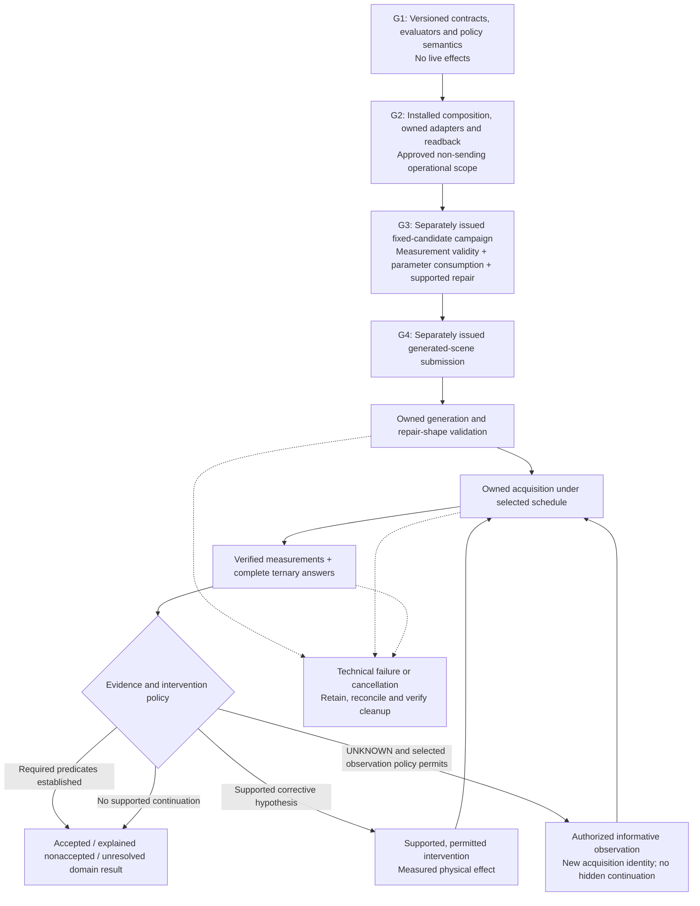

# P04-I03 — Configurable Installed Scene Workflow

- Document ID: `P04-I03-SCENE-WORKFLOW`
- Created: 2026-09-25
- Last reviewed: 2026-09-26
- Source baseline: `aec2b6b4781e9bd636bad08dccee6e668f7f6d39`
- Status: **PROPOSED — implementation-and-empirical-proof package; execution authority NOT ISSUED**
- Parent: [Plan 04](../event_mapping/event-mapping-refactoring_plan_04.md)
- Status owner: [canonical handoff](../dashboard_cli_workflow_parity/research-stack-implementation-handoff.md)
- Prerequisites: [I01](01-native-integration-defects.md) accepted **native-only**; [I02](02-installed-visual-assessment.md) parent-closed for **installed assessment integration with an uncertain visual result**. Neither establishes scene acceptance, calibration or the full workflow.
- Proposed generated-scene operation: `p04-i03-full-scene-v1`
- Proposed fixed-candidate repair-witness operation: `p04-i03-fixed-scene-proof-v1`

The [strategy and four complete actor–critic prompts](03-full-scene-workflow-strategy.md#5-proposed-goal-prompts) are the issuance source. Reading either document, selecting a profile, or approving this planning revision does not issue a goal. Repository links are relative; deployment/private paths must be resolved for the selected operator, never copied from an editor's filesystem.

## 1. Outcome and scope

Implement one configurable installed composition in which **one authenticated GraphQL submission** owns generation (when requested), candidate validation, native measurement/capture, assessment, permitted intervention, fresh measurement and retained disposition. Reuse the existing execution owner, coordinator, workers, profile registry, private bindings, grants, Neo4j store and artifact readers. Do not manually chain the accepted I01 and I02 operations or introduce another executor, ledger, scheduler or secret-management system.

Two distinct deliverables are required:

1. **General contract and execution machinery:** typed experiment parameters, observation selection, ternary truth, explicit budget policy, supported capabilities and honest lifecycle/readback.
2. **A scoped empirical witness:** initially the registered DROID/table/block/bin family, not proof that every robot, sensor, task, moving reference frame or deformable object is supported.

The parent [V1 checkpoint and dependency order](../event_mapping/event-mapping-refactoring_plan_03.md#concrete-delivery-checkpoints) require fixed-candidate native calibration/effective-placement evidence and a genuine supported repair witness, followed by the generated-scene path. An explained negative/uncertain result can prove integration, but [Plan 04's positive-scene obligation](../event_mapping/event-mapping-refactoring_plan_04.md#9-definition-of-done) remains open until a scene is actually accepted under its declared criteria.

The diagram describes the target application, not working code. Adaptive observation is admitted only for a policy actually implemented by the selected adapter. No graph arrow authorizes another release, and no uncertain result is silently converted into a repairable defect.

## 2. Semantic decisions for implementation

### 2.1 Parameterized predicates, not new hardcoded pilot constants

Add a versioned typed parameter representation rather than overloading the legacy scalar `CriterionLimit` or accepting an unchecked JSON dictionary. Bind evaluator identity, units, comparison operators, subject selection, reference frame, temporal coverage, aggregation and missing-data policy. Reject unsupported combinations before generation/provider/native effects.

The initial stationary rigid-body adapter must consume the selected linear/angular limits through **both native mechanics and retained evaluation**. `native_realization.py` currently has another fixed linear threshold; changing only `Criterion` or `NativeCaptureSettings` is insufficient. Ordinary failure of a selected stationary criterion is a domain measurement, not automatically a worker/integration failure. Preserve complete finite measurements when that criterion is false. Malformed samples, unplanned reset/termination, broken acquisition, unsafe execution, failed retention and lost ownership remain separate failures.

I01's reference profile remains strict norms `<0.001 m/s` and `<0.01 rad/s` for both `red_block` and `blue_bin` over final control steps 176–180. Those are **one experiment's values**, not universal API constraints. Do not accidentally replace `<` with `<=`. Other predicates/reference frames require their own supported adapters; a general schema is not evidence of general backend support.

### 2.2 Separate state sampling, acquisition and criterion coverage

The contract identifies:

- measurements, subjects, clock domain, sample cadence and required time/step coverage;
- camera/sensor IDs, modalities, image transforms and explicit capture selections or an implemented registered selection policy;
- the observations used by each predicate, independently of the complete acquired evidence inventory;
- the finite scientific horizon or termination condition, independently of a wall-clock resource budget.

Start with explicit schedules, including different state/image windows and repeated captures from a camera. Treat event/adaptive policies as supported only when a real selector, worker implementation and recovery semantics exist. An unsupported policy must be rejected, not silently approximated by a fixed schedule.

Retain requested policy, resolved selections and actual observations. Each frame/sample needs candidate, environment, realization, reset, source clock/step, sensor, modality and content identity. Repeated identical pixels at different times remain different observations. Detect stale camera buffers, unexpected resets, duplicate/missing observations and clock/ordering errors. Do not mix evidence from different realizations to manufacture simultaneous satisfaction.

A saved-PNG schedule is not necessarily a renderer-execution schedule. The adapter must distinguish requested capture/readout/retention from actual sensor/render updates. No rendering-time, payload-size or token-saving percentage is established by changing a frame count. Admission must check real serializer, artifact, image, request and backend limits; do not silently truncate, resize differently, omit frames or split a model request into uncounted calls.

### 2.3 Ternary truth and separate decision policy

Use explicit `TRUE/FALSE/UNKNOWN` semantics, represented for visibility as `visible/not_visible/uncertain`. Declare subject, camera and temporal quantifiers (`ALL`, `ANY`, or another explicitly implemented operator). Use defined three-valued operations; `UNKNOWN` is not Boolean false or a probability.[17]

**`not_visible` is not an ontic diagnosis, proof of occlusion, or automatic repair permission.** A false visibility proposition may concern the wrong target for the permitted repair, an out-of-view camera, insufficient visual evidence under the rubric, or an unsupported mechanism. Preserve per-frame/per-subject results, reasons and conflict information. Transport/schema/retention failure is not scientific `UNKNOWN` or `FALSE`.

The current retained `visibility-v2` codec is single-time-per-camera, folds results as ALL, and labels its source as retained imagery. Preserve its historical interpretation. Introduce an appropriate new full-scene codec/evaluator selection for multi-time coverage, declared aggregation and new provenance; reuse validated components without reinterpreting I02.

Complete response coverage is distinct from predicate aggregation: ANY does not permit omitted requested answers. The worker, raw/typed retention, projection, GraphQL/CLI and router must preserve the same truth algebra. A selected stop-on-uncertainty policy is valid for a particular case, but not a general harness invariant. Further observation must be authorized, informative, and tied to a persisted selection—not repetition until a preferred verdict appears.

### 2.4 Immutable raw measurements and separately identified reassessments

Separate acquisition identity from evaluation identity in the new protocol. Preserve the original acquisition contract/profile/cohort and its exact raw measurements. A new threshold evaluation is a **derived assessment** with its own criterion/evaluator/parameter identity and links to eligible source observations. It does not rewrite the original run, original criterion digest, original disposition or scientific flags.

Current replay requires the original full contract/profile binding, so passing a changed contract to `NativeCaptureProducer.replay` is not this feature. G1 must define the derivation/coverage rules; G2 must expose an authenticated, keyed retained-numeric-assessment path through existing readers and persistence, with no native/model dispatch. Insufficient retained coverage is reported, not invented. Reassessments labelled exploratory cannot retroactively satisfy validation under a previously frozen criterion.

Version old/new contract, evidence, capture and wire decoders explicitly. Adding default fields to existing Pydantic objects can change canonical bytes, hashes, operation identity and replay behavior. Preserve old serialization and refusal semantics, not just old numeric defaults.

### 2.5 Scoped programmatic diagnostics and causal evidence

Implement only a selected measurable mechanism initially, such as opaque rigid-object visibility/placement. Its producer must run while the owned native scene exists and retain the measurements needed for later analysis. After the native worker closes, parent-side reasoning cannot assume access to live USD/PhysX/RTX state.

The diagnostic producer is not the decision consumer. **G1 implements a pure, versioned mechanism/target eligibility evaluator** over verified measurements, required predicates and the selected intervention/observation policy; its output binds premises, supported hypothesis, permitted target/action and evidence/policy identities. **G2 consumes and retains that output** in routing, reservation, release, recovery and the refiner's declared feedback projection. Recheck the same bound decision before an effect, not merely an aggregate visual verdict. A wrong-subject failure without a supported causal link cannot release repair, and UNKNOWN without selected observation permission cannot become another capture. A measured cross-subject causal link may be supported explicitly; matching subject names alone is neither sufficient nor universally required.

A causal record separates:

1. **Supported hypothesis:** measured premises, relevant subject/camera, mechanism, assumptions and predicted consequence.
2. **Effective intervention:** permitted authored change and actual measured displacement/other intervention, with frame and original-baseline binding.
3. **Causal comparison:** matched baseline and intervention, observed mediator/outcome change, preserved conditions and unresolved alternatives.

Use actual camera calibration/conventions, object/prim identities, timestamps and an appropriate diagnostic such as instance masks/depth or a validated line-of-sight observation. Replicator/contact APIs are candidate instrumentation, not already-installed proofs.[18][20] A few rays to bounding-box vertices do not produce an exact occlusion percentage; physics colliders need not match rendered visual geometry. A force norm and proximity to a destination root do not establish load-bearing support. Radius checks are not analytical IK or collision-free reachability.

The current sampler only supports mapped spawnable objects and narrowly filtered contact forces; background/subasset support mapping is a missing adapter boundary. Select and validate the benchmark's actual support measurement rather than sampling a table as if it were an ordinary rigid object. Required unsupported diagnostics block their dependent proof. General IK, grasp planning, deformables and generic contact-manifold certification are not hidden prerequisites or claimed I03 deliverables.

Matching seeds alone is not proof of matched initial conditions or exact determinism. Retain asset/settings/solver/reset/hold/camera identities and relevant realized state; establish the scope and limitations of the comparison.[12][21] A single pair is not repeatability or general calibration. Use privileged simulator diagnostics as labelled validation evidence, and keep them out of an RGB-only assessment request unless the contract explicitly selects a different information boundary.

### 2.6 Bind repair permission to effective placement

Preserve the existing original-centered XY validation machinery. Initially support one declared target with a unique `on` relation and unique scalar `at_position` x/y values, an explicit `env_local` mapping and an operator-selected displacement bound. The reference red-block repair bound is `0.25 m`; it is a case selection, not every environment's policy.

For generated scenes, freeze a **semantic intervention selector and preservation policy** first; the application resolves the exact allowed scalar pointers against the validated original candidate and retains that binding before any repair. Do not guess `/relations/2`, silently reorder the candidate or ask the operator to resubmit the workflow between stages. If the selected implementation instead requires fixed pointers, validate the exact generated ordering before native release and refuse incompatible output—never widen permission implicitly.

A repair needs an addressable, supported hypothesis and all declared prerequisites. A false criterion for `blue_bin` does not automatically permit moving `red_block`. Validate every unchanged field, original-centered displacement, effective realized placement and fresh reassessment. Distinguish a corrective repair from an explicitly selected diagnostic intervention under uncertainty. Neither may be invented merely to obtain branch coverage.

### 2.7 Ungated empirical time budgets, truthful accounting and real supervision

Use explicit `enforced`, `advisory`, or `accounting_only` policies. In the new development/testing profile, aggregate runtime and total workflow deadline are **unset/unenforced**, not 600, 1,200 or 3,600 seconds under another name. The contract must represent this explicitly; absent enforcement is not zero, infinity encoded as a number, or a huge synthetic allowance.

Keep separate:

- scientific stopping conditions and selected finite experiment procedure;
- optional resource targets/ceilings, including explicitly selected effect counts;
- transport/backend limits and owned-worker supervision;
- API authentication/client-credential lifetime and composition-principal binding;
- workload authorization lifetime and exclusive resource ownership;
- reservation records, actual observed usage and uncertain consumption.

Do not add TCC refunds or a new accounting service. The existing ledger is conservative and preserves reservations; optional runtime enforcement removes the artificial veto without rewriting consumption. Historical I01/I02 records and reservations remain unchanged. Monetary/token accounting continues with actual usage and sourced estimates or explicit unknowns.

Nullable policy values must reach admission, generation/scene reservation checks, foreground authority, worker protocols, private deadlines, process timers, resume/cancel, query DTOs, GraphQL and CLI. They cannot simply flow into existing `min(...)`, timestamp addition, comparisons or non-null Decimal fields.

Long native work needs implemented progress/liveness supervision and a finite, renewable execution/authority mechanism where applicable—not an unkillable process or a stale one-shot alarm. Renewal must validate the same owner/fence/scope and record its effective revision; stale/revoked owners cannot renew. Model transport limits remain explicit. Cancellation and cleanup must still operate after workload authority expires or is revoked. An expired lease alone is never proof that a GPU is free. The precise wire/control mechanism is a G1/G2 implementation obligation, not supplied by the word “heartbeat.”[4][6]

API authentication is a separate ceiling: the current server issues a 3,600-second startup token, installed compositions capture that `AuthContext`/expiry, and the private client descriptor expires with it. Renewing a worker lease or execution grant cannot fix that captured principal. G1 must specify finite credential refresh/current-principal rebinding; G2 must implement it through the supported operator/private channel, installed composition and client, including credential-generation/descriptor compatibility. Keep principal, instance and scope binding exact, refuse expired/revoked credentials, and deliver refreshed credentials privately without rebuilding the owner or replaying work. Refresh alone grants no workload continuation, approval extension or new allocation. Require an actual non-sending expiry-crossing check showing stale authentication refused and refreshed authorized readback/cancellation usable, with workload authority independently enforced.

### 2.8 Preserve immutable intent while allowing programmatic selection

[Plan 03's launch/recovery contract](../event_mapping/event-mapping-refactoring_plan_03.md#61-current-versus-proposed-entry-points) requires a new contract/run for a changed admitted budget, model, seed or intervention. Keep that invariant in I03.

Dynamic behavior means **a frozen authorized policy choosing and retaining concrete future-stage settings inside its declared scope**. Use existing fenced/versioned transitions for append-only resolved allocations/selections. Replaying a recorded choice must not choose again. A change outside that policy requires a new declared operation/authorization; a new key does not manufacture fresh campaign allowance. Scientific re-evaluation uses the separately identified derived-assessment path.

Do not add a generic in-place `amendBudget` mutation or silently mutate the original contract. Such a feature would require an explicit parent-contract revision. Resource-version/ETag guidance is relevant to concurrency control, not permission to bypass immutable request identity.[16]

## 3. Code paths the goals must change together

The [detailed source findings and mental walkthrough](03-full-scene-workflow-strategy.md#1-source-backed-findings) supply the failure mechanisms. The minimum cross-layer map is:

| Boundary | Current source | Required coherent change |
| --- | --- | --- |
| Frozen contracts / canonical identity | [contracts.py](../../../../isaaclab_arena/agentic_environment_generation/workflow/contracts.py#L389) | New typed parameters/policies with legacy byte-compatible decoding and serialization; do not globally loosen old modes. |
| Native settling | [native_realization.py](../../../../isaaclab_arena/agentic_environment_generation/workflow/native_realization.py#L165), [native_capture.py](../../../../isaaclab_arena/agentic_environment_generation/workflow/native_capture.py#L668) | Consume selected limits; separate complete measured violation from collection failure. |
| Coverage / visual request / restore | [scene_observation.py](../../../../isaaclab_arena/agentic_environment_generation/workflow/scene_observation.py#L229), [evidence_contracts.py](../../../../isaaclab_arena/agentic_environment_generation/workflow/evidence_contracts.py#L19), [scene_ports.py](../../../../isaaclab_arena/agentic_environment_generation/workflow/scene_ports.py#L439) | New coverage/answer/derivation identity through request construction, persistence, restore and fresh readers. |
| Native settings / bytes / diagnostics | [native_capture.py](../../../../isaaclab_arena/agentic_environment_generation/workflow/native_capture.py#L36), [scene_evidence_artifacts.py](../../../../isaaclab_arena/agentic_environment_generation/workflow/scene_evidence_artifacts.py#L75) | Implement selected acquisition and diagnostic adapters; bounded artifacts and exact readback, not implicit extra payloads. |
| Existing versus generated source | [application.py](../../../../isaaclab_arena/agentic_environment_generation/workflow/application.py#L171), [service.py](../../../../isaaclab_arena/agentic_environment_generation/workflow/service.py#L561), [foreground_split_scene_ports.py](../../../../isaaclab_arena_examples/agentic_environment_generation/foreground_split_scene_ports.py#L99) | Existing-source execution must not require a generation attempt, generation receipt or source.prompt. |
| Installed/private composition | [installed_config.py](../../../../isaaclab_arena/agentic_environment_generation/workflow/api/installed_config.py#L72), [scene_engines.py](../../../../isaaclab_arena/agentic_environment_generation/workflow/scene_engines.py#L29) | Extend actual setup/dispatch/private-role paths; repair explicitly shares generation binding; no ambient credentials or new model-role framework. |
| Runtime policy / leases / timers | [neo4j_store.py](../../../../isaaclab_arena/agentic_environment_generation/workflow/neo4j_store.py#L3553), [native_worker_protocol.py](../../../../isaaclab_arena/agentic_environment_generation/workflow/native_worker_protocol.py#L101), [native_scene_worker.py](../../../../isaaclab_arena_examples/agentic_environment_generation/web_api/native_scene_worker.py#L236) | Optional workflow time policy plus working supervision, safe expiry and cleanup; preserve durable accounting. |
| API authentication / private client | [server.py](../../../../isaaclab_arena/agentic_environment_generation/workflow/api/server.py#L148), [security.py](../../../../isaaclab_arena/agentic_environment_generation/workflow/api/security.py#L50), [installed_execution.py](../../../../isaaclab_arena/agentic_environment_generation/workflow/api/installed_execution.py#L147), [client.py](../../../../isaaclab_arena/agentic_environment_generation/workflow/api/client.py#L152) | Refresh finite credentials and the composition's current principal safely; preserve exact scope and independently enforce workload authority. |
| Public read model | [read_model.py](../../../../isaaclab_arena/agentic_environment_generation/workflow/read_model.py#L33), [api/schema.py](../../../../isaaclab_arena/agentic_environment_generation/workflow/api/schema.py#L360) | Expose effective parameters, nullable policies, derived assessments and real progress without lossy Boolean/string coercion. |
| Diagnostic decision / effect release | [scene_loop.py](../../../../isaaclab_arena/agentic_environment_generation/workflow/scene_loop.py#L368), [scene_ports.py](../../../../isaaclab_arena/agentic_environment_generation/workflow/scene_ports.py#L260), [foreground_scene_ports.py](../../../../isaaclab_arena_examples/agentic_environment_generation/foreground_scene_ports.py#L252) | Implement and consume the evidence-bound eligibility decision before reservation/release and in recovery/refiner feedback; no unconditional observe-to-capture conversion. |
| Physical repair / causal evidence | [repairs.py](../../../../isaaclab_arena/agentic_environment_generation/workflow/repairs.py#L275), [scene_ports.py](../../../../isaaclab_arena/agentic_environment_generation/workflow/scene_ports.py#L393) | Resolve exact authorized target, select correct before/after samples, retain effective displacement and causal limitations. |

The installed config integer revision, workflow string revision, evaluator/worker codecs and database schema are separate version domains. `full-scene-execution-v1` and a new installed/contract revision remain proposed until implemented. Do not change the database schema number merely to match a workflow version.

## 4. Dependency-ordered implementation and proof

| Goal | Deliverable | Effect boundary when explicitly issued |
| --- | --- | --- |
| [G1 — contracts and semantics](03-full-scene-workflow-strategy.md#i03-g1) | Versioned predicates, schedules, evidence/derivation, repair-selection and budget/supervision protocols; pure decoder/evaluator checks | Scoped source/doc edits; no provider, Kit, API-service or database effects |
| [G2 — installed composition](03-full-scene-workflow-strategy.md#i03-g2) | Real owned adapters and telemetry implementation, private/source variants, public readback, supervision and non-sending installed preview | Only explicitly approved application/Neo4j setup and non-sending/CPU control checks; no provider sends or native release |
| [G3 — empirical fixed-candidate campaign](03-full-scene-workflow-strategy.md#i03-g3) | Selected measurement validity and parameter-consumption witnesses, genuine supported repair/effective-placement proof, honest causal limitations | Only the individually identified cases and effects in the separately approved campaign selection; time-budget vetoes disabled |
| [G4 — generated-scene integration](03-full-scene-workflow-strategy.md#i03-g4) | One new-source submission through the same validated composition; exact result/replay/cleanup | Separately issued finite procedure; no implicit rerun or extra diagnostic campaign |

G2 must implement both the diagnostic producers and the G1 eligibility evaluator's installed decision/release consumers; G3 is not instructed to discover an imaginary oracle or unwired hypothesis after admission. G3 may make narrowly scoped empirical adapter corrections only **between fully contained cases** and only as its issued scope allows. No hot-patching an admitted run. A subsequent effect still needs an already-authorized case/repeat; source correction alone grants none.

G4 follows the required G3 producer/mapping and supported repair evidence. A positive first candidate in G3 does not exercise repair; an uncertain one does not prove sensor adequacy. Record the partial result and the missing witness rather than silently waiving the dependency. No policy execution, live research-prior retrieval, publication, generic IK or other embodiment implementation is included.

## 5. Empirical selection and resource scope

The earlier **proposed** allocation—G3 fixed case up to 2 native releases/3 provider sends, then G4 up to 2/4—was a planning choice, not execution authority. Preserve it as a **minimal joined-path/repair-pair option**, not a promise that it covers calibration, parameter/schedule variation, cancellation experiments and repeatability simultaneously.

| Proposed case | Native releases | Initial generation | Repair | Assessment | Meaning |
| --- | --- | --- | --- | --- | --- |
| Minimal fixed-candidate repair case | 2 | 0 | 1 | 2 | Can witness one baseline/intervention pair only if a supported repair actually occurs. |
| Generated-scene integration case | 2 | 1 | 1 | 2 | One initial candidate and at most one supported repair through one submission. |

If both minimal cases are issued unchanged, their combined ceilings are 4 native releases and 7 provider sends. **There is no aggregate runtime/deadline gate for the development profile.** Effect counts are explicit case permissions/procedure bounds, not universal schema clamps. No automatic retries, constructor probes, fallback, same-image re-judging or uncounted schema-correction calls are permitted in these reference cases.

G2 must propose the concrete G3 case matrix needed for its selected measurement/repair claims, identifying which witnesses share an acquisition and which need additional effects. The operator approves that exact matrix when issuing G3. Additional calibration/control/alternate-schedule/repeatability cases are neither implicitly covered by 2/3 nor already authorized here. If only the minimal option is issued and a required witness does not fit, close the observed slice and state the exact missing case. Do not demand guessed wall-time reservations or spend G4 as a diagnostic substitute.

A live selection must resolve:

- exact case IDs/operation IDs, source baseline, candidate bytes or prompt, catalogs, contract/config/profile digests and predecessor applicability;
- implemented predicate/schedule/diagnostic capabilities, effective settings, clock/reset/hold policy, asset/prim/sensor/frame mappings, expected observations and technical payload limits;
- explicit visibility aggregation and uncertainty continuation policy, corrective versus diagnostic intervention, preservation rules and original-centered bounds;
- named credential-source bindings through the supported private mechanism, approved operational DB/artifact scope, API/operator identities, current authorization and supervision/renewal policy;
- individually permitted effect counts, programmatic allocation rules, stop conditions, cleanup/escalation, and any between-case correction/repeat authority;
- explicit `not_requested` research-prior policy and its retained receipt; this is not nonempty-prior integration;
- actual entrypoints, affected existing checks, expected installed observations and unresolved empirical limitations.

No placeholders are executable identifiers or hashes. Freeze known policy before admission; generated candidates, resolved pointers, observations and model requests are bound by the application when they exist. Replayed choices/operations do not renew allocations or repeat released effects.

## 6. Six independent closeout dimensions

| Claim | Required report; do not infer adjacent claims |
| --- | --- |
| 1. Installed integration | Actual source variant and application-owned stages reached; no manual follow-on submissions. A preview is not this witness. |
| 2. Physical measurement validity | Requested/resolved/observed parameters, sample/image clocks and coverage, raw measurements, predicate outcomes and scoped calibration limits. A measured violation can be complete acquisition. |
| 3. Assessment fidelity | Exact model inputs and complete ternary outputs, aggregation, reason/conflict/quality information; no privileged diagnostic leakage. |
| 4. Intervention and causal status | Not exercised / proposed / attempted / physically effective; supported hypothesis, fresh reassessment, matched-comparison result and repeatability limitations reported separately. |
| 5. Scientific disposition | Accepted only under the declared required predicates and validated producers; otherwise explained nonaccepted/inconclusive/not assessed. No post-hoc relaxation promoted as original validation. |
| 6. Readback, replay and lifecycle | Fresh authenticated byte recovery and causal traversal; same-key no-effect replay; exact owned-process cleanup, GPU release, scope-owner retirement and owned API drain, each independently verified. |

Report technical failure separately from domain truth. Preserve first-causal diagnostics and secondary cleanup failures, including unrecoverable diagnostic loss; never manufacture a graceful exit or a missing initiating exception. A worker's absence alone does not retire durable ownership or prove safe GPU reuse. Do not stop shared services or signal historical PIDs.

The final record names actual usage, reservations, unknown consumption, policy mode and issued effect ceilings; it does not require elapsed time to be below an obsolete 1,200-second limit. Report remaining parent obligations explicitly. Do not promote old I01/I02 scientific flags, calibration, policy success, prior eligibility, full Milestone 1 or full Plan 04 completion.

## 7. Planning and issuance checklist

- [ ] G1 is explicitly issued and its protocol/legacy-compatibility obligations are verified.
- [ ] G2's operational scope is explicit; actual installed preview/readback/control paths work without paid/native effects.
- [ ] Selected diagnostics and supervision have implementations; configured support is distinguished from empirical validity.
- [ ] G3's exact case matrix and effect permissions are explicitly issued; no guessed total-time cap is reintroduced.
- [ ] Required measurement/mapping and supported repair witnesses are actually obtained, or a precise remaining case is recorded.
- [ ] G4 is separately issued with applicable G3 evidence and the exact final selection.
- [ ] Each closed claim has real installed evidence; original history and all unresolved claims remain intact.

All boxes are intentionally open. This review changes plans, not application readiness or execution authority.

## 8. Architectural references

Use these as design principles, not instructions to install additional frameworks.

Long-running operation identity and idempotent commands inform the existing owner.[1][2]

Supervision, verified cleanup and trace context inform its existing lifecycle.[4][6][14]

Explicit three-valued semantics and candidate measurement instrumentation inform the proposed adapters.[17][18][20]

Controlled causal comparisons and reproducibility still require the concrete source and empirical work described above, not acceptance by citation.[12][21]

Sources:
[1] https://google.aip.dev/151
[2] https://aws.amazon.com/builders-library/making-retries-safe-with-idempotent-APIs
[4] https://docs.temporal.io/design-patterns/long-running-activity
[6] https://kubernetes.io/docs/concepts/overview/working-with-objects/finalizers
[12] https://pywhy.org/dowhy/v0.11/example_notebooks/tutorial-causalinference-machinelearning-using-dowhy-econml.html
[14] https://opentelemetry.io/docs/concepts/context-propagation
[16] https://google.aip.dev/154
[17] https://www.postgresql.org/docs/current/functions-logical.html
[18] https://docs.omniverse.nvidia.com/py/replicator/1.11.16/source/extensions/omni.replicator.core/docs/annotators_details.html
[20] https://isaac-sim.github.io/IsaacLab/main/source/overview/core-concepts/sensors/contact_sensor.html
[21] https://isaac-sim.github.io/IsaacLab/main/source/features/reproducibility.html
