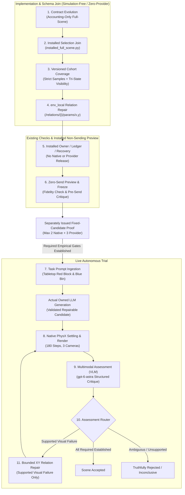

# P04-I03 — Full Live Scene Workflow (Plan 03 V1)

- Document ID: `P04-I03-SCENE-WORKFLOW`
- Created: 2026-09-25
- Last Updated: 2026-09-26
- Status: Proposed — Implementation & Proof Package
- Parent: [Plan 04](../event_mapping/event-mapping-refactoring_plan_04.md)
- Status Owner: [canonical handoff](../dashboard_cli_workflow_parity/research-stack-implementation-handoff.md)
- Prerequisite Status:
  - [P04-I01 (Native Simulation Slice)](01-native-integration-defects.md): **100% VERIFIED & CLOSED**
  - [P04-I02 (Installed Visual Assessment)](02-installed-visual-assessment.md): **INTEGRATION VERIFIED & PARENT-CLOSED**
- Execution Authority: **NOT ISSUED**
- Target Operation: `p04-i03-full-scene-v1`

**Current review and goal source:** [source-backed strategy and four actor–critic goals](03-full-scene-workflow-strategy.md).
The operator selected a separately budgeted fixed-candidate proof before the
generated-scene trial as a planning decision, not execution approval. All four
goals remain unissued. Implementation details here are proposed; source findings
are not resolved merely by being listed. The strategy supplies the current
semantic decisions, actor–critic protocol and issuance gates.

> [!IMPORTANT]
> **Devcontainer Named Volume & Path Invariant:**
> The repository operates inside a devcontainer mounted as a named volume. **Never hardcode absolute filesystem paths or `file:///` URIs in plans or documentation** (e.g. `file:///workspaces/...`). Always use repository-relative links (`../../../../...`) so paths resolve identically across host environments, devcontainers, editor extensions, and Git remotes.

---

## 1. Outcome & Milestone Objectives

The objective of **Stage 3: P04-I03** (Goal D, Plan 03 V1) is to implement and prove the **first fully autonomous, unbroken prompt-to-scene workflow** executed through the installed application's GraphQL interface.

Rather than a simple "preflight, then run" execution recipe, **P04-I03 is an implementation-and-proof package**. It first joins the existing underlying coordinators, workers, and scene-loop machinery into a supported installed configuration, and then executes a bounded empirical trial to prove reliable application ownership from natural-language prompt to sealed scene disposition.

### Core Architecture Invariant
P04-I03 proves **reliable application ownership of the complete trial**, not a guarantee that one XY displacement produces an accepted scene. Positive scene acceptance and live repair loop coverage are explicit, independent obligations.



### What This Work Package Does NOT Certify
- It does **not** execute robot policy trials (Stage 4 / P04-I04: Isaac-GR00T banana pick-and-place pilot).
- It does **not** claim general open-vocabulary scene coverage; it validates the closed-loop autonomous pipeline on the designated benchmark manipulation domain.

---

## 2. Codebase Reality & Proposed Gap Resolutions

A technical review identified the original gaps below. The [follow-up review](03-full-scene-workflow-strategy.md#1-material-findings-remaining-after-the-overview-revision)
identifies additional constraints; no application correction is claimed by this planning document.

| Gap | Source File | Verified Codebase Constraint | Resolution in P04-I03 |
| :--- | :--- | :--- | :--- |
| **1. No Installed Full-Scene Mode** | [`installed_config.py:89`](../../../../isaaclab_arena/agentic_environment_generation/workflow/api/installed_config.py#L89) | Currently admits only `query-only`, `isolated-synthetic-execution-v1`, `retained-native-validation-v1` (schema 4), and `retained-visual-assessment-v1` (schema 5). No full-scene composition exists. | Implement `installed_full_scene.py` and register the new mode `full-scene-execution-v1` under schema_version 6 in `installed_config.py`. |
| **2. Contract Schema Conflicts** | [`contracts.py:275`](../../../../isaaclab_arena/agentic_environment_generation/workflow/contracts.py#L275)<br>[`service.py:924`](../../../../isaaclab_arena/agentic_environment_generation/workflow/service.py#L924) | Schema 4 is retained-assessment-only; other current schemas reject null token/cost caps; operational writes must be explicitly permitted. | Implement a separately versioned full-scene policy through contracts, authorization, all reservations, model allowances and readers. Select new-source generation or an exact existing-source empirical case explicitly. Preserve every old schema. |
| **3. Evidence Window & Producer Mismatch** | [`evidence_contracts.py:66`](../../../../isaaclab_arena/agentic_environment_generation/workflow/evidence_contracts.py#L66)<br>[`scene_observation.py:23`](../../../../isaaclab_arena/agentic_environment_generation/workflow/scene_observation.py#L23)<br>[`native_capture.py:85`](../../../../isaaclab_arena/agentic_environment_generation/workflow/native_capture.py#L85) | Legacy common-window, subject-count and evaluator rules do not represent the requested strict final-five measurements plus two-subject tri-state visibility in three terminal images. | Version coverage/evaluation together: numeric samples 176–180 and three images at step 180, bound to one exact candidate/reset/cohort. Preserve old guards and evaluator meanings rather than merely renaming producers. |
| **4. Uncertainty $\neq$ Repair** | [`scene_loop.py:368`](../../../../isaaclab_arena/agentic_environment_generation/workflow/scene_loop.py#L368) | Ambiguous / inconclusive visual receipts route to `action="observe", reason="evidence_not_established"`, **not** repair. Repair strictly requires `assessment.status == "not_established"` with confirmed `supported_visual_failure` (`assessment.failed_ids <= visual`). | Declare an explicit decision policy: one bounded repair is permitted *only* on a confirmed, supported visual failure. Inconclusive or ambiguous receipts preserve uncertainty and do not trigger illegal repair. |
| **5. Repair Representation Incompatibility** | [`repairs.py:120`](../../../../isaaclab_arena/agentic_environment_generation/workflow/repairs.py#L120) | The repair guard strictly requires `coordinate_frame="env_local"` and paths matching `/relations/{index}/params/x` or `/y`. It rejects world poses and object paths. | The generation prompt must output the canonical Arena scene representation with a structured `relations` list (`is_anchor`, `on`, `at_position`), allowing repair rules to target exact scalar offsets in `env_local`. |
| **6. Benchmark & Physical Semantics** | Evaluators & Registries | Workspace radius is not reachability; visibility is not reachability; physical settling is not collision-free support. | Use the registered DROID / `maple_table_robolab` / `red_block_basic_robolab` / `bin_b03_vomp_robolab` family. Bind required physical and sensing metadata to actual sources or scoped observations; do not use test-only synthetic vocabulary or claim unverified dimensions/calibration. |
| **7. Reservation Ledger Mismatch** | [`neo4j_store.py:3566`](../../../../isaaclab_arena/agentic_environment_generation/workflow/neo4j_store.py#L3566) | Every execution intent reserves from `b.max_runtime_seconds`; six 120s stages still total 720s, exceeding the illustrative 600s cap. | Freeze evidence-supported numeric stage/cleanup reservations and final readback/drain headroom before live issuance. If they cannot fit the 1,200s case window, stop for a decision rather than guessing shorter timeouts. |
| **8. Conflation of Acceptance Claims** | Plan 03 V1 ([`event-mapping-refactoring_plan_03.md:251`](../event_mapping/event-mapping-refactoring_plan_03.md#L251)) | Pipeline integration, scene disposition, and repair loop coverage are distinct outcomes. If Candidate 1 passes immediately, the repair loop is unproven. | Decouple closeout into 6 independent, non-overlapping claims. |

---

## 3. Existing Capability vs. Required Implementation Changes

```
┌─────────────────────────────────────────────────────────────────────────────────────────────────┐
│                                   P04-I03 COMPOSITION JOIN                                      │
├───────────────────────────────┬─────────────────────────────────┬───────────────────────────────┤
│ Subsystem                     │ Existing Codebase State         │ Required P04-I03 Change       │
├───────────────────────────────┼─────────────────────────────────┼───────────────────────────────┤
│ API Config                    │ Schema 4 (native-only) and      │ Schema 6: full-scene-         │
│ (installed_config.py)         │ Schema 5 (assessment-only)      │ execution-v1 wired to all     │
│                               │ wired to isolated handlers.     │ 4 worker roles.               │
├───────────────────────────────┼─────────────────────────────────┼───────────────────────────────┤
│ Contract Validation           │ Schema 4 enforces retained-     │ Schema 6: permits new source, │
│ (contracts.py)                │ only; others require token /    │ model dispatches, runtime,    │
│                               │ monetary cost audits.           │ and accounting-only bounds.   │
├───────────────────────────────┼─────────────────────────────────┼───────────────────────────────┤
│ Evidence Criteria             │ Legacy common-window and        │ Versioned strict numeric and  │
│ (evidence_contracts.py)        │ evaluator semantics.            │ tri-state image coverage.     │
├───────────────────────────────┼─────────────────────────────────┼───────────────────────────────┤
│ Scene Generation Output       │ ArenaEnvGraphSpec validation;   │ Validate selected ordering,   │
│ (scene_engines.py)            │ repair shape not guaranteed.    │ identities and scalar paths.  │
├───────────────────────────────┼─────────────────────────────────┼───────────────────────────────┤
│ Repair Adapter                │ Rejects world coordinates and   │ Targets env_local scalar      │
│ (repairs.py)                  │ non-relation schema paths.      │ /relations/{i}/params/x, y.   │
├───────────────────────────────┼─────────────────────────────────┼───────────────────────────────┤
│ Execution Owner & Leases      │ Handles isolated single-worker  │ Coordinates sequential owner  │
│ (execution_owner.py)          │ lifecycle.                      │ and NativeGpuLease handover.  │
└───────────────────────────────┴─────────────────────────────────┴───────────────────────────────┘
```

---

## 4. The 6 Independent Acceptance Claim Dimensions

P04-I03 requires reporting all six dimensions, including blocked, inconclusive or
unexercised results. Reporting them does not imply all six passed or certify V1.

1. **Claim 1: Installed Pipeline Integration**
   - The installed GraphQL API, application supervisor, and worker dispatchers executed the joined multi-stage workflow from start to finish without manual intervention or out-of-band scripts.
2. **Claim 2: Physical Settling & Numeric Truth**
   - Candidate realized in Isaac Sim PhysX on the Blackwell GPU for 180 control steps; final 5-step velocities met settling bounds ($<0.001\text{ m/s}$ linear, $<0.01\text{ rad/s}$ angular); 3 camera PNGs rendered and hashed.
3. **Claim 3: Visual Assessment Fidelity**
   - `gpt-6-astra` evaluated all camera frames under the frozen visibility rubric, producing complete per-subject `visible`, `not_visible`, or `uncertain` answers. `not_visible` does not establish occlusion as the cause.
4. **Claim 4: Repair Branch Status & Coverage**
   - *If Candidate 1 passed immediately*: Report *unexercised* (non-repair path proven; repair loop remains unproven).
   - *If Candidate 1 had a supported visual failure*: Report *attempted* until bounded $\le 0.25\text{ m}$ `env_local` repair, effective native displacement, fresh settling, reassessment and cleanup are all witnessed; only then report the branch *exercised*.
   - *If Candidate 1 was inconclusive/uncertain*: Report *uncertainty preserved* (no illegal repair triggered).
5. **Claim 5: Truthful Scene Disposition**
   - Report scientific scene disposition separately from the actual workflow lifecycle state. A nonaccepted/inconclusive scene is not an invented database state; infrastructure failures are never relabeled as scene rejections.
6. **Claim 6: Idempotent Readback, Replay & Provable Cleanup**
   - Fresh-client readback recovers exact candidate and evidence bytes; no-effect replay returns identical receipts with 0 additional calls; worker processes absent, owner retired clean, leases released, API drained.

---

## 5. Multi-Phase Implementation & Proof Plan

```
Phase 1: Invariant & Specification Alignment
Phase 2: Contract Schema & Accounting Extension (contracts.py)
Phase 3: Evidence & Observation Projection Alignment (evidence_contracts.py, native_capture.py)
Phase 4: Scene Representation & Repair Adapter Mapping (repairs.py, scene_loop.py)
Phase 5: Installed Full-Scene Composition Join (installed_config.py, installed_full_scene.py)
Phase 6: Installed Non-Sending Inspection, Existing Checks & Recovery Readiness
Phase 7: Separately Issued Fixed-Candidate Empirical Proof & Final Trial Freeze
Phase 8: Autonomous Live Execution (Gate B)
Phase 9: Readback, Replay, Provable Cleanup & Disposition Certification (Gate C)
```

### Phase 1: Invariant & Specification Alignment
- Freeze the real registered benchmark, subject/asset mappings, hold/reset policy and required metadata sources. The earlier guessed dimensions are not verified inputs.
- Freeze coordinate frame: relation placement parameters `/relations/{index}/params/x` and `/y` in `env_local`.
- Declare uncertainty policy: a complete inconclusive result stops this bounded case without another capture or send. Repair requires a confirmed visual failure addressable by the permitted target and established nonvisual prerequisites.
- Reconcile reservation ledger: stage-level timeouts budgeted to prevent ledger exhaustion under `b.max_runtime_seconds`.

### Phase 2: Contract Schema & Accounting-Only Extension
- In [`contracts.py`](../../../../isaaclab_arena/agentic_environment_generation/workflow/contracts.py):
  - Add Schema 6 (Full-Scene Accounting-Only Contract).
  - Select `source.kind == "new"` for the main trial and an exact `existing` source for the separately budgeted fixed-candidate proof.
  - Allow `generation_model`, `assessment_model`, `runtime`, and `allowed_interventions`.
  - Validate `effects.allow_operational_writes == True` and `effects.allow_runtime == True`.
  - Validate accounting-only limits (`max_model_calls <= 4`, `max_candidates <= 2`, `max_revisions <= 1`, `max_realizations <= 2`).
  - Exercise actual decoders and affected existing checks; minimal pure protocol regressions may be added within existing modules, not a new mock framework.

### Phase 3: Evidence & Observation Projection Alignment
- In [`evidence_contracts.py`](../../../../isaaclab_arena/agentic_environment_generation/workflow/evidence_contracts.py) and [`scene_observation.py`](../../../../isaaclab_arena/agentic_environment_generation/workflow/scene_observation.py):
  - Preserve numeric samples 176–180 and exactly three camera images at step 180. Bind both coverages to the same realization/reset through a versioned protocol, not a global relaxation of old window checks.
  - Preserve strict settling limits and complete two-subject tri-state visibility. Existing evaluator v1 is not an equivalent substitute.
  - Exercise producer, projection and fresh-reader semantics together; a passing DTO check alone is insufficient.

### Phase 4: Scene Representation & Repair Adapter Mapping
- In [`repairs.py`](../../../../isaaclab_arena/agentic_environment_generation/workflow/repairs.py) and generation prompting:
  - Formulate generation schema grammar to output canonical Arena relations: `is_anchor`, `on`, and `at_position` with scalar `x, y` parameters.
  - Bind repair rules to `/relations/{index}/params/x` and `/relations/{index}/params/y` with `coordinate_frame="env_local"` and Euclidean ceiling $\le 0.25\text{ m}$.
  - Check exact relation/subject binding before effects and effective realized displacement after repair; reuse the existing repair checks and permission envelope.

### Phase 5: Installed Full-Scene Composition Join
- In [`installed_config.py`](../../../../isaaclab_arena/agentic_environment_generation/workflow/api/installed_config.py):
  - Add schema_version 6 mode: `"full-scene-execution-v1"`.
  - Validate role bindings across generation, assessment, repair, and operational DB.
- Create `workflow/api/installed_full_scene.py` as the proposed installed factory; it does not exist yet:
  - Reuse `InitialGenerationWorker` / `InitialGenerationReceiver`, split native/model adapters and the existing owner/coordinator. Select numeric-only versus model assessment explicitly; do not insert unbudgeted worker stages.
  - Enforce concurrency invariant: release `NativeGpuLease` before model dispatch; terminate model workers before native re-acquisition.
  - Include server/CLI dispatch, private role/setup/readiness, both source variants, cancellation, duplicate cleanup, post-crash recovery, handover and fresh-client readers. Preserve the scope owner between stages.

### Phase 6: Installed Non-Sending Boundary & Existing Checks
- Exercise supported installed parsing, authenticated inspection, preview and lifecycle paths in the explicitly approved operational scope, with sends and native releases denied.
- Reuse affected existing simulation-free checks. No new mock end-to-end loop, simulator/provider fixtures, proof harnesses or synthetic matrices.
- Verify concrete role/count/runtime reservations and actual serializer/RequestEnvelope coverage. State which child/native boundaries remain unexercised.
- Confirm scoped database-write authority for setup or DB-mutating checks; zero-provider does not mean zero-database-effects.

### Phase 7: Fixed-Candidate Empirical Proof & Trial Freeze
- After separate G3 issuance, exercise the same installed composition with a frozen existing candidate: at most 2 native launches, 1 repair send and 2 assessment sends, with no initial generation.
- Establish required native/sensing/mapping observations and conditional repair coverage; report uncertainty and unexercised branches without forcing a verdict.
- Freeze exact final G4 inputs/profiles/source and adequate numeric stage/cleanup reservations. A downstream generated candidate/image request is bound at its actual application stage, not invented in preflight.
- Run the scoped checks and obtain a fresh read-only pre-send critic for each live case. Recheck effective authentication, approval and role-grant runway at actual admission after critique, not only when configuration was authored.

### Phase 8: Autonomous Live Execution (Gate B)
- Submit single GraphQL mutation `submitWorkflow` to running API server.
- Application supervisor autonomously drives: Generation $\to$ Settling (180 steps) $\to$ Capture $\to$ Visual Assessment $\to$ Conditional Repair.
- Cumulative envelope strictly enforced: max 2 native launches, max 4 provider calls, max 1,200s deadline.

### Phase 9: Readback, Replay, Provable Cleanup & Disposition Certification (Gate C)
- Fresh client cryptographic readback of causal graph.
- Replay verification: identical result with 0 additional provider or native calls.
- Provable cleanup: worker PIDs absent, owner retired clean (`dirty=False`), leases released, API drained.
- Final independent critique review (`ACCEPT`).
- Certification of the 6 independent claims.

---

## 6. Cumulative Budget & Resource Envelope

These are **proposed, separately issued case ceilings**, not active allocations.
The operator selected the separate fixed-candidate proof during planning.

| Case | Native launches | Initial generation sends | Repair sends | Assessment sends | Provider total |
| --- | --- | --- | --- | --- | --- |
| G3 fixed-candidate proof | 2 | 0 | 1 | 2 | 3 |
| G4 generated-scene trial | 2 | 1 | 1 | 2 | 4 |
| Combined proposal if both goals are issued | 4 | 1 | 2 | 4 | 7 |

Unused allowance is not transferable or renewed by a restart/reissued goal.
The following table describes **G4 only**; see the strategy for G3 and shared rules.

| Resource / Envelope | Cumulative Ceiling | Rationale |
| :--- | :---: | :--- |
| **Native PhysX Launches** | **Max 2 launches** | 1 for candidate 1 settling + max 1 for repaired candidate 2 settling. |
| **LLM Generation Calls** | **Max 1 provider call** | Initial scene graph generation from natural language prompt. |
| **LLM Scene Repair Calls** | **Max 1 provider call** | Triggered only on confirmed `supported_visual_failure`. |
| **VLM Assessment Calls** | **Max 2 provider calls** | 1 for candidate 1 evaluation + max 1 for repaired candidate 2 evaluation. |
| **Total Provider Dispatches** | **Max 4 dispatches** | Hard ceiling across generation, repair, and visual critiques. |
| **Per-Substage Timeout** | **Unresolved until exact selection** | Derive adequate numeric stage and cleanup allowances from the actual composition and retained timing evidence; no guessed 90–120s range. |
| **Total Operation Deadline** | **1,200 seconds (20 min)**| End-to-end operation window from admission to API drain. |
| **Concurrency Invariant** | **Strictly 1 worker** | GPU simulation worker lease released and clean before model worker launch; model worker terminated before native re-acquisition. |

No live issuance is ready until the runtime reservation sum and final
readback/drain headroom fit the selected case's 1,200s deadline. Failed/uncertain
dispatches and native releases count; reservations are preserved. No provider
retries, hidden pings/fallbacks or same-candidate recaptures. Accounting-only means
usage/cost reporting without preset monetary/aggregate-token vetoes, not absent
technical request/completion limits.

---

## 7. Staged Goal Prompts for Operator Issuance

The three earlier sketches are superseded by **four independently issuable,
unissued actor–critic goals** in the [strategy](03-full-scene-workflow-strategy.md#5-proposed-goal-prompts):

1. [I03-G1 — Truthful protocol and accounting semantics](03-full-scene-workflow-strategy.md#i03-g1--implement-truthful-protocol-and-accounting-semantics): source/decoder/evaluator work; no provider, native, API service or database effects.
2. [I03-G2 — Installed owner, private roles and recovery](03-full-scene-workflow-strategy.md#i03-g2--join-the-installed-owner-private-roles-and-recovery-path): scoped setup and actual non-sending installed boundaries, not a new mock loop.
3. [I03-G3 — Fixed-candidate empirical proof](03-full-scene-workflow-strategy.md#i03-g3--prove-the-fixed-candidate-nativeevidence-boundary): separately issued native/evidence/conditional-repair case, capped at 2 native and 3 provider effects.
4. [I03-G4 — Generated-scene workflow](03-full-scene-workflow-strategy.md#i03-g4--prove-the-generated-scene-workflow-and-close-verified-scope): main single-submission case, capped at 2 native and 4 provider effects.

Each incorporates [AC-I03](03-full-scene-workflow-strategy.md#4-shared-actorcritic-protocol-ac-i03): parent sole writer/operator, one independent read-only critic at a time,
material cited blockers, bounded hypothesis/correction loops, meaningful
pre-boundary/final checkpoints, and parent-only acceptance. A critic does not
grant authority or certify an unobserved native outcome. Only the explicitly
issued goal is active; do not execute the next goal automatically.

---

## 8. Appendix: Illustrative Target Contract JSON (Non-Executable Draft)

> [!NOTE]
> The JSON below is a **superseded, non-executable design sketch**, retained for comparison. Adding Schema 6 would not make it valid: its evaluator subject counts, thresholds, observation coverage, reservation totals and placeholder hashes still conflict with the selected design. Do not change code or tests to accept this sketch. The real contract must be produced through the implemented protocol and frozen selection described in the strategy before a live goal is issued.

```json
{
  "schema_version": "6",
  "source": {
    "kind": "new",
    "prompt": "Generate a tabletop manipulation scene with a red block and a blue bin within reach of the robot workspace, where the red block is clearly visible to external and wrist cameras."
  },
  "criteria": [
    {
      "criterion_id": "crit_settled",
      "kind": "runtime",
      "evidence_producer": "scene.settled",
      "requirement": "required",
      "evaluator_version": "1",
      "required_modalities": ["state"],
      "coordinate_frames": ["world"],
      "observation_window": {"start_step": 176, "end_step": 180},
      "rubric": "linear and angular speeds below settling thresholds",
      "subjects": ["red_block", "blue_bin"],
      "limit": {"operator": "eq", "value": 1.0, "unit": "boolean"}
    },
    {
      "criterion_id": "crit_visible",
      "kind": "visual",
      "evidence_producer": "scene.visible",
      "requirement": "required",
      "evaluator_version": "1",
      "required_modalities": ["rgb"],
      "coordinate_frames": ["external_camera_rgb", "external_camera_2_rgb", "wrist_camera_rgb"],
      "observation_window": {"start_step": 176, "end_step": 180},
      "rubric": "subject visible in every retained frame",
      "subjects": ["red_block", "blue_bin"],
      "limit": {"operator": "eq", "value": 1.0, "unit": "boolean"}
    }
  ],
  "preserved": [
    {
      "subject_id": "table",
      "schema_path": "/background",
      "mode": "frozen",
      "description": "Table geometry, pose and dimensions are immutable."
    }
  ],
  "allowed_interventions": [
    {
      "subject_id": "red_block",
      "schema_path": "/relations/2/params/x",
      "operation": "replace",
      "coordinate_frame": "env_local",
      "units": "m",
      "max_total_displacement_m": 0.25,
      "description": "Permit bounded X placement repair in table-local frame if supported visual failure occurs."
    },
    {
      "subject_id": "red_block",
      "schema_path": "/relations/2/params/y",
      "operation": "replace",
      "coordinate_frame": "env_local",
      "units": "m",
      "max_total_displacement_m": 0.25,
      "description": "Permit bounded Y placement repair in table-local frame if supported visual failure occurs."
    }
  ],
  "execution": {
    "generation_model": {
      "profile_id": "p04-i03-gpt6-astra-generation",
      "settings_sha256": "RESOLVED_IN_PHASE_7",
      "billing": "paid"
    },
    "assessment_model": {
      "profile_id": "p04-i03-gpt6-astra-visibility",
      "settings_sha256": "RESOLVED_IN_PHASE_7",
      "billing": "paid"
    },
    "runtime": {
      "profile_id": "p04-isaacsim-blackwell-physx",
      "settings_sha256": "RESOLVED_IN_PHASE_7"
    },
    "database": {
      "profile_id": "p04-neo4j-production",
      "settings_sha256": "RESOLVED_IN_PHASE_7"
    },
    "policy": null,
    "capture": {
      "profile_id": "p04-multi-camera-cohort",
      "settings_sha256": "RESOLVED_IN_PHASE_7"
    },
    "seed": 42,
    "timestep_seconds": 0.005,
    "decimation": 4,
    "dcrg": null
  },
  "budget": {
    "max_candidates": 2,
    "max_revisions": 1,
    "max_runtime_seconds": 600.0,
    "max_model_calls": 4,
    "max_model_tokens": null,
    "max_cost_usd": null,
    "max_realizations": 2,
    "max_steps": 360,
    "max_observations": 4,
    "max_policy_episodes": 0,
    "max_policy_steps": 0,
    "per_operation_timeout_seconds": 120.0,
    "total_deadline_seconds": 1200.0
  },
  "effects": {
    "allow_paid_models": true,
    "allow_runtime": true,
    "allow_database_reads": true,
    "allow_publication": false,
    "allow_dcrg": false,
    "allow_operational_writes": true
  }
}
```

---

## 9. Closeout Template (Post-Execution)

```markdown
### P04-I03 Stage Closeout Report

- **Case / Operation ID**: `[G3: p04-i03-fixed-scene-proof-v1 / G4: p04-i03-full-scene-v1]`
- **Run ID**: `[Recorded at admission]`
- **Submission Admitted At**: `[Timestamp]`
- **Completed At**: `[Timestamp]`

#### Six Independent Acceptance Claims:
1. **Claim 1 (Installed Pipeline Integration)**: `[VERIFIED / FAILED / BLOCKED / NOT_EXERCISED]` (Name the actual source path exercised)
2. **Claim 2 (Physical Settling & Numeric Truth)**: `[VERIFIED / FAILED / INCONCLUSIVE / NOT_EXERCISED]` (Exact windows, limits and image coverage)
3. **Claim 3 (Visual Assessment Fidelity)**: `[VERIFIED / FAILED / NOT_EXERCISED]` (Complete structured review; verdict separate)
4. **Claim 4 (Repair Branch Status & Coverage)**: `[VERIFIED / ATTEMPTED_BUT_FAILED / UNEXERCISED / UNCERTAINTY_PRESERVED]`
5. **Claim 5 (Truthful Scene Disposition)**: `[ACCEPTED / NONACCEPTED / INCONCLUSIVE / NOT_ASSESSED]` (Separate actual workflow state/reason)
6. **Claim 6 (Idempotent Readback, Replay & Provable Cleanup)**: `[VERIFIED / FAILED / UNKNOWN / NOT_EXERCISED]` (Report physical, durable and API outcomes separately)

#### Resource Consumption Ledger:
- **Native PhysX Launches**: `[Consumed / 2]`
- **Provider Dispatches**: `[Consumed / selected G3=3 or G4=4]` (Initial generation: X, Assessment: Y, Repair: Z)
- **Token Usage**: `[Prompt Tokens / Completion Tokens]`
- **Elapsed Real Time**: `[Seconds <= 1,200s]`
- **Durable Owner Status**: `[Retired, dirty=False]`
- **Leases**: `[All released]`
- **Final Critic Decision**: `[ACCEPT / BLOCKED]`
- **Remaining Parent-Plan Obligations**: `[Repair witness / positive scene / calibration / other unproven criteria]`
```
