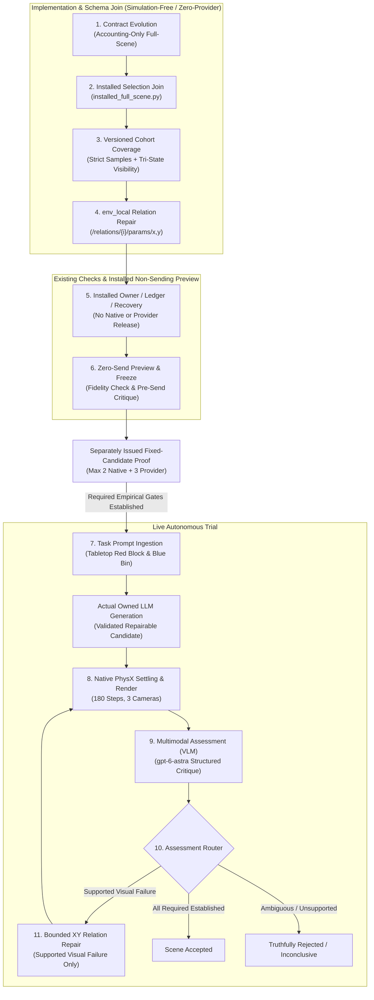

# P04-I03 — Full Live Scene Workflow (Plan 03 V1)

- Document ID: `P04-I03-SCENE-WORKFLOW`
- Created: 2026-09-25
- Last Updated: 2026-09-26
- Status: Proposed — Implementation & Proof Package
- Parent: [Plan 04](../event_mapping/event-mapping-refactoring_plan_04.md)
- Status Owner: [canonical handoff](../dashboard_cli_workflow_parity/research-stack-implementation-handoff.md)
- Prerequisite Status:
  - [P04-I01 (Native Simulation Slice)](01-native-integration-defects.md): **100% VERIFIED & CLOSED**
  - [P04-I02 (Installed Visual Assessment)](02-installed-visual-assessment.md): **INTEGRATION VERIFIED & PARENT-CLOSED**
- Execution Authority: **NOT ISSUED**
- Target Operation: `p04-i03-full-scene-v1`

**Current review and goal source:** [source-backed strategy and four actor–critic goals](03-full-scene-workflow-strategy.md).
The operator selected a separately budgeted fixed-candidate proof before the
generated-scene trial as a planning decision, not execution approval. All four
goals remain unissued. Implementation details here are proposed; source findings
are not resolved merely by being listed. The strategy supplies the current
semantic decisions, actor–critic protocol and issuance gates.

> [!IMPORTANT]
> **Devcontainer Named Volume & Path Invariant:**
> The repository operates inside a devcontainer mounted as a named volume. **Never hardcode absolute filesystem paths or `file:///` URIs in plans or documentation** (e.g. `file:///workspaces/...`). Always use repository-relative links (`../../../../...`) so paths resolve identically across host environments, devcontainers, editor extensions, and Git remotes.

---

## 1. Outcome & Milestone Objectives

The objective of **Stage 3: P04-I03** (Goal D, Plan 03 V1) is to implement and prove the **first fully autonomous, unbroken prompt-to-scene workflow** executed through the installed application's GraphQL interface.

Rather than a simple "preflight, then run" execution recipe, **P04-I03 is an implementation-and-proof package**. It first joins the existing underlying coordinators, workers, and scene-loop machinery into a supported installed configuration, and then executes a bounded empirical trial to prove reliable application ownership from natural-language prompt to sealed scene disposition.

### Core Architecture Invariant
P04-I03 proves **reliable application ownership of the complete trial**, not a guarantee that one XY displacement produces an accepted scene. Positive scene acceptance and live repair loop coverage are explicit, independent obligations.



### What This Work Package Does NOT Certify
- It does **not** execute robot policy trials (Stage 4 / P04-I04: Isaac-GR00T banana pick-and-place pilot).
- It does **not** claim general open-vocabulary scene coverage; it validates the closed-loop autonomous pipeline on the designated benchmark manipulation domain.

---

## 2. Codebase Reality & Proposed Gap Resolutions

A technical review identified the original gaps below. The [follow-up review](03-full-scene-workflow-strategy.md#1-material-findings-remaining-after-the-overview-revision)
identifies additional constraints; no application correction is claimed by this planning document.

| Gap | Source File | Verified Codebase Constraint | Resolution in P04-I03 |
| :--- | :--- | :--- | :--- |
| **1. No Installed Full-Scene Mode** | [`installed_config.py:89`](../../../../isaaclab_arena/agentic_environment_generation/workflow/api/installed_config.py#L89) | Currently admits only `query-only`, `isolated-synthetic-execution-v1`, `retained-native-validation-v1` (schema 4), and `retained-visual-assessment-v1` (schema 5). No full-scene composition exists. | Implement `installed_full_scene.py` and register the new mode `full-scene-execution-v1` under schema_version 6 in `installed_config.py`. |
| **2. Contract Schema Conflicts & Budget Clamps** | [`contracts.py:275, 304–315`](../../../../isaaclab_arena/agentic_environment_generation/workflow/contracts.py#L275)<br>[`service.py:924`](../../../../isaaclab_arena/agentic_environment_generation/workflow/service.py#L924) | Schema 4 is retained-assessment-only; other schemas reject null token/cost caps. Validators hardcode artificial clamps (`< 570s`, `< 600s`), aborting valid long-running trials. | Implement Schema 6 for full-scene execution. Decouple sanity checks from policy: remove arbitrary numerical clamps, support operational profiles (`debug`, `ci`, `benchmark`), and permit accounting-only modes. |
| **3. Evidence Window & Producer Mismatch** | [`evidence_contracts.py:66`](../../../../isaaclab_arena/agentic_environment_generation/workflow/evidence_contracts.py#L66)<br>[`scene_observation.py:23`](../../../../isaaclab_arena/agentic_environment_generation/workflow/scene_observation.py#L23)<br>[`native_capture.py:85, 114`](../../../../isaaclab_arena/agentic_environment_generation/workflow/native_capture.py#L85) | Legacy common-window rule forces camera capture to match settling steps (yielding 15 images instead of 3 terminal snapshots). Evaluators hardcode rigid thresholds (`ge=0.01, le=0.01`) and single subjects. | Decouple continuous physics settling sampling ($t=176..180$) from discrete camera rendering schedules ($t=180$). Parameterize settling velocity thresholds and subject lists in the API contract. |
| **4. Uncertainty $\neq$ Repair & Ternary Logic** | [`scene_loop.py:368`](../../../../isaaclab_arena/agentic_environment_generation/workflow/scene_loop.py#L368)<br>[`scene_observation.py:370`](../../../../isaaclab_arena/agentic_environment_generation/workflow/scene_observation.py#L370) | Evaluator enforces binary booleans (`type(item["visible"]) is bool`). Inconclusive receipts route to `action="observe"` (triggering endless capture relaunches). | Implement Kleene 3-valued logic (`visible`, `not_visible`, `uncertain`). Route `uncertain` to an epistemic stop (`stop(reason="inconclusive_sensing")`). Only confirmed visual failures addressable by the target intervention may trigger repair. |
| **5. Repair Representation Incompatibility** | [`repairs.py:120`](../../../../isaaclab_arena/agentic_environment_generation/workflow/repairs.py#L120) | The repair guard strictly requires `coordinate_frame="env_local"` and paths matching `/relations/{index}/params/x` or `/y`. It rejects world poses and object paths. | The generation prompt must output the canonical Arena scene representation with a structured `relations` list (`is_anchor`, `on`, `at_position`), allowing repair rules to target exact scalar offsets in `env_local`. |
| **6. Benchmark & Physical Semantics** | Evaluators & Registries | Workspace radius is not reachability; visibility is not reachability; physical settling is not collision-free support. | Use the registered DROID / `maple_table_robolab` / `red_block_basic_robolab` / `bin_b03_vomp_robolab` family. Programmatically evaluate reachability via analytical IK and support via PhysX contact manifolds. |
| **7. Reservation Ledger Mismatch & Lifecycle** | [`neo4j_store.py:3553–3623`](../../../../isaaclab_arena/agentic_environment_generation/workflow/neo4j_store.py#L3553-L3623) | Monolithic stage reservations debit cumulative run time without refunds ($6 \times 120\text{s} = 720\text{s} > 600\text{s}$). Risk of leaking headless Isaac Sim CUDA processes. | Implement Two-Phase Reservation / TCC with dynamic headroom reclamation (refunding unused stage seconds) and heartbeated lease supervisors for Isaac Sim processes. |
| **8. Conflation of Acceptance Claims** | Plan 03 V1 ([`event-mapping-refactoring_plan_03.md:251`](../event_mapping/event-mapping-refactoring_plan_03.md#L251)) | Pipeline integration, scene disposition, and repair loop coverage are distinct outcomes. If Candidate 1 passes immediately, the repair loop is unproven. | Decouple closeout into 6 independent, non-overlapping claims. |

---

## 3. Existing Capability vs. Required Implementation Changes

```
┌─────────────────────────────────────────────────────────────────────────────────────────────────┐
│                                   P04-I03 COMPOSITION JOIN                                      │
├───────────────────────────────┬─────────────────────────────────┬───────────────────────────────┤
│ Subsystem                     │ Existing Codebase State         │ Required P04-I03 Change       │
├───────────────────────────────┼─────────────────────────────────┼───────────────────────────────┤
│ API Config                    │ Schema 4 (native-only) and      │ Schema 6: full-scene-         │
│ (installed_config.py)         │ Schema 5 (assessment-only)      │ execution-v1 wired to all     │
│                               │ wired to isolated handlers.     │ 4 worker roles.               │
├───────────────────────────────┼─────────────────────────────────┼───────────────────────────────┤
│ Contract Validation           │ Schema 4 enforces retained-     │ Schema 6: permits new source, │
│ (contracts.py)                │ only; others require token /    │ model dispatches, runtime,    │
│                               │ monetary cost audits; clamps.   │ dynamic budgets, and profiles.│
├───────────────────────────────┼─────────────────────────────────┼───────────────────────────────┤
│ Evidence Criteria             │ Legacy common-window, rigid     │ Decoupled render schedule,    │
│ (evidence_contracts.py,       │ 0.01 m/s clamps, single subject,│ parameterized thresholds, and │
│  native_capture.py)           │ and boolean visual logic.       │ complete ternary perception.  │
├───────────────────────────────┼─────────────────────────────────┼───────────────────────────────┤
│ Scene Generation Output       │ ArenaEnvGraphSpec validation;   │ Validate selected ordering,   │
│ (scene_engines.py)            │ repair shape not guaranteed.    │ identities and scalar paths.  │
├───────────────────────────────┼─────────────────────────────────┼───────────────────────────────┤
│ Repair Adapter & Oracles      │ Rejects world coordinates;      │ Targets env_local scalar x,y; │
│ (repairs.py, simulation)      │ speculative LLM diagnosis.      │ pre-simulation causal oracles.│
├───────────────────────────────┼─────────────────────────────────┼───────────────────────────────┤
│ Execution Owner & Leases      │ Handles isolated single-worker  │ Sequential owner coordination,│
│ (execution_owner.py, neo4j)   │ lifecycle; no budget refund.    │ GPU lease TTL, and TCC refund.│
└───────────────────────────────┴─────────────────────────────────┴───────────────────────────────┘
```

---

## 3.1 Architectural Deep Dive & Feasibility Blueprint

This blueprint outlines the six strategic design principles that transform P04-I03 from a single brittle test harness into a robust, general-purpose physical AI environment generation pipeline:

### 1. Dynamic Settling Semantics in API Contracts
- **Limitation**: Hardcoded static constants (`SUPPORT_THRESHOLDS` in [`scene_observation.py:31`](../../../../isaaclab_arena/agentic_environment_generation/workflow/scene_observation.py#L31) and `ge=0.01, le=0.01` in [`native_capture.py:77`](../../../../isaaclab_arena/agentic_environment_generation/workflow/native_capture.py#L77)) prevent the platform from adapting to different physical domains.
- **Architectural Solution**: Parameterize settling thresholds inside the API contract's `Criterion` definition. Expose `linear_velocity_threshold_m_per_s`, `angular_velocity_threshold_rad_per_s`, `min_consecutive_settled_steps`, and dynamic `subjects: tuple[Identifier, ...]`.
- **Generalist Feasibility**: Enables empirical parameter exploration (e.g., $0.05$, $0.01$, $0.001\text{ m/s}$) across varying asset categories—from heavy high-friction blocks to rolling spheres, articulated tools, and deformable cables—without modifying engine source code.

### 2. Ternary Perception Pipeline & Multi-Camera Kleene Algebra
- **Limitation**: Binary boolean logic (`true`/`false`) forces an epistemic dilemma when camera views are ambiguous, while legacy routing converts `uncertain` into an expensive re-capture loop.
- **Architectural Solution**: Formally implement Kleene 3-valued logic (`visible`, `not_visible`, `uncertain`):
  - **Ontic vs. Epistemic Disentanglement**: `not_visible` indicates a physical geometry defect (candidate-repairable). `uncertain` indicates an epistemic sensing limitation (low resolution, glare, or camera lens blocked by the robot's own arm). Moving the object in response to epistemic uncertainty wastes compute and degrades scene validity.
  - **Multi-Camera Fusion**: $\text{visible} \lor \text{uncertain} = \text{visible}$; $\text{not\_visible} \land \text{uncertain} = \text{not\_visible}$.
  - **End-to-End Codec**: Propagated across all four operational layers:
    1. *Installed Worker* ([`split_scene_ports.py`](../../../../isaaclab_arena/agentic_environment_generation/workflow/split_scene_ports.py)): VLM prompt formatting and structured tri-state JSON parsing.
    2. *Retention Layer* ([`scene_evidence_artifacts.py`](../../../../isaaclab_arena/agentic_environment_generation/workflow/scene_evidence_artifacts.py)): Storing raw response bytes and structured tri-state verdicts.
    3. *Evidence Projection* ([`scene_observation.py`](../../../../isaaclab_arena/agentic_environment_generation/workflow/scene_observation.py)): Mapping `visible` $\to$ `established`, `not_visible` $\to$ `violated`, `uncertain` $\to$ `inconclusive`.
    4. *Router* ([`scene_loop.py`](../../../../isaaclab_arena/agentic_environment_generation/workflow/scene_loop.py)): Mapping `uncertain` to an epistemic stop (`stop(reason="inconclusive_sensing")`), preventing illegal repairs or runaway simulation loops.

### 3. Decoupled Observation & Camera Rendering Schedules
- **Limitation**: [`native_capture.py:114`](../../../../isaaclab_arena/agentic_environment_generation/workflow/native_capture.py#L114) coupled camera rendering to settling steps, rendering 3 cameras $\times$ 5 steps = 15 images ($>2\text{ MB}$ payload and $\approx 15,000$ VLM tokens).
- **Architectural Solution**: Decouple high-frequency temporal physics sampling ($t=176..180$) from discrete camera sensor rendering ($t=180$). Expose distinct schedules in [`contracts.py`](../../../../isaaclab_arena/agentic_environment_generation/workflow/contracts.py):
  - `physics_sampling_window`: `{"start_step": 176, "end_step": 180}`
  - `camera_capture_schedule`: `{"render_steps": [180], "camera_keys": ["external_camera_rgb", "external_camera_2_rgb", "wrist_camera_rgb"]}`
- **Feasibility**: Reduces rendering time by 80% and cuts VLM token consumption from $\approx 15,000$ to $\approx 3,000$ tokens per evaluation.

### 4. Lifecycle, Leased GPU Execution & Two-Phase Dynamic Reservations
- **Limitation**: Static stage reservations ($6 \times 120\text{s} = 720\text{s}$) exhaust the cumulative 600s budget without refunds ([`neo4j_store.py:3553`](../../../../isaaclab_arena/agentic_environment_generation/workflow/neo4j_store.py#L3553)), and crashes risk leaving orphaned Isaac Sim CUDA processes.
- **Architectural Solution**:
  - **Two-Phase Reservation / TCC (Try-Confirm-Cancel)**: Stages acquire temporary lease reservations. Upon completion, actual execution time is committed, and unused reservation headroom is refunded to the shared run budget.
  - **Durable Finite State Machine (Saga with Checkpoints)**: Journal state transitions (`Pending` $\to$ `Generating` $\to$ `Simulating` $\to$ `Assessing` $\to$ `Repairing` $\to$ `Completed`) with idempotency keys in Neo4j/SQL, enabling clean recovery on container drops without restarting from step 0.
  - **Principle of Least Privilege**: `PlannerRole` (LLM tokens, zero GPU), `SimulatorRole` (leased Isaac Sim slot, zero LLM secrets), `EvaluatorRole` (read-only state inspection).
  - **Leased GPU Lifecycle**: Manage headless Isaac Sim (Kit) processes with a heartbeated supervisor and TTL to prevent orphaned CUDA processes.

### 5. Programmatic Causal Justification in Physical Simulation
- **Limitation**: Speculative LLM commentary diagnoses failures without physical verification, and repairs are executed without proving that moving the object cures the defect.
- **Architectural Solution**: In physical robotics simulation, the environment is a deterministic, glass-box oracle (USD + PhysX + RTX). Causality is computed programmatically:
  1. *Line-of-Sight (LOS) & Raycast Frustum Oracle*: Cast PhysX rays from camera optical centers to target 3D bounding box vertices. Intersections with intervening meshes yield deterministic causal output: `CausalFailure(type="OCCLUSION", occluder="bin_b03", occlusion_percentage=0.82)`.
  2. *Contact Graph & Normal Support Oracle*: Inspect PhysX contact manifold points and normal vectors. Non-vertical normals or center-of-mass falling outside the contact polygon yield: `CausalFailure(type="UNSTABLE_SUPPORT", root_cause="LEANING_ON_RIM")`.
  3. *Kinematic Reachability Oracle*: Analytical inverse kinematics (IK) from robot base to target grasp pose: `CausalFailure(type="UNREACHABLE", distance_m=0.94, reach_limit_m=0.85)`.
  4. *Pre-Simulation Counterfactual Repair Filter*: The geometric oracle tests candidate repair coordinates $(\Delta x, \Delta y)$ in 2ms: *Does $(x+\Delta x, y+\Delta y)$ clear the container's occlusion shadow cone?* If not, reject immediately before launching Isaac Sim, saving significant GPU cycles.

### 6. Dynamic Budgeting & Operational Profiles
- **Limitation**: Hardcoded validator clamps in [`contracts.py:304–306`](../../../../isaaclab_arena/agentic_environment_generation/workflow/contracts.py#L304-L306) (`max_runtime_seconds > 570`, `total_deadline_seconds > 600`) prematurely abort legitimate development and testing runs.
- **Architectural Solution**:
  - Decouple logical sanity validation (`per_operation_timeout <= total_deadline`) from policy limits.
  - Support operational profiles in API contracts:
    - `Development / Debug Profile`: `total_deadline_seconds = 3600`, `per_operation_timeout_seconds = 600`, accounting-only (accommodates step-through debugging, profilers, and cold-start shader compilation).
    - `CI / Regression Profile`: Fast fail-fast timeouts (e.g., 300s).
    - `Production / Autonomous Benchmark`: Strict SLA boundaries.
  - Dynamically reclaim unused reservation headroom so downstream stages are not prematurely throttled.

---

## 4. The 6 Independent Acceptance Claim Dimensions

P04-I03 requires reporting all six dimensions, including blocked, inconclusive or
unexercised results. Reporting them does not imply all six passed or certify V1.

1. **Claim 1: Installed Pipeline Integration**
   - The installed GraphQL API, application supervisor, and worker dispatchers executed the joined multi-stage workflow from start to finish without manual intervention or out-of-band scripts.
2. **Claim 2: Physical Settling & Numeric Truth**
   - Candidate realized in Isaac Sim PhysX on the Blackwell GPU for 180 control steps; final 5-step velocities met settling bounds ($<0.001\text{ m/s}$ linear, $<0.01\text{ rad/s}$ angular); 3 camera PNGs rendered and hashed.
3. **Claim 3: Visual Assessment Fidelity**
   - `gpt-6-astra` evaluated all camera frames under the frozen visibility rubric, producing complete per-subject `visible`, `not_visible`, or `uncertain` answers. `not_visible` does not establish occlusion as the cause.
4. **Claim 4: Repair Branch Status & Coverage**
   - *If Candidate 1 passed immediately*: Report *unexercised* (non-repair path proven; repair loop remains unproven).
   - *If Candidate 1 had a supported visual failure*: Report *attempted* until bounded $\le 0.25\text{ m}$ `env_local` repair, effective native displacement, fresh settling, reassessment and cleanup are all witnessed; only then report the branch *exercised*.
   - *If Candidate 1 was inconclusive/uncertain*: Report *uncertainty preserved* (no illegal repair triggered).
5. **Claim 5: Truthful Scene Disposition**
   - Report scientific scene disposition separately from the actual workflow lifecycle state. A nonaccepted/inconclusive scene is not an invented database state; infrastructure failures are never relabeled as scene rejections.
6. **Claim 6: Idempotent Readback, Replay & Provable Cleanup**
   - Fresh-client readback recovers exact candidate and evidence bytes; no-effect replay returns identical receipts with 0 additional calls; worker processes absent, owner retired clean, leases released, API drained.

---

## 5. Multi-Phase Implementation & Proof Plan

```
Phase 1: Invariant & Specification Alignment
Phase 2: Contract Schema & Accounting Extension (contracts.py)
Phase 3: Evidence & Observation Projection Alignment (evidence_contracts.py, native_capture.py)
Phase 4: Scene Representation & Repair Adapter Mapping (repairs.py, scene_loop.py)
Phase 5: Installed Full-Scene Composition Join (installed_config.py, installed_full_scene.py)
Phase 6: Installed Non-Sending Inspection, Existing Checks & Recovery Readiness
Phase 7: Separately Issued Fixed-Candidate Empirical Proof & Final Trial Freeze
Phase 8: Autonomous Live Execution (Gate B)
Phase 9: Readback, Replay, Provable Cleanup & Disposition Certification (Gate C)
```

### Phase 1: Invariant & Specification Alignment
- Freeze the real registered benchmark, subject/asset mappings, hold/reset policy and required metadata sources. The earlier guessed dimensions are not verified inputs.
- Freeze coordinate frame: relation placement parameters `/relations/{index}/params/x` and `/y` in `env_local`.
- Declare uncertainty policy: a complete inconclusive result stops this bounded case without another capture or send. Repair requires a confirmed visual failure addressable by the permitted target and established nonvisual prerequisites.
- Reconcile reservation ledger: stage-level timeouts budgeted to prevent ledger exhaustion under `b.max_runtime_seconds`.

### Phase 2: Contract Schema & Accounting-Only Extension
- In [`contracts.py`](../../../../isaaclab_arena/agentic_environment_generation/workflow/contracts.py):
  - Add Schema 6 (Full-Scene Accounting-Only Contract).
  - Select `source.kind == "new"` for the main trial and an exact `existing` source for the separately budgeted fixed-candidate proof.
  - Allow `generation_model`, `assessment_model`, `runtime`, and `allowed_interventions`.
  - Validate `effects.allow_operational_writes == True` and `effects.allow_runtime == True`.
  - Validate accounting-only limits (`max_model_calls <= 4`, `max_candidates <= 2`, `max_revisions <= 1`, `max_realizations <= 2`).
  - Exercise actual decoders and affected existing checks; minimal pure protocol regressions may be added within existing modules, not a new mock framework.

### Phase 3: Evidence & Observation Projection Alignment
- In [`evidence_contracts.py`](../../../../isaaclab_arena/agentic_environment_generation/workflow/evidence_contracts.py) and [`scene_observation.py`](../../../../isaaclab_arena/agentic_environment_generation/workflow/scene_observation.py):
  - Preserve numeric samples 176–180 and exactly three camera images at step 180. Bind both coverages to the same realization/reset through a versioned protocol, not a global relaxation of old window checks.
  - Preserve strict settling limits and complete two-subject tri-state visibility. Existing evaluator v1 is not an equivalent substitute.
  - Exercise producer, projection and fresh-reader semantics together; a passing DTO check alone is insufficient.

### Phase 4: Scene Representation & Repair Adapter Mapping
- In [`repairs.py`](../../../../isaaclab_arena/agentic_environment_generation/workflow/repairs.py) and generation prompting:
  - Formulate generation schema grammar to output canonical Arena relations: `is_anchor`, `on`, and `at_position` with scalar `x, y` parameters.
  - Bind repair rules to `/relations/{index}/params/x` and `/relations/{index}/params/y` with `coordinate_frame="env_local"` and Euclidean ceiling $\le 0.25\text{ m}$.
  - Check exact relation/subject binding before effects and effective realized displacement after repair; reuse the existing repair checks and permission envelope.

### Phase 5: Installed Full-Scene Composition Join
- In [`installed_config.py`](../../../../isaaclab_arena/agentic_environment_generation/workflow/api/installed_config.py):
  - Add schema_version 6 mode: `"full-scene-execution-v1"`.
  - Validate role bindings across generation, assessment, repair, and operational DB.
- Create `workflow/api/installed_full_scene.py` as the proposed installed factory; it does not exist yet:
  - Reuse `InitialGenerationWorker` / `InitialGenerationReceiver`, split native/model adapters and the existing owner/coordinator. Select numeric-only versus model assessment explicitly; do not insert unbudgeted worker stages.
  - Enforce concurrency invariant: release `NativeGpuLease` before model dispatch; terminate model workers before native re-acquisition.
  - Include server/CLI dispatch, private role/setup/readiness, both source variants, cancellation, duplicate cleanup, post-crash recovery, handover and fresh-client readers. Preserve the scope owner between stages.

### Phase 6: Installed Non-Sending Boundary & Existing Checks
- Exercise supported installed parsing, authenticated inspection, preview and lifecycle paths in the explicitly approved operational scope, with sends and native releases denied.
- Reuse affected existing simulation-free checks. No new mock end-to-end loop, simulator/provider fixtures, proof harnesses or synthetic matrices.
- Verify concrete role/count/runtime reservations and actual serializer/RequestEnvelope coverage. State which child/native boundaries remain unexercised.
- Confirm scoped database-write authority for setup or DB-mutating checks; zero-provider does not mean zero-database-effects.

### Phase 7: Fixed-Candidate Empirical Proof & Trial Freeze
- After separate G3 issuance, exercise the same installed composition with a frozen existing candidate: at most 2 native launches, 1 repair send and 2 assessment sends, with no initial generation.
- Establish required native/sensing/mapping observations and conditional repair coverage; report uncertainty and unexercised branches without forcing a verdict.
- Freeze exact final G4 inputs/profiles/source and adequate numeric stage/cleanup reservations. A downstream generated candidate/image request is bound at its actual application stage, not invented in preflight.
- Run the scoped checks and obtain a fresh read-only pre-send critic for each live case. Recheck effective authentication, approval and role-grant runway at actual admission after critique, not only when configuration was authored.

### Phase 8: Autonomous Live Execution (Gate B)
- Submit single GraphQL mutation `submitWorkflow` to running API server.
- Application supervisor autonomously drives: Generation $\to$ Settling (180 steps) $\to$ Capture $\to$ Visual Assessment $\to$ Conditional Repair.
- Cumulative envelope strictly enforced: max 2 native launches, max 4 provider calls, max 1,200s deadline.

### Phase 9: Readback, Replay, Provable Cleanup & Disposition Certification (Gate C)
- Fresh client cryptographic readback of causal graph.
- Replay verification: identical result with 0 additional provider or native calls.
- Provable cleanup: worker PIDs absent, owner retired clean (`dirty=False`), leases released, API drained.
- Final independent critique review (`ACCEPT`).
- Certification of the 6 independent claims.

---

## 6. Cumulative Budget & Resource Envelope

These are **proposed, separately issued case ceilings**, not active allocations.
The operator selected the separate fixed-candidate proof during planning.

| Case | Native launches | Initial generation sends | Repair sends | Assessment sends | Provider total |
| --- | --- | --- | --- | --- | --- |
| G3 fixed-candidate proof | 2 | 0 | 1 | 2 | 3 |
| G4 generated-scene trial | 2 | 1 | 1 | 2 | 4 |
| Combined proposal if both goals are issued | 4 | 1 | 2 | 4 | 7 |

Unused allowance is not transferable or renewed by a restart/reissued goal.
The following table describes **G4 only**; see the strategy for G3 and shared rules.

| Resource / Envelope | Cumulative Ceiling | Rationale |
| :--- | :---: | :--- |
| **Native PhysX Launches** | **Max 2 launches** | 1 for candidate 1 settling + max 1 for repaired candidate 2 settling. |
| **LLM Generation Calls** | **Max 1 provider call** | Initial scene graph generation from natural language prompt. |
| **LLM Scene Repair Calls** | **Max 1 provider call** | Triggered only on confirmed `supported_visual_failure`. |
| **VLM Assessment Calls** | **Max 2 provider calls** | 1 for candidate 1 evaluation + max 1 for repaired candidate 2 evaluation. |
| **Total Provider Dispatches** | **Max 4 dispatches** | Hard ceiling across generation, repair, and visual critiques. |
| **Per-Substage Timeout** | **Unresolved until exact selection** | Derive adequate numeric stage and cleanup allowances from the actual composition and retained timing evidence; no guessed 90–120s range. |
| **Total Operation Deadline** | **1,200 seconds (20 min)**| End-to-end operation window from admission to API drain. |
| **Concurrency Invariant** | **Strictly 1 worker** | GPU simulation worker lease released and clean before model worker launch; model worker terminated before native re-acquisition. |

No live issuance is ready until the runtime reservation sum and final
readback/drain headroom fit the selected case's 1,200s deadline. Failed/uncertain
dispatches and native releases count; reservations are preserved. No provider
retries, hidden pings/fallbacks or same-candidate recaptures. Accounting-only means
usage/cost reporting without preset monetary/aggregate-token vetoes, not absent
technical request/completion limits.

---

## 7. Staged Goal Prompts for Operator Issuance

The three earlier sketches are superseded by **four independently issuable,
unissued actor–critic goals** detailed in the [strategy](03-full-scene-workflow-strategy.md#5-proposed-goal-prompts):

1. **[I03-G1 — Parameterized general contracts, evidence semantics, and budget policies](03-full-scene-workflow-strategy.md#i03-g1-parameterized-general-contracts-evidence-semantics-and-budget-policies)**:
   - **Scope**: Simulation-free, provider-free foundation and pure unit regressions.
   - **Key Deliverables**:
     - Implement Schema 6 (`schema_version: "6"`) in [`contracts.py`](../../../../isaaclab_arena/agentic_environment_generation/workflow/contracts.py) supporting both `NewSource` generation and `ExistingSource` fixed-candidate verification.
     - Parameterize `settled-v2` criteria with typed linear/angular velocity thresholds, operators, multi-subject tuples, and consecutive step requirements.
     - Decouple camera frame rendering schedules (`step: 180`) from physics state observation windows (`start_step: 176, end_step: 180`).
     - Relax artificial validator clamps in [`contracts.py`](../../../../isaaclab_arena/agentic_environment_generation/workflow/contracts.py) (lines 304–306, 311–317) and [`native_capture.py`](../../../../isaaclab_arena/agentic_environment_generation/workflow/native_capture.py) (lines 66, 77–79).
     - Implement raw measurement retention and first-class Kleene ternary logic algebra (`TRUE`, `FALSE`, `UNKNOWN`) in [`scene_observation.py`](../../../../isaaclab_arena/agentic_environment_generation/workflow/scene_observation.py).
     - Add pure unit regressions in existing test modules without Kit or network dependencies.
   - **Effects**: Zero provider dispatches, zero Kit/native launches, zero API service starts, zero database I/O.

2. **[I03-G2 — Coherent installed execution, authority, lifecycle, and dynamic policy handling](03-full-scene-workflow-strategy.md#i03-g2-coherent-installed-execution-authority-lifecycle-and-dynamic-policy-handling)**:
   - **Scope**: Installed composition joining, execution owner lifecycle, admission edge-case inspection, and non-sending preview.
   - **Key Deliverables**:
     - Define `InstalledFullSceneConfig` and `FullScenePorts` in [`installed_config.py`](../../../../isaaclab_arena/agentic_environment_generation/workflow/api/installed_config.py), joining coordinator, `InitialGenerationWorker`, `SplitScenePorts`, visual assessment, and `SceneRefiner`.
     - Inspect admission edge cases in `submitWorkflow` ([`service.py`](../../../../isaaclab_arena/agentic_environment_generation/workflow/service.py)), verifying Schema 6 admission under `allow_operational_writes=true`.
     - Implement long-running execution owner lifecycle (Google AIP-151) with durable operation IDs and AWS-style idempotent admission returning prior receipts on replay.
     - Enforce clean separation of Intent, Capability, and Authority; implement Google AIP-154 concurrency-safe dynamic budget amendments with ETag checks.
     - Implement Kubernetes finalizer verified cleanup before GPU lease release, and Temporal heartbeat liveness supervision.
     - Authorize private binding of generation, assessment, and repair roles from environment `OPENAI_API_KEY`.
     - Freeze the exact fixed-candidate G3 selection artifact and digest.
   - **Effects**: Approved application/Neo4j setup only; zero provider sends, zero Kit/native releases.

3. **[I03-G3 — Configurable measurement and programmatic causal-intervention proof](03-full-scene-workflow-strategy.md#i03-g3-configurable-measurement-and-programmatic-causal-intervention-proof)**:
   - **Scope**: Fixed-candidate empirical proof on `p04-i03-fixed-scene-proof-v1`.
   - **Key Deliverables**:
     - Execute the 6-step programmatic causal justification protocol using Omniverse Replicator annotators and Isaac Lab contact sensors.
     - Use simulator ground truth as a labelled diagnostic oracle (isolated from policy inputs).
     - Complete Kleene ternary assessment of both subjects across all step-180 cameras.
     - Conditional single repair only on confirmed `supported_visual_failure`, verifying physical displacement in simulation.
     - Exact causal readback, idempotent replay, verified cleanup, and GPU lease release.
   - **Effects**: At most 2 native launches, 3 provider sends (0 initial generation, at most 1 repair, 2 assessments).

4. **[I03-G4 — Generated-scene integration through the configurable composition](03-full-scene-workflow-strategy.md#i03-g4-generated-scene-integration-through-the-configurable-composition)**:
   - **Scope**: Full prompt-driven generated-scene trial on `p04-i03-full-scene-v1`.
   - **Key Deliverables**:
     - Application-owned execution: generation $\to$ candidate validation $\to$ native realization/settling $\to$ Kleene ternary visual assessment $\to$ conditional permitted repair $\to$ re-realization $\to$ reassessment $\to$ disposition.
     - Exact causal readback, idempotent replay, verified worker cleanup, GPU and scope lease release, API drain.
     - Complete Post-Execution Closeout Report across all six acceptance claims and resource consumption ledger.
   - **Effects**: At most 2 native launches, 4 provider sends (at most 1 initial generation, 1 repair, 2 assessments).

Each incorporates [AC-I03](03-full-scene-workflow-strategy.md#4-shared-actorcritic-protocol-ac-i03): parent sole writer/operator, one independent read-only critic at a time,
material cited blockers, bounded hypothesis/correction loops, meaningful
pre-boundary/final checkpoints, and parent-only acceptance. A critic does not
grant authority or certify an unobserved native outcome. Only the explicitly
issued goal is active; do not execute the next goal automatically.

---

## 8. Appendix: Illustrative Target Contract JSON (Modernized Blueprint)

> [!NOTE]
> The JSON below illustrates the **modernized Schema 6 contract design**, incorporating dynamic settling thresholds, decoupled camera snapshot schedules, ternary visual rubrics, and dynamic budget profiles. Adding Schema 6 requires implementing the corresponding decoders, evaluators, and oracles before a live goal is issued.

```json
{
  "schema_version": "6",
  "source": {
    "kind": "new",
    "prompt": "Generate a tabletop manipulation scene with a red block and a blue bin within reach of the robot workspace, where the red block is clearly visible to external and wrist cameras."
  },
  "criteria": [
    {
      "criterion_id": "crit_settled",
      "kind": "runtime",
      "evidence_producer": "scene.settled",
      "requirement": "required",
      "evaluator_version": "settled-v2",
      "required_modalities": ["state"],
      "coordinate_frames": ["world"],
      "observation_window": {"start_step": 176, "end_step": 180},
      "rubric": "linear speed < 0.001 m/s and angular speed < 0.01 rad/s across final 5 steps",
      "subjects": ["red_block", "blue_bin"],
      "limit": {
        "operator": "le",
        "linear_velocity_threshold_m_per_s": 0.001,
        "angular_velocity_threshold_rad_per_s": 0.01,
        "min_consecutive_settled_steps": 5
      }
    },
    {
      "criterion_id": "crit_visible",
      "kind": "visual",
      "evidence_producer": "scene.visible",
      "requirement": "required",
      "evaluator_version": "visibility-v2",
      "required_modalities": ["rgb"],
      "coordinate_frames": ["external_camera_rgb", "external_camera_2_rgb", "wrist_camera_rgb"],
      "observation_window": {"start_step": 180, "end_step": 180},
      "rubric": "per-camera per-subject ternary assessment (visible, not_visible, uncertain)",
      "subjects": ["red_block", "blue_bin"],
      "limit": {
        "operator": "eq",
        "expected_verdict": "visible"
      }
    }
  ],
  "preserved": [
    {
      "subject_id": "table",
      "schema_path": "/background",
      "mode": "frozen",
      "description": "Table geometry, pose and dimensions are immutable."
    }
  ],
  "allowed_interventions": [
    {
      "subject_id": "red_block",
      "schema_path": "/relations/2/params/x",
      "operation": "replace",
      "coordinate_frame": "env_local",
      "units": "m",
      "max_total_displacement_m": 0.25,
      "description": "Permit bounded X placement repair in table-local frame if supported visual failure occurs."
    },
    {
      "subject_id": "red_block",
      "schema_path": "/relations/2/params/y",
      "operation": "replace",
      "coordinate_frame": "env_local",
      "units": "m",
      "max_total_displacement_m": 0.25,
      "description": "Permit bounded Y placement repair in table-local frame if supported visual failure occurs."
    }
  ],
  "execution": {
    "generation_model": {
      "profile_id": "p04-i03-gpt6-astra-generation",
      "settings_sha256": "RESOLVED_IN_PHASE_7",
      "billing": "paid"
    },
    "assessment_model": {
      "profile_id": "p04-i03-gpt6-astra-visibility",
      "settings_sha256": "RESOLVED_IN_PHASE_7",
      "billing": "paid"
    },
    "runtime": {
      "profile_id": "p04-isaacsim-blackwell-physx",
      "settings_sha256": "RESOLVED_IN_PHASE_7"
    },
    "database": {
      "profile_id": "p04-neo4j-production",
      "settings_sha256": "RESOLVED_IN_PHASE_7"
    },
    "policy": null,
    "capture": {
      "profile_id": "p04-multi-camera-cohort",
      "settings_sha256": "RESOLVED_IN_PHASE_7"
    },
    "seed": 42,
    "timestep_seconds": 0.005,
    "decimation": 4,
    "dcrg": null
  },
  "budget": {
    "profile": "development_debug",
    "max_candidates": 2,
    "max_revisions": 1,
    "max_runtime_seconds": 1200.0,
    "max_model_calls": 4,
    "max_model_tokens": null,
    "max_cost_usd": null,
    "max_realizations": 2,
    "max_steps": 360,
    "max_observations": 4,
    "max_policy_episodes": 0,
    "max_policy_steps": 0,
    "per_operation_timeout_seconds": 300.0,
    "total_deadline_seconds": 1200.0
  },
  "effects": {
    "allow_paid_models": true,
    "allow_runtime": true,
    "allow_database_reads": true,
    "allow_publication": false,
    "allow_dcrg": false,
    "allow_operational_writes": true
  }
}
```

---

## 9. Closeout Template (Post-Execution)

```markdown
### P04-I03 Stage Closeout Report

- **Case / Operation ID**: `[G3: p04-i03-fixed-scene-proof-v1 / G4: p04-i03-full-scene-v1]`
- **Run ID**: `[Recorded at admission]`
- **Submission Admitted At**: `[Timestamp]`
- **Completed At**: `[Timestamp]`

#### Six Independent Acceptance Claims:
1. **Claim 1 (Installed Pipeline Integration)**: `[VERIFIED / FAILED / BLOCKED / NOT_EXERCISED]` (Name the actual source path exercised)
2. **Claim 2 (Physical Settling & Numeric Truth)**: `[VERIFIED / FAILED / INCONCLUSIVE / NOT_EXERCISED]` (Exact windows, limits and image coverage)
3. **Claim 3 (Visual Assessment Fidelity)**: `[VERIFIED / FAILED / NOT_EXERCISED]` (Complete structured review; verdict separate)
4. **Claim 4 (Repair Branch Status & Coverage)**: `[VERIFIED / ATTEMPTED_BUT_FAILED / UNEXERCISED / UNCERTAINTY_PRESERVED]`
5. **Claim 5 (Truthful Scene Disposition)**: `[ACCEPTED / NONACCEPTED / INCONCLUSIVE / NOT_ASSESSED]` (Separate actual workflow state/reason)
6. **Claim 6 (Idempotent Readback, Replay & Provable Cleanup)**: `[VERIFIED / FAILED / UNKNOWN / NOT_EXERCISED]` (Report physical, durable and API outcomes separately)

#### Resource Consumption Ledger:
- **Native PhysX Launches**: `[Consumed / 2]`
- **Provider Dispatches**: `[Consumed / selected G3=3 or G4=4]` (Initial generation: X, Assessment: Y, Repair: Z)
- **Token Usage**: `[Prompt Tokens / Completion Tokens]`
- **Elapsed Real Time**: `[Seconds <= 1,200s]`
- **Durable Owner Status**: `[Retired, dirty=False]`
- **Leases**: `[All released]`
- **Final Critic Decision**: `[ACCEPT / BLOCKED]`
- **Remaining Parent-Plan Obligations**: `[Repair witness / positive scene / calibration / other unproven criteria]`
```

---

## 10. Architectural References

- [1] **Google AIP-151**: Long-running Operations (https://google.aip.dev/151)
- [2] **AWS Architecture Center**: Making retries safe with idempotent APIs (https://aws.amazon.com/builders-library/making-retries-safe-with-idempotent-APIs)
- [4] **Temporal Documentation**: Long-running Activity Execution and Heartbeating (https://docs.temporal.io/design-patterns/long-running-activity)
- [6] **Kubernetes Concepts**: Working with Finalizers for Verified Resource Teardown (https://kubernetes.io/docs/concepts/overview/working-with-objects/finalizers)
- [12] **DoWhy / EconML**: Causal Inference and Counterfactual Intervention Analysis (https://pywhy.org/dowhy/v0.11/example_notebooks/tutorial-causalinference-machinelearning-using-dowhy-econml.html)
- [14] **OpenTelemetry Specification**: Context Propagation and Distributed Tracing (https://opentelemetry.io/docs/concepts/context-propagation)
- [16] **Google AIP-154**: Resource-version and ETag Concurrency Controls (https://google.aip.dev/154)
- [17] **PostgreSQL Documentation**: Three-Valued Logic Algebra (https://www.postgresql.org/docs/current/functions-logical.html)
- [18] **NVIDIA Omniverse Replicator**: Core Annotators and Synthetic Data Generation (https://docs.omniverse.nvidia.com/py/replicator/1.11.16/source/extensions/omni.replicator.core/docs/annotators_details.html)
- [20] **NVIDIA Isaac Lab Documentation**: Contact Sensors and Simulation Physics (https://isaac-sim.github.io/IsaacLab/main/source/overview/core-concepts/sensors/contact_sensor.html)
- [21] **NVIDIA Isaac Lab Documentation**: Simulation Reproducibility and Determinism (https://isaac-sim.github.io/IsaacLab/main/source/features/reproducibility.html)
