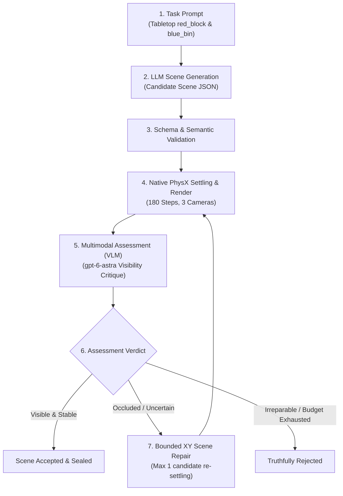

# P04-I03 — Full Live Scene Workflow (Plan 03 V1)

- Document ID: `P04-I03-SCENE-WORKFLOW`
- Created: 2026-09-25
- Status: Proposed — Scaffolding & Specification
- Parent: [Plan 04](../event_mapping/event-mapping-refactoring_plan_04.md)
- Status Owner: [canonical handoff](../dashboard_cli_workflow_parity/research-stack-implementation-handoff.md)
- Prerequisite Status:
  - [P04-I01 (Native Simulation Slice)](01-native-integration-defects.md): **100% VERIFIED & CLOSED**
  - [P04-I02 (Installed Visual Assessment)](02-installed-visual-assessment.md): **INTEGRATION VERIFIED & PARENT-CLOSED**
- Execution Authority: **NOT ISSUED**
- Target Operation: `p04-i03-full-scene-v1`

---

## 1. Outcome & Milestone Objectives

The objective of **Stage 3: P04-I03** (Goal D, Plan 03 V1) is to prove the **first fully autonomous, unbroken prompt-to-scene workflow** executed through the installed application's GraphQL interface.

A single top-level GraphQL submission must autonomously orchestrate the entire scene generation lifecycle without human intervention or manual stage-chaining:
1. **Prompt Ingestion & LLM Scene Generation**: Synthesize a candidate 3D scene specification from a natural-language task prompt.
2. **Schema & Semantic Validation**: Verify structural integrity, asset bounds, and collision non-overlap.
3. **Native Physical Settling & Multi-Camera Capture**: Realize the scene in Isaac Sim (PhysX) on the Blackwell GPU for 180 control steps; verify velocity stabilization; render 3 camera angles (`external_camera_rgb`, `external_camera_2_rgb`, `wrist_camera_rgb`).
4. **Multimodal Visual Assessment (VLM)**: Evaluate object visibility, reachability, and occlusion using `gpt-6-astra`.
5. **Autonomous Bounded Repair (Closed Loop)**: If the visual verdict indicates occlusion or uncertainty (the exact failure mode observed in P04-I02), autonomously trigger a bounded XY pose repair (max displacement $\le 0.25\text{ m}$), re-settle in PhysX, re-render, and re-assess.
6. **Truthful Scene Disposition**: Reach a definitive, evidence-backed terminal state (`accepted` or truthfully `rejected`), sealed in Neo4j with exact cryptographic provenance.



### What This Work Package Does NOT Certify
- It does **not** execute robot policy trials (Stage 4 / P04-I04: Isaac-GR00T banana pick-and-place pilot).
- It does **not** claim general open-vocabulary scene coverage; it validates the closed-loop autonomous pipeline on the designated benchmark manipulation domain.

---

## 2. Starting Point, Context & Milestone 1 Completion Notes

Stage 3 builds directly upon the foundational infrastructure hardened and parent-closed across Milestone 1:

### 2.1 Completion Notes from Stage 1 (`P04-I01`)
- **Native Simulation Engine**: Proved real PhysX execution inside the local devcontainer (`isaaclab_arena-latest` on Blackwell GPU).
- **Physical Settling Standards**: Established the 180-step settling protocol with strict final 5-sample velocity thresholds ($<0.001\text{ m/s}$ linear, $<0.01\text{ rad/s}$ angular) on candidate `a5`.
- **Camera Cohort**: Verified 3-camera rendering at step 180 (`external_camera_rgb`, `external_camera_2_rgb`, `wrist_camera_rgb`).
- **Accounting Boundary**: Preserved the consumption of all 5 initial native launches for Milestone 1. Stage 3 requires its own freshly budgeted native allowance.

### 2.2 Completion Notes from Stage 2 (`P04-I02`)
- **Installed Architecture Hardened**:
  - *Principal Propagation*: Fixed [`retained_assessment.py:131`](../../../../isaaclab_arena/agentic_environment_generation/workflow/retained_assessment.py#L131) to pass `self.principal`, preserving the public `execute()` signature for [`service.py:749`](../../../../isaaclab_arena/agentic_environment_generation/workflow/service.py#L749).
  - *Source-Aware Validation*: Fixed [`foreground_generation.py:238`](../../../../isaaclab_arena_examples/agentic_environment_generation/foreground_generation.py#L238) to branch between `criteria[0].rubric` for existing sources and `source.prompt` for new sources.
  - *Multi-Component Shutdown Barriers*: Coordinated [`execution_owner.py`](../../../../isaaclab_arena/agentic_environment_generation/workflow/api/execution_owner.py#L225), [`application.py`](../../../../isaaclab_arena/agentic_environment_generation/workflow/api/application.py#L154), and [`server.py`](../../../../isaaclab_arena/agentic_environment_generation/workflow/api/server.py#L103) to observe drain completion on timeout instead of locking in permanent `cleanup_unknown`.
  - *Causal Error Retention*: Implemented [`safe_failure`](../../../../isaaclab_arena_examples/agentic_environment_generation/web_api/scene_worker.py#L101) and [`retain_failure`](../../../../isaaclab_arena_examples/agentic_environment_generation/web_api/scene_worker.py#L154) so errors are recorded before generic wrapper masking.
  - *Cancellation & Recovery*: Patched [`neo4j_store.py:4089`](../../../../isaaclab_arena/agentic_environment_generation/workflow/neo4j_store.py#L4089) for schema-4 cancellation and [`instance.py:328`](../../../../isaaclab_arena/agentic_environment_generation/workflow/api/instance.py#L328) for verified `exited_unclean` post-crash handover.
- **The Visual Uncertainty Finding**:
  - In `P04-I02`, `gpt-6-astra` evaluated candidate `a5` and returned: `blue_bin` visible in both external frames, but `red_block` **uncertain in all three frames** (due to camera angle and container occlusion).
  - In `P04-I02`, static evaluation rules strictly forbade modifying candidate `a5` or recapturing frames, forcing the run to terminate with an uncertain verdict.
  - **Stage 3 directly resolves this limitation**: P04-I03 introduces the autonomous **bounded repair loop**. When an assessment reports occlusion or uncertainty, the pipeline autonomously applies bounded displacement to un-occlude the target, re-settles in PhysX, re-captures, and re-assesses.

---

## 3. Scope, Authority & Exact Cumulative Budget

P04-I03 requires an explicit, bounded cumulative envelope. No previous allowances carry over.

### 3.1 Cumulative Effect Envelope

| Resource / Effect | Authorized Cumulative Ceiling | Allocation Rationale |
| :--- | :---: | :--- |
| **Native PhysX Launches** | **Max 2 launches** | 1 for initial candidate settling (180 steps) + max 1 for repaired candidate settling (180 steps). |
| **LLM Generation Calls** | **Max 1 provider call** | Initial scene graph and asset coordinate generation from user prompt. |
| **LLM Scene Repair Calls** | **Max 1 provider call** | Conditional: triggered only if initial visual assessment yields `uncertain` or `negative`. |
| **VLM Assessment Calls** | **Max 2 provider calls** | 1 for initial candidate evaluation + max 1 for repaired candidate evaluation. |
| **Total Provider Dispatches** | **Max 4 calls cumulative** | Strict ceiling across generation, repair, and multimodal assessment. |
| **Per-Substage Timeout** | **300 seconds** | Bound for individual simulation, generation, or assessment steps. |
| **Total Operation Deadline** | **1,200 seconds (20 min)** | Absolute end-to-end operation window from durable admission to API drain. |
| **Concurrency Invariant** | **Strictly 1 worker at a time** | GPU simulation lease must be released and verified clean before model worker launch; model worker must terminate before native re-acquisition. |

### 3.2 Authority Boundaries & Prohibitions
- **Prohibited**: Direct DB state-forcing, manual stage-chaining scripts outside GraphQL, unbudgeted provider retries, mock test suites, or modifying submodule code.
- **Required**: Execution must run inside the local devcontainer via the authenticated GraphQL API; all state transitions must be durably witnessed in Neo4j.

---

## 4. Prompt Specification & Contract Architecture

### 4.1 Task Prompt Specification
The benchmark manipulation prompt input:

```text
"Generate a tabletop manipulation scene with a red block and a blue bin within reach of the robot workspace, where the red block is clearly visible to external and wrist cameras."
```

### 4.2 Scene Entities & Structural Constraints
- **Table Surface**: `table_surface` bounding box at origin $z \in [0.70, 0.75]\text{ m}$.
- **Target Manipulation Object**: `red_block` ($0.05\text{ m} \times 0.05\text{ m} \times 0.05\text{ m}$ rigid cube).
- **Target Container Object**: `blue_bin` ($0.15\text{ m} \times 0.15\text{ m} \times 0.08\text{ m}$ receptacle).
- **Robot Workspace Clearance**: Objects placed within reachable radii $r \in [0.30, 0.65]\text{ m}$ from robot base.
- **Non-Overlap Invariant**: Bounding box Euclidean clearance $\ge 0.08\text{ m}$ between `red_block` and `blue_bin` prior to settling.

### 4.3 Evaluation Criteria Hierarchy
1. **Structural Criterion** (`structural-validity-v1`):
   - Valid JSON scene graph, verified asset references, coordinate bounding constraints met.
2. **Physical Settling Criterion** (`physx-settling-v1`):
   - 180 PhysX control steps ($\Delta t = 0.005\text{ s}$, decimation 4, control $\Delta t = 0.02\text{ s}$).
   - Final 5-sample linear velocity $< 0.001\text{ m/s}$ and angular velocity $< 0.01\text{ rad/s}$.
3. **Visual Assessment Criterion** (`vlm-visibility-v1`):
   - Multimodal review of all 3 camera renders (`external_camera_rgb`, `external_camera_2_rgb`, `wrist_camera_rgb`).
   - `red_block`: `is_visible == True`, `occluded == False`.
   - `blue_bin`: `is_visible == True`.
4. **Bounded Repair Intervention Rule**:
   - Schema Path: `/scene/objects/red_block/pose`
   - Allowed Operation: `replace`
   - Maximum Total Displacement: $\le 0.25\text{ m}$ in $XY$ plane.
   - Preservation: `table_surface` and robot base remain frozen.

---

## 5. GraphQL Submission Schema & API Mechanics

The entire workflow is submitted as a single, unbroken GraphQL mutation to the running API server.

### 5.1 Top-Level GraphQL Mutation

```graphql
mutation SubmitFullSceneWorkflow($operationId: ID!, $contract: WorkflowContractJSON!) {
  submitWorkflow(operationId: $operationId, contract: $contract) {
    __typename
    ... on SubmissionReceipt {
      kind
      operationId
      runId
      requestDigest
      acceptedContractDigest
      digestCodec
      admittedAt
      disposition
      provenance
      receiptVersion
      causeId
    }
    ... on NotFound {
      code
    }
    ... on QueryFailure {
      code
    }
  }
}
```

### 5.2 Contract JSON Structure (`WorkflowContractJSON`)

```json
{
  "schema_version": "4",
  "source": {
    "kind": "new",
    "prompt": "Generate a tabletop manipulation scene with a red block and a blue bin within reach of the robot workspace, where the red block is clearly visible to external and wrist cameras."
  },
  "criteria": [
    {
      "criterion_id": "crit_structural",
      "kind": "structural",
      "evidence_producer": "schema_validator",
      "requirement": "required",
      "evaluator_version": "structural-v1",
      "required_modalities": ["scene_graph"],
      "coordinate_frames": ["world"],
      "observation_window": {"start_step": 0, "end_step": 0},
      "rubric": "Scene contains valid table, red_block, and blue_bin without spatial collision.",
      "subjects": ["table_surface", "red_block", "blue_bin"],
      "limit": {"operator": "eq", "value": 1.0, "unit": "boolean"}
    },
    {
      "criterion_id": "crit_physx_settle",
      "kind": "geometry",
      "evidence_producer": "physx_simulator",
      "requirement": "required",
      "evaluator_version": "physx-settling-v1",
      "required_modalities": ["state"],
      "coordinate_frames": ["world"],
      "observation_window": {"start_step": 176, "end_step": 180},
      "rubric": "Linear velocity < 0.001 m/s and angular velocity < 0.01 rad/s across final 5 steps.",
      "subjects": ["red_block", "blue_bin"],
      "limit": {"operator": "le", "value": 0.001, "unit": "m/s"}
    },
    {
      "criterion_id": "crit_vlm_visibility",
      "kind": "visual",
      "evidence_producer": "gpt6_astra_evaluator",
      "requirement": "required",
      "evaluator_version": "vlm-visibility-v1",
      "required_modalities": ["rgb"],
      "coordinate_frames": ["external_camera_rgb", "external_camera_2_rgb", "wrist_camera_rgb"],
      "observation_window": {"start_step": 180, "end_step": 180},
      "rubric": "Confirm red_block and blue_bin are visible and un-occluded in camera viewpoints.",
      "subjects": ["red_block", "blue_bin"],
      "limit": {"operator": "eq", "value": 1.0, "unit": "boolean"}
    }
  ],
  "preserved": [
    {
      "subject_id": "table_surface",
      "schema_path": "/scene/objects/table_surface",
      "mode": "frozen",
      "description": "Table surface position and dimensions are immutable."
    }
  ],
  "allowed_interventions": [
    {
      "subject_id": "red_block",
      "schema_path": "/scene/objects/red_block/pose",
      "operation": "replace",
      "coordinate_frame": "world",
      "units": "m",
      "max_total_displacement_m": 0.25,
      "description": "Permit bounded XY displacement to un-occlude target if visual critique is uncertain."
    }
  ],
  "execution": {
    "generation_model": {
      "profile_id": "p04-i03-gpt6-astra-generation",
      "settings_sha256": "PROFILE_HASH_GENERATION",
      "billing": "paid"
    },
    "assessment_model": {
      "profile_id": "p04-i03-gpt6-astra-visibility",
      "settings_sha256": "PROFILE_HASH_ASSESSMENT",
      "billing": "paid"
    },
    "runtime": {
      "profile_id": "p04-isaacsim-blackwell-physx",
      "settings_sha256": "PROFILE_HASH_RUNTIME"
    },
    "database": {
      "profile_id": "p04-neo4j-production",
      "settings_sha256": "PROFILE_HASH_DATABASE"
    },
    "policy": null,
    "capture": {
      "profile_id": "p04-multi-camera-cohort",
      "settings_sha256": "PROFILE_HASH_CAPTURE"
    },
    "seed": 42,
    "timestep_seconds": 0.005,
    "decimation": 4,
    "dcrg": null
  },
  "budget": {
    "max_candidates": 2,
    "max_revisions": 1,
    "max_runtime_seconds": 600.0,
    "max_model_calls": 4,
    "max_model_tokens": null,
    "max_cost_usd": null,
    "max_realizations": 2,
    "max_steps": 360,
    "max_observations": 6,
    "max_policy_episodes": 0,
    "max_policy_steps": 0,
    "per_operation_timeout_seconds": 300.0,
    "total_deadline_seconds": 1200.0
  },
  "effects": {
    "allow_paid_models": true,
    "allow_runtime": true,
    "allow_database_reads": true,
    "allow_publication": false,
    "allow_dcrg": false,
    "allow_operational_writes": false
  }
}
```

---

## 6. Ordered Work and Acceptance Gates

### Gate A: Preflight & Zero-Send Dry Run
- [ ] Contract JSON schema passes strict Pydantic validation against `WorkflowContract`.
- [ ] Profile settings hashes verified against registered profiles in Neo4j.
- [ ] Zero-send dry run confirms serialized request generation without provider dispatch.
- [ ] Authority check verifies API authentication, role grants, and $>1,200\text{ s}$ expiry margin.
- [ ] Scoped host lints and affected simulation-free tests pass without regressions.
- [ ] Independent read-only pre-send critique clears execution (`CONTINUE`).

### Gate B: Autonomous Live Execution
- [ ] Single top-level GraphQL mutation submitted.
- [ ] LLM generates candidate scene graph (`candidate_1`).
- [ ] Realizer executes PhysX settling (180 steps); verifies velocity bounds; captures 3 PNGs.
- [ ] Multimodal evaluator critiques visibility.
- [ ] **If Initial Verdict is Uncertain / Occluded**:
  - Autonomous repair agent proposes new Red Block pose within $\le 0.25\text{ m}$ displacement bound (`candidate_2`).
  - PhysX re-settles candidate 2 for 180 steps; re-renders 3 PNGs.
  - VLM re-assesses candidate 2 visibility.
- [ ] Terminal state reached: `accepted` (both subjects visible & settled) or truthfully `rejected`.
- [ ] Cumulative execution stays strictly within limits ($\le 2$ native launches, $\le 4$ model dispatches, $\le 1,200\text{ s}$).

### Gate C: Readback, Replay & Cleanup Verification
- [ ] Fresh authenticated client reconstructs full causal tree from Neo4j: `prompt` $\to$ `candidate` $\to$ `settling` $\to$ `assessment` $\to$ `[repair]` $\to$ `disposition`.
- [ ] Completed operation replayed: identical result returned with **zero additional provider or native calls**.
- [ ] Exact worker processes terminated; durable owner retired cleanly (`dirty=False`); all leases released; API stopped and drained.
- [ ] Independent final critic reviews evidence artifacts and issues `ACCEPT`.

---

## 7. Proposed Goal Prompt for Hermes (Draft — Not Issued)

```text
/goal Authorize and execute Stage 3 (P04-I03): one complete, autonomous, installed prompt-to-scene workflow under Plan 03 V1.

Read .agents/references/plans/plan04_implementation/03-full-scene-workflow.md: sections 3–6 for exact cumulative limits, prompt specification, contract schema, and acceptance gates.

This issuance authorizes the ordered work below:

1. PREFLIGHT & GATE A
- Validate the schema-4 contract JSON using NewSource with the exact tabletop prompt: "Generate a tabletop manipulation scene with a red block and a blue bin within reach of the robot workspace, where the red block is clearly visible to external and wrist cameras."
- Verify authority runway (>1,200s), active role bindings, and zero-send request fidelity.
- Run affected existing simulation-free checks in the checkout container and scoped host lint.
- Obtain one read-only pre-send critique; proceed only on CONTINUE.

2. AUTONOMOUS FULL SCENE EXECUTION
- Submit through authenticated installed GraphQL API as a single top-level submitWorkflow mutation.
- Allow the application supervisor to autonomously drive: LLM generation -> native PhysX settling (180 steps) -> multi-camera capture -> VLM visual assessment.
- If initial visual assessment yields occlusion or uncertainty, authorize autonomous bounded XY repair (max 0.25m displacement), second PhysX settling, re-capture, and re-assessment.
- Strictly enforce cumulative ceilings: max 2 native realizations, max 4 provider calls (1 gen + max 1 repair + max 2 assessments), max 1,200 seconds total deadline. One worker at a time.

3. READBACK, REPLAY & CLEANUP
- Recover exact input, candidate, evidence, and result bytes using a fresh authenticated client.
- Replay the completed operation and verify identical receipts with zero additional provider calls or native launches.
- Verify exact worker termination, durable owner retirement, lease release, and clean API drain.
- Obtain one read-only final critique; report accepted or truthfully rejected scene disposition.
```

---

## 8. Closeout Template (Post-Execution)

- **Operation ID**: `p04-i03-full-scene-v1`
- **Run ID**: `[To be recorded upon execution]`
- **Submission Admitted At**: `[Timestamp]`
- **Disposition**: `[accepted / rejected]`
- **Candidate Revisions**: `[1 / 2]`
- **Native Realizations Consumed**: `[1 / 2]`
- **Provider Model Dispatches**: `[Count <= 4]`
- **Token Usage & Latency**: `[Prompt / Completion / Seconds]`
- **Exact Causal Evidence**: `[Manifest hashes and artifact paths]`
- **Final Critic Decision**: `[ACCEPT / BLOCKED]`
- **Parent Closeout**: `[Closed by parent / Date]`
