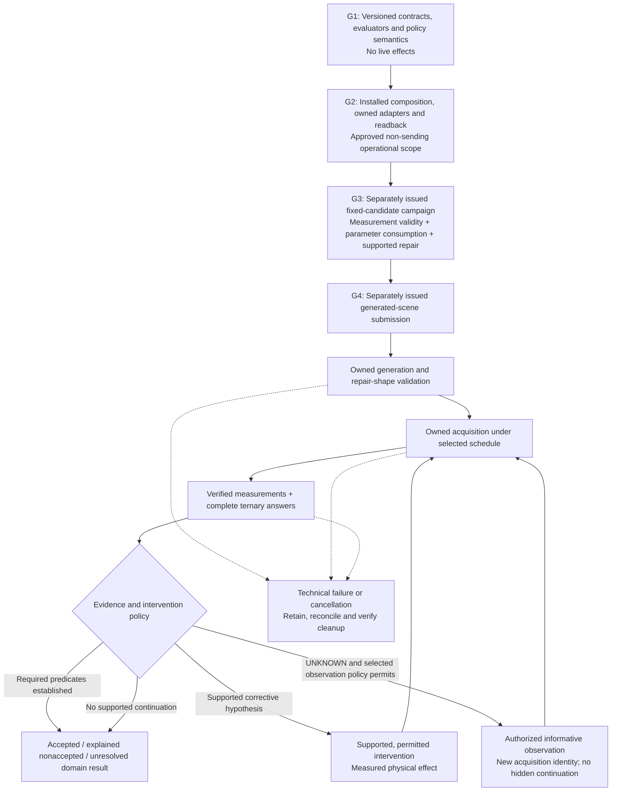

# P04-I03 — Configurable Installed Scene Workflow

- Document ID: `P04-I03-SCENE-WORKFLOW`
- Created: 2026-09-25
- Last reviewed: 2026-09-27
- Source baseline: `aec2b6b4781e9bd636bad08dccee6e668f7f6d39`
- Status: **G1 & non-sending G2 COMPLETE (`ACCEPT_NON_SENDING_G2`). G3's bounded execution STOPPED after one native release with no retained native evidence; the run is cancelled and owned cleanup is verified. Final critic and parent accept the stopped-attempt closeout only, not empirical G3. G4 remains unissued.**
- Parent: [Plan 04](../event_mapping/event-mapping-refactoring_plan_04.md)
- Status owner: [canonical handoff](../dashboard_cli_workflow_parity/research-stack-implementation-handoff.md)
- Prerequisites: [I01](01-native-integration-defects.md) accepted **native-only**; [I02](02-installed-visual-assessment.md) parent-closed for **installed assessment integration with an uncertain visual result**. Neither establishes scene acceptance, calibration or the full workflow.
- Proposed generated-scene operation: `p04-i03-full-scene-v1`
- Issued fixed-candidate operation: `p04-i03-g3-programmatic-root-xy-pair-v1`; `p04-i03-fixed-scene-proof-v1` remains an unissued reference example.

The [strategy](03-full-scene-workflow-strategy.md#5-proposed-goal-prompts) preserves the G1–G4 acceptance contract and historical prompts. The next proposed work is the dedicated [G03 blocker-resolution sequence](#g03-blockers), starting with non-sending `P04-I03-G3-R1`; its [canonical recovery prompts](03-full-scene-workflow-strategy.md#g03-blockers) are not issued by this planning revision. Reading either document, selecting a profile, or approving prompt wording grants no execution. Repository links are relative; deployment/private paths must be resolved for the selected operator, never copied from an editor's filesystem.

> [!NOTE]
> **Contract Schema Versioning (Schema 5 vs. Schema 6):**
> In earlier exploratory notes and discussions, the configurable full-scene workflow contract was colloquially referred to as "Schema 6". The implemented workflow selection is **`schema_version == "5"`** in [contracts.py](../../../../isaaclab_arena/agentic_environment_generation/workflow/contracts.py). It supplies G1's typed `NewSource`/`ExistingSource`, experiment policies, explicit acquisition and action-policy semantics, not the complete installed workflow. Service submission, the legacy scene-effect adapter and the existing native-worker wire decoder explicitly refuse this selection until G2 wiring exists. Evaluator/capture codecs are independently selected; installed configuration and database revisions were not changed. Legacy public I01/I02 decoding and identities were checked without replaying their effects.

### G1 implementation boundary

Implementation began from `7eec064165ba8d6798873f6563a1651cb939473a`. The [concrete G1-to-G2 handoff](03-full-scene-workflow-strategy.md#g1-to-g2-protocol-foundation) names implemented versions, callable consumers, actual checks and remaining adapters. The findings below retain their planning-baseline meaning; an implemented data codec is not proof of installed execution.

- Strict/inclusive per-predicate parameters reach native settings, raw settle reports and retained numeric evaluation. New capture records valid unsettled status; legacy capture keeps its rejection behavior.
- State samples, renderer updates, retained images and criterion coverage are distinct. Exact observation IDs, reset/clock checks and the settle/capture handoff are consumed by pure selectors and callback paths.
- Ternary visual responses retain exact bounded bytes, including malformed UTF-8; new assessments have independent immutable identities. Old `visibility-v2` still decodes the accepted six-answer I02 result as **uncertain**.
- Legacy native settings refuse parameterized criteria, and explicit image schedules refuse temporal reordering before callbacks. `scene-observation-v2` retains source/answer identities independently of valid verdicts, so fresh readback reopens malformed answers rather than verifying an absent response as failure. Legacy observation bytes remain unchanged.
- The selected root-XY mechanism binds a measured required positional goal, verified diagnostic ancestry, original-centered scalar permissions, a frozen policy and an exact proposal. Wrong-subject visual FALSE cannot release repair; UNKNOWN permits observation only when selected. Every returned decision has `can_execute=False`.
- Renewable supervision and current-principal/descriptor compatibility have pure checked semantics. An accounting-only development selection uses explicit null aggregate runtime/deadline limits, not large sentinels. Transport limits, issued counts, current workload authority, cancellation and cleanup remain separate.

No provider call, Kit/native launch, API-service start, database I/O, policy execution, prior retrieval or credential installation occurred in G1. Physical validity, real sensor freshness, placement response, calibration and all G2–G4 application claims remain unproven.

### G2 implementation boundary and closeout

G2 implementation and verification closed with parent decision **`ACCEPT_NON_SENDING_G2`** ([G2-CLOSEOUT.md](../../../../outputs/workflow/plan04-implementation/milestone1/p04-i03-g2-preview/G2-CLOSEOUT.md)). G3 was unissued at that closeout; the subsequent [operator issuance](../../../../outputs/workflow/plan04-implementation/milestone1/p04-i03-g2-preview/g3-issuance.json) is separate and does not broaden G2's evidence.

- **Verified application boundary:**
  - Public numeric mutation (`reassessWorkflowNumeric`), keyed replay and changed-intent refusal work. The retained legacy source truthfully yields `legacy_source_has_no_explicit_acquisition`, not a manufactured positive result. Original run version 12, verdict and accounting remain unchanged.
  - `NewSource` and `ExistingSource` pass installed non-sending public inspection. The exact frozen single-case G3 proposal passes the actual non-sending CLI preview on the amended source.
  - Derived numeric artifacts have a bounded keyed inventory/chunk route (`NUMERIC_ASSESSMENT`) with fresh child/source receipt verification. Produced bytes were exercised only with explicitly synthetic CPU data.
  - The requested instance `3e2008a056ed0b3c140a14cfec9c7033` and final verification instance `32f9e1cb839a1bda45ea695eaa3303f5` are cleanly stopped/drained: empty owned process groups, released lifetime leases, closed endpoints, and clean matching durable retirement. Historical unclean exit records are preserved without relabeling.
  - Affected CPU check suite: **976 passed**, 6 approved exclusions, 14 subtests. Amended files pass scoped formatting, import sorting, flake8, and git diff checks; the approved test exclusions remain explicit.
  - **Zero provider dispatches, native/Kit releases, policy executions, or research-prior retrievals.**
- **Key Closeout Artifacts & Digests:**
  - Selection SHA-256: `ddb19beff14731c9e7e1a76bfe7c58dc7d15b044fb740574303e1c7bf7a52926` ([g3-selection.json](../../../../outputs/workflow/plan04-implementation/milestone1/p04-i03-g2-preview/g3-selection.json))
  - Source snapshot SHA-256: `3f3c2b47f1a13b5941059acc11130a909037b72a4cb120ba9027011b88924448` ([g2-source-manifest-after-critic.json](../../../../outputs/workflow/plan04-implementation/milestone1/p04-i03-g2-preview/g2-source-manifest-after-critic.json))
  - Controlled pair: `p04-i03-programmatic-root-xy-pair-v1` (operation `p04-i03-g3-programmatic-root-xy-pair-v1`)
  - Ceiling: at most 2 native releases, 1 repair send, 2 assessment sends; no repeat case authorized.
- **Empirical Boundaries:** Real released-worker supervision, native measurements, effective placement, causal response, positive explicit-acquisition reassessment, and repeatability remain empirical. A single pair cannot establish repeatability. Separate G3 issuance and fresh finite effective authority are required.

## 1. Outcome and scope

Implement one configurable installed composition in which **one authenticated GraphQL submission** owns generation (when requested), candidate validation, native measurement/capture, assessment, permitted intervention, fresh measurement and retained disposition. Reuse the existing execution owner, coordinator, workers, profile registry, private bindings, grants, Neo4j store and artifact readers. Do not manually chain the accepted I01 and I02 operations or introduce another executor, ledger, scheduler or secret-management system.

Two distinct deliverables are required:

1. **General contract and execution machinery:** typed experiment parameters, observation selection, ternary truth, explicit budget policy, supported capabilities and honest lifecycle/readback.
2. **A scoped empirical witness:** initially the registered DROID/table/block/bin family, not proof that every robot, sensor, task, moving reference frame or deformable object is supported.

The parent [V1 checkpoint and dependency order](../event_mapping/event-mapping-refactoring_plan_03.md#concrete-delivery-checkpoints) require fixed-candidate native calibration/effective-placement evidence and a genuine supported repair witness, followed by the generated-scene path. An explained negative/uncertain result can prove integration, but [Plan 04's positive-scene obligation](../event_mapping/event-mapping-refactoring_plan_04.md#9-definition-of-done) remains open until a scene is actually accepted under its declared criteria.

```mermaid
flowchart TD
    G1["G1: Versioned contracts, evaluators and policy semantics<br/>No live effects"]
    G2["G2: Installed composition, owned adapters and readback<br/>Approved non-sending operational scope"]
    G3["G3: Separately issued fixed-candidate campaign<br/>Measurement validity + parameter consumption + supported repair"]
    G4["G4: Separately issued generated-scene submission"]
    Generate["Owned generation and repair-shape validation"]
    Capture["Owned acquisition under selected schedule"]
    Assess["Verified measurements + complete ternary answers"]
    Route{"Evidence and intervention policy"}
    Observe["Authorized informative observation<br/>New acquisition identity; no hidden continuation"]
    Repair["Supported, permitted intervention<br/>Measured physical effect"]
    End["Accepted / explained nonaccepted / unresolved domain result"]
    Failure["Technical failure or cancellation<br/>Retain, reconcile and verify cleanup"]
    G1 --> G2 --> G3 --> G4 --> Generate --> Capture --> Assess --> Route
    Route -->|"Required predicates established"| End
    Route -->|"Supported corrective hypothesis"| Repair --> Capture
    Route -->|"UNKNOWN and selected observation policy permits"| Observe --> Capture
    Route -->|"No supported continuation"| End
    Generate -.-> Failure
    Capture -.-> Failure
    Assess -.-> Failure
```

The diagram describes the target application, not working code. Adaptive observation is admitted only for a policy actually implemented by the selected adapter. No graph arrow authorizes another release, and no uncertain result is silently converted into a repairable defect.

## 2. Semantic decisions for implementation

### 2.1 Parameterized predicates, not new hardcoded pilot constants

Add a versioned typed parameter representation rather than overloading the legacy scalar `CriterionLimit` or accepting an unchecked JSON dictionary. Bind evaluator identity, units, comparison operators, subject selection, reference frame, temporal coverage, aggregation and missing-data policy. Reject unsupported combinations before generation/provider/native effects.

The initial stationary rigid-body adapter must consume the selected linear/angular limits through **both native mechanics and retained evaluation**. `native_realization.py` currently has another fixed linear threshold; changing only `Criterion` or `NativeCaptureSettings` is insufficient. Ordinary failure of a selected stationary criterion is a domain measurement, not automatically a worker/integration failure. Preserve complete finite measurements when that criterion is false. Malformed samples, unplanned reset/termination, broken acquisition, unsafe execution, failed retention and lost ownership remain separate failures.

I01's reference profile remains strict norms `<0.001 m/s` and `<0.01 rad/s` for both `red_block` and `blue_bin` over final control steps 176–180. Those are **one experiment's values**, not universal API constraints. Do not accidentally replace `<` with `<=`. Other predicates/reference frames require their own supported adapters; a general schema is not evidence of general backend support.

### 2.2 Separate state sampling, acquisition and criterion coverage

The contract identifies:

- measurements, subjects, clock domain, sample cadence and required time/step coverage;
- camera/sensor IDs, modalities, image transforms and explicit capture selections or an implemented registered selection policy;
- the observations used by each predicate, independently of the complete acquired evidence inventory;
- the finite scientific horizon or termination condition, independently of a wall-clock resource budget.

Start with explicit schedules, including different state/image windows and repeated captures from a camera. Treat event/adaptive policies as supported only when a real selector, worker implementation and recovery semantics exist. An unsupported policy must be rejected, not silently approximated by a fixed schedule.

Retain requested policy, resolved selections and actual observations. Each frame/sample needs candidate, environment, realization, reset, source clock/step, sensor, modality and content identity. Repeated identical pixels at different times remain different observations. Detect stale camera buffers, unexpected resets, duplicate/missing observations and clock/ordering errors. Do not mix evidence from different realizations to manufacture simultaneous satisfaction.

A saved-PNG schedule is not necessarily a renderer-execution schedule. The adapter must distinguish requested capture/readout/retention from actual sensor/render updates. No rendering-time, payload-size or token-saving percentage is established by changing a frame count. Admission must check real serializer, artifact, image, request and backend limits; do not silently truncate, resize differently, omit frames or split a model request into uncounted calls.

### 2.3 Ternary truth and separate decision policy

Use explicit `TRUE/FALSE/UNKNOWN` semantics, represented for visibility as `visible/not_visible/uncertain`. Declare subject, camera and temporal quantifiers (`ALL`, `ANY`, or another explicitly implemented operator). Use defined three-valued operations; `UNKNOWN` is not Boolean false or a probability.[17]

**`not_visible` is not an ontic diagnosis, proof of occlusion, or automatic repair permission.** A false visibility proposition may concern the wrong target for the permitted repair, an out-of-view camera, insufficient visual evidence under the rubric, or an unsupported mechanism. Preserve per-frame/per-subject results, reasons and conflict information. Transport/schema/retention failure is not scientific `UNKNOWN` or `FALSE`.

The current retained `visibility-v2` codec is single-time-per-camera, folds results as ALL, and labels its source as retained imagery. Preserve its historical interpretation. Introduce an appropriate new full-scene codec/evaluator selection for multi-time coverage, declared aggregation and new provenance; reuse validated components without reinterpreting I02.

Complete response coverage is distinct from predicate aggregation: ANY does not permit omitted requested answers. The worker, raw/typed retention, projection, GraphQL/CLI and router must preserve the same truth algebra. A selected stop-on-uncertainty policy is valid for a particular case, but not a general harness invariant. Further observation must be authorized, informative, and tied to a persisted selection—not repetition until a preferred verdict appears.

### 2.4 Immutable raw measurements and separately identified reassessments

Separate acquisition identity from evaluation identity in the new protocol. Preserve the original acquisition contract/profile/cohort and its exact raw measurements. A new threshold evaluation is a **derived assessment** with its own criterion/evaluator/parameter identity and links to eligible source observations. It does not rewrite the original run, original criterion digest, original disposition or scientific flags.

Current replay requires the original full contract/profile binding, so passing a changed contract to `NativeCaptureProducer.replay` is not this feature. G1 must define the derivation/coverage rules; G2 must expose an authenticated, keyed retained-numeric-assessment path through existing readers and persistence, with no native/model dispatch. Insufficient retained coverage is reported, not invented. Reassessments labelled exploratory cannot retroactively satisfy validation under a previously frozen criterion.

Version old/new contract, evidence, capture and wire decoders explicitly. Adding default fields to existing Pydantic objects can change canonical bytes, hashes, operation identity and replay behavior. Preserve old serialization and refusal semantics, not just old numeric defaults.

### 2.5 Scoped programmatic diagnostics and causal evidence

Implement only a selected measurable mechanism initially, such as opaque rigid-object visibility/placement. Its producer must run while the owned native scene exists and retain the measurements needed for later analysis. After the native worker closes, parent-side reasoning cannot assume access to live USD/PhysX/RTX state.

The diagnostic producer is not the decision consumer. **G1 implements a pure, versioned mechanism/target eligibility evaluator** over verified measurements, required predicates and the selected intervention/observation policy; its output binds premises, supported hypothesis, permitted target/action and evidence/policy identities. **G2 consumes and retains that output** in routing, reservation, release, recovery and the refiner's declared feedback projection. Recheck the same bound decision before an effect, not merely an aggregate visual verdict. A wrong-subject failure without a supported causal link cannot release repair, and UNKNOWN without selected observation permission cannot become another capture. A measured cross-subject causal link may be supported explicitly; matching subject names alone is neither sufficient nor universally required.

A causal record separates:

1. **Supported hypothesis:** measured premises, relevant subject/camera, mechanism, assumptions and predicted consequence.
2. **Effective intervention:** permitted authored change and actual measured displacement/other intervention, with frame and original-baseline binding.
3. **Causal comparison:** matched baseline and intervention, observed mediator/outcome change, preserved conditions and unresolved alternatives.

Use actual camera calibration/conventions, object/prim identities, timestamps and an appropriate diagnostic such as instance masks/depth or a validated line-of-sight observation. Replicator/contact APIs are candidate instrumentation, not already-installed proofs.[18][20] A few rays to bounding-box vertices do not produce an exact occlusion percentage; physics colliders need not match rendered visual geometry. A force norm and proximity to a destination root do not establish load-bearing support. Radius checks are not analytical IK or collision-free reachability.

The current sampler only supports mapped spawnable objects and narrowly filtered contact forces; background/subasset support mapping is a missing adapter boundary. Select and validate the benchmark's actual support measurement rather than sampling a table as if it were an ordinary rigid object. Required unsupported diagnostics block their dependent proof. General IK, grasp planning, deformables and generic contact-manifold certification are not hidden prerequisites or claimed I03 deliverables.

Matching seeds alone is not proof of matched initial conditions or exact determinism. Retain asset/settings/solver/reset/hold/camera identities and relevant realized state; establish the scope and limitations of the comparison.[12][21] A single pair is not repeatability or general calibration. Use privileged simulator diagnostics as labelled validation evidence, and keep them out of an RGB-only assessment request unless the contract explicitly selects a different information boundary.

### 2.6 Bind repair permission to effective placement

Preserve the existing original-centered XY validation machinery. Initially support one declared target with a unique `on` relation and unique scalar `at_position` x/y values, an explicit `env_local` mapping and an operator-selected displacement bound. The reference red-block repair bound is `0.25 m`; it is a case selection, not every environment's policy.

For generated scenes, freeze a **semantic intervention selector and preservation policy** first; the application resolves the exact allowed scalar pointers against the validated original candidate and retains that binding before any repair. Do not guess `/relations/2`, silently reorder the candidate or ask the operator to resubmit the workflow between stages. If the selected implementation instead requires fixed pointers, validate the exact generated ordering before native release and refuse incompatible output—never widen permission implicitly.

A repair needs an addressable, supported hypothesis and all declared prerequisites. A false criterion for `blue_bin` does not automatically permit moving `red_block`. Validate every unchanged field, original-centered displacement, effective realized placement and fresh reassessment. Distinguish a corrective repair from an explicitly selected diagnostic intervention under uncertainty. Neither may be invented merely to obtain branch coverage.

### 2.7 Ungated empirical time budgets, truthful accounting and real supervision

Use explicit `enforced`, `advisory`, or `accounting_only` policies. In the new development/testing profile, aggregate runtime and total workflow deadline are **unset/unenforced**, not 600, 1,200 or 3,600 seconds under another name. The contract must represent this explicitly; absent enforcement is not zero, infinity encoded as a number, or a huge synthetic allowance.

Keep separate:

- scientific stopping conditions and selected finite experiment procedure;
- optional resource targets/ceilings, including explicitly selected effect counts;
- transport/backend limits and owned-worker supervision;
- API authentication/client-credential lifetime and composition-principal binding;
- workload authorization lifetime and exclusive resource ownership;
- reservation records, actual observed usage and uncertain consumption.

Do not add TCC refunds or a new accounting service. The existing ledger is conservative and preserves reservations; optional runtime enforcement removes the artificial veto without rewriting consumption. Historical I01/I02 records and reservations remain unchanged. Monetary/token accounting continues with actual usage and sourced estimates or explicit unknowns.

Nullable policy values must reach admission, generation/scene reservation checks, foreground authority, worker protocols, private deadlines, process timers, resume/cancel, query DTOs, GraphQL and CLI. They cannot simply flow into existing `min(...)`, timestamp addition, comparisons or non-null Decimal fields.

Long native work needs implemented progress/liveness supervision and a finite, renewable execution/authority mechanism where applicable—not an unkillable process or a stale one-shot alarm. Renewal must validate the same owner/fence/scope and record its effective revision; stale/revoked owners cannot renew. Model transport limits remain explicit. Cancellation and cleanup must still operate after workload authority expires or is revoked. An expired lease alone is never proof that a GPU is free. The precise wire/control mechanism is a G1/G2 implementation obligation, not supplied by the word “heartbeat.”[4][6]

API authentication is a separate ceiling: the current server issues a 3,600-second startup token, installed compositions capture that `AuthContext`/expiry, and the private client descriptor expires with it. Renewing a worker lease or execution grant cannot fix that captured principal. G1 must specify finite credential refresh/current-principal rebinding; G2 must implement it through the supported operator/private channel, installed composition and client, including credential-generation/descriptor compatibility. Keep principal, instance and scope binding exact, refuse expired/revoked credentials, and deliver refreshed credentials privately without rebuilding the owner or replaying work. Refresh alone grants no workload continuation, approval extension or new allocation. Require an actual non-sending expiry-crossing check showing stale authentication refused and refreshed authorized readback/cancellation usable, with workload authority independently enforced.

### 2.8 Preserve immutable intent while allowing programmatic selection

[Plan 03's launch/recovery contract](../event_mapping/event-mapping-refactoring_plan_03.md#61-current-versus-proposed-entry-points) requires a new contract/run for a changed admitted budget, model, seed or intervention. Keep that invariant in I03.

Dynamic behavior means **a frozen authorized policy choosing and retaining concrete future-stage settings inside its declared scope**. Use existing fenced/versioned transitions for append-only resolved allocations/selections. Replaying a recorded choice must not choose again. A change outside that policy requires a new declared operation/authorization; a new key does not manufacture fresh campaign allowance. Scientific re-evaluation uses the separately identified derived-assessment path.

Do not add a generic in-place `amendBudget` mutation or silently mutate the original contract. Such a feature would require an explicit parent-contract revision. Resource-version/ETag guidance is relevant to concurrency control, not permission to bypass immutable request identity.[16]

## 3. Code paths the goals must change together

The [detailed source findings and mental walkthrough](03-full-scene-workflow-strategy.md#1-source-backed-findings) supply the failure mechanisms. The minimum cross-layer map is:

| Boundary | Current source | Required coherent change |
| --- | --- | --- |
| Frozen contracts / canonical identity | [contracts.py](../../../../isaaclab_arena/agentic_environment_generation/workflow/contracts.py#L389) | New typed parameters/policies with legacy byte-compatible decoding and serialization; do not globally loosen old modes. |
| Native settling | [native_realization.py](../../../../isaaclab_arena/agentic_environment_generation/workflow/native_realization.py#L165), [native_capture.py](../../../../isaaclab_arena/agentic_environment_generation/workflow/native_capture.py#L668) | Consume selected limits; separate complete measured violation from collection failure. |
| Coverage / visual request / restore | [scene_observation.py](../../../../isaaclab_arena/agentic_environment_generation/workflow/scene_observation.py#L229), [evidence_contracts.py](../../../../isaaclab_arena/agentic_environment_generation/workflow/evidence_contracts.py#L19), [scene_ports.py](../../../../isaaclab_arena/agentic_environment_generation/workflow/scene_ports.py#L439) | New coverage/answer/derivation identity through request construction, persistence, restore and fresh readers. |
| Native settings / bytes / diagnostics | [native_capture.py](../../../../isaaclab_arena/agentic_environment_generation/workflow/native_capture.py#L36), [scene_evidence_artifacts.py](../../../../isaaclab_arena/agentic_environment_generation/workflow/scene_evidence_artifacts.py#L75) | Implement selected acquisition and diagnostic adapters; bounded artifacts and exact readback, not implicit extra payloads. |
| Existing versus generated source | [application.py](../../../../isaaclab_arena/agentic_environment_generation/workflow/application.py#L171), [service.py](../../../../isaaclab_arena/agentic_environment_generation/workflow/service.py#L561), [foreground_split_scene_ports.py](../../../../isaaclab_arena_examples/agentic_environment_generation/foreground_split_scene_ports.py#L99) | Existing-source execution must not require a generation attempt, generation receipt or source.prompt. |
| Installed/private composition | [installed_config.py](../../../../isaaclab_arena/agentic_environment_generation/workflow/api/installed_config.py#L72), [scene_engines.py](../../../../isaaclab_arena/agentic_environment_generation/workflow/scene_engines.py#L29) | Extend actual setup/dispatch/private-role paths; repair explicitly shares generation binding; no ambient credentials or new model-role framework. |
| Runtime policy / leases / timers | [neo4j_store.py](../../../../isaaclab_arena/agentic_environment_generation/workflow/neo4j_store.py#L3553), [native_worker_protocol.py](../../../../isaaclab_arena/agentic_environment_generation/workflow/native_worker_protocol.py#L101), [native_scene_worker.py](../../../../isaaclab_arena_examples/agentic_environment_generation/web_api/native_scene_worker.py#L236) | Optional workflow time policy plus working supervision, safe expiry and cleanup; preserve durable accounting. |
| API authentication / private client | [server.py](../../../../isaaclab_arena/agentic_environment_generation/workflow/api/server.py#L148), [security.py](../../../../isaaclab_arena/agentic_environment_generation/workflow/api/security.py#L50), [installed_execution.py](../../../../isaaclab_arena/agentic_environment_generation/workflow/api/installed_execution.py#L147), [client.py](../../../../isaaclab_arena/agentic_environment_generation/workflow/api/client.py#L152) | Refresh finite credentials and the composition's current principal safely; preserve exact scope and independently enforce workload authority. |
| Public read model | [read_model.py](../../../../isaaclab_arena/agentic_environment_generation/workflow/read_model.py#L33), [api/schema.py](../../../../isaaclab_arena/agentic_environment_generation/workflow/api/schema.py#L360) | Expose effective parameters, nullable policies, derived assessments and real progress without lossy Boolean/string coercion. |
| Diagnostic decision / effect release | [scene_loop.py](../../../../isaaclab_arena/agentic_environment_generation/workflow/scene_loop.py#L368), [scene_ports.py](../../../../isaaclab_arena/agentic_environment_generation/workflow/scene_ports.py#L260), [foreground_scene_ports.py](../../../../isaaclab_arena_examples/agentic_environment_generation/foreground_scene_ports.py#L252) | Implement and consume the evidence-bound eligibility decision before reservation/release and in recovery/refiner feedback; no unconditional observe-to-capture conversion. |
| Physical repair / causal evidence | [repairs.py](../../../../isaaclab_arena/agentic_environment_generation/workflow/repairs.py#L275), [scene_ports.py](../../../../isaaclab_arena/agentic_environment_generation/workflow/scene_ports.py#L393) | Resolve exact authorized target, select correct before/after samples, retain effective displacement and causal limitations. |

The installed config integer revision, workflow string revision, evaluator/worker codecs and database schema are separate version domains. Workflow schema `5` and the G1 codecs below are implemented selections. `full-scene-execution-v1`, installed activation and any new worker wire revision still require G2; no database revision was changed merely to match the workflow version.

## 4. Dependency-ordered implementation and proof

| Goal | Deliverable | Effect boundary when explicitly issued |
| --- | --- | --- |
| [G1 — contracts and semantics](03-full-scene-workflow-strategy.md#i03-g1) | Versioned predicates, schedules, evidence/derivation, repair-selection and budget/supervision protocols; pure decoder/evaluator checks | Scoped source/doc edits; no provider, Kit, API-service or database effects |
| [G2 — installed composition](03-full-scene-workflow-strategy.md#i03-g2) | **COMPLETE (`ACCEPT_NON_SENDING_G2`)**: Real owned adapters, telemetry implementation, New/Existing sources, public readback, and supervision verified with 976 passing CPU checks and cleanly drained APIs | Only explicitly approved application/Neo4j setup and non-sending/CPU control checks; zero provider sends, zero native releases |
| [G3 — empirical fixed-candidate campaign](03-full-scene-workflow-strategy.md#i03-g3) | Selected measurement validity and parameter-consumption witnesses, genuine supported repair/effective-placement proof, honest causal limitations | Only the individually identified cases and effects in the separately approved campaign selection; time-budget vetoes disabled |
| [G4 — generated-scene integration](03-full-scene-workflow-strategy.md#i03-g4) | One new-source submission through the same validated composition; exact result/replay/cleanup | Separately issued finite procedure; no implicit rerun or extra diagnostic campaign |

G2 must implement both the diagnostic producers and the G1 eligibility evaluator's installed decision/release consumers; G3 is not instructed to discover an imaginary oracle or unwired hypothesis after admission. G3 may make narrowly scoped empirical adapter corrections only **between fully contained cases** and only as its issued scope allows. No hot-patching an admitted run. A subsequent effect still needs an already-authorized case/repeat; source correction alone grants none.

G4 follows the required G3 producer/mapping and supported repair evidence. A positive first candidate in G3 does not exercise repair; an uncertain one does not prove sensor adequacy. Record the partial result and the missing witness rather than silently waiving the dependency. No policy execution, live research-prior retrieval, publication, generic IK or other embodiment implementation is included.

## 5. Empirical selection and resource scope

The earlier **proposed** allocation—G3 fixed case up to 2 native releases/3 provider sends, then G4 up to 2/4—was a planning choice, not execution authority. Preserve it as a **minimal joined-path/repair-pair option**, not a promise that it covers calibration, parameter/schedule variation, cancellation experiments and repeatability simultaneously.

| Proposed case | Native releases | Initial generation | Repair | Assessment | Meaning |
| --- | --- | --- | --- | --- | --- |
| Minimal fixed-candidate repair case | 2 | 0 | 1 | 2 | Can witness one baseline/intervention pair only if a supported repair actually occurs. |
| Generated-scene integration case | 2 | 1 | 1 | 2 | One initial candidate and at most one supported repair through one submission. |

If both minimal cases are issued unchanged, their combined ceilings are 4 native releases and 7 provider sends. **There is no aggregate runtime/deadline gate for the development profile.** Effect counts are explicit case permissions/procedure bounds, not universal schema clamps. No automatic retries, constructor probes, fallback, same-image re-judging or uncounted schema-correction calls are permitted in these reference cases.

G2 must propose the concrete G3 case matrix needed for its selected measurement/repair claims, identifying which witnesses share an acquisition and which need additional effects. The operator approves that exact matrix when issuing G3. Additional calibration/control/alternate-schedule/repeatability cases are neither implicitly covered by 2/3 nor already authorized here. If only the minimal option is issued and a required witness does not fit, close the observed slice and state the exact missing case. Do not demand guessed wall-time reservations or spend G4 as a diagnostic substitute.

A live selection must resolve:

- exact case IDs/operation IDs, source baseline, candidate bytes or prompt, catalogs, contract/config/profile digests and predecessor applicability;
- implemented predicate/schedule/diagnostic capabilities, effective settings, clock/reset/hold policy, asset/prim/sensor/frame mappings, expected observations and technical payload limits;
- explicit visibility aggregation and uncertainty continuation policy, corrective versus diagnostic intervention, preservation rules and original-centered bounds;
- named credential-source bindings through the supported private mechanism, approved operational DB/artifact scope, API/operator identities, current authorization and supervision/renewal policy;
- individually permitted effect counts, programmatic allocation rules, stop conditions, cleanup/escalation, and any between-case correction/repeat authority;
- explicit `not_requested` research-prior policy and its retained receipt; this is not nonempty-prior integration;
- actual entrypoints, affected existing checks, expected installed observations and unresolved empirical limitations.

No placeholders are executable identifiers or hashes. Freeze known policy before admission; generated candidates, resolved pointers, observations and model requests are bound by the application when they exist. Replayed choices/operations do not renew allocations or repeat released effects.

## 6. Six independent closeout dimensions

| Claim | Required report; do not infer adjacent claims |
| --- | --- |
| 1. Installed integration | Actual source variant and application-owned stages reached; no manual follow-on submissions. A preview is not this witness. |
| 2. Physical measurement validity | Requested/resolved/observed parameters, sample/image clocks and coverage, raw measurements, predicate outcomes and scoped calibration limits. A measured violation can be complete acquisition. |
| 3. Assessment fidelity | Exact model inputs and complete ternary outputs, aggregation, reason/conflict/quality information; no privileged diagnostic leakage. |
| 4. Intervention and causal status | Not exercised / proposed / attempted / physically effective; supported hypothesis, fresh reassessment, matched-comparison result and repeatability limitations reported separately. |
| 5. Scientific disposition | Accepted only under the declared required predicates and validated producers; otherwise explained nonaccepted/inconclusive/not assessed. No post-hoc relaxation promoted as original validation. |
| 6. Readback, replay and lifecycle | Fresh authenticated byte recovery and causal traversal; same-key no-effect replay; exact owned-process cleanup, GPU release, scope-owner retirement and owned API drain, each independently verified. |

Report technical failure separately from domain truth. Preserve first-causal diagnostics and secondary cleanup failures, including unrecoverable diagnostic loss; never manufacture a graceful exit or a missing initiating exception. A worker's absence alone does not retire durable ownership or prove safe GPU reuse. Do not stop shared services or signal historical PIDs.

The final record names actual usage, reservations, unknown consumption, policy mode and issued effect ceilings; it does not require elapsed time to be below an obsolete 1,200-second limit. Report remaining parent obligations explicitly. Do not promote old I01/I02 scientific flags, calibration, policy success, prior eligibility, full Milestone 1 or full Plan 04 completion.

## 7. Planning and issuance checklist

- [x] G1 is explicitly issued and its protocol/legacy-compatibility obligations are verified.
- [x] G2's operational scope is explicit; actual installed preview/readback/control paths work without paid/native effects (`ACCEPT_NON_SENDING_G2`).
- [x] Selected diagnostics and supervision have implementations; 5 pre-send critic findings resolved via strict TDD; configured support is distinguished from empirical validity.
- [x] G3's exact case matrix and effect permissions are explicitly issued; its finite authority window is not an aggregate experiment/investigation-time cap.
- [ ] Required measurement/mapping and supported repair witnesses are actually obtained, or a precise remaining case is recorded.
- [ ] G4 is separately issued with applicable G3 evidence and the exact final selection.
- [ ] Each closed claim has real installed evidence; original history and all unresolved claims remain intact.

G1 and G2 are closed in their verified scopes. G3's operator issuance is recorded; effective authority, first release and empirical acceptance remain distinct boundaries.

## 8. Original G3 issuance and stopped-attempt history

The [operator issuance](../../../../outputs/workflow/plan04-implementation/milestone1/p04-i03-g2-preview/g3-issuance.json) selects only `p04-i03-programmatic-root-xy-pair-v1`, operation `p04-i03-g3-programmatic-root-xy-pair-v1`, and selection-file SHA-256 `ddb19beff14731c9e7e1a76bfe7c58dc7d15b044fb740574303e1c7bf7a52926`. The cumulative ceilings are 2 native releases, 1 repair send and 2 assessment sends, including failures and uncertainty. No repeat, extra observation, initial-generation send, policy execution, prior retrieval or G4 case is issued.

### Launch order and remaining empirical boundary

The [pre-boundary critic](../../../../outputs/workflow/plan04-implementation/milestone1/p04-i03-g2-preview/g3-pre-boundary-critic.json) returned `BLOCKED`. Parent source inspection and one CPU-only schema/hash check [confirmed the three defects](../../../../outputs/workflow/plan04-implementation/milestone1/p04-i03-g2-preview/g3-pre-boundary-parent-verification.json). The operator then authorized scoped corrections and amended-source G3 continuation. The [source applicability amendment](../../../../outputs/workflow/plan04-implementation/milestone1/p04-i03-g2-preview/g3-source-applicability-amendment.json) preserves the original selection and all experimental bytes. The [delta critic](../../../../outputs/workflow/plan04-implementation/milestone1/p04-i03-g2-preview/g3-source-delta-critic.json) returned `CONTINUE`, followed by the authorized handover and one installed submission. See the [source correction boundary](03-full-scene-workflow-strategy.md#pre-boundary-source-blockers) and [G3 closeout](../../../../outputs/workflow/plan04-implementation/milestone1/p04-i03-g2-preview/G3-CLOSEOUT.md).

Actual G3 consumption is **one native release, zero repair sends, zero assessment sends**. C0 reached `reconciliation_required` without retained native input/output, a causal diagnostic, evidence or an assessment. Its initiating exception remains unknown; no specific Kit/GPU cause is asserted. C1 was not eligible, and N1/N2 lacked C0 velocity coverage. Exact replay and source-byte recovery were verified, then supported cancellation and API/native physical/durable cleanup completed. All 56 source bindings remained frozen. No retry, correction, extra case or G4 execution follows from unused ceilings. The [final scoped critic](../../../../outputs/workflow/plan04-implementation/milestone1/p04-i03-g2-preview/g3-final-scoped-critic.json) and parent accept this truthful stopped-attempt closeout only; empirical G3 acceptance and first-causal failure retention remain open.

The launch procedure below records the issued sequence, not permission to repeat the stopped attempt.

1. Verify the frozen selection, its independently hashed artifacts and source snapshot, the explicitly reused operational scope, and scoped owner/resource readiness. The worker is headless; `DISPLAY=:1` and globally idle shared hardware are not prerequisites. No extra Kit smoke test is permitted.
2. Obtain the fresh read-only pre-boundary critique under [AC-I03](03-full-scene-workflow-strategy.md#ac-i03). G2's accepted CPU/software evidence is not native measurement or repair proof.
3. Preserve the frozen proposal and the exact previous G2 configuration. Immediately before authorized launch, prepare a separate authority-only configuration with the issued 60-minute finite expiry. Record its effective configuration and selector digests separately from the unchanged selection-file hash. Do not alter experimental fields.
4. Use the supported `api-handover` with the exact previous configuration/instance and `--authorize-full-scene`; verify the fresh endpoint. A submission-disabled startup flag is not enabled by an expiry edit or credential refresh.
5. Submit the selected workflow once through the installed application. Apply the frozen eligibility/stopping rules, perform N1/N2 only with actual retained C0 coverage, and complete fresh byte readback, no-effect replay and verified owned cleanup before the final critic.

The 60-minute grant limits workload authority and is not automatically extended. It does not reinstate an aggregate experiment-runtime or investigation-time budget. The 300-second credential lifetime, 60-second renewable native lease and 180-second transport bound remain independent controls. Stopping further workload effects never skips containment or truthful readback.

### Historical prompts and current recovery entry

- [Original read-only readiness prompt](03-full-scene-workflow-strategy.md#pre-g3-readiness): preserved for the first campaign; not a successor selection or grant.
- [Original I03-G3 execution prompt](03-full-scene-workflow-strategy.md#i03-g3): preserved with its old operation and ceiling, not a command to restart the cancelled run. Its measurement, repair and acceptance requirements remain binding where applicable.
- [Current proposed G03 recovery prompts](03-full-scene-workflow-strategy.md#g03-blockers): separate non-sending correction, successor proposal, explicitly issued execution and evidence-only acceptance. No phase automatically issues another.

## 9. G03 blockers and proposed recovery sequence

**Status: planning/documentation only; all four recovery goals are PROPOSED, NOT ISSUED.** “G03” here means the existing G3 milestone; it does not rename any historical identifier. G1/G2 remain accepted in their existing scopes, and `EXECUTION_STOPPED_NO_G3_ACCEPTANCE` remains the original campaign's disposition.

### Review of the supplied root-problem analysis

The [root-cause note](../../quick_notes/g3_execution_blockers_and_root_cause_analysis.md) is useful investigation input, not a recovered runtime trace. The [source-backed review](03-full-scene-workflow-strategy.md#g03-blocker-analysis) qualifies it as follows:

- **Confirmed diagnostic-path defect:** schema-5 failures miss the schema-4-only recorder in the service, foreground port and Neo4j writer. Changing only `service.py` would leave the downstream exclusions intact. Follow the complete first-causal/cleanup retention and readback path while preserving exact fences and legacy behavior.
- **Confirmed diagnostic blind spots:** the native worker inherits discarded stderr, and its outer exception handler can return failure without a structured diagnostic. Capturing stderr alone does not make an already-caught exception appear. Any correction must be bounded, drained, screened and tied to the existing owned registration, without contaminating stdout's protocol or exposing private data.
- **Unproved runtime cause:** no retained record establishes premature child death, Kit initialization or a graphics failure. The launcher explicitly selects `headless=True`; omitted `DISPLAY`/`VK_ICD_FILENAMES` values are a hypothesis, not grounds to pass ambient environment variables or hardcode `DISPLAY=:1`.
- **Rejected free-probe assumption:** “offline” is not “no effect.” A worker/Kit probe is not included in non-sending correction and cannot bypass campaign counting. Scoped process/resource cleanup is verified; a global “zero GPU memory leaks” claim is not.

The three pre-release semantic/serialization fixes remain resolved and historically bound. The new task is not to repeat that G2 correction campaign or invent the initiating exception. Start at the released parent handoff and missing first-error path; preserve the historical unknown even if a current defect is reproduced.

### Four smaller goals, with explicit stop boundaries

| Proposed goal | Concrete deliverable | Effects and completion boundary |
| --- | --- | --- |
| [G3-R1 — non-sending diagnosis and repair](03-full-scene-workflow-strategy.md#g3-r1) | Narrow handoff/diagnostic corrections and affected CPU evidence; known defects separated from historical uncertainty. | Scoped source/docs and effect-safe existing-module checks only. No API, database I/O, native/provider calls, configuration/grant writes or empirical acceptance. |
| [G3-R2 — successor proposal and pre-boundary review](03-full-scene-workflow-strategy.md#g3-r2) | Actual successor selection/digest, corrected-source applicability, exact case/count proposal and one pre-boundary critique. | Only explicitly scoped non-authorizing proposal/selection writes and non-sending validation. No service/database/native/provider effects or finite workload grant. |
| [G3-R3 — issued campaign through owned cleanup](03-full-scene-workflow-strategy.md#g3-r3) | One installed workflow, actual C0 and application-eligible C1, eligible retained N1/N2, fresh readback/replay and verified physical/durable/API cleanup. | Requires separate exact successor issuance and expressly approved cumulative ceilings. Any fault stops effects and triggers containment; no hot-patch, retry or extra case. Execution completion is not G3 acceptance. |
| [G3-R4 — retained-evidence acceptance](03-full-scene-workflow-strategy.md#g3-r4) | Final scoped critique and parent disposition across the six independent dimensions, with missing witnesses retained. | Public retained-evidence review and closeout documentation only; no new application requests, services, observations or effects. |

The normal campaign critics belong at R2 (before release) and R4 (after R3 cleanup), with focused delta review for a material reviewed-source/selection change. These are subgoals of one recovery sequence, not fresh allowances or reasons to review every worker. R3 must finish containment and collect fresh-client evidence before exiting; no API or native worker may be left for R4 to clean up. Until R4 completes, final acceptance remains pending.

C0 and C1 remain stages of **one application-owned submission**, not two manual workflow calls or invented pause/resume checkpoints. N1/N2 use the separately keyed retained-numeric path over the same eligible C0 bytes. Keep those reads/derivations and lifecycle verification inside R3; R4 judges the retained results rather than generating missing evidence.

### Successor identity and allocation decision

Preserve original operation `p04-i03-g3-programmatic-root-xy-pair-v1`, selection SHA-256 `ddb19beff14731c9e7e1a76bfe7c58dc7d15b044fb740574303e1c7bf7a52926`, all frozen artifacts and the cancelled run. Same-key/same-intent submission replays that receipt; changed intent conflicts. A successor must have explicitly approved identity/source bindings and cannot silently reuse the old selection hash as if it described the new operation.

| Accounting scope | Native releases | Repair sends | Assessment sends |
| --- | ---: | ---: | ---: |
| Already consumed by the stopped attempt | 1 | 0 | 0 |
| Proposed maximum additional effects for one successor C0/C1 pair | 2 | 1 | 2 |
| Proposed cumulative maximum across stopped attempt and successor | 3 | 1 | 2 |

**The increase from the original native ceiling of 2 to a proposed cumulative ceiling of 3 is NOT approved here.** R2 must surface it; R3 requires explicit operator approval of both the successor selection and allocation. The unused original slot is neither a repeat permission nor enough for a complete fresh pair. All failures/uncertainty count; no refunds, resets or parallel ledger are introduced. Existing reservations remain intact and actual historical native consumption remains unknown.

Only an issued R3 prepares the authority-only derivative with a fresh 60-minute finite expiry immediately before launch. Preserve the non-authorizing successor proposal and all previous configurations; hand over against the actual verified predecessor, not an assumed old G2 instance. No aggregate investigation/runtime/cost/token veto is reintroduced; the workload grant, transport bounds, credential lifetime and fenced supervision remain independent. G4 and all unselected calibration/repeatability work remain unissued.

## 10. Architectural references

Use these as design principles, not instructions to install additional frameworks.

Long-running operation identity and idempotent commands inform the existing owner.[1][2]

Supervision, verified cleanup and trace context inform its existing lifecycle.[4][6][14]

Explicit three-valued semantics and candidate measurement instrumentation inform the proposed adapters.[17][18][20]

Controlled causal comparisons and reproducibility still require the concrete source and empirical work described above, not acceptance by citation.[12][21]

Sources:
[1] https://google.aip.dev/151
[2] https://aws.amazon.com/builders-library/making-retries-safe-with-idempotent-APIs
[4] https://docs.temporal.io/design-patterns/long-running-activity
[6] https://kubernetes.io/docs/concepts/overview/working-with-objects/finalizers
[12] https://pywhy.org/dowhy/v0.11/example_notebooks/tutorial-causalinference-machinelearning-using-dowhy-econml.html
[14] https://opentelemetry.io/docs/concepts/context-propagation
[16] https://google.aip.dev/154
[17] https://www.postgresql.org/docs/current/functions-logical.html
[18] https://docs.omniverse.nvidia.com/py/replicator/1.11.16/source/extensions/omni.replicator.core/docs/annotators_details.html
[20] https://isaac-sim.github.io/IsaacLab/main/source/overview/core-concepts/sensors/contact_sensor.html
[21] https://isaac-sim.github.io/IsaacLab/main/source/features/reproducibility.html
