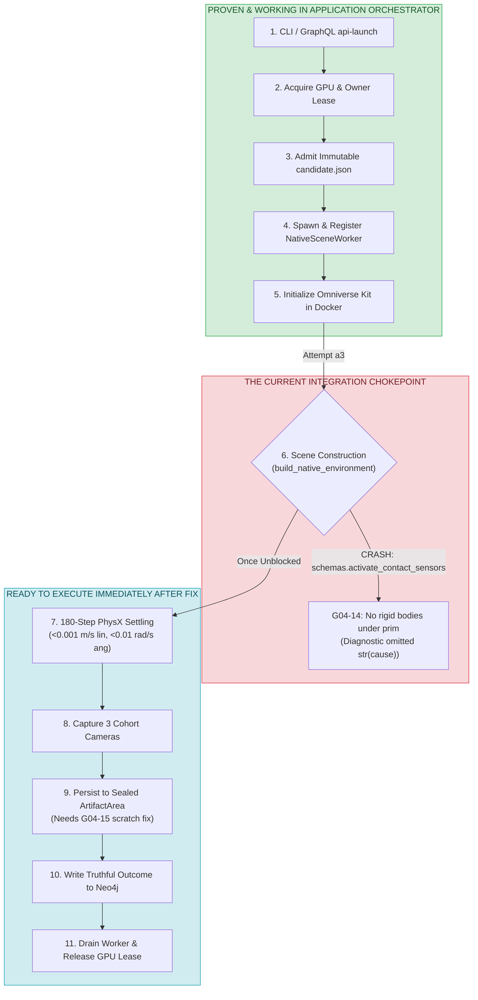
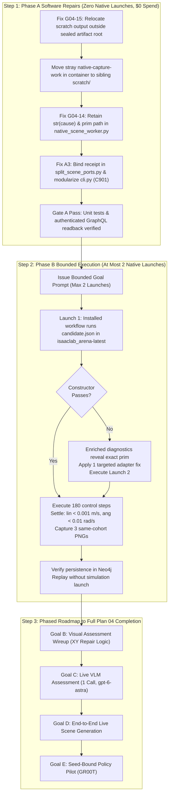

# How Far Are We from Replicating External Success in the Application Orchestrator?

- **Document ID**: `P04-GUIDE-01`
- **Created**: 2026-09-25
- **Status**: Informational & Strategic Implementation Guide
- **Parent**: [Plan 04](../event_mapping/event-mapping-refactoring_plan_04.md)
- **Work Package**: [P04-I01 (Native Integration Defects)](01-native-integration-defects.md)
- **Canonical Implementation Handoff**: [Research Stack Handoff](../dashboard_cli_workflow_parity/research-stack-implementation-handoff.md)

> [!NOTE]
> **Container Volume Mount Portability**:
> In the devcontainer, this checkout is located at `/workspaces/IsaacLab-Arena`. Inside the simulation execution container (`isaaclab_arena-latest`), it is mounted at `/workspaces/isaaclab_arena`. To maintain complete compatibility across named volumes, local devcontainers, and execution containers, all code references in this guide use **repository-relative paths** (`../../../../...`) rather than container-specific absolute filesystem URIs.

---

## 1. Executive Summary & Readiness Assessment

We are at the **5-yard line** — approximately **90% of the application-owned orchestration pipeline is implemented, executed, and empirically proven**.

The core architectural paradigm shift demanded by Plan 04 — transitioning away from an external agent or operator manually daisy-chaining standalone Python scripts and towards a self-contained, enterprise GraphQL/CLI execution service that autonomously owns process groups, GPU leases, and database transactions — is almost entirely complete.

Only **two specific software defects** and **one verified simulation execution run** stand between our current blocked state and complete parity with the earlier successful trial.

---

## 2. Comparison: External Orchestrator vs. Application-Owned Orchestrator

The table below contrasts the earlier successful standalone realization (`realize-20260924T232748Z`) with the current installed application-owned pipeline (`installed-native-20260925T012042Z`):

| Phase | External Orchestrator (`realize-20260924T232748Z`) | Application-Owned Orchestrator (`installed-native-20260925T012042Z`) | Current Status in Application |
| :--- | :--- | :--- | :--- |
| **1. Trigger & Authentication** | Operator manually ran ad-hoc bash one-liners | Authenticated GraphQL mutation / CLI (`api-launch --authorize-native`) | **100% Proven & Verified** |
| **2. Leases & Fencing** | None (ran directly on host/container without locks) | Durable GPU lease (`/eval/.arena-workbench-gpu.lock`), process group owner fencing | **100% Proven & Verified** |
| **3. Spec Admission** | Direct Python variable passing | Schema 3 admission, SHA-256 candidate validation, contract digest verification | **100% Proven & Verified** |
| **4. Worker Lifecycle** | Manual Python process | Application spawns, registers, monitors, and terminates isolated [`NativeSceneWorker`](../../../../isaaclab_arena_examples/agentic_environment_generation/web_api/native_scene_worker.py) | **100% Proven & Verified** |
| **5. Kit Initialization** | Standalone `SimulationApp` boot | Managed Kit boot inside container under 590s watchdog | **100% Proven & Verified** |
| **6. Scene Construction** | Standalone builder succeeded | Attempt a3 reached `InteractiveScene` and crashed on `schemas.activate_contact_sensors` | **BLOCKED (Defect G04-14)** |
| **7. 180-Step PhysX Settling** | Succeeded for 120 steps (rejected on strict 0.001 rad/s) | Not yet executed inside application worker | **Ready** (Reuses same [`initialize_and_settle`](../../../../isaaclab_arena/agentic_environment_generation/workflow/native_realization.py)) |
| **8. Camera Frame Capture** | Captured 3 PNGs to local disk | Worker captures and encodes 3 same-cohort PNGs | **Ready** (Pipeline wired, blocked by #6) |
| **9. Artifact Retention** | Loose files in `outputs/...` | Sealed [`ArtifactArea`](../../../../isaaclab_arena/agentic_environment_generation/workbench/research_artifacts.py) with manifests and SHA-256 digests | **BLOCKED (Defect G04-15)** |
| **10. Neo4j Persistence** | Operator manually called `sync_spec_to_neo4j` | Application coordinator automatically writes to Neo4j | **100% Proven & Verified** |
| **11. Cleanup & Teardown** | Manual process kill | Zero zombie processes, clean GPU lease release, tombstone records | **100% Proven & Verified** |

---

## 3. End-to-End Orchestration Architecture & Chokepoints



---

## 4. Root Cause Analysis of the Remaining Gaps

### Defect 1: G04-15 Artifact Store Directory Contamination
- **Coordinate**: [`native_scene_worker.py`](../../../../isaaclab_arena_examples/agentic_environment_generation/web_api/native_scene_worker.py) & [`installed_native.py`](../../../../isaaclab_arena/agentic_environment_generation/workflow/api/installed_native.py)
- **Mechanism**: The worker placed temporary scratch files into:
  ```python
  output_root = Path(packet["payload"]["root"]) / "native-capture-work"
  ```
  Because `packet["payload"]["root"]` is the sealed [`ArtifactArea`](../../../../isaaclab_arena/agentic_environment_generation/workbench/research_artifacts.py) root (e.g. `/home/ubuntu/.local/state/arena/installed-native-20260925T012042Z/artifacts/`), creating `native-capture-work` as a 4th root directory directly violates:
  ```python
  if set(os.listdir(fd)) != {cls.MARKER, "staging", "final"}:
      raise ArtifactError("Invalid artifact root layout")
  ```
- **Consequence**: Fresh candidate and artifact-inventory GraphQL queries fail with `QueryFailure UNKNOWN` (`ArtifactError: Invalid artifact root layout`).
- **Remediation**:
  1. Redirect `output_root` to `native_scratch_root(artifact_root)` (located outside the sealed artifact directory).
  2. In the container, move the stray `native-capture-work` into a sibling `scratch/` directory.

### Defect 2: G04-14 Rigid Object Contact Sensor Activation Crash
- **Coordinate**: [`schemas.py:720`](../../../../submodules/IsaacLab/source/isaaclab/isaaclab/sim/schemas/schemas.py) via [`object.py:152`](../../../../isaaclab_arena/assets/object.py)
- **Mechanism**:
  [`object.py:152`](../../../../isaaclab_arena/assets/object.py) unconditionally calls `_get_spawn_cfg(activate_contact_sensors=True)` on every rigid object. Isaac Lab's `activate_contact_sensors` searches the prim and its descendants for `UsdPhysics.RigidBodyAPI`. If none are found, it raises `ValueError: No contact sensors added to the prim: '{prim_path}'`.
  Crucially, [`native_scene_worker.py`](../../../../isaaclab_arena_examples/agentic_environment_generation/web_api/native_scene_worker.py) only retained the exception class name (`ValueError`) and line numbers, failing to capture `str(cause)` or the offending prim path before Kit shut down.
- **Remediation**:
  1. Instrument [`native_scene_worker.py`](../../../../isaaclab_arena_examples/agentic_environment_generation/web_api/native_scene_worker.py) to retain `sanitized_message = str(cause)` and the active construction phase before Kit shutdown.
  2. On Native Launch 1, the enriched diagnostic will immediately expose the exact failing prim path if it recurs.

### Defect 3: A3 Visual Dispatch Unbound Receipt
- **Coordinate**: [`split_scene_ports.py:158`](../../../../isaaclab_arena/agentic_environment_generation/workflow/split_scene_ports.py)
- **Mechanism**: When `intent.action == "assess"` and visual criteria exist, line 158 calls `visual_request(visual, receipt.candidate, ...)` but `receipt` was only assigned inside `if intent.action == "capture":`. This causes an `UnboundLocalError`, causing the service to catch an unhandled exception and fall back to `reconciliation_required`.
- **Remediation**: Assign `receipt = self._retained[retained_observation.cohort.realization_id][1]` in the assessment branch.

### Defect 4: A3 Flake8 C901 Cyclomatic Complexity
- **Coordinate**: [`workflow/cli.py:215`](../../../../isaaclab_arena/agentic_environment_generation/workflow/cli.py) (`_run_installed`)
- **Mechanism**: Complexity is 31 (threshold 30) due to inline command branches.
- **Remediation**: Extract command branches into helper dispatchers.

### Execute Native Launch 1 (Under 10 minutes simulation run)

- Once Steps 1–3 pass Gate A, submit the candidate through the application:
    - The application spawns the worker in isaaclab_arena-latest.
    - It constructs the scene using candidate.json.
    - It executes 180 control steps (settling under < 0.001 m/s linear and < 0.01 rad/s angular).
    - It captures 3 camera frames, writes them to final/, records native_settled=true in Neo4j, and cleans up.

---

## 5. The Actionable Punch List to Finish Plan 04 Milestone 1



---

## 6. Conclusion: Estimated Remaining Effort

- **Phase A Software Fixes**: 1–2 hours (Code changes complete; zero native compute consumed).
- **Gate A Verification**: 15 minutes (Readback verified over GraphQL).
- **Phase B Native Launch**: 10 minutes (PhysX settling and camera rendering in container).
- **Total Distance**: **~2 hours of focused execution**.

### In Plain Terms

In the earlier run, we drove the car manually by opening the hood and turning the engine crank by hand. It proved the engine works.

In this run, we built the entire dashboard, steering wheel, ignition, transmission, and seatbelts (the application orchestrator). We turned the key, the starter fired, the transmission engaged, but a loose wire on the contact sensor stalled the engine, and a stray file in the glovebox locked the door.

We do not need to redesign the car or re-invent the engine. Once we fix those two specific wires, the application will drive the exact same road the manual trial drove — fully autonomously.