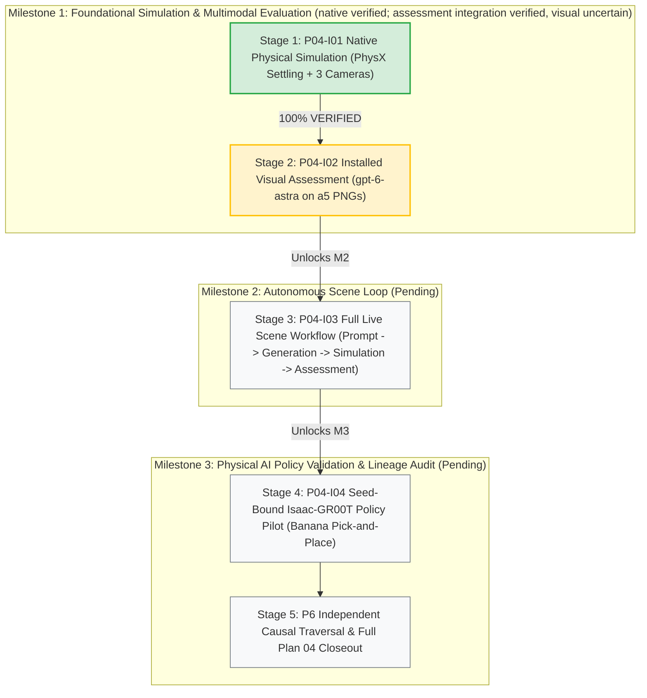
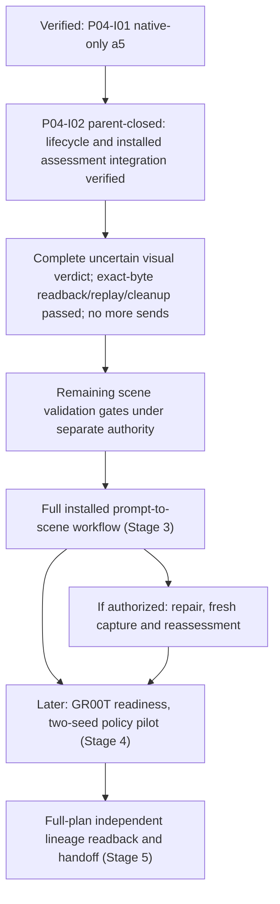

# What remains to finish Plan 04?

- Document ID: `P04-GUIDE-01`
- Updated: 2026-09-25, after installed P04-I02 successor result/readback/replay/cleanup
- Status: Informational & Tracking; no execution authority
- Parent: [Plan 04](../event_mapping/event-mapping-refactoring_plan_04.md)
- Current result: [P04-I02 — parent-closed integration, visual uncertain](02-installed-visual-assessment.md)
- Runtime status: [canonical handoff](../dashboard_cli_workflow_parity/research-stack-implementation-handoff.md)

The separately issued recovery goal has produced a complete installed uncertain
visibility assessment, exact-byte readback, no-effect replay and final cleanup.
Final critic `ACCEPT` and independent parent verification closed the bounded
integration slice. No further send is authorized after
this result; no new native work or full scene/Milestone1/Plan04 completion is claimed.
Use the [restart checkpoint](../dashboard_cli_workflow_parity/research-stack-implementation-handoff.md#resume-after-a-computer-restart)
and current operation record; the older blocked entries are preserved history.

---

## Executive Scorecard: Plan 04 Five-Stage Completion Matrix

| Stage / Package | Goal & Target | Scope & Technical Boundaries | Current Status | Consumed vs. Authorized Resources | Exit Criteria & Key Artifacts |
| :--- | :--- | :--- | :--- | :--- | :--- |
| **Stage 1: P04-I01** | **Goal A: Native Simulation Slice** | Real Isaac Sim (PhysX) settling in `isaaclab_arena-latest` on Blackwell GPU; 180 control steps settling ($<0.001\text{ m/s}$ linear, $<0.01\text{ rad/s}$ angular); 3 camera PNG captures at step 180; scratch recovery outside sealed artifacts. | **100% VERIFIED & CLOSED** Critic `ACCEPT` ([`deleg_1acfe8e1`](../../../../outputs/workflow/plan04-implementation/milestone1/installed-native-20260925T012042Z/p04-i01/critic-final.json)) | **5/5 lifetime native launches consumed (0 remain)**. $0.00 provider spend. | [`LIVE_RESULT.txt`](../../../../outputs/workflow/plan04-implementation/milestone1/installed-native-20260925T012042Z/p04-i01/LIVE_RESULT.txt), [`parent-closeout.json`](../../../../outputs/workflow/plan04-implementation/milestone1/installed-native-20260925T012042Z/p04-i01/parent-closeout.json), 3 PNGs, `native_settled=true`. |
| **Stage 2: P04-I02** | **Goals B & C: Installed Visual Assessment** | Assess a5's 3 unchanged step-180 camera PNGs, both subjects per frame, with `gpt-6-astra` through installed authenticated GraphQL. | **INTEGRATION VERIFIED & PARENT-CLOSED** Final critic ACCEPT; complete uncertain visual result. Exact-byte readback, no-effect replay, retirement and API drain passed. Not scene acceptance. | **0 additional native launches; 1 provider send**. Old and successor one-call/190s reservations preserved. Two attempts unused; complete result ends sending. | All applicable bounded criteria verified. Original 600s deadline honored. No full scene workflow, Milestone1 or Plan04 completion. |
| **Stage 3: P04-I03** | **Goal D: Full Scene Workflow (Plan 03 V1)** | Single unbroken submission: Prompt $\to$ LLM generation $\to$ schema validation $\to$ native settling/capture $\to$ visual assessment $\to$ bounded repair (if needed) $\to$ scene disposition. | **UNLOCKED & READY FOR SCOPING** Stage 2 prerequisite verified & closed | Requires new explicit cumulative envelope for native + provider launches. | Single GraphQL operation drives full prompt-to-scene lifecycle autonomously; accepted or truthfully rejected scene. |
| **Stage 4: P04-I04** | **Goal E: Policy Pilot (Plan 03 V2)** | Isaac-GR00T policy co-residency; reference task: *"Grasp yellow banana from right and set onto white plate on left"* across 2 predeclared seeds; goal predicate evaluations. | **PENDING** Gated on Stage 3 completion | Requires dedicated GPU memory allocation and GR00T service deployment. | Episode trajectories, joint action logs, goal predicate success/failure retained; `verified=true/false`. |
| **Stage 5: P04-P6** | **Audit: Independent Causal Readback** | Fresh-client cryptographic traversal of full causal graph: prompt $\to$ priors $\to$ candidate $\to$ settling $\to$ assessment $\to$ policy trials; leak-free process audit. | **PENDING** Gated on Stage 4 completion | Read-only fresh client audit. | Complete reproducible graph dump; hash-verified evidence store; production handoff sign-off. |

---

## Milestone Architecture & Progression

- **Milestone 1**: Proves individual components work end-to-end through the installed application.
  - *Simulation*: Done (180 PhysX control steps, settled, 3 cameras rendered).
  - *Visual Assessment*: Installed integration, byte recovery, replay and cleanup verified and parent-closed after final ACCEPT; visual uncertain, not scene acceptance.
- **Milestone 2**: Proves autonomous orchestration without manual stage chaining.
- **Milestone 3**: Proves robot policy execution (Isaac-GR00T) and full scientific auditability.

---

## 1. What the application has actually demonstrated

[P04-I01](01-native-integration-defects.md) is parent-closed after an independent
`ACCEPT` and parent verification. Operation `p04-i01-native-a5`, run
`fcc052f890be2d208783f04453d184f7d2455afe948aa8607e92a5a87d79ea48`, reached
native-only `accepted` through authenticated CLI/GraphQL submission.

| Boundary | Verified scope |
| --- | --- |
| Admission and ownership | Exact retained candidate; existing coordinator, execution owner and registered owned workers; no manual chaining of capture and numeric assessment |
| Native result | 180 actual control steps; both subjects passed the strict final five-sample linear/angular window under the frozen operator-approved revised policy |
| Capture | Three same-cohort PNGs at step 180, no extra capture steps |
| Retention/readback | Fresh authenticated candidate/evidence/PNG bytes matched hashes; same completed-operation replay released no worker |
| Cleanup | Registered workers absent, no live owned members, durable owner retirement and API drain; dead zombie entries were disclosed |
| Accounting | Original 3/3 and additional 2/2 native launches consumed; zero remain. Arena provider requests and policy execution were zero for the installed native slice |
| Scientific flags | Only a5 has `native_settled=true`; no automatic convergence, verification or prior eligibility |

Evidence: [result](../../../../outputs/workflow/plan04-implementation/milestone1/installed-native-20260925T012042Z/p04-i01/LIVE_RESULT.txt),
[parent closure](../../../../outputs/workflow/plan04-implementation/milestone1/installed-native-20260925T012042Z/p04-i01/parent-closeout.json),
[critic verdict](../../../../outputs/workflow/plan04-implementation/milestone1/installed-native-20260925T012042Z/p04-i01/critic-final.json).
These records establish the exercised source and selected workflow, not universal
runtime correctness or later-source acceptance.

The earlier standalone realization did construct and capture the scene, but it
failed its original settling window and was not installed-application acceptance.
Keep that failure and its original criteria; do not describe it as a fully
successful equivalent workflow.

## 2. Which old blockers are closed?

| Earlier issue | Current position |
| --- | --- |
| G04-15: scratch inside sealed artifacts | Recovered scratch outside the same sealed store, preserving prior bytes/inodes; authenticated byte reads and replay passed |
| G04-14: contact activation failed during construction | a4 localized the failure to `blue_bin`; private cache delivery was corrected and a5 passed construction/settling/capture. Shared-cache permissions also changed before a5, actor unknown; sole-cause attribution is unsupported |
| Visual-dispatch check and CLI complexity | Affected existing checks and scoped host lint passed at a5 closeout; this does not prove an actual VLM assessment |

The old launch punch list is complete and its allocation exhausted. It must not
be treated as a fresh two-launch allowance. The old unbound-receipt diagnosis and
blanket claims that all process entries disappeared are not current evidence.

## 3. P04-I02: closed integration, uncertain visual result

The original lifecycle and the installed successor assessment/readback/replay/
cleanup gates are verified; final critic `deleg_06edd9b3` returned `ACCEPT`, and
the parent closed this bounded slice. A complete uncertain verdict is not scene
acceptance or permission to retry. See the
[current result](02-installed-visual-assessment.md#current-issued-recovery-result).

### Historical blocker and reviewed recovery proposal

The [issue-recovery proposal and prompt](02-installed-visual-assessment.md#issue-recovery-proposal--draft-for-review)
was saved **PROPOSED — NOT ISSUED** before the separate issuance. It separated
lifecycle repair from the unknown worker cause and proposed
`p04-i02-visibility-r2` only after recovery and Gate A, with a fresh bounded window
but no cumulative-accounting reset. The
[previous revised goal](02-installed-visual-assessment.md#revised-goal-prompt) remains
issued history with an expired window. Both retain the parent-actor/single-read-only-critic
method and require installed application acceptance, not standalone model/helper execution.

The revision was issued and the installed operation `p04-i02-visibility` admitted.
The worker is absent with recorded cleanup, but run state is `cancel_requested`,
owner epoch 6 remains dirty, and the exact API process is live/stopping after
`cleanup_unknown`. No assessment response or completed replay exists. See the
[current outcome and recovery decision](02-installed-visual-assessment.md#issued-revision--installed-ownership-blocker-2026-09-25).
Unspent provider attempts do not extend the expired operation deadline or permit
resetting its one-call/190-second reservation. No additional credential/budget audit
is needed; bounded lifecycle recovery is the next decision.

### Historical implementation guidance (before the accepted successor)

- Preserve a5's original candidate, producer contract/profile, cohort and image
  hashes. A new visual/paid request needs an explicit consumer link; changing its
  contract does not authorize rebinding old receipts.
- Reuse the existing per-frame visibility serializer/evaluator and verify exact
  subject, camera and image mapping. Hash binding alone is not semantic grounding.
- The necessary retained-assessment admission/composition and explicit accounting-only
  policy were implemented through existing paths. Native mode remains model-free;
  synthetic/budgeted modes retain their guards. Unknown live costs are not free or
  `synthetic_fixture` pricing; none of this is successful installed assessment evidence.
- Grounded subject descriptions and camera order were frozen with the narrow
  per-subject uncertainty adaptation. The actual serialized request matched all
  retained inputs; no provider answer has exercised its completed installed result path.
- Implement technical request limits and accounting-only policy without waiting for a
  model key. Install the assessment binding through supported private handover from
  the authorized active `OPENAI_API_KEY` environment configuration (the operator-named
  `.env` entry is allowed if not exported). No key exposure or other credential access.
  Only actual source/permission/handover failure blocks the dependent step.
- Gate A has four checks: exact installed input reads, production serialization with
  sends denied, affected existing regressions, and private/authority readiness.
  Run only affected existing simulation-free checks and scoped host lint. No new or
  modified tests, cases, fixtures, harnesses or synthetic matrices; passing checks lead
  to the installed submission, not a broader readiness campaign.

### Historical conditional live-assessment limits (now completed)

The issued revision allowed up to three cumulative `gpt-6-astra` assessment attempts
after Gate A and zero native work, with no preset dollar, aggregate-token or numeric
output budgets. Retry only format/coverage or transient network failures, not a valid
negative/uncertain verdict or non-retryable authority/configuration failure. Choose a
finite completion allowance for the full answer within provider technical limits;
retain reported usage and sourced cost estimates, or explicit unknowns. The old
byte-based reservation floor must not veto this revised selection. Represent the
policy explicitly rather than substituting a huge cap or pretending execution is free.
Three-attempt enforcement, request integrity and cleanup remain mandatory: at most
180 seconds provider time plus 10 seconds cleanup per attempt, 570 seconds stage
allowance and 600 seconds total. The application owns and records retries; no hidden
SDK retries or new review round for a policy-compliant retry. The implementation
was exercised through admission/worker release, but the current operation is blocked
and expired; these limits do not authorize automatic restart.
Correct a local pre-transport refusal only with retained proof that no send occurred;
preserve its history. A failed/uncertain send consumes one attempt. Reconcile retained
responses and finish owned cleanup before using a remaining attempt; provider-side
timeout uncertainty alone does not exhaust the allowance.

The application must retain the source-linked raw/structured result and usage,
provide fresh authenticated byte readback, replay without another call, and clean
up exact owned processes. A valid negative or inconclusive visual verdict can
prove software integration but not scene acceptance. Malformed output, failed
transport or missing frame coverage cannot complete the package.

No generation, XY repair, recapture, policy rollout or prior promotion is included.
One VLM visibility response is not calibrated 3D grounding or physical validation.

## 4. What comes after retained assessment?

1. **Finish Remaining Scene Obligations**: P04-I02 advances assessment
   integration but does not waive independent validation/calibration requirements.
2. **Prove Autonomous Scene Workflow (Stage 3 / P04-I03)**: Prove one installed submission
   owns generation → native settling/capture → assessment → truthful scene disposition.
   Issue new cumulative effect limits beforehand; no previous native allowance carries forward.
3. **Budget Repair if Included**: If XY repair is authorized, budget both changed-candidate
   capture and reassessment. A changed candidate cannot inherit a5's measurements or frames.
4. **Policy Pilot (Stage 4 / P04-I04)**: Add policy readiness/reset prerequisites and the
   separately bounded two-seed pilot afterward. GR00T and policy co-residency do not gate
   retained assessment or the first scene-only workflow.
5. **Full Lineage Readback (Stage 5 / P6)**: Complete fresh-client causal reconstruction
   across the full accepted/failing lineage, with immutable byte checks and exact cleanup.

## 5. Where status belongs

- [Work-package register](README.md): proposed scope, next gate and approval boundary.
- [P04-I02](02-installed-visual-assessment.md): copyable prompt and acceptance/stop conditions.
- [Plan 04](../event_mapping/event-mapping-refactoring_plan_04.md): parent architecture, gaps and full definition of done.
- [Canonical handoff](../dashboard_cli_workflow_parity/research-stack-implementation-handoff.md): latest verified runtime outcome and issued authority.

Use repository-relative links. Discover the checkout's existing execution container
through the repository skill rather than assuming a host/container path or container
name. Updating this guide does not start services, enable credentials or issue a goal.
