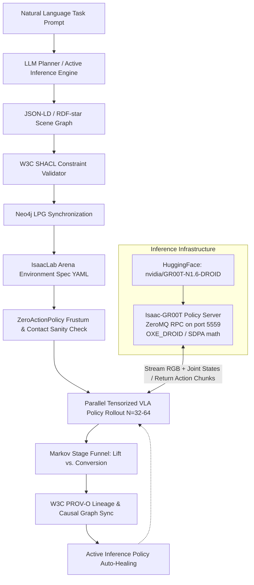
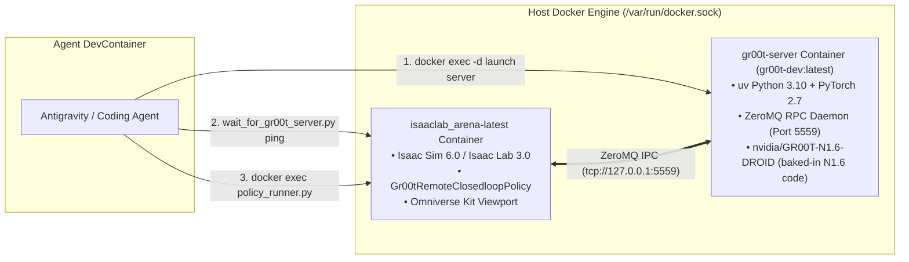

# Category A & Category B Tabletop Manipulation Suite
## Empirical Findings, Active Inference Diagnostics, Visualization & Knowledge Graph Playbook

**Authors / System**: IsaacLab-Arena Agentic Active Inference & Evaluation Engine
**Platform**: Isaac Sim 6.0 / Isaac Lab 3.0 / Franka DROID (`droid_abs_joint_pos`) / `nvidia/GR00T-N1.6-DROID`
**Repository Branch**: `dev/0.3.0-prerelease`
**Evidence update**: 2026-09-09 — distinguish verified executions, historical recorded labels, and proposed/generated-only scenarios. A policy class or client YAML does not establish the checkpoint that a historical server loaded.
**Location**: [`.agents/references/presentations/category_a_b_manipulation_experiments.md`](file:///workspaces/IsaacLab-Arena/.agents/references/presentations/category_a_b_manipulation_experiments.md)

---

## Executive Presentation Overview

This presentation consolidates the empirical results, architectural root-cause analyses, visual validation procedures, environment generation workflows, and Neo4j graph queries across two primary robotic manipulation domains:
* **🍎 Category A: Fresh Food & Kitchen Tabletop (Franka DROID / Single-Arm)**
* **🥫 Category B: Packaged Groceries & Pantry Sorting (Franka DROID / Single-Arm)**

### Previously run scenarios — highlighted shortlist

> [!IMPORTANT]
> **✅ PREVIOUSLY RUN** means completed policy episodes were recorded. It does **not** mean the task succeeded or placement was physically certified.

| Status | Category / ID | Scenario | Recovered execution history |
| :--- | :--- | :--- | :--- |
| **✅ PREVIOUSLY RUN** | **Category A — A1** | **Apple → wooden bowl** | **7 historical policy runs**, plus the current verified 2,000-step run. [5] |
| **✅ PREVIOUSLY RUN** | **Category B — B1** | **Tomato soup can → blue bin** | **7 historical policy runs**. [6] |
| **✅ PREVIOUSLY RUN** | **Category B — B4** | **Spam can → grey bin** | **3 historical policy runs**. [6] |
| **🟨 PREFLIGHT ONLY** | **Category B — B2** | **Mustard bottle → grey bin** | **2 zero-action reports; zero completed policy episodes**. Purple-crate placement is not demonstrated. [6] |

**⬜ NO COMPLETED RUN FOUND:** A2 banana → plate, A3 lemon → clay plate, A4 avocado → serving bowl, A5 bell pepper → blue bin, B3 cracker box → brown box, and B5 tuna → small plate. Some sibling specs exist, but they are not completed evaluation evidence.[5][6]

The separate **mustard → raisin box** task also has **🟨 PREFLIGHT ONLY** evidence (three zero-episode reports). Per-run rates and evidence links remain in Slide 1; the same status badges are repeated at each scenario below.[6]



---

### LLM Synthesis Engine: Terminal Session API Key Configuration & Multi-Model Matrix

The IsaacLab-Arena agentic environment generation and active inference healing loops support multiple frontier LLM providers. Before running any generation command, export the corresponding API key in your terminal session:

#### 1. Provider Export Commands for Terminal Session

##### Option A: OpenAI (Native API — GPT-6 Astra)
```bash
# Export your OpenAI API key in your host terminal
export OPENAI_API_KEY="sk-proj-..."
export OPENAI_MODEL="gpt-6-astra"
```

##### Option B: Google Gemini (Native API — Gemini 2.5 Pro / Flash)
```bash
# Export your Google Gemini API key in your host terminal
export GEMINI_API_KEY="AIzaSy..."
export GEMINI_MODEL="gemini-2.5-pro"
```

##### Option C: OpenRouter (Multi-Provider Aggregator — Claude Sonnet 4.5, GPT-6 Astra, Gemini 2.5 Pro)
```bash
# Export your OpenRouter API key in your host terminal
export OPENROUTER_API_KEY="sk-or-v1-..."
export OPENROUTER_MODEL="anthropic/claude-sonnet-4.5"
```

##### Option D: Automated Local `.env` Loading
You can also save all active keys in `/workspaces/IsaacLab-Arena/.env` (which is automatically parsed at startup):
```bash
OPENAI_API_KEY=sk-proj-...
GEMINI_API_KEY=AIzaSy...
OPENROUTER_API_KEY=sk-or-v1-...
```

#### 2. Passing Active API Keys into `docker exec`
When running the generation runner inside the Docker simulation container, forward the active key via the `-e` environment flag:

* **For OpenAI (GPT-6 Astra)**:
  `-e OPENAI_API_KEY="$OPENAI_API_KEY" ... --model "gpt-6-astra"`
* **For Google Gemini (Gemini 2.5 Pro)**:
  `-e GEMINI_API_KEY="$GEMINI_API_KEY" ... --model "gemini-2.5-pro"`
* **For OpenRouter (Claude Sonnet 4.5)**:
  `-e OPENROUTER_API_KEY="$OPENROUTER_API_KEY" ... --model "anthropic/claude-sonnet-4.5"`

---

## Slide 0: Verified N1.6-DROID Runtime Repair and Latest A1 Run

### What was fixed

Two independent client/server compatibility faults prevented the requested apple-to-bowl rollout. Both were reproduced before correction; neither required changing the generated scene or the checkpoint.[2]

| Boundary | Observed failure | Verified correction |
| :--- | :--- | :--- |
| Array serialization | `Video key 'exterior_image_1_left' must be a numpy array. Got <class 'dict'>` | Arena sent msgpack-numpy envelopes; the image-native N1.6 server decoded only `__ndarray_class__` / `as_npy`. Overlay **only** the tested `server_client.py` read-only; keep N1.6 model/processor code. |
| Default modalities | N1.6 expected one video frame but received two; the local scheduler expected 40 actions instead of the server's 32 | `Gr00tRemoteClosedloopPolicy` now obtains default modalities from `client.get_modality_config()` **before** allocating history/schedulers. Explicit modality files retain precedence and must match the server. |
| Runtime permissions | Image Python lived beneath root-only `/root`; old output directory was root-owned | Relocate the image's Python interpreter inside the server, then run inference as UID 1000. Run simulation as `ubuntu:1234`, with dedicated writable asset/Kit caches and output-directory access. |

Do not mount the full N1.7 checkout into an N1.6 model image. A ping alone is insufficient: the live synthetic probe verified finite `float32` action arrays of shapes `(1, 32, 7)` and `(1, 32, 1)`. Pickle rejection and legacy decoding were also tested. Synthetic probes establish transport compatibility, not task success.[2]

### Actual completed Kit evaluation — not a projected benchmark

| Field | Verified value |
| :--- | :--- |
| Scenario / immutable version selected | A1 `droid_apple_to_wooden_bowl`; `latest` resolved to `v3` |
| Served checkpoint | `nvidia/GR00T-N1.6-DROID`, revision `ae3ebe8d288971ac53aa30c756ea5cba0f52611b` |
| Embodiment / endpoint | `OXE_DROID`; `127.0.0.1:5559`; CUDA with SDPA `math` |
| Invocation | `--viz kit --num_envs 1 --num_steps 2000 --enable_cameras`; action chunk 16 |
| Completion | **2,000 / 2,000 policy steps; exit code 0** |
| Completed episodes / seeds | **2 episodes**, both seed 42; not independent-seed coverage |
| Recorded placement success | **0 / 2 (0%)** |
| Recorded movement / lift evidence | `object_moved_rate=1.0`; both episode traces reached the lift predicate, but this does not prove retained transport |
| Remaining task gate | `object_on_destination(force_threshold=0.1, velocity_threshold=0.1)` |
| Episode lengths | 1,000 and 1,000 simulator episode steps; do not equate their sum with the separately logged policy-step budget |
| Artifacts | [HTML report](../../../eval_output/droid_apple_to_wooden_bowl/viz_run/2026-09-09_04-37-42/index.html), episode JSONL, HDF5, PROV-O TTL; **no video recording requested** |

The runtime repair completed successfully, but neither episode achieved placement. These findings are backed by the run manifest and the two original episode records.[1][3]

### Verification and provenance limits

* Remote-policy/scheduler regression suite: **15 passed**; production/test/documentation pre-commit checks passed; full Sphinx HTML build passed.[2]
* Automatic `lineage.json` update was permission-denied; the pre-existing user file was left unchanged.[2]
* Neo4j readback found `EvaluationRun {id: 'eval_run_1788928970'}`, with two episodes and zero success, but **no `EVALUATED_GRAPH` target**. Graph-linked-only queries therefore miss this run.[2]
* The correctly configured server remained running after evaluation. Session details and restart commands are preserved in the [handoff](../../scratch/droid_n16_session_handoff.txt) and [verified manifest](../../scratch/droid_n16_verified_result.json).[1][2]

---

## Slide 1: Recovered Run Inventory — Recorded Labels, Not Certified Placements

The audit independently recounted **25 identified run directories: 18 nonempty runs and 7 zero-episode attempts/reports**, containing **406 episode records**. This includes the separate current 0/2 run. These are coverage counts, **not a pooled performance estimate**. Category A contributes seven historical apple runs (97 records); Category B contributes ten nonempty tomato/spam runs (307 records). All nonempty records use seed 42.[5][6][7]

**Read the columns literally:** `Success` is the archived boolean; `Lift` is a completed height-predicate event; `Complete` is `progress.all_complete`. None independently certifies retained grasp or physical containment. Conditional success given lift uses the **intersection** of the success and lift sets, not all successes divided by lift count. `?` marks an inferred version; unmarked historical versions have an exact lineage `eval_dir` link, but no hash-bound runtime configuration. The `Median` column is episode length across success-flagged episodes, in **environment steps**, not contact time or wall time.[5][6]

### Category A — apple → wooden bowl (all historical runs)

All timestamps in this table are 2026-09-01. Each timestamp links to the primary episode JSONL.[5][7]

| Version | Run | Success flags | Lift | Complete | Success ∩ lift / lift | Median success-episode steps |
| :--- | :--- | :--- | :--- | :--- | :--- | :--- |
| v1? | [02-03-32](../../../eval_output/droid_apple_to_wooden_bowl/2026-09-01_02-03-32/episode_results_rank0.jsonl) | 1/2 (50.0%) | 2/2 | 1/2 | 1/2 (50.0%) | 903 |
| v1 | [02-06-55](../../../eval_output/droid_apple_to_wooden_bowl/2026-09-01_02-06-55/episode_results_rank0.jsonl) | 0/2 (0%) | 2/2 | 0/2 | 0/2 (0%) | — |
| v2? | [02-13-59](../../../eval_output/droid_apple_to_wooden_bowl/2026-09-01_02-13-59/episode_results_rank0.jsonl) | 0/2 (0%) | 2/2 | 0/2 | 0/2 (0%) | — |
| v2? | [02-21-10](../../../eval_output/droid_apple_to_wooden_bowl/2026-09-01_02-21-10/episode_results_rank0.jsonl) | 0/8 (0%) | 7/8 | 0/8 | 0/7 (0%) | — |
| **v2** | [02-22-23](../../../eval_output/droid_apple_to_wooden_bowl/2026-09-01_02-22-23/episode_results_rank0.jsonl) | **8/65 (12.3%)** | **56/65** | **4/65** | **4/56 (7.1%)** | **694** |
| v3? | [04-04-44](../../../eval_output/droid_apple_to_wooden_bowl/2026-09-01_04-04-44/episode_results_rank0.jsonl) | 1/16 (6.2%) | 16/16 | 1/16 | 1/16 (6.2%) | 860 |
| v3 | [04-15-41](../../../eval_output/droid_apple_to_wooden_bowl/2026-09-01_04-15-41/episode_results_rank0.jsonl) | 0/2 (0%) | 2/2 | 0/2 | 0/2 (0%) | — |

The current 2026-09-09 v3 Kit run is **0/2 success, 2/2 lift events, 0/2 complete**, with a different lift predicate and score weights; keep it separate from these historical v3 records. Two other current-session attempts have empty JSONL files and no episode denominator.[3][5]

### Category B — packaged-grocery runs (all nonempty runs)

All timestamps below are 2026-09-01. Tomato means `droid_tomato_soup_to_blue_bin`; Spam means `droid_spam_can_to_grey_bin`.[6][7]

| Family / version | Run | Success flags | Lift | Complete | Success ∩ lift / lift | Median success-episode steps |
| :--- | :--- | :--- | :--- | :--- | :--- | :--- |
| Tomato v1? | [04-42-35](../../../eval_output/droid_tomato_soup_to_blue_bin/2026-09-01_04-42-35/episode_results_rank0.jsonl) | 1/20 (5.0%) | 17/20 | 1/20 | 1/17 (5.9%) | 392 |
| Tomato v1 | [04-52-54](../../../eval_output/droid_tomato_soup_to_blue_bin/2026-09-01_04-52-54/episode_results_rank0.jsonl) | 0/2 (0%) | 2/2 | 0/2 | 0/2 (0%) | — |
| Tomato v2? | [16-14-46](../../../eval_output/droid_tomato_soup_to_blue_bin/2026-09-01_16-14-46/episode_results_rank0.jsonl) | 1/1 (100.0%) | 1/1 | 0/1 | 1/1 (100.0%) | 455 |
| **Tomato v2** | [16-34-46](../../../eval_output/droid_tomato_soup_to_blue_bin/2026-09-01_16-34-46/episode_results_rank0.jsonl) | **23/50 (46.0%)** | 47/50 | **6/50** | **22/47 (46.8%)** | 401 |
| **Tomato v3?** | [17-27-51](../../../eval_output/droid_tomato_soup_to_blue_bin/2026-09-01_17-27-51/episode_results_rank0.jsonl) | **25/52 (48.1%)** | 44/52 | **11/52** | **23/44 (52.3%)** | 264 |
| Tomato v3 | [18-23-40](../../../eval_output/droid_tomato_soup_to_blue_bin/2026-09-01_18-23-40/episode_results_rank0.jsonl) | 0/1 (0%) | 1/1 | 0/1 | 0/1 (0%) | — |
| Tomato v4 | [18-40-38](../../../eval_output/droid_tomato_soup_to_blue_bin/2026-09-01_18-40-38/episode_results_rank0.jsonl) | 6/42 (14.3%) | 37/42 | 2/42 | 6/37 (16.2%) | 576 |
| **Spam v1?** | [19-09-49](../../../eval_output/droid_spam_can_to_grey_bin/2026-09-01_19-09-49/episode_results_rank0.jsonl) | **18/70 (25.7%)** | 68/70 | **2/70** | 18/68 (26.5%) | **413** |
| Spam v2 | [19-29-40](../../../eval_output/droid_spam_can_to_grey_bin/2026-09-01_19-29-40/episode_results_rank0.jsonl) | 13/67 (19.4%) | 49/67 | 3/67 | 13/49 (26.5%) | 434 |
| Spam v1 | [19-53-15](../../../eval_output/droid_spam_can_to_grey_bin/2026-09-01_19-53-15/episode_results_rank0.jsonl) | 0/2 (0%) | 1/2 | 0/2 | 0/1 (0%) | — |

**Mustard is preflight-only in the recovered records:** five zero-action reports have **N=0**, not “100% lift over one episode.” Two are `droid_pick_mustard_to_bin` (2026-08-29 `droid_mustard_test`, 2026-08-30 `debug_run`); three are the separate `mustard_above_raisin` task (2026-08-28 `00-50-14` and `00-52-18`, 2026-08-29 `mustard_test`). Their empty JSONL/default rates do not prove either task success or a physics-stability pass.[6]

### What else was recorded, and where

The [CSV inventory](category_a_b_run_inventory.csv) and [JSON inventory](category_a_b_run_inventory.json) retain every identified run, including empty ones, with evaluation IDs, source hashes, seed lists, observed environment IDs, version-link strength, success/lift/complete intersections, movement aggregates, median lengths, current-config context, checkpoint gaps, and Neo4j linkage. Detailed [Category A](../../scratch/category_ab_a_audit.md) and [Category B](../../scratch/category_ab_b_audit.md) audits preserve line-level conflicts and contact/lift-event duration statistics.[5][6][7]

**Do not promote the archived success flags to validated placements.** Apple v2 has four success-flagged episodes with no lift or destination event (JSONL lines 6, 35, 45, 47). Tomato's 52-episode run has 11 progress-complete episodes, only 10 of which are success-flagged. The mismatch may involve the historical harness, progress snapshots, or predicate semantics; this audit does not establish its root cause or silently relabel those episodes.[5][6]

---

## Slide 2: Three Foundational Discoveries & Architectural Invariants

### Discovery 1: Recorded Success Is a Predicate Label, Not Verified Containment
* Historical rim-contact/sliding explanations require their original video or trace evidence; the current run recorded no video and cannot independently certify those earlier causal claims.
* Current [`PickAndPlaceTask`](../../../isaaclab_arena/tasks/pick_and_place_task.py) uses contact and low velocity, optional axis-aligned proximity, and (by default) a prior lift gate. Destination **name substrings** such as `bin`, `bowl`, `box`, `basket`, `pail`, `crate`, and `pot` supply default `max_separation=(0.12, 0.12, 0.15)` when none is specified. This is a proximity heuristic, not a mesh-interior containment proof or a guarantee of retained grasp.
* Historical records do not automatically inherit today's predicate implementation. Preserve their original `success` labels, record predicate/version evidence where available, and avoid presenting movement or a one-step lift as successful pick-and-place.

### Discovery 2: Correct the Denominators and Timing Before Claiming a Chunk Optimum

* Apple v2's old 14.3% “conversion” divided **8 total success flags by 56 lifted episodes**, although four successes had no lift event. The conditional success-flag rate is **4/56 (7.1%)**. Its median successful-episode length is **694**, not 620; median length across all episodes is **1000**, and across progress-complete episodes **632.5**.[5][7]
* Tomato's N50 run has conditional success **22/47 (46.8%)**, not 23/47. The N52 run's **23/44 (52.3%)** intersection is correct, but it is not 23 verified containment placements: only 11 records have `all_complete=true`.[6][7]
* Tomato N52's **226** is the first destination-contact-event median among success-flagged episodes; median successful-episode length is **264**. Spam N70's old **175** is an upper-middle **lift** step, not placement duration (conventional lift median **173**, successful-episode median **413**). Spam N67's **284** is also a lift median, while its successful-episode median is **434**.[6]
* Current tomato v1/v2/v3 config files all specify chunk **16**; v4 specifies **8**. That conflicts with the old claimed chunk32 baseline, and no run-local launch/config receipt pins the executed chunk. Current Spam v1/v2 configs specify 16/8. Treat chunk values as current configuration/context, not established historical treatment assignments.[6]
* No historical `step_dt` was pinned. The current default `dt=0.005`, decimation=4 gives 0.02 seconds per environment step; **conditionally**, chunk32/16/8 would yield 1.5625/3.125/6.25 Hz, not the old doubled rates. Do not label these derived values as historical measurements.[6]

The recovered trials motivate a controlled chunk experiment; they do **not** establish a universal `chunk=16` optimum, statistically significant superiority, or diffusion-noise causation. Freeze checkpoint, spec, predicates, actual timing, and independent seeds before making that comparison.

### Discovery 3: Multi-Modal Diffusion VLA Temporal & State Invariants (GR00T-N1.7-3B Integration)
During closed-loop simulation evaluation with `nvidia/GR00T-N1.7-3B` (`OXE_DROID_RELATIVE_EEF_RELATIVE_JOINT`), three critical multi-modal invariants were identified and resolved in the evaluation adapter layer:

1. **Temporal Video Horizon Buffering (`[-15, 0]`)**:
   * The N1.7 multimodal DiT requires a temporal video window of 2 frames (`shape: (N, 2, H, W, C)`), sampling the visual history at $t-15$ and $t$. Passing single 4D frames caused `RuntimeError: Server error: Video key 'exterior_image_1_left's horizon must be 2. Got 1`.
   * **Fix**: Implemented a per-camera rolling deque history buffer `_video_history` of length $\max(|\delta|) + 1 = 16$ in [`Gr00tRemoteClosedloopPolicy`](file:///workspaces/IsaacLab-Arena/isaaclab_arena_gr00t/policy/gr00t_remote_closedloop_policy.py). On episode reset, the buffer initializes with replicate-padding of the first frame; on subsequent steps, new frames are pushed and sampled at `delta_indices` before calling the policy client.

2. **DROID End-Effector 9D State Pose Formulation (`eef_9d`)**:
   * The pre-trained DROID embodiment in N1.7 requires a 17D state vector: `[eef_9d (9), gripper_position (1), joint_position (7)]`. Passing only joint states caused `RuntimeError: Server error: State key 'eef_9d' must be in observation`.
   * **Fix**: Added `compute_droid_eef_9d(pos, quat_wxyz)` in [`gr00t_core.py`](file:///workspaces/IsaacLab-Arena/isaaclab_arena_gr00t/policy/gr00t_core.py) using the canonical egocentric rotation correction matrix:
     $$\mathbf{R}_{\text{eef}} = \mathbf{R}_{\text{quat}} \cdot \begin{bmatrix} 0 & 0 & -1 \\ -1 & 0 & 0 \\ 0 & 1 & 0 \end{bmatrix}$$
     and concatenating Cartesian XYZ with continuous 6D rotation ($\mathbf{R}_{:2, :}$). [`Gr00tRemoteClosedloopPolicy`](file:///workspaces/IsaacLab-Arena/isaaclab_arena_gr00t/policy/gr00t_remote_closedloop_policy.py) extracts `eef_pos` and `eef_quat` directly from the Isaac Sim observation group `observation["policy"]` to feed live EEF state.

3. **Elastic Action Chunk Horizon Slicing**:
   * GR00T-N1.7 yields a 40-step action chunk (`delta_indices: range(40)`). When evaluated in an environment with default `action_horizon: 32`, PyTorch raised `shape mismatch: value tensor of shape [40, 8] cannot be broadcast to indexing result of shape [1, 32, 8]`.
   * **Fix**: Updated [`ActionChunkScheduler`](file:///workspaces/IsaacLab-Arena/isaaclab_arena/policy/action_scheduling/action_chunk_scheduler.py) and [`SyncedBatchActionScheduler`](file:///workspaces/IsaacLab-Arena/isaaclab_arena/policy/action_scheduling/synced_batch_action_scheduler.py) to slice incoming chunks to `action_horizon` (`new_chunk[mask, : self.action_horizon]`), and made [`Gr00tRemoteClosedloopPolicy`](file:///workspaces/IsaacLab-Arena/isaaclab_arena_gr00t/policy/gr00t_remote_closedloop_policy.py) dynamically resolve `action_horizon = len(modality_configs["action"].delta_indices)` directly from the server.

---

## Slide 3: Policy Server Infrastructure — NVIDIA Isaac-GR00T (ZeroMQ RPC)

Before running any closed-loop policy evaluation or interactive policy visualization, the **Isaac-GR00T policy inference server** MUST be active in its container. The policy server evaluates the multimodal diffusion/transformer network (`AlternateVLDiT`) and serves action chunk trajectories to Isaac Sim over ZeroMQ RPC (`tcp://127.0.0.1:5559`).

> [!IMPORTANT]
> **Verify the endpoint, not just an open port**: the 2026-09-09 run verified a responding DROID server on `127.0.0.1:5559`, including real inference. Earlier tunnel conflicts are historical observations, not proof that ports 5555–5558 are always intercepted or that 5559 is permanently free. Inspect the actual owner and test application-layer responses before launch.

### Agent-Driven Execution Architecture (Docker-outside-of-Docker)
Because the DevContainer mounts the host Docker socket (`/var/run/docker.sock`), **this agent can autonomously launch, monitor, and manage the policy inference server inside its container via `docker exec`** without requiring manual user intervention or switching to a separate host terminal.



### Storage Volume Architecture: Host vs Container Mounts (`$MODELS_DIR` & `$DATASET_DIR`)

Per repository guidelines and reproduction standards, all heavy assets (large model checkpoints, multi-gigabyte HDF5 demonstration datasets, and evaluation artifacts) reside on the host workstation and are mounted into containers via volume binds:

| Volume Purpose | Host Path (`$HOME/...`) | Container Mount Path | Standard Environment Variable |
| :--- | :--- | :--- | :--- |
| **Locomanipulation Datasets** | `$HOME/datasets/isaaclab_arena/locomanipulation_tutorial` | `/datasets/isaaclab_arena/locomanipulation_tutorial` | `DATASET_DIR` |
| **Locomanipulation Checkpoints** | `$HOME/models/isaaclab_arena/locomanipulation_tutorial` | `/models/isaaclab_arena/locomanipulation_tutorial` | `MODELS_DIR` |
| **Locomanipulation Evaluations** | `$HOME/eval/isaaclab_arena/locomanipulation_tutorial` | `/eval/isaaclab_arena/locomanipulation_tutorial` | `EVAL_DIR` |
| **Shared Models Root** | `$HOME/models` | `/models` (and `/workspace/pretrained_ckpts` in `gr00t-server`) | `MODELS_HOST_MOUNT_DIRECTORY` |
| **HuggingFace Hub Cache** | `$HOME/.cache/huggingface` | `/root/.cache/huggingface` | `HF_HOME` |

#### Host Environment Variables
```bash
export DATASET_DIR=$HOME/datasets/isaaclab_arena/locomanipulation_tutorial
export MODELS_DIR=$HOME/models/isaaclab_arena/locomanipulation_tutorial
export EVAL_DIR=$HOME/eval/isaaclab_arena/locomanipulation_tutorial
```

#### In-Container Environment Variables (`isaaclab_arena-latest`, `gr00t-server`, DevContainer)
```bash
export DATASET_DIR=/datasets/isaaclab_arena/locomanipulation_tutorial
export MODELS_DIR=/models/isaaclab_arena/locomanipulation_tutorial
export EVAL_DIR=/eval/isaaclab_arena/locomanipulation_tutorial
```

---

### Step-by-Step Policy Server Launch via `docker exec`

#### Step 1: Launch the Compatible N1.6 Policy Server
The fixed server is already running. Reuse it after the checks below. For a future recreation, first explicitly stop/rename the intended server; the verified launcher refuses to overwrite an existing container:

```bash
cd /workspaces/IsaacLab-Arena
bash .agents/scratch/run_droid_n16_compatible.sh

# If this compatible container was stopped rather than removed:
# docker start gr00t-server
```

The [verified launcher](../../scratch/run_droid_n16_compatible.sh) preserves image-native N1.6 inference, overlays only `server_client.py`, mounts the existing model cache read-only/offline, and drops inference to UID/GID 1000. Its image/interpreter paths are local deployment facts, not portable defaults. Do not use the earlier raw `docker run` recipes: they omitted the transport overlay and confused editor paths with host bind sources.

| Mount identity verified for this checkout | Path |
| :--- | :--- |
| Editor checkout | `/workspaces/IsaacLab-Arena` |
| Docker-host checkout | `/home/tarfy/Documents/GitHub/BoredEngineer/IsaacLab-Arena` |
| Simulator checkout | `/workspaces/isaaclab_arena` |
| Existing server's host model cache | `/root/.cache/huggingface` → `/cache/huggingface` read-only |

The editor's `$HOME/.cache/huggingface` is a different mount. Rediscover these sources if moving to another clone or machine.

**Key Parameters**:
* `--model-path nvidia/GR00T-N1.6-DROID`: Exact model verified for the current run. Historical runs lacking server/checkpoint provenance remain unknown, not automatically attributed to this model.
* `--embodiment-tag OXE_DROID`: N1.6 DROID embodiment with **absolute** joint position actions matching `droid_abs_joint_pos`.
  * **Video**: Single-frame horizon (the sole `delta_indices` entry is 0) across `exterior_image_1_left` and `wrist_image_left`.
  * **State**: 8D vector (`joint_position`: 7D, `gripper_position`: 1D). No `eef_9d` required.
  * **Action**: 32-step trajectory chunk (`delta_indices: range(32)`). `joint_position` (RELATIVE) + `gripper_position` (ABSOLUTE).
* `--port 5559`: Endpoint verified for this deployment; recheck ownership and application responses before reuse.
* `GR00T_DIT_SDPA_MODE=math`: PyTorch SDPA math fallback for numerical stability.

---

#### Step 2: Discover the Simulator and Verify Real Inference
Discover the simulator by this clone's host mount, not by whichever editor container is listed first. A responding ping does not test ndarray serialization or modality compatibility. The following diagnostic uses explicitly synthetic observations and validates the N1.6 response shapes; it is not a manipulation evaluation.

```bash
export HOST_REPO=/home/tarfy/Documents/GitHub/BoredEngineer/IsaacLab-Arena
export ARENA_CONTAINER=$(docker ps --filter "volume=$HOST_REPO" \
  --filter ancestor=isaaclab_arena:latest --format '{{.Names}}')
test -n "$ARENA_CONTAINER"
docker exec -u ubuntu:1234 -w /workspaces/isaaclab_arena \
  "$ARENA_CONTAINER" /isaac-sim/python.sh \
  .agents/scratch/gr00t_droid_transport_probe.py --port 5559
```

The verified probe returned `synthetic_transport_probe: PASS`, with finite `float32` action arrays `(1, 32, 7)` and `(1, 32, 1)`. A model-specific synthetic probe should be run before, not concurrently with, a measured rollout.[2]

---

#### Step 3: Monitoring & Server Shutdown Instructions

##### A. Live Log Streaming & Port Verification
```bash
# Stream live inference server logs
docker logs -f gr00t-server

# Check ZeroMQ RPC port binding
nc -zv 127.0.0.1 5559 || lsof -i :5559
```

##### B. Stopping the GR00T Policy Inference Server
You can stop the server using any of the following methods depending on your workflow:

```bash
# Method 1: Helper script stop flag (Gracefully stops and REMOVES gr00t-server container)
./docker/run_gr00t_server.sh -k
# Note: Because -k removes the container, you must re-run ./docker/run_gr00t_server.sh to start again.

# Method 2: Stop container without deleting (Preserves container on disk so 'docker start gr00t-server' works)
docker stop gr00t-server

# Method 3: In-container process kill (Frees GPU VRAM & port 5559 while leaving container running)
docker exec gr00t-server pkill -f "run_gr00t_server.py"

# Method 4: Programmatic remote shutdown via ZeroMQ RPC kill endpoint
docker exec isaaclab_arena-latest /isaac-sim/python.sh -c "
from gr00t.policy.server_client import PolicyClient
try:
    client = PolicyClient(host='127.0.0.1', port=5559, strict=False)
    client.kill_server()
    print('✓ GR00T server stopped cleanly via ZeroMQ endpoint.')
except Exception as e:
    print('Error:', e)
"
```

##### C. Post-Stop Verification (GPU & Port Reclamation)
```bash
# Verify port 5559 is released
nc -zv 127.0.0.1 5559 2>&1 | grep -q "refused" && echo "✓ Port 5559 successfully released."

# Verify VRAM is freed
nvidia-smi --query-compute-apps=pid,process_name,used_memory --format=csv
```

---

## Slide 4: Category A — Fresh Food & Kitchen Tabletop Scenarios

### Which scenarios actually have recovered execution evidence?

| ID | Catalog task | Recovered status |
| :--- | :--- | :--- |
| **✅ A1** | **Apple → wooden bowl** | **PREVIOUSLY RUN**: seven historical nonempty runs, plus the current verified 0/2 run and two current empty attempts. |
| A2 | Banana → large plate | **Proposed only**. An existing sibling spec targets a wooden bowl and uses “next to Rubik's cube” prose; no execution recovered for either contract. |
| A3 | Lemon → clay plate | **Proposed only**; no matching generated spec or evaluation recovered. |
| A4 | Avocado → serving bowl | **Exact catalog task not recovered**. Existing avocado spec targets `wooden_bowl_hot3d_robolab`; generated-only, no execution recovered. |
| A5 | Bell pepper → blue bin | **Proposed only**; no matching generated spec or evaluation recovered. |

This classification is bounded to the audited repository outputs, generated specs, references, and mounted `/eval`; it is not proof that an unarchived run never happened. Commands below are catalog/generation templates unless explicitly marked verified. A prompt, YAML, or scene-build command is not an executed policy benchmark.[5]

### Common Platform Setup
* **Robot**: `droid_abs_joint_pos` at `[-0.55, 0.0, 0.0]`
* **Support Deck**: `maple_table_robolab` at `[-0.25, 0.0, 0.0]` (Surface $Z = 0.75\text{ m}$)
* **Perception**: External $45^\circ$ RGB (`external_camera_rgb`) + Wrist Camera (`wrist_camera_rgb`)
* **Policy Server**: `nvidia/GR00T-N1.6-DROID` (`OXE_DROID`) on port `5559`

---

### Scenario A1: Apple to Wooden Bowl (`droid_apple_to_wooden_bowl`)

> **✅ PREVIOUSLY RUN — 7 historical policy runs, plus the current verified run.** See Slide 1 for recorded rates and success/progress discrepancies.[5]

* **Source Object**: `apple_01_objaverse_robolab` (Front Right sector)
* **Target Container**: `wooden_bowl_hot3d_robolab` (Front Left sector)
* **Current verified result**: v3, 2026-09-09 Kit run, **0/2 recorded placement successes**, both seed 42. Both traces reached the lift predicate; neither completed the destination gate. Historical v2 rates are listed separately after the artifact audit, not used to infer the cause of this run's failure.[3]

#### 1. Environment Generation Commands (Multi-Model Options)
```bash
# Option A: OpenAI (GPT-6 Astra)
docker exec -it \
  -e OPENAI_API_KEY="$OPENAI_API_KEY" \
  isaaclab_arena-latest /isaac-sim/python.sh \
  isaaclab_arena_examples/agentic_environment_generation/environment_generation_runner.py \
  --mode generate \
  --model "gpt-6-astra" \
  --prompt "Create an environment for a Franka robot on a maple table where the task is to pick up the red apple from the front right and place it into the wooden bowl on the front left. Position the maple table at [-0.25, 0.0, 0.0] and use droid_abs_joint_pos at [-0.55, 0.0, 0.0]." \
  --env_name droid_apple_to_wooden_bowl \
  --out_dir /workspaces/isaaclab_arena/generated_envs/droid_apple_to_wooden_bowl

# Option B: Google Gemini (Gemini 2.5 Pro)
docker exec -it \
  -e GEMINI_API_KEY="$GEMINI_API_KEY" \
  isaaclab_arena-latest /isaac-sim/python.sh \
  isaaclab_arena_examples/agentic_environment_generation/environment_generation_runner.py \
  --mode generate \
  --model "gemini-2.5-pro" \
  --prompt "Create an environment for a Franka robot on a maple table where the task is to pick up the red apple from the front right and place it into the wooden bowl on the front left. Position the maple table at [-0.25, 0.0, 0.0] and use droid_abs_joint_pos at [-0.55, 0.0, 0.0]." \
  --env_name droid_apple_to_wooden_bowl \
  --out_dir /workspaces/isaaclab_arena/generated_envs/droid_apple_to_wooden_bowl

# Option C: Anthropic via OpenRouter (Claude Sonnet 4.5)
docker exec -it \
  -e OPENROUTER_API_KEY="$OPENROUTER_API_KEY" \
  isaaclab_arena-latest /isaac-sim/python.sh \
  isaaclab_arena_examples/agentic_environment_generation/environment_generation_runner.py \
  --mode generate \
  --model "anthropic/claude-sonnet-4.5" \
  --prompt "Create an environment for a Franka robot on a maple table where the task is to pick up the red apple from the front right and place it into the wooden bowl on the front left. Position the maple table at [-0.25, 0.0, 0.0] and use droid_abs_joint_pos at [-0.55, 0.0, 0.0]." \
  --env_name droid_apple_to_wooden_bowl \
  --out_dir /workspaces/isaaclab_arena/generated_envs/droid_apple_to_wooden_bowl
```

#### 2. Interactive 3D Visualization Commands
```bash
# Reuse the compatible server; follow Slide 3 if recreating it.
cd /workspaces/IsaacLab-Arena
DISPLAY=:1 bash .agents/scratch/run_droid_viz.sh
```

This is the actual verified 2,000-step command wrapper. It discovers the simulator, uses `ubuntu:1234`, sets dedicated writable `TMPDIR` and Kit portable root, and preserves the requested scene/policy YAML and `viz_run` output base. `DISPLAY=:1` was tested with non-root `XOpenDisplay`; no blanket `xhost +` permission was needed. The output-base directory must be writable before a future non-root run.

#### 3. Neo4j Graph Queries
```cypher
// 1. Inspect Environment Graph Topology & Asset Prim Bindings
MATCH (g:EnvironmentGraph)
WHERE g.name CONTAINS 'apple_to_wooden_bowl'
OPTIONAL MATCH (g)-[r]-(n)
RETURN g, r, n;

// 2. Inspect Reified Sector Clearance & Relative Spatial Factors
MATCH (g:EnvironmentGraph)-[:HAS_REIFIER]->(rf:ReifiedRelation)
WHERE g.name CONTAINS 'apple'
MATCH (rf)-[:REIFIES_SUBJECT]->(s), (rf)-[:REIFIES_OBJECT]->(t)
RETURN g.name, rf.relation_type, s.name, t.name, rf.clearance_radius, rf.nominal_height;

// 3. Include the verified current run even though its environment edge is missing.
MATCH (ev:EvaluationRun)
OPTIONAL MATCH (ev)-[:EVALUATED_GRAPH]->(g:EnvironmentGraph)
WITH ev, collect(g.name) AS environments
WHERE ev.id = 'eval_run_1788928970'
   OR any(name IN environments WHERE name CONTAINS 'apple')
RETURN ev.id, environments, ev.num_episodes, ev.success_rate,
       ev.mean_progress_score, ev.blocking_predicate, ev.metrics_payload;
```

---

### Scenario A2: Banana to Large Plate (`droid_banana_to_plate`)
> **⬜ NO COMPLETED RUN FOUND — proposed scenario; sibling generated spec is not this plate task.**

* **Audit status**: proposed-only; no matching spec/run. The visualization example below points to a **different generated banana-to-wooden-bowl variant**, not evidence for this plate scenario.[5]
* **Source Object**: `banana_ycb_robolab` (Front Right sector)
* **Target Container**: `plate_large_vomp_robolab` (Front Left sector)
* **Prompt**: *"Grasp the yellow banana from the right side of the table and set it onto the white ceramic plate on the left."*

#### 1. Environment Generation Command
```bash
docker exec -it \
  -e OPENROUTER_API_KEY="$OPENROUTER_API_KEY" \
  isaaclab_arena-latest /isaac-sim/python.sh \
  isaaclab_arena_examples/agentic_environment_generation/environment_generation_runner.py \
  --mode generate \
  --model "anthropic/claude-sonnet-4.5" \
  --prompt "Create an environment for a Franka robot on a maple table where the task is to grasp the yellow banana from the right side of the table and set it onto the white ceramic plate on the left. Use droid_abs_joint_pos at [-0.55, 0.0, 0.0] and maple_table_robolab at [-0.25, 0.0, 0.0]." \
  --env_name droid_banana_to_plate \
  --out_dir /workspaces/isaaclab_arena/generated_envs/droid_banana_to_plate
```

#### 2. Interactive 3D Visualization Command
```bash
docker exec -it \
  -e DISPLAY="$DISPLAY" \
  isaaclab_arena-latest /isaac-sim/python.sh \
  isaaclab_arena_examples/agentic_environment_generation/environment_generation_runner.py \
  --mode build \
  --viz kit \
  --num_envs 1 \
  --num_steps 1200 \
  --enable_cameras \
  --env_graph_spec_yaml /workspaces/isaaclab_arena/generated_envs/droid_rubiks_banana_bowl/droid_place_banana_next_to_rubiks_cube.yaml
```

#### 3. Neo4j Graph Query
```cypher
MATCH (o:RigidObject)-[r:PLACED_ON]->(target)
WHERE o.name CONTAINS 'banana' OR target.name CONTAINS 'plate'
RETURN o, r, target;
```

---

### Scenario A3: Lemon to Clay Plate (`droid_lemon_to_clay_plate`)
> **⬜ NO COMPLETED RUN FOUND — proposed scenario.**

* **Audit status**: proposed-only; the shown preflight path/command has no recovered execution artifact.[5]
* **Source Object**: `lemon_01_fruits_veggies_robolab` (Front Right sector)
* **Target Container**: `clay_plates_hot3d_robolab` (Front Left sector)
* **Prompt**: *"Pick up the fresh lemon from the front right and carefully place it on the clay plate at the front left."*

#### 1. Environment Generation Command
```bash
docker exec -it \
  -e OPENROUTER_API_KEY="$OPENROUTER_API_KEY" \
  isaaclab_arena-latest /isaac-sim/python.sh \
  isaaclab_arena_examples/agentic_environment_generation/environment_generation_runner.py \
  --mode generate \
  --model "anthropic/claude-sonnet-4.5" \
  --prompt "Create an environment for a Franka robot on a maple table where the task is to pick up the fresh lemon from the front right and carefully place it on the clay plate at the front left. Embodiment droid_abs_joint_pos at [-0.55, 0.0, 0.0]." \
  --env_name droid_lemon_to_clay_plate \
  --out_dir /workspaces/isaaclab_arena/generated_envs/droid_lemon_to_clay_plate
```

#### 2. Interactive 3D Visualization Command
```bash
docker exec -it \
  -e DISPLAY="$DISPLAY" \
  isaaclab_arena-latest /isaac-sim/python.sh \
  isaaclab_arena/evaluation/policy_runner.py \
  --viz kit \
  --policy_type isaaclab_arena.policy.zero_action_policy.ZeroActionPolicy \
  --num_steps 300 \
  --num_envs 1 \
  --enable_cameras \
  --env_graph_spec_yaml /workspaces/isaaclab_arena/generated_envs/droid_lemon_to_clay_plate/latest/droid_lemon_to_clay_plate.yaml \
  --output_base_dir /workspaces/isaaclab_arena/eval_output/droid_lemon_test/preflight
```

#### 3. Neo4j Graph Query
```cypher
MATCH (g:EnvironmentGraph)
WHERE g.name CONTAINS 'lemon'
OPTIONAL MATCH (g)-[r]-(n)
RETURN g, r, n;
```

---

### Scenario A4: Avocado to Serving Bowl (`droid_avocado_bowl`)
> **⬜ NO COMPLETED RUN FOUND — generated sibling targets a wooden bowl, not the catalog serving bowl.**

* **Source Object**: `avocado01_fruits_veggies_robolab` (Front Right sector)
* **Catalog target**: `serving_bowl_vomp_robolab`; **actual existing YAML target**: `wooden_bowl_hot3d_robolab`. No matching executed run was recovered; do not conflate these contracts.[5]
* **Existing Spec File**: [`generated_envs/droid_avocado_bowl/droid_avocado_to_bowl.yaml`](file:///workspaces/IsaacLab-Arena/generated_envs/droid_avocado_bowl/droid_avocado_to_bowl.yaml)

#### 1. Environment Generation Command
```bash
docker exec -it \
  -e OPENROUTER_API_KEY="$OPENROUTER_API_KEY" \
  isaaclab_arena-latest /isaac-sim/python.sh \
  isaaclab_arena_examples/agentic_environment_generation/environment_generation_runner.py \
  --mode resolve \
  --model "anthropic/claude-sonnet-4.5" \
  --prompt "Pick the green avocado from the right sector and place it inside the serving bowl on the left. Use droid_abs_joint_pos and maple_table_robolab." \
  --out_dir /workspaces/isaaclab_arena/generated_envs/droid_avocado_bowl
```

#### 2. Interactive 3D Visualization Command
```bash
docker exec -it \
  -e DISPLAY="$DISPLAY" \
  isaaclab_arena-latest /isaac-sim/python.sh \
  isaaclab_arena_examples/agentic_environment_generation/environment_generation_runner.py \
  --mode build \
  --viz kit \
  --num_envs 1 \
  --num_steps 1200 \
  --enable_cameras \
  --env_graph_spec_yaml /workspaces/isaaclab_arena/generated_envs/droid_avocado_bowl/droid_avocado_to_bowl.yaml
```

#### 3. Neo4j Graph Query
```cypher
MATCH (obj:RigidObject {name: 'avocado01_fruits_veggies_robolab'})-[r]-(rel)
RETURN obj, r, rel;
```

---

### Scenario A5: Red Bell Pepper to Blue Bin (`droid_bell_pepper_to_blue_bin`)
> **⬜ NO COMPLETED RUN FOUND — proposed scenario.**

* **Audit status**: proposed-only; no matching generated spec or evaluation recovered.[5]
* **Source Object**: `red_bell_pepper_objaverse_robolab` (Front Right sector)
* **Target Container**: `bin_b03_vomp_robolab` (Front Left sector)
* **Prompt**: *"Grasp the red bell pepper from the front right table sector and drop it into the blue bin on the front left."*

#### 1. Environment Generation Command
```bash
docker exec -it \
  -e OPENROUTER_API_KEY="$OPENROUTER_API_KEY" \
  isaaclab_arena-latest /isaac-sim/python.sh \
  isaaclab_arena_examples/agentic_environment_generation/environment_generation_runner.py \
  --mode generate \
  --model "anthropic/claude-sonnet-4.5" \
  --prompt "Create an environment for a Franka robot on a maple table where the task is to grasp the red bell pepper from the front right table sector and drop it into the blue bin on the front left." \
  --env_name droid_bell_pepper_to_blue_bin \
  --out_dir /workspaces/isaaclab_arena/generated_envs/droid_bell_pepper_to_blue_bin
```

#### 2. Interactive 3D Visualization Command
```bash
docker exec -it \
  -e DISPLAY="$DISPLAY" \
  isaaclab_arena-latest /isaac-sim/python.sh \
  isaaclab_arena_examples/agentic_environment_generation/environment_generation_runner.py \
  --mode build \
  --viz kit \
  --num_envs 1 \
  --num_steps 1200 \
  --enable_cameras \
  --env_graph_spec_yaml /workspaces/isaaclab_arena/generated_envs/droid_bell_pepper_to_blue_bin/latest/droid_bell_pepper_to_blue_bin.yaml
```

#### 3. Neo4j Graph Query
```cypher
MATCH (g:EnvironmentGraph)
WHERE g.name CONTAINS 'bell_pepper'
RETURN g;
```

---

## Slide 5: Category B — Packaged Groceries & Pantry Sorting Scenarios

### Which scenarios actually have recovered execution evidence?

| ID / related task | Recovered status |
| :--- | :--- |
| **✅ B1 Tomato soup → blue bin** | **PREVIOUSLY RUN**: seven nonempty archived runs; all success/progress counts shown in Slide 1. |
| **🟨 B2 Mustard → grey bin** | **PREFLIGHT ONLY**: two zero-action reports with N=0; no completed policy episode recovered. |
| B3 Cracker box → brown box | **Catalog-only**: no matching generated spec or evaluation recovered. |
| **✅ B4 Spam can → grey bin** | **PREVIOUSLY RUN**: three nonempty archived runs, including the later 0/2 run omitted from the old benchmark table. |
| B5 Tuna can → small plate | **Catalog-only**: no matching generated spec or evaluation recovered. |
| Mustard → raisin box | **Separate preflight task**: three zero-action N=0 reports; not grey-bin sorting. |
| Mustard → purple crate | Catalog prompt only; no matching generated spec/evaluation recovered. |
| Sugar → bowl; raisin → grey bin | Reference jobs/task configurations exist, but no matching completed run recovered. |

Other generated mustard variants have different names/assets and no matching run; do not collapse them into the evaluated-name spec. None of these absence statements extends beyond the audited sources.[6]

### Common Platform Setup
* **Robot**: `droid_abs_joint_pos` at `[-0.55, 0.0, 0.0]`
* **Affordance Characteristic**: Prismatic / Planar faces (Cylinders, Boxes, Tins) enabling high-friction parallel finger contact.
* **Measured distinction**: some archived tomato/Spam runs have high height-event rates but much lower progress-complete counts. Height events alone do not prove gripper alignment, stable grasp, or successful containment.[6]

---

### Scenario B1: Tomato Soup Can to Blue Bin (`droid_tomato_soup_to_blue_bin`)

> **✅ PREVIOUSLY RUN — 7 historical policy runs.** See Slide 1 for recorded rates; archived success flags and progress completion are reported separately.[6]

* **Source Object**: `tomato_soup_can_ycb_robolab` (Prismatic cylinder)
* **Target Container**: `bin_b03_vomp_robolab` (Blue sorting bin)
* **Recovered N52 run**: 25/52 (48.1%) success flags; 44/52 lift events; 23/44 (52.3%) success-given-lift; **11/52 progress-complete records**. v3 association is inferred, not hash-bound. The 226-step figure is a contact-event median, while median successful-episode length is 264 steps.[6][7]

#### 1. Environment Generation Commands (Multi-Model Options)
```bash
# Option A: OpenAI (GPT-6 Astra)
docker exec -it \
  -e OPENAI_API_KEY="$OPENAI_API_KEY" \
  isaaclab_arena-latest /isaac-sim/python.sh \
  isaaclab_arena_examples/agentic_environment_generation/environment_generation_runner.py \
  --mode generate \
  --model "gpt-6-astra" \
  --prompt "Pick up the red tomato soup can from the front right of the maple table and deposit it into the blue sorting bin on the front left. Position maple_table_robolab at [-0.25, 0.0, 0.0] and droid_abs_joint_pos at [-0.55, 0.0, 0.0]." \
  --env_name droid_tomato_soup_to_blue_bin \
  --out_dir /workspaces/isaaclab_arena/generated_envs/droid_tomato_soup_to_blue_bin

# Option B: Google Gemini (Gemini 2.5 Pro)
docker exec -it \
  -e GEMINI_API_KEY="$GEMINI_API_KEY" \
  isaaclab_arena-latest /isaac-sim/python.sh \
  isaaclab_arena_examples/agentic_environment_generation/environment_generation_runner.py \
  --mode generate \
  --model "gemini-2.5-pro" \
  --prompt "Pick up the red tomato soup can from the front right of the maple table and deposit it into the blue sorting bin on the front left. Position maple_table_robolab at [-0.25, 0.0, 0.0] and droid_abs_joint_pos at [-0.55, 0.0, 0.0]." \
  --env_name droid_tomato_soup_to_blue_bin \
  --out_dir /workspaces/isaaclab_arena/generated_envs/droid_tomato_soup_to_blue_bin

# Option C: Anthropic via OpenRouter (Claude Sonnet 4.5)
docker exec -it \
  -e OPENROUTER_API_KEY="$OPENROUTER_API_KEY" \
  isaaclab_arena-latest /isaac-sim/python.sh \
  isaaclab_arena_examples/agentic_environment_generation/environment_generation_runner.py \
  --mode generate \
  --model "anthropic/claude-sonnet-4.5" \
  --prompt "Pick up the red tomato soup can from the front right of the maple table and deposit it into the blue sorting bin on the front left. Position maple_table_robolab at [-0.25, 0.0, 0.0] and droid_abs_joint_pos at [-0.55, 0.0, 0.0]." \
  --env_name droid_tomato_soup_to_blue_bin \
  --out_dir /workspaces/isaaclab_arena/generated_envs/droid_tomato_soup_to_blue_bin
```

#### 2. Interactive 3D Visualization Commands
```bash
# STEP 0: Reuse the compatible N1.6-DROID server; see Slide 3 for recreation.
# Run Slide 3's real-inference probe before measuring this scenario.

# (Note: If the container was previously stopped without removal via 'docker stop gr00t-server', you can resume it with: docker start gr00t-server)

# STEP 1: Gated server readiness verification (blocks until policy model shards are ready)
docker exec isaaclab_arena-latest /isaac-sim/python.sh \
  isaaclab_arena_gr00t/utils/wait_for_gr00t_server.py \
  --host 127.0.0.1 \
  --port 5559 \
  --timeout-sec 60

# STEP 2: Use the verified display/non-root cache setup from Slide 0/3.
# Do not broaden X11 access if non-root XOpenDisplay already works.

# Option A: View the v3 Environment Assembly (Scene Only)
docker exec -it \
  -e DISPLAY="$DISPLAY" \
  isaaclab_arena-latest /isaac-sim/python.sh \
  isaaclab_arena_examples/agentic_environment_generation/environment_generation_runner.py \
  --mode build \
  --viz kit \
  --num_envs 1 \
  --num_steps 1200 \
  --enable_cameras \
  --env_graph_spec_yaml /workspaces/isaaclab_arena/generated_envs/droid_tomato_soup_to_blue_bin/v3/droid_tomato_soup_to_blue_bin.yaml

# Option B: Run Interactive Closed-Loop Policy Rollout (v3; not a proven chunk optimum)
docker exec -it \
  -e DISPLAY="$DISPLAY" \
  isaaclab_arena-latest /isaac-sim/python.sh \
  isaaclab_arena/evaluation/policy_runner.py \
  --viz kit \
  --policy_type isaaclab_arena_gr00t.policy.gr00t_remote_closedloop_policy.Gr00tRemoteClosedloopPolicy \
  --policy_config_yaml_path /workspaces/isaaclab_arena/generated_envs/droid_tomato_soup_to_blue_bin/v3/policy_config.yaml \
  --remote_host 127.0.0.1 \
  --remote_port 5559 \
  --num_steps 2000 \
  --num_envs 1 \
  --enable_cameras \
  --env_graph_spec_yaml /workspaces/isaaclab_arena/generated_envs/droid_tomato_soup_to_blue_bin/v3/droid_tomato_soup_to_blue_bin.yaml \
  --output_base_dir /workspaces/isaaclab_arena/eval_output/droid_tomato_soup_to_blue_bin/viz_run_v3
```

#### 3. Neo4j Graph Queries
```cypher
// 1. Trace the Version Lineage (v1 -> v2 -> v3 -> v4) and Derivation Patches
MATCH (child:EnvironmentGraph)-[r:WAS_DERIVED_FROM]->(parent:EnvironmentGraph)
WHERE child.name CONTAINS 'tomato_soup'
RETURN child.name, r.defect, r.patch_applied, parent.name;

// 2. Compare Multi-Version Quantitative Benchmark Results
MATCH (ev:EvaluationRun)-[:EVALUATED_GRAPH]->(g:EnvironmentGraph)
WHERE g.name CONTAINS 'tomato_soup'
RETURN g.name AS environment, ev.id AS evaluation_id,
       ev.num_episodes AS num_episodes, ev.success_rate AS success_rate,
       ev.metrics_payload AS recorded_metrics
ORDER BY environment;
```

---

### Scenario B2: Mustard Bottle to Grey Bin / Purple Crate (`droid_mustard_bin`)

> **🟨 PREFLIGHT ONLY — grey-bin zero-action runs were performed, but no completed policy episodes were recorded (N=0).** No purple-crate execution was recovered.[6]

* **Actual evaluated-name spec**: `droid_pick_mustard_to_bin` uses `mustard_bottle_hope_robolab` and `grey_bin_robolab`. The HOT3D/purple-crate catalog claims do not identify the recovered zero-action runs.[6]
* **Result status**: two zero-episode reports, not a 100%-lift or completed placement result.[6]
* **Evaluated Artifact**: [`eval_output/droid_mustard_test/2026-08-29_21-47-18`](file:///workspaces/IsaacLab-Arena/eval_output/droid_mustard_test/2026-08-29_21-47-18)

#### 1. Environment Generation Command
```bash
docker exec -it \
  -e OPENROUTER_API_KEY="$OPENROUTER_API_KEY" \
  isaaclab_arena-latest /isaac-sim/python.sh \
  isaaclab_arena_examples/agentic_environment_generation/environment_generation_runner.py \
  --mode resolve \
  --model "anthropic/claude-sonnet-4.5" \
  --prompt "Droid stands in front of the table, picks up the mustard bottle from the maple table and places it in the grey bin." \
  --out_dir /workspaces/isaaclab_arena/generated_envs/droid_mustard_bin
```

#### 2. Interactive 3D Visualization Commands
```bash
# Option A: Zero-Action Physics Settling & Stability Inspection
docker exec -it \
  -e DISPLAY="$DISPLAY" \
  isaaclab_arena-latest /isaac-sim/python.sh \
  isaaclab_arena/evaluation/policy_runner.py \
  --viz kit \
  --policy_type isaaclab_arena.policy.zero_action_policy.ZeroActionPolicy \
  --num_steps 300 \
  --num_envs 1 \
  --enable_cameras \
  --env_graph_spec_yaml /workspaces/isaaclab_arena/generated_envs/droid_mustard_bin/droid_pick_mustard_to_bin.yaml \
  --output_base_dir /workspaces/isaaclab_arena/eval_output/droid_mustard_test

# Option B: Interactive Scene Viewport Launch
docker exec -it \
  -e DISPLAY="$DISPLAY" \
  isaaclab_arena-latest /isaac-sim/python.sh \
  isaaclab_arena_examples/agentic_environment_generation/environment_generation_runner.py \
  --mode build \
  --viz kit \
  --num_envs 1 \
  --num_steps 1200 \
  --enable_cameras \
  --env_graph_spec_yaml /workspaces/isaaclab_arena/generated_envs/droid_mustard_bin/droid_pick_mustard_to_bin.yaml
```

#### 3. Neo4j Graph Query
```cypher
MATCH (g:EnvironmentGraph)
WHERE g.name CONTAINS 'mustard'
OPTIONAL MATCH (g)-[r]-(n)
RETURN g, r, n;
```

---

### Scenario B3: Cracker Box to Brown Box (`droid_cracker_box_to_brown_box`)
> **⬜ NO COMPLETED RUN FOUND — catalog-only scenario.**

* **Audit status**: catalog-only; no matching generated spec or evaluation recovered.[6]
* **Source Object**: `cracker_box` (Cheez-It cuboid packaging)
* **Target Container**: `brown_box` (Cardboard packing box)
* **Prompt**: *"Pick up the Cheez-It cracker box from the packing table and place it into the brown cardboard box."*

#### 1. Environment Generation Command
```bash
docker exec -it \
  -e OPENROUTER_API_KEY="$OPENROUTER_API_KEY" \
  isaaclab_arena-latest /isaac-sim/python.sh \
  isaaclab_arena_examples/agentic_environment_generation/environment_generation_runner.py \
  --mode generate \
  --model "anthropic/claude-sonnet-4.5" \
  --prompt "Create an environment for a Franka robot on a packing table where the task is to pick up the Cheez-It cracker box from the packing table and place it into the brown cardboard box. Use droid_abs_joint_pos at [-0.55, 0.0, 0.0]." \
  --env_name droid_cracker_box_to_brown_box \
  --out_dir /workspaces/isaaclab_arena/generated_envs/droid_cracker_box_to_brown_box
```

#### 2. Interactive 3D Visualization Command
```bash
docker exec -it \
  -e DISPLAY="$DISPLAY" \
  isaaclab_arena-latest /isaac-sim/python.sh \
  isaaclab_arena_examples/agentic_environment_generation/environment_generation_runner.py \
  --mode build \
  --viz kit \
  --num_envs 1 \
  --num_steps 1200 \
  --enable_cameras \
  --env_graph_spec_yaml /workspaces/isaaclab_arena/generated_envs/droid_cracker_box_to_brown_box/latest/droid_cracker_box_to_brown_box.yaml
```

#### 3. Neo4j Graph Query
```cypher
MATCH (g:EnvironmentGraph)
WHERE g.name CONTAINS 'cracker' OR g.name CONTAINS 'brown_box'
RETURN g;
```

---

### Scenario B4: Spam Can to Grey Bin (`droid_spam_can_to_grey_bin`)

> **✅ PREVIOUSLY RUN — 3 historical policy runs.** See Slide 1 for the 18/70, 13/67, and 0/2 recorded success results and their progress-completion counts.[6]

* **Source Object**: `spam_can_ycb_robolab` (Flat planar rectangular faces)
* **Target Container**: `grey_bin_robolab` (High sidewalls)
* **Recovered N70 run**: 68/70 height events, 18/70 (25.7%) success flags, **2/70 progress-complete records**. v1 association is inferred. The old 175-step number was an upper-middle lift step, not placement time; median successful-episode length is 413 steps.[6][7]

#### 1. Environment Generation Command
```bash
docker exec -it \
  -e OPENROUTER_API_KEY="$OPENROUTER_API_KEY" \
  isaaclab_arena-latest /isaac-sim/python.sh \
  isaaclab_arena_examples/agentic_environment_generation/environment_generation_runner.py \
  --mode generate \
  --model "anthropic/claude-sonnet-4.5" \
  --prompt "Create an environment for a Franka robot on a maple table where the task is to pick the blue Spam can from the right section and drop it into the grey bin on the left. Use droid_abs_joint_pos at [-0.55, 0.0, 0.0] and maple_table_robolab at [-0.25, 0.0, 0.0]." \
  --env_name droid_spam_can_to_grey_bin \
  --out_dir /workspaces/isaaclab_arena/generated_envs/droid_spam_can_to_grey_bin
```

#### 2. Interactive 3D Visualization Commands
```bash
# STEP 0: Reuse the compatible N1.6-DROID server; see Slide 3 for recreation.
# Run Slide 3's real-inference probe before measuring this scenario.

# STEP 1: Gated server readiness verification (blocks until policy model shards are ready)
docker exec isaaclab_arena-latest /isaac-sim/python.sh \
  isaaclab_arena_gr00t/utils/wait_for_gr00t_server.py \
  --host 127.0.0.1 \
  --port 5559 \
  --timeout-sec 60

# STEP 2: Use the verified display/non-root cache setup from Slide 0/3.
# Do not broaden X11 access if non-root XOpenDisplay already works.

# Option A: View Spam Can Scene Layout (Scene Only)
docker exec -it \
  -e DISPLAY="$DISPLAY" \
  isaaclab_arena-latest /isaac-sim/python.sh \
  isaaclab_arena_examples/agentic_environment_generation/environment_generation_runner.py \
  --mode build \
  --viz kit \
  --num_envs 1 \
  --num_steps 1200 \
  --enable_cameras \
  --env_graph_spec_yaml /workspaces/isaaclab_arena/generated_envs/droid_spam_can_to_grey_bin/v1/droid_spam_can_to_grey_bin.yaml

# Option B: Run Interactive Closed-Loop Policy Rollout via docker exec
docker exec -it \
  -e DISPLAY="$DISPLAY" \
  isaaclab_arena-latest /isaac-sim/python.sh \
  isaaclab_arena/evaluation/policy_runner.py \
  --viz kit \
  --policy_type isaaclab_arena_gr00t.policy.gr00t_remote_closedloop_policy.Gr00tRemoteClosedloopPolicy \
  --policy_config_yaml_path /workspaces/isaaclab_arena/generated_envs/droid_spam_can_to_grey_bin/v1/policy_config.yaml \
  --remote_host 127.0.0.1 \
  --remote_port 5559 \
  --num_steps 2000 \
  --num_envs 1 \
  --enable_cameras \
  --env_graph_spec_yaml /workspaces/isaaclab_arena/generated_envs/droid_spam_can_to_grey_bin/v1/droid_spam_can_to_grey_bin.yaml \
  --output_base_dir /workspaces/isaaclab_arena/eval_output/droid_spam_can_to_grey_bin/viz_run
```

#### 3. Neo4j Graph Queries
```cypher
// 1. Inspect Spam Can Scene Nodes & Receptacle Properties
MATCH (g:EnvironmentGraph)
WHERE g.name CONTAINS 'spam_can'
OPTIONAL MATCH (g)-[r]-(n)
RETURN g, r, n;

// 2. Query Empirical Results for Spam Can vs Tomato Soup (Affordance Comparison)
MATCH (ev:EvaluationRun)-[:EVALUATED_GRAPH]->(g:EnvironmentGraph)
WHERE g.name CONTAINS 'spam_can' OR g.name CONTAINS 'tomato_soup'
RETURN g.name, ev.id, ev.num_episodes, ev.success_rate, ev.metrics_payload;
```

---

### Scenario B5: Tuna Can to Small Plate (`droid_tuna_can_to_small_plate`)
> **⬜ NO COMPLETED RUN FOUND — catalog-only scenario.**

* **Audit status**: catalog-only; no matching generated spec or evaluation recovered.[6]
* **Source Object**: `tuna_can_ycb_robolab` (Low-profile flat cylinder)
* **Target Container**: `plate_small_vomp_robolab` (Shallow flat plate)
* **Prompt**: *"Pick up the tuna can from the front right sector and set it onto the small plate on the front left."*

#### 1. Environment Generation Command
```bash
docker exec -it \
  -e OPENROUTER_API_KEY="$OPENROUTER_API_KEY" \
  isaaclab_arena-latest /isaac-sim/python.sh \
  isaaclab_arena_examples/agentic_environment_generation/environment_generation_runner.py \
  --mode generate \
  --model "anthropic/claude-sonnet-4.5" \
  --prompt "Create an environment for a Franka robot on a maple table where the task is to pick up the tuna can from the front right sector and set it onto the small plate on the front left." \
  --env_name droid_tuna_can_to_small_plate \
  --out_dir /workspaces/isaaclab_arena/generated_envs/droid_tuna_can_to_small_plate
```

#### 2. Interactive 3D Visualization Command
```bash
docker exec -it \
  -e DISPLAY="$DISPLAY" \
  isaaclab_arena-latest /isaac-sim/python.sh \
  isaaclab_arena_examples/agentic_environment_generation/environment_generation_runner.py \
  --mode build \
  --viz kit \
  --num_envs 1 \
  --num_steps 1200 \
  --enable_cameras \
  --env_graph_spec_yaml /workspaces/isaaclab_arena/generated_envs/droid_tuna_can_to_small_plate/latest/droid_tuna_can_to_small_plate.yaml
```

#### 3. Neo4j Graph Query
```cypher
MATCH (g:EnvironmentGraph)
WHERE g.name CONTAINS 'tuna'
RETURN g;
```

---

### Core Active Inference Testbed Anchor: Rubik's Cube to Blue Bin (`droid_rubiks_cube_to_blue_bin`)
* **Versions Tested**: `v1` through `v9` in [`generated_envs/droid_rubiks_cube_to_blue_bin/`](file:///workspaces/IsaacLab-Arena/generated_envs/droid_rubiks_cube_to_blue_bin).
* **Role**: Primary calibration anchor for testing spatial prompting, bounding box definitions, and temporal action chunking sweeps.

#### 1. Interactive 3D Visualization Commands
```bash
# STEP 0: Reuse the compatible N1.6-DROID server; see Slide 3 for recreation.
# Run Slide 3's real-inference probe before measuring this scenario.

# STEP 1: Gated server readiness verification (blocks until policy model shards are ready)
docker exec isaaclab_arena-latest /isaac-sim/python.sh \
  isaaclab_arena_gr00t/utils/wait_for_gr00t_server.py \
  --host 127.0.0.1 \
  --port 5559 \
  --timeout-sec 60

# STEP 2: Use the verified display/non-root cache setup from Slide 0/3.
# Do not broaden X11 access if non-root XOpenDisplay already works.

# Option A: View Scene Layout
docker exec -it \
  -e DISPLAY="$DISPLAY" \
  isaaclab_arena-latest /isaac-sim/python.sh \
  isaaclab_arena_examples/agentic_environment_generation/environment_generation_runner.py \
  --mode build \
  --viz kit \
  --num_envs 1 \
  --num_steps 1200 \
  --enable_cameras \
  --env_graph_spec_yaml /workspaces/isaaclab_arena/generated_envs/droid_rubiks_cube_to_blue_bin/v5/droid_rubiks_cube_to_blue_bin.yaml

# Option B: Run Interactive Closed-Loop Policy Rollout via docker exec
docker exec -it \
  -e DISPLAY="$DISPLAY" \
  isaaclab_arena-latest /isaac-sim/python.sh \
  isaaclab_arena/evaluation/policy_runner.py \
  --viz kit \
  --policy_type isaaclab_arena_gr00t.policy.gr00t_remote_closedloop_policy.Gr00tRemoteClosedloopPolicy \
  --policy_config_yaml_path /workspaces/isaaclab_arena/generated_envs/droid_rubiks_cube_to_blue_bin/latest/policy_config.yaml \
  --remote_host 127.0.0.1 \
  --remote_port 5559 \
  --num_steps 2000 \
  --num_envs 1 \
  --enable_cameras \
  --env_graph_spec_yaml /workspaces/isaaclab_arena/generated_envs/droid_rubiks_cube_to_blue_bin/latest/droid_rubiks_cube_to_blue_bin.yaml
```

#### 2. Neo4j Graph Query (Lineage Across All 9 Versions)
```cypher
MATCH (child:EnvironmentGraph)-[r:WAS_DERIVED_FROM*1..5]->(root:EnvironmentGraph)
WHERE root.name CONTAINS 'rubiks_cube'
RETURN child, r, root;
```

#### 3. Empirical Diagnostics & Root-Cause Resolution (GR00T-N1.7-3B Integration)
During the initial closed-loop validation rollout against `nvidia/GR00T-N1.7-3B` on port 5559, three sequential architectural crashes occurred and were systematically resolved:

| Failure Mode | Runtime Error Message | Root Cause | Code Resolution |
| :--- | :--- | :--- | :--- |
| **Video Horizon Mismatch** | `RuntimeError: Server error: Video key 'exterior_image_1_left's horizon must be 2. Got 1` | N1.7 multimodal DiT requires a temporal video window (`delta_indices: [-15, 0]`), but the runner was passing 4D single frames `(N, H, W, C)`. | Implemented rolling deque history buffer `_video_history` ($\text{maxlen}=16$) in [`Gr00tRemoteClosedloopPolicy`](file:///workspaces/IsaacLab-Arena/isaaclab_arena_gr00t/policy/gr00t_remote_closedloop_policy.py) with replicate-padding on step 0 and slicing at `delta_indices`. |
| **Missing State Key `eef_9d`** | `RuntimeError: Server error: State key 'eef_9d' must be in observation` | `OXE_DROID_RELATIVE_EEF_RELATIVE_JOINT` requires a 17D state vector: `[eef_9d (9), gripper_position (1), joint_position (7)]`. Arena only mapped joint positions. | Added `compute_droid_eef_9d` in [`gr00t_core.py`](file:///workspaces/IsaacLab-Arena/isaaclab_arena_gr00t/policy/gr00t_core.py) using DROID's canonical matrix $\mathbf{R}_{\text{eef}} = \mathbf{R}_{\text{quat}} \cdot \mathbf{R}_{\text{correct}}$. Extracted `eef_pos` and `eef_quat` directly from Isaac Sim's `observation["policy"]`. |
| **Action Chunk Horizon Mismatch** | `RuntimeError: shape mismatch: value tensor of shape [40, 8] cannot be broadcast to indexing result of shape [1, 32, 8]` | The N1.7 server outputs a 40-step action trajectory, but the environment's `policy_config.yaml` allocated `action_horizon: 32`. `ActionChunkScheduler` tried to broadcast 40 steps into 32. | Updated [`ActionChunkScheduler`](file:///workspaces/IsaacLab-Arena/isaaclab_arena/policy/action_scheduling/action_chunk_scheduler.py) and [`SyncedBatchActionScheduler`](file:///workspaces/IsaacLab-Arena/isaaclab_arena/policy/action_scheduling/synced_batch_action_scheduler.py) to slice `new_chunk[mask, : self.action_horizon]`, and dynamically resolved `action_horizon` from `modality_configs["action"]`. |

##### Verification Evidence (End-to-End Simulation Rollout)
```
[policy_runner] 🔍 Phase 1 Settle Verification: Checking 3 entities (objects + robot) for stationarity...
  - 'rubiks_cube': lin_vel=0.0000 m/s, ang_vel=0.0009 rad/s -> ✅ SETTLED
  - 'blue_bin': lin_vel=0.0000 m/s, ang_vel=0.0004 rad/s -> ✅ SETTLED
  - 'robot': lin_vel=0.0000 m/s, ang_vel=0.0000 rad/s -> ✅ SETTLED
[policy_runner] ✅ All scene entities (including robot) are physically settled. Proceeding to policy inference.
Steps: 100%|██████████| 20/20 [00:02<00:00,  9.36step/s]
[policy_runner] 📜 Auto-updated lineage ledger for droid_rubiks_cube_to_blue_bin v9 with evaluation metrics.
Wrote evaluation report with 1 job(s) and 0 episode(s) to: /workspaces/isaaclab_arena/outputs/2026-09-09_03-48-53/index.html
Exit code: 0
```

---

## Slide 6: Neo4j Global Knowledge Graph & Active Inference Dashboard

### Audit finding: graph-linked queries are incomplete

The read-only 2026-09-09 snapshot contains **153 `EvaluationRun` nodes; 68 have no `EVALUATED_GRAPH` target**. These are whole-database counts, not Category A/B episode totals. The current apple run is one of the unlinked records. Its file/graph names differ (`droid_apple_to_wooden_bowl` versus `franka_droid_apple_to_bowl_maple_table`), so neither folder names nor graph links alone provide a complete history. Snapshot: [category_ab_graph_audit.json](../../scratch/category_ab_graph_audit.json).[4]

Recorded fields include `id`, `num_episodes`, `success_rate`, `metrics_payload`, and `ended_at`; newer runs may also have `all_complete_rate`, `mean_progress_score`, and `blocking_predicate`. The previous examples assumed `evaluation_id`, `place_success_rate`, `conversion_rate`, `chi2_pval`, and `median_steps`; those are not generic recorded properties. Some specialized evaluations have `lift_rate`, but it must not be assumed for every run. Recover episode-level duration and conditional rates from the source files.

```cypher
// Read-only discovery: retain unlinked evaluations and raw payloads.
MATCH (ev:EvaluationRun)
OPTIONAL MATCH (ev)-[:EVALUATED_GRAPH]->(g:EnvironmentGraph)
WITH ev, collect(DISTINCT g.name) AS environments
OPTIONAL MATCH (ev)-[:USED_POLICY]->(p:Policy)
RETURN ev.id, environments, collect(DISTINCT p.name) AS policies,
       ev.num_episodes, ev.success_rate, ev.metrics_payload, ev.ended_at
ORDER BY ev.ended_at;
```

Join this output to each local TTL's evaluation ID. Do not count the JSONL, TTL, HTML report, lineage entry, and Neo4j node as separate trials, and do not treat a zero-episode preflight's default `success_rate=0.0` as an observed failure rate.

The graph database container `neo4j-arena` runs locally and exposes:
* **Web UI**: [http://localhost:7475](http://localhost:7475) (User: `neo4j`, Password: `isaaclab_arena_password`)
* **Bolt Protocol**: `bolt://localhost:7688` (Host) / `bolt://172.17.0.2:7687` (Docker container network)

### 1. Global Scene & Evaluation Graph Overview
```cypher
// Explore all Environment Graphs, Policies, and Evaluations
MATCH (e:EvaluationRun)-[r1:EVALUATED_GRAPH]->(g:EnvironmentGraph)
OPTIONAL MATCH (e)-[r2:USED_POLICY]->(p:Policy)
OPTIONAL MATCH (g)-[r3:CONTAINS_OBJECT]->(o:RigidObject)
RETURN e, r1, g, r2, p, r3, o LIMIT 100;
```

### 2. Per-Run Success Evidence Before Any Cross-Affordance Analysis
```cypher
// Start from observed counts, not an unweighted average of unrelated run rates.
MATCH (ev:EvaluationRun)
WHERE ev.num_episodes > 0
OPTIONAL MATCH (ev)-[:EVALUATED_GRAPH]->(g:EnvironmentGraph)
RETURN ev.id, collect(DISTINCT g.name) AS environments,
       ev.num_episodes, ev.success_rate, ev.metrics_payload;
```

### 3. Active Inference Causal Derivation & Auto-Healing Trace
```cypher
// Trace causal derivations where an automated policy or spatial patch was applied
MATCH (child:EnvironmentGraph)-[r:WAS_DERIVED_FROM]->(parent:EnvironmentGraph)
RETURN child.name AS repaired_env,
       r.defect AS detected_defect,
       r.patch_applied AS applied_patch,
       r.p_value AS statistical_significance,
       parent.name AS original_env;
```

---

## Slide 7: Operational Runbook & Best Practices

1. **Terminal Session API Key Export Recipes (Multi-LLM Synthesis Engine)**:
   Before synthesizing new robotic environments, export your chosen LLM provider's API key in your active terminal session or `.env` configuration file:
   ```bash
   # Option A: OpenAI (Native API — GPT-6 Astra)
   export OPENAI_API_KEY="sk-proj-..."
   export OPENAI_MODEL="gpt-6-astra"

   # Option B: Google Gemini (Native API — Gemini 2.5 Pro / Flash)
   export GEMINI_API_KEY="AIzaSy..."
   export GEMINI_MODEL="gemini-2.5-pro"

   # Option C: OpenRouter (Multi-Provider Aggregator — Claude Sonnet 4.5, GPT-6 Astra, Gemini 2.5 Pro)
   export OPENROUTER_API_KEY="sk-or-v1-..."
   export OPENROUTER_MODEL="anthropic/claude-sonnet-4.5"

   # Option D: Persistent .env configuration file (loaded automatically by the runner)
   cat << 'EOF' > /workspaces/IsaacLab-Arena/.env
   OPENAI_API_KEY=sk-proj-...
   GEMINI_API_KEY=AIzaSy...
   OPENROUTER_API_KEY=sk-or-v1-...
   EOF
   ```
   When launching the environment generation runner inside the Docker simulation container, forward the active key via `-e`:
   ```bash
   docker exec -it -e OPENAI_API_KEY="$OPENAI_API_KEY" isaaclab_arena-latest ...   # For OpenAI (gpt-6-astra)
   docker exec -it -e GEMINI_API_KEY="$GEMINI_API_KEY" isaaclab_arena-latest ...   # For Gemini (gemini-2.5-pro)
   docker exec -it -e OPENROUTER_API_KEY="$OPENROUTER_API_KEY" isaaclab_arena-latest ... # For OpenRouter
   ```

2. **Policy Server Autonomous Container Launch**:
   Always launch the GR00T policy server daemon inside its container and verify readiness before starting rollouts:
   ```bash
   # Only when recreating a server that has been explicitly stopped/renamed:
   bash .agents/scratch/run_droid_n16_compatible.sh

   # Or if the container was previously paused with 'docker stop gr00t-server':
   # docker start gr00t-server

   # Gated readiness verification (waits for model shards to load and answers ping)
   docker exec isaaclab_arena-latest /isaac-sim/python.sh \
     isaaclab_arena_gr00t/utils/wait_for_gr00t_server.py \
     --host 127.0.0.1 \
     --port 5559 \
     --timeout-sec 60
   ```
3. **X11 Forwarding for Container GUI Visualization**:
   Verify non-root display access first. On the audited host, `DISPLAY=:1` and the abstract X11 socket worked without broadening access; use the verified A1 launcher for its cache/output setup. Rediscover display and user/group permissions on another machine.
4. **Separate Parallelism from Statistical Evidence**:
   `num_envs` is concurrency, not an episode denominator or a guarantee of statistical significance. Report actual completed episodes, independent seeds, censoring, and per-run policy/spec identity. Do not pool different versions or repeated seeds to manufacture a robustness claim.
5. **Container Auto-Guarding Invariant**:
   Inspect the actual lift/contact/velocity/proximity contract in [`PickAndPlaceTask`](../../../isaaclab_arena/tasks/pick_and_place_task.py). A proximity box is not proof of containment; qualify historical labels whose predicate implementation was not preserved.
6. **Diffusion Temporal Action Chunking**:
   Treat chunk length as an experimental variable. Historical chunk comparisons do not establish a universal optimum or isolate sampler noise from changes in scenes, seeds, predicates, and checkpoint state. The current N1.6 run used chunk 16 and still achieved 0/2 placements.
7. **Mounted Volume Environment Variables (`$MODELS_DIR` & `$DATASET_DIR`)**:
   Always set and verify the mount environment variables before executing fine-tuning, evaluation, or offline policy serving:
   ```bash
   # Host:
   export DATASET_DIR=$HOME/datasets/isaaclab_arena/locomanipulation_tutorial
   export MODELS_DIR=$HOME/models/isaaclab_arena/locomanipulation_tutorial

   # In-Container (isaaclab_arena-latest / gr00t-server):
   export DATASET_DIR=/datasets/isaaclab_arena/locomanipulation_tutorial
   export MODELS_DIR=/models/isaaclab_arena/locomanipulation_tutorial

   # Sanity check mount points
   test -d "$MODELS_DIR" && echo "MODELS_DIR mounted: OK"
   test -d "$DATASET_DIR" && echo "DATASET_DIR mounted: OK"
   ```
   Ensures offline model checkpoints (e.g. `$MODELS_DIR/checkpoint-20000`) and multi-gigabyte demonstration datasets (e.g. `$DATASET_DIR/arena_g1_loco_manipulation_dataset_generated.hdf5`) are consumed directly without redownloading.
8. **Policy Server Teardown & Clean Resource Deallocation**:
   When evaluation or visualization experiments conclude, tear down the policy server daemon to release VRAM and the ZeroMQ RPC port:
   ```bash
   # Option A: Full Teardown & Removal (Stops and deletes container)
   ./docker/run_gr00t_server.sh -k

   # Option B: Stop without Deletion (Preserves container on disk so 'docker start' works later)
   docker stop gr00t-server

   # Option C: In-container Process Kill (Frees GPU VRAM & port while leaving container running)
   docker exec gr00t-server pkill -f "run_gr00t_server.py" 2>/dev/null || true
   ```
9. **Multi-Modal Modality & Temporal Invariants Contract (GR00T-N1.7)**:
   * **Temporal Video Deque**: When serving policies with negative delta indices (`delta_indices: [-15, 0]`), ensure the policy adapter maintains a rolling deque buffer initialized with frame replication on reset. Never pass raw 4D single frames without the time dimension.
   * **DROID 17D State Space**: Ensure `eef_9d` is synthesized from `eef_pos` and `eef_quat` using the canonical DROID egocentric rotation matrix:
     $$\mathbf{R}_{\text{correct}} = \begin{bmatrix} 0 & 0 & -1 \\ -1 & 0 & 0 \\ 0 & 1 & 0 \end{bmatrix}$$
     to prevent state space distribution drift.
   * **Elastic Action Chunk Scheduling**: Schedulers ([`ActionChunkScheduler`](file:///workspaces/IsaacLab-Arena/isaaclab_arena/policy/action_scheduling/action_chunk_scheduler.py) / [`SyncedBatchActionScheduler`](file:///workspaces/IsaacLab-Arena/isaaclab_arena/policy/action_scheduling/synced_batch_action_scheduler.py)) slice predictions to `action_horizon` (`new_chunk[mask, : self.action_horizon]`), allowing policies predicting 40 steps to execute seamlessly regardless of environment config defaults.

## Sources

[1] file:///workspaces/IsaacLab-Arena/.agents/scratch/droid_n16_verified_result.json
[2] file:///workspaces/IsaacLab-Arena/.agents/scratch/droid_n16_session_handoff.txt
[3] file:///workspaces/IsaacLab-Arena/eval_output/droid_apple_to_wooden_bowl/viz_run/2026-09-09_04-37-42/episode_results_rank0.jsonl
[4] file:///workspaces/IsaacLab-Arena/.agents/scratch/category_ab_graph_audit.json
[5] file:///workspaces/IsaacLab-Arena/.agents/scratch/category_ab_a_audit.md
[6] file:///workspaces/IsaacLab-Arena/.agents/scratch/category_ab_b_audit.md
[7] file:///workspaces/IsaacLab-Arena/.agents/references/presentations/category_a_b_run_inventory.json
