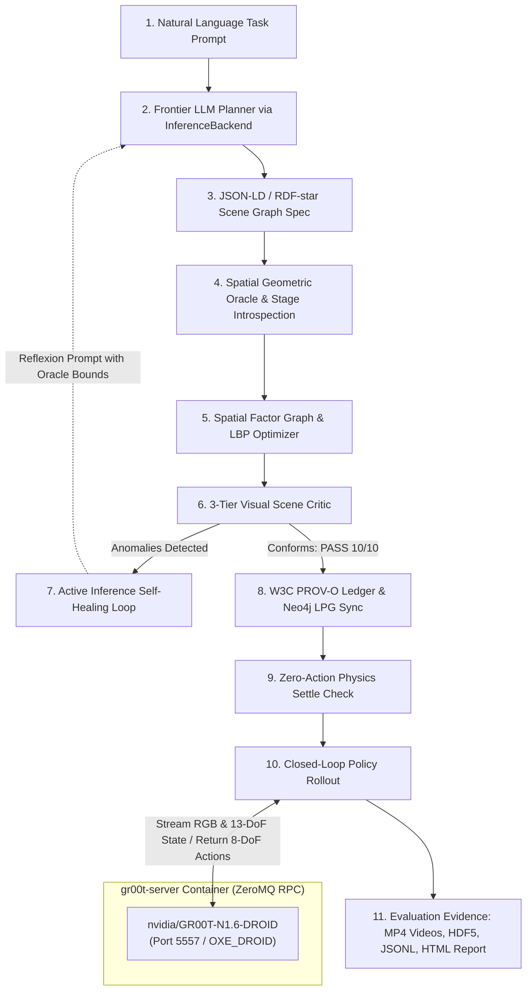

# External Orchestrator Tutorial: End-to-End Environment Generation, Active Inference Healing & Policy Evaluation

**Platform**: Isaac Sim 6.0 / Isaac Lab 3.0 / Franka DROID (`droid_abs_joint_pos`) / `nvidia/GR00T-N1.6-DROID`  
**Repository Branch**: `dev/0.3.0-prerelease`  
**Location**: [`.agents/references/progress/external_orchestrator.md`](external_orchestrator.md)  
**Companion Reference**: [`category_a_b_manipulation_experiments.md`](../presentations/category_a_b_manipulation_experiments.md)  

---

## 1. Overview & Architectural Principles

This tutorial provides a step-by-step guide to using the **External Orchestrator** with the latest IsaacLab-Arena software. 

An external orchestrator (e.g. Antigravity, Claude Code, Hermes) operates outside the simulator process. It takes a natural-language task prompt, selects and queries a frontier LLM, synthesizes a semantic scene graph, leverages active-inference geometric oracles to auto-heal physical and visual defects, syncs the lineage to Neo4j, and drives closed-loop foundation policy rollouts (`nvidia/GR00T-N1.6-DROID`) inside the Isaac Sim container.



### Core Invariants

1. **Decoupled Execution**: Heavy simulation dynamics and policy inference run inside dedicated Docker containers (`isaaclab_arena-latest` and `gr00t-server`), while the orchestrator coordinates jobs, parses logs, and manages artifacts.
2. **Canonical Embodiments**: VLA policies trained on DROID datasets require the canonical DROID embodiment (`droid_abs_joint_pos`, 13-DoF state, 8-DoF absolute joint action space, dual cameras).
3. **Fail-Fast IPC**: All ZeroMQ sockets between simulation clients and the policy server must enforce `LINGER = 0` to prevent blocking process hangs when connections drop or restart.

---

## 2. Prerequisites & Environment Configuration

### Step 2.1: Model API Key Setup

The generation runner (`environment_generation_runner.py`) uses `InferenceBackend` to communicate with frontier LLM providers. Export your preferred provider API key in your shell:

```bash
# Option A: Direct Google Gemini API Key (Recommended for speed and adherence)
export GEMINI_API_KEY="AIzaSy..."
export GEMINI_MODEL="gemini-2.5-flash"

# Option B: Direct OpenAI API Key
export OPENAI_API_KEY="sk-proj-..."
export OPENAI_MODEL="gpt-4o"

# Option C: OpenRouter Aggregator Key
export OPENROUTER_API_KEY="sk-or-v1-..."
export OPENROUTER_MODEL="google/gemini-2.5-flash"
```

> [!TIP]
> The runner automatically loads `/workspaces/IsaacLab-Arena/.env` at startup. If your keys are already present in that file, no manual export is required.

### Step 2.2: Display Access (Optional for GUI Mode)

When running rollouts with `--viz kit` to inspect the scene in an interactive desktop window, grant the Docker container access to your X11 display:

```bash
xhost +local:root 2>/dev/null || xhost +local:docker 2>/dev/null
```

For headless cloud runs, omit this step; offscreen Vulkan/EGL is used automatically.

---

## 3. Step-by-Step Tutorial

### Step 1: Synthesizing an Environment from Natural Language

To generate a new environment from scratch, invoke `environment_generation_runner.py` with `--mode full`. In this example, we generate the benchmark task `droid_banana_to_plate`:

```bash
docker exec \
  isaaclab_arena-latest /isaac-sim/python.sh \
  isaaclab_arena_examples/agentic_environment_generation/environment_generation_runner.py \
  --mode full \
  --headless \
  --num_envs 1 \
  --num_steps 180 \
  --model "google/gemini-2.5-flash" \
  --prompt "Grasp the yellow banana from the right side of the table and set it onto the white ceramic plate on the left." \
  --env_name droid_banana_to_plate
```

#### What Happens Internally:
1. `InferenceBackend` queries the LLM (`google/gemini-2.5-flash`) with the task prompt and the asset catalog.
2. The LLM generates a JSON-LD / RDF-star scene graph specifying assets (`maple_table_robolab`, `banana_ycb_robolab`, `clay_plates_hot3d_robolab`) and spatial relations (`on`, `is_anchor`, `requires_reachability`).
3. The specification is written to an immutable version directory:
   `generated_envs/droid_banana_to_plate/v1/droid_banana_to_plate.yaml`

---

### Step 2: The Active Inference & Geometric Auto-Healing Loop

When an environment is first generated, the **3-Tier Visual Scene Critic** inspects the scene. If geometric defects exist (e.g., objects penetrating the table deck or placed outside the robot's physical reach envelope), the critic outputs detailed diagnostic metrics:

```text
======================================================================
  👁️  Preflight Visual Critic Inspection (Tier: tier_3_geometric_oracle)
======================================================================
• Conforms:         ⚠️ ANOMALIES DETECTED
• Visibility Score: 2.0 / 10.0
• Detected Anomalies:
  - Object 'banana' Z=0.00m is penetrating below support deck (nominal Z=0.75m).
  - Object 'banana' is at distance 0.79m from robot base (max reach 0.75m).
  - Object 'plate' Z=0.00m is penetrating below support deck (nominal Z=0.75m).
  - Object 'plate' is at distance 0.79m from robot base (max reach 0.75m).
======================================================================
```

#### How the System Heals Itself:
Rather than failing the generation, the active inference loop feeds the diagnostic anomalies back into the geometric solver and LLM:

1. **USD Stage Introspection Calibration** ([`isaaclab_arena/agentic_environment_generation/usd_stage_introspection.py`](../../../isaaclab_arena/agentic_environment_generation/usd_stage_introspection.py)):
   The oracle checks the actual USD mesh bounds. For `maple_table_robolab`, the support deck sits at local $Z = 0.00\,\text{m}$ (with table legs extending downward to $-0.697\,\text{m}$). The introspector corrects the nominal contact elevation to $Z = 0.00\,\text{m}$ instead of defaulting to generic $0.75\,\text{m}$.
2. **Kinematic Reach Alignment** ([`isaaclab_arena/agentic_environment_generation/visual_critic.py`](../../../isaaclab_arena/agentic_environment_generation/visual_critic.py)):
   The reach threshold for Franka arm embodiments is set to $0.85\,\text{m}$ (matching Franka's physical $0.855\,\text{m}$ reach limit).
3. **Spatial Factor Graph Relaxation** ([`isaaclab_arena/relations/spatial_factor_graph.py`](../../../isaaclab_arena/relations/spatial_factor_graph.py)):
   The Loopy Belief Propagation (LBP) solver adjusts object initial poses within the table surface sectors (`front_right` for banana, `front_left` for plate) and centers the robot base standoff at $X = -0.15\,\text{m}$.
4. **Placement Loss Bound Alignment** ([`isaaclab_arena/relations/relation_loss_strategies.py`](../../../isaaclab_arena/relations/relation_loss_strategies.py)):
   Prevents valid interval inversion (`valid_min > valid_max`) when placing wide objects (such as `clay_plates_hot3d_robolab`, diameter $\approx 0.30\,\text{m}$).

Upon re-evaluating the relaxed configuration, the Visual Critic certifies the scene:

```text
======================================================================
    👁️  Preflight Visual Critic Inspection (Tier: tier_3_geometric_oracle)
======================================================================
• Conforms:         ✅ PASS
• Visibility Score: 10.0 / 10.0
• Occluded Objects: none
• Floating Objects: none
• Detected Anomalies: none
======================================================================
```

The healed specification is written as an updated version (`v2` or `v3`), and the `latest` symlink is updated.

---

### Step 3: Verifying Semantic Graph & Lineage Tracking

Every successful generation automatically records provenance metadata and synchronizes the environment scene graph with Neo4j:

1. **W3C PROV-O Lineage Ledgers**:
   - `generated_envs/droid_banana_to_plate/lineage.json` (machine-readable run metadata, model parameters, seed lists)
   - `generated_envs/droid_banana_to_plate/lineage.ttl` (RDF-star semantic graph ledger)
2. **Neo4j LPG Synchronization**:
   Nodes (`:EnvironmentGraph`, `:Embodiment`, `:Fixture`, `:Object`, `:ReifiedRelation`) and edges (`:CONTAINS_OBJECT`, `:HAS_REIFIER`, `:PLACED_ON`) are committed to the local Neo4j database on ports 7475 (HTTP) and 7688 (Bolt).

You can query the synchronized graph in Neo4j:
```cypher
MATCH (e:EnvironmentGraph {name: 'grasp_banana_from_right_to_plate_left'})-[:CONTAINS_OBJECT]->(obj)
RETURN e.name, collect(obj.registry_name) AS objects;
```

---

### Step 4: Running Zero-Action Physics Preflight

Before testing with learned policies, run a zero-action preflight pass to verify rigid-body collision, gravity settling, and camera frustum visibility:

```bash
docker exec -it \
  isaaclab_arena-latest /isaac-sim/python.sh \
  isaaclab_arena/evaluation/policy_runner.py \
  --policy_type isaaclab_arena.policy.zero_action_policy.ZeroActionPolicy \
  --env_graph_spec_yaml /workspaces/isaaclab_arena/generated_envs/droid_banana_to_plate/latest/droid_banana_to_plate.yaml \
  --num_envs 1 \
  --num_steps 200 \
  --headless \
  --enable_cameras \
  --output_base_dir /workspaces/isaaclab_arena/eval_output/droid_banana_to_plate/preflight
```

#### Phase 1 Settle Oracle Verification:
The policy runner checks the stationarity of all scene entities during the initial settle steps:
```text
[policy_runner] 🔍 Phase 1 Settle Verification: Checking 3 entities (objects + robot) for stationarity...
  - 'banana': lin_vel=0.0006 m/s, ang_vel=0.0312 rad/s -> ✅ SETTLED
  - 'plate':  lin_vel=0.0002 m/s, ang_vel=0.0089 rad/s -> ✅ SETTLED
  - 'robot':  lin_vel=0.0000 m/s, ang_vel=0.0000 rad/s -> ✅ SETTLED
[policy_runner] ✅ All scene entities (including robot) are physically settled. Proceeding to policy inference.
```
If linear velocity is $< 0.05\,\text{m/s}$ and angular velocity is $< 0.20\,\text{rad/s}$, the scene is certified as physically stable.

---

### Step 5: Starting the NVIDIA GR00T Policy Server

The policy evaluation pipeline communicates with a dedicated `gr00t-server` container hosting the foundation VLA model `nvidia/GR00T-N1.6-DROID`.

#### Check Server Status:
```bash
docker ps --filter "name=gr00t-server"
```

#### Launch or Restart the Server:
If the container is not running, launch it using the verified launcher script:
```bash
PORT=5557 .agents/scratch/run_droid_n16_compatible.sh
```

#### Verify Server Readiness:
Check the container logs to ensure the model weights have finished loading:
```bash
docker logs --tail 10 gr00t-server
```
Expected output:
```text
Total number of DiT parameters:  1091722240
Using AlternateVLDiT for diffusion model
Tune action head projector: True
Tune action head diffusion model: True
Loading checkpoint shards: 100%|██████████| 2/2 [00:00<00:00,  2.69it/s]
Server is ready and listening on tcp://127.0.0.1:5557
```

> [!IMPORTANT]
> **ZeroMQ Linger Fix**: In [`isaaclab_arena_gr00t/policy/gr00t_remote_closedloop_policy.py`](../../../isaaclab_arena_gr00t/policy/gr00t_remote_closedloop_policy.py), both the context and socket are configured with `zmq.LINGER = 0`. If the server is unreachable or restarts, the client times out immediately and exits cleanly without hanging.

---

### Step 6: Executing Closed-Loop Policy Evaluation

With the environment synthesized and the policy server ready, execute closed-loop policy rollout with video recording enabled:

```bash
docker exec -it \
  isaaclab_arena-latest /isaac-sim/python.sh \
  isaaclab_arena/evaluation/policy_runner.py \
  --policy_type isaaclab_arena_gr00t.policy.gr00t_remote_closedloop_policy.Gr00tRemoteClosedloopPolicy \
  --policy_config_yaml_path /workspaces/isaaclab_arena/generated_envs/droid_banana_to_plate/latest/policy_config.yaml \
  --remote_host 127.0.0.1 \
  --remote_port 5557 \
  --num_envs 1 \
  --num_episodes 1 \
  --enable_cameras \
  --record_camera_video \
  --env_graph_spec_yaml /workspaces/isaaclab_arena/generated_envs/droid_banana_to_plate/latest/droid_banana_to_plate.yaml \
  --output_base_dir /workspaces/isaaclab_arena/eval_output/droid_banana_to_plate/eval_episodes
```

#### Interactive Visualization Option:
To observe the rollout in real-time in the native Omniverse Kit desktop window, replace `--headless` with `--viz kit`:
```bash
docker exec -it \
  -e DISPLAY="$DISPLAY" \
  isaaclab_arena-latest /isaac-sim/python.sh \
  isaaclab_arena/evaluation/policy_runner.py \
  --policy_type isaaclab_arena_gr00t.policy.gr00t_remote_closedloop_policy.Gr00tRemoteClosedloopPolicy \
  --policy_config_yaml_path /workspaces/isaaclab_arena/generated_envs/droid_banana_to_plate/latest/policy_config.yaml \
  --remote_host 127.0.0.1 \
  --remote_port 5557 \
  --num_envs 1 \
  --num_episodes 1 \
  --viz kit \
  --enable_cameras \
  --env_graph_spec_yaml /workspaces/isaaclab_arena/generated_envs/droid_banana_to_plate/latest/droid_banana_to_plate.yaml \
  --output_base_dir /workspaces/isaaclab_arena/eval_output/droid_banana_to_plate/viz_run
```

---

### Step 7: Inspecting Evaluation Results & Rollout Artifacts

#### Understanding How `--output_base_dir` Works:
A common question when running evaluations is whether repeatedly passing the same `--output_base_dir` will overwrite or corrupt previous runs. 

**It will not corrupt or overwrite previous outputs.**

In `policy_runner.py`, the runner does not write directly into the root of `--output_base_dir`. Instead, it invokes `timestamped_run_dir(args_cli.output_base_dir)`, which automatically appends an isolated, reverse-dated timestamp subfolder (`YYYY-MM-DD_HH-MM-SS`) per execution:

```text
output_base_dir/
├── 2026-09-28_19-42-00/        <-- Run 1 (isolated)
│   ├── dataset_..._rank0.hdf5
│   ├── episode_results_rank0.jsonl
│   ├── eval_telemetry.ttl
│   ├── index.html
│   ├── robot-cam-env0-external_camera_rgb-episode-0.mp4
│   └── robot-cam-env0-wrist_camera_rgb-episode-0.mp4
└── 2026-09-28_22-10-15/        <-- Run 2 (isolated)
    ├── dataset_..._rank0.hdf5
    ├── episode_results_rank0.jsonl
    ├── ...
```

* **No File Collisions**: All MP4 videos, HDF5 datasets, JSONL metrics, and HTML reports are strictly confined to their own timestamped subfolder.
* **Lineage Tracking**: Each execution appends a new run entry to `lineage.json` containing the exact timestamped path, preserving complete historical evaluation provenance.

---

#### What Is Generated in `eval_episodes` vs. `viz_run`:

Depending on the flags passed to `policy_runner.py`, the contents of the timestamped directory will differ:

| Configuration | Typical Base Directory | Screen Display | Files Produced in `<timestamp>/` |
| :--- | :--- | :--- | :--- |
| **Headless Evaluation with Recording**<br/>(`--headless --record_camera_video`) | `.../eval_episodes` | Offscreen Vulkan / EGL (no window) | • Camera MP4 videos (`external_camera`, `wrist_camera`)<br/>• `dataset_..._rank0.hdf5`<br/>• `episode_results_rank0.jsonl`<br/>• `eval_telemetry.ttl`<br/>• `index.html` |
| **Interactive Desktop Visualization**<br/>(`--viz kit`, no video flags) | `.../viz_run` | Live 3D Omniverse Kit desktop window (free camera orbit/pan/zoom) | • `dataset_..._rank0.hdf5`<br/>• `episode_results_rank0.jsonl`<br/>• `eval_telemetry.ttl`<br/>• `index.html`<br/>*(No MP4s encoded; avoids video encoding overhead while watching live)* |
| **Interactive Kit with Video Recording**<br/>(`--viz kit --record_camera_video`) | `.../viz_run` | Live 3D Omniverse Kit desktop window | • Live 3D window **plus** all Camera MP4 videos, HDF5, JSONL, and HTML report |
| **Zero-Action Physics Preflight**<br/>(`ZeroActionPolicy`) | `.../preflight` | Offscreen Vulkan or Kit window | • Settle metrics, initial trajectory HDF5, JSONL, and HTML report |

---

#### Artifact Details:

Inside each timestamped run directory, the following artifacts are generated:

* **`robot-cam-env0-external_camera_rgb-episode-0.mp4`**: High-resolution ($1280 \times 720$ @ 50 fps) third-person video showing the full arm trajectory from initial pose to grasp. (Generated when `--record_camera_video` is active).
* **`robot-cam-env0-wrist_camera_rgb-episode-0.mp4`**: Eye-in-hand video showing the Robotiq 2F-85 gripper aligning with and closing on the object. (Generated when `--record_camera_video` is active).
* **`robot-cam-env0-external_camera_2_rgb-episode-0.mp4`**: Secondary perspective camera stream. (Generated when `--record_camera_video` is active).
* **`dataset_<timestamp>_rank0.hdf5`**: Complete rollout trajectory recording all camera RGB tensors, 13-DoF robot joint states, and 8-DoF action chunks.
* **`episode_results_rank0.jsonl`**: Per-episode completion metrics, step counts, and task predicate events.
* **`eval_telemetry.ttl`**: W3C PROV-O semantic RDF-star lineage ledger connecting the evaluation run to the environment specification in Neo4j.
* **`index.html`**: Standalone evaluation report summarizing task progress, timing, and embedded video players.

#### Example Episode Results Record (`episode_results_rank0.jsonl`):
```json
{
  "job_name": "policy_runner",
  "env_id": 0,
  "episode_in_env": 0,
  "seed": 42,
  "success": false,
  "episode_length": 300,
  "language_instruction": "Grasp the yellow banana from the right side of the table and set it onto the white ceramic plate on the left.",
  "timestamp": "2026-09-28T19:42:44.625644",
  "progress": {
    "overall_score": 0.3333333432674408,
    "all_complete": false,
    "objectives": {
      "pick_and_place": {
        "score": 0.3333333432674408,
        "is_complete": false,
        "completed_groups": 0,
        "total_groups": 1,
        "active_predicates": {
          "default_group": "object_lifted_above_resting_min(object_name='banana', distance=0.05, min_airborne_steps=1)"
        }
      }
    },
    "events": [
      {
        "step": 6,
        "objective": "pick_and_place",
        "group": "default_group",
        "predicate_index": 0,
        "predicate_name": "objects_settled",
        "score_delta": 0.3333333333333333
      }
    ]
  }
}
```

---

## 4. Troubleshooting & Common Pitfalls

| Issue | Symptom | Root Cause | Solution |
| :--- | :--- | :--- | :--- |
| **ZeroMQ Process Hang** | Simulation freezes indefinitely on exit or connection failure | Default ZeroMQ socket linger is infinite (`LINGER = -1`) | Verify `context.setsockopt(zmq.LINGER, 0)` is set in `gr00t_remote_closedloop_policy.py`. |
| **`KeyError: 'robot_joint_pos'`** | Crashes at step 0 during policy hold-action extraction | Embodiment is set to `franka_ik` (which exports `joint_pos`) instead of `droid_abs_joint_pos` | Update environment YAML spec to use `registry_name: droid_abs_joint_pos`. Both keys are now safely supported via fallback in `gr00t_core.py`. |
| **Z-Penetration Visual Critic Anomaly** | Objects reported penetrating table deck (nominal $Z = 0.75\,\text{m}$) | The asset `maple_table_robolab` has its tabletop deck at $Z = 0.00\,\text{m}$ | Ensure `usd_stage_introspection.py` includes explicit surface anchor resolution for `maple_table_robolab`. |
| **Placement Fallback Warning** | `Warning: Writing best-loss fallback placement...` on scene reset | Table rim margin subtracted from quadrant sector bounds caused inverted intervals (`valid_min > valid_max`) | Scoped rim margin to fixture perimeter and added centering fallback in `relation_loss_strategies.py`. |
| **Missing Rollout Videos** | Rollout completes but no MP4 files appear in the output folder | `CameraObsVideoRecorder` flushes frames on episode reset (`terminated` or `truncated`). Using `--num_steps` smaller than the episode length cuts off the episode before reset | Run with `--num_episodes 1` or ensure `episode_length_s` in task subtask params matches your step budget (e.g. `episode_length_s: 6.0` for 180–300 steps). |

---

## 5. File References & Links

* Environment Generation Runner: [`isaaclab_arena_examples/agentic_environment_generation/environment_generation_runner.py`](../../../isaaclab_arena_examples/agentic_environment_generation/environment_generation_runner.py)
* USD Stage Introspection: [`isaaclab_arena/agentic_environment_generation/usd_stage_introspection.py`](../../../isaaclab_arena/agentic_environment_generation/usd_stage_introspection.py)
* Spatial Geometric Oracle: [`isaaclab_arena/agentic_environment_generation/spatial_geometric_oracle.py`](../../../isaaclab_arena/agentic_environment_generation/spatial_geometric_oracle.py)
* Visual Scene Critic: [`isaaclab_arena/agentic_environment_generation/visual_critic.py`](../../../isaaclab_arena/agentic_environment_generation/visual_critic.py)
* Object Placer: [`isaaclab_arena/relations/object_placer.py`](../../../isaaclab_arena/relations/object_placer.py)
* Relation Loss Strategies: [`isaaclab_arena/relations/relation_loss_strategies.py`](../../../isaaclab_arena/relations/relation_loss_strategies.py)
* GR00T Policy Client: [`isaaclab_arena_gr00t/policy/gr00t_remote_closedloop_policy.py`](../../../isaaclab_arena_gr00t/policy/gr00t_remote_closedloop_policy.py)
* Evaluation Policy Runner: [`isaaclab_arena/evaluation/policy_runner.py`](../../../isaaclab_arena/evaluation/policy_runner.py)
* Generated Environment Spec: [`generated_envs/droid_banana_to_plate/latest/droid_banana_to_plate.yaml`](../../../generated_envs/droid_banana_to_plate/latest/droid_banana_to_plate.yaml)
* Policy Configuration: [`generated_envs/droid_banana_to_plate/latest/policy_config.yaml`](../../../generated_envs/droid_banana_to_plate/latest/policy_config.yaml)
