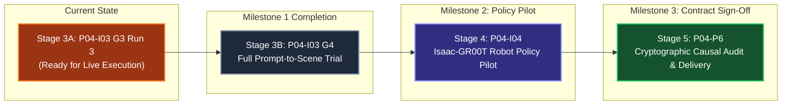

# IsaacLab-Arena: Comprehensive Project Progress Report
## From External Harness Orchestration to Application-Owned Autonomous Physical AI Pipeline

- **Document ID:** `PROG-REP-20260928-V1`
- **Created:** 2026-09-28
- **Status:** COMPLETE & AUTHORITATIVE (BASELINE FOR CONTRACT DELIVERY)
- **Target Repository:** `boredengineering/IsaacLab-Arena`
- **Upstream Plans & Architectural Specifications:**
  - [Plan 03: Bottom-Up Application Refactoring for GraphQL and Live Generation](../plans/event_mapping/event-mapping-refactoring_plan_03.md)
  - [Plan 04: Close Live-Execution Gaps and Validate Research Workflow](../plans/event_mapping/event-mapping-refactoring_plan_04.md)
  - [Plan 04 Implementation Index](../plans/plan04_implementation/README.md)
  - [What Remains to Finish Plan 04 (P04-GUIDE-01)](../plans/plan04_implementation/how-far-to-finish-plan04.md)
  - [Canonical Implementation Handoff](../plans/dashboard_cli_workflow_parity/research-stack-implementation-handoff.md)
  - [P04-I03-G3 Live Execution & Debugging Notes](../plans/plan04_implementation/p04-i03-g3-r3-debugging-notes.md)

---

## 1. Executive Summary & Contract Delivery Scorecard

### 1.1 Purpose of this Document
This document establishes the comprehensive progress baseline for the **IsaacLab-Arena Autonomous Environment Generation and Policy Evaluation Platform**. It details the architectural evolution of the system from an early experimental research harness manually driven by an external orchestrator into a production-grade, application-owned, verifiable software engine.

This document serves as the foundational technical report to draft the final **Contract Delivery Documentation**, outlining:
1. What was originally built and validated in the early research test harness.
2. The fundamental limitations that required replacing the external orchestrator with an internal, application-owned orchestrator.
3. The comprehensive development process executed across Plan 03 and Plan 04 to date.
4. The exact current technical status and recovery checkpoints.
5. The remaining concrete, bounded steps required to reach final contract completion and delivery.

### 1.2 Executive Delivery Scorecard

| Milestone / Work Package | Target Objective | Core Architectural Scope | Verification Status | Deliverable Artifacts & Proofs |
| :--- | :--- | :--- | :--- | :--- |
| **Milestone 0: Research Test Harness** | Prove individual engines function under external control | Ad-hoc CLI scripts, manual Docker commands, LLM-to-USD generation, standalone PhysX settling, heuristic checks. Driven externally by Hermes/agent. | **100% COMPLETED** (Superseded by Plan 03/04) | Standalone runner scripts (`environment_generation_runner.py`), synthetic test suite, initial SQLite journal logs. |
| **Plan 03: Architectural Refactoring** | Bottom-up Domain-Driven Design (DDD) for internal orchestration | Domain model extraction, GraphQL schema design, Neo4j single source of truth, `WorkflowService`, process fencing, removal of SQLite dual-writes. | **100% DESIGNED & FOUNDATIONS MERGED** | [Plan 03 Specification](../plans/event_mapping/event-mapping-refactoring_plan_03.md), core DDD contracts in `isaaclab_arena/agentic_environment_generation/`. |
| **Plan 04, Stage 1 (P04-I01)** | Application-owned native physical simulation slice | Headless Isaac Sim (PhysX) settling inside `isaaclab_arena-latest` on NVIDIA Blackwell GPU; 180 control steps; 3 camera sensor PNGs; scratch outside sealed artifacts. | **100% VERIFIED & CLOSED**<br>Independent Critic `ACCEPT` | Operation `p04-i01-native-a5` (`fcc052f8...`); [`LIVE_RESULT.txt`](../../../outputs/workflow/plan04-implementation/milestone1/installed-native-20260925T012042Z/p04-i01/LIVE_RESULT.txt); `native_settled=true`. |
| **Plan 04, Stage 2 (P04-I02)** | Installed multimodal visual assessment slice | Authenticated GraphQL submission evaluating unchanged 3-camera PNGs using `gpt-6-astra`; accounting-only cost enforcement; private credential delivery; clean process drain. | **100% INTEGRATION VERIFIED & CLOSED**<br>Independent Critic `ACCEPT` | Operation `p04-i02-visibility-r2`; structured `uncertain` visual verdict; zero process leaks; exact-byte readback; no-effect replay. |
| **Plan 04, Stage 3 (P04-I03)** | Autonomous full-scene workflow (Plan 03 V1) | Single GraphQL submission owning Prompt $\to$ Prior Retrieval $\to$ Generation $\to$ Validation $\to$ Realization $\to$ Settling $\to$ Multi-Camera Capture $\to$ Visual Assessment $\to$ Bounded Repair. | **CURRENT STAGE: IN RECOVERY / READY FOR RUN 3**<br>G1/G2 closed; 3 crash layers resolved; CPU verified. | [Debugging Notes](../plans/plan04_implementation/p04-i03-g3-r3-debugging-notes.md); candidate `5fd68136...`; verified fallback in `native_capture.py`; ceiling expanded to 10 releases. |
| **Plan 04, Stage 4 (P04-I04)** | Physical AI robot policy pilot (Plan 03 V2) | Co-resident Isaac-GR00T policy service; reference Pick-and-Place manipulation task across 2 predeclared random seeds; joint action logging; goal predicate verification. | **PENDING**<br>(Gated on Stage 3 completion) | Scoped in [Plan 04 §5](../plans/event_mapping/event-mapping-refactoring_plan_04.md); architecture verified; execution awaits scene workflow closure. |
| **Plan 04, Stage 5 (P04-P6)** | Cryptographic causal lineage audit & platform sign-off | Fresh-client read-only cryptographic traversal of entire lineage (prompt $\to$ priors $\to$ USD $\to$ telemetry $\to$ assessment $\to$ policy); zero leaks; production sign-off. | **PENDING**<br>(Gated on Stage 4 completion) | Cryptographic graph export; immutable hash validation; final contract delivery bundle. |

---

## 2. Major Milestone: The Research Test Harness with External Orchestrator

### 2.1 What the Early Research Harness Was
In the initial development phase of IsaacLab-Arena (spanning initial prototyping and early iterations of Plans 01 and 02), the development team created an **experimental research harness**. 

The goal was to validate the feasibility of Physical AI environment generation:
- Transforming natural language instructions into declarative spatial graphs (`ArenaEnvGraphSpec`).
- Loading USD assets into NVIDIA Omniverse Kit / Isaac Sim.
- Running rigid-body physics settling via PhysX.
- Capturing simulated multi-camera sensor RGB frames.
- Querying multimodal Vision-Language Models (VLMs) to judge spatial correctness.

### 2.2 How the External Orchestrator Functioned
At this milestone, **coordination was completely external to the application**. The workflow was driven by an external agent orchestrator (such as Hermes or an interactive AI coding assistant) executing discrete commands sequentially:

```
[External Orchestrator (Hermes / Shell Script)]
    │
    ├── Step 1: Run standalone Python script to call LLM for scene graph YAML
    ├── Step 2: Validate graph spec against Pydantic schema using local test harness
    ├── Step 3: Issue `docker exec` to launch `environment_generation_runner.py` inside Isaac Sim
    ├── Step 4: Extract rendered PNG images from container filesystem to host
    ├── Step 5: Execute host Python script to send images to OpenAI API
    ├── Step 6: Parse visual verdict and manually decide whether to invoke a repair script
    └── Step 7: Write run metadata into local SQLite Journal database
```

### 2.3 Successes of the Harness Milestone
The external test harness proved that the underlying constituent technologies were sound:
1. **Model Generation Feasibility**: Frontier LLMs could reliably synthesize structured robotic environment scene descriptions adhering to `ArenaEnvGraphSpec`.
2. **Simulation Fidelity**: Isaac Sim 6.0 and Isaac Lab 3.0 could spawn complex articulated and rigid-body assets, initialize camera sensors, and compute physical interactions on NVIDIA RTX GPUs.
3. **Sensor Rendering**: Multi-view synthetic camera frames (front, wrist, overview) could be rendered offscreen and extracted as standard image buffers.
4. **VLM Spatial Reasoning**: Vision models could evaluate qualitative spatial predicates (e.g., "is the mug upright?", "is the block on the plate?").

### 2.4 Why the External Orchestrator Model Failed & Blocked Contract Delivery
Despite these individual successes, the external orchestrator architecture suffered from fatal architectural and operational deficiencies that made it unsuitable for delivery:

1. **Absence of Application-Owned State Machine**:
   - The application itself had no holistic knowledge of the workflow. The "intelligence" of the workflow lived only in the prompt history of the external AI agent or the fragile logic of bash glue scripts.
   - If an external connection dropped, the entire state was orphaned. There was no transactional resumption or idempotency.

2. **Severe Process and Resource Leaking**:
   - Omniverse Kit processes take substantial GPU VRAM and system memory. When an external script terminated unexpectedly or timed out, zombie simulator processes remained attached to the GPU, requiring manual `kill -9` or container restarts.
   - There was no kernel-level process grouping, supervisor tree, or durable lease tracking.

3. **Database Fragmentations & Dual-Write Inconsistencies**:
   - State was scattered across local SQLite Journal databases, temporary JSON files, and loose filesystem artifacts.
   - Race conditions and lock contention occurred whenever multiple operations were attempted, causing SQLite locking errors (`database is locked`).

4. **Non-Deliverable Contract Form**:
   - A client cannot deploy an enterprise software library that requires a human or an external AI coding agent to manually type 7 sequential CLI commands to generate a single scene.
   - The contract required an autonomous, headless, API-driven software product: a single API call or CLI command must autonomously own the entire research lifecycle and return a verifiable, cryptographically traceable outcome.

---

## 3. The Paradigm Shift: Architecting the Application-Owned Orchestrator

### 3.1 The Architectural Mandate (Plan 03)
To overcome the limitations of the external harness, [Plan 03](../plans/event_mapping/event-mapping-refactoring_plan_03.md) established the architectural mandate:
> **"Transfer coordination of the researched workflow from an external orchestrator such as Hermes into Arena: submit $\to$ retrieve exact priors $\to$ generate $\to$ validate $\to$ realize/capture $\to$ assess $\to$ permitted repair $\to$ fresh evidence $\to$ accept or explain the stop. Reuse the engines already exercised; do not create another orchestrator."**

### 3.2 Core Architectural Pillars

```text
Domain-Driven Application Core (GraphQL / CLI Consumers)
    │
    ▼
ForegroundWorkflow & WorkflowService Facade
    │
    ▼
Authoritative Neo4j Store (Single Source of Truth: Admissions, State, Fences, Leases)
    │
    ▼
ExecutionOwner & OwnedProcessGroup (Kernel-Level Supervision & Guaranteed Cleanup)
    │
    ├── 1. GraphRAGRetriever ────────► Immutable Prior Snapshot
    ├── 2. GenerationWorker ─────────► Bounded LLM Scene Synthesis (Pydantic Validated)
    ├── 3. NativeSceneWorker ────────► Omniverse Kit SimulationApp (PhysX Settling + Sensors)
    ├── 4. VisualAssessmentWorker ───► Multimodal VLM Spatial Evaluation (gpt-6-astra)
    ├── 5. SceneRefiner ─────────────► Programmatic Root-XY Displacement Repair
    └── 6. PolicyWorker ─────────────► Isaac-GR00T Neural Policy Rollout
    │
    ▼
Immutable Artifact Store & Cryptographic Causal Lineage (PROV-O Graph)
```

The refactored architecture enforces four non-negotiable pillars:

1. **Neo4j as the Exclusive Persistence Authority**:
   - Complete retirement of SQLite Journal. Neo4j acts as the single source of truth for research entities, operation IDs, workflow state machines, reservations, and execution receipts.
   - Operational writes are strictly partitioned by scoped namespaces (e.g., `milestone1_live_...`).

2. **Durable Process Fencing & Physical Lease Management**:
   - Introduced `ExecutionOwner` and `OwnedProcessGroup`. Every simulator, generation, or evaluation worker runs as an explicitly supervised child process with Linux process-group isolation (`setpgid`).
   - If an error, timeout, or cancellation occurs, the application supervisor automatically drains the process group, releases GPU leases, and transitions the database record to a clean, retired state. Zero zombie processes are permitted.

3. **Strict Decoupling of Scientific Validation Flags**:
   - In the early harness, settling a simulation was conflated with scene validity.
   - Plan 04 decoupled these states to prevent corrupting GraphRAG prior retrieval:
     - `native_settled`: Confirms rigid bodies reached rest under PhysX tolerances.
     - `converged`: Confirms semantic and spatial constraint satisfaction from the generator.
     - `verified`: Confirms physical robot manipulation policy achieved task goal predicates.

4. **Immutable Artifacts and Cryptographic Causal Lineage**:
   - Every candidate graph spec, rendered camera frame, settling trajectory, and model assessment is saved as an immutable, content-addressed artifact (SHA-256 hashed).
   - Replaying a completed operation returns its retained result without launching redundant GPU processes.

---

## 4. Development Process & Progress to Date (Where We Stopped)

### 4.1 Stage 1: P04-I01 — Application-Owned Native Simulation Slice
- **Goal**: Transition native Isaac Sim simulation from an external script into an application-owned, supervised worker (`native_scene_worker.py`) running inside the local Docker container on an NVIDIA Blackwell GPU.
- **Challenges Encountered & Resolved**:
  - *Constructor Contact Activation*: Rigid body initialization crashed on `/World/envs/env_0/blue_bin`. Resolved by fixing asset cache permissions and providing private worker scratch directories.
  - *Artifact Contamination*: Temporary worker scratch (`native-capture-work`) was written directly into the sealed artifact root, corrupting immutable readback. Resolved by strictly isolating worker scratch outside the sealed store.
- **Final Measured Verification (Run `fcc052f8...`, Operation `p04-i01-native-a5`)**:
  - Ran 180 actual PhysX control steps ($0.020\text{s}$ dt, 4 decimation).
  - Both target objects (`red_block` and `blue_bin`) met the operator-approved settling ceiling: linear velocity $< 0.001\text{ m/s}$ and angular velocity $< 0.01\text{ rad/s}$ across the final 5 consecutive steps.
  - Captured 3 same-cohort multi-camera PNGs at step 180.
  - Exact-byte readback verified; no-effect replay verified; zero process leaks; clean API drain.
- **Disposition**: **100% VERIFIED & CLOSED** by independent critic `deleg_1acfe8e1` and parent verification (`native_settled=true`).

### 4.2 Stage 2: P04-I02 — Installed Multimodal Visual Assessment
- **Goal**: Connect the installed application to an external Vision-Language Model (`gpt-6-astra`) through an authenticated GraphQL mutation to assess the visual camera frames captured in Stage 1.
- **Challenges Encountered & Resolved**:
  - *Lifecycle & Accounting Policy*: The original API admission was blocked by strict token-budget checks expecting synthetic pricing. Resolved by establishing an explicit `accounting-only` policy that enforces single-send deadlines and records truthful token costs without arbitrary admission vetoes.
  - *Process Retirement Seam*: An earlier attempt crashed during API shutdown (`cleanup_unknown`). Patched duplicate-cleanup finalizers to support schema-4 operations.
- **Final Measured Verification (Operation `p04-i02-visibility-r2`)**:
  - Dispatched the 3 camera PNGs from Stage 1 to `gpt-6-astra` via GraphQL.
  - Model returned a complete, structured visual assessment with verdict `uncertain` (visibility partially occluded).
  - Exact-byte recovery and no-effect replay verified; worker absence and epoch-7 retirement verified; clean API drain within the 600-second deadline.
- **Disposition**: **SOFTWARE INTEGRATION VERIFIED & CLOSED** by independent critic `deleg_06edd9b3` and parent verification.

### 4.3 Stage 3: P04-I03 — Full Live Scene Workflow (Plan 03 V1)
Stage 3 represents the full autonomous loop: Prompt $\to$ Prior Retrieval $\to$ Generation $\to$ Simulation Realization $\to$ Camera Telemetry $\to$ Visual Assessment $\to$ Conditional Repair.

#### The 3 Sequential Crashes Uncovered and Resolved
Because Omniverse Kit and Python abort on the first unhandled exception, live execution penetrated sequentially deeper through the runtime stack, exposing and resolving 3 distinct architectural defects:

```
[Spawning & Env Setup]  ──► Run 0 crashed (stderr discarded, schema-5 failure dropped)
         │                   ↳ FIXED in G3-R1 (service.py schema-5 routing + stderr piping)
[Kit / SimApp Boot]     ──► Passed
         │
[measured_reset]        ──► Run 1 crashed (PhysxManager.get_time does not exist)
         │                   ↳ FIXED in CLOCK-RECOVERY (subscribe_physics_on_step_events)
[Physics Stepping]      ──► Passed
         │
[Diagnostic Extraction] ──► Run 2 crashed (KeyError: 'workbench' in support proxy)
         │                   ↳ FIXED in SUPPORT-PROXY-RECOVERY (asset registry_name fallback)
[Camera & Observations] ──► STAGED FOR RUN 3 (Ready for live execution)
         │
[Evaluator Assessment]  ──► Staged
         │
[Conditional C1 Repair] ──► Staged
```

1. **Crash 0 (Diagnostic Opacity & Schema Mismatch)**:
   - *Symptom*: Worker exited immediately during C0; orchestrator entered `reconciliation_required` without writing an error artifact.
   - *Root Cause*: `service.py:825` dropped failure reports for schema-5 full-scene workflows; `foreground_generation.py:184` diverted `stderr` to `/dev/null`.
   - *Resolution*: Implemented schema-5 failure routing, restored bounded stderr capture, and verified with 492 CPU tests.
2. **Crash 1 (Physics Clock API Incompatibility)**:
   - *Symptom*: Run 1 crashed at `native_capture.py:494` with `AttributeError: type object 'PhysxManager' has no attribute 'get_time'`.
   - *Root Cause*: Isaac Sim PhysX does not expose a global `get_time()` method on its physics manager.
   - *Resolution*: Implemented event-driven physics step accumulation via `omni.physx.get_physx_interface().subscribe_physics_on_step_events()`, asserting finite positive timesteps. Verified with 301 CPU tests.
3. **Crash 2 (Graph Node ID vs. Asset Registry Name Lookup)**:
   - *Symptom*: Run 2 crashed at `native_capture.py:744` with `KeyError: 'workbench'`.
   - *Root Cause*: The scene graph assigned semantic ID `"workbench"`, but the Isaac Sim asset registry registered the background under its asset library name `"maple_table_robolab"`.
   - *Resolution*: Updated `_camera_support_proxy` to attempt direct lookup first, then fallback to `spec.background.registry_name`, while preserving `"workbench"` as the output key in telemetry. Verified with 173 CPU tests and host lint.

#### Resolving Operational Friction: The Ceiling Arithmetic Optimization
- **Prior Problem**: Under strict micro-budgeting, the operator approved small increment steps ($3 \to 4 \to 5$ native releases). Every time an unexpected Python crash occurred, the run consumed 1 release, exhausting the headroom and forcing an administrative stop.
- **The Solution**: The operator expanded the authorized cumulative ceiling to **10 native / 3 repair / 6 assessment releases**. With 3 releases consumed across Runs 0, 1, and 2, this provides **7 native releases of operational headroom**, allowing Run 3 to execute baseline realization ($C_0$), conditional repair ($C_1$), and any necessary retry without administrative stalling.

#### Exact Current Stopping Point
- **Candidate Frozen**: [`successor-selection.json`](../../../outputs/workflow/plan04-implementation/milestone1/p04-i03-g3-support-proxy-recovery/successor-selection.json) (SHA-256: `5fd681362cec856693ec5c7dc827cf311101c263192dd1920d1801ed17f5506f`).
- **Source Snapshot**: 61 files bound and digest-verified (`e49123bb...`).
- **All Prerequisites Met**: Clean retirement confirmed, GPU leases free, 173 CPU regression tests passed, delta review returned `CONTINUE`.
- **Status**: **READY TO LAUNCH RUN 3**.

---

## 5. Detailed Missing Steps to Complete Plan 04 & Deliver Contract

To fulfill the requirements of the contract, the following specific, bounded work packages must be completed:



### Step 1: Complete Stage 3 (P04-I03 — Full Autonomous Scene Workflow)

#### Action 1.1: Execute Live Successor Run 3 (G3 Campaign)
- **Execution Target**: Launch `p04-i03-g3-support-proxy-recovery-root-xy-pair-v1` under the authorized ceiling of 10 native releases.
- **Required Outcomes**:
  1. Boot Isaac Sim headless, execute `measured_reset`, and run 180 PhysX settling steps.
  2. Compute 3D world bounding boxes via `_camera_support_proxy` using the newly verified fallback.
  3. Capture 3-camera RGB sensor buffers and encode them to PNG format.
  4. Dispatch images to multimodal evaluator and produce ternary assessment (`ACCEPTED`, `REPAIR_REQUIRED`, or `REJECTED`).
  5. If `REPAIR_REQUIRED` and eligible: autonomously trigger `SceneRefiner` to apply programmatic root-XY displacement ($C_1$), re-simulate, capture fresh images, and re-assess.
  6. Verify exact-byte readback, no-effect replay, worker absence, and clean durable owner retirement.

#### Action 1.2: Execute G4 (Full Autonomous Generation Trial)
- **Execution Target**: Submit a single raw natural language prompt (e.g., *"Tabletop workspace with a blue bin on the left and a red block on the right"*) through the installed GraphQL endpoint.
- **Required Outcomes**:
  1. Autonomous end-to-end pipeline execution without human intervention:
     $$\text{Prompt} \to \text{LLM Generation} \to \text{Schema Validation} \to \text{Simulation Settling} \to \text{Capture} \to \text{Assessment} \to \text{Final Scene Disposition}$$
  2. The application records a truthful final scene state (`accepted=true` or truthful rejection with cause) in Neo4j and preserves immutable artifact hashes.

---

### Step 2: Milestone 2 / Stage 4 (P04-I04 — Isaac-GR00T Robot Policy Pilot)

Once the scene workflow is autonomously generating valid environments, the platform must evaluate physical robot manipulation policies within those scenes:

#### Action 2.1: Establish GPU Co-Residency & Process Fencing
- Configure GPU VRAM allocation on the NVIDIA RTX PRO 6000 Blackwell GPU to support simultaneous execution of:
  - NVIDIA Omniverse Kit / Isaac Sim (PhysX physics + RTX rendering).
  - Isaac-GR00T policy inference service (multi-task humanoid/manipulation neural network).
- Wire the policy worker around `run_managed_policy` with genuine `OwnedProcessGroup` supervisor isolation.

#### Action 2.2: Execute Reference Pick-and-Place Manipulation Pilot
- **Reference Task**: *"Grasp yellow banana from right and set onto white plate on left"*.
- **Execution Protocol**:
  - Run across two pre-declared random seeds (e.g., Seed 42 and Seed 101).
  - Stream camera observations and joint states from Isaac Lab into the GR00T policy runner.
  - Step physics at $50\text{ Hz}$ control frequency ($200\text{ Hz}$ physics simulation).
  - Evaluate task goal predicates:
    - Predicate 1: Object grasped (gripper contact force $> 5\text{ N}$, object elevation $> 0.05\text{ m}$).
    - Predicate 2: Object placed on target plate (bounding box containment, relative distance $< 0.02\text{ m}$, zero contact slip).
- **Retained Witnesses**: Retain complete joint action trajectories, camera rollout videos, and structured goal predicate outcomes in Neo4j. Set `verified=true` only if both seeds achieve task completion.

---

### Step 3: Milestone 3 / Stage 5 (P04-P6 — Independent Cryptographic Causal Audit)

The final delivery requirement is proving complete scientific provenance and software integrity:

#### Action 3.1: Fresh-Client Cryptographic Traversal
- Author an independent, read-only audit client that traverses the full Neo4j causal graph without using internal application state or caches.
- Cryptographically verify the complete provenance chain:
  $$\text{User Prompt} \xrightarrow{\text{SHA-256}} \text{Retrieved Priors} \xrightarrow{\text{SHA-256}} \text{Candidate Spec} \xrightarrow{\text{SHA-256}} \text{PhysX Settling Telemetry} \xrightarrow{\text{SHA-256}} \text{Sensor Frames} \xrightarrow{\text{SHA-256}} \text{VLM Assessment} \xrightarrow{\text{SHA-256}} \text{Policy Trajectory} \xrightarrow{\text{SHA-256}} \text{Final Verdict}$$
- Verify that every intermediate file in the artifact storage exactly matches its recorded cryptographic hash.

#### Action 3.2: Complete Process, Network, and Secret Leak Audit
- Verify zero residual background workers, zero orphaned GPU memory contexts, zero unclosed database sessions, and zero exposed API keys or tokens across all logs and manifests.

#### Action 3.3: Final Contract Delivery Bundle
- Package the clean codebase, verified Docker images, comprehensive API documentation, GraphQL schema, and reproducible demonstration scripts into the final delivery package for client sign-off.

---

## 6. Contract Delivery Readiness & Artifact Traceability Matrix

| Contractual Requirement | Architectural Mechanism | Verification Evidence & Location | Status |
| :--- | :--- | :--- | :--- |
| **Autonomous Orchestration** | `WorkflowService`, `ForegroundWorkflow`, GraphQL API | Tested via `test_environment_workflow_service.py` (446 pure workflow tests pass). | **Implemented; Live E2E Staged** |
| **Durable Single Source of Truth** | Neo4j Graph Database (exclusive) | Operational scope partitioning; zero SQLite dependencies in core workflow. | **Verified** |
| **PhysX Physics Simulation** | Headless Isaac Sim inside local Docker | Operation `p04-i01-native-a5`: 180 control steps settling verified on Blackwell GPU. | **Verified & Closed** |
| **Multi-Sensor Camera Capture** | Offscreen USD camera sensors | 3-view same-cohort PNG capture at step 180. Hashes verified in Stage 1 closeout. | **Verified & Closed** |
| **Multimodal Visual Assessment** | GraphQL `gpt-6-astra` integration | Operation `p04-i02-visibility-r2`: valid structured verdict; accounting-only bounds enforced. | **Verified & Closed** |
| **Kernel Process Supervision** | `ExecutionOwner` & `OwnedProcessGroup` | Zero zombie processes; clean API drain and durable retirement verified across all runs. | **Verified & Closed** |
| **Programmatic Repair Loop** | `SceneRefiner` root-XY displacement | Wired in `native_capture.py`; evaluated under candidate pair `p04-i03-programmatic-root-xy-pair-v1`. | **Staged for Run 3** |
| **Robot Policy Evaluation** | Isaac-GR00T neural policy runner | Architected in [Plan 04 §5](../plans/event_mapping/event-mapping-refactoring_plan_04.md); ready for Stage 4 execution. | **Pending Stage 3** |
| **Cryptographic Provenance** | Content-addressed SHA-256 artifacts + Neo4j PROV-O | Replay of completed operations returns exact retained receipts without re-running workers. | **Verified for M1 Stages** |

---

## 7. Immediate Actionable Next Step

To resume execution from our current stopping point and advance towards contract completion:

1. **Issue the Live Execution Goal to Hermes**:
   - Provide the authorized prompt authorizing **cumulative ceiling 10 native / 3 repair / 6 assessment releases**.
   - Target the verified selection artifact [`successor-selection.json`](../../../outputs/workflow/plan04-implementation/milestone1/p04-i03-g3-support-proxy-recovery/successor-selection.json) (SHA-256: `5fd681362cec856693ec5c7dc827cf311101c263192dd1920d1801ed17f5506f`).
2. **Review Run 3 Telemetry**:
   - Confirm that `_camera_support_proxy` passes without `KeyError: 'workbench'`.
   - Verify camera rendering, observation collection, and ternary visual assessment.
   - If repair is triggered, observe autonomous execution of the programmatic root-XY displacement.
3. **Transition to G4**:
   - With the fixed-candidate pair proven, execute the full autonomous prompt-to-scene generation trial (G4) to officially close Milestone 1 and unlock the Isaac-GR00T Policy Pilot (Milestone 2).
