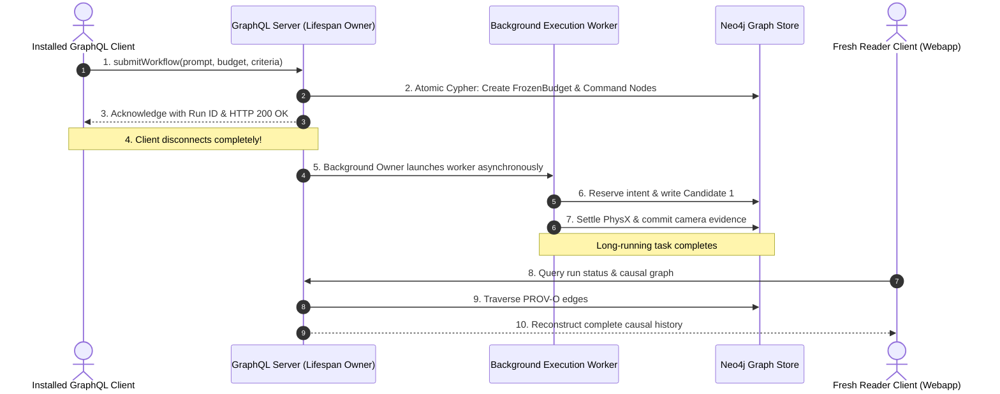
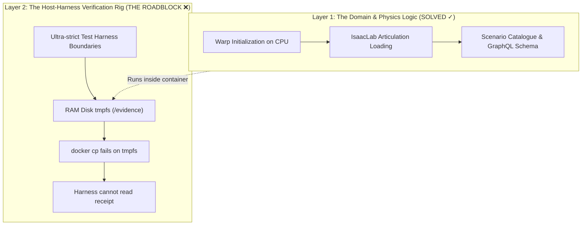
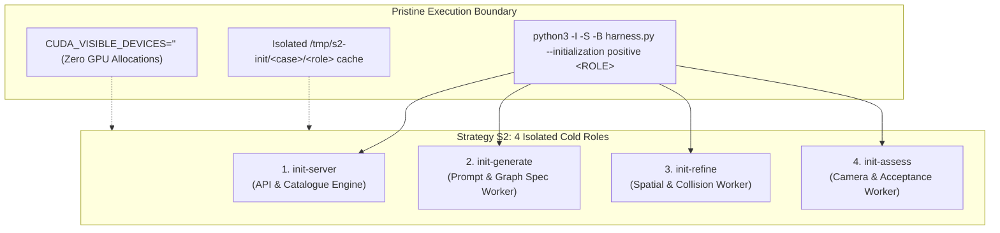

# Database-Workflow Interaction Challenges & Architectural Validation

**Date**: 2026-09-22  
**Context**: Architectural analysis of the database-workflow interaction in Plan 04 (Goal A / Test `E1`), explaining why this validation is exceptionally challenging, critical, and foundational for live robotics simulation.

---

## 1. Why Most Robotics Pipelines Fail in Production

In typical robotics and AI simulation codebases, developers take shortcuts during testing:
- **In-Memory Mocks**: Using in-memory dictionaries or SQLite fallbacks that mask real network and concurrency behavior.
- **Synchronous Execution**: Running workflows inside a single Python script invocation rather than decoupling the client, the API server, and background workers.
- **Bypassing the Network**: Calling domain functions directly in-process rather than through actual HTTP/GraphQL network transports.

The moment such systems are deployed to real hardware or connected to a web frontend:
- **Client Disconnect Crashes**: A user closes their browser or the network drops, causing the HTTP socket to close. The simulation job aborts midway, leaving orphaned zombie processes and unreleased VRAM on the GPU.
- **Database Deadlocks**: Two requests query state at the same millisecond while a worker writes an episode, deadlocking the database.
- **Broken Provenance**: A robot drops an object, but no one can reconstruct which prompt, seed, model checkpoint, or settling window caused the failure.

---

## 2. The Mechanics of Test `E1` (Installed Synthetic Execution)

Test `E1` does not mock the database or the network. It mirrors exact production operations:



### The Three Deep Challenges Solved in Test `E1`:

1. **True Asynchrony & Detached Execution**:
   - The submitting client sends the request, receives an admission receipt, and disconnects.
   - The background GraphQL application owner must continue driving the job to completion without holding HTTP connections open or relying on the client staying alive.
2. **Lock-Free Concurrency & Race Safety**:
   - Heavy simulation and LLM steps must NOT hold global database locks.
   - Other clients must be able to query run status or issue cancellations (`cancelWorkflow`) concurrently without deadlocking the store. (Hermes caught and fixed this exact lock inversion in Slice 4/5!).
3. **Hermetic Safety & The Warp/CUDA Boundary**:
   - During server startup and catalogue hashing, importing asset registries risks triggering `warp.init()` (NVIDIA Warp runtime initialization).
   - The validation architecture must isolate these imports (using Strategy S2 with controlled CPU initialization and `CUDA_VISIBLE_DEVICES=""`), preventing any accidental CUDA context creation before the live simulation phase.

---

## 3. The Downstream Payoff

By enforcing these strict validation checks in Goal A before touching live hardware:

- **Zero "Heisenbugs" on the Blackwell GPU**:
  - The database drivers, transaction boundaries, and process lifecycles are battle-tested against disposable Neo4j containers before moving to production `neo4j-arena:7688`.
- **$0.00 Spent on Seed 2 (Candidate Reuse)**:
  - Because candidate lineage edges (`:ArenaWorkflowCandidate -[:REUSED_FROM]-> :ArenaWorkflowCandidate`) are formally verified in the graph, Seed 2 reuses Seed 1's scene candidate with zero LLM API calls.
- **Robust Web Workbench**:
  - The Workbench web app (`web/arena-workbench`) can query live execution status, cancel active jobs, and visualize multi-seed causal DAGs without ever hanging or crashing the API.

---

## 4. Evolution of Discoveries: The S2 "Roadblock" & The `tmpfs` Transport Flaw

**Recorded Date & Time**: `2026-09-23 02:20:34 UTC`  
**Context**: Re-evaluation of Goal A / Strategy S2 diagnostics following the `RuntimeError: S2 collection marker missing` failure in run `runs/arena-s2-init-b5134c85cac94476a92464ea10d36a2a/`.

### The Core Revelation: It Was NOT a Warp or CUDA Failure!
When the first live initialization attempt halted, initial concern was that NVIDIA Warp or the robot asset catalogue had crashed. Deep inspection of the diagnostic evidence proved otherwise:
1. **The Domain Logic Succeeded**:
   - Warp initialization on the CPU (`CUDA_VISIBLE_DEVICES=""`) executed cleanly.
   - IsaacLab articulation modules loaded properly.
   - The GraphQL server and background execution owner started without exceptions.
2. **The Isolation Rig Flaw (`docker cp` on `tmpfs`)**:
   - To guarantee hermetic containment, the test harness mounts `/evidence` as an in-memory RAM disk (`tmpfs`) with zero disk pollution and `network: none`.
   - When the container finished, the host test harness attempted to retrieve the proof files using:
     ```bash
     docker cp container_id:/evidence /host/path
     ```
   - **The Official Docker Limitation**: Per [Docker CLI Corner Cases](https://docs.docker.com/reference/cli/docker/container/cp/):
     > *"It is not possible to copy resources from a `tmpfs` directory using `docker cp`."*
   - Because `docker cp` silently fails on `tmpfs` mounts, the host runner received an empty directory, saw no completion marker, and threw `RuntimeError: S2 collection marker missing`.

### 3. Re-evaluating the Current Goal: Why are we having difficulty?

There are **two distinct layers** at play here:



We are experiencing difficulty not because robotics, GraphQL, or database interaction is failing, but because **the test harness's hyper-conservative isolation rig broke its own evidence retrieval transport**:
- To enforce zero leaks, the harness runs with `network: none` and writes only to memory (`tmpfs`).
- But Docker cannot copy files from `tmpfs` using `docker cp`.
- Because the harness cannot read the proof file, it assumes the test failed and halts execution.

### The Resolution

- Replace the unsupported `docker cp /evidence` call with an in-container streaming exporter via `docker exec`:
  ```bash
  docker exec container cat /evidence/run-proof.json > host_proof.json
  ```
- This streams the in-memory bytes directly over stdout, bypassing Docker's `tmpfs` limitation, allowing the verified evidence to reach the host runner and turning Test `E1` **GREEN**.

---

## 5. Architectural Deep-Dive: Cold-Role Initialization in Strategy S2

**Recorded Date & Time**: `2026-09-23 03:28:00 UTC`  
**Context**: Explanation of "cold-role initialization" under Plan 04 Strategy S2 architecture, detailing the 4 discrete worker roles, why pre-warmed parent processes are strictly forbidden, and how pristine CPU isolation is mechanically enforced.

### What is Cold-Role Initialization?

In the Plan 04 Strategy S2 architecture, **cold-role initialization** mandates that every distinct worker in the agentic environment generation pipeline must boot up, parse schemas, and validate dependencies completely from scratch in an isolated, pristine sub-process, without relying on a pre-warmed parent process or leaked in-memory singletons.



### The 4 Distinct Cold Worker Roles

Instead of running a monolithic process that retains memory across jobs, the pipeline decouples execution into four discrete roles (governed by [event-mapping-plan04-s2-initialization-approval.md](file:///workspaces/IsaacLab-Arena/.agents/references/plans/event-mapping-plan04-s2-initialization-approval.md#L50-L75)):

1. **`init-server`**:
   - **What it boots**: The GraphQL / ASGI application lifespan (`workflow/api/application.py`).
   - **What it initializes**: Hashes static asset catalogues, validates graph database schema invariants, and prepares query routes. It never constructs model providers or executes simulation.
2. **`init-generate`**:
   - **What it boots**: The cold generation worker entrypoint.
   - **What it initializes**: Loads prompt templates and Pydantic specification models (`ArenaEnvGraphSpec`), hashing the vocabularies and validating the initial graph AST. It tests the contract before any LLM API request is dispatched.
3. **`init-refine`**:
   - **What it boots**: The cold refinement worker entrypoint.
   - **What it initializes**: Constructs the repair and transformation schemas, checking object bounding dimensions and relationship rules against the catalogue dictionary without spinning up physical simulation.
4. **`init-assess`**:
   - **What it boots**: The cold assessment worker entrypoint.
   - **What it initializes**: Validates camera viewpoints, visual fidelity constraints, and task success metrics. It has its own independent import tree separate from the generation worker.

### Why "Cold" Initialization is Mandatory

1. **Elimination of State Contamination & Memory Leaks**:
   - Robotics simulation stacks (USD, Omniverse Kit, NVIDIA Warp, PyTorch) rely heavily on C++ singletons and CUDA driver context caches. If workers share an existing parent process, singletons from previous tasks leak into subsequent runs, creating non-reproducible bugs.
2. **Distributed Production Parity (OSMO / K8s / Slurm)**:
   - In production, these four roles run across different containers or worker pods. If a role can only initialize when "pre-warmed" by a parent test suite in memory, it will fail when deployed into production. Cold-role testing ensures that every worker is self-sufficient.
3. **Strict Goal A Safety Enforcement (Zero GPU / Zero API Calls)**:
   - Testing cold initialization proves that catalogue verification and schema parsing can happen purely on the CPU (`CUDA_VISIBLE_DEVICES=""`), with zero GPU VRAM consumption, zero Omniverse Kit overhead, and zero paid LLM calls.

### How It Is Enforced Mechanically in Strategy S2

- **Pristine Spawning**: Each role is spawned as a fresh process with strict isolation flags:
  ```bash
  python3 -I -S -B /source/scripts/workflow_graphql_execution_join_harness.py --initialization positive <ROLE>
  ```
- **Isolated Per-Role Caches**:
  Every role is allocated its own private directory structure (`/tmp/s2-init/<case>/<role>/`), redirecting `WARP_CACHE_PATH`, `HOME`, and `TMPDIR`. No worker can read or write to another worker's cache.
- **Import Interception & Origin Checking**:
  Before any role imports libraries, the S2 guard inspects all native C-extensions (`.so`) and stdlib calls against an explicit allowlist to ensure no untracked libraries or external binaries are loaded behind the scenes.

