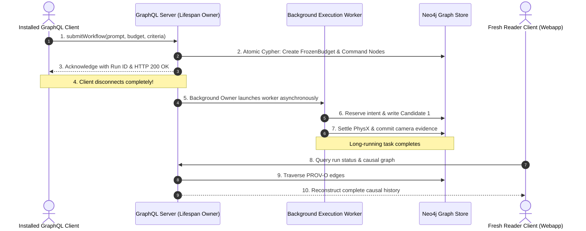

# Database-Workflow Interaction Challenges & Architectural Validation

**Date**: 2026-09-22  
**Context**: Architectural analysis of the database-workflow interaction in Plan 04 (Goal A / Test `E1`), explaining why this validation is exceptionally challenging, critical, and foundational for live robotics simulation.

---

## 1. Why Most Robotics Pipelines Fail in Production

In typical robotics and AI simulation codebases, developers take shortcuts during testing:
- **In-Memory Mocks**: Using in-memory dictionaries or SQLite fallbacks that mask real network and concurrency behavior.
- **Synchronous Execution**: Running workflows inside a single Python script invocation rather than decoupling the client, the API server, and background workers.
- **Bypassing the Network**: Calling domain functions directly in-process rather than through actual HTTP/GraphQL network transports.

The moment such systems are deployed to real hardware or connected to a web frontend:
- **Client Disconnect Crashes**: A user closes their browser or the network drops, causing the HTTP socket to close. The simulation job aborts midway, leaving orphaned zombie processes and unreleased VRAM on the GPU.
- **Database Deadlocks**: Two requests query state at the same millisecond while a worker writes an episode, deadlocking the database.
- **Broken Provenance**: A robot drops an object, but no one can reconstruct which prompt, seed, model checkpoint, or settling window caused the failure.

---

## 2. The Mechanics of Test `E1` (Installed Synthetic Execution)

Test `E1` does not mock the database or the network. It mirrors exact production operations:

### The Three Deep Challenges Solved in Test `E1`:

1. **True Asynchrony & Detached Execution**:
   - The submitting client sends the request, receives an admission receipt, and disconnects.
   - The background GraphQL application owner must continue driving the job to completion without holding HTTP connections open or relying on the client staying alive.
2. **Lock-Free Concurrency & Race Safety**:
   - Heavy simulation and LLM steps must NOT hold global database locks.
   - Other clients must be able to query run status or issue cancellations (`cancelWorkflow`) concurrently without deadlocking the store. (Hermes caught and fixed this exact lock inversion in Slice 4/5!).
3. **Hermetic Safety & The Warp/CUDA Boundary**:
   - During server startup and catalogue hashing, importing asset registries risks triggering `warp.init()` (NVIDIA Warp runtime initialization).
   - The validation architecture must isolate these imports (using Strategy S2 with controlled CPU initialization and `CUDA_VISIBLE_DEVICES=""`), preventing any accidental CUDA context creation before the live simulation phase.

---

## 3. The Downstream Payoff

By enforcing these strict validation checks in Goal A before touching live hardware:

- **Zero "Heisenbugs" on the Blackwell GPU**:
  - The database drivers, transaction boundaries, and process lifecycles are battle-tested against disposable Neo4j containers before moving to production `neo4j-arena:7688`.
- **$0.00 Spent on Seed 2 (Candidate Reuse)**:
  - Because candidate lineage edges (`:ArenaWorkflowCandidate -[:REUSED_FROM]-> :ArenaWorkflowCandidate`) are formally verified in the graph, Seed 2 reuses Seed 1's scene candidate with zero LLM API calls.
- **Robust Web Workbench**:
  - The Workbench web app (`web/arena-workbench`) can query live execution status, cancel active jobs, and visualize multi-seed causal DAGs without ever hanging or crashing the API.
