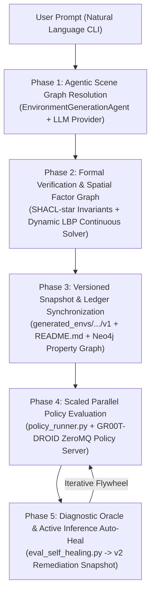

# IsaacLab-Arena: End-to-End Agentic Environment Generation & Self-Healing Workflow (`v0.1`)

This document details the complete execution flow of the **Agentic Environment Generation & Active Inference Self-Healing Pipeline** in IsaacLab-Arena. It walks through how a single natural-language user prompt is parsed, formally verified, lowered into an Isaac Sim simulation, evaluated against Foundation VLA policies (e.g. GR00T-DROID), and iteratively repaired.

---

## 1. High-Level Architecture Flow



---

## 2. Step-by-Step Phase Breakdown

### Phase 1: Agentic Scene Graph Resolution
When the user executes:
```bash
docker exec -it \
  -e GEMINI_API_KEY="$GEMINI_API_KEY" \
  isaaclab_arena-latest /isaac-sim/python.sh \
  isaaclab_arena_examples/agentic_environment_generation/environment_generation_runner.py \
  --mode resolve \
  --prompt "Pick up the water bottle from the front right of the maple table and place it into the grey bin on the front left." \
  --env_name droid_water_bottle_to_grey_bin
```

1. **CLI Intake & Provider Routing**:
   `environment_generation_runner.py` detects the active API key (`GEMINI_API_KEY`, `OPENROUTER_API_KEY`, `OPENAI_API_KEY`, or `NV_API_KEY`) and configures `InferenceBackend` for structured JSON schema completion.
2. **Semantic Asset Grounding**:
   `EnvironmentGenerationAgent` compares the natural-language prompt against the IsaacLab-Arena asset registry and extracts:
   * **Embodiment**: Franka DROID arm (`droid_abs_joint_pos`) positioned at `[-0.55, 0.0, 0.0]`.
   * **Background**: Table fixture (`maple_table_robolab`) positioned at `[-0.25, 0.0, 0.0]`.
   * **Manipuland**: Source object (`water_bottle_hot3d_robolab` or `plasticpackerbottle_a01`) in `front_right` sector.
   * **Receptacle**: Destination container (`grey_bin_robolab`) in `front_left` sector.
   * **Task Type**: `PickAndPlaceTask` guarded by container proximity bounding: `max_separation: [0.12, 0.12, 0.15]`.

---

### Phase 2: Formal Invariants & Continuous Spatial Relaxation
Before generating simulation USD assets, the spec is mathematically validated:
1. **SHACL-star Invariant Checking**:
   Verifies semantic and physical constraints (e.g. objects sit on planar surfaces, no physical mesh collisions, reachability declared).
2. **Dynamic LBP Spatial Factor Graph Relaxation**:
   `spatial_geometric_oracle.py` relaxes discrete topological sector labels (`front_right`, `front_left`) into continuous metric bounding boxes (`[-0.30m, -0.10m]` depth, `[-0.15m, 0.15m]` width) guaranteed to sit inside the downward camera's Field of View and the DROID teleoperation training distribution.

---

### Phase 3: Versioned Snapshot & Ledger Synchronization
`EnvironmentVersionManager` packages the scene graph and controller configurations into an isolated version folder:
1. **Directory Structure Generated**:
   ```text
   generated_envs/droid_water_bottle_to_grey_bin/
   ├── README.md                      # Auto-generated guide with ready-to-run commands
   ├── latest -> v1                   # Symlink pointing to the active canonical version
   ├── lineage.json                   # Machine-readable execution and remediation ledger
   ├── lineage.ttl                    # W3C PROV-O semantic knowledge graph
   └── v1/
       ├── droid_water_bottle_to_grey_bin.yaml   # Verified Isaac Lab scene graph spec
       └── policy_config.yaml                    # GR00T-DROID closed-loop policy config
   ```
2. **Controller Pre-Conditioning**:
   `policy_config.yaml` is pre-conditioned with our verified receding-horizon sweet spot:
   * `action_chunk_length: 16` ($6.25\text{ Hz}$ replanning)
   * `action_horizon: 32`
   * Text prompt conditioning aligned with the task description.
3. **Knowledge Graph Synchronization**:
   Nodes (`:EnvironmentGraph`, `:RigidObject`, `:Embodiment`, `:Task`) and edges (`:CONTAINS_OBJECT`, `:PLACED_ON`) are live-synchronized to the **Neo4j Property Graph**.

---

### Phase 4: Scaled Parallel Policy Evaluation
The developer executes the parallel evaluation command (pre-populated in the generated `README.md`):

```bash
docker exec -it \
  isaaclab_arena-latest /isaac-sim/python.sh \
  isaaclab_arena/evaluation/policy_runner.py \
  --policy_type isaaclab_arena_gr00t.policy.gr00t_remote_closedloop_policy.Gr00tRemoteClosedloopPolicy \
  --policy_config_yaml_path /workspaces/isaaclab_arena/generated_envs/droid_water_bottle_to_grey_bin/latest/policy_config.yaml \
  --remote_host 127.0.0.1 \
  --remote_port 5557 \
  --num_envs 32 \
  --num_episodes 32 \
  --num_steps 2000 \
  --enable_cameras \
  --env_graph_spec_yaml /workspaces/isaaclab_arena/generated_envs/droid_water_bottle_to_grey_bin/latest/droid_water_bottle_to_grey_bin.yaml \
  --output_base_dir /workspaces/isaaclab_arena/eval_output/droid_water_bottle_to_grey_bin
```

**Simulation Dynamics:**
* Boots $32$ parallel simulation worlds headlessly on GPU.
* Streams downward camera RGB tensors (`external_camera_rgb`, `wrist_camera_rgb`) to the `gr00t-server` over ZeroMQ.
* The policy evaluates closed-loop actions at $6.25\,\text{Hz}$ ($50\,\text{Hz}$ sim physics).
* The progress tracker monitors stage progression: **Stage 0 (Settled)** $\to$ **Stage 1 (Lifted)** $\to$ **Stage 2 (Placed in Bin)**.
* Outputs: `summary_metrics.json`, `episode_results_rank0.jsonl`, `eval_telemetry.ttl`, and an interactive visual dashboard (`index.html`).

---

### Phase 5: Diagnostic Auto-Healing Flywheel
If empirical telemetry shows a performance bottleneck, the user invokes auto-healing:

```bash
docker exec -it \
  isaaclab_arena-latest /isaac-sim/python.sh \
  isaaclab_arena_examples/agentic_environment_generation/environment_generation_runner.py \
  --mode auto_heal \
  --env_name droid_water_bottle_to_grey_bin \
  --healing_mode hybrid
```

**Flywheel Remediation Mechanism:**
1. **Telemetry Ingestion**: `EvaluationDiagnosticOracle` parses the 32-environment Markov funnel.
2. **Dual-Mode Diagnosis**:
   * **Option A (Deterministic Oracle)**: Analyzes statistical ratios (e.g., if $\text{Lift Rate} \ge 50\%$ but $\text{Conversion Rate} < 75\%$, diagnoses `IN_FLIGHT_SLIP_INERTIA`).
   * **Option B (Generative LLM Reasoning)**: Invokes LLM reasoning with full JSON-LD telemetry if failure falls outside standard rules.
3. **Automated Remediation**:
   * Synthesizes **`v2`** with updated policy/spatial parameters in `generated_envs/droid_water_bottle_to_grey_bin/v2/`.
   * Records `prov:wasDerivedFrom` links in `lineage.ttl` and updates the Neo4j graph and `README.md`.

---

## 3. Summary of Key Invariants & Empirical Rules

| Component | Invariant / Finding | Rationale |
| :--- | :--- | :--- |
| **Table Standoff** | Table base at `[-0.25, 0.0, 0.0]` relative to robot at `[-0.55, 0.0, 0.0]` | Keeps objects in near-field ($d \in [0.25, 0.45]\text{m}$) within camera crop. |
| **Verification Guard** | Container bounding `max_separation: [0.12, 0.12, 0.15]` | Prevents false-positive success triggers from grazing outer container rims. |
| **Receding Horizon** | `action_chunk_length = 16` ($6.25\text{ Hz}$ replanning) | Universal sweet spot. Chunk 8 causes diffusion sampler jitter; Chunk 32 causes open-loop slip. |
| **Horizon Duration** | `num_steps = 2000` ($40.0\text{s}$) | Sufficient horizon for multi-stage pick-and-place trajectories to settle and release. |
| **Lineage Ledger** | W3C PROV-O (`lineage.ttl`) + JSON + Neo4j | Guarantees full auditability and cross-scenario empirical memory. |
