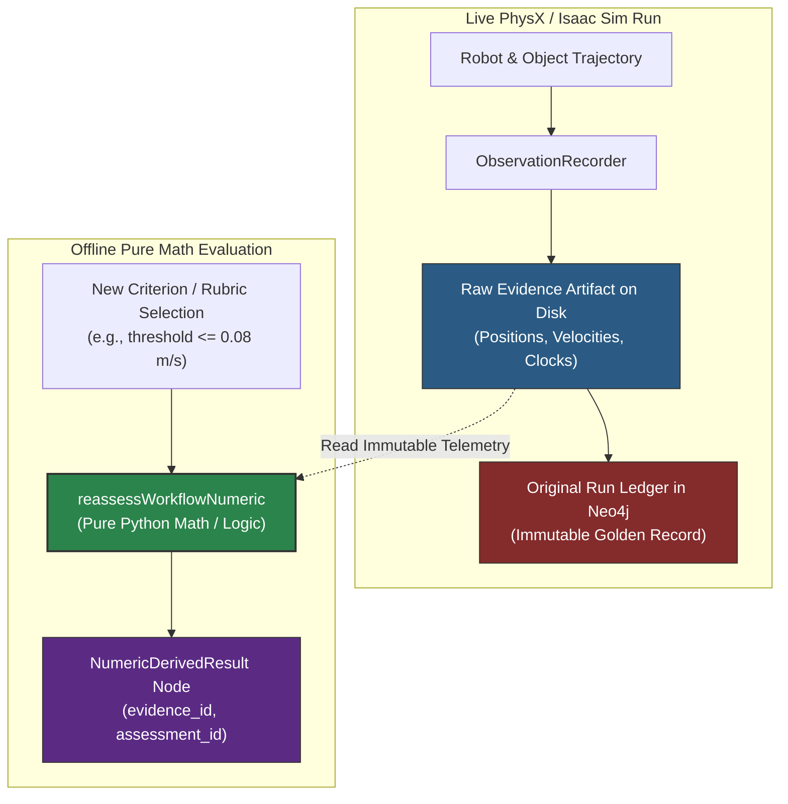

# Retained Numeric Reassessment Architecture & GraphQL Client Documents

**Date**: 2026-09-26  
**Context**: Architectural reference for Plan 04 / Schema 5 retained numeric reassessment, explaining the purpose of `reassessWorkflowNumeric`, the `DOCUMENTS` registry in `client.py`, and the scientific necessity of offline mathematical evaluation in robotics simulation.

---

## 1. The Core Robotics Problem: Simulation & Model Overhead

Executing full-scene robotics simulations inside NVIDIA Isaac Sim (Kit / PhysX) is computationally intensive:
- USD stage composition, PhysX physics initialization, multi-step contact settling (e.g. 180+ steps), velocity threshold sampling, and multi-camera image rendering.
- Similarly, multimodal LLM/VLM calls (e.g. GPT-6 Astra) incur real monetary cost, network latency, and token allowances.

During a run, IsaacLab-Arena captures raw physical telemetry (rigid-body positions, orientations, linear velocities, angular velocities, step clocks, coordinate frames) and seals them into cryptographically hashed evidence artifacts on disk.

### The Dilemma
In traditional robotics pipelines:
1. **Rerunning Simulation**: If a researcher wants to evaluate a slightly different threshold (e.g., *"Is the banana settled if linear velocity $\le 0.08\text{ m/s}$ instead of $\le 0.05\text{ m/s}$?"*), they rerun the entire simulation. This wastes GPU cycles and introduces non-deterministic physics jitter.
2. **Database Mutation**: Alternatively, pipelines simply overwrite the existing database row with the new verdict, destroying historical auditability and reproducibility.

---

## 2. The Solution: Keyed Retained Numeric Reassessment

IsaacLab-Arena decouples **raw physical measurement** from **criterion evaluation**.



### Core Invariants of `reassessWorkflowNumeric`
Defined in [`derived_assessment.py`](../../../isaaclab_arena/agentic_environment_generation/workflow/derived_assessment.py):
* **Zero GPU Releases (`native_releases: 0`)**: No Isaac Sim, Kit, or PhysX instance is booted.
* **Zero Provider Dispatches (`provider_sends: 0`)**: No external LLM/VLM APIs are invoked.
* **Immutable History (`original_run_amended: False`)**: The historical run, intent, and candidate nodes remain completely untouched.
* **Cryptographic Provenance**: Produces a distinct `assessment_id` derived deterministically from `(kind, source_manifest_digest, selection)` and linked back to the original `source_manifest_digest`.

---

## 3. Honest Scientific Labeling: `validation` vs. `exploratory`

A key governance principle in Arena is preventing post-hoc hypothesis shopping from masquerading as pre-registered validation.

In [`derived_assessment.py`](../../../isaaclab_arena/agentic_environment_generation/workflow/derived_assessment.py):
```python
purpose: Literal["exploratory", "validation"]
```

1. **`validation`**:
   - The criterion must have been pre-declared in the original immutable `WorkflowContract`.
   - The server validates: `selected_contract == candidate.contract_digest` and verifies that the exact criterion was preselected.
2. **`exploratory`**:
   - Used for post-hoc threshold sweeps, parameter sensitivity analysis, or secondary metric exploration.
   - Explicitly tagged as exploratory; cannot claim to satisfy a preselected acceptance gate.

---

## 4. GraphQL Architecture & The `DOCUMENTS` Registry in `client.py`

### Why `DOCUMENTS` Exists
Arena's CLI and Workbench UI communicate with the core workflow server via GraphQL (`http://127.0.0.1:36315/graphql`).

Rather than dynamically concatenating arbitrary GraphQL query strings at runtime, [`client.py`](../../../isaaclab_arena/agentic_environment_generation/workflow/api/client.py) maintains a centralized, frozen dictionary of validated GraphQL documents:

```python
DOCUMENTS["submit"]            # Mutation to admit and start a workflow
DOCUMENTS["cancel"]            # Mutation to request graceful/immediate cancellation
DOCUMENTS["resume"]            # Mutation to resume a paused/retained workflow
DOCUMENTS["status"]            # Query to read current run lifecycle and event watermark
DOCUMENTS["result"]            # Query to fetch full output artifacts and evidence
DOCUMENTS["scene-inspect"]      # Query to inspect and preflight a contract before admission
DOCUMENTS["supervision"]        # Query to poll background native worker lease heartbeats
DOCUMENTS["numeric-reassess"]  # Mutation to execute retained numeric re-evaluation
DOCUMENTS["numeric-result"]    # Query to fetch a previously computed derived numeric assessment
```

### The Mutation Document: `numeric-reassess`
From [`client.py`](../../../isaaclab_arena/agentic_environment_generation/workflow/api/client.py):
```graphql
mutation($id: ID!, $selection: NumericSelectionJSON!) {
  reassessWorkflowNumeric(operationId: $id, selection: $selection) {
    __typename
    ... on QueryFailure { code }
    ... on NumericDerivedResult {
      operationId
      selectionDigest
      runId
      evidenceId
      candidateId
      sourceManifestDigest
      purpose
      validationContractDigest
      disposition
      reason
      assessmentId
      manifestDigest
      criterionId
      evaluatorVersion
      thresholdOperator
      thresholdValue
      thresholdUnit
      verdict
      conflict
      limitations
      originalRunVersion
      providerSends
      nativeReleases
      originalRunAmended
      parameters {
        metric
        referenceFrame
        clock
        sampleSteps
        temporalAggregation
        subjectAggregation
        targetXyM
        linearLimit { operator value unit }
        angularLimit { operator value unit }
        missingData
        invalidData
      }
    }
  }
}
```

---

## 5. Security & AST Validation Safeguards

Because GraphQL mutations can alter state, the API enforces strict AST security filtering in [`security.py`](../../../isaaclab_arena/agentic_environment_generation/workflow/api/security.py):

```python
if (
    counts["fields"] > 256
    or counts["aliases"] > 16
    or counts["roots"] > (1 if mutation else 8)
    or (
        mutation
        and at_root
        and node.name.value not in {
            "submitWorkflow",
            "cancelWorkflow",
            "resumeWorkflow",
            "reassessWorkflowNumeric",
        }
    )
    or node.name.value in ("__schema", "__type")
):
    raise ValueError("Request rejected")
```

- Any mutation not explicitly in the allowlist is rejected with HTTP 400/401 before resolver execution.
- Introspection queries (`__schema`, `__type`) are blocked in production to prevent schema probing.
- Variable inputs (e.g. `$selection`) must strictly conform to Pydantic JSON schemas (`NumericReassessmentSelection`).

---

## 6. How to Use via CLI

Operators and test harnesses invoke numeric reassessment directly via the Arena CLI:

```bash
# Execute offline numeric reassessment
python -m isaaclab_arena.agentic_environment_generation.workflow.cli numeric-reassess \
  --client /path/to/client.json \
  --operation-id op-reassess-linear-speed \
  --selection /path/to/numeric-selection.json

# Read back previously retained derived assessment
python -m isaaclab_arena.agentic_environment_generation.workflow.cli numeric-result \
  --client /path/to/client.json \
  --operation-id op-reassess-linear-speed
```

---

## 7. Summary of Architectural Benefits

1. **Massive Compute & Cost Savings**: Avoids spinning up Isaac Sim (Kit/PhysX) and invoking LLMs for questions that can be answered from existing physical telemetry.
2. **Deterministic & Jitter-Free**: Re-evaluates identical recorded data, isolating algorithmic rubric differences from physical simulator non-determinism.
3. **Auditability**: Leaves the golden dataset unchanged and clearly identifies whether any metric was pre-registered validation or post-hoc exploratory analysis.
