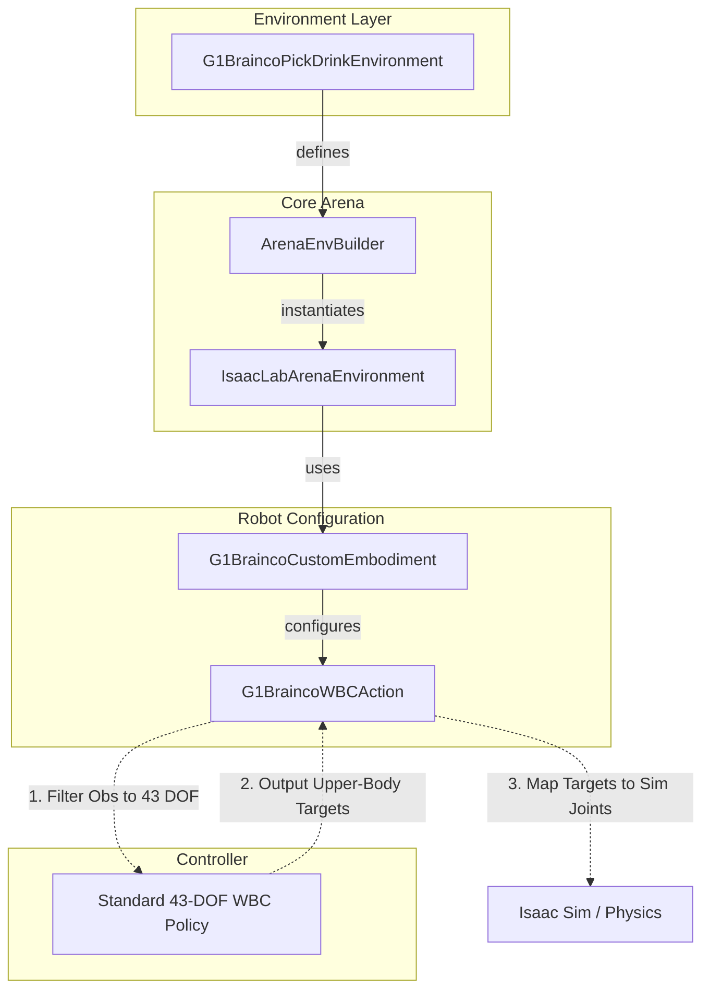

# G1 Brainco Extension

This extension provides support for the Unitree G1 humanoid robot equipped with **Brainco dexterous hands**. It includes specialized embodiments, environments, and MDP components to handle the increased degrees of freedom (DOF) while maintaining compatibility with standard Whole Body Controllers (WBC).

## Summary of Changes

- **Custom Embodiment**: Introduced `G1BraincoCustomEmbodiment` which loads the `g1_with_brainco_hands.usd` model and configures actuator groups for the dexterous fingers.
- **Specialized WBC Action**: Implemented `G1BraincoWBCAction` to solve the shape mismatch between the 43-DOF WBC policy and the 50+ DOF simulation model. It performs automatic joint mapping and observation filtering.
- **Pick & Drink Environment**: Created `G1BraincoPickDrinkEnvironment`, a complete task setup featuring:
  - High-friction material configuration for fingers to improve grasping.
  - Custom "Oficina CBA Grande" background asset.
  - Pre-defined arm postures for better task initialization.
- **Robust Path Resolution**: Added multi-variant path checking for USD assets to ensure compatibility across different deployment environments (local, Docker, etc.).

## Code Structure

```text
g1_brainco_extension/
├── assets/                  # Local assets (USDs, meshes)
├── datasets/                # dataset for the robot
├── embodiments/
│   ├── mdp/
│   │   ├── robot_configs.py   # Robot-specific constants (friction, postures)
│   │   └── actions/
│   │       ├── wbc_action.py  # Mapping logic Sim <-> WBC
│   │       └── wbc_action_cfg.py
│   └── g1_brainco.py        # Custom robot model & asset registration
├── environments/
│   └── g1_static_pick_and_place_drink_env.py      # Task definition & background setup
├── assets.py              # Custom asset registration (CokeCan, etc.)
└── README.md
```

### 1. Embodiments (`embodiments/`)
The `G1BraincoCustomEmbodiment` extends the base G1 WBC embodiment. It specifically:
- Points to the USD containing the Brainco hand models (located in `assets/`).
- Overrides the `hands` actuator group to use a regex that captures all finger joints (`index`, `middle`, `pinky`, `ring`, `thumb`).
- Injects the `G1BraincoWBCActionCfg` to ensure the correct action term is used.

### 2. Custom Assets (`assets.py`)
This file handles the registration of custom objects into the Arena's `AssetRegistry`. By using the `@register_asset` decorator, objects like `CokeCan` and `RedSortingBin` become available globally to any environment that imports this module.

```python
@register_asset
class CokeCan(LibraryObject):
    name = "coke_can"
    usd_path = os.path.join(EXTENSION_DATA_PATH, "coke_can.usd")
```

### 3. MDP & Actions (`mdp/actions/`)
Standard G1 WBC policies expect exactly 43 joints. The Brainco hands add significantly more. `G1BraincoWBCAction`:
- **Filters Observations**: Slices the simulation state to provide only the 43 joints the policy expects.
- **Maps Targets**: Takes the policy's upper-body targets and maps them back to the correct simulation joint indices.
- **Handles Extra Joints**: Allows the extra finger joints to be controlled or maintained without interfering with the base controller.

### 4. Environments (`environments/`)
The `G1StaticPickAndPlaceDrinkEnvironment` is an `ExampleEnvironmentBase` implementation. It sets up the physical scene, including:
- A large office background (`OficinaCBAGrande`).
- An office table and task objects (e.g., beer bottle, sorting bin).
- Specific finger friction settings (`static: 6.0, dynamic: 5.0`) to prevent objects from slipping during dexterous manipulation.
- **Auto-Registration**: Imports `g1_brainco_extension.assets` automatically to ensure custom objects are available via CLI.

## Architecture Overview



## How to Run

You can run the environment using the `policy_runner.py` script. Since this is an extension, you need to provide the class path to the environment.

### Example: Running with Zero Actions

This is useful to verify the scene setup, robot spawn, and initial posture.

```bash
python isaaclab_arena/evaluation/policy_runner.py \
    --viz kit \
    --policy_type zero_action \
    --num_steps 5000 \
    --external_environment_class_path g1_brainco_extension.environments.pick_drink:G1BraincoPickDrinkEnvironment \
    g1_brainco_pick_drink \
    --object beer_bottle 
```

### Customizing the Task

The environment supports CLI arguments for objects and destinations, including those defined in `assets.py`:

```bash
python isaaclab_arena/evaluation/policy_runner.py \
    --viz kit \
    --policy_type zero_action \
    --num_steps 5000 \
    --external_environment_class_path g1_brainco_extension.environments.pick_drink:G1BraincoPickDrinkEnvironment \
    g1_brainco_pick_drink \
    --object "tomato_soup_can_custom" --destination "red_container_custom"
```

### Parameters

- `--object`: The name of the asset to pick up (must be in `AssetRegistry`).
- `--destination`: The name of the asset where the object should be placed.
- `--lock_waist`: (Boolean) Whether to lock the robot's waist joints.
- `--enable_cameras`: (Boolean) Enable/disable on-board cameras.

## Scene Layout & Customization

The environment is configured for a hierarchical task: the robot starts 2 meters away from the table, requiring navigation/approach before manipulation.

### Scene Summary Table

| Asset / Entity | Type | Position (X, Y, Z) | Variability |
| :--- | :--- | :--- | :--- |
| **G1 Humanoid** | Embodiment | `(-1.45, 0.0, 0.0)` | Fixed initial pose |
| **Office Table** | Static Asset | `(0.55, 0.0, 0.0)` | Fixed (Surface at Z=0.745) |
| **Collision Patch**| Invisible | `(0.55, 0.0, 0.735)` | Fixed (0.02m thick) |
| **Drink Object** | `ObjectSet` | `X: [0.45, 0.65], Y: [-0.15, 0.15], Z: 0.75` | Random asset, XY pos, and Yaw |
| **Destination** | `RigidObject`| `X: [0.45, 0.65], Y: [0.2, 0.4], Z: 0.75` | Random XY pos |

### How to Modify the Scene

#### 1. Adjusting Positions and Ranges
Most spatial constants are defined in `g1_brainco_extension/mdp/robot_configs.py`. You can change:
- `ROBOT_INITIAL_POSE_XYZ`: Move the robot closer or further (e.g., set to `(0.1, 0.05, 0.0)` for immediate manipulation).
- `TABLE_SURFACE_Z`: Adjust if using a different table asset.
- `DRINK_SPAWN_X_RANGE` / `Y_RANGE`: Expand or tighten the randomization area.

#### 2. Adding New Randomized Objects
To add more variety to the `drink_object_set`:
1. Open `g1_brainco_extension/assets.py`.
2. Define a new `LibraryObject` class with a Nucleus path.
3. Add the new class instance to the `objects` list inside `DrinkObjectSet`.

#### 3. Scene Integrity
If objects are falling through your custom table mesh, adjust the `table_collision_patch` size and position in `environments/pick_drink.py` to provide a solid physics proxy.