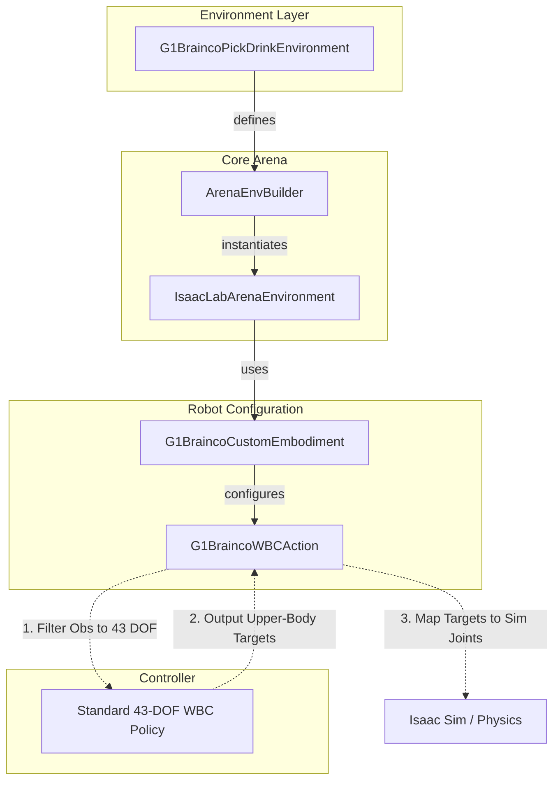

# G1 Brainco Extension

This extension provides support for the Unitree G1 humanoid robot equipped with **Brainco dexterous hands**. It includes specialized embodiments, environments, and MDP components to handle the increased degrees of freedom (DOF) while maintaining compatibility with standard Whole Body Controllers (WBC).

## Summary of Changes

- **Custom Embodiment**: Introduced `G1BraincoCustomEmbodiment` which loads the `g1_with_brainco_hands.usd` model and configures actuator groups for the dexterous fingers.
- **Specialized WBC Action**: Implemented `G1BraincoWBCAction` to solve the shape mismatch between the 43-DOF WBC policy and the 50+ DOF simulation model. It performs automatic joint mapping and observation filtering.
- **Pick & Drink Environment**: Created `G1BraincoPickDrinkEnvironment`, a complete task setup featuring:
  - High-friction material configuration for fingers to improve grasping.
  - Custom "Oficina CBA Grande" background asset.
  - Pre-defined arm postures for better task initialization.
- **Robust Path Resolution**: Added multi-variant path checking for USD assets to ensure compatibility across different deployment environments (local, Docker, etc.).

## Code Structure

```text
g1_brainco_extension/
├── assets/                  # Local assets (USDs, meshes)
├── datasets/                # dataset for the robot
├── embodiments/
│   ├── mdp/
│   │   ├── robot_configs.py   # Robot-specific constants (friction, postures)
│   │   └── actions/
│   │       ├── wbc_action.py  # Mapping logic Sim <-> WBC
│   │       └── wbc_action_cfg.py
│   └── g1_brainco.py        # Custom robot model & asset registration
├── environments/
│   └── g1_static_pick_and_place_drink_env.py      # Task definition & background setup
├── assets.py              # Custom asset registration (CokeCan, etc.)
└── README.md
```

### 1. Embodiments (`embodiments/`)
The `G1BraincoCustomEmbodiment` extends the base G1 WBC embodiment. It specifically:
- Points to the USD containing the Brainco hand models (located in `assets/`).
- Overrides the `hands` actuator group to use a regex that captures all finger joints (`index`, `middle`, `pinky`, `ring`, `thumb`).
- Injects the `G1BraincoWBCActionCfg` to ensure the correct action term is used.

### 2. Custom Assets (`assets.py`)
This file handles the registration of custom objects into the Arena's `AssetRegistry`. By using the `@register_asset` decorator, objects like `CokeCan` and `RedSortingBin` become available globally to any environment that imports this module.

```python
@register_asset
class CokeCan(LibraryObject):
    name = "coke_can"
    usd_path = os.path.join(EXTENSION_DATA_PATH, "coke_can.usd")
```

### 3. MDP & Actions (`mdp/actions/`)
Standard G1 WBC policies expect exactly 43 joints. The Brainco hands add significantly more. `G1BraincoWBCAction`:
- **Filters Observations**: Slices the simulation state to provide only the 43 joints the policy expects.
- **Maps Targets**: Takes the policy's upper-body targets and maps them back to the correct simulation joint indices.
- **Handles Extra Joints**: Allows the extra finger joints to be controlled or maintained without interfering with the base controller.

### 4. Environments (`environments/`)
The `G1StaticPickAndPlaceDrinkEnvironment` is an `ExampleEnvironmentBase` implementation. It sets up the physical scene, including:
- A large office background (`OficinaCBAGrande`).
- An office table and task objects (e.g., beer bottle, sorting bin).
- Specific finger friction settings (`static: 6.0, dynamic: 5.0`) to prevent objects from slipping during dexterous manipulation.
- **Auto-Registration**: Imports `g1_brainco_extension.assets` automatically to ensure custom objects are available via CLI.

## Architecture Overview



## How to Run

You can run the environments using the `policy_runner.py` script. Since these are extension environments, you need to provide the fully-qualified class path.

### 1. Drink Pick & Place Task (Office Background)

This task uses the office background (`OficinaCBAGrande`) and a dynamic table standoff solver.

#### Running with Zero Actions:
```bash
python isaaclab_arena/evaluation/policy_runner.py \
    --viz kit \
    --policy_type zero_action \
    --num_steps 5000 \
    --external_environment_class_path g1_brainco_extension.environments.g1_static_pick_and_place_drink_env:G1StaticPickAndPlaceDrinkEnvironment \
    g1_static_pick_and_place_drink \
    --object beer_bottle 
```

#### Customizing the Task:
```bash
python isaaclab_arena/evaluation/policy_runner.py \
    --viz kit \
    --policy_type zero_action \
    --num_steps 5000 \
    --external_environment_class_path g1_brainco_extension.environments.g1_static_pick_and_place_drink_env:G1StaticPickAndPlaceDrinkEnvironment \
    g1_static_pick_and_place_drink \
    --object "tomato_soup_can_custom" --destination "red_container_custom"
```

### 2. Original Warehouse Static Pick & Place Task (Warehouse Shelf + Apple)

This task uses the warehouse shelf background (`galileo_locomanip`) and deterministic offsets to evaluate the robot under the model's training distribution.

#### Running with the GR00T Closed-Loop Policy:
```bash
WBC_DEBUG=1 python isaaclab_arena/evaluation/policy_runner.py \
  --viz kit \
  --policy_type isaaclab_arena_gr00t.policy.gr00t_closedloop_policy.Gr00tClosedloopPolicy \
  --policy_config_yaml_path g1_brainco_extension/policy/config/g1_brainco_static_gr00t_closedloop_config.yaml \
  --num_steps 1000 \
  --external_environment_class_path g1_brainco_extension.environments.g1_brainco_static_pick_and_place_env:G1BraincoStaticPickAndPlaceEnvironment \
  g1_brainco_static_pick_and_place \
  --object apple_01_objaverse_robolab \
  --destination clay_plates_hot3d_robolab \
  --embodiment g1_brainco_custom \
  --enable_cameras \
  --no-lock_waist
```

### Parameters

- `--object`: The name of the asset to pick up (must be in `AssetRegistry`).
- `--destination`: The name of the asset where the object should be placed.
- `--lock_waist`: (Boolean) Whether to lock the robot's waist joints.
- `--enable_cameras`: (Boolean) Enable/disable on-board cameras.

## Scene Layout & Customization

The environment is configured as a static pick-and-place task where the G1 robot stands directly in front of the table.

### 📐 Environment Spatial Layout (Top-Down View)

```text
                              ▲ +X (Forward)
                              │
                              │
    +Y (Robot's Left) ◄───────┼───────► -Y (Robot's Right)
                              │
                              │
   ===========================│===================================
   ║                          │                                  ║
   ║                       [TABLE TOP]                           ║
   ║                          │                                  ║
   ║                          │                                  ║
   ║                          │                                  ║
   ║                  ┌───────┴───────┐      ┌───────────────┐   ║
   ║                  │    BOX 2      │      │    BOX 1      │   ║
   ║                  │     DEST      │      │   BOTTLES     │   ║
   ║                  │   (Basket)    │      │    (6x)       │   ║
   ║                  │   Y = -0.05m  │      │   Y = -0.15m  │   ║
   ║                  └───────┬───────┘      └───────┬───────┘   ║
   ║                          │◄────────10cm────────►│           ║
   ║                          │         gap          │           ║
   ║         ┌────────────────┼──────────────────────┼───┐       ║
   ║         │  Tighter Area  │                      │   │       ║
   ║         └────────────────┼──────────────────────┼───┘       ║
   ║                          │                      │           ║
   ===========================╪======================╪============  ◄ X = 0.00m (Table Border)
             ▲                │                      │
             │                │                      │
             │ 10cm - 20cm    │                      │
             │ from border    │                      │
             ▼                ▼                      ▼
                              │
                              │
                      ┌───────┴──────────────────────┐
                      │                              │
                      │          ROBOT BASE          │
                      │          X = -0.25m          │
                      │          Y =  0.00m (Center) │
                      │                              │
                      └──────────────────────────────┘
                              │
                              │
                              ▼ -X (Backward)
```

### 📏 Coordinate Details & Code Variable Mappings

The table coordinates and spacing are calculated programmatically inside [g1_static_pick_and_place_drink_env.py](file:///workspaces/IsaacLab-Arena/g1_brainco_extension/environments/g1_static_pick_and_place_drink_env.py):

1. **Table Border Edge (`X = 0.00m` / Active Axis)**:
   * **Code Variable**: `_u_edge` (Calculated using the table's bounding box `_lo` or `_hi` along the active axis `_axis`).
   * **Description**: Serves as the zero-plane reference for forward and backward standoff distance calculations.

2. **Object Forward Distance (`10cm - 20cm` offset from border)**:
   * **Code Variable**: `_d_forward = 0.15` (Set to 15 cm).
   * **Description**: Position of the target boxes along the table depth. Calculated using `_u_obj = _u_edge - _sign * _d_forward`.

3. **Workspace Center (`Y = -0.10m` offset)**:
   * **Code Variable**: `_v_mid = _center[_band] - 0.10`
   * **Description**: Centroid of the manipulation workspace along the lateral/band axis (`Y`-axis in this orientation), shifted to align with the robot's target arm workspace.

4. **10 cm Gap (`_separation`)**:
   * **Code Variable**: `_separation = 0.10`
   * **Description**: The center-to-center lateral separation between the source (Bottles) and destination (Basket) regions.
   * **Source Center (`Y = -0.15m`)**: `_v_src = _v_mid - _separation / 2.0` (maps to `drink_y_center`).
   * **Destination Center (`Y = -0.05m`)**: `_v_dst = _v_mid + _separation / 2.0` (maps to `dest_y_center`).

5. **Randomization Bounds (`RandomAroundSolution`)**:
   * **Box 1 (Bottles)**: `drink_x_half = 0.05`, `drink_y_half = 0.02` (gives a tighter lateral distribution and standard 10cm-20cm range from the border).
   * **Box 2 (Destination Basket)**: `dest_x_half = 0.02`, `dest_y_half = 0.02`.

6. **Robot Base Position (`X = -0.25m` / `Y = 0.00m`)**:
   * **Code Variable**: `_pos` (3D position vector for G1).
   * **Description**: `_pos[_axis]` (the `X` translation) is solved dynamically using a standoff distance solver (`_dist_from_edge_m`) calculated between `_d_min = 0.30` and the maximum arm reach limit (`_r_max = 0.65`) to ensure kinematic feasibility. `_pos[_band]` (the `Y` translation) is centered at `_v_mid`.

#### 1. Adjusting Positions and Ranges
Most spatial constants are defined directly in [g1_static_pick_and_place_drink_env.py](file:///workspaces/IsaacLab-Arena/g1_brainco_extension/environments/g1_static_pick_and_place_drink_env.py). You can adjust `_separation`, `_d_forward`, or the randomization limits directly to create tighter or wider workspaces.

#### 2. Adding New Randomized Objects
To add more variety to the `drink_object_set`:
1. Open [assets.py](file:///workspaces/IsaacLab-Arena/g1_brainco_extension/assets.py).
2. Define a new `LibraryObject` class with a Nucleus path.
3. Add the new class instance to the `objects` list inside `DrinkObjectSet`.